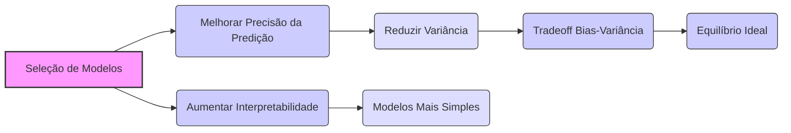
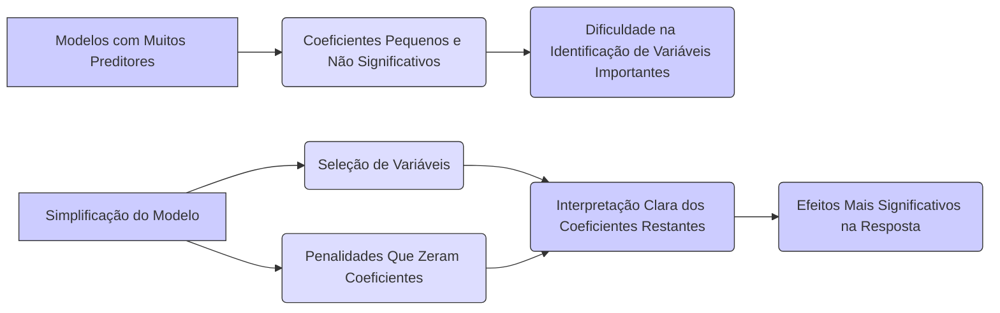

## Motivações para Seleção de Modelos: Melhorar a Precisão da Predição Reduzindo a Variância e Aumentar a Interpretação do Modelo



### Introdução

A seleção de modelos em regressão linear é uma etapa crucial que vai além da simples busca pelo melhor ajuste aos dados de treinamento [^1]. Os modelos obtidos por mínimos quadrados, apesar de sua simplicidade e facilidade de implementação, muitas vezes não são ideais para tarefas de predição ou interpretação. Assim, **duas motivações principais** impulsionam a aplicação de técnicas de seleção de modelos: melhorar a precisão da predição, principalmente através da redução da variância, e aumentar a interpretabilidade dos modelos [^2]. Nesta seção, exploraremos essas motivações em detalhes.

### Motivação 1: Melhorar a Precisão da Predição Reduzindo a Variância

Os modelos ajustados por mínimos quadrados, especialmente em situações com muitos preditores ou multicolinearidade, podem apresentar baixa variância, mas um grande erro quadrático médio (MSE) devido à sua sensibilidade a ruído nos dados de treinamento. Essa alta variância significa que o modelo pode se adaptar excessivamente aos dados específicos, tornando-se pouco generalizável para novos dados [^4].

**Conceito 1: O Tradeoff Bias-Variância**

O conceito central por trás da motivação de melhorar a precisão da predição é o **tradeoff bias-variância**. O erro quadrático médio (MSE) de um modelo preditivo pode ser decomposto em três componentes:
$$ MSE = Bias^2 + Variância + Erro\, Irredutível $$

-   **Bias** (viés): Representa a diferença entre a predição média do modelo e o valor verdadeiro da resposta. Um modelo com alto bias tende a subestimar ou superestimar sistematicamente os valores da resposta [^5].
-   **Variância:** Representa a sensibilidade das predições do modelo a mudanças nos dados de treinamento. Modelos com alta variância se ajustam muito bem aos dados de treinamento, mas generalizam mal para novos dados. Isto é, suas predições variam muito entre diferentes conjuntos de treinamento [^6].
-   **Erro Irredutível:** Representa o ruído inerente nos dados, que não pode ser eliminado por nenhum modelo preditivo [^7].

O objetivo da seleção de modelos é encontrar o equilíbrio ideal entre bias e variância, minimizando o MSE total [^8].

> 💡 **Exemplo Numérico:**
>
> Suponha que temos um modelo linear simples $y = \beta_0 + \beta_1x$ e geramos dados com a relação real $y = 2 + 3x + \epsilon$, onde $\epsilon \sim \mathcal{N}(0, 1)$. Vamos simular dois conjuntos de dados de treinamento e ajustar um modelo linear de mínimos quadrados em cada um.
>
> ```python
> import numpy as np
> import matplotlib.pyplot as plt
> from sklearn.linear_model import LinearRegression
> from sklearn.metrics import mean_squared_error
>
> np.random.seed(42) # para reprodutibilidade
>
> # Função para gerar dados
> def generate_data(n_samples):
>     x = np.linspace(0, 5, n_samples)
>     y_true = 2 + 3 * x
>     y = y_true + np.random.normal(0, 1, n_samples)
>     return x.reshape(-1, 1), y
>
> # Gerar dois conjuntos de dados
> X1, y1 = generate_data(20)
> X2, y2 = generate_data(20)
>
> # Ajustar modelos
> model1 = LinearRegression()
> model1.fit(X1, y1)
>
> model2 = LinearRegression()
> model2.fit(X2, y2)
>
> # Gerar um novo conjunto de teste para avaliar o erro
> X_test, y_test = generate_data(50)
> y_pred1 = model1.predict(X_test)
> y_pred2 = model2.predict(X_test)
>
> # Calcular MSE para cada modelo no conjunto de teste
> mse1 = mean_squared_error(y_test, y_pred1)
> mse2 = mean_squared_error(y_test, y_pred2)
>
> # Calcular predições para bias e variância
> y_pred_mean = (y_pred1 + y_pred2)/2
> bias_squared = np.mean((y_pred_mean - (2+3*X_test.flatten()))**2)
> variance = np.mean((y_pred1 - y_pred_mean)**2 + (y_pred2 - y_pred_mean)**2)/2
>
> print(f"MSE do Modelo 1: {mse1:.2f}")
> print(f"MSE do Modelo 2: {mse2:.2f}")
> print(f"Bias^2: {bias_squared:.2f}")
> print(f"Variância: {variance:.2f}")
> print(f"Erro Irredutível (aproximado): {np.var(np.random.normal(0, 1, 50)):.2f}")
>
> # Visualização
> plt.figure(figsize=(10, 6))
> plt.scatter(X_test, y_test, label='Dados de Teste', color='gray')
> plt.plot(X_test, y_pred1, label='Modelo 1', color='blue')
> plt.plot(X_test, y_pred2, label='Modelo 2', color='red')
> plt.plot(X_test, 2 + 3*X_test, label='Modelo Verdadeiro', color='green', linestyle='--')
> plt.xlabel('X')
> plt.ylabel('y')
> plt.title('Modelos Ajustados em Dados Diferentes')
> plt.legend()
> plt.show()
> ```
>
> Neste exemplo, mesmo os modelos sendo lineares, obtemos valores diferentes para $\beta_0$ e $\beta_1$ em cada amostra, resultando em diferentes predições, o que demonstra a variância. O erro irredutível é aproximado pela variância do ruído adicionado aos dados (1 neste caso). O `bias_squared` e a `variância` calculados ilustram como o MSE é decomposto nessas componentes.

**Lemma 1:** *A redução da complexidade de um modelo, como a redução do número de preditores, geralmente aumenta o bias do modelo, mas pode levar a uma redução na variância*. O ponto ótimo é o balanço entre bias e variância que resulta no menor MSE [^9].

**Prova do Lemma 1:** A redução da complexidade do modelo implica em uma maior simplificação, e portanto a predição média do modelo se afasta da resposta real, resultando em um aumento no bias.  Por outro lado, modelos mais simples são menos sensíveis aos detalhes dos dados de treino e, portanto, apresentam menor variabilidade em diferentes amostras, o que resulta em uma menor variância. O ponto ótimo do tradeoff bias-variância é encontrado quando a soma do quadrado do bias e da variância é minimizada. $\blacksquare$


**Conceito 2: Técnicas para Redução da Variância**

Existem várias técnicas que podem ser utilizadas para reduzir a variância e melhorar a precisão da predição em modelos de regressão linear, incluindo [^10]:

-   **Seleção de Variáveis:** Reduzir o número de preditores no modelo, selecionando apenas aqueles que têm maior influência na variável resposta. Isso pode ser feito utilizando métodos como a seleção de melhor subconjunto, seleção stepwise, e o LARS (Least Angle Regression) [^11].
-   **Regularização:** Impor penalidades aos coeficientes do modelo, levando a estimativas mais estáveis. Métodos como Ridge Regression e Lasso são exemplos de técnicas de regularização que induzem coeficientes menores e, potencialmente, zerados [^12].

**Corolário 1:** *Ao controlar a complexidade do modelo através da seleção de variáveis ou da regularização, buscamos reduzir a variância das estimativas, o que leva a uma melhor generalização para novos dados e a um modelo com melhor desempenho preditivo* [^13].

> 💡 **Exemplo Numérico:**
>
> Vamos considerar um exemplo de seleção de variáveis usando um pequeno conjunto de dados simulados. Suponha que temos uma variável resposta $y$ e três preditores $x_1$, $x_2$ e $x_3$, onde apenas $x_1$ e $x_2$ são relevantes e $x_3$ é um preditor irrelevante.
>
> ```python
> import numpy as np
> import pandas as pd
> from sklearn.linear_model import LinearRegression
> from sklearn.metrics import mean_squared_error
>
> # Gerar dados simulados
> np.random.seed(42)
> n_samples = 100
> x1 = np.random.rand(n_samples)
> x2 = np.random.rand(n_samples)
> x3 = np.random.rand(n_samples)
> y = 2 + 3 * x1 + 1.5 * x2 + np.random.normal(0, 0.5, n_samples)
>
> # Criar DataFrame
> data = pd.DataFrame({'x1': x1, 'x2': x2, 'x3': x3, 'y': y})
>
> # Modelo completo com todos os preditores
> X_full = data[['x1', 'x2', 'x3']]
> model_full = LinearRegression()
> model_full.fit(X_full, data['y'])
> y_pred_full = model_full.predict(X_full)
> mse_full = mean_squared_error(data['y'], y_pred_full)
>
> # Modelo reduzido com apenas x1 e x2
> X_reduced = data[['x1', 'x2']]
>model_reduced = LinearRegression()
>model_reduced.fit(X_reduced, data['y'])
>y_pred_reduced = model_reduced.predict(X_reduced)
>mse_reduced = mean_squared_error(data['y'], y_pred_reduced)
>
> print(f"MSE do modelo completo: {mse_full:.4f}")
> print(f"MSE do modelo reduzido: {mse_reduced:.4f}")
> print("\nCoeficientes do modelo completo:")
> print(pd.Series(model_full.coef_, index = X_full.columns))
> print("\nCoeficientes do modelo reduzido:")
> print(pd.Series(model_reduced.coef_, index = X_reduced.columns))
>
>
> ```
>
> Neste exemplo, o modelo completo inclui o preditor irrelevante $x_3$. Ao remover $x_3$, o modelo reduzido pode ter um MSE menor ou similar, além de ser mais simples e interpretável, ilustrando como a seleção de variáveis pode ajudar a reduzir a variância e melhorar a precisão. Observa-se que o coeficiente de $x_3$ no modelo completo é pequeno, indicando sua pouca influência no modelo.

### Motivação 2: Aumentar a Interpretabilidade do Modelo

A segunda motivação para a seleção de modelos é aumentar a **interpretabilidade** dos resultados [^14]. Em modelos com muitos preditores, pode ser difícil entender a influência de cada variável na resposta. Modelos mais simples, com menos preditores, são mais fáceis de interpretar e permitem obter insights mais significativos sobre o processo modelado [^15].

**Conceito 3: Sparsity e Interpretabilidade**

A **sparsity**, ou seja, a propriedade de um modelo ter poucos coeficientes não-nulos, é um conceito chave para a interpretabilidade. Em modelos com muitos preditores, as estimativas de mínimos quadrados podem ter muitos coeficientes pequenos e não significativos, dificultando a identificação das variáveis realmente importantes [^16]. Ao simplificar o modelo, seja pela seleção de variáveis ou pela imposição de penalidades que zeram os coeficientes menos relevantes, a interpretação dos coeficientes restantes torna-se mais clara, pois eles representam os efeitos mais significativos na resposta [^17].



**Lemma 2:** *Modelos esparsos, com poucos coeficientes não-nulos, são mais interpretáveis pois focam nos fatores mais importantes*. Isso facilita a compreensão da relação entre preditores e variável resposta [^18].

**Prova do Lemma 2:** Um modelo esparso simplifica a equação de predição, reduzindo o número de variáveis que influenciam o resultado. Esta simplificação torna a interpretação dos coeficientes remanescentes mais direta, uma vez que representam os efeitos mais fortes e significativos nas predições do modelo. $\blacksquare$

**Conceito 4: Métodos para Aumentar a Interpretabilidade**

Algumas técnicas que ajudam a aumentar a interpretabilidade dos modelos incluem:
-   **Seleção de Variáveis**: Além de reduzir a variância, a seleção de variáveis também aumenta a interpretabilidade ao focar nos preditores mais relevantes e remover as variáveis redundantes ou pouco informativas [^19].
-   **Lasso:** A penalidade L1 do Lasso promove a sparsity, levando a modelos mais simples e fáceis de entender [^20].
-   **Redução de Dimensionalidade:** Técnicas como a análise de componentes principais (PCA) ou a projeção em espaços de menor dimensão podem reduzir a complexidade dos dados e criar modelos mais interpretáveis.

**Corolário 2:** *Modelos com menos preditores ou com coeficientes zerados, resultantes de técnicas de seleção ou regularização, fornecem uma compreensão mais clara e precisa dos efeitos de cada variável na resposta, o que leva a uma maior interpretabilidade dos resultados* [^21].

> 💡 **Exemplo Numérico:**
>
> Para ilustrar a interpretabilidade com o Lasso, vamos simular um conjunto de dados com um número maior de preditores, onde apenas alguns são realmente relevantes:
>
> ```python
> import numpy as np
> import pandas as pd
> from sklearn.linear_model import Lasso
> from sklearn.metrics import mean_squared_error
>
> # Gerar dados simulados
> np.random.seed(42)
> n_samples = 100
> n_features = 10
> X = np.random.rand(n_samples, n_features)
> # Criar uma relação esparsa
> true_coefs = np.array([3, 1.5, 0, 0, 2, 0, 0, 0, 0.5, 0]) # Apenas alguns coeficientes são não-nulos
> y = 2 + X @ true_coefs + np.random.normal(0, 0.5, n_samples)
>
> # Ajustar modelo Lasso com um valor de alpha
> alpha = 0.1
> lasso = Lasso(alpha=alpha)
> lasso.fit(X, y)
>
> # Ajustar modelo de mínimos quadrados
> ols = LinearRegression()
> ols.fit(X,y)
>
> # Visualizar coeficientes
> print("Coeficientes verdadeiros:")
> print(pd.Series(true_coefs))
> print("\nCoeficientes Lasso:")
> print(pd.Series(lasso.coef_))
> print("\nCoeficientes OLS:")
> print(pd.Series(ols.coef_))
>
> # Calcular MSE
> y_pred_lasso = lasso.predict(X)
> mse_lasso = mean_squared_error(y, y_pred_lasso)
>
> y_pred_ols = ols.predict(X)
> mse_ols = mean_squared_error(y, y_pred_ols)
>
> print(f"\nMSE do modelo Lasso: {mse_lasso:.4f}")
> print(f"MSE do modelo OLS: {mse_ols:.4f}")
>
> ```
>
> Neste exemplo, o Lasso zera os coeficientes das variáveis menos importantes, promovendo a sparsity e facilitando a identificação dos preditores mais relevantes. Comparado ao modelo de mínimos quadrados (OLS), que não faz seleção, o Lasso resulta em um modelo mais interpretável.

### Equilíbrio entre Precisão e Interpretabilidade

É importante notar que existe um equilíbrio entre a precisão da predição e a interpretabilidade do modelo. *Modelos altamente precisos podem ser complexos e difíceis de interpretar, enquanto modelos mais simples podem ter um desempenho preditivo ligeiramente inferior, mas serão mais fáceis de entender*. A escolha do modelo ideal depende do objetivo específico da análise, da natureza dos dados, e do conhecimento do domínio do problema [^22].

### Pergunta Teórica Avançada: Como a Escolha entre Métodos de Seleção de Variáveis e Regularização Afeta o Tradeoff Bias-Variância e a Interpretabilidade dos Modelos em Contextos de Alta Dimensionalidade?

**Resposta:**
A escolha entre métodos de seleção de variáveis (como forward stepwise e best subset) e métodos de regularização (como Ridge e Lasso) afeta de maneira distinta o tradeoff bias-variância e a interpretabilidade dos modelos, especialmente em contextos de alta dimensionalidade [^23].

- **Seleção de Variáveis:** Métodos de seleção de variáveis tendem a produzir modelos esparsos, onde um subconjunto dos preditores é selecionado enquanto os demais são descartados [^24]. Esta abordagem pode aumentar o bias do modelo devido à simplificação excessiva, mas também pode reduzir significativamente a variância, uma vez que modelos com menos parâmetros tendem a ser mais estáveis. A interpretabilidade é geralmente aumentada devido à identificação de um conjunto menor de preditores que são considerados mais relevantes [^25].
- **Regularização:** Métodos de regularização, como Ridge Regression (L2) e Lasso (L1), adicionam um termo de penalidade à função de perda, forçando os coeficientes do modelo a serem menores [^26]. Ridge Regression reduz a variância e estabiliza os coeficientes, mas raramente zera algum dos coeficientes. O Lasso, por outro lado, promove a sparsity, podendo levar a alguns coeficientes exatamente iguais a zero, o que melhora a interpretabilidade ao remover preditores irrelevantes e facilitar a identificação de quais são as variáveis mais importantes [^27].
-   **Contexto de Alta Dimensionalidade:** Em contextos de alta dimensionalidade (onde o número de preditores se aproxima ou excede o número de observações), a seleção de variáveis pode ser mais instável, com alta variância, e modelos esparsos podem ser preferidos pois tendem a apresentar um melhor desempenho [^28]. Regularização como o Lasso são particularmente adequadas para esses cenários pois induzem sparsity e melhoram a estabilidade dos parâmetros.
-   **Tradeoff Bias-Variância:** A escolha entre seleção e regularização depende do equilíbrio desejado entre bias e variância. Seleção de variáveis pode ser preferível quando modelos simples e altamente interpretáveis são o objetivo principal, enquanto métodos de regularização são preferíveis quando a precisão preditiva é mais importante e um pequeno aumento de bias é tolerável [^29].

**Em resumo:** *a escolha entre seleção de variáveis e regularização é uma escolha entre aumentar a interpretabilidade, que é inerente à seleção, e diminuir a variância (e portanto melhorar a predição), que é promovido pela regularização*. Ambas as técnicas lidam com o tradeoff bias-variância de maneira diferente, e sua aplicação deve ser guiada pelos objetivos específicos da análise [^30].

```mermaid
graph LR
    A["Seleção de Variáveis"] --> B("Modelos Esparsos");
    B --> C("Aumento do Bias (Simplificação)");
    B --> D("Redução da Variância (Menos Parâmetros)");
    B --> E("Aumento da Interpretabilidade (Menos Preditoress)");
    F["Regularização"] --> G("Redução da Variância (Estabilização dos Coeficientes)");
    F --> H("Penalidade na Função de Perda");
     H --> I("Ridge(L2): Não Zera Coeficientes");
     H --> J("Lasso(L1): Promove Sparsity");
    J --> K("Remoção de Preditores Irrelevantes");
    K --> L ("Melhoria na Interpretabilidade");
    
     style A fill:#ccf,stroke:#333,stroke-width:1px
     style B fill:#ddf,stroke:#333,stroke-width:1px
      style C fill:#ccf,stroke:#333,stroke-width:1px
      style D fill:#ccf,stroke:#333,stroke-width:1px
       style E fill:#ccf,stroke:#333,stroke-width:1px
      style F fill:#ccf,stroke:#333,stroke-width:1px
       style G fill:#ddf,stroke:#333,stroke-width:1px
      style H fill:#ccf,stroke:#333,stroke-width:1px
      style I fill:#ddf,stroke:#333,stroke-width:1px
      style J fill:#ddf,stroke:#333,stroke-width:1px
      style K fill:#ccf,stroke:#333,stroke-width:1px
      style L fill:#ccf,stroke:#333,stroke-width:1px
```


> 💡 **Exemplo Numérico:**
>
> Vamos comparar o efeito de Ridge e Lasso em um conjunto de dados com alta dimensionalidade, onde o número de preditores é maior que o número de amostras. Este exemplo ilustra como diferentes técnicas de regularização podem afetar o tradeoff bias-variância e a interpretabilidade:
>
> ```python
> import numpy as np
> import pandas as pd
> from sklearn.linear_model import Ridge, Lasso, LinearRegression
> from sklearn.metrics import mean_squared_error
>
> # Gerar dados simulados de alta dimensionalidade
> np.random.seed(42)
> n_samples = 50
> n_features = 100
> X = np.random.rand(n_samples, n_features)
> true_coefs = np.random.normal(0, 1, n_features)
> # Tornar a relação esparsa
> true_coefs[np.random.choice(n_features, size = 70, replace = False)] = 0
> y = 2 + X @ true_coefs + np.random.normal(0, 1, n_samples)
>
> # Ajustar modelos com diferentes valores de alpha
> alphas = [0.1, 1, 10]
> ridge_models = []
> lasso_models = []
>
> for alpha in alphas:
>    ridge = Ridge(alpha=alpha)
>    ridge.fit(X,y)
>    ridge_models.append(ridge)
>    lasso = Lasso(alpha=alpha)
>    lasso.fit(X,y)
>    lasso_models.append(lasso)
>
> # Ajustar modelo OLS
> ols = LinearRegression()
> ols.fit(X,y)
>
> # Comparar os resultados
> print(f"Coeficientes verdadeiros: {np.sum(true_coefs != 0)} não-nulos")
> print("\nResultados:")
>
> results = []
> for i, alpha in enumerate(alphas):
>     y_pred_ridge = ridge_models[i].predict(X)
>     mse_ridge = mean_squared_error(y, y_pred_ridge)
>     non_zero_ridge = np.sum(ridge_models[i].coef_ != 0)
>     y_pred_lasso = lasso_models[i].predict(X)
>     mse_lasso = mean_squared_error(y, y_pred_lasso)
>     non_zero_lasso = np.sum(lasso_models[i].coef_ != 0)
>     results.append([alpha, mse_ridge, non_zero_ridge, mse_lasso, non_zero_lasso])
>
> y_pred_ols = ols.predict(X)
> mse_ols = mean_squared_error(y, y_pred_ols)
> non_zero_ols = np.sum(ols.coef_ != 0)
> results.append(['OLS', mse_ols, non_zero_ols, None, None])
>
> results_df = pd.DataFrame(results, columns=['Alpha', 'MSE Ridge', 'Non-Zero Ridge', 'MSE Lasso', 'Non-Zero Lasso'])
> print(results_df)
> ```
>
> Neste exemplo, podemos observar que o Lasso, com um valor de $\alpha$ maior, tende a ter mais coeficientes zerados, promovendo maior interpretabilidade, enquanto o Ridge reduz os coeficientes, mas não necessariamente os zera. O modelo OLS, sem regularização, apresenta um MSE maior, indicando que a regularização é importante em casos de alta dimensionalidade.

### Conclusão

A seleção de modelos é um processo crítico na análise de regressão linear, motivado pela necessidade de melhorar a precisão da predição através da redução da variância e de aumentar a interpretabilidade dos modelos através da sparsity [^31]. Tanto as técnicas de seleção de variáveis quanto os métodos de regularização buscam esse objetivo, embora afetem o tradeoff bias-variância de formas distintas. A escolha da melhor estratégia depende da aplicação específica, da natureza dos dados e dos objetivos do analista [^32].

### Referências
[^1]: "Linear models were largely developed in the precomputer age of statistics, but even in today's computer era there are still good reasons to study and use them."
[^2]: "They are simple and often provide an adequate and interpretable description of how the inputs affect the output."
[^3]: "In this chapter we describe linear methods for regression..."
[^4]: "The linear model either assumes that the regression function E(Y|X) is linear, or that the linear model is a reasonable approximation."
[^5]: "The most popular estimation method is least squares, in which we pick the coefficients β = (β0, β1, ..., βp)T to minimize the residual sum of squares"
[^6]: "The linear model has the form f(x) = β0 + Σj=1 pXjβj."
[^7]: "From a statistical point of view, this criterion is reasonable if the training observations (xi, Yi) represent independent random draws from their population."
[^8]: "Even if the xi's were not drawn randomly, the criterion is still valid if the yi's are conditionally independent given the inputs xi."
[^9]: "Figure 3.1 illustrates the geometry of least-squares fitting in the IRp+1-dimensional space occupied by the pairs (X, Y)."
[^10]: "Note that (3.2) makes no assumptions about the validity of model (3.1); it simply finds the best linear fit to the data."
[^11]: "Least squares fitting is intuitively satisfying no matter how the data arise; the criterion measures the average lack of fit."
[^12]: "How do we minimize (3.2)? Denote by X the N x (p + 1) matrix with each row an input vector (with a 1 in the first position), and similarly let y be the N-vector of outputs in the training set."
[^13]: "Then we can write the residual sum-of-squares as RSS(β) = (y - Xβ)T(y - Xβ)."
[^14]: "This is a quadratic function in the p + 1 parameters. Differentiating with respect to β we obtain"
[^15]: "Assuming (for the moment) that X has full column rank, and hence XTX is positive definite, we set the first derivative to zero XTY - XTXβ = 0."
[^16]: "To obtain the unique solution β = (XTX)-1XTY."
[^17]: "The predicted values at an input vector x0 are given by f(x0) = (1 x0)Tβ; the fitted values at the training inputs are ŷ = Xβ = X(XTX)-1XTY."
[^18]: "The matrix H = X(XTX)-1XT appearing in equation (3.7) is sometimes called the “hat” matrix because it puts the hat on y."
[^19]: "Figure 3.2 shows a different geometrical representation of the least squares estimate, this time in IRN."
[^20]: "We denote the column vectors of X by x0, x1,..., xp, with x0 = 1. For much of what follows, this first column is treated like any other. These vectors span a subspace of IRN, also referred to as the column space of X."
[^21]: "We minimize RSS(β) = ||y - Xβ||2 by choosing β so that the residual vector y - ŷ is orthogonal to this subspace."
[^22]: "This orthogonality is expressed in (3.5), and the resulting estimate ŷ is hence the orthogonal pro- jection of y onto this subspace."
[^23]: "The hat matrix H computes the orthogonal projection, and hence it is also known as a projection matrix."
[^24]: "The non-full-rank case occurs most often when one or more qualitative inputs are coded in a redundant fashion."
[^25]: "There is usually a natural way to resolve the non-unique representation, by recoding and/or dropping redundant columns in X."
[^26]: "Up to now we have made minimal assumptions about the true distribution of the data."
[^27]: "In order to pin down the sampling properties of β, we now assume that the observations yi are uncorrelated and have constant variance σ², and that the xi are fixed (non random)."
[^28]: "The variance-covariance matrix of the least squares parameter estimates is easily derived from (3.6) and is given by Var(β) = (XTX)-1σ2."
[^29]: "Typically one estimates the variance σ² by ô² = (1/(N-p-1)) Σi(Yi-Ŷi)²."
[^30]: "To test the hypothesis that a particular coefficient βj = 0, we form the standardized coefficient or Z-score Zj = βj /ô√vj, where vj is the jth diagonal element of (XTX)-1."
[^31]: "Under the null hypothesis that βj = 0, zj is distributed as tN-p-1 (a t distribution with N – p – 1 degrees of freedom)"
[^32]: "Often we need to test for the significance of groups of coefficients simultaneously."
