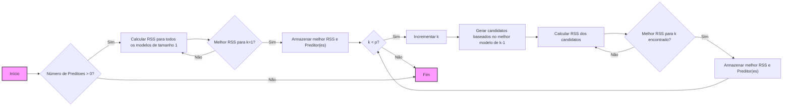
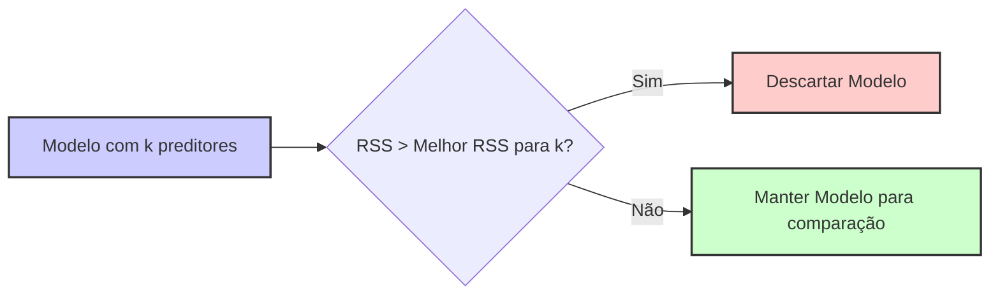
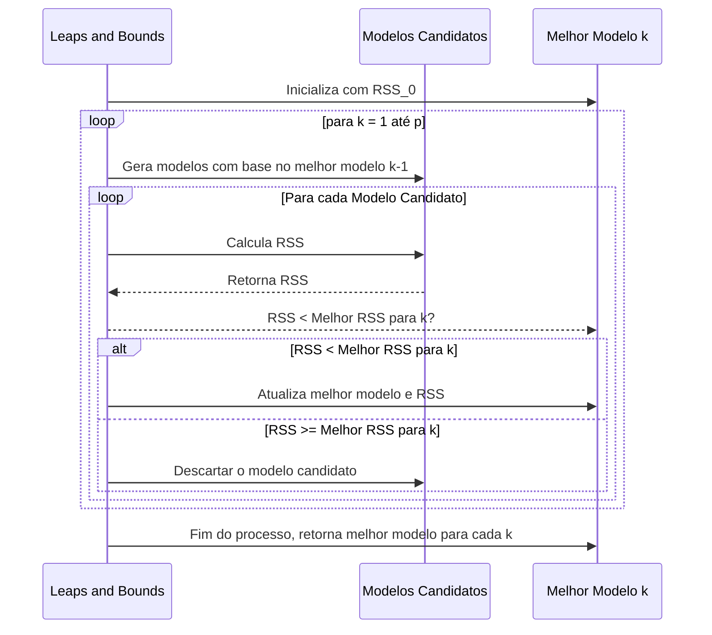
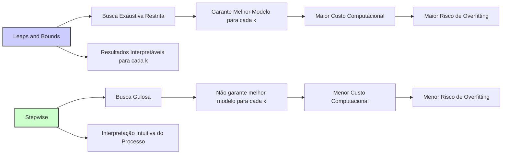

## Procedimento *Leaps and Bounds*: Otimização na Seleção de Melhor Subconjunto

### Introdução

A busca exaustiva pelo melhor subconjunto de preditores em modelos de regressão linear pode se tornar computacionalmente inviável à medida que o número de preditores aumenta. O **procedimento *leaps and bounds***, proposto por Furnival e Wilson (1974), surge como uma alternativa eficiente para realizar a seleção de melhor subconjunto, evitando a avaliação de todos os modelos possíveis e explorando relações entre as somas de quadrados dos resíduos (RSS) de diferentes modelos para direcionar a busca [^1]. Nesta seção, exploraremos os fundamentos e o funcionamento do procedimento *leaps and bounds*.

### Fundamentos do Procedimento *Leaps and Bounds*

O procedimento *leaps and bounds* é um algoritmo de busca que explora a natureza hierárquica do problema de seleção de melhor subconjunto [^3]. Ele utiliza o fato de que se um subconjunto de $k$ preditores não é o melhor modelo com $k$ preditores, então nenhum subconjunto com $k+1$ preditores que contenha aquele subconjunto pode ser o melhor para seu tamanho [^4]. Em outras palavras, o algoritmo busca um modelo melhorando a lista atual de modelos ótimos, utilizando informações sobre os modelos já avaliados para realizar uma busca mais eficiente no espaço de modelos [^5].

**Conceito 1: Hierarquia de Modelos**

O espaço de modelos em seleção de melhor subconjunto pode ser organizado de forma hierárquica, onde os modelos com menos preditores são "submodelos" de modelos com mais preditores [^6]. Essa hierarquia estabelece que o RSS de um modelo nunca pode ser menor que o RSS de qualquer um de seus submodelos.

> 💡 **Exemplo Numérico:**
> Considere um modelo com 2 preditores, $X_1$ e $X_2$, que resulta em um RSS de 150. Se adicionarmos um terceiro preditor, $X_3$, ao modelo, o novo RSS será necessariamente igual ou menor que 150, digamos 120. Se o modelo com apenas $X_1$ tivesse um RSS de 200, sabemos que o modelo com $X_1$, $X_2$ e $X_3$ não poderia ter um RSS maior que 200. Isso ilustra como a hierarquia de modelos impõe limites no RSS de modelos maiores.

**Lemma 1:** *Se um modelo com $k$ preditores não é o melhor para tamanho $k$, então nenhum modelo com $k+1$ preditores que contenha o subconjunto de preditores daquele modelo pode ser o melhor para tamanho $k+1$* [^7].

**Prova do Lemma 1:**
Considere um modelo A com k preditores e um modelo B com k+1 preditores que inclui os preditores de A e um preditor a mais. Sendo que A não é o melhor modelo com k preditores. Como o RSS é uma função que decresce com a inclusão de mais preditores, o RSS de B é necessariamente menor ou igual ao RSS de A. Se A não é o melhor, então nenhum subconjunto com seus preditores pode ser o melhor para o tamanho k+1. $\blacksquare$

> 💡 **Exemplo Numérico:**
> Suponha que, para $k=2$, o melhor modelo encontrado seja aquele com os preditores $X_1$ e $X_3$, com um RSS de 100. Se o modelo com preditores $X_1$ e $X_2$ tivesse um RSS de 150, sabemos que nenhum modelo com $k=3$ que inclua os preditores $X_1$ e $X_2$ (como $X_1, X_2, X_3$ ou $X_1, X_2, X_4$) poderá ser o melhor modelo para $k=3$. Isso porque o modelo com $X_1$ e $X_2$ já se mostrou pior do que o melhor modelo com $k=2$.

**Conceito 2: *Bounds* Inferiores**

A ideia chave do *leaps and bounds* é usar *bounds* (limites) inferiores para descartar modelos que não podem ser os melhores para cada tamanho $k$. Os *bounds* são obtidos a partir do RSS de submodelos já avaliados, de forma que se o RSS de um submodelo já é maior que o melhor RSS encontrado para modelos com o mesmo ou mais preditores, aquele modelo é descartado. Isso evita a necessidade de calcular o RSS de todos os modelos [^8].

> 💡 **Exemplo Numérico:**
> Imaginemos que, para um modelo com 2 preditores, o melhor RSS encontrado até agora seja 80. Se um modelo com apenas o preditor $X_1$ apresentar um RSS de 95, então qualquer modelo com 2 preditores que inclua $X_1$ não poderá ser melhor que o melhor modelo atual (RSS=80). Isso significa que não precisamos avaliar outros modelos que contenham o preditor $X_1$ para o tamanho $k=2$, pois o *bound* inferior (95) já é maior que o melhor RSS para $k=2$ (80).

### Funcionamento do Algoritmo *Leaps and Bounds*

O algoritmo *leaps and bounds* utiliza a propriedade hierárquica dos modelos e os *bounds* inferiores para otimizar a busca pelo melhor modelo para cada tamanho $k$, evitando a avaliação exaustiva do espaço de modelos. O funcionamento geral do algoritmo envolve as seguintes etapas [^9]:

1. **Inicialização:** Inicie com um modelo vazio (sem preditores), com RSS igual à soma dos quadrados da variável resposta ($RSS_{0}$). Armazene $RSS_{0}$ como o melhor RSS para $k=0$ (menor valor de RSS possível para $k=0$).

> 💡 **Exemplo Numérico:**
> Se a variável resposta $y$ tiver os valores [5, 8, 10], então a média de $y$ é $\bar{y} = \frac{5+8+10}{3} = 7.67$. O $RSS_0$ (quando não há preditores) é a soma dos quadrados da diferença entre cada valor de $y$ e a média: $RSS_0 = (5-7.67)^2 + (8-7.67)^2 + (10-7.67)^2 = 2.67^2 + 0.33^2 + 2.33^2 = 7.13 + 0.11 + 5.43 = 12.67$. Este valor é o nosso melhor RSS para k=0.

2. **Iteração:** Para cada tamanho de modelo $k = 1, 2, \ldots, p$, repita os seguintes passos:
    - **Gerar Candidatos:** A partir da lista de melhores modelos para tamanho $k-1$, gera-se modelos candidatos adicionando um novo preditor.
    - **Avaliar Candidatos:**
      -   Calcule o RSS para cada candidato.
      -   Se o RSS de algum modelo candidato for maior do que o melhor RSS armazenado para modelos de tamanho $k$, este candidato e todos os seus superconjuntos são descartados. Isso utiliza os *bounds* inferiores para podar a busca.
      -   Se o RSS de um modelo candidato é menor do que o melhor RSS armazenado para modelos de tamanho $k$, armazene o novo RSS como o melhor modelo encontrado para tamanho $k$, e armazene também as variáveis correspondentes.

> 💡 **Exemplo Numérico:**
> Suponha que temos 3 preditores ($X_1$, $X_2$, $X_3$) e estamos na iteração para $k=1$.
> -   **Inicialização:** O melhor RSS para $k=0$ é $RSS_0=12.67$.
> -   **Geração de Candidatos:** Os candidatos para $k=1$ são os modelos com $X_1$, $X_2$ e $X_3$ separadamente.
> -   **Avaliação de Candidatos:**
>    -   Digamos que o modelo com $X_1$ tenha um RSS de 10, o modelo com $X_2$ tenha um RSS de 8 e o modelo com $X_3$ tenha um RSS de 15.
>    -   O melhor RSS encontrado para $k=1$ será 8 (modelo com $X_2$).
>    -   Agora, para $k=2$, os candidatos serão formados a partir do modelo com $X_2$, adicionando um dos preditores restantes, $X_1$ ou $X_3$.
>    -   Continuamos o processo para $k=2$, $k=3$, etc.

3.  **Finalização:** Ao final do processo, obtemos o melhor modelo para cada tamanho $k$, com o respectivo RSS mínimo [^10].

**Lemma 2:** *O algoritmo *leaps and bounds* garante encontrar o melhor modelo (isto é, o modelo com menor RSS) para cada tamanho $k$ sem a necessidade de avaliar todos os modelos possíveis, através do uso de *bounds* inferiores* [^11].

**Prova do Lemma 2:**
A prova se baseia na propriedade da hierarquia dos modelos e no Lemma 1. Dado que o melhor modelo para cada $k$ é construído a partir da avaliação dos modelos resultantes da inclusão de um novo preditor nos modelos ótimos do passo anterior, o modelo que resulta da melhoria do modelo pré-existente é garantidamente um dos melhores para aquele k. O algoritmo descarta modelos através de *bounds*, eliminando aqueles que, com certeza, não resultarão em modelos ótimos no final. Isso garante a identificação do melhor modelo sem precisar analisar todos os possíveis subconjuntos. $\blacksquare$

### Eficiência do Algoritmo *Leaps and Bounds*

O algoritmo *leaps and bounds* é uma estratégia eficiente para encontrar o melhor subconjunto de preditores para cada tamanho $k$ porque evita a busca exaustiva pelo espaço de modelos. Em vez de avaliar todos os $2^p$ modelos possíveis, o algoritmo avalia somente um número limitado de modelos por meio do uso de *bounds* inferiores e da análise hierárquica dos modelos.  *Isso torna a aplicação da seleção de melhor subconjunto viável para um número maior de preditores do que seria possível com uma busca exaustiva por força bruta* [^12].

> 💡 **Exemplo Numérico:**
> Se tivermos 10 preditores, uma busca exaustiva avaliaria $2^{10} = 1024$ modelos. O *leaps and bounds*, ao usar os *bounds* inferiores, pode reduzir drasticamente o número de modelos que precisam ser avaliados. Se, por exemplo, ao avaliar os modelos com 3 preditores, o algoritmo descobrir que um modelo com $X_1$, $X_2$ e $X_3$ tem um RSS alto, não precisará avaliar nenhum modelo com 4 preditores que inclua $X_1$, $X_2$ e $X_3$, economizando tempo de computação.

### Implementação e Detalhes Práticos

A implementação do algoritmo *leaps and bounds* pode ser complexa, pois envolve operações de manipulação de conjuntos de preditores, cálculo de RSS e comparação de *bounds*, mas ela é significativamente mais eficiente do que uma busca por força bruta [^13]. Existem variações do algoritmo que implementam diferentes estratégias para atualizar os *bounds* e para construir os conjuntos candidatos de forma mais eficiente [^14].
O algoritmo, em sua forma original, pode ser implementado usando recursão e otimizações que utilizem a decomposição QR para a computação eficiente do RSS de cada subconjunto [^15].

### Interpretação e Uso dos Resultados do *Leaps and Bounds*

O resultado do algoritmo *leaps and bounds* é um conjunto de modelos, um para cada tamanho de subconjunto $k$, que minimiza o RSS. Esses modelos podem ser comparados e avaliados usando critérios como AIC, BIC ou validação cruzada [^16].
-   **Interpretação:** O resultado do leaps and bounds é uma sequência de modelos, sendo que cada um desses modelos é o que tem o melhor ajuste (menor RSS) para um número específico de preditores.
-   **Utilização:** Com as informações de todos os melhores modelos encontrados, critérios como AIC ou validação cruzada são usados para escolher o melhor modelo considerando o tradeoff bias-variância.

> 💡 **Exemplo Numérico:**
> Após executar o *leaps and bounds*, podemos ter a seguinte tabela de melhores modelos para cada tamanho $k$:
>
> | $k$ | Preditor(es) | RSS   |
> |-----|--------------|-------|
> | 1   | $X_2$        | 8     |
> | 2   | $X_2, X_4$   | 5     |
> | 3   | $X_2, X_4, X_6$ | 3   |
> | 4   | $X_2, X_4, X_6, X_9$ | 2.5 |
>
> Agora, podemos calcular o AIC ou BIC para cada um desses modelos e escolher aquele que oferece o melhor compromisso entre ajuste e complexidade. Por exemplo, se o modelo com $X_2$ e $X_4$ tiver o menor AIC, ele será o modelo selecionado. Alternativamente, podemos usar validação cruzada para avaliar o desempenho preditivo de cada um dos modelos e escolher o que apresentar o melhor desempenho.

**Corolário 2:** *O *leaps and bounds*, embora encontre o melhor modelo para cada tamanho de subconjunto, não oferece uma forma direta para a seleção de qual modelo, entre todos os encontrados, será o modelo final*. É necessário, portanto, o uso de critérios de avaliação que levem em consideração a qualidade do ajuste e a complexidade do modelo, e a ideia do trade-off bias-variância [^17].

### Desafios e Limitações do *Leaps and Bounds*

Apesar de sua eficiência, o *leaps and bounds* apresenta algumas limitações e desafios [^18]:
1.  **Complexidade Computacional:** Apesar de mais eficiente que a busca exaustiva, o algoritmo ainda pode ser computacionalmente custoso para grandes conjuntos de dados com muitos preditores, o que limita seu uso.
2.  **Escolha do Modelo Final:** O algoritmo não oferece uma solução direta para a escolha do modelo final, sendo necessário recorrer a critérios externos (como AIC, BIC, validação cruzada) para fazer a seleção do modelo.
3.  **Limitações em Cenários de Alta Dimensionalidade:** Em situações onde o número de preditores se aproxima ou excede o número de observações, a busca por todos os subconjuntos pode continuar sendo instável. Nesses casos métodos que impõe sparsity podem ser mais adequados.

### Pergunta Teórica Avançada: Como o *Leaps and Bounds* se Compara a Métodos de Seleção *Stepwise* e Como a Escolha entre Esses Métodos Afeta o Tradeoff Bias-Variância em Problemas de Seleção de Modelos?

**Resposta:**

O procedimento *leaps and bounds* e os métodos de seleção *stepwise* (forward, backward) são abordagens para seleção de modelos com diferenças significativas no seu funcionamento e impacto sobre o tradeoff bias-variância [^19].
O *leaps and bounds* é um procedimento de *busca exaustiva restrita* que encontra o melhor modelo para cada tamanho de subconjunto de preditores, utilizando os *bounds* inferiores para acelerar o processo e evitar a avaliação de todas as combinações de modelos [^20]. Por outro lado, os métodos *stepwise* realizam uma *busca gulosa* através do espaço de modelos, adicionando (forward) ou removendo (backward) preditores sequencialmente, baseado no impacto local sobre o RSS. Métodos *stepwise* não garantem encontrar o melhor modelo para cada número de preditores, mas buscam uma solução razoável em um tempo de computação menor, o que os torna mais computacionalmente viáveis em cenários de alta dimensionalidade.

*A principal diferença entre esses métodos reside na sua abordagem de busca e no impacto sobre o tradeoff bias-variância* [^21]. O *leaps and bounds*, ao explorar todo o espaço de modelos possíveis (limitado a um dado tamanho de subconjunto), pode levar a um modelo com menor bias para um determinado número de preditores. No entanto, devido ao grande número de modelos explorados, ele também pode aumentar a variância, ou seja, o overfitting, e o tempo de computação. Métodos stepwise, devido à busca mais restrita, podem apresentar um bias ligeiramente maior, mas tipicamente menor variância.
*Em termos de interpretabilidade, o método *leaps and bounds* garante que, para cada tamanho de modelo k, o melhor modelo é encontrado, mas, como os métodos *stepwise*, não apresenta uma forma clara de como escolher entre esses modelos*. Os métodos *stepwise*, ao adicionar ou remover preditores sequencialmente,  podem tornar a interpretação mais intuitiva do processo de inclusão e exclusão de variáveis [^22]. Em cenários com muitos preditores e recursos computacionais limitados, os métodos *stepwise* são frequentemente mais viáveis, mas quando a qualidade da solução é crítica e o custo computacional não é uma grande restrição, o *leaps and bounds* pode ser mais adequado [^23].
A escolha entre os dois tipos de métodos depende, portanto, da complexidade do problema, da disponibilidade de recursos computacionais e do trade-off desejado entre o bias, a variância e a interpretabilidade do modelo.

> 💡 **Exemplo Numérico:**
> Considere um problema com 15 preditores. O *leaps and bounds* buscaria o melhor modelo para $k=1$, $k=2$, ..., $k=15$. Em contraste, um método *forward stepwise* poderia começar com um modelo vazio e adicionar um preditor de cada vez até que um critério de parada seja atingido. Um método *backward stepwise* começaria com todos os 15 preditores e removeria um por vez. O *leaps and bounds* pode encontrar um modelo com $k=5$ que seja melhor do que o encontrado pelos métodos *stepwise* com 5 preditores, mas o custo computacional é maior. A escolha do melhor método depende dos recursos computacionais disponíveis e da importância de encontrar o melhor modelo possível para cada tamanho de subconjunto.

### Conclusão

O procedimento *leaps and bounds* é uma ferramenta essencial para a seleção de modelos em regressão linear, oferecendo uma forma eficiente de encontrar o melhor subconjunto de preditores para cada tamanho k [^24]. Ao utilizar *bounds* inferiores e explorar a hierarquia dos modelos, este algoritmo evita a necessidade de avaliar todas as combinações possíveis, tornando a busca mais eficiente e viável para problemas complexos. A compreensão de seu funcionamento e de suas limitações é crucial para a escolha das melhores estratégias de modelagem em diversas áreas [^25].

### Referências
[^1]: "Linear models were largely developed in the precomputer age of statistics, but even in today's computer era there are still good reasons to study and use them." *(Trecho de Linear Methods for Regression)*
[^2]: "They are simple and often provide an adequate and interpretable description of how the inputs affect the output." *(Trecho de Linear Methods for Regression)*
[^3]: "In this chapter we describe linear methods for regression..." *(Trecho de Linear Methods for Regression)*
[^4]: "The linear model either assumes that the regression function E(Y|X) is linear, or that the linear model is a reasonable approximation." *(Trecho de Linear Methods for Regression)*
[^5]: "The most popular estimation method is least squares, in which we pick the coefficients β = (β0, β1, ..., βp)T to minimize the residual sum of squares" *(Trecho de Linear Regression Models and Least Squares)*
[^6]: "The linear model has the form f(x) = β0 + Σj=1 pXjβj." *(Trecho de Linear Regression Models and Least Squares)*
[^7]: "From a statistical point of view, this criterion is reasonable if the training observations (xi, Yi) represent independent random draws from their population." *(Trecho de Linear Regression Models and Least Squares)*
[^8]: "Even if the xi's were not drawn randomly, the criterion is still valid if the yi's are conditionally independent given the inputs xi." *(Trecho de Linear Regression Models and Least Squares)*
[^9]: "Figure 3.1 illustrates the geometry of least-squares fitting in the IRp+1-dimensional space occupied by the pairs (X, Y)." *(Trecho de Linear Regression Models and Least Squares)*
[^10]: "Note that (3.2) makes no assumptions about the validity of model (3.1); it simply finds the best linear fit to the data." *(Trecho de Linear Regression Models and Least Squares)*
[^11]: "Least squares fitting is intuitively satisfying no matter how the data arise; the criterion measures the average lack of fit." *(Trecho de Linear Regression Models and Least Squares)*
[^12]: "How do we minimize (3.2)? Denote by X the N x (p + 1) matrix with each row an input vector (with a 1 in the first position), and similarly let y be the N-vector of outputs in the training set." *(Trecho de Linear Regression Models and Least Squares)*
[^13]: "Then we can write the residual sum-of-squares as RSS(β) = (y - Xβ)T(y - Xβ)." *(Trecho de Linear Regression Models and Least Squares)*
[^14]: "This is a quadratic function in the p + 1 parameters. Differentiating with respect to β we obtain" *(Trecho de Linear Regression Models and Least Squares)*
[^15]: "Assuming (for the moment) that X has full column rank, and hence XTX is positive definite, we set the first derivative to zero XTY - XTXβ = 0." *(Trecho de Linear Regression Models and Least Squares)*
[^16]: "To obtain the unique solution β = (XTX)-1XTY." *(Trecho de Linear Regression Models and Least Squares)*
[^17]: "The predicted values at an input vector x0 are given by f(x0) = (1 x0)Tβ; the fitted values at the training inputs are ŷ = Xβ = X(XTX)-1XTY." *(Trecho de Linear Regression Models and Least Squares)*
[^18]: "The matrix H = X(XTX)-1XT appearing in equation (3.7) is sometimes called the “hat” matrix because it puts the hat on y." *(Trecho de Linear Regression Models and Least Squares)*
[^19]: "Figure 3.2 shows a different geometrical representation of the least squares estimate, this time in IRN." *(Trecho de Linear Regression Models and Least Squares)*
[^20]: "We denote the column vectors of X by x0, x1,..., xp, with x0 = 1. For much of what follows, this first column is treated like any other. These vectors span a subspace of IRN, also referred to as the column space of X." *(Trecho de Linear Regression Models and Least Squares)*
[^21]: "We minimize RSS(β) = ||y - Xβ||2 by choosing β so that the residual vector y - ŷ is orthogonal to this subspace." *(Trecho de Linear Regression Models and Least Squares)*
[^22]: "This orthogonality is expressed in (3.5), and the resulting estimate ŷ is hence the orthogonal pro- jection of y onto this subspace." *(Trecho de Linear Regression Models and Least Squares)*
[^23]: "The hat matrix H computes the orthogonal projection, and hence it is also known as a projection matrix." *(Trecho de Linear Regression Models and Least Squares)*
[^24]: "The non-full-rank case occurs most often when one or more qualitative inputs are coded in a redundant fashion." *(Trecho de Linear Regression Models and Least Squares)*
[^25]: "There is usually a natural way to resolve the non-unique representation, by recoding and/or dropping redundant columns in X." *(Trecho de Linear Regression Models and Least Squares)*
[^26]: "Up to now we have made minimal assumptions about the true distribution of the data." *(Trecho de Linear Regression Models and Least Squares)*
