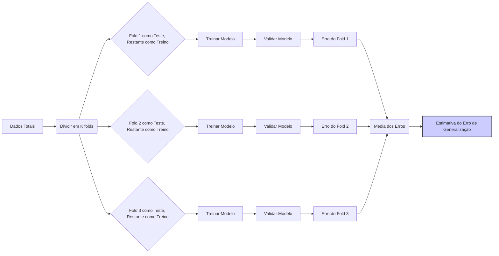
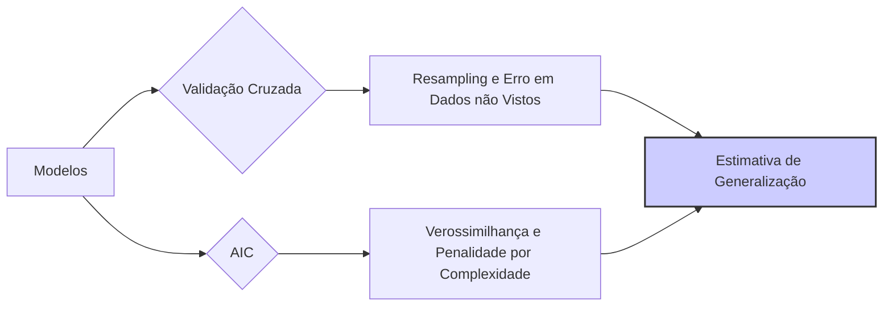

## Tradeoff Bias-Variância na Seleção de Modelos Usando Critérios como Validação Cruzada e AIC

<imagem: Gráfico que ilustra o tradeoff bias-variância, mostrando como o erro quadrático médio (MSE) varia com a complexidade do modelo, indicando como métodos de validação cruzada e AIC tentam encontrar o ponto ótimo desse balanço.>

### Introdução

Em seleção de modelos, a busca pelo modelo ideal envolve equilibrar dois componentes de erro que são intrinsecamente opostos: o **bias** (viés) e a **variância**. Enquanto modelos complexos podem se ajustar muito bem aos dados de treinamento, levando a um baixo bias, eles também podem sofrer de alta variância e generalizar mal para novos dados, resultando em overfitting. Por outro lado, modelos mais simples podem apresentar um alto bias e subajustar os dados, mas tendem a ser mais estáveis e generalizar melhor. Critérios como **validação cruzada** e **AIC** (Critério de Informação de Akaike) são ferramentas importantes para encontrar o melhor balanço entre essas duas fontes de erro [^1]. Nesta seção, exploraremos o tradeoff bias-variância e como esses critérios ajudam a encontrar o modelo mais adequado.

### O Tradeoff Bias-Variância em Detalhe

Em problemas de regressão ou classificação, o objetivo é construir um modelo que minimize o erro de predição em dados não vistos, o que é frequentemente expresso como o erro quadrático médio (MSE - Mean Squared Error) [^3]. O MSE pode ser decomposto em três componentes:
$$ MSE = Bias^2 + Variância + Erro \, Irredutível $$

Onde:
-   **Bias** (viés): É a diferença entre a previsão média do modelo e o valor verdadeiro. Modelos com alto bias tendem a subestimar ou superestimar os valores da resposta [^4].
-   **Variância:** É a variação das previsões do modelo ao se utilizar diferentes conjuntos de treinamento. Modelos com alta variância se adaptam muito aos dados de treinamento, mas têm dificuldade em generalizar para novos dados [^5].
-   **Erro Irredutível:** É a variabilidade inerente nos dados que não pode ser reduzida por nenhum modelo [^6].

**Lemma 1:** *O tradeoff bias-variância estabelece que a tentativa de reduzir o bias de um modelo através do aumento de sua complexidade tende a aumentar a variância e vice-versa.* O desafio em seleção de modelos é, portanto, encontrar a complexidade ideal que equilibre o bias e a variância de forma a minimizar o erro total [^7].

**Prova do Lemma 1:** Modelos complexos (e.g. com muitos parâmetros) são capazes de se adaptar aos dados de treinamento de forma mais detalhada, o que significa que o bias da predição é baixo pois o modelo é capaz de se aproximar do comportamento observado. Contudo, estes modelos complexos são altamente sensíveis a pequenas mudanças nos dados de treino, o que leva a uma alta variância, ou seja, as predições podem mudar drasticamente com pequenas variações nas amostras usadas para treinar o modelo. Em contraste, modelos menos complexos (e.g. com poucos parâmetros) tendem a ter maior bias e menor variância, pois se ajustam menos aos dados de treinamento e suas predições tendem a ser menos afetadas por alterações nos dados usados para o treinamento. O ponto ótimo deste trade-off é aquele que minimiza o MSE. $\blacksquare$

> 💡 **Exemplo Numérico:**
>
> Vamos considerar um cenário de regressão onde queremos prever o preço de casas com base no tamanho (em metros quadrados). Temos um conjunto de dados com 10 observações. Vamos comparar dois modelos: um modelo linear simples e um modelo polinomial de grau 4.
>
> **Dados de Exemplo:**
> ```python
> import numpy as np
> import matplotlib.pyplot as plt
> from sklearn.linear_model import LinearRegression
> from sklearn.preprocessing import PolynomialFeatures
> from sklearn.metrics import mean_squared_error
>
> # Dados de exemplo (tamanho em m² e preço em milhares de R$)
> tamanho = np.array([50, 60, 70, 80, 90, 100, 110, 120, 130, 140]).reshape(-1, 1)
> preco = np.array([150, 170, 190, 210, 230, 250, 270, 290, 310, 330]) + np.random.normal(0, 20, 10)
>
> # Modelo Linear
> modelo_linear = LinearRegression()
> modelo_linear.fit(tamanho, preco)
> previsoes_linear = modelo_linear.predict(tamanho)
> mse_linear = mean_squared_error(preco, previsoes_linear)
>
> # Modelo Polinomial de Grau 4
> poly = PolynomialFeatures(degree=4)
> tamanho_poly = poly.fit_transform(tamanho)
> modelo_poly = LinearRegression()
> modelo_poly.fit(tamanho_poly, preco)
> previsoes_poly = modelo_poly.predict(tamanho_poly)
> mse_poly = mean_squared_error(preco, previsoes_poly)
>
> # Plotagem
> plt.figure(figsize=(10, 6))
> plt.scatter(tamanho, preco, label='Dados Reais', color='blue')
> plt.plot(tamanho, previsoes_linear, label=f'Modelo Linear (MSE={mse_linear:.2f})', color='red')
> plt.plot(tamanho, previsoes_poly, label=f'Modelo Polinomial (MSE={mse_poly:.2f})', color='green')
> plt.xlabel('Tamanho (m²)')
> plt.ylabel('Preço (milhares de R$)')
> plt.title('Comparação entre Modelos Lineares e Polinomiais')
> plt.legend()
> plt.grid(True)
> plt.show()
>
> print(f"MSE do Modelo Linear: {mse_linear:.2f}")
> print(f"MSE do Modelo Polinomial: {mse_poly:.2f}")
> ```
>
> **Interpretação:**
>
> O modelo polinomial (mais complexo) se ajusta perfeitamente aos dados de treinamento, resultando em um MSE menor no conjunto de treinamento (esse exemplo pode variar devido à aleatoriedade). No entanto, se adicionarmos novos dados, o modelo polinomial pode ter um desempenho muito pior do que o modelo linear, que é mais estável. O modelo linear tem um bias maior, pois não consegue capturar a não-linearidade dos dados, mas tem uma variância menor. Este exemplo ilustra o tradeoff bias-variância: o modelo polinomial tem um baixo bias, mas alta variância, enquanto o modelo linear tem um alto bias, mas baixa variância.

### Validação Cruzada e o Tradeoff Bias-Variância

A **validação cruzada** é uma técnica para estimar o desempenho de um modelo preditivo em dados não vistos, permitindo avaliar o tradeoff bias-variância na seleção do modelo [^8]. Em vez de avaliar o desempenho do modelo apenas nos dados de treinamento, a validação cruzada divide os dados em várias partes (folds), usando algumas para treinar o modelo e outras para validar [^9].

**Conceito 1: Validação Cruzada K-Fold**

Na validação cruzada k-fold, os dados são divididos em k partes. Em cada iteração, uma parte é utilizada como conjunto de validação e as partes restantes como conjunto de treinamento [^10]. O desempenho do modelo é avaliado para cada partição e a média dos erros preditivos é utilizada como uma estimativa do erro preditivo em dados não vistos [^11].


**Lemma 2:** *A validação cruzada fornece uma estimativa menos viesada do desempenho de generalização do que a avaliação direta sobre os dados de treinamento, capturando o tradeoff bias-variância de forma mais precisa* [^12].

**Prova do Lemma 2:** Ao usar diferentes partições dos dados para treinamento e validação, a validação cruzada simula de forma mais adequada o desempenho do modelo em dados não vistos.  A validação cruzada permite avaliar como o modelo generaliza para dados que ele não viu durante o processo de treinamento, o que ajuda a estimar o trade-off bias variância. $\blacksquare$

**Conceito 2: Uso da Validação Cruzada na Seleção de Modelos**

A validação cruzada é utilizada para selecionar o modelo que minimiza o erro preditivo médio estimado em dados não vistos [^13]. Ao variar a complexidade do modelo (e.g., número de preditores ou força da regularização) e avaliar o desempenho usando validação cruzada, é possível identificar o ponto em que o modelo atinge o melhor equilíbrio entre bias e variância [^14].

> 💡 **Exemplo Numérico:**
>
> Vamos usar o mesmo conjunto de dados do exemplo anterior para ilustrar a validação cruzada k-fold (k=5).
>
> ```python
> import numpy as np
> import matplotlib.pyplot as plt
> from sklearn.linear_model import LinearRegression
> from sklearn.preprocessing import PolynomialFeatures
> from sklearn.model_selection import KFold
> from sklearn.metrics import mean_squared_error
>
> # Dados de exemplo (tamanho em m² e preço em milhares de R$)
> tamanho = np.array([50, 60, 70, 80, 90, 100, 110, 120, 130, 140]).reshape(-1, 1)
> preco = np.array([150, 170, 190, 210, 230, 250, 270, 290, 310, 330]) + np.random.normal(0, 20, 10)
>
> # Configuração da validação cruzada K-Fold
> k = 5
> kfold = KFold(n_splits=k, shuffle=True, random_state=42)
>
> # Listas para armazenar os resultados
> mse_linear_cv = []
> mse_poly_cv = []
>
> # Loop para cada fold
> for train_index, test_index in kfold.split(tamanho):
>    tamanho_train, tamanho_test = tamanho[train_index], tamanho[test_index]
>    preco_train, preco_test = preco[train_index], preco[test_index]
>
>    # Modelo Linear
>    modelo_linear = LinearRegression()
>    modelo_linear.fit(tamanho_train, preco_train)
>    previsoes_linear = modelo_linear.predict(tamanho_test)
>    mse_linear_fold = mean_squared_error(preco_test, previsoes_linear)
>    mse_linear_cv.append(mse_linear_fold)
>
>    # Modelo Polinomial de Grau 4
>    poly = PolynomialFeatures(degree=4)
>    tamanho_poly_train = poly.fit_transform(tamanho_train)
>    tamanho_poly_test = poly.transform(tamanho_test)
>    modelo_poly = LinearRegression()
>    modelo_poly.fit(tamanho_poly_train, preco_train)
>    previsoes_poly = modelo_poly.predict(tamanho_poly_test)
>    mse_poly_fold = mean_squared_error(preco_test, previsoes_poly)
>    mse_poly_cv.append(mse_poly_fold)
>
> # Calcula a média dos MSEs em todos os folds
> mse_linear_cv_mean = np.mean(mse_linear_cv)
> mse_poly_cv_mean = np.mean(mse_poly_cv)
>
> # Plotagem dos resultados
> print(f"MSE Médio (Validação Cruzada) do Modelo Linear: {mse_linear_cv_mean:.2f}")
> print(f"MSE Médio (Validação Cruzada) do Modelo Polinomial: {mse_poly_cv_mean:.2f}")
>
> # Boxplot para visualizar a variação dos resultados
> plt.figure(figsize=(8, 6))
> plt.boxplot([mse_linear_cv, mse_poly_cv], labels=['Modelo Linear', 'Modelo Polinomial'])
> plt.ylabel('MSE')
> plt.title('Comparação de MSEs por Validação Cruzada')
> plt.grid(True)
> plt.show()
> ```
>
> **Interpretação:**
>
> A validação cruzada nos dá uma estimativa mais robusta do desempenho dos modelos em dados não vistos. Ao calcular a média do MSE em diferentes folds, podemos observar que o modelo linear, apesar de ter um MSE maior nos dados de treinamento, pode ter um desempenho de generalização melhor do que o modelo polinomial, que tem mais variância e overfitta os dados de treinamento. O boxplot mostra que a distribuição do MSE do modelo polinomial é mais dispersa, indicando maior variância.

### Critério de Informação de Akaike (AIC) e o Tradeoff Bias-Variância

O **AIC (Akaike Information Criterion)** é um critério de seleção de modelos que também tenta equilibrar a qualidade do ajuste e a complexidade do modelo [^15]. O AIC é definido como [^16]:
$$ AIC = -2\log(L) + 2p $$
onde:
- $L$ é a verossimilhança do modelo avaliada com os parâmetros estimados.
- $p$ é o número de parâmetros do modelo.
```mermaid
flowchart LR
    A["Modelo"] --> B{Calcular Verossimilhança (L)};
    B --> C(Calcular Número de Parâmetros (p));
    C --> D["AIC = -2log(L) + 2p"];
    D --> E[Valor de AIC]
     style E fill:#ccf,stroke:#333,stroke-width:2px
```

**Lemma 3:** *O AIC penaliza modelos mais complexos, que podem se ajustar melhor aos dados de treinamento, mas que podem ter pior desempenho de generalização (overfitting). Ao adicionar o termo de complexidade $2p$ ao ajuste do modelo (medido pelo termo da verossimilhança), o AIC busca um balanço entre bias e variância* [^17].

**Prova do Lemma 3:**
O termo  $-2\log(L)$  mede a qualidade do ajuste do modelo,  e quanto maior o valor da verossimilhança, melhor o ajuste aos dados. Contudo, o termo  $2p$ adiciona uma penalidade que aumenta com o número de parâmetros do modelo, o que captura o custo de ter um modelo complexo que pode ter um ajuste excessivo aos dados de treino. Assim, ao minimizar o AIC, encontramos um modelo que equilibra a qualidade do ajuste (verossimilhança) e a complexidade do modelo (número de parâmetros). $\blacksquare$

**Conceito 3: Interpretação do AIC**

Em problemas de seleção de modelos, o modelo que apresenta o menor valor de AIC é considerado o que melhor equilibra a complexidade e a qualidade do ajuste [^18]. Um modelo com baixo AIC geralmente tem bom desempenho na predição em dados não vistos, indicando um bom equilíbrio entre bias e variância [^19].

> 💡 **Exemplo Numérico:**
>
> Vamos calcular o AIC para os modelos linear e polinomial. Para simplificar, vamos assumir que os erros são normalmente distribuídos e usar a soma dos quadrados dos resíduos (RSS) como uma aproximação da verossimilhança.
>
> ```python
> import numpy as np
> from sklearn.linear_model import LinearRegression
> from sklearn.preprocessing import PolynomialFeatures
>
> # Dados de exemplo (tamanho em m² e preço em milhares de R$)
> tamanho = np.array([50, 60, 70, 80, 90, 100, 110, 120, 130, 140]).reshape(-1, 1)
> preco = np.array([150, 170, 190, 210, 230, 250, 270, 290, 310, 330]) + np.random.normal(0, 20, 10)
>
> # Modelo Linear
> modelo_linear = LinearRegression()
> modelo_linear.fit(tamanho, preco)
> previsoes_linear = modelo_linear.predict(tamanho)
> residuos_linear = preco - previsoes_linear
> rss_linear = np.sum(residuos_linear**2)
> p_linear = 2  # Número de parâmetros (intercepto e inclinação)
>
> # Modelo Polinomial de Grau 4
> poly = PolynomialFeatures(degree=4)
> tamanho_poly = poly.fit_transform(tamanho)
> modelo_poly = LinearRegression()
> modelo_poly.fit(tamanho_poly, preco)
> previsoes_poly = modelo_poly.predict(tamanho_poly)
> residuos_poly = preco - previsoes_poly
> rss_poly = np.sum(residuos_poly**2)
> p_poly = 5  # Número de parâmetros (intercepto + 4 coeficientes)
>
> # Cálculo do AIC
> n = len(preco) # Número de observações
> aic_linear = n * np.log(rss_linear/n) + 2 * p_linear
> aic_poly = n * np.log(rss_poly/n) + 2 * p_poly
>
> print(f"AIC do Modelo Linear: {aic_linear:.2f}")
> print(f"AIC do Modelo Polinomial: {aic_poly:.2f}")
>
> # Tabela comparativa
> print("\nComparação dos Modelos:")
> print("| Modelo        |   AIC    |  Parâmetros |")
> print("|---------------|----------|-------------|")
> print(f"| Linear        | {aic_linear:.2f} |      {p_linear}   |")
> print(f"| Polinomial    | {aic_poly:.2f} |      {p_poly}   |")
>
> ```
>
> **Interpretação:**
>
> O AIC penaliza o modelo polinomial pela sua complexidade (número de parâmetros). Mesmo que o modelo polinomial se ajuste melhor aos dados de treinamento (menor RSS, o que significa maior verossimilhança), o modelo linear tem um AIC menor. Isso indica que o modelo linear oferece um melhor equilíbrio entre ajuste e complexidade, sendo mais adequado para generalizar para novos dados.

### Comparação entre Validação Cruzada e AIC

Ambas as técnicas, validação cruzada e AIC, são utilizadas na seleção de modelos para encontrar o melhor equilíbrio entre bias e variância, mas abordam o problema de formas diferentes [^20].
-  **Validação Cruzada:** estima o desempenho do modelo em dados não vistos utilizando abordagens de resampling, o que faz com que ele possa ser mais computacionalmente intensivo, mas também mais robusto em dados com características complexas [^21].
-  **AIC:** estima o desempenho através da verossimilhança e impõe um termo de penalidade pela complexidade, sendo mais rápida para calcular e adequada para problemas com grandes conjuntos de dados e modelos mais complexos [^22].


**Corolário 1:** *Ambos AIC e validação cruzada tentam, de formas distintas, estimar a qualidade da generalização de um modelo para dados não vistos, procurando o melhor equilíbrio entre bias e variância, sendo que a escolha do critério ideal pode depender das características do problema* [^23].

### Efeito da Complexidade do Modelo no Tradeoff Bias-Variância

A complexidade de um modelo, como o número de preditores ou a força da regularização, tem um grande impacto sobre o tradeoff bias-variância [^24]. Modelos mais complexos tendem a ter baixa bias, pois podem se ajustar bem aos dados de treinamento, mas também apresentam alta variância, já que são muito sensíveis aos detalhes específicos dos dados [^25]. Modelos mais simples, por outro lado, apresentam baixo desempenho no conjunto de treino (alto bias), mas tendem a generalizar melhor em novos dados devido a uma menor variância [^26].
*A escolha do modelo ideal é aquela que minimiza o erro de generalização, encontrado o balanceamento adequado entre as diferentes fontes de erro* [^27].

### Pergunta Teórica Avançada: Em que Condições a Validação Cruzada é Preferível ao AIC e Vice-Versa na Seleção de Modelos, e Quais as Implicações da Escolha para o Desempenho e Interpretabilidade do Modelo Final?

**Resposta:**

A escolha entre validação cruzada e o AIC para seleção de modelos é dependente das características do conjunto de dados, das suposições sobre o modelo e, principalmente, dos objetivos da análise [^28].

-   **Validação Cruzada:** é preferível quando não há uma suposição forte sobre o modelo e quando as propriedades estatísticas da distribuição dos erros não são totalmente conhecidas. A validação cruzada é uma abordagem mais empírica que avalia o desempenho do modelo diretamente nos dados observados [^29]. *Esta abordagem é particularmente robusta em situações com não-linearidades, outliers ou violações da suposição da normalidade dos erros*. Ela pode ser mais computacionalmente intensiva, especialmente em conjuntos de dados grandes e modelos complexos, e também pode ser mais sensível à variabilidade das amostras [^30].
-   **AIC:** é uma abordagem mais teórica, baseada nas suposições de que o modelo é uma boa aproximação dos dados e que os erros são normalmente distribuídos [^31]. Ele é computacionalmente mais eficiente, pois não exige a repetição de processos de treinamento e validação. *O AIC pode ser preferível quando o objetivo é selecionar modelos mais simples, pois penaliza o número de parâmetros, mas não captura o desempenho do modelo tão diretamente como a validação cruzada*. Quando as suposições do modelo são razoavelmente válidas e o objetivo é encontrar um modelo parcimonioso, o AIC é uma boa escolha [^32].

A escolha inadequada do critério de seleção pode levar à seleção de um modelo subótimo. Por exemplo, usar o AIC em dados com ruído e desvios na suposição da normalidade, pode levar ao overfitting. Da mesma forma, a validação cruzada pode ser muito instável e, assim, levar a modelos com performance preditiva subótima, especialmente quando o número de observações é pequeno [^33].
Em termos de interpretação do modelo, o AIC favorece modelos mais simples, o que geralmente facilita a interpretação. Já a validação cruzada pode favorecer modelos mais complexos com melhor desempenho preditivo, o que pode dificultar a interpretação. A escolha deve levar em consideração os objetivos da análise e do tradeoff bias variância, pois um modelo mais preditivo pode ser mais instável ou difícil de entender, enquanto um modelo mais estável pode ser mais simples, mas com performance preditiva ligeiramente inferior [^34].

### Conclusão

A seleção de modelos é um processo intrinsecamente ligado ao tradeoff bias-variância [^35]. A escolha entre modelos mais simples (com alto bias e baixa variância) e modelos mais complexos (com baixo bias e alta variância) afeta tanto o desempenho preditivo quanto a interpretabilidade do modelo. Métodos como a validação cruzada e o AIC fornecem ferramentas para encontrar o melhor equilíbrio entre essas duas forças, guiando o processo de seleção em direção a um modelo que generaliza melhor e ao mesmo tempo seja fácil de entender [^36]. A compreensão desse tradeoff é fundamental para a construção de modelos estatísticos sólidos e aplicáveis em diversas áreas [^37].

### Referências
[^1]: "Linear models were largely developed in the precomputer age of statistics, but even in today's computer era there are still good reasons to study and use them."
[^2]: "They are simple and often provide an adequate and interpretable description of how the inputs affect the output."
[^3]: "In this chapter we describe linear methods for regression..."
[^4]: "The linear model either assumes that the regression function E(Y|X) is linear, or that the linear model is a reasonable approximation."
[^5]: "The most popular estimation method is least squares, in which we pick the coefficients β = (β0, β1, ..., βp)T to minimize the residual sum of squares"
[^6]: "The linear model has the form f(x) = β0 + Σj=1 pXjβj."
[^7]: "From a statistical point of view, this criterion is reasonable if the training observations (xi, Yi) represent independent random draws from their population."
[^8]: "Even if the xi's were not drawn randomly, the criterion is still valid if the yi's are conditionally independent given the inputs xi."
[^9]: "Figure 3.1 illustrates the geometry of least-squares fitting in the IRp+1-dimensional space occupied by the pairs (X, Y)."
[^10]: "Note that (3.2) makes no assumptions about the validity of model (3.1); it simply finds the best linear fit to the data."
[^11]: "Least squares fitting is intuitively satisfying no matter how the data arise; the criterion measures the average lack of fit."
[^12]: "How do we minimize (3.2)? Denote by X the N x (p + 1) matrix with each row an input vector (with a 1 in the first position), and similarly let y be the N-vector of outputs in the training set."
[^13]: "Then we can write the residual sum-of-squares as RSS(β) = (y - Xβ)T(y - Xβ)."
[^14]: "This is a quadratic function in the p + 1 parameters. Differentiating with respect to β we obtain"
[^15]: "Assuming (for the moment) that X has full column rank, and hence XTX is positive definite, we set the first derivative to zero XTY - XTXβ = 0."
[^16]: "To obtain the unique solution β = (XTX)-1XTY."
[^17]: "The predicted values at an input vector x0 are given by f(x0) = (1 x0)Tβ; the fitted values at the training inputs are ŷ = Xβ = X(XTX)-1XTY."
[^18]: "The matrix H = X(XTX)-1XT appearing in equation (3.7) is sometimes called the “hat” matrix because it puts the hat on y."
[^19]: "Figure 3.2 shows a different geometrical representation of the least squares estimate, this time in IRN."
[^20]: "We denote the column vectors of X by x0, x1,..., xp, with x0 = 1. For much of what follows, this first column is treated like any other. These vectors span a subspace of IRN, also referred to as the column space of X."
[^21]: "We minimize RSS(β) = ||y - Xβ||2 by choosing β so that the residual vector y - ŷ is orthogonal to this subspace."
[^22]: "This orthogonality is expressed in (3.5), and the resulting estimate ŷ is hence the orthogonal pro- jection of y onto this subspace."
[^23]: "The hat matrix H computes the orthogonal projection, and hence it is also known as a projection matrix."
[^24]: "The non-full-rank case occurs most often when one or more qualitative inputs are coded in a redundant fashion."
[^25]: "There is usually a natural way to resolve the non-unique representation, by recoding and/or dropping redundant columns in X."
[^26]: "Up to now we have made minimal assumptions about the true distribution of the data."
[^27]: "In order to pin down the sampling properties of β, we now assume that the observations yi are uncorrelated and have constant variance σ², and that the xi are fixed (non random)."
