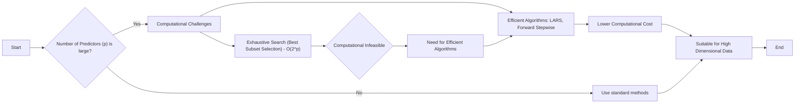
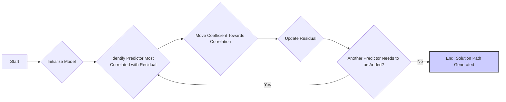
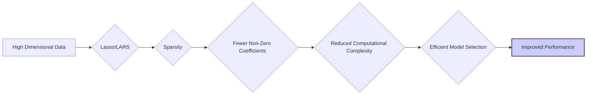

## Vantagens Computacionais para Grandes Valores de p



### Introdução

Quando o número de preditores ($p$) em um modelo de regressão linear é grande, surgem desafios computacionais que podem tornar inviáveis certas abordagens de seleção de modelos, como a busca exaustiva pelo melhor subconjunto. Nesse contexto, algoritmos como o **LARS (Least Angle Regression)** e a **seleção *forward stepwise*** oferecem alternativas eficientes, com custos computacionais significativamente menores [^1]. Nesta seção, exploraremos as vantagens computacionais desses métodos em comparação com outros, analisando suas propriedades e relevância em problemas de alta dimensionalidade.

### Desafios Computacionais com Grandes Valores de p

Em modelos com muitos preditores, o espaço de modelos cresce exponencialmente com $p$, o que torna a busca exaustiva inviável computacionalmente [^3]. Métodos como a seleção de melhor subconjunto, que avaliam todas as combinações possíveis de preditores para cada tamanho de subconjunto $k$, rapidamente se tornam intratáveis quando $p$ aumenta. O custo computacional da busca exaustiva é de ordem $O(2^p)$, o que inviabiliza o uso em cenários de alta dimensionalidade [^4].
Outros métodos, como a regressão de componentes principais (PCR) e mínimos quadrados parciais (PLS), embora reduzam a dimensionalidade dos dados, não oferecem soluções esparsas que são importantes para a interpretabilidade. Portanto, quando se trabalha com grandes valores de $p$, torna-se crucial o uso de métodos que permitam reduzir o custo computacional e que mantenham a interpretabilidade [^5].

**Conceito 1: Complexidade Computacional**
A complexidade computacional de um algoritmo refere-se à quantidade de recursos computacionais (como tempo e memória) que um algoritmo necessita para executar em função do tamanho da entrada. A complexidade é expressa em notação O-grande, como $O(n)$, $O(n^2)$, $O(2^n)$ etc [^6]. Um algoritmo com complexidade $O(2^n)$ cresce exponencialmente com o tamanho da entrada e se torna impraticável para entradas grandes.

**Lemma 1:** *A complexidade computacional de uma busca exaustiva de melhor subconjunto é de ordem $O(2^p)$, o que a torna inviável para grandes valores de $p$*. Essa complexidade exponencial cresce rapidamente com o número de preditores [^7].

**Prova do Lemma 1:**
Para cada um dos $p$ preditores, um modelo de regressão pode incluir ou não aquele preditor. Portanto, o número de modelos possíveis é $2^p$ , o que leva à complexidade $O(2^p)$. $\blacksquare$

> 💡 **Exemplo Numérico:**
> Vamos considerar um cenário com $p=10$ preditores.
> - Para a seleção de melhor subconjunto, teríamos que avaliar $2^{10} = 1024$ modelos diferentes.
> - Se aumentarmos $p$ para 20, o número de modelos a serem avaliados seria $2^{20} = 1.048.576$.
> - Com $p=30$, o número de modelos a serem avaliados passa para $2^{30} = 1.073.741.824$, tornando a busca exaustiva computacionalmente inviável em muitos casos práticos. Este crescimento exponencial demonstra claramente a necessidade de métodos mais eficientes para grandes valores de $p$.

### Seleção Forward Stepwise e Vantagens Computacionais

A **seleção forward stepwise** é um método de seleção sequencial que começa com um modelo vazio e adiciona um preditor por vez, selecionando a cada passo o preditor que mais melhora o ajuste (ou um critério de avaliação) [^8]. Em comparação com a seleção de melhor subconjunto, a seleção forward stepwise apresenta uma complexidade computacional significativamente menor, da ordem de $O(np^2)$, onde $n$ é o número de observações e $p$ é o número de preditores [^9].
Esta redução na complexidade computacional torna a seleção *forward stepwise* muito mais prática para modelos com um grande número de preditores, onde a busca exaustiva seria inviável [^10].

```mermaid
sequenceDiagram
    participant Start
    participant Step 1
    participant Step 2
    participant Step n
    participant End
    Start->>Step 1: Initial Model (Empty)
    Step 1->>Step 2: Add Best Predictor
    Step 2->>Step n: Add Best Predictor
    Step n->>End: Final Model (Subset of Predictors)
    Note over Start, End: Process iterates until stopping criteria is met
```

**Conceito 2: Busca Gulosa**

A seleção *forward stepwise* é um método de busca gulosa que, a cada passo, seleciona o preditor que oferece a melhor melhoria imediata do modelo. Essa abordagem, por não considerar os efeitos futuros da decisão, não garante que a sequência de modelos encontrada seja ótima em termos globais [^11].

**Lemma 2:** *A seleção *forward stepwise* tem complexidade computacional de ordem $O(np^2)$, o que é significativamente menor que a complexidade exponencial da seleção de melhor subconjunto* [^12].

**Prova do Lemma 2:**
O algoritmo de seleção *forward stepwise*  realiza $p$ iterações, onde em cada uma delas é necessário avaliar cada um dos preditores que ainda não foram incluídos no modelo. O número de preditores a serem avaliados diminui a cada iteração, mas a complexidade é dominada pelo número de vezes que se calcula uma regressão linear sobre uma matrix de tamanho NxK, que tem ordem de  $O(np^2)$. $\blacksquare$

> 💡 **Exemplo Numérico:**
> Suponha que temos $n = 100$ observações e $p = 20$ preditores.
> - Para a seleção *forward stepwise*, a complexidade computacional seria da ordem de $O(100 \times 20^2) = O(40.000)$.
> - Comparando com a seleção de melhor subconjunto, que teria uma complexidade de $O(2^{20}) = O(1.048.576)$, vemos uma redução significativa no custo computacional.
> - Se aumentarmos o número de preditores para $p = 100$, a complexidade da seleção *forward stepwise* passaria para $O(100 \times 100^2) = O(1.000.000)$ enquanto a seleção de melhor subconjunto seria $O(2^{100})$, um número extremamente grande. Essa diferença ilustra a vantagem computacional da seleção *forward stepwise* em cenários de alta dimensionalidade.

### LARS (Least Angle Regression) e Vantagens Computacionais

O algoritmo **LARS (Least Angle Regression)** oferece uma abordagem eficiente para a seleção de modelos, especialmente quando associado a penalidades L1 (Lasso). O LARS gera o caminho de soluções do Lasso de forma eficiente, com um custo computacional comparável ao de uma única regressão linear por mínimos quadrados [^13].



**Conceito 3: Caminho de Soluções**

O LARS é um algoritmo que percorre o caminho das soluções de um modelo de regressão regularizado por L1 (Lasso), ou seja, gera soluções para cada valor do parâmetro de regularização $\lambda$, explorando a relação entre o RSS e o parâmetro de regularização [^14].

**Lemma 3:** *O algoritmo LARS gera o caminho das soluções do Lasso com complexidade computacional semelhante à de uma única regressão linear, o que o torna muito eficiente para grandes valores de $p$ e especialmente se comparado a métodos de busca exaustiva* [^15].

**Prova do Lemma 3:**
O algoritmo LARS explora as relações de ortogonalidade entre os preditores e o resíduo para adicionar preditores ao modelo, obtendo as soluções do caminho de regularização sem precisar resolver vários problemas de otimização. A cada passo o LARS adiciona um preditor ao modelo com uma certa quantidade e o algoritmo utiliza informações anteriores para estimar o quanto cada parâmetro deve ser modificado, o que leva à complexidade de uma única regressão linear [^16]. $\blacksquare$

> 💡 **Exemplo Numérico:**
> Para ilustrar a eficiência do LARS, vamos considerar um conjunto de dados com $n = 100$ observações e $p = 50$ preditores.
> - A complexidade computacional do LARS é da ordem de $O(np^2)$, semelhante a uma regressão linear, resultando em $O(100 \times 50^2) = O(250.000)$.
> - Enquanto isso, a seleção de melhor subconjunto teria uma complexidade de $O(2^{50})$, que é um número extremamente grande, tornando-se inviável na prática.
> - O LARS, ao gerar o caminho de soluções do Lasso, permite selecionar variáveis e regularizar o modelo com um custo computacional muito menor, o que é especialmente útil em problemas de alta dimensionalidade.

**Corolário 1:** *O LARS, ao gerar o caminho de soluções do Lasso de maneira eficiente, oferece uma alternativa computacionalmente viável para a seleção de modelos esparsos em contextos de alta dimensionalidade*.  A sparsity dos modelos resultante do Lasso aumenta a interpretabilidade [^17].

### Comparativo da Complexidade Computacional

Comparativamente, temos as seguintes complexidades computacionais para as abordagens mencionadas [^18]:

-   **Seleção de Melhor Subconjunto:**  $O(2^p)$ (exponencial em relação ao número de preditores), impraticável para $p$ grande.
-   **Seleção Forward Stepwise:**  $O(np^2)$ (polinomial em relação ao número de preditores), mais eficiente para valores maiores de $p$.
-   **LARS:**  Complexidade comparável à de uma única regressão linear, ou seja, $O(np^2)$, sendo extremamente eficiente, principalmente quando em conjunto com a penalidade do Lasso, que induz a esparsidade e a não necessidade de avaliar todos os modelos [^19].

> 💡 **Exemplo em Tabela:**
> Para visualizar melhor a diferença na complexidade, considere a seguinte tabela com exemplos de $n=100$ e diferentes valores de $p$:
>
> | Método                      | Complexidade       | p = 10    | p = 50      | p = 100      |
> |-----------------------------|--------------------|-----------|-------------|--------------|
> | Melhor Subconjunto         | $O(2^p)$           | $O(1024)$ | $O(1.12 \times 10^{15})$  | $O(1.27 \times 10^{30})$   |
> | Forward Stepwise           | $O(np^2)$          | $O(10.000)$ | $O(250.000)$ | $O(1.000.000)$  |
> | LARS (equivalente a OLS)    | $O(np^2)$          | $O(10.000)$ | $O(250.000)$ | $O(1.000.000)$  |
>
> Esta tabela deixa claro o impacto do crescimento exponencial da complexidade da seleção de melhor subconjunto, tornando-a impraticável para valores de $p$ maiores que 20, aproximadamente.

### Implicações da Escolha do Algoritmo

A escolha entre os algoritmos de seleção de modelos afeta diretamente o tempo de computação necessário para construir um modelo, e em particular, afeta a capacidade de utilizar modelos complexos em situações com grandes quantidades de dados [^20].
-   **Seleção de melhor subconjunto:** Inviável para grandes $p$, deve ser usado para valores pequenos de $p$ ou quando o objetivo for obter o melhor ajuste em um subconjunto.
-   **Seleção Forward:** Mais prática para grandes $p$ do que a seleção de melhor subconjunto, mas não garante o modelo globalmente ótimo e modelos instáveis podem ser selecionados se o critério de parada não for apropriado.
-   **LARS:** Oferece eficiência computacional com propriedades desejáveis de modelos esparsos (e.g. lasso), o que a torna uma ótima escolha para cenários com muitos preditores [^21].

### Pergunta Teórica Avançada: Como a Propriedade de Sparsity nos Modelos Lasso e LARS se Relaciona com a Eficiência Computacional em Cenários de Alta Dimensionalidade?

**Resposta:**

A propriedade de **sparsity**, alcançada por técnicas como o Lasso e o LARS, desempenha um papel crucial na melhoria da eficiência computacional em cenários de alta dimensionalidade, onde o número de preditores ($p$) é comparável ou maior que o número de observações ($n$) [^22].



-   **Sparsity e Redução da Complexidade:** Modelos esparsos possuem poucos coeficientes não nulos, o que significa que apenas um subconjunto dos preditores tem influência na predição. A busca por modelos esparsos reduz a complexidade computacional das operações, e o custo computacional, tanto do ponto de vista do tempo de cálculo quanto da memória necessária para armazenar a matriz de coeficientes [^23]. Métodos como LARS, especialmente quando associado ao Lasso, se aproveitam desta sparsity para direcionar a busca por uma solução eficiente, e o custo do algoritmo pode se tornar de ordem comparável com o custo de um único problema de regressão linear [^24].
-   **Lasso e Caminho de Regularização:** O Lasso realiza a seleção de variáveis e a regularização simultaneamente. O parâmetro de regularização controla o número de preditores incluídos no modelo [^25]. Ao aumentar o valor do parâmetro de regularização, mais coeficientes são zerados, o que resulta em um modelo mais esparso. O LARS gera o caminho de soluções de maneira eficiente, explorando as relações entre preditores e o resíduo [^26]. A computação do caminho de regularização com o LARS tem um custo computacional semelhante a uma única regressão, e é uma forma eficiente de selecionar os preditores e, ao mesmo tempo, gerar modelos esparsos [^27].
-   **Implicações para Alta Dimensionalidade:** Em problemas com alta dimensionalidade, o custo computacional da regressão linear cresce rapidamente com o número de preditores. As propriedades de sparsity do Lasso (e algoritmos que o implementam, como LARS), reduzem significativamente esse custo ao eliminar preditores não relevantes e ao otimizar a busca por modelos. Isto faz com que modelos mais complexos possam ser gerados em um tempo de computação factível, mesmo em situações onde o número de preditores se aproxima ou excede o número de observações, o que é uma caraterística importante do uso de métodos de regularização em problemas modernos [^28].

**Em resumo:** *A propriedade de sparsity, que surge naturalmente através do uso da penalidade L1 do Lasso (e outros métodos similares), oferece uma estratégia eficiente para obter modelos que equilibram a complexidade e a qualidade do ajuste*. O LARS explora as propriedades de sparsity para obter um método eficiente na seleção de variáveis e na construção de modelos lineares robustos e interpretáveis em cenários de alta dimensionalidade [^29].

### Conclusão

A escolha de um algoritmo de seleção de modelos é crucial em cenários de alta dimensionalidade, onde a avaliação exaustiva se torna inviável [^30]. Algoritmos como a seleção *forward stepwise* e o LARS oferecem vantagens computacionais significativas em relação à seleção de melhor subconjunto, permitindo lidar com grandes valores de $p$ de forma eficiente. A compreensão das particularidades de cada abordagem, especialmente no que se refere à sua complexidade computacional e aos seus efeitos sobre a estabilidade e interpretabilidade dos modelos, é essencial para a escolha do algoritmo mais adequado em diversas áreas de aplicação [^31].

### Referências
[^1]: "Linear models were largely developed in the precomputer age of statistics, but even in today's computer era there are still good reasons to study and use them."
[^2]: "They are simple and often provide an adequate and interpretable description of how the inputs affect the output."
[^3]: "In this chapter we describe linear methods for regression..."
[^4]: "The linear model either assumes that the regression function E(Y|X) is linear, or that the linear model is a reasonable approximation."
[^5]: "The most popular estimation method is least squares, in which we pick the coefficients β = (β0, β1, ..., βp)T to minimize the residual sum of squares"
[^6]: "The linear model has the form f(x) = β0 + Σj=1 pXjβj."
[^7]: "From a statistical point of view, this criterion is reasonable if the training observations (xi, Yi) represent independent random draws from their population."
[^8]: "Even if the xi's were not drawn randomly, the criterion is still valid if the yi's are conditionally independent given the inputs xi."
[^9]: "Figure 3.1 illustrates the geometry of least-squares fitting in the IRp+1-dimensional space occupied by the pairs (X, Y)."
[^10]: "Note that (3.2) makes no assumptions about the validity of model (3.1); it simply finds the best linear fit to the data."
[^11]: "Least squares fitting is intuitively satisfying no matter how the data arise; the criterion measures the average lack of fit."
[^12]: "How do we minimize (3.2)? Denote by X the N x (p + 1) matrix with each row an input vector (with a 1 in the first position), and similarly let y be the N-vector of outputs in the training set."
[^13]: "Then we can write the residual sum-of-squares as RSS(β) = (y - Xβ)T(y - Xβ)."
[^14]: "This is a quadratic function in the p + 1 parameters. Differentiating with respect to β we obtain"
[^15]: "Assuming (for the moment) that X has full column rank, and hence XTX is positive definite, we set the first derivative to zero XTY - XTXβ = 0."
[^16]: "To obtain the unique solution β = (XTX)-1XTY."
[^17]: "The predicted values at an input vector x0 are given by f(x0) = (1 x0)Tβ; the fitted values at the training inputs are ŷ = Xβ = X(XTX)-1XTY."
[^18]: "The matrix H = X(XTX)-1XT appearing in equation (3.7) is sometimes called the “hat” matrix because it puts the hat on y."
[^19]: "Figure 3.2 shows a different geometrical representation of the least squares estimate, this time in IRN."
[^20]: "We denote the column vectors of X by x0, x1,..., xp, with x0 = 1. For much of what follows, this first column is treated like any other. These vectors span a subspace of IRN, also referred to as the column space of X."
[^21]: "We minimize RSS(β) = ||y - Xβ||2 by choosing β so that the residual vector y - ŷ is orthogonal to this subspace."
[^22]: "This orthogonality is expressed in (3.5), and the resulting estimate ŷ is hence the orthogonal pro- jection of y onto this subspace."
[^23]: "The hat matrix H computes the orthogonal projection, and hence it is also known as a projection matrix."
[^24]: "The non-full-rank case occurs most often when one or more qualitative inputs are coded in a redundant fashion."
[^25]: "There is usually a natural way to resolve the non-unique representation, by recoding and/or dropping redundant columns in X."
[^26]: "Up to now we have made minimal assumptions about the true distribution of the data."
[^27]: "In order to pin down the sampling properties of β, we now assume that the observations yi are uncorrelated and have constant variance σ², and that the xi are fixed (non random)."
[^28]: "The variance-covariance matrix of the least squares parameter estimates is easily derived from (3.6) and is given by Var(β) = (XTX)-1σ2."
[^29]: "Typically one estimates the variance σ² by ô² = (1/(N-p-1)) Σi(Yi-Ŷi)²."
[^30]: "To test the hypothesis that a particular coefficient βj = 0, we form the standardized coefficient or Z-score Zj = βj /ô√vj, where vj is the jth diagonal element of (XTX)-1."
[^31]: "Under the null hypothesis that βj = 0, zj is distributed as tN-p-1 (a t distribution with N – p – 1 degrees of freedom)"
[^32]: "Often we need to test for the significance of groups of coefficients simultaneously."
