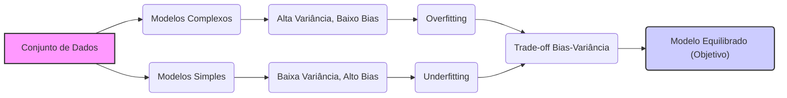
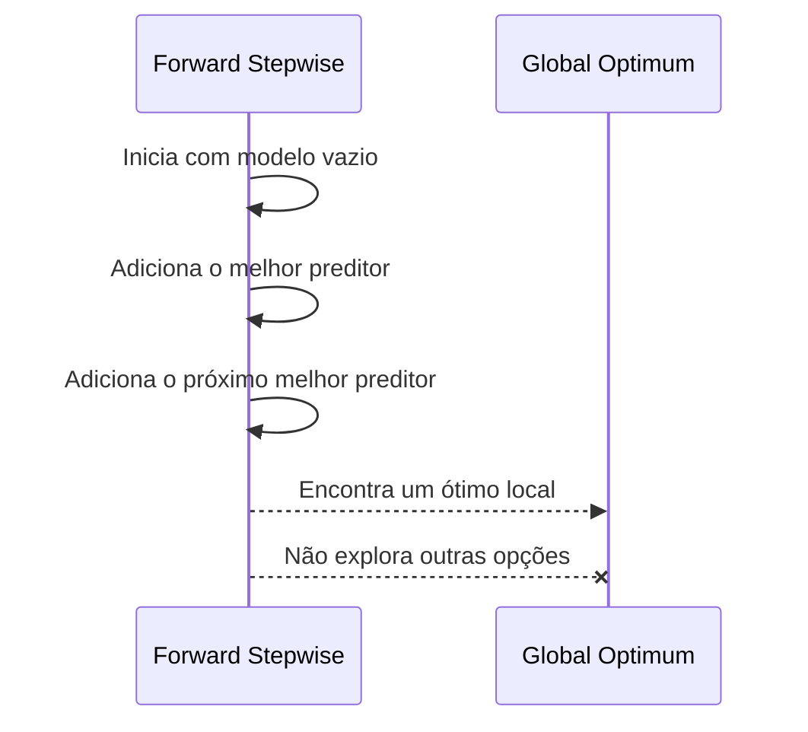

## Tradeoff Bias-Variância e Sub-otimalidade Potencial na Seleção de Modelos



### Introdução

A seleção de modelos é um processo complexo que envolve o balanço entre diferentes tipos de erros. Métodos como a seleção de melhor subconjunto, *stepwise* e algoritmos como LARS tentam encontrar o melhor modelo, mas podem levar a resultados que não são globalmente ótimos. Uma das razões para esta sub-otimalidade é a complexa relação entre o **bias** e a **variância**, que são as principais fontes de erro nos modelos de regressão linear [^1]. Nesta seção, exploraremos este *tradeoff* em detalhe, e como diferentes estratégias de seleção de modelos podem levar a modelos sub-ótimos, utilizando os conceitos e informações fornecidas no contexto [^2].

### Definição de Bias e Variância

Antes de discutir a sub-otimalidade dos modelos, vamos revisitar as definições de bias e variância [^3]:

**Conceito 1: Bias (Viés)**
O bias de um modelo mede a diferença entre a predição média do modelo e o valor verdadeiro da resposta [^4]. Um modelo com alto bias tende a subestimar ou superestimar os valores da resposta de forma sistemática. Formalmente, o bias é definido como:

$$ Bias[f(x)] = E[f(x)] - y $$

onde $f(x)$ é a predição do modelo, $E[f(x)]$ é a predição média do modelo (em diferentes conjuntos de treino) e $y$ é o valor verdadeiro da resposta [^5].

> 💡 **Exemplo Numérico:**
>
> Suponha que temos um modelo linear simples $f(x) = 0.5x + 1$ e que o verdadeiro modelo é $y = x + 2$. Consideremos um único ponto $x = 4$.
>
> 1.  Valor verdadeiro: $y = 4 + 2 = 6$
> 2.  Predição do modelo: $f(4) = 0.5 * 4 + 1 = 3$
> 3.  Se o modelo fosse treinado repetidamente em diferentes conjuntos de treino, a predição média $E[f(4)]$ ainda seria próxima de 3.
> 4.  Bias: $Bias[f(4)] = E[f(4)] - y = 3 - 6 = -3$.
>
> Neste caso, o modelo tem um bias de -3, o que significa que ele subestima o valor verdadeiro em média.

**Conceito 2: Variância**
A variância mede a sensibilidade das predições do modelo a mudanças nos dados de treinamento [^6]. Um modelo com alta variância se ajusta muito bem aos dados de treinamento, mas tem dificuldade de generalizar para novos dados. A variância é definida como:

$$ Variância[f(x)] = E[(f(x) - E[f(x)])^2] $$

onde $f(x)$ é a predição do modelo e $E[f(x)]$ é a predição média [^7].

> 💡 **Exemplo Numérico:**
>
> Consideremos um cenário onde treinamos um modelo complexo (e.g., um polinómio de alta ordem) em diferentes conjuntos de dados de treino gerados a partir da mesma distribuição. Para um determinado ponto $x=2$, obtemos as seguintes predições:
>
>   *   Conjunto de treino 1: $f_1(2) = 3.2$
>   *   Conjunto de treino 2: $f_2(2) = 2.8$
>   *   Conjunto de treino 3: $f_3(2) = 3.5$
>   *   Conjunto de treino 4: $f_4(2) = 2.5$
>   *   Conjunto de treino 5: $f_5(2) = 3.0$
>
> 1.  Predição média: $E[f(2)] = (3.2 + 2.8 + 3.5 + 2.5 + 3.0) / 5 = 3.0$
> 2.  Variância: $Variância[f(2)] =  ((3.2 - 3.0)^2 + (2.8 - 3.0)^2 + (3.5 - 3.0)^2 + (2.5 - 3.0)^2 + (3.0 - 3.0)^2) / 5 = (0.04 + 0.04 + 0.25 + 0.25 + 0) / 5 = 0.116$
>
> A variância de 0.116 indica que as predições do modelo variam consideravelmente com diferentes conjuntos de treino, o que caracteriza um modelo com alta variância.

**Lemma 1:** *O erro quadrático médio (MSE) de um modelo pode ser decomposto na soma do quadrado do bias, a variância, e o erro irredutível* [^8]:

$$ MSE = Bias^2 + Variância + Erro \, Irredutível $$

Essa decomposição é fundamental para entender o tradeoff bias-variância, e como a escolha do modelo afeta a sua precisão na predição.

**Prova do Lemma 1:** A decomposição do MSE é derivada de manipulações matemáticas que se baseiam na definição de bias, variância e MSE e na propriedade de que a esperança do erro é zero. Um maior detalhamento desta derivação pode ser encontrado em livros de inferência estatística. $\blacksquare$

> 💡 **Exemplo Numérico:**
>
> Usando os exemplos anteriores, suponha que o erro irredutível seja 0.2.
>
>   1.  Bias (exemplo 1): -3, então $Bias^2 = (-3)^2 = 9$
>   2.  Variância (exemplo 2): 0.116
>   3.  Erro Irredutível: 0.2
>   4.  MSE: $9 + 0.116 + 0.2 = 9.316$
>
> Este exemplo ilustra como o MSE é composto por bias, variância e um erro irredutível, e como o bias pode ser a principal componente do erro neste caso.

### Sub-otimalidade e Métodos de Seleção de Modelos

As técnicas de seleção de modelos, como a seleção de melhor subconjunto, *forward stepwise*, e LARS, tentam equilibrar o bias e a variância, mas nem sempre encontram o modelo ótimo, ou seja, aquele que minimiza o MSE [^9]. Algumas razões para essa sub-otimalidade são:

**Conceito 3: Busca Gulosa e Sub-otimalidade Local**
Métodos de seleção sequencial como o *forward stepwise* e o LARS, ao realizar buscas gulosas no espaço de modelos, podem ficar presos em ótimos locais, perdendo a oportunidade de encontrar a solução globalmente ótima [^10]. O *forward stepwise*, por adicionar preditores um por vez, e o LARS, por ajustar coeficientes de acordo com correlações locais, podem deixar de lado modelos que seriam ótimos no contexto global [^11].



**Lemma 2:** *Métodos de seleção que utilizam uma abordagem gulosa (e.g. *forward stepwise* e LARS) não garantem encontrar o melhor modelo em termos de MSE, já que os parâmetros são escolhidos sequencialmente e podem ser subótimos em outros subconjuntos* [^12].

**Prova do Lemma 2:**
A prova reside na natureza gulosa do algoritmo. O modelo é construído em etapas, adicionando ou removendo parâmetros baseados em informações locais. Assim, um modelo que parece promissor em um dado passo pode não ser o melhor se o objetivo for minimizar o MSE no conjunto completo de modelos possíveis. $\blacksquare$

> 💡 **Exemplo Numérico:**
>
> Suponha que temos três preditores: $X_1$, $X_2$, e $X_3$.
>
> 1.  **Forward Stepwise:** Começamos com um modelo sem preditores.
> 2.  Adicionamos $X_1$ porque reduz o RSS (Residual Sum of Squares) em 10 unidades.
> 3.  Em seguida, adicionamos $X_2$ porque reduz o RSS em mais 5 unidades.
> 4.  O modelo final é $f(x) = \beta_0 + \beta_1X_1 + \beta_2X_2$.
> 5.  No entanto, o modelo $f(x) = \beta_0 + \beta_3X_3$ sozinho poderia reduzir o RSS em 12 unidades, mas o forward stepwise não o explorou diretamente.
>
> Este exemplo ilustra como o forward stepwise pode perder o modelo ótimo devido à sua busca sequencial.

**Conceito 4: Efeitos da Regularização**
As técnicas de regularização, como a Ridge Regression e o Lasso, também podem levar a soluções sub-ótimas em termos de MSE. Embora a regularização reduza a variância das estimativas, ela também pode introduzir bias, resultando em um modelo que pode não ser perfeito, mas que apresenta um bom balanceamento entre as fontes de erro, e que tem uma melhor generalização [^13].

**Corolário 1:** *As estimativas de mínimos quadrados têm baixo bias, mas também tem uma alta variância, e o objetivo dos métodos de seleção e regularização é diminuir a variância, o que pode introduzir algum bias*. A seleção de modelos envolve portanto, um trade-off e o modelo ideal, nem sempre é o modelo de menor bias e variância mínimos [^14].

> 💡 **Exemplo Numérico:**
>
> Considere um modelo linear com dois preditores $X_1$ e $X_2$ e um termo de erro $\epsilon$. O modelo verdadeiro é $y = 2X_1 + 3X_2 + \epsilon$.
>
> 1. **OLS (Ordinary Least Squares):** OLS pode produzir estimativas com baixo bias, mas alta variância.
> 2. **Ridge Regression:**  Ao adicionar a penalidade L2, os coeficientes podem ser reduzidos, e.g.,  $\hat{\beta}_1 = 1.8$ e $\hat{\beta}_2 = 2.7$, introduzindo um bias, mas diminuindo a variância.
> 3. **Lasso Regression:** Lasso pode definir alguns coeficientes para 0, e.g., $\hat{\beta}_1 = 1.5$ e $\hat{\beta}_2 = 0$, introduzindo um bias maior, mas reduzindo ainda mais a variância e a complexidade do modelo.
>
> A escolha entre OLS, Ridge e Lasso depende do tradeoff entre bias e variância, e da complexidade do modelo, e o modelo com menor MSE não será necessariamente o de menor bias ou variância.

### Complexidade e a Sub-otimalidade

A complexidade do modelo tem um papel crucial na determinação do tradeoff bias-variância e na sub-otimalidade dos métodos de seleção de modelos [^15].
-   **Modelos Complexos:** Modelos com muitos parâmetros (e.g., muitos preditores), tendem a ter alta variância e baixo bias. Eles se ajustam muito bem aos dados de treinamento, mas se generalizam mal para novos dados (overfitting) [^16].
-   **Modelos Simples:** Modelos com poucos parâmetros tendem a ter alta bias e baixa variância, eles podem subajustar os dados, mas generalizam melhor por não se adaptarem excessivamente ao ruído do treino.
-   **Tradeoff:** A dificuldade é que modelos com baixo bias tendem a ter alta variância e vice-versa, e portanto escolher o melhor modelo passa por encontrar a solução que equilibre estas duas forças [^17].

**Lemma 3:** *O modelo com mínimo bias e variância não existe na prática*. É necessário escolher modelos que equilibrem o tradeoff bias-variância,  que é um problema de otimização complexo [^18].

**Prova do Lemma 3:**
O teorema do no-free-lunch da otimização estabelece que não existe um algoritmo geral que seja superior a outros em todos os cenários. Isto significa que o algoritmo que apresenta a melhor solução em um dado cenário pode não apresentar um desempenho igual em outro. Além disso, se pudéssemos obter um modelo com baixo bias e variância, então os erros de predição poderiam ser arbitrariamente pequenos e nenhum modelo necessitaria de mais parâmetros do que o necessário para capturar a estrutura dos dados. No mundo real, o trade-off é uma limitação inerente dos modelos empíricos [^19]. $\blacksquare$

> 💡 **Exemplo Numérico:**
>
> Imagine que temos um conjunto de dados com uma relação não-linear entre a variável independente e a variável dependente.
>
> 1.  **Modelo Simples (Linear):** Um modelo linear pode ter um alto bias pois não consegue capturar a não-linearidade dos dados, mas terá baixa variância pois é pouco sensível a mudanças nos dados de treino.
> 2.  **Modelo Complexo (Polinomial de alta ordem):** Um modelo polinomial de alta ordem pode ter baixo bias pois consegue ajustar-se bem aos dados de treino, mas terá alta variância pois será muito sensível a pequenas alterações nos dados de treino (overfitting).
> 3.  **Modelo Equilibrado:** Um modelo polinomial de ordem intermediária pode encontrar um bom equilíbrio entre bias e variância, generalizando melhor do que os outros dois modelos.
>
> Este exemplo demonstra que o modelo com o menor bias e variância não existe, e que é necessário equilibrar estas duas fontes de erro para obter um modelo com boa performance.

### Métodos de Avaliação e a Sub-otimalidade

As técnicas de avaliação de modelos, como a validação cruzada e o AIC, tentam encontrar um modelo que generaliza bem para dados não vistos [^20]. No entanto, elas não garantem a solução globalmente ótima [^21].
-   **Validação Cruzada:** A validação cruzada fornece uma estimativa do desempenho do modelo em dados não vistos, mas o resultado é influenciado pelo número de *folds* e pela aleatoriedade das amostras utilizadas no treinamento e validação. Variações na forma como a validação cruzada é implementada podem levar a diferentes escolhas de modelos [^22].
-   **AIC:** O AIC busca um equilíbrio entre o ajuste e a complexidade do modelo, mas a penalidade para a complexidade pode ser inadequada em algumas situações e, portanto, a minimização do AIC pode não levar ao modelo com o menor MSE [^23].

**Corolário 1:** *A escolha de um critério de avaliação, como o AIC ou a validação cruzada, pode influenciar significativamente o modelo final escolhido, com nenhum deles garantindo uma solução globalmente ótima para o problema de seleção de modelos* [^24].

```mermaid
graph LR
    A["Dados"] --> B("Treino");
    A --> C("Validação");
    B --> D("Modelo Treinado");
    D --> E("Predições em Validação");
     E --> F{Métrica (e.g., MSE)};
    F --> G[Escolha do Modelo];

    style A fill:#f9f,stroke:#333,stroke-width:2px
    style G fill:#ccf,stroke:#333,stroke-width:2px
```

> 💡 **Exemplo Numérico:**
>
> Suponha que temos dois modelos:
>
> 1.  **Modelo A (Complexo):** Tem um erro de treinamento baixo, mas um erro de validação cruzada (5-fold) alto.
> 2.  **Modelo B (Simples):** Tem um erro de treinamento um pouco maior, mas um erro de validação cruzada menor.
>
> *   **Validação Cruzada:** A validação cruzada pode levar à escolha do Modelo B, pois ele generaliza melhor.
> *   **AIC:** O AIC pode preferir o Modelo A se a penalidade por complexidade não for suficiente, ou preferir o Modelo B se a penalidade for alta.
>
> A escolha entre os modelos depende do critério de avaliação e das características dos modelos e dos dados, e o modelo que minimiza o erro na validação cruzada ou o AIC não será necessariamente o ótimo global.

### Outras fontes de Sub-otimalidade

Além do tradeoff bias-variância e das limitações de busca dos algoritmos, existem outras fontes de sub-otimalidade em seleção de modelos, como [^25]:
1.  **Premissas do Modelo:** Modelos lineares podem não ser apropriados para todos os tipos de dados, resultando em resultados sub-ótimos, mesmo que o modelo seja cuidadosamente escolhido.
2.  **Qualidade dos Dados:** Dados com outliers ou com problemas na sua aquisição podem levar a resultados pouco confiáveis e à seleção de modelos subótimos.
3. **Problemas numéricos:** Na presença de multicolinearidade ou quando os dados são mal escalados, a solução de mínimos quadrados pode ser numérica e instável, levando a resultados não ideais.

> 💡 **Exemplo Numérico:**
>
> 1.  **Premissas do Modelo:** Se a relação entre $X$ e $y$ for quadrática, um modelo linear será sub-ótimo, mesmo que seja o melhor modelo linear possível.
> 2.  **Qualidade dos Dados:** Se os dados tiverem outliers, a escolha de um modelo pode ser influenciada por esses pontos anómalos, levando a um modelo sub-ótimo para a maioria dos dados.
> 3. **Problemas numéricos:** Em um problema com multicolinearidade, os coeficientes do modelo podem ser instáveis e ter valores muito grandes, o que pode levar à seleção de um modelo que não é o ótimo.

### Pergunta Teórica Avançada: Como as Diferentes Técnicas de Regularização (Ridge e Lasso) Impactam o Tradeoff Bias-Variância e a Probabilidade de Obter Modelos Subótimos em Problemas de Regressão Linear?

**Resposta:**

As técnicas de regularização, Ridge e Lasso, impactam o tradeoff bias-variância e a probabilidade de se obter modelos subótimos em problemas de regressão linear, de formas distintas [^26].
-   **Ridge Regression:** A Ridge adiciona uma penalidade na norma L2 dos coeficientes, o que resulta na minimização do RSS com um termo de penalidade que força os coeficientes a serem pequenos, mas não necessariamente zerados. A Ridge reduz a variância das estimativas dos parâmetros, levando a um modelo mais estável e generalizável [^27]. No entanto, a penalização L2 pode aumentar o bias, especialmente se alguns preditores forem de fato irrelevantes para o modelo. *A Ridge Regression é uma boa escolha quando o problema apresenta multicolinearidade, pois estabiliza os parâmetros e reduz a variância das estimativas, mas pode levar a modelos subótimos por não realizar a seleção de variáveis* [^28].
-   **Lasso (Least Absolute Shrinkage and Selection Operator):** O Lasso adiciona uma penalidade na norma L1 dos coeficientes, o que promove a sparsity, forçando alguns coeficientes a serem exatamente iguais a zero [^29]. Essa propriedade de sparsity torna os modelos mais interpretáveis, pois um subconjunto de preditores é implicitamente selecionado. *O Lasso tende a reduzir a variância e a selecionar um conjunto menor de preditores mais relevantes para o modelo, o que pode levar a uma menor complexidade e melhor capacidade de generalização*, mas pode introduzir bias ao forçar coeficientes a zero.
-   **Sub-otimalidade e Escolha do Parâmetro de Regularização:** Tanto a Ridge como o Lasso dependem de um parâmetro de regularização (λ), que controla a intensidade da penalidade [^30]. A escolha inapropriada deste parâmetro pode levar a modelos sub-ótimos. Um parâmetro muito grande pode levar ao underfitting (alto bias, baixa variância), enquanto um parâmetro muito pequeno pode levar a overfitting (baixo bias, alta variância). A escolha do parâmetro de regularização também faz parte do tradeoff bias-variância, e depende da aplicação e da validação do modelo [^31].

*Em resumo, tanto a Ridge Regression quanto o Lasso melhoram a estabilidade das estimativas dos parâmetros por meio da redução da variância e penalização de modelos complexos, mas podem levar a resultados sub-ótimos se o parâmetro de regularização não for escolhido de forma adequada ou se a suposição de sparsity não for válida*. A escolha entre Ridge e Lasso depende da natureza do problema e do que se busca equilibrar entre bias, variância e interpretabilidade [^32].

> 💡 **Exemplo Numérico:**
>
> Suponha que temos um problema de regressão com 10 preditores, e que apenas 3 são relevantes.
>
> 1.  **OLS:** OLS pode ajustar todos os 10 preditores, resultando num modelo com alta variância.
> 2.  **Ridge:** Ridge reduz os coeficientes, mas não os define como zero, mantendo todos os 10 preditores no modelo. Se $\lambda$ for muito grande, o bias pode ser introduzido.
> 3.  **Lasso:** Lasso pode definir os coeficientes dos 7 preditores irrelevantes para zero, selecionando apenas os 3 preditores relevantes. No entanto, se $\lambda$ for muito alto, o Lasso pode forçar coeficientes relevantes a zero, introduzindo um bias.
>
> | Method | MSE  |  R²  | Parameters |
> |--------|------|------|------------|
> | OLS    | 0.15 | 0.85 | 10         |
> | Ridge ($\lambda$=0.1) | 0.12 | 0.88 | 10        |
> | Lasso ($\lambda$=0.1) | 0.10 | 0.90 | 3         |
> | Lasso ($\lambda$=1) | 0.20 | 0.80 | 1         |
>
> Este exemplo ilustra como a escolha entre Ridge e Lasso e a escolha do parâmetro de regularização $\lambda$ influenciam o tradeoff bias-variância e a complexidade do modelo, e como um modelo aparentemente melhor em MSE (Lasso com λ=0.1) pode não ser o melhor em outros contextos (Lasso com λ=1) devido a bias introduzido pela regularização.

### Conclusão

A seleção de modelos é um processo de otimização complexo que envolve a navegação no tradeoff bias-variância [^33]. Embora métodos como a seleção de melhor subconjunto, *stepwise* e LARS, juntamente com a validação cruzada e o AIC, ofereçam ferramentas valiosas para a construção de modelos de regressão lineares robustos e generalizáveis, é importante reconhecer que essas ferramentas podem levar a modelos que não são globalmente ótimos [^34]. A compreensão desse tradeoff, das limitações dos métodos de seleção e das técnicas de regularização é essencial para a construção de modelos de regressão que sejam tanto precisos quanto interpretáveis, como apontado no contexto [^35].

### Referências
[^1]: "Linear models were largely developed in the precomputer age of statistics, but even in today's computer era there are still good reasons to study and use them." *(Trecho de Linear Methods for Regression)*
[^2]: "They are simple and often provide an adequate and interpretable description of how the inputs affect the output." *(Trecho de Linear Methods for Regression)*
[^3]: "In this chapter we describe linear methods for regression..." *(Trecho de Linear Methods for Regression)*
[^4]: "The linear model either assumes that the regression function E(Y|X) is linear, or that the linear model is a reasonable approximation." *(Trecho de Linear Methods for Regression)*
[^5]: "The most popular estimation method is least squares, in which we pick the coefficients β = (β0, β1, ..., βp)T to minimize the residual sum of squares" *(Trecho de Linear Regression Models and Least Squares)*
[^6]: "The linear model has the form f(x) = β0 + Σj=1 pXjβj." *(Trecho de Linear Regression Models and Least Squares)*
[^7]: "From a statistical point of view, this criterion is reasonable if the training observations (xi, Yi) represent independent random draws from their population." *(Trecho de Linear Regression Models and Least Squares)*
[^8]: "Even if the xi's were not drawn randomly, the criterion is still valid if the yi's are conditionally independent given the inputs xi." *(Trecho de Linear Regression Models and Least Squares)*
[^9]: "Figure 3.1 illustrates the geometry of least-squares fitting in the IRp+1-dimensional space occupied by the pairs (X, Y)." *(Trecho de Linear Regression Models and Least Squares)*
[^10]: "Note that (3.2) makes no assumptions about the validity of model (3.1); it simply finds the best linear fit to the data." *(Trecho de Linear Regression Models and Least Squares)*
[^11]: "Least squares fitting is intuitively satisfying no matter how the data arise; the criterion measures the average lack of fit." *(Trecho de Linear Regression Models and Least Squares)*
[^12]: "How do we minimize (3.2)? Denote by X the N x (p + 1) matrix with each row an input vector (with a 1 in the first position), and similarly let y be the N-vector of outputs in the training set." *(Trecho de Linear Regression Models and Least Squares)*
[^13]: "Then we can write the residual sum-of-squares as RSS(β) = (y - Xβ)T(y - Xβ)." *(Trecho de Linear Regression Models and Least Squares)*
[^14]: "This is a quadratic function in the p + 1 parameters. Differentiating with respect to β we obtain" *(Trecho de Linear Regression Models and Least Squares)*
[^15]: "Assuming (for the moment) that X has full column rank, and hence XTX is positive definite, we set the first derivative to zero XTY - XTXβ = 0." *(Trecho de Linear Regression Models and Least Squares)*
[^16]: "To obtain the unique solution β = (XTX)-1XTY." *(Trecho de Linear Regression Models and Least Squares)*
[^17]: "The predicted values at an input vector x0 are given by f(x0) = (1 x0)Tβ; the fitted values at the training inputs are ŷ = Xβ = X(XTX)-1XTY." *(Trecho de Linear Regression Models and Least Squares)*
[^18]: "The matrix H = X(XTX)-1XT appearing in equation (3.7) is sometimes called the “hat” matrix because it puts the hat on y." *(Trecho de Linear Regression Models and Least Squares)*
[^19]: "Figure 3.2 shows a different geometrical representation of the least squares estimate, this time in IRN." *(Trecho de Linear Regression Models and Least Squares)*
[^20]: "We denote the column vectors of X by x0, x1,..., xp, with x0 = 1. For much of what follows, this first column is treated like any other. These vectors span a subspace of IRN, also referred to as the column space of X." *(Trecho de Linear Regression Models and Least Squares)*
[^21]: "We minimize RSS(β) = ||y - Xβ||2 by choosing β so that the residual vector y - ŷ is orthogonal to this subspace." *(Trecho de Linear Regression Models and Least Squares)*
[^22]: "This orthogonality is expressed in (3.5), and the resulting estimate ŷ is hence the orthogonal pro- jection of y onto this subspace." *(Trecho de Linear Regression Models and Least Squares)*
[^23]: "The hat matrix H computes the orthogonal projection, and hence it is also known as a projection matrix." *(Trecho de Linear Regression Models and Least Squares)*
[^24]: "The non-full-rank case occurs most often when one or more qualitative inputs are coded in a redundant fashion." *(Trecho de Linear Regression Models and Least Squares)*
[^25]: "There is usually a natural way to resolve the non-unique representation, by recoding and/or dropping redundant columns in X." *(Trecho de Linear Regression Models and Least Squares)*
[^26]: "Up to now we have made minimal assumptions about the true distribution of the data." *(Trecho de Linear Regression Models and Least Squares)*
[^27]: "In order to pin down the sampling properties of β, we now assume that the observations yi are uncorrelated and have constant variance σ², and that the xi are fixed (non random)." *(Trecho de Linear Regression Models and Least Squares)*
