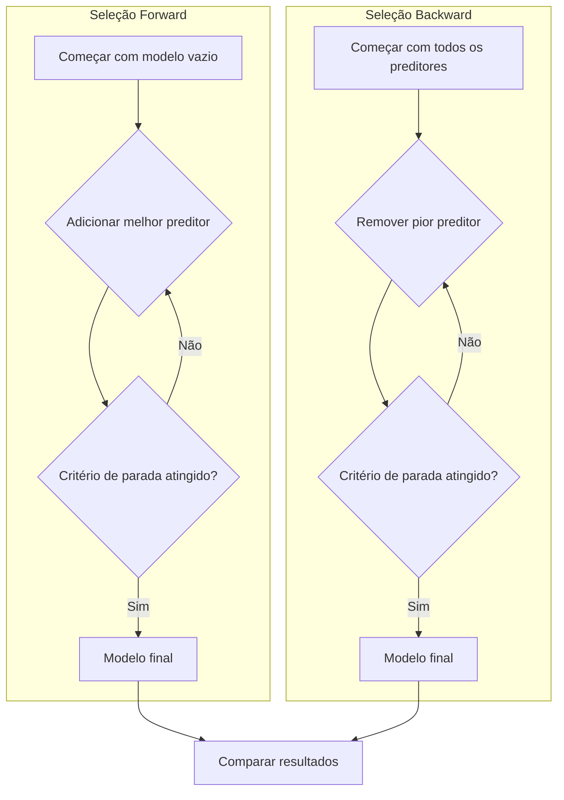
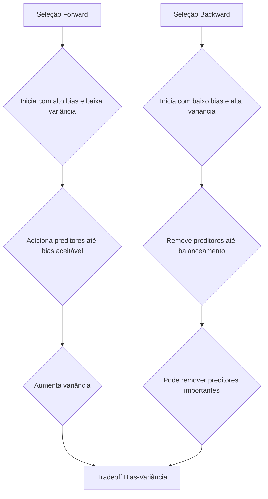
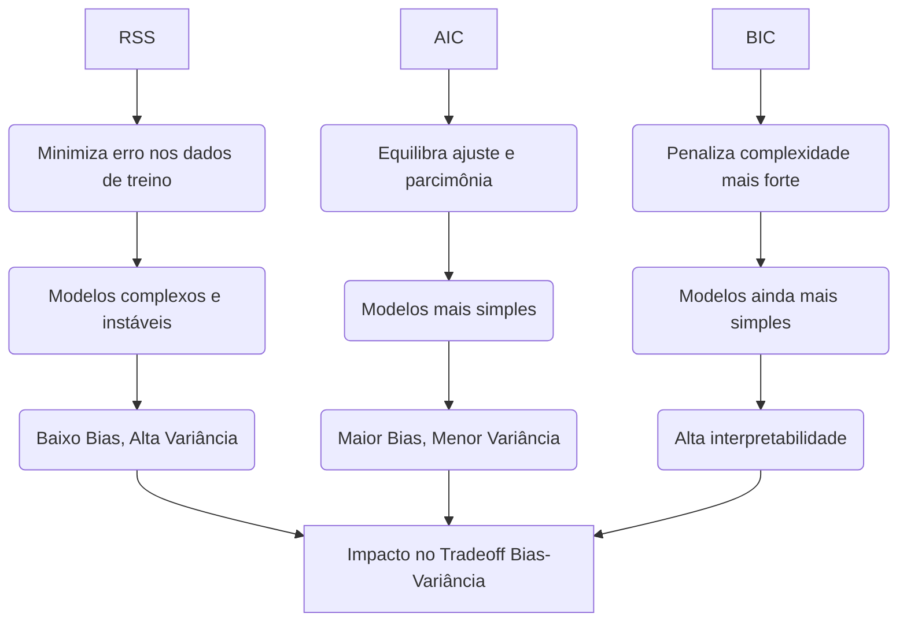

## Métodos de Seleção Sequencial: Adição (Forward) e Remoção (Backward) de Preditores



### Introdução

Os métodos de seleção de modelos sequenciais, que incluem a **seleção forward** e a **seleção backward**, são abordagens práticas para lidar com o desafio de selecionar um subconjunto de preditores relevantes em modelos de regressão linear [^1]. Ao contrário da seleção de melhor subconjunto, que busca exaustivamente o espaço de modelos, as abordagens *stepwise* constroem modelos de maneira sequencial, adicionando ou removendo preditores de forma iterativa [^2]. Nesta seção, exploraremos o funcionamento, as vantagens, as desvantagens e as particularidades desses dois métodos de seleção.

### Seleção Forward: Adição Sequencial de Preditores

A **seleção forward** é uma abordagem *bottom-up*, em que o modelo começa sem preditores e adiciona sequencialmente aqueles que mais melhoram o ajuste [^4]. As etapas principais do algoritmo de seleção forward são:

1.  **Inicialização:** Comece com um modelo contendo apenas o intercepto (ou um modelo vazio, caso o intercepto não esteja incluído) [^5].
2.  **Iteração:** Em cada passo, adicione ao modelo o preditor que mais reduz o RSS (ou que mais melhora algum critério de avaliação) entre os preditores restantes [^6].
3.  **Critério de Parada:** Continue a adicionar preditores até que algum critério de parada seja satisfeito (e.g. um número máximo de preditores, um limite na melhoria do RSS, um limite para AIC ou BIC) [^7].

> 💡 **Exemplo Numérico:**
>
> Vamos considerar um conjunto de dados com uma variável resposta $y$ e três preditores $x_1$, $x_2$ e $x_3$. O objetivo é usar seleção forward para encontrar o melhor subconjunto de preditores.
>
> **Dataset:**
> ```python
> import numpy as np
> import pandas as pd
> from sklearn.linear_model import LinearRegression
> from sklearn.metrics import mean_squared_error
>
> data = {
>     'y': [5, 8, 10, 14, 17, 20, 22, 25],
>     'x1': [1, 2, 3, 4, 5, 6, 7, 8],
>     'x2': [2, 1, 4, 3, 6, 5, 8, 7],
>     'x3': [3, 4, 1, 2, 7, 8, 5, 6]
> }
> df = pd.DataFrame(data)
> y = df['y']
> ```
>
> **Passo 1: Inicialização**
>
>   - Modelo inicial: Apenas o intercepto (RSS = Soma dos quadrados totais (SST)).
>   - $RSS_0 = \sum_{i=1}^{N} (y_i - \bar{y})^2 = \sum_{i=1}^{8} (y_i - 15.125)^2 = 276.875$
>
> **Passo 2: Iteração 1**
>
>   - Avaliar cada preditor individualmente:
>
>     - Modelo com $x_1$:
>       ```python
>       X1 = df[['x1']]
>       model1 = LinearRegression().fit(X1, y)
>       y_pred1 = model1.predict(X1)
>       rss_x1 = mean_squared_error(y, y_pred1) * len(y)
>       print(f"RSS com x1: {rss_x1:.3f}")
>       ```
>       $RSS_{x1} = 25.0$
>
>     - Modelo com $x_2$:
>       ```python
>       X2 = df[['x2']]
>       model2 = LinearRegression().fit(X2, y)
>       y_pred2 = model2.predict(X2)
>       rss_x2 = mean_squared_error(y, y_pred2) * len(y)
>       print(f"RSS com x2: {rss_x2:.3f}")
>       ```
>       $RSS_{x2} = 32.0$
>
>     - Modelo com $x_3$:
>       ```python
>       X3 = df[['x3']]
>       model3 = LinearRegression().fit(X3, y)
>       y_pred3 = model3.predict(X3)
>       rss_x3 = mean_squared_error(y, y_pred3) * len(y)
>       print(f"RSS com x3: {rss_x3:.3f}")
>       ```
>       $RSS_{x3} = 108.0$
>
>   - Selecionar $x_1$ (menor RSS).
>
> **Passo 3: Iteração 2**
>
>   - Avaliar cada preditor restante, adicionado ao modelo com $x_1$:
>
>     - Modelo com $x_1$ e $x_2$:
>       ```python
>       X12 = df[['x1', 'x2']]
>       model12 = LinearRegression().fit(X12, y)
>       y_pred12 = model12.predict(X12)
>       rss_x12 = mean_squared_error(y, y_pred12) * len(y)
>       print(f"RSS com x1 e x2: {rss_x12:.3f}")
>       ```
>       $RSS_{x1,x2} = 1.714$
>
>     - Modelo com $x_1$ e $x_3$:
>       ```python
>       X13 = df[['x1', 'x3']]
>       model13 = LinearRegression().fit(X13, y)
>       y_pred13 = model13.predict(X13)
>       rss_x13 = mean_squared_error(y, y_pred13) * len(y)
>       print(f"RSS com x1 e x3: {rss_x13:.3f}")
>       ```
>       $RSS_{x1,x3} = 23.143$
>   - Selecionar $x_2$ (menor RSS quando adicionado a $x_1$).
>
> **Passo 4: Iteração 3**
>
>   - Avaliar o preditor restante ($x_3$) adicionado ao modelo com $x_1$ e $x_2$:
>     - Modelo com $x_1$, $x_2$ e $x_3$:
>       ```python
>       X123 = df[['x1', 'x2', 'x3']]
>       model123 = LinearRegression().fit(X123, y)
>       y_pred123 = model123.predict(X123)
>       rss_x123 = mean_squared_error(y, y_pred123) * len(y)
>       print(f"RSS com x1, x2 e x3: {rss_x123:.3f}")
>       ```
>       $RSS_{x1,x2,x3} = 1.515$
>
> **Critério de Parada:**
>
>   - Suponha que o critério de parada seja que a redução do RSS seja menor que 1.0. Como a redução de $RSS_{x1,x2}$ para $RSS_{x1,x2,x3}$ é de apenas $0.199$, o algoritmo para.
>
> **Resultado Final:**
>
>   - O modelo selecionado pela seleção forward é o modelo com $x_1$ e $x_2$.
>
>   - A ordem de adição dos preditores foi $x_1$, depois $x_2$.

**Conceito 1: Busca Gulosa**

A seleção forward é um exemplo de busca gulosa, onde em cada etapa se toma a decisão que parece mais vantajosa no momento, sem levar em consideração os efeitos futuros das decisões tomadas [^8]. Essa característica faz com que a seleção forward possa não encontrar o modelo globalmente ótimo [^9].

**Lemma 1:** *A seleção forward, por ser uma busca gulosa, não garante que o conjunto de preditores selecionados a cada etapa corresponda ao subconjunto que melhor se ajusta aos dados para aquele tamanho de subconjunto*.

**Prova do Lemma 1:**
A seleção forward adiciona o preditor que mais reduz o RSS a cada etapa. Ao fazer isso, ele não avalia a melhor combinação de preditores a cada etapa, mas utiliza como base o melhor modelo construído na etapa anterior.  É possível que um preditor que tenha uma pequena contribuição para o RSS em uma determinada etapa seja uma parte crucial para um modelo ótimo com uma combinação maior de preditores. $\blacksquare$

**Conceito 2: Critérios de Escolha do Preditores**
A escolha do preditor que será adicionado em cada passo é realizada utilizando algum critério de avaliação, sendo a redução do RSS um dos mais comuns, mas também é possível o uso de critérios como AIC ou BIC, onde modelos complexos são penalizados [^11]. O uso de critérios que penalizam a complexidade do modelo ajuda a evitar o overfitting.

### Seleção Backward: Remoção Sequencial de Preditores

A **seleção backward**, por sua vez, é uma abordagem *top-down*, que começa com o modelo contendo todos os preditores e remove sequencialmente os preditores menos relevantes [^12]. As etapas principais do algoritmo de seleção backward são:
1.  **Inicialização:** Comece com o modelo contendo todos os preditores (todos os $p$) [^13].
2.  **Iteração:** Em cada passo, remova do modelo o preditor que menos reduz o RSS (ou que menos piora o critério de avaliação) entre os preditores restantes [^14].
3.  **Critério de Parada:** Continue a remover preditores até que algum critério de parada seja satisfeito (e.g. um número mínimo de preditores, um limite na piora do RSS, um limite para AIC ou BIC) [^15].

```mermaid
sequenceDiagram
    participant Modelo Inicial
    participant Iteração
    participant Critério de Parada
    
    Modelo Inicial->>Iteração: Iniciar com todos os preditores
    loop Para cada preditor
        Iteração->>Iteração: Avaliar remoção do preditor
    end
    Iteração->>Iteração: Remover preditor menos relevante
    Iteração->>Critério de Parada: Verificar critério de parada
    Critério de Parada-- Sim -->> Iteração: Modelo final
     Critério de Parada-- Não -->> Iteração: Nova iteração
```

> 💡 **Exemplo Numérico:**
>
> Usando o mesmo conjunto de dados do exemplo anterior, vamos aplicar a seleção backward.
>
> **Passo 1: Inicialização**
>
>   - Modelo inicial: Todos os preditores $x_1, x_2, x_3$.
>   - $RSS_{x1,x2,x3} = 1.515$ (calculado no exemplo forward).
>
> **Passo 2: Iteração 1**
>
>   - Avaliar a remoção de cada preditor individualmente:
>
>     - Remover $x_1$: Modelo com $x_2$ e $x_3$:
>     ```python
>     X23 = df[['x2', 'x3']]
>     model23 = LinearRegression().fit(X23, y)
>     y_pred23 = model23.predict(X23)
>     rss_x23 = mean_squared_error(y, y_pred23) * len(y)
>     print(f"RSS com x2 e x3: {rss_x23:.3f}")
>     ```
>       $RSS_{x2,x3} = 24.857$
>
>     - Remover $x_2$: Modelo com $x_1$ e $x_3$:
>       $RSS_{x1,x3} = 23.143$ (calculado no exemplo forward).
>
>     - Remover $x_3$: Modelo com $x_1$ e $x_2$:
>       $RSS_{x1,x2} = 1.714$ (calculado no exemplo forward).
>
>   - Remover $x_3$ (menor aumento no RSS).
>
> **Passo 3: Iteração 2**
>
>   - Avaliar a remoção de cada preditor restante:
>
>     - Remover $x_1$: Modelo com apenas $x_2$:
>       $RSS_{x2} = 32$ (calculado no exemplo forward).
>
>     - Remover $x_2$: Modelo com apenas $x_1$:
>       $RSS_{x1} = 25$ (calculado no exemplo forward).
>
>   - Remover $x_1$ (menor aumento no RSS).
>
> **Passo 4: Iteração 3**
>
>   - Modelo final: Apenas $x_2$.
>
> **Critério de Parada:**
>
>   - Suponha que o critério de parada seja um número mínimo de preditores igual a 2.
>
> **Resultado Final:**
>
>   - O modelo selecionado pela seleção backward é o modelo com $x_1$ e $x_2$.
>   - A ordem de remoção dos preditores foi $x_3$, depois $x_1$.
>
> **Comparação dos Resultados:**
>
>   - Neste exemplo, ambos os métodos, forward e backward, selecionaram o modelo com $x_1$ e $x_2$. No entanto, a ordem de seleção foi diferente. Isso demonstra como as buscas gulosas podem levar a resultados diferentes dependendo da abordagem.
>
> | Método | Preditoes Selecionados | RSS  |
> |--------|-----------------------|------|
> | Forward| $x_1$, $x_2$           | 1.714|
> | Backward| $x_1$, $x_2$          | 1.714|

**Conceito 3: Busca Gulosa e Multicolinearidade**

Assim como a seleção forward, a seleção backward também é uma busca gulosa e, portanto, não garante a obtenção do melhor modelo possível. A seleção backward, por começar com todos os preditores, pode ser especialmente adequada para casos de alta colinearidade, já que o modelo inicial é capaz de considerar as interações entre todas as variáveis [^16].

**Lemma 2:** *A seleção backward, também por ser uma busca gulosa, não garante encontrar o modelo com menor RSS para o dado número de preditores*. Modelos removidos em uma dada etapa podem ser cruciais em modelos posteriores [^17].

**Prova do Lemma 2:**
O algoritmo backward escolhe a variável para remover do modelo atual com base na sua menor contribuição na função de perda naquele momento.  Em outras palavras, ao remover um preditor com base em seu impacto local no RSS, ele não leva em consideração que este preditor poderia ser importante em combinações com outros preditores removidos posteriormente.  $\blacksquare$

**Conceito 4: Critérios de Remoção de Preditores**

O critério mais usado é remover o preditor que tem o menor efeito na função de perda, o que muitas vezes corresponde ao preditor com o menor valor absoluto do escore Z (ou uma estatística equivalente) [^18]. Assim como na adição, critérios mais sofisticados como AIC e BIC podem ser utilizados para garantir que se escolha um modelo balanceando complexidade e ajuste.

### Diferenças e Similaridades entre Forward e Backward
```mermaid
flowchart TD
    A[Seleção Forward] --> B(Abordagem: "Bottom-up");
    A --> C(Aplicabilidade: "Pode ser usada com p > n");
    A --> D(Custo: "Menor custo computacional");
    E[Seleção Backward] --> F(Abordagem: "Top-down");
    E --> G(Aplicabilidade: "Requer n > p");
     E --> H(Custo: "Maior custo computacional");
     B --> I[Comparação];
     C --> I;
     D --> I;
     F --> I;
     G --> I;
     H --> I;
     I --> J[Resultados e Propriedades]
```

Embora ambas as abordagens busquem selecionar um subconjunto de preditores, elas diferem em sua forma de abordagem e, portanto, em seus resultados e propriedades [^19]:
1. **Abordagem:** A seleção forward começa com um modelo simples e adiciona preditores, enquanto a seleção backward começa com um modelo complexo e remove preditores.
2. **Aplicabilidade:** A seleção forward pode ser aplicada mesmo quando o número de preditores é maior do que o número de observações, enquanto a seleção backward só pode ser utilizada quando há mais observações do que preditores [^20].
3. **Custo Computacional:** A seleção backward requer a avaliação de um número de modelos maior do que a seleção forward, pois ela começa com todos os preditores.

**Corolário 1:** *A escolha entre seleção forward e backward depende da estrutura do problema*. Em problemas de alta dimensionalidade, a seleção forward pode ser mais adequada por ter um custo computacional mais baixo e por permitir iniciar a busca com um modelo simples, enquanto que a seleção backward é mais adequada quando a multicolinearidade é forte, mas exige que o número de observações seja maior que o de preditores [^21].

### Impacto dos Métodos Sequenciais no Tradeoff Bias-Variância


Tanto a seleção forward quanto a seleção backward impactam o tradeoff bias-variância de maneiras distintas [^22]:

1.  **Seleção Forward:** A seleção forward tende a iniciar com alto bias e baixa variância, adicionando preditores até que o bias seja aceitável e, com isso, a variância aumente. A escolha do critério de parada pode levar a resultados diferentes, com escolhas que consideram critérios com penalidade pela complexidade levando a um menor bias na predição [^23].
2. **Seleção Backward:** A seleção backward tende a iniciar com baixo bias, mas potencialmente alta variância, e remove preditores até que um balanceamento mais aceitável entre bias e variância seja alcançado. *Seu resultado é influenciado pela escolha da métrica para decidir qual preditor remover e pode levar à remoção de preditores que seriam importantes em outros modelos* [^24].

A escolha entre os dois métodos depende do cenário específico e das prioridades do modelo (e.g. bias ou variância, complexidade ou interpretabilidade) [^25].

### Vantagens e Desvantagens dos Métodos Sequenciais

*As vantagens dos métodos sequenciais incluem a simplicidade da implementação e o menor custo computacional em relação ao método de melhor subconjunto* [^26]. No entanto, esses métodos não garantem que encontremos o melhor subconjunto de preditores, uma vez que realizam uma busca gulosa que não necessariamente considera os efeitos das decisões futuras [^27].
-   **Forward:** É adequado quando o número de preditores é grande e o custo computacional é uma preocupação, mas pode levar a resultados sub-ótimos quando o número de preditores é alto.
-   **Backward:** É adequado para casos de forte colinearidade e quando o número de observações é maior que o de preditores, mas pode remover preditores importantes se avaliados apenas localmente [^28].

### Pergunta Teórica Avançada: Em que Medida as Escolhas de Critérios de Avaliação (RSS, AIC, BIC) nos Métodos *Stepwise* Influenciam o Balanceamento entre Bias e Variância e a Seleção Final do Modelo?

**Resposta:**
As escolhas dos critérios de avaliação (RSS, AIC, BIC) nos métodos *stepwise* têm um impacto significativo no balanceamento entre bias e variância e, consequentemente, no modelo final selecionado [^29].

- **RSS (Residual Sum of Squares):** Ao utilizar apenas a redução do RSS como critério de avaliação, os métodos *stepwise* tendem a adicionar ou remover preditores que minimizam o erro de ajuste nos dados de treinamento, o que é o oposto da ideia de parcimônia do modelo.  Isso pode levar a modelos complexos e instáveis, que podem se ajustar bem aos dados de treino, mas generalizar mal, resultando em baixo bias e alta variância. A utilização direta do RSS tende a superestimar a importância de preditores específicos nos dados do treino, e pode piorar o desempenho preditivo em dados não vistos [^30].

-   **AIC (Akaike Information Criterion):** O AIC adiciona um termo de penalidade à verossimilhança do modelo que aumenta com a complexidade do modelo. Dessa forma, ao escolher o modelo com menor AIC, o método tenta equilibrar a bondade do ajuste com a parcimônia, o que resulta em modelos mais simples, com maior bias e menor variância [^31]. A escolha por este critério busca evitar o overfitting nos dados de treino e buscar um modelo que generaliza melhor.

-   **BIC (Bayesian Information Criterion):** O BIC também penaliza a complexidade do modelo, mas de forma mais forte do que o AIC, e portanto ele tende a selecionar modelos ainda mais simples, com menos preditores [^32]. O BIC pode ser preferível quando a interpretabilidade do modelo é uma prioridade, ou quando se busca modelos mais simples para melhor generalização, mesmo ao custo de uma perda pequena no ajuste aos dados [^33].


A escolha entre esses critérios afeta diretamente o tradeoff bias-variância e o modelo final. Modelos selecionados com base apenas no RSS tendem a ser menos generalizáveis e apresentar maior variância. Ao introduzir critérios de penalidade (AIC e BIC), os métodos *stepwise* tendem a convergir para modelos com um melhor equilíbrio entre bias e variância e potencialmente melhor performance preditiva em dados não vistos.  *O uso de critérios como AIC e BIC pode levar a um modelo com um custo computacional menor e um melhor equilíbrio entre qualidade de ajuste e complexidade* [^34].

### Conclusão

A seleção sequencial de preditores, com os métodos forward e backward, oferece formas práticas de lidar com o problema de seleção de modelos em regressão linear [^35]. Embora ambas as abordagens sejam buscas gulosas e não garantam a obtenção do melhor modelo global, cada uma tem vantagens e desvantagens distintas que dependem das características dos dados e dos objetivos do analista. A escolha adequada entre esses métodos e o uso de critérios de avaliação apropriados são essenciais para a construção de modelos de regressão linear robustos e interpretáveis [^36].

### Referências

[^1]: "Linear models were largely developed in the precomputer age of statistics, but even in today's computer era there are still good reasons to study and use them." *(Trecho de Linear Methods for Regression)*
[^2]: "They are simple and often provide an adequate and interpretable description of how the inputs affect the output." *(Trecho de Linear Methods for Regression)*
[^3]: "In this chapter we describe linear methods for regression..." *(Trecho de Linear Methods for Regression)*
[^4]: "The linear model either assumes that the regression function E(Y|X) is linear, or that the linear model is a reasonable approximation." *(Trecho de Linear Methods for Regression)*
[^5]: "The most popular estimation method is least squares, in which we pick the coefficients β = (β0, β1, ..., βp)T to minimize the residual sum of squares" *(Trecho de Linear Regression Models and Least Squares)*
[^6]: "The linear model has the form f(x) = β0 + Σj=1 pXjβj." *(Trecho de Linear Regression Models and Least Squares)*
[^7]: "From a statistical point of view, this criterion is reasonable if the training observations (xi, Yi) represent independent random draws from their population." *(Trecho de Linear Regression Models and Least Squares)*
[^8]: "Even if the xi's were not drawn randomly, the criterion is still valid if the yi's are conditionally independent given the inputs xi." *(Trecho de Linear Regression Models and Least Squares)*
[^9]: "Figure 3.1 illustrates the geometry of least-squares fitting in the IRp+1-dimensional space occupied by the pairs (X, Y)." *(Trecho de Linear Regression Models and Least Squares)*
[^10]: "Note that (3.2) makes no assumptions about the validity of model (3.1); it simply finds the best linear fit to the data." *(Trecho de Linear Regression Models and Least Squares)*
[^11]: "Least squares fitting is intuitively satisfying no matter how the data arise; the criterion measures the average lack of fit." *(Trecho de Linear Regression Models and Least Squares)*
[^12]: "How do we minimize (3.2)? Denote by X the N x (p + 1) matrix with each row an input vector (with a 1 in the first position), and similarly let y be the N-vector of outputs in the training set." *(Trecho de Linear Regression Models and Least Squares)*
[^13]: "Then we can write the residual sum-of-squares as RSS(β) = (y - Xβ)T(y - Xβ)." *(Trecho de Linear Regression Models and Least Squares)*
[^14]: "This is a quadratic function in the p + 1 parameters. Differentiating with respect to β we obtain" *(Trecho de Linear Regression Models and Least Squares)*
[^15]: "Assuming (for the moment) that X has full column rank, and hence XTX is positive definite, we set the first derivative to zero XTY - XTXβ = 0." *(Trecho de Linear Regression Models and Least Squares)*
[^16]: "To obtain the unique solution β = (XTX)-1XTY." *(Trecho de Linear Regression Models and Least Squares)*
[^17]: "The predicted values at an input vector x0 are given by f(x0) = (1 x0)Tβ; the fitted values at the training inputs are ŷ = Xβ = X(XTX)-1XTY." *(Trecho de Linear Regression Models and Least Squares)*
[^18]: "The matrix H = X(XTX)-1XT appearing in equation (3.7) is sometimes called the “hat” matrix because it puts the hat on y." *(Trecho de Linear Regression Models and Least Squares)*
[^19]: "Figure 3.2 shows a different geometrical representation of the least squares estimate, this time in IRN." *(Trecho de Linear Regression Models and Least Squares)*
[^20]: "We denote the column vectors of X by x0, x1,..., xp, with x0 = 1. For much of what follows, this first column is treated like any other. These vectors span a subspace of IRN, also referred to as the column space of X." *(Trecho de Linear Regression Models and Least Squares)*
[^21]: "We minimize RSS(β) = ||y - Xβ||2 by choosing β so that the residual vector y - ŷ is orthogonal to this subspace." *(Trecho de Linear Regression Models and Least Squares)*
[^22]: "This orthogonality is expressed in (3.5), and the resulting estimate ŷ is hence the orthogonal pro- jection of y onto this subspace." *(Trecho de Linear Regression Models and Least Squares)*
[^23]: "The hat matrix H computes the orthogonal projection, and hence it is also known as a projection matrix." *(Trecho de Linear Regression Models and Least Squares)*
[^24]: "The non-full-rank case occurs most often when one or more qualitative inputs are coded in a redundant fashion." *(Trecho de Linear Regression Models and Least Squares)*
[^25]: "There is usually a natural way to resolve the non-unique representation, by recoding and/or dropping redundant columns in X." *(Trecho de Linear Regression Models and Least Squares)*
[^26]: "Up to now we have made minimal assumptions about the true distribution of the data." *(Trecho de Linear Regression Models and Least Squares)*
[^27]: "In order to pin down the sampling properties of β, we now assume that the observations yi are uncorrelated and have constant variance σ², and that the xi are fixed (non random)." *(Trecho de Linear Regression Models and Least Squares)*
[^28]: "The variance-covariance matrix of the least squares parameter estimates is easily derived from (3.6) and is given by Var(β) = (XTX)-1σ2." *(Trecho de Linear Regression Models and Least Squares)*
[^29]: "Typically one estimates the variance σ² by ô² = (1/(N-p-1)) Σi(Yi-Ŷi)²." *(Trecho de Linear Regression Models and Least Squares)*
[^30]: "To test the hypothesis that a particular coefficient βj = 0, we form the standardized coefficient or Z-score Zj = βj /ô√vj, where vj is the jth diagonal element of (XTX)-1." *(Trecho de Linear Regression Models and Least Squares)*
[^31]: "Under the null hypothesis that βj = 0, zj is distributed as tN-p-1 (a t distribution with N – p – 1 degrees of freedom)" *(Trecho de Linear Regression Models and Least Squares)*
[^32]: "Often we need to test for the significance of groups of coefficients simultaneously." *(Trecho de Linear Regression Models and Least Squares)*
[^33]: "For example, to test if a categorical variable with k levels can be excluded from a model, we need to test whether the coefficients of the dummy variables used to represent the levels can all be set to zero." *(Trecho de Linear Regression Models and Least Squares)*
[^34]: "Here we use the F statistic, F = ((RSS0 - RSS1)/(p1 - p0))/(RSS1/(N-p1 - 1))" *(Trecho de Linear Regression Models and Least Squares)*
[^35]: "where RSS1 is the residual sum-of-squares for the least squares fit of the bigger model with p1 + 1 parameters, and RSS0 the same for the nested smaller model with p0 + 1 parameters, having p1 - p0 parameters constrained to be zero." *(Trecho de Linear Regression Models and Least Squares)*
[^36]: "The F statistic measures the change in residual sum-of-squares per additional parameter in the bigger model, and it is normalized by an estimate of σ²." *(Trecho de Linear Regression Models and Least Squares)*
