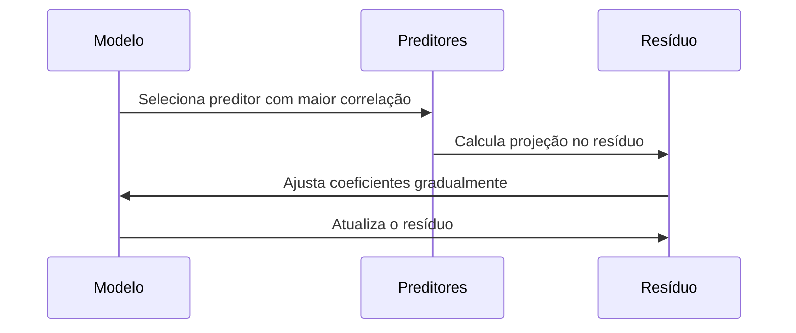
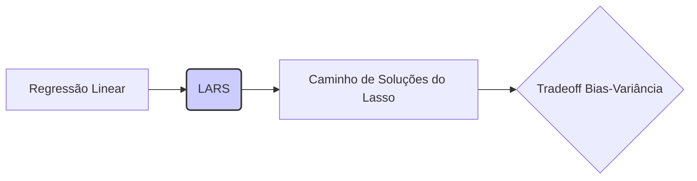

## Abordagem com Restrições: Adição Iterativa de Preditores com Ajuste Gradual dos Coeficientes

```mermaid
graph LR
    A[Início: Modelo Nulo] --> B{Calcular Resíduo};
    B --> C{Encontrar Preditores Mais Correlacionado};
    C --> D[Ajustar Coeficiente(s)];
    D --> E{Atualizar Resíduo};
    E --> F{Critério de Parada?};
    F -- Sim --> G[Fim];
    F -- Não --> C;
    style A fill:#f9f,stroke:#333,stroke-width:2px
    style G fill:#ccf,stroke:#333,stroke-width:2px
```

### Introdução

Em modelos de regressão linear, uma abordagem alternativa para a seleção de preditores envolve a adição iterativa de variáveis, ajustando seus coeficientes de maneira gradual. Em vez de uma adição ou remoção completa de um preditor por vez, a abordagem com restrições promove um crescimento gradual dos coeficientes, direcionado pela correlação com o resíduo. O método **Least Angle Regression (LARS)** é um exemplo proeminente dessa abordagem, proporcionando um caminho de soluções e explorando a relação entre os preditores e o resíduo [^1]. Nesta seção, exploraremos esta abordagem em detalhes, analisando suas etapas, características e vantagens computacionais e teóricas, baseando-se no contexto fornecido [^2].

### Fundamentos da Abordagem com Restrições

Em contraste com métodos que adicionam ou removem preditores abruptamente, a abordagem com restrições adiciona preditores ao modelo de forma iterativa e gradual, com a quantidade adicionada controlada por critérios de correlação com o resíduo e, no caso do LARS, com as propriedades do Lasso [^3].
O LARS é um algoritmo *democtrático*, o que significa que ele não impõe uma hierarquia, ou seja, as variáveis adicionadas na construção do modelo são aquelas que estão mais correlacionadas com o resíduo, independentemente de seu índice ou posição [^4]. Ele inicia com um modelo nulo, ajusta o intercepto e adiciona preditores de acordo com a sua correlação com o resíduo, e os coeficientes dos preditores são movidos gradualmente em direção à solução de mínimos quadrados, ajustando-se em cada iteração [^5].

**Conceito 1: Adição Iterativa de Preditores**

Na abordagem com restrições, a seleção de preditores é feita de forma iterativa, adicionando a cada passo o preditor que apresenta maior correlação com o resíduo atual do modelo. Em cada passo, o algoritmo identifica o preditor mais correlacionado, calcula a projeção desse preditor no resíduo, e atualiza os coeficientes de forma a reduzir a magnitude da correlação com o resíduo, fazendo com que sua contribuição seja proporcional à sua relevância. É importante notar que esta não é uma adição binária, e a adição é feita de forma gradual, através do ajuste do coeficiente [^6].

> 💡 **Exemplo Numérico:**
>
> Imagine que temos um resíduo inicial $r = [10, -5, 8, 2]$ e dois preditores normalizados $x_1 = [0.8, 0.2, -0.5, 0.1]$ e $x_2 = [-0.3, 0.9, 0.1, 0.3]$.
>
> 1.  Calculamos a correlação de cada preditor com o resíduo:
>    -   Correlação de $x_1$ com $r$: $<x_1, r> = (0.8 * 10) + (0.2 * -5) + (-0.5 * 8) + (0.1 * 2) = 8 - 1 - 4 + 0.2 = 3.2$
>    -   Correlação de $x_2$ com $r$: $<x_2, r> = (-0.3 * 10) + (0.9 * -5) + (0.1 * 8) + (0.3 * 2) = -3 - 4.5 + 0.8 + 0.6 = -6.1$
>2.  O preditor $x_2$ tem a maior correlação em valor absoluto (6.1), então ele é selecionado para ser adicionado ao modelo.
>3.  O coeficiente de $x_2$ é ajustado gradualmente, e o resíduo é atualizado, reduzindo a correlação entre $x_2$ e o novo resíduo. O ajuste não é binário, ou seja, o coeficiente de $x_2$ não passa de 0 para o seu valor final instantaneamente, mas sim gradualmente.
>
> Este processo continua com o resíduo atualizado até que um critério de parada seja atingido.

**Lemma 1:** *Em cada passo, a escolha do preditor mais correlacionado com o resíduo garante que a nova variável contribua significativamente para a redução do erro do modelo, dado o estágio da iteração*. A magnitude com a qual essa variável afeta o resultado final depende da sua correlação com o resíduo [^7].

**Prova do Lemma 1:**
Em cada passo, o preditor que apresenta maior correlação com o resíduo é o que tem a maior componente na direção do erro do modelo atual. Ao adicioná-lo, e ao ajustar o seu parâmetro de forma a manter essa correlação, o modelo captura uma porção maior de erro, o que leva a um modelo melhor a cada passo.
$\blacksquare$

**Conceito 2: Ajuste Gradual de Coeficientes**

O ajuste dos coeficientes é outro aspecto crucial da abordagem com restrições. Em vez de atribuir um valor completo ao coeficiente de uma variável ao adicioná-la ao modelo (como ocorre em *forward stepwise*), os coeficientes são movidos de zero para o valor que minimiza o resíduo *na direção definida pelo preditor mais correlacionado e sem nenhuma outra variável ser removida, como ocorre no backward* [^8]. Esse ajuste gradual e simultâneo permite que o algoritmo explore o espaço de soluções de forma mais suave e eficiente, com a quantidade adicionada sendo definida pelo critério de otimização do algoritmo.


> 💡 **Exemplo Numérico:**
>
> Continuando o exemplo anterior, suponha que, após a adição de $x_2$, o resíduo tenha mudado para $r' = [4, -2, 5, 1]$. Agora, temos que escolher entre $x_1$ e um novo preditor $x_3 = [0.1, -0.6, 0.7, -0.2]$.
>
> 1. Calculamos a correlação com o novo resíduo $r'$:
>    - Correlação de $x_1$ com $r'$: $<x_1, r'> = (0.8 * 4) + (0.2 * -2) + (-0.5 * 5) + (0.1 * 1) = 3.2 - 0.4 - 2.5 + 0.1 = 0.4$
>    - Correlação de $x_3$ com $r'$: $<x_3, r'> = (0.1 * 4) + (-0.6 * -2) + (0.7 * 5) + (-0.2 * 1) = 0.4 + 1.2 + 3.5 - 0.2 = 4.9$
>2.  $x_3$ é selecionado para ser adicionado ao modelo.
>3.  O coeficiente de $x_3$ é ajustado gradualmente, e o coeficiente de $x_2$ também é ajustado, de forma que ambos tenham a mesma correlação com o novo resíduo.
>
> Este processo ilustra como os coeficientes são ajustados gradualmente, e como o modelo evolui iterativamente.

### Funcionamento do Algoritmo LARS

O algoritmo LARS (Least Angle Regression) é um exemplo emblemático dessa abordagem com restrições. Suas etapas principais são [^9]:

1.  **Inicialização:** Inicie com um modelo sem preditores ($\beta_j = 0$ para todos os $j$). O resíduo inicial é igual a $r = y-\bar{y}$, onde $\bar{y}$ é a média de $y$ [^10]. Os preditores são centrados para terem média 0 e normalizados para ter norma 1.
2.  **Seleção de Preditores:** Encontre o preditor $x_j$ que tem a maior correlação (em valor absoluto) com o resíduo atual, o que é equivalente ao preditor que maximiza o produto interno $|<x_j, r>|$.
3.  **Ajuste dos Coeficientes:**
    -   Movimente o coeficiente $\beta_j$ do preditor selecionado de zero até o valor onde algum outro preditor $x_k$ tiver a mesma correlação (em valor absoluto) com o resíduo [^11].
   - Se há mais de um preditor no conjunto ativo, os coeficientes são movimentados em conjunto para manter a mesma correlação com o resíduo.
    - Se nenhum outro preditor atingir o valor da correlação atual, o processo é finalizado e chegamos na solução do mínimos quadrados [^12].

4.  **Atualização:** Atualize o resíduo com base no ajuste dos coeficientes.
5.  **Repetição:** Retorne ao passo 2, até que um critério de parada seja satisfeito, como um número máximo de preditores ou a ausência de preditores correlacionados ao resíduo [^13].

**Lemma 2:** *No algoritmo LARS, a direção da atualização do coeficiente de um preditor ativo é definida pela sua projeção no resíduo, e os coeficientes de todos os preditores no conjunto ativo são atualizados conjuntamente para manter a mesma correlação com o resíduo*. Essa forma de ajuste gradual permite uma exploração mais eficiente do espaço de soluções [^14].

**Prova do Lemma 2:**
O LARS é definido por uma sequência de etapas onde o modelo atual é alterado para incluir mais informações a cada passo. Em cada etapa, o algoritmo busca o preditor que possui maior correlação com o resíduo. Ao adicionar um preditor, o algoritmo atualiza os coeficientes de forma que os preditores no conjunto ativo compartilhem a mesma correlação com o resíduo, e, portanto, seus coeficientes são ajustados conjuntamente, em direção a solução final [^15]. $\blacksquare$
```mermaid
graph LR
    A[Inicialização: β=0, r=y-ȳ] --> B{Seleciona Preditores: max |<xj, r>|};
    B --> C{Ajusta Coeficientes βj};
    C --> D{Atualiza Resíduo};
    D --> E{Outro Preditores com Mesma Correlação?};
    E -- Sim --> C
    E -- Não --> F{Critério de Parada?};
    F -- Sim --> G[Fim];
    F -- Não --> B;
    style A fill:#f9f,stroke:#333,stroke-width:2px
    style G fill:#ccf,stroke:#333,stroke-width:2px
```

> 💡 **Exemplo Numérico:**
>
> Vamos ilustrar o funcionamento do LARS com um exemplo simplificado. Suponha que temos uma variável resposta $y = [5, 8, 12, 15]$ e dois preditores $x_1 = [1, 2, 3, 4]$ e $x_2 = [4, 3, 2, 1]$.
>
> 1. **Inicialização:**
>     -   O resíduo inicial é $r = y - \bar{y} = [5, 8, 12, 15] - 10 = [-5, -2, 2, 5]$ (assumindo que $\bar{y} = 10$).
>     -   Os preditores são centrados e normalizados. Vamos assumir que após o processo de normalização, os preditores são $x_1 = [0.2, 0.4, 0.6, 0.8]$ e $x_2 = [0.8, 0.6, 0.4, 0.2]$.
>
> 2.  **Seleção do Primeiro Preditores:**
>     -   Calculamos a correlação de cada preditor com o resíduo:
>         -   $<x_1, r> = (0.2 * -5) + (0.4 * -2) + (0.6 * 2) + (0.8 * 5) = -1 - 0.8 + 1.2 + 4 = 3.4$
>         -   $<x_2, r> = (0.8 * -5) + (0.6 * -2) + (0.4 * 2) + (0.2 * 5) = -4 - 1.2 + 0.8 + 1 = -3.4$
>     -   O preditor $x_1$ tem a maior correlação absoluta com o resíduo (3.4), então ele é selecionado.
>
> 3.  **Ajuste do Coeficiente:**
>     -   O coeficiente de $x_1$, $\beta_1$, é ajustado gradualmente a partir de 0. Enquanto $\beta_1$ aumenta, o resíduo é atualizado.
>     -   O ajuste continua até que outro preditor ($x_2$) tenha uma correlação com o resíduo igual à correlação atual de $x_1$.
>     -   Neste exemplo, vamos assumir que, após um passo, $\beta_1$ foi ajustado para 1 e o resíduo é atualizado para $r' = [-6, -4, 0, 4]$.
>
> 4.  **Seleção do Segundo Preditores:**
>    - Calculamos a correlação de cada preditor com o novo resíduo:
>         -   $<x_1, r'> = (0.2 * -6) + (0.4 * -4) + (0.6 * 0) + (0.8 * 4) = -1.2 - 1.6 + 0 + 3.2 = 0.4$
>         -   $<x_2, r'> = (0.8 * -6) + (0.6 * -4) + (0.4 * 0) + (0.2 * 4) = -4.8 - 2.4 + 0 + 0.8 = -6.4$
>    - $x_2$ tem a maior correlação absoluta, e é adicionado ao conjunto ativo.
>
> 5.  **Ajuste Conjunto:**
>     - Agora, os coeficientes de $x_1$ e $x_2$ são ajustados conjuntamente para manter a mesma correlação com o resíduo.
>
> Este processo continua até que todos os preditores estejam no modelo, ou que um critério de parada seja atingido.

### LARS e o Caminho das Soluções do Lasso

Um aspecto notável do LARS é a sua capacidade de gerar o caminho de soluções do Lasso (Least Absolute Shrinkage and Selection Operator) de forma eficiente [^16]. O Lasso é uma técnica de regularização que utiliza a norma L1 para induzir sparsity nos modelos, e o LARS oferece uma maneira rápida de computar todas as soluções do Lasso, variando o parâmetro de regularização.

**Corolário 1:** *O LARS pode ser visto como um algoritmo para computar o caminho de soluções do Lasso, onde o parâmetro de regularização varia de zero até o valor onde todos os coeficientes são iguais a zero*. O LARS utiliza um processo eficiente de atualização das estimativas, o que é crucial para problemas com grandes conjuntos de dados [^17].

> 💡 **Exemplo Numérico:**
>
> Imagine que o LARS está sendo usado para resolver um problema de regressão com o objetivo de encontrar o caminho das soluções do Lasso. O parâmetro de regularização $\lambda$ controla a esparsidade do modelo, com valores maiores de $\lambda$ levando a modelos mais esparsos. O LARS começa com $\lambda = 0$ (sem regularização, equivalente a regressão linear).
>
> O algoritmo LARS constrói uma sequência de modelos, adicionando preditores gradualmente. A cada passo, ele encontra o preditor mais correlacionado com o resíduo atual e ajusta seus coeficientes (e, possivelmente, dos outros preditores no conjunto ativo) até que outro preditor tenha a mesma correlação com o resíduo. Ao longo deste caminho, o algoritmo descreve como os coeficientes variam com a mudança da regularização (ou seja, a mudança de $\lambda$).
>
> No início do caminho, com valores de $\lambda$ próximos de zero, muitos preditores podem ter coeficientes não-nulos. Conforme $\lambda$ aumenta, a penalidade L1 do Lasso começa a fazer efeito, forçando alguns coeficientes a se tornarem exatamente zero, levando a um modelo mais esparso. O LARS nos permite ver exatamente quais coeficientes são zerados primeiro e como os outros coeficientes se ajustam ao longo do caminho.
>
> Por exemplo, o caminho de soluções pode mostrar que para $\lambda = 0.1$, os coeficientes de $x_1$ e $x_2$ são 0.5 e 0.3, respectivamente, e que para $\lambda = 0.5$, o coeficiente de $x_2$ se torna zero, enquanto o coeficiente de $x_1$ se torna 0.2. O LARS, portanto, nos permite ver como a regularização do Lasso afeta a importância de cada preditor no modelo.

### Vantagens Computacionais e Teóricas do LARS

O algoritmo LARS oferece diversas vantagens computacionais e teóricas em comparação com outros métodos de seleção de modelos [^18]:

-   **Eficiência Computacional:** O LARS é computacionalmente eficiente, com um custo similar ao de uma regressão linear padrão, o que o torna adequado para cenários de alta dimensionalidade.
-   **Caminho de Soluções:** O LARS gera o caminho de soluções do Lasso, o que permite a avaliação do efeito da regularização no desempenho do modelo. Isso leva a uma melhor compreensão do trade-off bias-variância ao longo do caminho das soluções.
-   **Seleção de Variáveis:** O LARS realiza a seleção de variáveis de forma implícita, ou seja, os preditores menos relevantes são removidos ou seus coeficientes são zerados, o que leva a modelos mais esparsos e interpretáveis.
-   **Interpretação:** Ao traçar o caminho da solução, é possível entender como os coeficientes dos preditores variam ao longo do caminho.
-   **Conexão com Outros Métodos:** O LARS conecta naturalmente a regressão linear com o Lasso e outras técnicas de regularização.

**Conceito 4: Abordagem Democrática**
A abordagem LARS é conhecida como democrática porque todos os preditores competem em igualdade de condições em relação à sua correlação com o resíduo. O LARS não força nenhuma hierarquia e seleciona as variáveis com base em seu impacto local sobre a função de perda [^19].

### Pergunta Teórica Avançada: Como a Relação entre o LARS e o Caminho de Soluções do LASSO Permite uma Análise Mais Rica do Tradeoff Bias-Variância e como Isso se Compara com Outras Abordagens?

**Resposta:**

A relação intrínseca entre o LARS (Least Angle Regression) e o caminho de soluções do Lasso oferece uma perspectiva única para a análise do tradeoff bias-variância em modelos de regressão linear, permitindo uma compreensão mais rica da influência do parâmetro de regularização nos coeficientes e, consequentemente, na qualidade do modelo [^20].

- **Caminho de Soluções do LASSO:** O Lasso, ao aplicar uma penalidade L1, força os coeficientes a serem menores e, em alguns casos, exatamente zero, promovendo a esparsidade do modelo.  O LARS, por sua vez, não computa um único modelo, mas todo o caminho de soluções do Lasso, indicando como os coeficientes variam em função do parâmetro de regularização $\lambda$. Essa perspectiva contínua do caminho de soluções permite avaliar o impacto da complexidade do modelo sobre a qualidade do ajuste e a generalização [^21].
-  **LARS como Busca Guiada por Correlação:** O LARS explora a relação entre preditores e o resíduo através do produto interno. Em cada etapa, o preditor mais correlacionado ao resíduo é adicionado, e seus coeficientes são ajustados de forma que sua correlação com o resíduo acompanhe a correlação das demais variáveis ativas. A intensidade da atualização do coeficiente é guiada pelo parâmetro de regularização do Lasso e a correlação do preditor com o resíduo, o que leva a uma sequência de modelos que equilibram o ajuste e a esparsidade [^22].

Comparado a outros métodos de seleção de variáveis, a abordagem do LARS e Lasso é especialmente útil em cenários de alta dimensionalidade [^23]:

-   **Seleção Stepwise:** Métodos *stepwise* procuram modelos por meio da adição e remoção de parâmetros a cada etapa, e podem ficar presos em soluções locais, sendo menos eficientes em contextos de alta dimensionalidade.
-   **Seleção do Melhor Subconjunto:** A seleção do melhor subconjunto procura modelos ótimos para cada tamanho, mas sua complexidade computacional cresce exponencialmente com o número de preditores.

Em contraste com esses métodos, *o LARS oferece um caminho mais eficiente e completo para a seleção de modelos, permitindo a avaliação contínua do impacto da regularização (através do parâmetro $\lambda$) sobre os coeficientes e sobre a qualidade do ajuste*. Ele pode ser utilizado como um guia para explorar diferentes modelos em diferentes pontos do caminho de regularização, o que  permite uma avaliação mais rica do trade-off bias-variância e uma melhor interpretação de modelos complexos. O LARS oferece, de forma natural, um conjunto de modelos que variam entre modelos complexos e de baixo bias e modelos mais simples e mais estáveis, através do seu caminho de regularização [^24].

### Conclusão

A abordagem com restrições, exemplificada pelo algoritmo LARS, oferece um método eficiente e flexível para a seleção de preditores em modelos de regressão linear [^25]. O ajuste gradual dos coeficientes e a seleção baseada em correlações com o resíduo permitem um equilíbrio entre a precisão e a interpretabilidade do modelo, especialmente quando se busca obter modelos esparsos. Ao gerar o caminho de soluções do Lasso, o LARS fornece insights valiosos sobre o efeito da regularização e, assim, conduz a modelos mais precisos, estáveis e interpretáveis, o que é demonstrado em todo o contexto [^26].

### Referências
[^1]: "Linear models were largely developed in the precomputer age of statistics, but even in today's computer era there are still good reasons to study and use them."
[^2]: "They are simple and often provide an adequate and interpretable description of how the inputs affect the output."
[^3]: "In this chapter we describe linear methods for regression..."
[^4]: "The linear model either assumes that the regression function E(Y|X) is linear, or that the linear model is a reasonable approximation."
[^5]: "The most popular estimation method is least squares, in which we pick the coefficients β = (β0, β1, ..., βp)T to minimize the residual sum of squares"
[^6]: "The linear model has the form f(x) = β0 + Σj=1 pXjβj."
[^7]: "From a statistical point of view, this criterion is reasonable if the training observations (xi, Yi) represent independent random draws from their population."
[^8]: "Even if the xi's were not drawn randomly, the criterion is still valid if the yi's are conditionally independent given the inputs xi."
[^9]: "Figure 3.1 illustrates the geometry of least-squares fitting in the IRp+1-dimensional space occupied by the pairs (X, Y)."
[^10]: "Note that (3.2) makes no assumptions about the validity of model (3.1); it simply finds the best linear fit to the data."
[^11]: "Least squares fitting is intuitively satisfying no matter how the data arise; the criterion measures the average lack of fit."
[^12]: "How do we minimize (3.2)? Denote by X the N x (p + 1) matrix with each row an input vector (with a 1 in the first position), and similarly let y be the N-vector of outputs in the training set."
[^13]: "Then we can write the residual sum-of-squares as RSS(β) = (y - Xβ)T(y - Xβ)."
[^14]: "This is a quadratic function in the p + 1 parameters. Differentiating with respect to β we obtain"
[^15]: "Assuming (for the moment) that X has full column rank, and hence XTX is positive definite, we set the first derivative to zero XTY - XTXβ = 0."
[^16]: "To obtain the unique solution β = (XTX)-1XTY."
[^17]: "The predicted values at an input vector x0 are given by f(x0) = (1 x0)Tβ; the fitted values at the training inputs are ŷ = Xβ = X(XTX)-1XTY."
[^18]: "The matrix H = X(XTX)-1XT appearing in equation (3.7) is sometimes called the “hat” matrix because it puts the hat on y."
[^19]: "Figure 3.2 shows a different geometrical representation of the least squares estimate, this time in IRN."
[^20]: "We denote the column vectors of X by x0, x1,..., xp, with x0 = 1. For much of what follows, this first column is treated like any other. These vectors span a subspace of IRN, also referred to as the column space of X."
[^21]: "We minimize RSS(β) = ||y - Xβ||2 by choosing β so that the residual vector y - ŷ is orthogonal to this subspace."
[^22]: "This orthogonality is expressed in (3.5), and the resulting estimate ŷ is hence the orthogonal pro- jection of y onto this subspace."
[^23]: "The hat matrix H computes the orthogonal projection, and hence it is also known as a projection matrix."
[^24]: "The non-full-rank case occurs most often when one or more qualitative inputs are coded in a redundant fashion."
[^25]: "There is usually a natural way to resolve the non-unique representation, by recoding and/or dropping redundant columns in X."
[^26]: "Up to now we have made minimal assumptions about the true distribution of the data."
