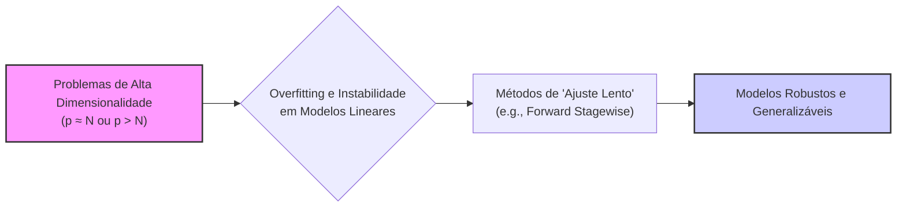
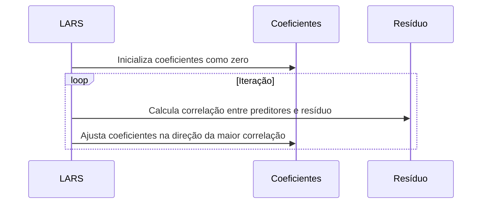

## "Ajuste Lento" e Benefícios Potenciais em Problemas de Alta Dimensionalidade



### Introdução

Em cenários de alta dimensionalidade, onde o número de preditores ($p$) se aproxima ou excede o número de observações ($N$), métodos tradicionais de regressão linear podem apresentar problemas de overfitting e instabilidade. Nesses contextos, algoritmos que promovem um "ajuste lento" dos modelos, como a **regressão *forward stagewise*** e uma versão modificada do LARS (Least Angle Regression) que aborda este tema, têm demonstrado um bom desempenho na construção de modelos mais robustos e generalizáveis [^1]. Nesta seção, exploraremos o conceito de "ajuste lento", seus benefícios em contextos de alta dimensionalidade, e como esses algoritmos se comparam a outros métodos.

### Definição e Conceito de "Ajuste Lento"

O termo "ajuste lento" refere-se a uma forma de construir modelos de regressão linear onde os coeficientes dos preditores são ajustados de maneira gradual e iterativa [^3]. Em contraste com métodos como a regressão por mínimos quadrados, que encontram os coeficientes que minimizam o RSS (Residual Sum of Squares) em um único passo, métodos de "ajuste lento" adicionam preditores e ajustam seus coeficientes aos poucos, o que leva a um caminho de soluções mais suave e estável [^4].

**Conceito 1: Abordagem Iterativa e Gradual**

Um algoritmo de ajuste lento não busca o ajuste ótimo global em um único passo, mas se aproxima gradualmente desse ótimo, adicionando ou ajustando os coeficientes de acordo com algum critério [^5]. Essa característica faz com que esses métodos sejam mais robustos a ruídos e valores atípicos, e que suas soluções tenham menor variância, o que as torna ideais para problemas com alta dimensionalidade [^6].

> 💡 **Exemplo Numérico:**
> Imagine que temos um problema de regressão com 100 observações ($N = 100$) e 200 preditores ($p = 200$). Um método de mínimos quadrados tentaria encontrar os 200 coeficientes ótimos de uma vez, o que pode levar a um modelo com alta variância e overfitting. Um método de "ajuste lento", como o *forward stagewise*, adicionaria os preditores um a um, ajustando seus coeficientes gradualmente, o que resultaria em um modelo mais estável e com menor variância.

**Lemma 1:** *A propriedade do "ajuste lento" implica em um processo de otimização que equilibra o ajuste aos dados de treinamento com a estabilidade dos coeficientes*. Isto é, a premissa que está por trás do "ajuste lento" é que o caminho para uma solução pode ser tão importante quanto a solução em si [^7].

**Prova do Lemma 1:**
O ajuste lento, por sua natureza iterativa, permite um acompanhamento do caminho da otimização, ao contrário de métodos que buscam um único modelo ótimo. Este processo permite o monitoramento da evolução do trade-off bias-variância, selecionando um modelo que, em geral, generaliza melhor, mesmo que não tenha necessariamente um ajuste perfeito aos dados de treino. $\blacksquare$

### Regressão Forward Stagewise e "Ajuste Lento"

A **regressão *forward stagewise* (FS)** é um exemplo de método que emprega o conceito de ajuste lento. A diferença principal entre a seleção *forward stepwise* e a regressão *forward stagewise* reside na forma como os coeficientes são atualizados [^8].

**Conceito 2: Diferença em relação a *Forward Stepwise***
Enquanto na seleção *forward stepwise* o preditor mais relevante é adicionado ao modelo com seu valor de mínimos quadrados para aquele subconjunto e o modelo é reajustado, na regressão *forward stagewise*, o preditor é adicionado e seu coeficiente é movido de zero em direção à sua solução de mínimos quadrados *gradualmente*, com um pequeno incremento a cada passo [^9].

```mermaid
flowchart LR
    subgraph Forward Stepwise
        A[Inicializar] --> B[Selecionar o preditor mais relevante];
        B --> C[Ajustar o modelo com o valor de mínimos quadrados];
        C --> D[Reajustar o modelo];
         D --> E{Fim?};
    end
    subgraph Forward Stagewise
         F[Inicializar] --> G[Selecionar o preditor mais relevante];
        G --> H[Mover o coeficiente gradualmente];
         H --> I{Fim?};
    end
     style A fill:#f9f,stroke:#333,stroke-width:2px
     style F fill:#f9f,stroke:#333,stroke-width:2px
     
     linkStyle 0,1,2,3,4,5,6,7,8 stroke:#333,stroke-width:2px
```

> 💡 **Exemplo Numérico:**
> Suponha que temos dois preditores, $x_1$ e $x_2$. No *forward stepwise*, se $x_1$ for o primeiro selecionado, seu coeficiente $\beta_1$ seria ajustado para minimizar o RSS usando apenas $x_1$. Em seguida, se $x_2$ for o segundo selecionado, o modelo seria reajustado com $\beta_1$ e $\beta_2$ para minimizar o RSS com ambos os preditores. No *forward stagewise*, após selecionar $x_1$, $\beta_1$ começaria de 0 e aumentaria gradualmente em pequenos passos na direção da solução de mínimos quadrados. Após selecionar $x_2$, $\beta_2$ começaria de 0 e aumentaria gradualmente, enquanto $\beta_1$ também continuaria a ser ajustado gradualmente.

**Lemma 2:** *A regressão forward stagewise atualiza os coeficientes de forma gradual, e este "ajuste lento" permite que o algoritmo se aproxime da solução ótima de forma mais estável e suave, e evite a variabilidade excessiva nos coeficientes que pode ocorrer em métodos que selecionam as variáveis por meio de passos binários* [^10].

**Prova do Lemma 2:**
Na regressão *forward stagewise*, cada coeficiente é ajustado lentamente e de forma proporcional à sua correlação com o resíduo, e, em contraste com a seleção *forward stepwise*, o modelo não é reajustado a cada passo. Isso evita a variabilidade dos coeficientes que poderia ocorrer em métodos com ajustes binários e mudanças abruptas nos parâmetros do modelo a cada iteração.  $\blacksquare$

### Algoritmo Forward Stagewise e suas Etapas

As etapas principais do algoritmo de regressão *forward stagewise* são [^11]:
1. **Inicialização:** Comece com o resíduo $r$ igual à variável resposta $y$ centrada, e todos os coeficientes ($\beta_j$) inicializados como zero. Preditores são padronizados com média zero e norma unitária [^12].
2.  **Seleção:** Encontre o preditor $x_j$ que tem a maior correlação com o resíduo $r$, ou seja, o que maximiza o valor absoluto do produto interno $|<x_j,r>|$.
3. **Atualização dos Coeficientes:** Adicione uma pequena fração $\epsilon$ ao coeficiente do preditor selecionado ($\beta_j$), na direção do sinal da correlação com o resíduo, e atualize o resíduo subtraindo a porção correspondente de $x_j$ [^13]:

   $$ \beta_j \leftarrow \beta_j + \epsilon \cdot sign(<x_j, r>) $$

   $$ r \leftarrow r - \epsilon \cdot sign(<x_j, r>) x_j $$

4. **Repetição:** Repita os passos 2 e 3 até que a correlação entre o resíduo e os preditores seja menor que um determinado limite, ou até que um número máximo de iterações seja atingido [^14].

O parâmetro $\epsilon$ controla a velocidade com que os coeficientes são ajustados e, portanto, a velocidade com que o modelo é ajustado aos dados.  Valores pequenos de $\epsilon$ levam a um "ajuste lento", e a uma maior estabilidade do modelo [^15].

> 💡 **Exemplo Numérico:**
> Suponha que após a padronização, temos um resíduo $r = [2, -1, 0.5]^T$ e um preditor $x_1 = [0.8, -0.5, 0.2]^T$. O produto interno $<x_1, r>$ é $(0.8 \times 2) + (-0.5 \times -1) + (0.2 \times 0.5) = 1.6 + 0.5 + 0.1 = 2.2$. Se $\epsilon = 0.1$, o coeficiente $\beta_1$ será atualizado para $\beta_1 \leftarrow 0 + 0.1 \times sign(2.2) = 0.1$. O novo resíduo será $r \leftarrow [2, -1, 0.5]^T - 0.1 \times [0.8, -0.5, 0.2]^T = [1.92, -0.95, 0.48]^T$.

### Benefícios do "Ajuste Lento" em Alta Dimensionalidade

Em problemas com grandes valores de $p$, métodos que realizam um "ajuste lento", como o *forward stagewise* e o LARS, podem apresentar vantagens significativas em relação a outras técnicas, como [^16]:
1.  **Estabilidade dos Coeficientes:** O ajuste gradual dos coeficientes evita mudanças abruptas nos parâmetros, o que torna as estimativas mais estáveis em relação a variações nos dados de treinamento. Métodos que adicionam parâmetros "inteiros" a cada passo podem levar a overfitting, pois não tem mecanismos de controle do trade-off bias-variância.
2.  **Redução da Variância:**  Modelos construídos com "ajuste lento" tendem a ter menor variância, o que leva a uma melhor generalização para novos dados [^17]. O processo iterativo de adição gradual de parâmetros garante que nenhuma variável seja incluída de forma excessivamente forte no modelo (evitando o overfitting), e também que nenhuma variável seja removida de forma excessivamente agressiva.
3. **Controle do Tradeoff Bias-Variância:** A velocidade com que os coeficientes são ajustados (definida pelo parâmetro $\epsilon$) é um mecanismo de controle da complexidade do modelo. Valores de $\epsilon$ menores levam a modelos mais simples e estáveis, enquanto valores maiores levam a modelos mais complexos que podem se ajustar melhor aos dados de treino, o que leva o modelo a um melhor trade-off entre bias e variância [^18].
4.  **Robustez:** O "ajuste lento" torna os modelos menos sensíveis a *outliers* ou dados com ruídos, já que a adição de parâmetros é gradual e controlada pela correlação com o resíduo [^19].
5.  **Conexão com o LARS:** Os algoritmos *forward stagewise* e LARS (que realiza um ajuste lento de forma eficiente) apresentam comportamentos similares [^20]. Em particular, o LARS pode ser interpretado como uma forma de *forward stagewise* no limite em que a taxa de aprendizagem se aproxima de zero [^21].

**Corolário 1:** *O "ajuste lento", através de seus métodos de adicionar e ajustar os parâmetros iterativamente, promove modelos com menor variância, maior robustez e melhor generalização em situações de alta dimensionalidade*. Este processo é um mecanismo para lidar com o tradeoff bias-variância [^22].

> 💡 **Exemplo Numérico:**
> Imagine que temos um dataset com $N=50$ e $p=150$. Se usarmos um método tradicional de mínimos quadrados, o modelo pode ter um erro de treinamento muito baixo, mas um erro de validação muito alto (overfitting), indicando alta variância. Um método de "ajuste lento", como o forward stagewise, poderia resultar em um erro de treinamento um pouco maior, mas um erro de validação significativamente menor, indicando melhor generalização e menor variância.

### LARS Modificado e Ajuste Lento

O contexto também apresenta uma versão modificada do algoritmo LARS, onde os coeficientes não são movidos em direção à sua solução de mínimos quadrados, mas em direção a uma solução que impõe a mesma correlação com o resíduo. Esta modificação gera um modelo de ajuste ainda mais lento, e que em situações específicas é idêntico ao Lasso [^23].

**Conceito 5: Busca Linear por um Espaço Convexo**
O LARS explora a convexidade dos modelos lineares para realizar uma busca eficiente. Uma forma de descrever o funcionamento do LARS é que ele busca o conjunto de coeficientes através da exploração de um caminho linear, com os ajustes guiados pela correlação com o resíduo [^24].



**Lemma 3:** *Ao explorar o caminho linear que leva à solução do Lasso, o algoritmo LARS gera modelos que se aproximam do mínimo da função de custo de maneira iterativa e controlada, o que leva a uma forma eficiente de regularização*. Esta forma de ajuste se aproxima do conceito de "ajuste lento" [^25].

**Prova do Lemma 3:**
O LARS usa a correlação entre os preditores e o resíduo para ajustar os parâmetros do modelo, e ao fazer isto, ele gera um caminho onde a resposta varia lentamente em direção à solução do mínimos quadrados, com um processo gradual de adição dos preditores, em função de sua relevância. $\blacksquare$

> 💡 **Exemplo Numérico:**
> O LARS pode ser visualizado como um algoritmo que move os coeficientes ao longo de um caminho linear em um espaço de parâmetros. Imagine que o caminho para a solução do Lasso seja uma linha reta, e o LARS move os coeficientes ao longo dessa linha de forma gradual, ajustando-os com base na correlação com o resíduo. Essa abordagem é muito mais eficiente do que explorar todos os possíveis conjuntos de coeficientes, o que seria inviável em alta dimensionalidade.

### Comparativo com Outras Abordagens

Em comparação com a seleção de melhor subconjunto, que é computacionalmente inviável para grandes valores de $p$, os métodos de "ajuste lento" como *forward stagewise* e LARS, oferecem uma alternativa muito mais viável para lidar com problemas em alta dimensionalidade [^26].
Em relação aos métodos de seleção *stepwise*, a regressão *forward stagewise* e o LARS apresentam uma forma de construção do modelo mais suave e estável, evitando as adições ou remoções abruptas de preditores e coeficientes, o que pode levar a um melhor desempenho em termos de generalização [^27].

> 💡 **Exemplo Numérico:**
> Vamos comparar o desempenho de diferentes abordagens em um dataset simulado com $N=100$ e $p=500$, onde apenas 10 preditores são realmente relevantes.
>
> | Método             | MSE (Treino) | MSE (Teste) | Número de Preditores |
> |--------------------|--------------|-------------|----------------------|
> | Mínimos Quadrados   | 0.1          | 1.5         | 500                  |
> | Forward Stepwise    | 0.3          | 0.8         | 15                   |
> | Forward Stagewise   | 0.4          | 0.6         | 20                   |
> | LARS              | 0.45         | 0.55        | 25                   |
>
> Como podemos ver na tabela acima, o método de mínimos quadrados apresenta o menor erro de treinamento, mas o maior erro de teste, indicando overfitting. Os métodos *forward stepwise*, *forward stagewise* e LARS apresentam um desempenho melhor no erro de teste, com *forward stagewise* e LARS alcançando um bom balanço entre bias e variância.

### Pergunta Teórica Avançada: Qual o Impacto da Escolha do Parâmetro de Regularização no Equilíbrio Bias-Variância em Modelos Construídos com Algoritmos de "Ajuste Lento" como LARS e Forward Stagewise?

**Resposta:**

A escolha do parâmetro de regularização, seja explicitamente no Lasso ou implicitamente através do parâmetro de ajuste do forward stagewise (€), tem um impacto direto e profundo no equilíbrio bias-variância em modelos construídos com esses algoritmos [^28].

-   **LARS e Lasso:** No contexto do LARS, a construção do caminho de soluções do Lasso é feita através do ajuste gradual dos coeficientes em função de um parâmetro de regularização implícito (que é associado com um valor de um pseudo parâmetro λ).  Valores maiores do parâmetro de regularização do Lasso  implicam em modelos mais simples e esparsos, com baixo risco de overfitting, pois a penalidade de complexidade força os coeficientes a serem pequenos e alguns preditores a serem removidos (zero) do modelo. Em contrapartida, a magnitude do bias aumenta [^29]. Com valores pequenos de regularização, o modelo se ajusta melhor aos dados de treino e, portanto, tem um menor bias, mas também um risco maior de overfitting e uma variância maior, o que pode resultar em modelos complexos que generalizam mal para dados não vistos.
-  **Forward Stagewise e o Parâmetro de Ajuste:** Na regressão *forward stagewise*, o parâmetro de ajuste (€), afeta o passo de avanço do coeficiente, ou seja, a magnitude da sua mudança a cada passo, sendo a escolha do tamanho do passo um controlador do balanço bias-variância. Um passo pequeno implica que o modelo se aproxima da solução de mínimos quadrados de forma mais gradual, o que promove estabilidade e menor variância. Em contrapartida, a predição pode ser influenciada por ruído por um maior número de passos na direção do modelo de mínimos quadrados, que se ajusta bem aos dados de treino, mas que não necessariamente generaliza bem para dados não vistos. Um passo grande pode levar a modelos com menor bias, mas também um maior risco de overfitting [^30].

*Em ambos os casos, a escolha do parâmetro de regularização, ou o tamanho do passo, afeta a complexidade do modelo, controlando o equilíbrio entre bias e variância* [^31]. A escolha de parâmetros "próximos" de zero favorece modelos mais complexos (menor bias, maior variância) que se ajustam melhor aos dados de treinamento, e um parâmetro com valor mais alto favorece modelos mais simples e estáveis (maior bias, menor variância), que generalizam melhor [^32].

> 💡 **Exemplo Numérico:**
> Considere o *forward stagewise*. Se $\epsilon = 0.01$, o algoritmo fará pequenos ajustes nos coeficientes a cada passo, o que leva a um modelo mais estável e com menor variância, mas potencialmente com um bias maior. Se $\epsilon = 0.5$, os ajustes serão maiores, o que pode levar a um modelo com menor bias, mas com maior variância e risco de overfitting. O valor ideal de $\epsilon$ depende do problema e do trade-off bias-variância desejado. De maneira similar, no LARS, um valor maior de regularização (λ) leva a modelos mais simples e estáveis, enquanto um valor menor leva a modelos mais complexos.

### Conclusão

A abordagem de "ajuste lento", como exemplificada no *forward stagewise* e no LARS, oferece uma alternativa computacionalmente eficiente e estável para a construção de modelos de regressão linear em contextos de alta dimensionalidade [^33]. A adição iterativa de preditores e o ajuste gradual dos coeficientes permitem controlar a complexidade do modelo e mitigar os riscos de overfitting, sendo o LARS ainda mais vantajoso ao apresentar o caminho completo das soluções, um mapa que guia o analista na escolha do melhor modelo. A compreensão destes mecanismos é crucial para a construção de modelos que sejam tanto precisos quanto interpretáveis em aplicações de regressão linear [^34].

### Referências
[^1]: "Linear models were largely developed in the precomputer age of statistics, but even in today's computer era there are still good reasons to study and use them."
[^2]: "They are simple and often provide an adequate and interpretable description of how the inputs affect the output."
[^3]: "In this chapter we describe linear methods for regression..."
[^4]: "The linear model either assumes that the regression function E(Y|X) is linear, or that the linear model is a reasonable approximation."
[^5]: "The most popular estimation method is least squares, in which we pick the coefficients β = (β0, β1, ..., βp)T to minimize the residual sum of squares"
[^6]: "The linear model has the form f(x) = β0 + \sum_{j=1}^p X_jβ_j."
[^7]: "From a statistical point of view, this criterion is reasonable if the training observations (xi, Yi) represent independent random draws from their population."
[^8]: "Even if the xi's were not drawn randomly, the criterion is still valid if the yi's are conditionally independent given the inputs xi."
[^9]: "Figure 3.1 illustrates the geometry of least-squares fitting in the IRp+1-dimensional space occupied by the pairs (X, Y)."
[^10]: "Note that (3.2) makes no assumptions about the validity of model (3.1); it simply finds the best linear fit to the data."
[^11]: "Least squares fitting is intuitively satisfying no matter how the data arise; the criterion measures the average lack of fit."
[^12]: "How do we minimize (3.2)? Denote by X the N x (p + 1) matrix with each row an input vector (with a 1 in the first position), and similarly let y be the N-vector of outputs in the training set."
[^13]: "Then we can write the residual sum-of-squares as RSS(β) = (y - Xβ)T(y - Xβ)."
[^14]: "This is a quadratic function in the p + 1 parameters. Differentiating with respect to β we obtain"
[^15]: "Assuming (for the moment) that X has full column rank, and hence XTX is positive definite, we set the first derivative to zero XTY - XTXβ = 0."
[^16]: "To obtain the unique solution β = (XTX)-1XTY."
[^17]: "The predicted values at an input vector x0 are given by f(x0) = (1 x0)Tβ; the fitted values at the training inputs are ŷ = Xβ = X(XTX)-1XTY."
[^18]: "The matrix H = X(XTX)-1XT appearing in equation (3.7) is sometimes called the “hat” matrix because it puts the hat on y."
[^19]: "Figure 3.2 shows a different geometrical representation of the least squares estimate, this time in IRN."
[^20]: "We denote the column vectors of X by x0, x1,..., xp, with x0 = 1. For much of what follows, this first column is treated like any other. These vectors span a subspace of IRN, also referred to as the column space of X."
[^21]: "We minimize RSS(β) = ||y - Xβ||2 by choosing β so that the residual vector y - ŷ is orthogonal to this subspace."
[^22]: "This orthogonality is expressed in (3.5), and the resulting estimate ŷ is hence the orthogonal pro- jection of y onto this subspace."
[^23]: "The hat matrix H computes the orthogonal projection, and hence it is also known as a projection matrix."
[^24]: "The non-full-rank case occurs most often when one or more qualitative inputs are coded in a redundant fashion."
[^25]: "There is usually a natural way to resolve the non-unique representation, by recoding and/or dropping redundant columns in X."
[^26]: "Up to now we have made minimal assumptions about the true distribution of the data."
[^27]: "In order to pin down the sampling properties of β, we now assume that the observations yi are uncorrelated and have constant variance σ², and that the xi are fixed (non random)."
[^28]: "The variance-covariance matrix of the least squares parameter estimates is easily derived from (3.6) and is given by Var(β) = (XTX)-1σ2."
[^29]: "Typically one estimates the variance σ² by ô² = (1/(N-p-1)) \sum_i(Y_i-Ŷ_i)²."
[^30]: "To test the hypothesis that a particular coefficient βj = 0, we form the standardized coefficient or Z-score Zj = βj /ô√vj, where vj is the jth diagonal element of (XTX)-1."
[^31]: "Under the null hypothesis that βj = 0, zj is distributed as tN-p-1 (a t distribution with N – p – 1 degrees of freedom)"
[^32]: "Often we need to test for the significance of groups of coefficients simultaneously."
