## Ridge Regression: Penalized Least Squares and Shrinkage
<imagem: Um diagrama ilustrando como a Ridge Regression adiciona um termo de penalidade à função de custo do método de mínimos quadrados, com setas indicando a direção em que os coeficientes são encolhidos em direção a zero.>
### Introdução
Este capítulo foca em **métodos lineares para regressão**, um tema fundamental em modelagem estatística e aprendizado de máquina. A regressão linear assume que a função de regressão E(Y|X) é linear nas entradas $X_1, \ldots, X_p$. Embora desenvolvidos na era pré-computacional da estatística, esses modelos permanecem relevantes devido à sua simplicidade, interpretabilidade e desempenho adequado em diversas situações, especialmente quando o número de casos de treinamento é pequeno, a relação sinal-ruído é baixa ou quando há dados esparsos [^4.1].  Esses métodos lineares podem ser aplicados a transformações das entradas, o que expande seu escopo, dando origem aos métodos de funções de base, abordados no Capítulo 5. Embora o Capítulo 3 foque em regressão, o Capítulo 4 abordará os métodos lineares para classificação. O entendimento profundo de modelos lineares é crucial para compreender modelos não lineares, que frequentemente são generalizações diretas dos lineares [^4.1].
### Conceitos Fundamentais

**Conceito 1: O Problema de Classificação e Modelos Lineares**

O problema de classificação busca atribuir uma observação a uma ou mais classes predefinidas, com base em um conjunto de *features* (variáveis preditoras). Métodos lineares são frequentemente utilizados em classificação devido à sua simplicidade e interpretabilidade.  Em um modelo linear para regressão, assume-se que a função de regressão E(Y|X) é linear nas entradas $X_1,..., X_p$. Matematicamente, isso pode ser expresso como $f(x) = \beta_0 + \sum_{j=1}^p X_j \beta_j$, onde $\beta_j$ são os coeficientes ou parâmetros desconhecidos [^4.2]. O problema de classificação pode ser encarado como um problema de regressão em que a saída (variável dependente) assume valores discretos que representam as diferentes classes.  Ao utilizar métodos lineares para classificação, é comum usar um *threshold* para transformar a saída contínua em uma decisão de classe. Essa abordagem introduz *viés* (bias), uma vez que o modelo pode estar restringido a uma forma funcional inadequada para os dados. Em contrapartida, a simplicidade e a interpretabilidade do modelo linear resultam em menor *variância*, o que significa que as estimativas dos parâmetros são relativamente estáveis e pouco sensíveis a pequenas alterações nos dados de treinamento [^4.1]. No entanto, a baixa variância pode não ser desejável se a forma funcional for demasiadamente restritiva, como no caso de dados não linearmente separáveis.
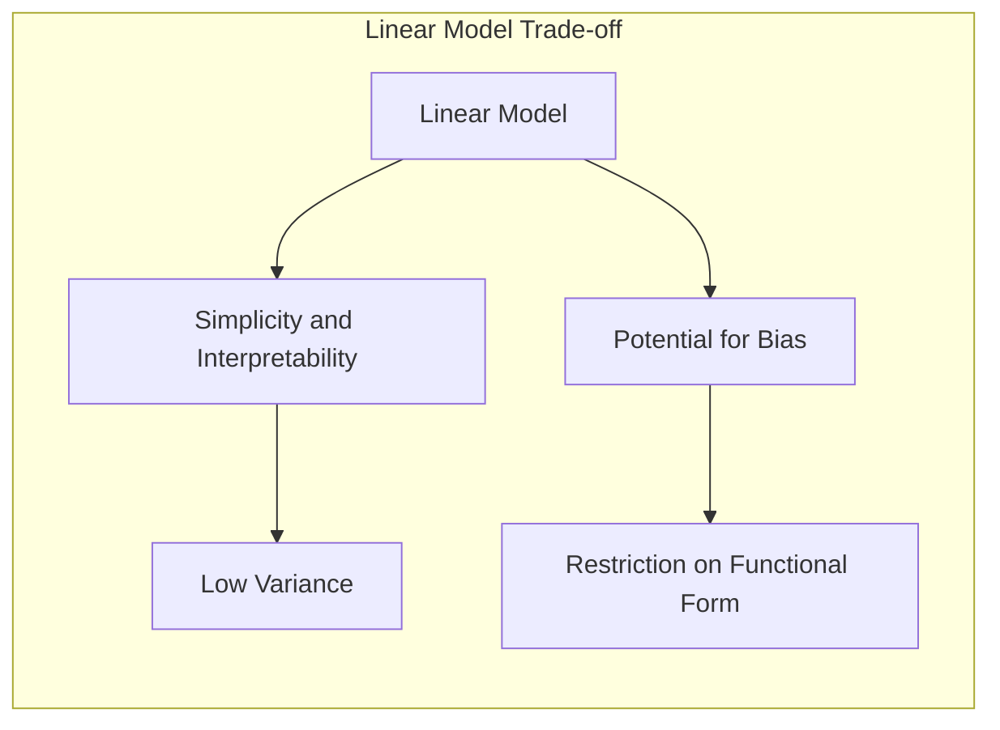
> 💡 **Exemplo Numérico:** Imagine um problema de classificação binária com duas features, $X_1$ e $X_2$, onde a classe 1 é representada por $y=1$ e a classe 0 por $y=0$. Um modelo linear pode ser expresso como $f(x) = \beta_0 + \beta_1 X_1 + \beta_2 X_2$. Se $\beta_0 = -1$, $\beta_1 = 2$, e $\beta_2 = 1$, então a observação $x = [1, 1]$ terá uma pontuação de $f(x) = -1 + 2(1) + 1(1) = 2$.  Usando um threshold de 0, a observação será classificada como classe 1, pois $f(x) > 0$. Já a observação $x = [0, 0]$ terá $f(x) = -1$, sendo classificada como classe 0. Este modelo simples ilustra o viés introduzido por uma decisão linear. Se a verdadeira relação fosse não linear, o modelo apresentaria baixa variância mas alto viés, ou seja, seria consistente mas impreciso.

**Lemma 1:** *Em um problema de classificação com duas classes, a função discriminante linear pode ser decomposta em uma função que projeta as observações em um vetor normal ao hiperplano de separação e um valor de limiar.*

**Prova do Lemma 1:** Considere uma função discriminante linear $f(x) = \beta_0 + \sum_{j=1}^p X_j \beta_j$. A fronteira de decisão é definida por $f(x) = 0$. Podemos expressar $f(x)$ como um produto escalar entre um vetor de parâmetros $\beta$ e um vetor de *features* aumentado $x$, isto é, $f(x) = \beta^T x$, onde $x=[1,X_1, \ldots, X_p]^T$ e $\beta = [\beta_0, \beta_1, \ldots, \beta_p]^T$. A direção do vetor $\beta$ é normal ao hiperplano $f(x) = 0$.  A decisão de classe é dada por:
$$
    \begin{cases}
      \text{classe 1} & \text{se } f(x) \geq 0 \\
      \text{classe 0} & \text{se } f(x) < 0
    \end{cases}
$$
Onde $f(x)$ pode ser reescrito como:

$f(x) = \beta^T x = ||\beta|| \cdot ||x|| \cdot \cos(\theta)$.

Onde $\theta$ é o ângulo entre o vetor $\beta$ e o vetor $x$. Assim, a decisão depende da projeção de $x$ em $\beta$  e de um valor de limiar $\beta_0$.
$\blacksquare$
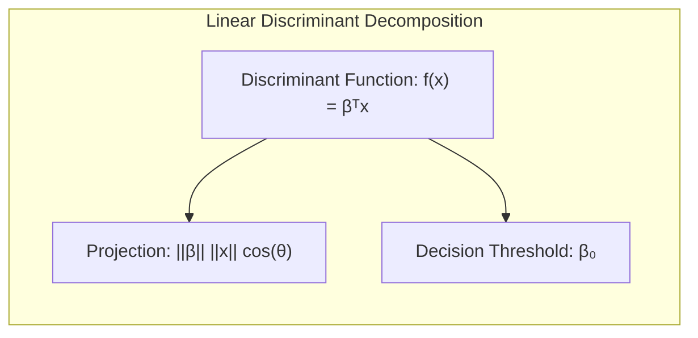
**Conceito 2: Linear Discriminant Analysis (LDA)**

A **Linear Discriminant Analysis (LDA)** é um método para classificação linear que busca encontrar a melhor projeção dos dados de alta dimensão em um subespaço de dimensão reduzida, maximizando a separação entre as classes e minimizando a variância dentro de cada classe [^4.3]. O LDA assume que os dados de cada classe são normalmente distribuídos com a mesma matriz de covariância. O LDA estima a média e a matriz de covariância para cada classe, e então encontra uma função discriminante linear que maximiza a separação entre as classes, baseada na razão entre a variância inter-classes e a variância intra-classes [^4.3.1]. A função discriminante do LDA é da forma:
$$ \delta_k(x) = x^T \Sigma^{-1} \mu_k - \frac{1}{2}\mu_k^T \Sigma^{-1}\mu_k + \log \pi_k $$
onde $\mu_k$ é o vetor de médias da classe k, $\Sigma$ é a matriz de covariância comum, e $\pi_k$ é a probabilidade *a priori* da classe k [^4.3.2].  A fronteira de decisão entre duas classes é linear e obtida através da igualdade das funções discriminantes:  $\delta_i(x) = \delta_j(x)$. No entanto, o LDA pode apresentar limitações quando as classes não são bem separadas ou quando as suposições de normalidade e covariâncias iguais não são válidas [^4.3.3].
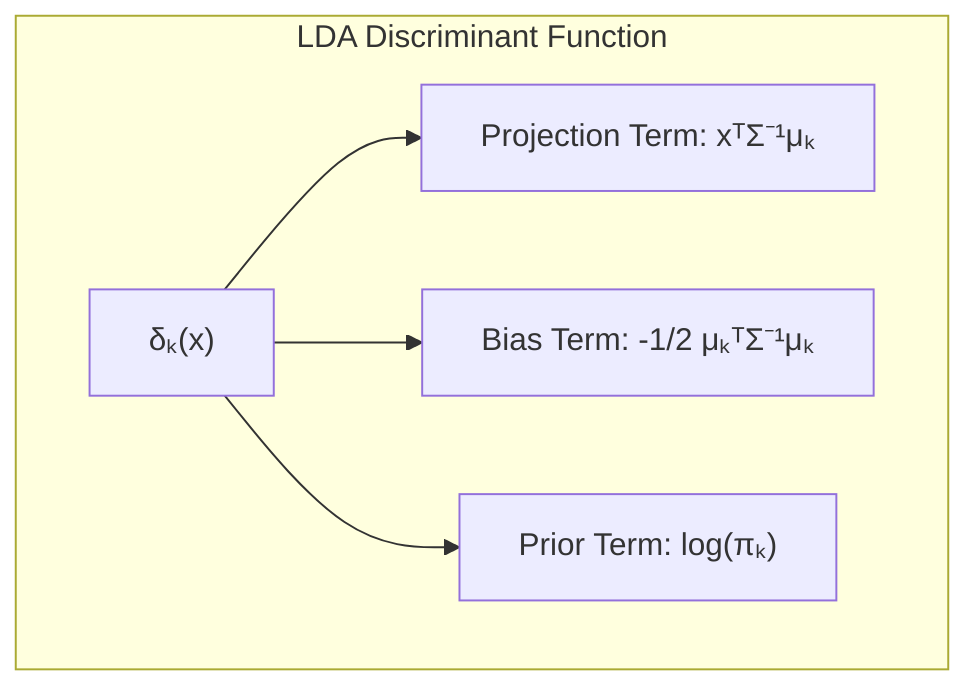
> 💡 **Exemplo Numérico:** Considere um problema de classificação com duas classes, com as seguintes médias e matriz de covariância comum: $\mu_1 = \begin{bmatrix} 1 \\ 1 \end{bmatrix}$, $\mu_2 = \begin{bmatrix} 3 \\ 3 \end{bmatrix}$, e $\Sigma = \begin{bmatrix} 1 & 0.5 \\ 0.5 & 1 \end{bmatrix}$. Assumindo que as probabilidades a priori são iguais, $\pi_1 = \pi_2 = 0.5$.  Para classificar um novo ponto $x = \begin{bmatrix} 2 \\ 2 \end{bmatrix}$, podemos calcular as funções discriminantes:
>
>  $\Sigma^{-1} = \frac{1}{0.75}\begin{bmatrix} 1 & -0.5 \\ -0.5 & 1 \end{bmatrix} = \begin{bmatrix} 1.33 & -0.67 \\ -0.67 & 1.33 \end{bmatrix}$
>
> $\delta_1(x) = \begin{bmatrix} 2 & 2 \end{bmatrix} \begin{bmatrix} 1.33 & -0.67 \\ -0.67 & 1.33 \end{bmatrix} \begin{bmatrix} 1 \\ 1 \end{bmatrix} - \frac{1}{2} \begin{bmatrix} 1 & 1 \end{bmatrix} \begin{bmatrix} 1.33 & -0.67 \\ -0.67 & 1.33 \end{bmatrix} \begin{bmatrix} 1 \\ 1 \end{bmatrix} + \log(0.5)  = 2.66 - 0.66 + (-0.693) \approx 1.307$
>
> $\delta_2(x) = \begin{bmatrix} 2 & 2 \end{bmatrix} \begin{bmatrix} 1.33 & -0.67 \\ -0.67 & 1.33 \end{bmatrix} \begin{bmatrix} 3 \\ 3 \end{bmatrix} - \frac{1}{2} \begin{bmatrix} 3 & 3 \end{bmatrix} \begin{bmatrix} 1.33 & -0.67 \\ -0.67 & 1.33 \end{bmatrix} \begin{bmatrix} 3 \\ 3 \end{bmatrix} + \log(0.5) = 8 - 6 + (-0.693) \approx 1.307$
>
> Como $\delta_1(x) = \delta_2(x)$, o ponto $x$ está na fronteira de decisão linear entre as duas classes. Se $\pi_1 \neq \pi_2$, o ponto de corte seria diferente, ilustrando o papel da probabilidade *a priori*.

**Corolário 1:** *A função discriminante linear do LDA pode ser expressa como uma projeção das observações em um vetor dado pela diferença entre as médias das classes, escalonada pela inversa da matriz de covariância, seguida por um ajuste do limiar de decisão.*

**Prova do Corolário 1:** A função discriminante linear do LDA para a classe $k$ é:
$$
    \delta_k(x) = x^T \Sigma^{-1} \mu_k - \frac{1}{2}\mu_k^T \Sigma^{-1}\mu_k + \log \pi_k
$$
Considere o caso de duas classes, $i$ e $j$. A fronteira de decisão é definida quando $\delta_i(x) = \delta_j(x)$:
$$
    x^T \Sigma^{-1} \mu_i - \frac{1}{2}\mu_i^T \Sigma^{-1}\mu_i + \log \pi_i = x^T \Sigma^{-1} \mu_j - \frac{1}{2}\mu_j^T \Sigma^{-1}\mu_j + \log \pi_j
$$
Reorganizando:
$$
   x^T \Sigma^{-1}(\mu_i - \mu_j) =  \frac{1}{2} (\mu_i^T \Sigma^{-1}\mu_i  - \mu_j^T \Sigma^{-1}\mu_j) + \log\frac{\pi_j}{\pi_i}
$$
O termo $\Sigma^{-1}(\mu_i - \mu_j)$ representa a direção da projeção, e o termo do lado direito da equação representa o limiar de decisão.  Assim, a função discriminante do LDA é equivalente a uma projeção das observações na direção da diferença das médias escalonada pela inversa da covariância, e a comparação dessa projeção com um limiar adequado.
$\blacksquare$
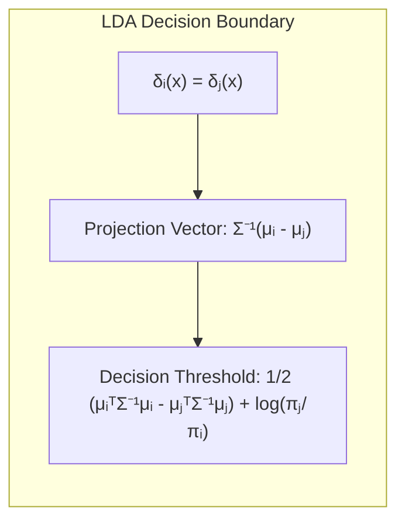
**Conceito 3: Logistic Regression**

A **Logistic Regression** é um modelo estatístico para classificação binária, que modela a probabilidade de um evento (classe) ocorrer através da função logística [^4.4].  Ao invés de modelar diretamente a classe, a regressão logística modela a probabilidade da classe através de uma função logística aplicada a uma combinação linear das *features*. A função logística (sigmóide) é dada por $\sigma(z) = \frac{1}{1 + e^{-z}}$. A probabilidade da classe 1, dado o vetor de *features* x, é dada por $p(y=1|x) = \sigma(\beta_0 + \sum_{j=1}^p x_j \beta_j)$.  O *logit* (log-odds) é dado por:
$$
   \text{logit}(p(y=1|x)) = \ln\left(\frac{p(y=1|x)}{1-p(y=1|x)}\right) = \beta_0 + \sum_{j=1}^p x_j \beta_j
$$
Os parâmetros são estimados através da maximização da verossimilhança, que consiste em encontrar os parâmetros que maximizam a probabilidade dos dados observados [^4.4.1]. O modelo da regressão logística, ao contrario do LDA, não impõe nenhuma suposição sobre a distribuição das *features*.  A regressão logística pode ser utilizada para classificar dados com mais de duas classes através de extensões como a regressão logística *multinomial* (softmax) e *one-vs-all*, onde a decisão entre duas classes é similar a LDA com fronteiras de decisão lineares [^4.4.5]. Apesar das similaridades entre o LDA e a regressão logística, a escolha entre os modelos depende das suposições sobre a distribuição dos dados, e da necessidade de estimativas de probabilidade.
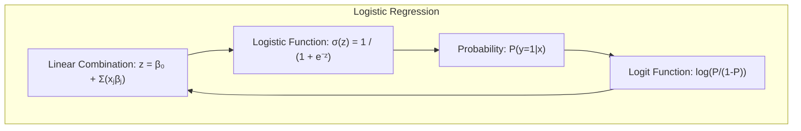
> 💡 **Exemplo Numérico:**  Suponha um modelo de regressão logística com uma única feature $X$, onde $\beta_0 = -3$ e $\beta_1 = 2$. Para uma observação com $x = 2$, a probabilidade de pertencer à classe 1 seria calculada como:
>
> $z = -3 + 2(2) = 1$
>
> $p(y=1|x) = \frac{1}{1 + e^{-1}} = \frac{1}{1 + 0.368} \approx 0.731$.
>
>  Isso significa que a probabilidade estimada de essa observação pertencer à classe 1 é de aproximadamente 73,1%. Se usarmos um threshold de 0.5, classificariamos essa observação como classe 1. Se $x = 1$, então $z = -3 + 2(1) = -1$, e $p(y=1|x) = \frac{1}{1 + e^{1}} = \frac{1}{1 + 2.718} \approx 0.269$. Portanto a observação seria classificada como classe 0.

> ⚠️ **Nota Importante**: O modelo de regressão logística estima diretamente a probabilidade da classe, enquanto o LDA estima uma função discriminante que pode ser usada para classificação [^4.4.1].

> ❗ **Ponto de Atenção**:  Em problemas de classificação com classes não-balanceadas, pode ser necessário ajustar os limiares de decisão na regressão logística para obter um melhor equilíbrio entre precisão e revocação [^4.4.2].

> ✔️ **Destaque**:  Sob certas condições, como quando as classes são normalmente distribuídas com a mesma covariância, o LDA e a regressão logística levam a decisões classificatórias similares, embora estimem os parâmetros de maneira diferente [^4.5].

### Regressão Linear e Mínimos Quadrados para Classificação
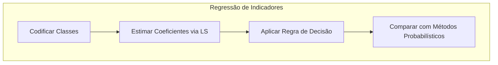
<imagem: Gráfico ilustrando as fronteiras de decisão resultantes da regressão de indicadores em um problema de classificação binária. As fronteiras são retas que dividem o espaço de *features*, mostrando a capacidade de separação linear da regressão de indicadores.>
A regressão linear, utilizando uma matriz de indicadores, pode ser aplicada a problemas de classificação. A ideia central é criar uma representação numérica para cada classe, codificando-as com vetores de indicadores. Em um problema de classificação binária, uma classe é codificada como 1 e outra como 0. Ao aplicar regressão linear a essa representação, busca-se encontrar uma função linear que mapeie as *features* para esses valores de classe [^4.2]. O método de mínimos quadrados é empregado para estimar os coeficientes de regressão que minimizam a soma dos quadrados dos resíduos. Após estimar os coeficientes, a regra de decisão transforma a saída contínua em uma classificação discreta, como atribuir à classe 1 se a saída predita for maior ou igual a 0.5 e classe 0 caso contrário. No entanto, essa abordagem possui algumas limitações. A regressão linear de indicadores não garante que as previsões ficarão entre 0 e 1, o que pode levar a resultados pouco intuitivos. Em situações com mais de duas classes, a regressão linear de indicadores pode apresentar problemas, como o *masking problem*, onde uma classe pode obscurecer outras na regressão, levando a um desempenho inadequado [^4.3]. A regressão logística é geralmente preferível pois ela estima as probabilidades da classe diretamente, o que é fundamental em problemas de classificação [^4.4]. Além disso, enquanto a regressão de indicadores foca em obter a melhor fronteira de decisão linear, a regressão logística estima as probabilidades da classe com base em um modelo probabilístico.

> 💡 **Exemplo Numérico:** Considere um conjunto de dados com duas classes (0 e 1) e duas features, onde as classes são representadas por um vetor indicador $y$. Aplicamos a regressão linear $y = X\beta$. Suponha que após o ajuste dos mínimos quadrados obtivemos os seguintes coeficientes: $\beta_0 = 0.2$, $\beta_1 = 0.5$ e $\beta_2 = 0.3$. Uma nova observação $x = [1, 2]$ teria uma previsão de $ŷ = 0.2 + 0.5(1) + 0.3(2) = 1.3$. Usando um limiar de 0.5, essa observação seria classificada como classe 1. No entanto, se $x = [-1, -1]$, então $ŷ = 0.2 - 0.5 - 0.3 = -0.6$.  Apesar de o resultado ser menor que 0, o que intuitivamente seria classe 0, valores negativos não fazem sentido como probabilidades.
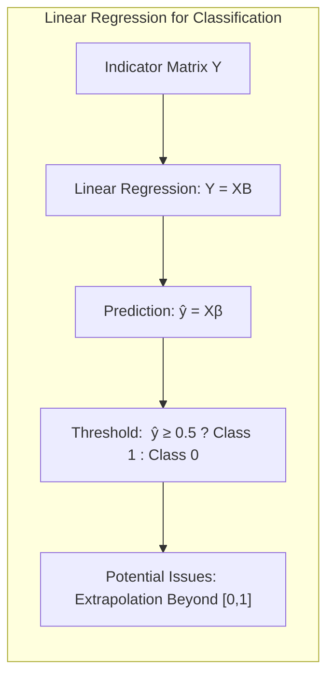
**Lemma 2:** *Sob certas condições, a projeção dos dados nas direções definidas pela regressão linear de indicadores é equivalente à projeção em um hiperplano de decisão gerado por um discriminante linear*.

**Prova do Lemma 2:** Considere um problema de classificação com *K* classes. Na regressão linear de indicadores, cada classe *k* é representada por um vetor $y_k$ em que $y_{k,i} = 1$ se a observação $i$ pertence à classe *k* e $y_{k,i}=0$ caso contrário.  A matriz de indicadores $Y$ tem dimensões *N* x *K*, onde *N* é o número de observações.  Ao realizar a regressão linear $Y = XB$, obtemos a matriz de coeficientes $B$, que representa a projeção dos dados originais nas classes. Sob a condição de que as variáveis preditoras são independentes e com variância igual, a regressão linear de indicadores resulta em projeções que maximizam a variância entre as classes, de maneira similar ao que ocorre no discriminante linear. A fronteira de decisão é definida pelos pontos nos quais a projeção em diferentes classes é igual, o que resulta em um hiperplano, assim como no caso do discriminante linear. Assim, a direção da projeção e o limiar de decisão da regressão linear de indicadores podem ser expressos como projeções em um hiperplano gerado por um discriminante linear sob essas condições.
$\blacksquare$
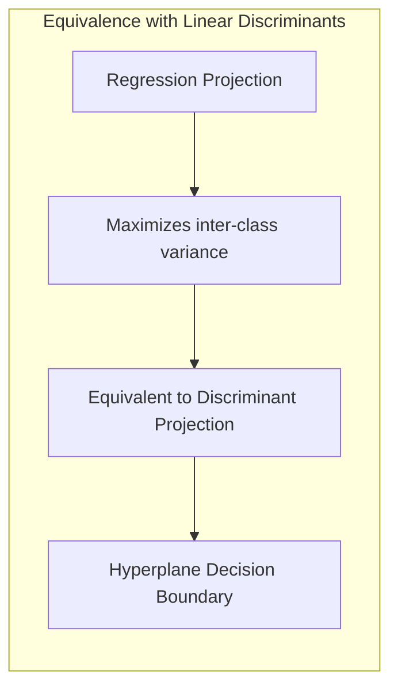
**Corolário 2:** *A equivalência entre a projeção nos hiperplanos de decisão da regressão linear e discriminantes lineares permite simplificar a análise em casos específicos, por exemplo, quando a separabilidade linear é desejada*.

**Prova do Corolário 2:** Como demonstrado no Lemma 2, sob certas condições, a regressão linear de indicadores e discriminantes lineares (como o LDA) levam a soluções equivalentes. Isso simplifica a análise em cenários onde a separabilidade linear é o objetivo primário. Em vez de derivar as equações para ambos os métodos separadamente, podemos utilizar a equivalência para derivar resultados e analisar a eficiência da classificação com base na projeção nos hiperplanos de decisão, o que simplifica o processo de modelagem e análise dos dados.
$\blacksquare$

Em alguns casos, a regressão logística fornece estimativas mais estáveis da probabilidade, enquanto a regressão de indicadores pode levar a extrapolações fora do intervalo [0,1] [^4.4]. Entretanto, a regressão de indicadores pode ser suficiente e até mesmo vantajosa quando a fronteira de decisão linear é o principal interesse [^4.2].

### Métodos de Seleção de Variáveis e Regularização em Classificação
<imagem: Um mapa mental que conecta métodos de seleção de variáveis e regularização, mostrando L1, L2, Elastic Net e suas aplicações em modelos de classificação como regressão logística, e sua relação com a interpretabilidade e desempenho do modelo.>
A seleção de variáveis e a regularização são técnicas cruciais para melhorar a generalização e a interpretabilidade dos modelos de classificação, especialmente quando o número de preditores é alto ou quando há multicolinearidade. A seleção de variáveis busca identificar o subconjunto mais relevante de preditores para o modelo, eliminando as variáveis redundantes ou irrelevantes. A regularização, por sua vez, impõe restrições aos coeficientes do modelo, penalizando os coeficientes que são muito grandes, reduzindo o risco de sobreajuste e tornando o modelo mais estável. A regressão logística, por exemplo, pode se beneficiar da regularização, como as penalizações L1 e L2 [^4.4.4].

A **penalização L1** impõe uma penalidade sobre a soma dos valores absolutos dos coeficientes, $\lambda \sum_{j=1}^p |\beta_j|$, onde $\lambda$ é um parâmetro de ajuste que controla a intensidade da penalização. Essa penalidade tem a propriedade de levar muitos coeficientes a zero, resultando em modelos esparsos e interpretáveis, pois apenas um subconjunto das *features* será utilizado no modelo [^4.5.1]. A **penalização L2** impõe uma penalidade sobre a soma dos quadrados dos coeficientes, $\lambda \sum_{j=1}^p \beta_j^2$.  Essa penalidade tende a reduzir a magnitude de todos os coeficientes, levando a modelos mais estáveis e generalizáveis, mas não leva a modelos esparsos como a L1. Uma combinação das penalidades L1 e L2 é utilizada na **Elastic Net** para tirar vantagem de ambos os tipos de regularização [^4.5.2]. Essa técnica penaliza o modelo com $\lambda_1 \sum_{j=1}^p |\beta_j| + \lambda_2 \sum_{j=1}^p \beta_j^2$ e combina a capacidade de selecionar variáveis do lasso com a estabilidade da ridge regression, promovendo modelos mais robustos.
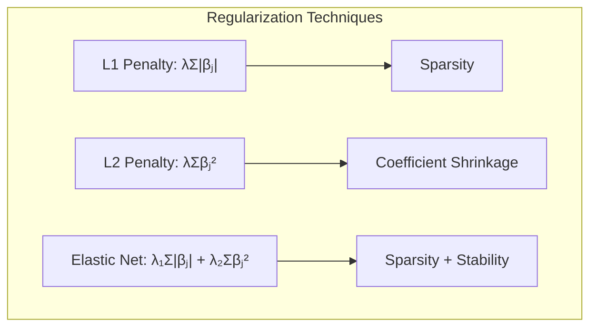
> 💡 **Exemplo Numérico:** Considere um modelo de regressão logística com 3 features, e coeficientes iniciais $\beta = [\beta_0, \beta_1, \beta_2, \beta_3] = [0.5, 2, -1.5, 0.8]$. Vamos aplicar as penalidades L1 e L2 com $\lambda=0.5$.
>
> **Penalidade L1:** $\lambda \sum_{j=1}^3 |\beta_j| = 0.5 * (|2| + |-1.5| + |0.8|) = 0.5 * (2 + 1.5 + 0.8) = 2.15$.
>
> **Penalidade L2:** $\lambda \sum_{j=1}^3 \beta_j^2 = 0.5 * (2^2 + (-1.5)^2 + 0.8^2) = 0.5 * (4 + 2.25 + 0.64) = 3.445$.
>
> A penalidade L1 tende a zerar alguns dos coeficientes, o que leva a um modelo mais esparso. A penalidade L2 encolhe todos os coeficientes, tornando o modelo mais estável. Uma penalidade Elastic Net combinaria as duas penalidades. Variando $\lambda$, podemos controlar o grau de regularização.

**Lemma 3:** *A penalização L1 na classificação logística leva a coeficientes esparsos devido à sua propriedade de concentrar a densidade de probabilidade nas regiões próximas dos eixos*.

**Prova do Lemma 3:** A regressão logística com regularização L1 tem como objetivo minimizar a função de custo:
$$
    L(\beta) = -\sum_{i=1}^N [y_i \log(p_i) + (1-y_i)\log(1-p_i)] + \lambda \sum_{j=1}^p |\beta_j|
$$
onde $p_i$ é a probabilidade da classe 1 para a observação *i*. A penalização L1, $\lambda \sum_{j=1}^p |\beta_j|$, corresponde a um prior de Laplace nos coeficientes $\beta$. A função de Laplace concentra sua densidade de probabilidade nas regiões próximas aos eixos, ou seja, onde alguns coeficientes $\beta_j$ são nulos.  Ao minimizar o custo total, a penalização L1 tende a levar os coeficientes menos relevantes para zero, resultando em um modelo esparso, onde apenas um subconjunto de *features* é utilizado. Portanto, a penalização L1 induz esparsidade nos modelos de classificação logística.
$\blacksquare$
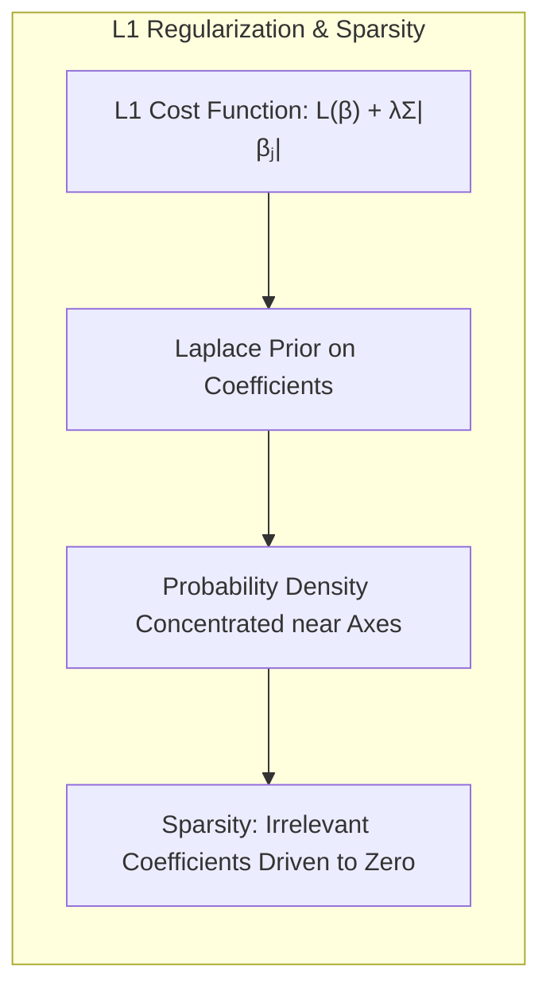
**Corolário 3:** *A esparsidade induzida pela penalização L1 melhora a interpretabilidade do modelo classificador, pois apenas os preditores mais relevantes são mantidos*.

**Prova do Corolário 3:** Conforme o Lemma 3, a penalização L1 leva a modelos esparsos, em que a maioria dos coeficientes $\beta_j$ são iguais a zero.  Isso significa que as *features* correspondentes aos coeficientes zero não contribuem para a predição.  Assim, o modelo final acaba por utilizar apenas um subconjunto dos preditores originais. Essa seleção automática das *features* mais relevantes facilita a interpretação do modelo, permitindo identificar quais as variáveis mais importantes para a tarefa de classificação, promovendo um modelo mais compreensível e fácil de analisar.
$\blacksquare$

> ⚠️ **Ponto Crucial**: A Elastic Net combina as vantagens das regularizações L1 e L2, oferecendo um equilíbrio entre esparsidade e estabilidade do modelo [^4.5].

### Separating Hyperplanes e Perceptrons
A ideia de maximizar a margem de separação entre as classes leva ao conceito de **hiperplanos separadores ótimos**. Em um problema de classificação linear, um hiperplano separador é uma superfície linear que divide o espaço de *features* em regiões correspondentes a diferentes classes [^4.5.2]. O objetivo é encontrar o hiperplano que maximiza a distância entre o hiperplano e as observações mais próximas de cada classe, chamadas de vetores de suporte. A formulação do problema de otimização para encontrar o hiperplano separador envolve a maximização da margem, que pode ser resolvida através da solução do seu problema dual de Wolfe, resultando em coeficientes obtidos a partir de combinações lineares dos pontos de suporte.
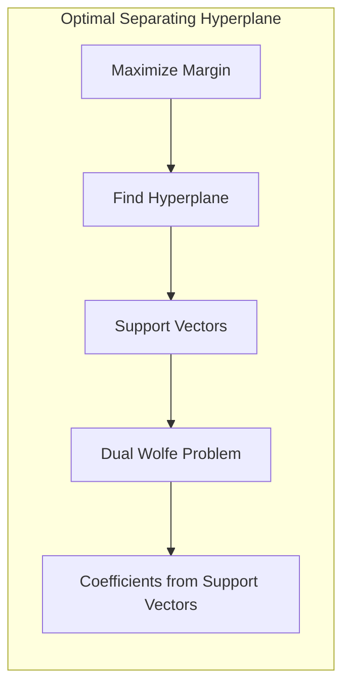
O **Perceptron** é um algoritmo de aprendizado supervisionado que busca encontrar um hiperplano separador para dados linearmente separáveis [^4.5.1]. O algoritmo do Perceptron de Rosenblatt atualiza iterativamente os pesos da função discriminante até encontrar um hiperplano que classifique corretamente os dados. A convergência do Perceptron é garantida sob a condição de que os dados sejam linearmente separáveis. O algoritmo do Perceptron pode não convergir ou convergir para uma solução subótima se os dados não são linearmente separáveis. No entanto, o Perceptron tem valor histórico e ainda é utilizado como base para métodos mais avançados de classificação linear.
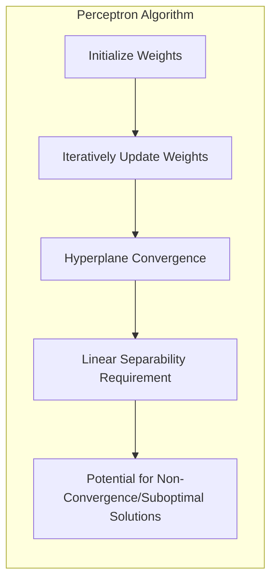
> 💡 **Exemplo Numérico:** Vamos ilustrar o Perceptron com um exemplo simples. Suponha que temos os seguintes dados linearmente separáveis: Classe 1: $[(1, 1), (2, 2)]$, e Classe 0: $[(1, -1), (2, -1)]$. Inicializamos os pesos com $\beta = [0, 0, 0]$. Para cada ponto $x_i$, atualizamos os pesos se a classificação estiver errada. Iteração 1: $x_1 = [1, 1]$. Se $f(x) = 0$, a classificação seria errada. Como é classe 1, atualizamos os pesos: $\beta = [1, 1, 1]$. Iteração 2: $x_2 = [2, 2]$.  $f(x) = 1 * 1 + 2 * 1 + 2 * 1 = 5 > 0$, classificação correta. Iteração 3: $x_3 = [1, -1]$. $f(x) = 1 * 1 + 1 * 1 -1 *1 = 1 > 0$, classificação errada. Como é classe 0, $\beta = [1 - 1, 1 - 1, 1 -(-1)] = [0, 0, 2]$. Iteração 4: $x_4 = [2, -1]$.  $f(x) = 0 * 1 + 0 * 2 + 2 * (-1) = -2 < 0$, classificação correta. Repetindo esse processo, o Perceptron eventualmente encontra pesos que separam as classes.

### Pergunta Teórica Avançada: Quais as diferenças fundamentais entre a formulação de LDA e a Regra de Decisão Bayesiana considerando distribuições Gaussianas com covariâncias iguais?

**Resposta:**
Sob a suposição de que os dados de cada classe são gerados por uma distribuição Gaussiana com a mesma matriz de covariância, a Linear Discriminant Analysis (LDA) e a Regra de Decisão Bayesiana levam a soluções equivalentes [^4.3].

*   **Regra de Decisão Bayesiana:** A regra de decisão Bayesiana atribui uma observação $x$ à classe $k$ que maximiza a probabilidade posterior $P(C_k|x)$, que pode ser expressa usando a regra de Bayes:
    $$
    P(C_k|x) = \frac{P(x|C_k)P(C_k)}{P(x)}
    $$
    Onde $P(x|C_k)$ é a verossimilhança de $x$ dado a classe $C_k$, $P(C_k)$ é a probabilidade a priori da classe $C_k$, e $P(x)$ é a probabilidade marginal de $x$.  Sob a suposição de que $P(x|C_k)$ são gaussianas com média $\mu_k$ e covari