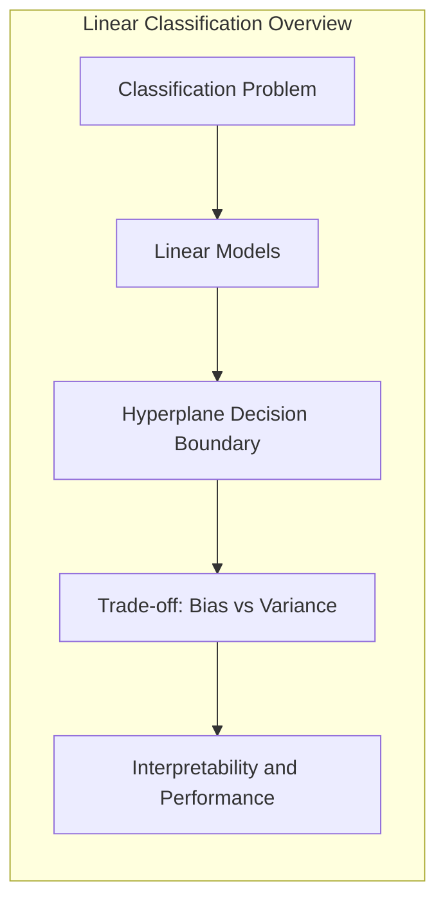
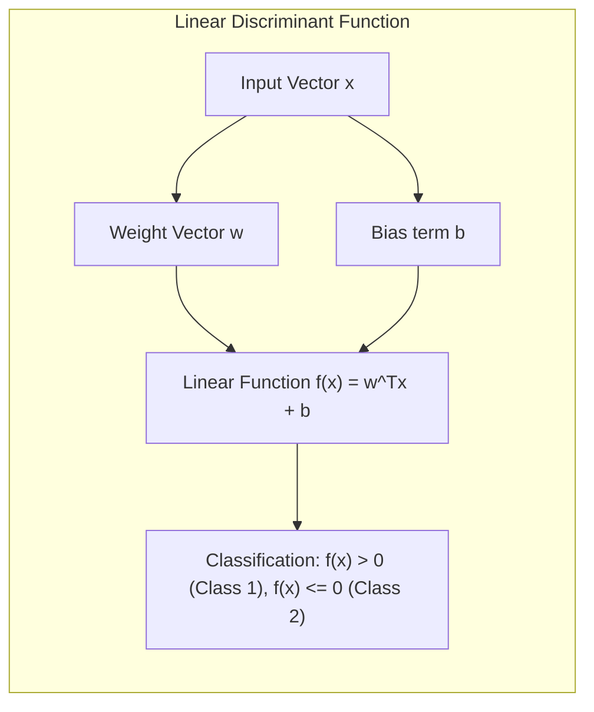
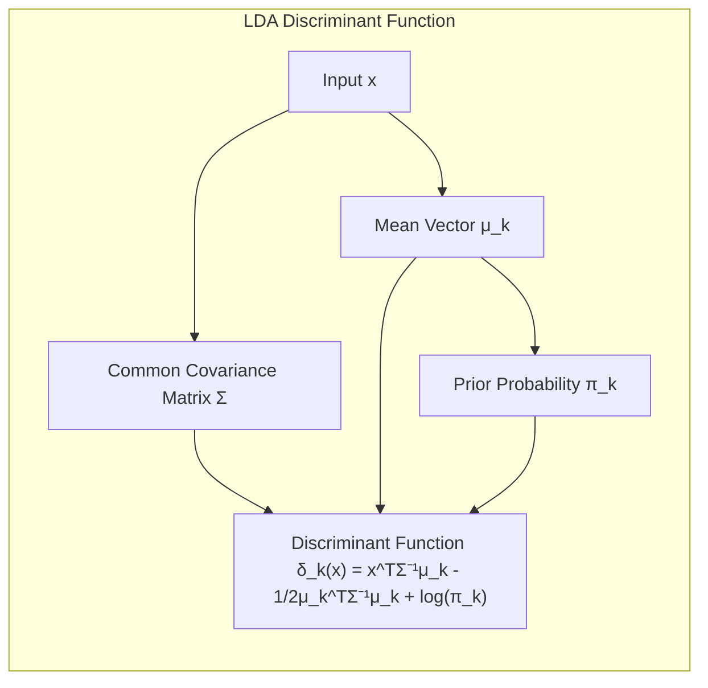
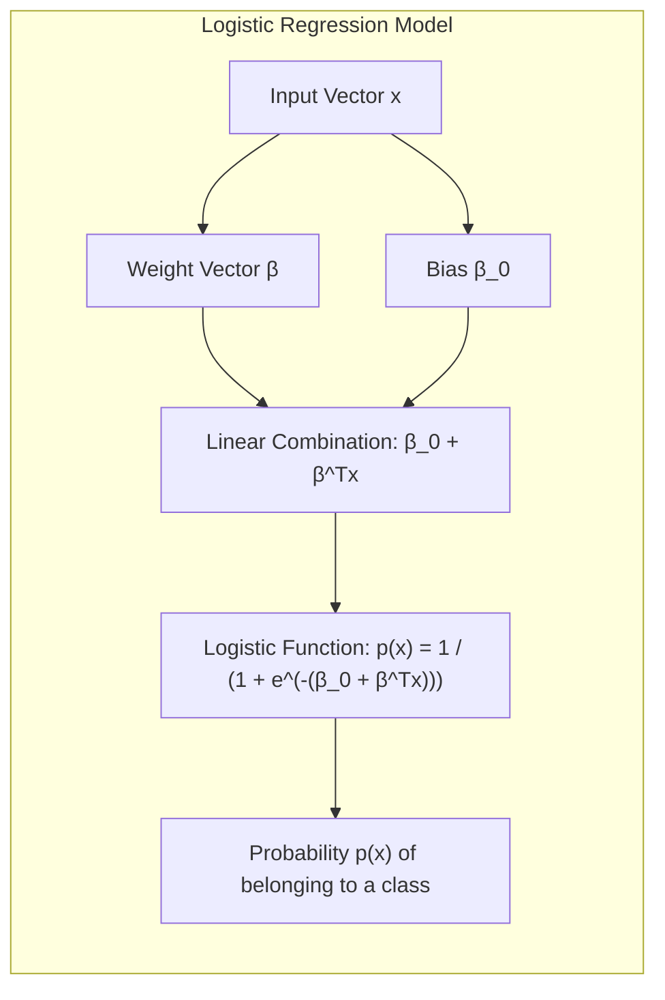
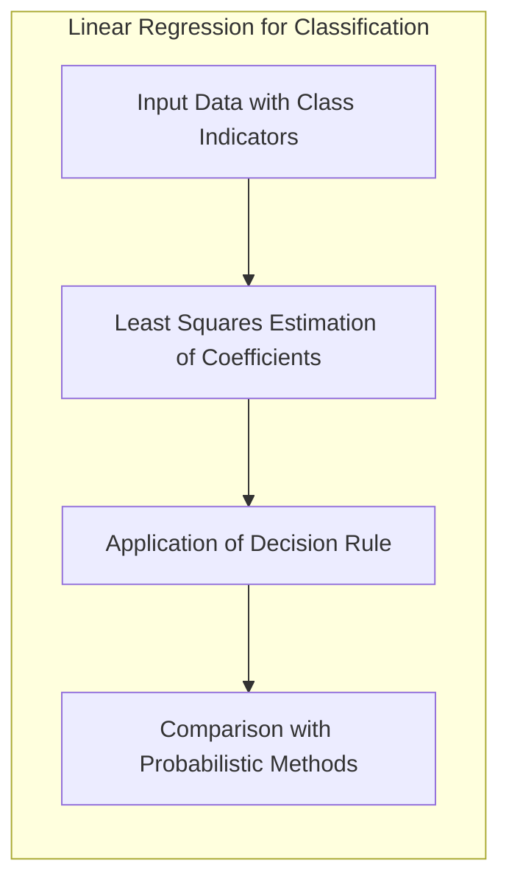
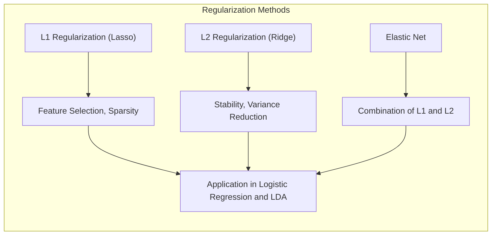
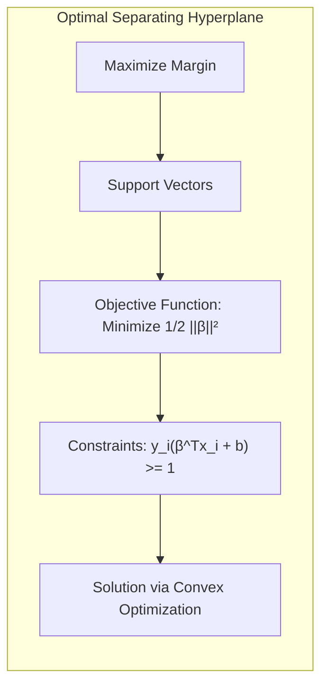
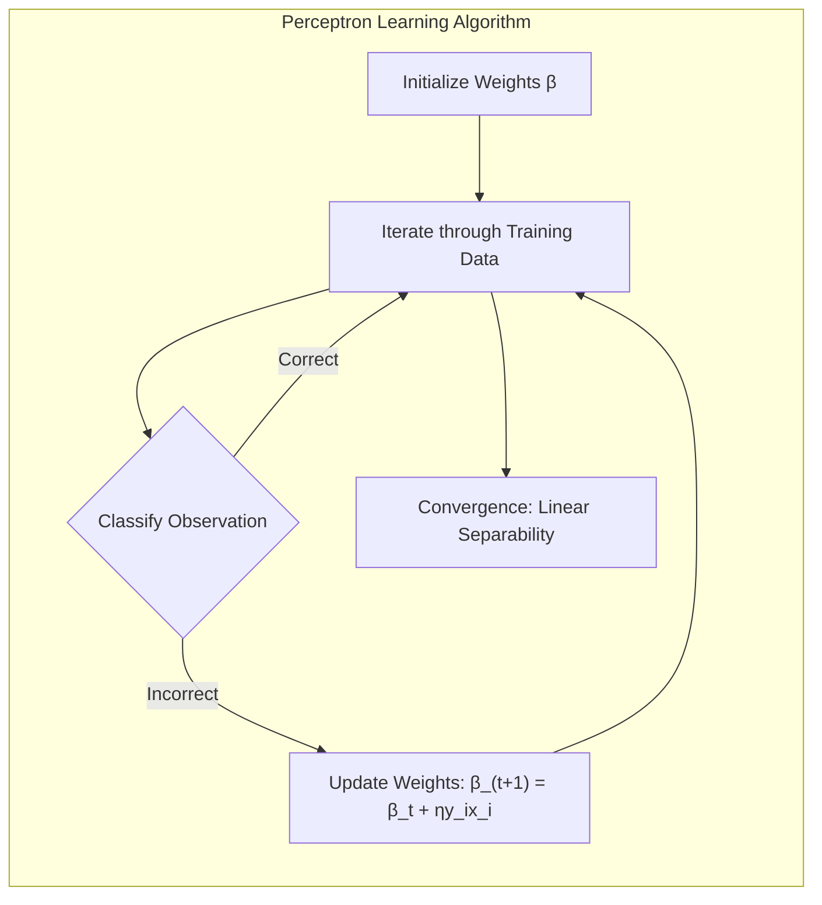
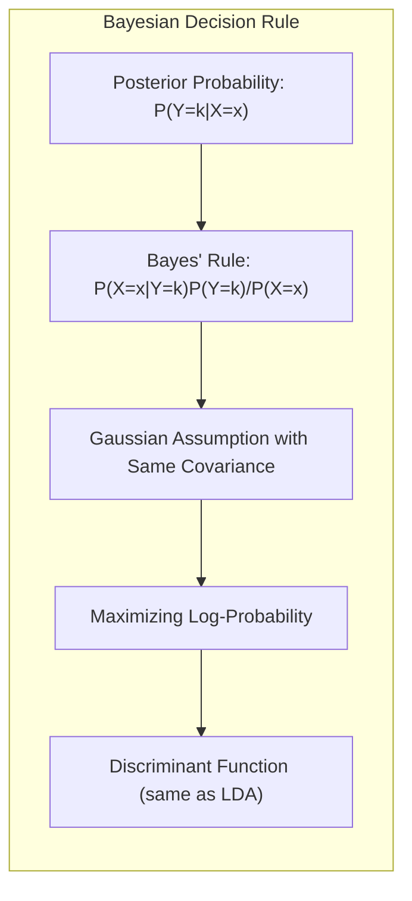
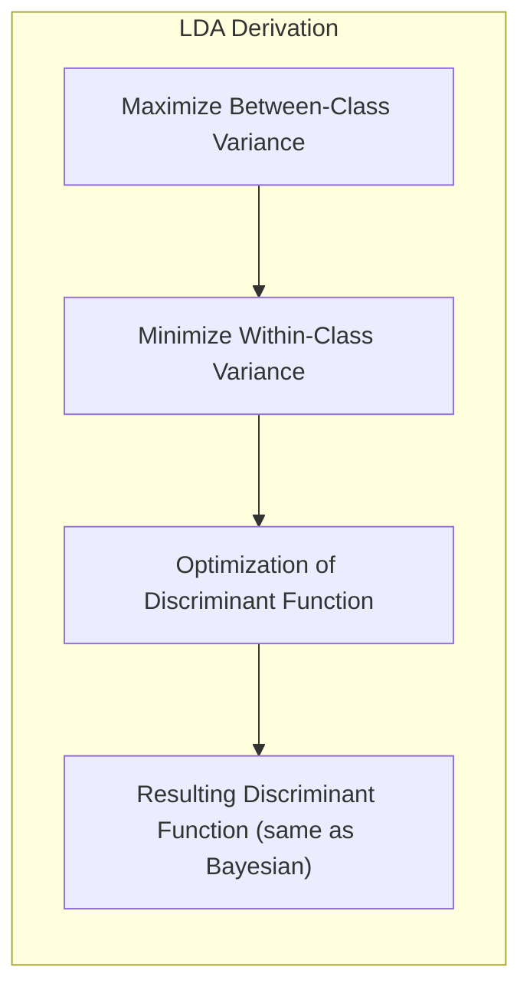

## Métodos Lineares para Classificação



### Introdução

Este capítulo aborda métodos lineares para classificação, explorando a sua relevância no contexto da análise discriminante. Os modelos lineares, apesar de sua simplicidade, oferecem uma base sólida para a compreensão de técnicas mais complexas [^4.1]. Eles permitem uma análise interpretável das relações entre os preditores e a variável de resposta, e, em muitos casos, podem apresentar um desempenho comparável ou até superior a modelos não lineares, especialmente quando se tem um número limitado de dados, baixa relação sinal-ruído ou dados esparsos [^4.1]. O estudo detalhado desses métodos lineares é fundamental para o desenvolvimento de uma intuição sólida em aprendizado de máquina e para a compreensão de diversas generalizações não lineares [^4.1].

### Conceitos Fundamentais

**Conceito 1:** O problema de classificação consiste em atribuir uma classe a cada observação com base em um conjunto de preditores. Em métodos lineares, assume-se que a fronteira de decisão entre classes pode ser definida por um hiperplano. A escolha por métodos lineares implica em um *trade-off* entre viés e variância [^4.1]. Modelos lineares tendem a ter um viés maior, pois impõem uma estrutura mais restrita, mas podem apresentar menor variância, o que é desejável em muitas situações. Por exemplo, se a relação entre as variáveis de entrada e a variável de saída for aproximadamente linear, um modelo linear pode ser suficiente e, em muitos casos, preferível a um modelo não linear complexo [^4.1].

> 💡 **Exemplo Numérico:** Considere um conjunto de dados com duas classes, onde a classe 1 tem um centro em (2, 2) e a classe 2 tem um centro em (5, 5), ambas com uma pequena variância. Um modelo linear pode separar essas classes com um hiperplano. Um modelo não linear poderia se ajustar perfeitamente aos dados de treinamento, mas generalizaria pior para dados novos. Este é um exemplo do trade-off entre viés e variância: um modelo linear pode ter um viés maior (não se ajusta perfeitamente aos dados de treinamento), mas tem uma variância menor (generaliza melhor para novos dados).

**Lemma 1:** Em problemas de classificação com duas classes, uma função discriminante linear pode ser definida como uma projeção dos dados em um vetor normal ao hiperplano de decisão. Esta projeção maximiza a separabilidade entre as classes, desde que as classes sejam razoavelmente bem separadas por um hiperplano.

> $$f(x) = w^Tx + b$$

Onde:

-   $f(x)$ é a função discriminante linear.
-   $w$ é o vetor de pesos, normal ao hiperplano.
-   $x$ é o vetor de preditores.
-   $b$ é o *bias* ou *intercept*.

A função discriminante pode ser usada para decidir a qual classe pertence uma observação. Por exemplo, se $f(x) > 0$, a observação é classificada como pertencente à primeira classe e, caso contrário, à segunda classe [^4.3].



> 💡 **Exemplo Numérico:** Suponha que temos um modelo linear com $w = [1, -1]$ e $b = -1$. Um ponto $x_1 = [2, 1]$ terá $f(x_1) = (1*2) + (-1*1) - 1 = 0$. Este ponto estaria exatamente na fronteira de decisão. Já um ponto $x_2 = [3, 1]$ terá $f(x_2) = (1*3) + (-1*1) - 1 = 1 > 0$, sendo classificado como pertencente à primeira classe. Por outro lado, o ponto $x_3 = [2, 3]$ terá $f(x_3) = (1*2) + (-1*3) - 1 = -2 < 0$, e seria classificado na segunda classe.

**Conceito 2:** A **Linear Discriminant Analysis (LDA)** é um método clássico para classificação que assume que as classes seguem uma distribuição normal multivariada com a mesma matriz de covariância [^4.3]. O método busca encontrar a melhor combinação linear de preditores que maximize a separação entre as médias das classes, e minimiza a variância dentro de cada classe [^4.3.1]. Formalmente, a regra de decisão do LDA é dada por:

> $$\delta_k(x) = x^T \Sigma^{-1}\mu_k - \frac{1}{2}\mu_k^T \Sigma^{-1}\mu_k + \log(\pi_k)$$

Onde:

-   $\delta_k(x)$ é a função discriminante para a classe $k$.
-   $x$ é o vetor de preditores.
-   $\Sigma$ é a matriz de covariância comum das classes.
-   $\mu_k$ é o vetor de médias da classe $k$.
-   $\pi_k$ é a probabilidade *a priori* da classe $k$.

Para classificar uma observação $x$, calculamos $\delta_k(x)$ para todas as classes $k$ e atribuímos $x$ à classe com o maior valor de $\delta_k(x)$ [^4.3.2].



> 💡 **Exemplo Numérico:** Vamos supor um caso simplificado com duas classes e dois preditores. Classe 1 tem $\mu_1 = [1, 1]$ e Classe 2 tem $\mu_2 = [3, 3]$. A matriz de covariância comum é $\Sigma = [[1, 0], [0, 1]]$ (uma matriz identidade para simplificação). As probabilidades a priori são $\pi_1 = 0.6$ e $\pi_2 = 0.4$. Para classificar um novo ponto $x = [2, 2]$:

> $\Sigma^{-1} = [[1, 0], [0, 1]]$
> $\delta_1(x) = [2, 2]^T [[1, 0], [0, 1]] [1, 1] - \frac{1}{2}[1, 1]^T [[1, 0], [0, 1]] [1, 1] + \log(0.6) = 4 - 1 + \log(0.6) \approx 2.51$
> $\delta_2(x) = [2, 2]^T [[1, 0], [0, 1]] [3, 3] - \frac{1}{2}[3, 3]^T [[1, 0], [0, 1]] [3, 3] + \log(0.4) = 12 - 9 + \log(0.4) \approx 2.08$
>
> Como $\delta_1(x) > \delta_2(x)$, o ponto $x$ seria classificado como pertencente à Classe 1.

**Corolário 1:** Quando as classes compartilham a mesma matriz de covariância, a fronteira de decisão entre duas classes no LDA é um hiperplano linear, o que simplifica a análise e a implementação do modelo. A linearidade da fronteira surge devido à estrutura compartilhada da matriz de covariância, permitindo que a decisão seja baseada na diferença entre as médias das classes. A demonstração detalhada disso está em [^4.3.3].

**Conceito 3:** A **Logistic Regression** é um modelo de classificação que estima a probabilidade de uma observação pertencer a uma classe por meio de uma transformação logística da combinação linear dos preditores [^4.4]. A função logística, ou logit, transforma qualquer valor real em um valor entre 0 e 1, que pode ser interpretado como uma probabilidade [^4.4.1]. O modelo logístico é definido como:

> $$p(x) = \frac{1}{1 + e^{-(\beta_0 + \beta^T x)}}$$

Onde:

-   $p(x)$ é a probabilidade de $x$ pertencer a uma classe.
-   $\beta_0$ é o *bias*.
-   $\beta$ é o vetor de pesos.
-   $x$ é o vetor de preditores.

A função de verossimilhança para a regressão logística é dada por:

> $$L(\beta) = \prod_{i=1}^N p(x_i)^{y_i}(1-p(x_i))^{1-y_i}$$

Onde $y_i$ é a classe observada, que pode ser 0 ou 1. Os parâmetros são estimados maximizando a função de verossimilhança ou sua versão logarítmica. O processo de otimização normalmente envolve métodos iterativos como o gradiente descendente ou o método de Newton-Raphson [^4.4.3].



> 💡 **Exemplo Numérico:** Suponha que um modelo de regressão logística foi treinado, resultando em $\beta_0 = -2$ e $\beta = [1, 0.5]$. Dado um ponto $x = [3, 2]$, a probabilidade de pertencer à classe 1 seria:

> $p(x) = \frac{1}{1 + e^{-(-2 + (1*3) + (0.5*2))}} = \frac{1}{1 + e^{-( -2 + 3 + 1)}} = \frac{1}{1 + e^{-2}} \approx \frac{1}{1 + 0.135} \approx 0.88$

> Isso significa que o modelo prevê uma probabilidade de 88% do ponto x pertencer à classe 1.

> ⚠️ **Nota Importante**: A regressão logística não assume a mesma distribuição normal dos dados como o LDA, o que a torna mais robusta em relação a desvios dessa premissa [^4.4.1].

> ❗ **Ponto de Atenção**: Em problemas de classificação com classes desbalanceadas, é importante ajustar os pesos das classes na regressão logística para evitar um modelo enviesado em direção à classe majoritária [^4.4.2].

> ✔️ **Destaque**: Em muitos casos, a regressão logística e o LDA fornecem resultados muito parecidos, especialmente quando a matriz de covariância é similar entre as classes, embora a interpretação dos coeficientes possa ser diferente [^4.5].

### Regressão Linear e Mínimos Quadrados para Classificação



A regressão linear pode ser aplicada para classificação utilizando uma matriz de indicadores, onde cada coluna corresponde a uma classe e as entradas são 1 para a classe a qual a observação pertence e 0 caso contrário. O problema de classificação é então transformado em um problema de regressão, onde cada classe é tratada como uma variável dependente [^4.2]. Os parâmetros são estimados por meio do método de mínimos quadrados, minimizando a soma dos quadrados dos resíduos [^4.2]:

> $$RSS(\beta) = \sum_{i=1}^N (y_i - x_i^T\beta)^2$$

onde:

-   $RSS(\beta)$ é a soma dos quadrados dos resíduos.
-   $y_i$ é o vetor indicador da classe da observação $i$.
-   $x_i$ é o vetor de preditores da observação $i$.
-   $\beta$ é a matriz de coeficientes a ser estimada.

As predições são então obtidas usando a regressão linear para cada classe. A classe de uma dada observação é determinada pela maior predição entre as classes. A principal limitação desse método é que as predições da regressão linear não são limitadas entre 0 e 1, o que dificulta a interpretação como probabilidades [^4.2]. Além disso, quando a classe é representada por um indicador "dummy" (1 e 0), pode haver problemas na interpretação dos parâmetros, pois as classes podem ser consideradas ordenadas (o que não é o caso, por exemplo, quando as classes são "vermelho", "verde" e "azul").

> 💡 **Exemplo Numérico:** Considere um conjunto de dados com 3 observações e 2 classes. Os dados e as classes são:
> - $x_1 = [1, 2]$, $y_1 = [1, 0]$ (Classe 1)
> - $x_2 = [2, 1]$, $y_2 = [0, 1]$ (Classe 2)
> - $x_3 = [3, 3]$, $y_3 = [1, 0]$ (Classe 1)
>  Podemos criar matrizes $X$ e $Y$:
> $$ X = \begin{bmatrix} 1 & 1 & 2 \\ 1 & 2 & 1 \\ 1 & 3 & 3 \end{bmatrix}, \quad Y = \begin{bmatrix} 1 & 0 \\ 0 & 1 \\ 1 & 0 \end{bmatrix} $$
>  Aqui, a primeira coluna de X são os interceptos. Os coeficientes $\beta$ são estimados minimizando o RSS. Usando numpy para os cálculos:
> ```python
> import numpy as np
> from sklearn.linear_model import LinearRegression
>
> X = np.array([[1, 1, 2], [1, 2, 1], [1, 3, 3]])
> Y = np.array([[1, 0], [0, 1], [1, 0]])
>
> model = LinearRegression()
> model.fit(X, Y)
> beta = model.coef_
> intercept = model.intercept_
> print("Coefficients (beta):\n", beta)
> print("Intercept:", intercept)
> ```
> Isso resultará em coeficientes $\beta$ que, quando multiplicados por um novo vetor de preditores, dariam uma predição para cada classe.  Por exemplo, para um novo ponto $x_4 = [2, 2]$ (incluindo o intercepto), as predições seriam:
>
> $y_{pred} = \begin{bmatrix} 1 & 2 & 2 \end{bmatrix} \begin{bmatrix} 0.833 & -0.167 \\ -0.167 & 0.5 \\  -0.167 & -0.167 \end{bmatrix} + intercept  \approx \begin{bmatrix} 0.5 & 0.5 \end{bmatrix} + \begin{bmatrix} 0.167 & 0.333 \end{bmatrix} = \begin{bmatrix} 0.667 & 0.833 \end{bmatrix}$
>
> Como a segunda predição é maior (0.833 > 0.667), o modelo classificaria o ponto como pertencente à classe 2.

**Lemma 2:** Em um problema de classificação com duas classes, se a fronteira de decisão resultante da regressão linear com matriz de indicadores for um hiperplano, ela é equivalente à fronteira de decisão obtida por um discriminante linear em certas condições de distribuição dos dados (por exemplo, dados gaussianos com mesma covariância entre as classes) [^4.2], [^4.3].

**Prova:** A prova envolve mostrar que a solução de mínimos quadrados para o modelo de regressão de indicadores pode ser escrita em termos das médias das classes e da matriz de covariância, que são também os componentes fundamentais da função discriminante linear do LDA.

**Corolário 2:** O Lemma 2 implica que, em algumas condições específicas, a regressão linear e o LDA (Linear Discriminant Analysis) produzem resultados similares em termos da fronteira de decisão, embora suas interpretações e pressupostos possam ser diferentes. A regressão de indicadores pode ser uma forma de obter uma aproximação da fronteira de decisão em cenários menos ideais [^4.3].

É importante notar que, em situações com muitas classes ou quando as classes não são linearmente separáveis, a regressão linear de matriz de indicadores pode apresentar limitações significativas. Em alguns cenários, a regressão logística pode fornecer estimativas mais estáveis de probabilidade, enquanto a regressão de indicadores pode levar a extrapolações fora do intervalo [0,1]. No entanto, há situações em que a regressão de indicadores pode ser suficiente e até mesmo vantajosa quando o objetivo principal é a fronteira de decisão linear.

### Métodos de Seleção de Variáveis e Regularização em Classificação



A seleção de variáveis é crucial em problemas de classificação com muitos preditores, visando identificar um subconjunto de variáveis relevantes que contribuam significativamente para a capacidade preditiva do modelo e para a interpretação dos resultados [^4.5]. A regularização, em contrapartida, é uma técnica que adiciona uma penalidade à função de custo para controlar a complexidade do modelo e evitar *overfitting*.

Em particular, em modelos logísticos, a regularização pode ser implementada adicionando termos de penalização à função de verossimilhança. A regularização L1 (Lasso) adiciona uma penalidade proporcional à soma dos valores absolutos dos coeficientes, enquanto a regularização L2 (Ridge) adiciona uma penalidade proporcional à soma dos quadrados dos coeficientes [^4.4.4]. A penalização L1 tem a propriedade de levar alguns coeficientes a serem exatamente zero, realizando uma seleção de variáveis implícita e produzindo modelos mais esparsos [^4.4.4]:

> $$ J(\beta) = - \sum_{i=1}^N (y_i \log(p(x_i)) + (1-y_i) \log(1-p(x_i))) + \lambda \sum_{j=1}^p |\beta_j|$$

Enquanto a regularização L2 tende a reduzir os valores dos coeficientes, mas raramente os leva a zero, o que resulta em modelos mais estáveis e com menor variância [^4.4.4].

> $$J(\beta) = - \sum_{i=1}^N (y_i \log(p(x_i)) + (1-y_i) \log(1-p(x_i))) + \lambda \sum_{j=1}^p \beta_j^2$$

A escolha entre regularização L1 e L2 depende do problema específico e dos objetivos do modelo. Em geral, L1 é preferível quando há muitas variáveis irrelevantes e busca-se *sparsity*, enquanto L2 é mais adequada quando se deseja estabilidade e redução da variância.

> 💡 **Exemplo Numérico:** Considere um modelo de regressão logística com dois preditores, onde os coeficientes estimados sem regularização são $\beta = [5, -3]$. Com regularização L1, usando $\lambda = 1$, o custo para um modelo com $\beta = [4, -2]$  seria $-LogLikelihood + 1*(|4|+|-2|) = -LogLikelihood + 6 $.  Com um modelo com $\beta = [2, 0]$ o custo seria  $-LogLikelihood + 1*(|2|+|0|) = -LogLikelihood + 2 $. Note que a regularização L1 pode levar alguns coeficientes a serem exatamente zero, como o segundo coeficiente neste exemplo. Com regularização L2, usando $\lambda = 1$, o custo para um modelo com $\beta = [4, -2]$  seria $-LogLikelihood + 1*(4^2+(-2)^2) = -LogLikelihood + 20 $.  Com um modelo com $\beta = [2, 1]$ o custo seria $-LogLikelihood + 1*(2^2+1^2) = -LogLikelihood + 5 $. A regularização L2 reduz os valores dos coeficientes, mas normalmente não os leva a zero.

**Lemma 3:** Em um modelo de regressão logística regularizado com L1, a penalidade L1 na função de custo pode levar a coeficientes esparsos, pois ela incentiva alguns coeficientes a serem exatamente zero [^4.4.4].

**Prova do Lemma 3:** A prova envolve analisar as condições de otimalidade da função de custo com penalidade L1. A derivada da penalidade L1 é uma função sinal, o que implica que, para que a derivada total da função de custo seja zero, alguns coeficientes devem ser iguais a zero, o que leva a um modelo esparso. Essa demonstração é feita através do estudo das condições de Karush-Kuhn-Tucker (KKT) [^4.4.3]. $\blacksquare$

**Corolário 3:** A *sparsity* induzida pela regularização L1 leva a modelos mais interpretáveis, pois apenas as variáveis relevantes permanecem no modelo [^4.4.5]. Isso facilita a identificação dos preditores mais importantes e a compreensão das relações entre as variáveis de entrada e a variável de resposta.

A regularização L1 e L2 podem ser combinadas usando o método Elastic Net, que adiciona ambas as penalidades, resultando em modelos que combinam as vantagens de ambas as abordagens [^4.5]:

> $$J(\beta) = - \sum_{i=1}^N (y_i \log(p(x_i)) + (1-y_i) \log(1-p(x_i))) + \lambda (\alpha \sum_{j=1}^p |\beta_j| + (1-\alpha) \sum_{j=1}^p \beta_j^2)$$

> ⚠️ **Ponto Crucial**: L1 e L2 podem ser combinadas (Elastic Net) para aproveitar vantagens de ambos os tipos de regularização [^4.5]. O parâmetro α controla a proporção de L1 e L2 na penalidade.

### Separating Hyperplanes e Perceptrons



A ideia de maximizar a margem de separação entre as classes leva ao conceito de **hiperplanos ótimos**. Em vez de apenas encontrar um hiperplano que separa as classes, o objetivo é encontrar o hiperplano que maximiza a distância entre as classes mais próximas, também conhecidos como **pontos de suporte** [^4.5.2]. Formalmente, o problema pode ser formulado como:

> $$\min_{\beta, b} \frac{1}{2} ||\beta||^2$$

> sujeito a:
> $$y_i(\beta^Tx_i + b) \geq 1 \ \forall i$$

Onde:

-   $\beta$ é o vetor normal ao hiperplano.
-   $b$ é o *bias*.
-   $x_i$ são os preditores da observação $i$.
-   $y_i$ é a classe da observação $i$, que assume valores de +1 e -1.

Este problema pode ser resolvido utilizando técnicas de otimização convexa, como o método do dual de Wolfe [^4.5.2]. O resultado é que o hiperplano de decisão é expresso como uma combinação linear dos pontos de suporte.



O **Perceptron** de Rosenblatt é um algoritmo de aprendizado de máquina simples que busca encontrar um hiperplano separador através de um processo iterativo. Inicialmente, os pesos são atribuídos aleatoriamente. Em cada iteração, o algoritmo verifica se as observações estão corretamente classificadas; se houver classificação incorreta, os pesos são atualizados de acordo com a regra:

> $$\beta_{t+1} = \beta_t + \eta y_i x_i$$

Onde:

-   $\beta_t$ são os pesos na iteração $t$.
-   $\eta$ é a taxa de aprendizagem.
-   $y_i$ é a classe da observação $i$.
-   $x_i$ são os preditores da observação $i$.

O perceptron garante convergência para um hiperplano separador se os dados forem linearmente separáveis e a taxa de aprendizagem for suficientemente pequena [^4.5.1]. Em caso de dados não linearmente separáveis, o perceptron pode não convergir.

> 💡 **Exemplo Numérico:** Considere um problema com dois preditores e duas classes, com $x_1 = [1, 1]$, $y_1 = 1$ e $x_2 = [2, 3]$, $y_2 = -1$.  Inicializando $\beta = [0.1, -0.1]$ e $b=0$.
> Iteração 1:
> - $y_1(\beta^Tx_1+b) = 1*(0.1*1 -0.1*1 + 0) = 0 < 1$.  Classificação incorreta.  Atualiza $\beta = [0.1, -0.1] + 0.1 * 1 * [1, 1] = [0.2, 0]$.
> - $y_2(\beta^Tx_2+b) = -1*(0.2*2 +0*3 +0) = -0.4 < 1 $.  Classificação incorreta.  Atualiza $\beta = [0.2, 0] + 0.1 * -1 * [2, 3] = [0, -0.3]$
>
> Iteração 2:
> - $y_1(\beta^Tx_1+b) = 1*(0*1 -0.3*1 + 0) = -0.3 < 1$. Classificação incorreta. Atualiza $\beta = [0, -0.3] + 0.1 * 1 * [1, 1] = [0.1, -0.2]$.
>  - $y_2(\beta^Tx_2+b) = -1*(0.1*2 -0.2*3 +0) = -1*(-0.4) = 0.4 < 1 $. Classificação incorreta. Atualiza $\beta = [0.1, -0.2] + 0.1 * -1 * [2, 3] = [-0.1, -0.5]$.
>
> O perceptron continua atualizando os pesos até que os pontos estejam corretamente classificados, ou atinja um número máximo de iterações.  Em situações com dados linearmente separáveis, o Perceptron convergirá para um hiperplano que separa as classes.

### Pergunta Teórica Avançada (Exemplo): Quais as diferenças fundamentais entre a formulação de LDA e a Regra de Decisão Bayesiana considerando distribuições Gaussianas com covariâncias iguais?

**Resposta:**

O **LDA (Linear Discriminant Analysis)** e a Regra de Decisão Bayesiana são ambos métodos de classificação que, quando aplicados a distribuições Gaussianas com covariâncias iguais, levam a fronteiras de decisão lineares, mas são derivados de abordagens distintas.



A **Regra de Decisão Bayesiana** busca a classe que maximiza a probabilidade *a posteriori* $P(Y=k|X=x)$, isto é, a probabilidade da classe $k$ dado um vetor de preditores $x$. Pela regra de Bayes, essa probabilidade é dada por:

> $$P(Y=k|X=x) = \frac{P(X=x|Y=k)P(Y=k)}{P(X=x)}$$

Quando as classes são Gaussianas com médias $\mu_k$ e a mesma matriz de covariância $\Sigma$, a probabilidade condicional $P(X=x|Y=k)$ é dada por:

> $$P(X=x|Y=k) = \frac{1}{(2\pi)^{p/2}|\Sigma|^{1/2}} \exp(-\frac{1}{2}(x-\mu_k)^T\Sigma^{-1}(x-\mu_k))$$

Onde $p$ é o número de preditores. A regra de decisão Bayesiana atribui uma observação $x$ à classe $k$ que maximiza $P(Y=k|X=x)$ ou, equivalentemente, que maximiza $P(X=x|Y=k)P(Y=k)$ (já que $P(X=x)$ é comum a todas as classes). Ao tomarmos o logaritmo da probabilidade e omitindo termos constantes, a regra de decisão Bayesiana se reduz a atribuir a observação $x$ à classe que maximiza:

> $$\delta_k(x) = -\frac{1}{2}(x-\mu_k)^T\Sigma^{-1}(x-\mu_k) + \log(\pi_k)$$

onde $\pi_k = P(Y=k)$ é a probabilidade a priori da classe $k$. Expandindo o termo quadrático e omitindo termos que são comuns a todas as classes, obtemos:

> $$\delta_k(x) = x^T\Sigma^{-1}\mu_k - \frac{1}{2}\mu_k^T\Sigma^{-1}\mu_k + \log(\pi_k)$$

Que é exatamente a função discriminante do LDA [^4.3].



O **LDA**, por sua vez, é derivado da análise discriminante, com o objetivo de encontrar as combinações lineares das variáveis que melhor discriminam as classes. O LDA maximiza a razão entre a variância entre classes e a variância dentro das classes, resultando em uma função discriminante linear semelhante à regra de decisão Bayesiana, como mostrado acima [^4.3].

**Lemma 4:** Sob a premissa de que as classes seguem uma distribuição Gaussiana multivariada com a mesma matriz de covariância, a regra de decisão Bayesiana e o LDA levam exatamente à mesma função discriminante linear, e, portanto, à mesma decisão de classificação [^4.3], [^4.3.3].

**Corolário 4:** A relaxação da premissa de igualdade das matrizes de covariância entre as classes leva ao **Quadratic Discriminant Analysis (QDA)**, onde a fronteira de decisão é uma função quadrática e não mais linear [^4.3]. Isso ocorre porque os termos quadráticos das médias das classes ($\mu_k^T\Sigma_k^{-1}\mu_k$) não se cancelam quando as covariâncias são distintas, resultando em uma função discriminante com termos quadráticos [^4.3].

> ⚠️ **Ponto Crucial**: A escolha de covariâncias iguais ou diferentes impacta fortemente o tipo de fronteira de decisão (linear vs. quadrática), alterando a complexidade e a flexibilidade do modelo. A escolha deve ser guiada pelos dados e pelo balanço desejado entre viés e variância.

As perguntas devem ser altamente relevantes, **avaliar a compreensão profunda de conceitos teóricos-chave**, podem envolver derivações matemáticas e provas, e focar em análises teóricas.

### Conclusão

Este capítulo explorou os fundamentos e as nuances dos métodos lineares para classificação. Iniciamos com a apresentação dos conceitos básicos de classificação e suas implicações em viés e variância. Em seguida, detalhamos o funcionamento e as formulações matemáticas do LDA e da regressão logística, ressaltando suas premissas e seus pontos fortes e fracos. A regressão linear com matriz de indicadores foi abordada como uma alternativa para classificação, destacando suas limitações. A importância da seleção de variáveis e da regularização foi discutida, com ênfase em como essas técnicas afetam a complexidade do modelo e sua capacidade preditiva. Além disso, foram introduzidos os conceitos de hiperplanos separadores e o algoritmo do perceptron, bem como as diferenças teóricas entre LDA e a Regra de Decisão Bayesiana. O capítulo também abordou problemas de classificação multivariada, explorando como métodos como a análise de correlação canônica podem ajudar a reduzir a dimensionalidade. As seções teóricas avançadas visaram consolidar a compreensão teórica e aprofundar a capacidade analítica do leitor.

<!-- END DOCUMENT -->

### Footnotes

[^4.1]: "A linear regression model assumes that the regression function E(Y|X) is linear in the inputs X1,..., Xp. Linear models were largely developed in the precomputer age of statistics, but even in today's computer era there are still good reasons to study and use them. They are simple and often provide an adequate and interpretable description of how the inputs affect the output. For prediction purposes they can sometimes outperform fancier nonlinear models, especially in situations