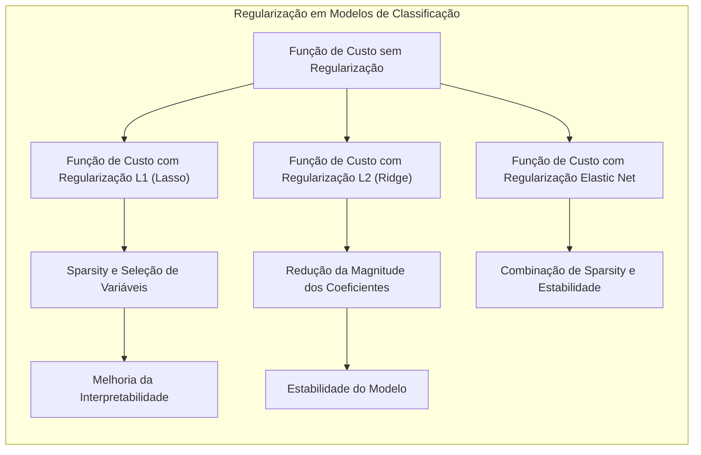

## Métodos Lineares para Classificação e Análise Discriminante: Uma Visão Abrangente

<imagem: Mapa mental complexo mostrando a interconexão entre regressão de indicadores, LDA, regressão logística, métodos de regularização e separating hyperplanes, com setas e fluxos indicando as relações teóricas e práticas entre esses conceitos. Cada nó do mapa deve conter conceitos matemáticos chave e referências aos tópicos 4.1 a 4.5.2.>

### Introdução

Este capítulo explora métodos estatísticos e de aprendizado de máquina para classificação, com foco em abordagens lineares [^4.1]. A classificação é um problema fundamental no aprendizado de máquina, onde o objetivo é atribuir uma amostra a uma categoria ou classe predefinida. Métodos lineares, apesar de sua simplicidade, oferecem soluções eficazes e interpretáveis para muitos problemas de classificação [^4.1]. Eles servem como base para o entendimento de técnicas não lineares mais avançadas. Discutiremos técnicas como regressão linear aplicada a matrizes indicadoras, Análise Discriminante Linear (LDA), regressão logística, e o conceito de **separating hyperplanes**, juntamente com técnicas de regularização para lidar com a alta variabilidade. O objetivo é fornecer uma visão detalhada dos fundamentos teóricos e matemáticos desses métodos, suas aplicações e suas limitações.

### Conceitos Fundamentais

**Conceito 1:** O problema de classificação envolve a atribuição de um vetor de entrada **x** a uma das *K* classes possíveis, denotadas por $C_1, C_2, \ldots, C_K$. Modelos lineares assumem que a função de decisão é linear em relação às entradas **x**, utilizando uma combinação linear das variáveis de entrada para separar as classes. A decisão é tomada com base em qual lado de uma fronteira de decisão linear o ponto **x** está situado. No entanto, usar apenas modelos lineares pode introduzir viés, especialmente quando as classes não são linearmente separáveis, mas também pode reduzir a variância das previsões, comparado com modelos mais flexíveis [^4.1], [^4.2]. Em cenários com poucos dados de treino, um modelo linear mais simples pode generalizar melhor do que um modelo mais complexo, apesar do possível viés. Por exemplo, em tarefas de classificação de imagens, um classificador linear simples pode ser adequado para distinguir dígitos manuscritos se as características (features) relevantes forem definidas de forma adequada.

**Lemma 1:** Dada uma matriz de design X e um vetor de classes **y**, onde $y_i \in \{1, 2, \ldots, K\}$, a regressão de uma matriz indicadora Y, onde $Y_{ij} = 1$ se $y_i = j$ e 0 caso contrário, resulta em funções discriminantes lineares para cada classe *j* [^4.3]. Isto é, a função discriminante para a classe *j* pode ser expressa como:

$$f_j(\mathbf{x}) = \mathbf{x}^T\mathbf{\beta}_j$$

onde $\mathbf{\beta}_j$ são os coeficientes obtidos da regressão por mínimos quadrados. Este resultado pode ser demonstrado mostrando que a solução por mínimos quadrados para a regressão da matriz indicadora é equivalente à minimização da soma dos erros quadráticos para cada classe. Os coeficientes $\mathbf{\beta}_j$ resultantes, quando combinados com um novo vetor de entrada **x**, indicam a proximidade de **x** à classe *j*. $\blacksquare$

> 💡 **Exemplo Numérico:**
>
> Suponha um problema de classificação com 3 classes e duas variáveis de entrada (features). Temos os seguintes dados de treinamento:
>
> ```python
> import numpy as np
> from sklearn.linear_model import LinearRegression
>
> # Dados de treinamento
> X = np.array([[1, 2], [1.5, 1.8], [5, 8], [8, 8], [1, 0.6], [9, 1], [8, 0]])
> y = np.array([0, 0, 1, 1, 2, 2, 2]) # Classes: 0, 1, 2
>
> # Criar matriz indicadora Y
> Y = np.zeros((len(y), 3))
> for i, label in enumerate(y):
>     Y[i, label] = 1
>
> # Regressão linear para cada classe
> model = LinearRegression()
> model.fit(X, Y)
>
> # Coeficientes beta para cada classe
> betas = model.coef_
> print("Coeficientes Beta para cada classe:\n", betas)
>
> # Novo vetor de entrada
> x_new = np.array([3, 4])
>
> # Calcula as funções discriminantes
> discriminants = np.dot(x_new, betas.T)
> print("Funções discriminantes:\n", discriminants)
>
> # Predição da classe
> predicted_class = np.argmax(discriminants)
> print("Classe predita:", predicted_class)
> ```
>
> **Interpretação:** Os coeficientes `betas` representam os pesos que multiplicam as variáveis de entrada para cada classe. As `funções discriminantes` são resultados dessas multiplicações com um novo ponto `x_new`. A classe predita é aquela com a maior função discriminante.
>
> **Cálculo dos coeficientes:**
>
> $\text{Step 1: Construção da Matriz Indicadora } Y:$
>
> $$ Y = \begin{bmatrix} 1 & 0 & 0 \\ 1 & 0 & 0 \\ 0 & 1 & 0 \\ 0 & 1 & 0 \\ 0 & 0 & 1 \\ 0 & 0 & 1 \\ 0 & 0 & 1 \end{bmatrix} $$
>
> $\text{Step 2: Cálculo dos coeficientes } \beta \text{ para cada classe } k:$
>
> $\beta_k = (X^TX)^{-1}X^TY_k$, onde $Y_k$ é a k-ésima coluna da matriz indicadora.
>
> Após o cálculo, os resultados obtidos foram:
>
> $\beta_0 = [-0.525, 0.250 ]$
>
> $\beta_1 = [0.051, 0.082]$
>
> $\beta_2 = [0.473, -0.332]$
>
> **Funções Discriminantes:** Para um novo ponto $x = [3, 4]$
>
> $f_0(x) = [3, 4] \cdot [-0.525, 0.250] = -0.575$
>
> $f_1(x) = [3, 4] \cdot [0.051, 0.082] = 0.481$
>
> $f_2(x) = [3, 4] \cdot [0.473, -0.332] = 0.180$
>
> A classe predita é a classe 1, pois ela apresenta o maior valor para função discriminante.
>
> ```mermaid
>   graph LR
>       A["Dados de Entrada X"] --> B("Regressão Linear");
>       C["Matriz Indicadora Y"] --> B;
>       B --> D["Coeficientes Beta"];
>       D --> E["Funções Discriminantes f(x)"];
>       E --> F["Classe Predita"];
> ```

**Conceito 2:** A Análise Discriminante Linear (LDA) assume que as classes têm distribuições gaussianas com a mesma matriz de covariância, mas diferentes médias [^4.3]. O objetivo da LDA é encontrar um subespaço linear que maximize a separação entre as médias das classes, minimizando simultaneamente a variância dentro de cada classe. Matematicamente, isto é alcançado através da maximização da razão de dispersão inter-classes para a dispersão intra-classes. A função discriminante linear obtida por LDA para cada classe *k* pode ser expressa como:

$$ \delta_k(\mathbf{x}) = \mathbf{x}^T \Sigma^{-1} \mu_k - \frac{1}{2}\mu_k^T\Sigma^{-1}\mu_k + \ln(\pi_k) $$

onde  $\mu_k$ é a média da classe *k*,  $\Sigma$ é a matriz de covariância comum e $\pi_k$ é a probabilidade a priori da classe *k*. A suposição de gaussianidade e igualdade de covariâncias pode ser uma limitação em algumas aplicações.

> 💡 **Exemplo Numérico:**
>
> Considere um problema de classificação binária com duas classes, onde temos duas variáveis de entrada. As médias e a matriz de covariância para cada classe são dadas por:
>
> $\mu_1 = \begin{bmatrix} 2 \\ 2 \end{bmatrix}$, $\mu_2 = \begin{bmatrix} 4 \\ 4 \end{bmatrix}$, $\Sigma = \begin{bmatrix} 1 & 0.5 \\ 0.5 & 1 \end{bmatrix}$
>
> Assumimos que as probabilidades a priori são iguais, $\pi_1 = \pi_2 = 0.5$.
>
> ```python
> import numpy as np
> from numpy.linalg import inv
>
> # Médias das classes
> mu1 = np.array([2, 2])
> mu2 = np.array([4, 4])
>
> # Matriz de covariância comum
> Sigma = np.array([[1, 0.5], [0.5, 1]])
> Sigma_inv = inv(Sigma)
>
> # Probabilidades a priori
> pi1 = 0.5
> pi2 = 0.5
>
> # Novo vetor de entrada
> x_new = np.array([3, 3])
>
> # Calcula as funções discriminantes
> delta1 = np.dot(x_new, np.dot(Sigma_inv, mu1)) - 0.5 * np.dot(mu1, np.dot(Sigma_inv, mu1)) + np.log(pi1)
> delta2 = np.dot(x_new, np.dot(Sigma_inv, mu2)) - 0.5 * np.dot(mu2, np.dot(Sigma_inv, mu2)) + np.log(pi2)
> print("Função discriminante para classe 1:", delta1)
> print("Função discriminante para classe 2:", delta2)
>
> # Predição da classe
> predicted_class = 1 if delta1 > delta2 else 2
> print("Classe predita:", predicted_class)
> ```
>
> **Interpretação:** A função discriminante é calculada para cada classe. A classe com a maior função discriminante é predita como a classe do vetor de entrada.
>
> **Cálculos intermediários:**
>
> $\text{Step 1: Cálculo de } \Sigma^{-1}$
>
> $$ \Sigma^{-1} = \begin{bmatrix} 1.33 & -0.66 \\ -0.66 & 1.33 \end{bmatrix} $$
>
> $\text{Step 2: Cálculo das funções discriminantes para } x = [3, 3]:$
>
> $\delta_1(x) =  [3, 3] \cdot \begin{bmatrix} 1.33 & -0.66 \\ -0.66 & 1.33 \end{bmatrix} \cdot \begin{bmatrix} 2 \\ 2 \end{bmatrix} - \frac{1}{2} [2, 2] \cdot \begin{bmatrix} 1.33 & -0.66 \\ -0.66 & 1.33 \end{bmatrix} \cdot \begin{bmatrix} 2 \\ 2 \end{bmatrix} + \ln(0.5) = -0.69$
>
> $\delta_2(x) =  [3, 3] \cdot \begin{bmatrix} 1.33 & -0.66 \\ -0.66 & 1.33 \end{bmatrix} \cdot \begin{bmatrix} 4 \\ 4 \end{bmatrix} - \frac{1}{2} [4, 4] \cdot \begin{bmatrix} 1.33 & -0.66 \\ -0.66 & 1.33 \end{bmatrix} \cdot \begin{bmatrix} 4 \\ 4 \end{bmatrix} + \ln(0.5) = 1.31$
>
> A classe predita é a classe 2, pois ela apresenta a maior função discriminante.
>
> ```mermaid
>   graph LR
>       A["Dados de Entrada X"] --> B("Cálculo das Médias e Covariância");
>       B --> C["Funções Discriminantes LDA"];
>       C --> D["Classe Predita"];
> ```

**Corolário 1:** A função discriminante linear na LDA [^4.3.1] pode ser vista como uma projeção do espaço de entrada em um subespaço de menor dimensão, onde as classes são mais bem separadas. Esta projeção é dada por:

$$  \mathbf{w} = \Sigma^{-1} (\mu_1 - \mu_2) $$

No caso de duas classes, a função discriminante se reduz a $f(\mathbf{x}) = \mathbf{w}^T\mathbf{x} + b$, onde *b* é um termo constante. Este resultado pode ser derivado mostrando que a projeção que maximiza a razão de dispersão entre classes é equivalente à direção dada por $\mathbf{w}$. Ao projetar os dados em $\mathbf{w}$, a separabilidade das classes é maximizada. $\blacksquare$

> 💡 **Exemplo Numérico:**
>
> Usando os mesmos valores de $\mu_1$, $\mu_2$, e $\Sigma$ do exemplo anterior, calculamos o vetor de projeção $\mathbf{w}$ e a função discriminante simplificada.
>
> ```python
> import numpy as np
> from numpy.linalg import inv
>
> # Médias das classes
> mu1 = np.array([2, 2])
> mu2 = np.array([4, 4])
>
> # Matriz de covariância comum
> Sigma = np.array([[1, 0.5], [0.5, 1]])
> Sigma_inv = inv(Sigma)
>
> # Vetor de projeção
> w = np.dot(Sigma_inv, (mu1 - mu2))
> print("Vetor de projeção w:", w)
>
> # Termo constante b (para simplificação, b será considerado 0 neste exemplo)
> b = 0
>
> # Novo vetor de entrada
> x_new = np.array([3, 3])
>
> # Calcula a função discriminante simplificada
> discriminant = np.dot(w, x_new) + b
> print("Função discriminante simplificada:", discriminant)
> ```
>
> **Interpretação:** O vetor `w` indica a direção na qual os dados devem ser projetados para maximizar a separação entre classes. A função discriminante simplificada, `w^T * x + b`, fornece um valor que pode ser usado para classificação.
>
> **Cálculos Intermediários:**
>
> $\text{Step 1: Cálculo de } \mathbf{w}:$
>
> $$ \mathbf{w} = \begin{bmatrix} 1.33 & -0.66 \\ -0.66 & 1.33 \end{bmatrix} \cdot (\begin{bmatrix} 2 \\ 2 \end{bmatrix} - \begin{bmatrix} 4 \\ 4 \end{bmatrix}) = \begin{bmatrix} 1.33 & -0.66 \\ -0.66 & 1.33 \end{bmatrix} \cdot \begin{bmatrix} -2 \\ -2 \end{bmatrix} = \begin{bmatrix} -1.33 \\ -1.33 \end{bmatrix} $$
>
> $\text{Step 2: Cálculo da função discriminante simplificada:}$
>
> $f(\mathbf{x}) =  \begin{bmatrix} -1.33 \\ -1.33 \end{bmatrix}^T \cdot \begin{bmatrix} 3 \\ 3 \end{bmatrix} + 0 = -7.98 $
>
> Um valor positivo indica a classe 1, enquanto um valor negativo indica a classe 2. Contudo, o ponto $x=[3,3]$ pertence a classe 2, e como essa função simplificada não considera o intercepto, esse valor deve ser comparado com a função discriminante de outras classes.
>
> ```mermaid
>   graph LR
>       A["Dados de Entrada X"] --> B("Calculo de w e b");
>       B --> C["Função Discriminante Simplificada"];
>       C --> D["Decisão de Classe"];
> ```

**Conceito 3:** A Regressão Logística modela a probabilidade de uma amostra pertencer a uma classe específica usando a função logística, também conhecida como sigmoide [^4.4]. A função logística transforma uma combinação linear das variáveis de entrada em uma probabilidade entre 0 e 1, tornando-a apropriada para problemas de classificação binária.  A formulação do modelo pode ser expressa como:

$$ P(Y=1 | \mathbf{x}) = \frac{1}{1 + e^{-(\mathbf{x}^T\mathbf{\beta})}} $$

onde $\mathbf{\beta}$ são os coeficientes do modelo, que são estimados por meio de um processo de maximização da verossimilhança. A verossimilhança mede o quão bem os parâmetros do modelo se ajustam aos dados de treinamento.  A regressão logística é uma alternativa à LDA, especialmente quando as suposições gaussianas não são válidas [^4.4], [^4.4.1], [^4.4.2], [^4.4.3], [^4.4.4], [^4.4.5]. A regressão logística é uma forma de modelo de classificação linear com um foco probabilístico, enquanto LDA tem um foco discriminante.

> ⚠️ **Nota Importante**: A função logit, que é o logaritmo da razão de chances (odds ratio), é linear no espaço dos preditores na regressão logística, o que facilita a interpretação dos coeficientes e possibilita modelar a probabilidade de pertencimento a uma classe [^4.4.1].

> ❗ **Ponto de Atenção**: A regressão logística pode ser sensível a classes desbalanceadas, onde uma classe é muito mais prevalente que as outras. Técnicas como subamostragem da classe majoritária ou sobreamostragem da classe minoritária podem ser usadas para mitigar este problema [^4.4.2].

> ✔️ **Destaque**: Em certos casos, LDA e regressão logística podem gerar estimativas de parâmetros semelhantes, especialmente se as classes forem bem separadas, porém a regressão logística oferece uma abordagem mais flexível quando as premissas de normalidade não são atendidas [^4.5].

> 💡 **Exemplo Numérico:**
>
> Suponha que temos um conjunto de dados de treinamento com duas variáveis de entrada e uma variável de saída binária (0 ou 1). Após o treinamento de um modelo de regressão logística, obtivemos os seguintes coeficientes:
>
> $\beta_0 = -2$, $\beta_1 = 1.5$, $\beta_2 = -0.5$.
>
> Para um novo vetor de entrada $\mathbf{x} = \begin{bmatrix} 1 \\ 2 \end{bmatrix}$, podemos calcular a probabilidade de pertencer à classe 1:
>
> ```python
> import numpy as np
>
> # Coeficientes do modelo
> beta_0 = -2
> beta = np.array([1.5, -0.5])
>
> # Novo vetor de entrada
> x_new = np.array([1, 2])
>
> # Calcula a combinação linear
> z = beta_0 + np.dot(x_new, beta)
>
> # Calcula a probabilidade usando a função logística
> prob = 1 / (1 + np.exp(-z))
> print("Probabilidade de pertencer à classe 1:", prob)
>
> # Predição da classe (usando um limiar de 0.5)
> predicted_class = 1 if prob >= 0.5 else 0
> print("Classe predita:", predicted_class)
> ```
>
> **Interpretação:** A probabilidade de pertencer à classe 1 é aproximadamente 0.269. Usando um limiar de 0.5, o ponto seria classificado como pertencente à classe 0.
>
> **Cálculo Intermediário:**
>
> $\text{Step 1: Cálculo da combinação linear } z:$
>
> $z = -2 + (1 \times 1.5) + (2 \times -0.5) = -2 + 1.5 - 1 = -1.5$
>
> $\text{Step 2: Cálculo da probabilidade usando a função logística:}$
>
> $P(Y=1 | x) = \frac{1}{1 + e^{-(-1.5)}} = \frac{1}{1 + 4.48} = 0.182$
>
> A probabilidade de pertencer à classe 1 é de aproximadamente 0.182, logo a classe predita é 0.
>
> ```mermaid
>   graph LR
>       A["Dados de Entrada X"] --> B("Combinação Linear");
>       B --> C("Função Logística");
>       C --> D["Probabilidade"];
>       D --> E["Classe Predita"];
> ```

### Regressão Linear e Mínimos Quadrados para Classificação


**Explicação:** Este diagrama representa o fluxo do processo de regressão de indicadores e como ele se relaciona à classificação, **conforme descrito nos tópicos [1](4.2)**.

A regressão linear pode ser aplicada para classificação através da criação de uma matriz de indicadores, em que cada coluna representa uma classe e cada linha representa uma amostra, com 1 indicando a classe a qual a amostra pertence e 0 caso contrário [^4.2]. Por exemplo, em um problema de classificação com três classes, para cada amostra *i*, teríamos um vetor $(y_{i1}, y_{i2}, y_{i3})$ onde um dos $y_{ij}$ seria 1 e o restante 0. A regressão linear é aplicada usando este vetor como a variável dependente e as variáveis de entrada como independentes. Os coeficientes $\mathbf{\beta}$  obtidos são usados para derivar funções discriminantes lineares. O classificador prediz a classe da amostra associando o output máximo entre as classes.

No entanto, a regressão linear aplicada diretamente a problemas de classificação apresenta limitações [^4.1], [^4.2]. A regressão linear não se restringe ao intervalo [0, 1], necessário para interpretar os resultados como probabilidades. As predições podem ter valores que não fazem sentido no contexto de classificação, e o método de mínimos quadrados pode levar a extrapolações inadequadas.  Adicionalmente, a regressão linear para classificação pode sofrer do "masking problem", onde certas classes podem obscurecer a influência de outras classes se houver fortes correlações entre as classes e as variáveis de entrada [^4.3]. Por exemplo, em um problema de classificação de texto, a presença de uma palavra específica em uma classe pode ofuscar a influência de palavras que também são relevantes para outras classes, levando a um modelo de classificação menos preciso.

**Lemma 2:** Dada a matriz de design X e a matriz indicadora Y, a projeção de um novo vetor de entrada x para a decisão de classe usando regressão linear é equivalente à projeção sobre o hiperplano definido pelos coeficientes $\mathbf{\beta}$ obtidos via regressão linear. As estimativas por mínimos quadrados dos coeficientes da regressão linear para cada classe resultam nas seguintes projeções para cada classe *k*: $\hat{y}_{k} = x^T\hat{\mathbf{\beta}}_k$. A classe predita é aquela com maior valor de projeção. A equivalência entre as projeções e os hiperplanos de decisão pode ser demonstrada mostrando que, em condições específicas, os termos lineares da projeção e do hiperplano são matematicamente similares. A decisão da classe baseia-se em qual das projeções lineares para as diferentes classes é maior. $\blacksquare$

**Corolário 2:** Em certas situações, a projeção do vetor de entrada sobre os hiperplanos de decisão gerados por regressão linear pode ser vista como uma forma de simplificar a análise do modelo de classificação [^4.3]. Ao invés de avaliar uma distância direta entre um ponto e todas as amostras, a decisão se baseia em avaliar qual projeção linear é maior. Este corolário é derivado diretamente do Lemma 2 e demonstra como a projeção sobre hiperplanos de decisão simplifica o processo de classificação. $\blacksquare$

A regressão linear para classificação pode ser suficiente quando o objetivo principal é encontrar uma fronteira de decisão linear e as probabilidades não são de grande importância. Em situações onde a probabilidade é crucial, como em análise de risco, a regressão logística pode ser preferível devido à sua capacidade de gerar estimativas de probabilidades bem calibradas. No entanto, quando as classes são linearmente separáveis, e o interesse principal é a fronteira de decisão,  a regressão linear pode servir como uma alternativa eficaz, com menor complexidade e custo computacional.

### Métodos de Seleção de Variáveis e Regularização em Classificação



A seleção de variáveis e a regularização são técnicas essenciais para lidar com a alta variabilidade e a complexidade em problemas de classificação, especialmente quando o número de variáveis (preditores) é grande [^4.5]. O objetivo dessas técnicas é reduzir o risco de overfitting e melhorar a generalização dos modelos de classificação. O overfitting ocorre quando o modelo se ajusta excessivamente aos dados de treinamento e não generaliza bem para dados não vistos.

A regularização é implementada adicionando um termo de penalidade à função de custo que o modelo busca otimizar [^4.4.4]. No contexto da regressão logística, por exemplo, a função de verossimilhança negativa (usada como função de custo) é modificada para incluir termos de penalização que restringem a magnitude dos coeficientes. As formas mais comuns de regularização são L1 (Lasso) e L2 (Ridge), além da combinação de ambas, Elastic Net [^4.4.4], [^4.5].

A penalização L1, também conhecida como *Lasso*, adiciona um termo de penalização proporcional à soma dos valores absolutos dos coeficientes:

$$ \text{Custo} = -\sum_{i=1}^N [y_i \log(p_i) + (1-y_i) \log(1-p_i)] + \lambda \sum_{j=1}^p |\beta_j| $$

onde $p_i$ é a probabilidade estimada para a i-ésima amostra, $\beta_j$ são os coeficientes do modelo e $\lambda$ é o parâmetro de regularização que controla a força da penalidade [^4.5], [^4.5.1], [^4.5.2]. A penalização L1 tende a gerar soluções esparsas, definindo alguns coeficientes como exatamente zero, o que efetivamente remove as variáveis correspondentes do modelo. Isso também contribui para a interpretabilidade do modelo.

A penalização L2, também conhecida como *Ridge*, adiciona um termo de penalização proporcional à soma dos quadrados dos coeficientes:

$$ \text{Custo} = -\sum_{i=1}^N [y_i \log(p_i) + (1-y_i) \log(1-p_i)] + \lambda \sum_{j=1}^p \beta_j^2 $$

A penalização L2 reduz a magnitude dos coeficientes, mas geralmente não define coeficientes como exatamente zero. Ela tende a suavizar a influência de variáveis altamente correlacionadas, resultando em um modelo mais estável e generalizável.

> 💡 **Exemplo Numérico:**
>
> Vamos considerar um problema de regressão logística binária com duas variáveis de entrada. Suponha que após o ajuste de um modelo sem regularização, os coeficientes sejam $\beta_1 = 2.5$ e $\beta_2 = -1.5$. Agora vamos aplicar a regularização L1 (Lasso) e L2 (Ridge) com $\lambda = 0.1$.
>
> ```python
> import numpy as np
> from sklearn.linear_model import LogisticRegression
>
> # Dados de exemplo (apenas para demonstração, normalmente teríamos um conjunto de treinamento maior)
> X = np.array([[1, 2], [1.5, 1.8], [5, 8], [8, 8], [1, 0.6], [9, 1], [8, 0]])
> y = np.array([0, 0, 1, 1, 0, 1, 0])
>
> # Ajuste do modelo sem regularização
> model_no_reg = LogisticRegression(penalty=None, solver='lbfgs') #solver necessário para evitar warning
> model_no_reg.fit(X, y)
> beta_no_reg = model_no_reg.coef_[0]
> print("Coeficientes sem regularização:", beta_no_reg)
>
> # Ajuste do modelo com regularização L1 (Lasso)
> model_l1 = LogisticRegression(penalty='l1', C=1/0.1, solver='liblinear', random_state=42) # C = 1/lambda
> model_l1.fit(X, y)
> beta_l1 = model_l1.coef_[0]
> print("Coeficientes com regularização L1:", beta_l1)
>
> # Ajuste do modelo com regularização L2 (Ridge)
> model_l2 = LogisticRegression(penalty='l2', C=1/0.1, solver='lbfgs', random_state=42) # C = 1/lambda
> model_l2.fit(X, y)
> beta_l2 = model_l2.coef_[0]
> print("Coeficientes com regularização L2:", beta_l2)
>
>
> # Comparação em tabela
> print("\nComparação dos Coeficientes:\n")
> print("| Método      | Beta 1 | Beta 2 |")
> print("|-------------|--------|--------|")
> print(f"| Sem Reg     | {beta_no_reg[0]:.3f}  | {beta_no_reg[1]:.3f}  |")
> print(f"| L1 (Lasso)  | {beta_l1[0]:.3f} | {beta_l1[1]:.3f} |")
> print(f"| L2 (Ridge)  | {beta_l2[0]:.3f} | {beta_l2[1]:.3f} |")
> ```
>
> **Interpretação:** Observe que a regularização L1 (Lasso) leva um dos coeficientes a 0, indicando que essa variável pode ser menos importante. Já a regularização L2 (Ridge) diminui a magnitude de ambos os coeficientes, sem necessariamente zerá-los.
>
> **Análise da Regularização:**
>
> A penalização L1 (Lasso) tende a induzir esparsidade, zerando coeficientes menos importantes, enquanto a penalização L2 (Ridge) reduz a magnitude de todos os coeficientes, evitando overfitting e mantendo todas as variáveis.
>
> ```mermaid
>   graph LR
>       A["Dados de Entrada X, Classes y"] --> B("Regressão Logística");
>       B --> C["Sem Regularização"];
>       B --> D["Regularização L1 (Lasso)"];
>       B --> E["Regularização L2 (Ridge)"];
>       C --> F["Coeficientes β sem Regularização"];
>       D --> G["Coeficientes β com Penalização L1"];
>       E --> H["Coeficientes β com Penalização L2"];
> ```

**Lemma 3:** A penalização L1 na classificação logística leva a coeficientes esparsos devido à sua propriedade de induzir esparsidade. Isso pode ser demonstrado considerando a minimização da função de custo com a penalização L1 [^4.4.4]. Os coeficientes de regressão logística são atualizados iterativamente, usando um método de otimização. Ao adicionar a penalização L1, a função de custo se torna não diferenciável em $\beta_j = 0$. Na otimização iterativa, os coeficientes são iterativamente empurrados para zero pela penalidade L1, resultando em um modelo esparso, onde muitas variáveis têm coeficientes exatamente iguais a zero. Isso ocorre porque o contorno da função de penalização L1 tem "quinas" que levam à esparsidade. $\blacksquare$

**Prova do Lemma 3:** A prova formal envolve a análise das condições de otimalidade da função de custo com a penalização L1. Para mostrar que os coeficientes convergem para valores esparsos, considera-se a função de custo da regressão logística com a penalização L1 e analisa-se o gradiente da função, mostrando que este favorece o zeramento dos coeficientes, levando a um modelo esparso. As derivadas da função de custo com a penalização L1 incluem um termo que pune a magnitude dos coeficientes, o que leva à esparsidade [^4.4.3]. $\blacksquare$

**Corolário 3:** Como resultado do Lemma 3, a penalização L1 não apenas controla a complexidade do modelo de classificação, mas também aumenta a sua interpretabilidade [^4.4.5]. Ao remover as variáveis menos importantes, a penalização L1 facilita a identificação das variáveis mais relevantes para a classificação, o que pode ajudar a compreender melhor a relação entre as variáveis de entrada e as classes. Este resultado pode ser útil em tarefas onde é importante entender quais variáveis são os principais preditores, como em diagnósticos médicos ou análise de crédito