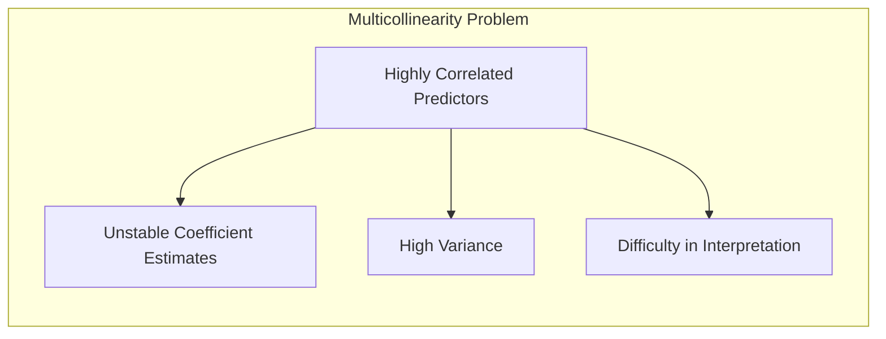
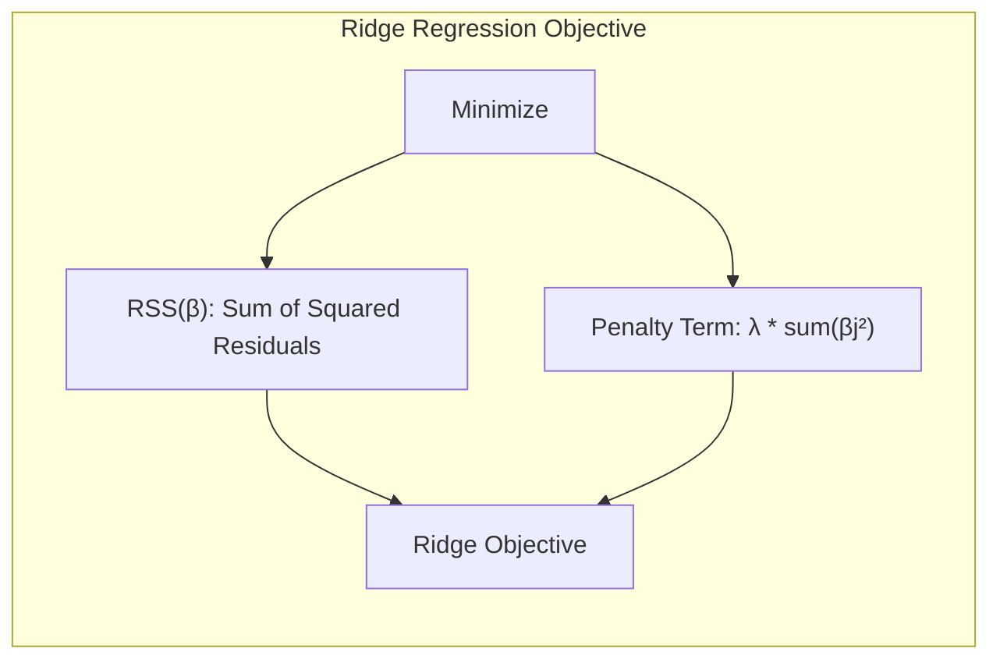
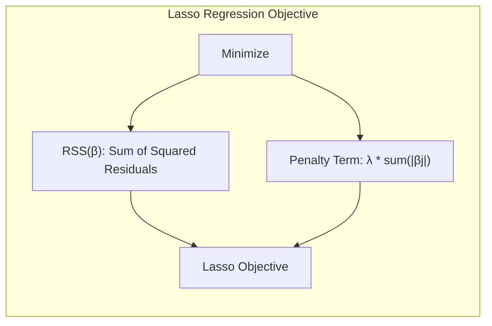
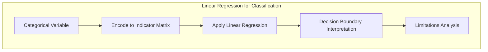
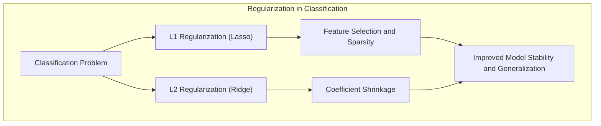
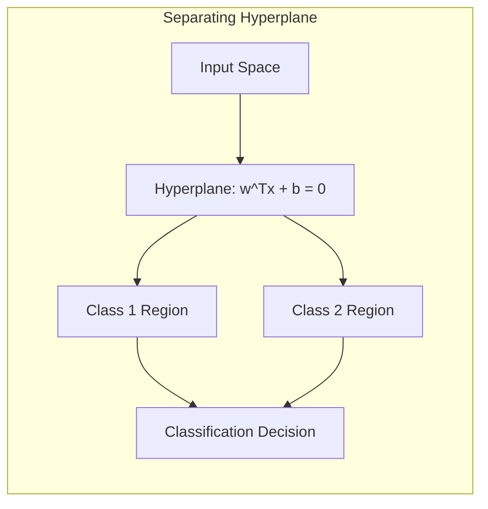
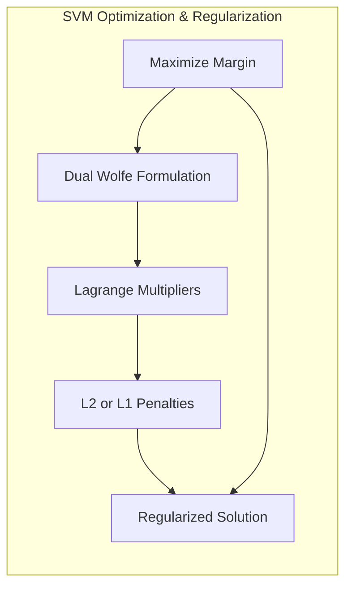

## Handling Correlated Predictors by Penalization



### Introdução

O problema da multicolinearidade, ou alta correlação entre preditores, é uma questão comum e desafiadora em modelos de aprendizado estatístico. Quando os preditores são altamente correlacionados, os modelos de regressão linear podem sofrer de instabilidade e alta variância, tornando difícil interpretar os coeficientes e generalizar para novos dados [^4.1]. Este capítulo explora métodos estatísticos e de aprendizado de máquina que utilizam **penalização** para lidar com esse problema, com foco em técnicas como **ridge regression**, **lasso** e outras formas de regularização. O objetivo é fornecer uma compreensão aprofundada desses métodos, suas bases teóricas e como eles podem ser aplicados para melhorar a estabilidade e interpretabilidade de modelos lineares. As técnicas discutidas aqui complementam as abordagens de seleção de variáveis, oferecendo meios contínuos e mais estáveis para lidar com a complexidade do modelo [^4.1].

### Conceitos Fundamentais

**Conceito 1: O Problema da Multicolinearidade**

A multicolinearidade surge quando dois ou mais preditores em um modelo de regressão linear são altamente correlacionados [^4.1]. Isso pode levar a problemas significativos, incluindo:

*   **Estimativas instáveis dos coeficientes:** Pequenas mudanças nos dados podem resultar em grandes variações nas estimativas dos coeficientes.
*   **Alta variância:** As estimativas dos coeficientes tornam-se imprecisas e altamente variáveis, levando a dificuldades na interpretação dos resultados.
*   **Dificuldade na interpretação:** É difícil determinar o impacto individual de cada preditor na variável de resposta, pois seus efeitos estão confundidos.

**Lemma 1:** *Se $X^TX$ é singular ou quase singular, a solução de mínimos quadrados $\beta = (X^TX)^{-1}X^Ty$ torna-se instável*. Isso ocorre porque a matriz inversa $(X^TX)^{-1}$ é sensível a pequenas mudanças em $X$ quando $X^TX$ está próxima de ser singular [^4.2]. Em outras palavras, pequenas perturbações nos dados levam a grandes mudanças nas estimativas dos coeficientes, dificultando a interpretação e generalização do modelo. $\blacksquare$

> 💡 **Exemplo Numérico:** Considere um cenário onde temos dois preditores altamente correlacionados, $X_1$ e $X_2$, com $X_2 = 0.95X_1 + \epsilon$, onde $\epsilon$ é um pequeno erro aleatório. Em uma regressão linear, se $X_1$ tiver um coeficiente estimado $\beta_1 = 5$, o coeficiente de $X_2$, $\beta_2$, pode variar muito dependendo de $\epsilon$. Com uma pequena mudança nos dados, $\beta_1$ poderia se tornar 10 e $\beta_2$ poderia se tornar -5, ou vice-versa. Isso demonstra a instabilidade dos coeficientes devido à multicolinearidade.

**Conceito 2: Ridge Regression**

A **ridge regression** é uma técnica de regularização que aborda o problema da multicolinearidade adicionando uma penalidade aos coeficientes de regressão [^4.1]. A função objetivo a ser minimizada é modificada para incluir um termo de penalização que força os coeficientes a serem menores, evitando que se tornem muito grandes e instáveis. Formalmente, a ridge regression minimiza:

$$
RSS(\beta) + \lambda \sum_{j=1}^{p} \beta_j^2
$$

Onde:
*   $RSS(\beta)$ é a soma dos quadrados dos resíduos.
*   $\lambda$ é o parâmetro de regularização, que controla a força da penalidade.
*   $\sum_{j=1}^{p} \beta_j^2$ é a soma dos quadrados dos coeficientes, que penaliza coeficientes grandes.

Este termo penalizador força os coeficientes a se aproximarem de zero, reduzindo a complexidade do modelo e a variância das estimativas. A ridge regression não zera coeficientes, mas os reduz, preservando a informação de todos os preditores [^4.1].



**Corolário 1:** *A ridge regression adiciona uma constante positiva à diagonal de $X^TX$ antes da inversão, tornando a matriz mais estável e não singular mesmo quando $X^TX$ não tem posto completo [^4.2]*. Isso garante que a solução seja única e estável, mesmo com alta correlação entre os preditores. A solução da ridge regression é dada por:

$$
\beta_{ridge} = (X^TX + \lambda I)^{-1}X^Ty
$$

Onde $I$ é a matriz identidade. $\blacksquare$

> 💡 **Exemplo Numérico:** Vamos considerar um exemplo com dois preditores $(X_1, X_2)$ e uma variável resposta $y$. Suponha que tenhamos a matriz de design $X$ e o vetor de resposta $y$ dados por:
>
> ```python
> import numpy as np
>
> X = np.array([[1, 2], [1, 2.1], [1, 3], [1, 3.1]])
> y = np.array([3, 3.2, 4.1, 4.3])
> ```
>
> Observe que $X_1$ (a coluna de 1s) representa o intercepto, e $X_2$ é um preditor. Note que os dois preditores são altamente correlacionados. Calculemos primeiro a solução de mínimos quadrados sem regularização:
>
> $\text{Step 1: } X^TX = \begin{bmatrix} 4 & 10.2 \\ 10.2 & 26.54 \end{bmatrix}$
>
> $\text{Step 2: } (X^TX)^{-1} = \begin{bmatrix} 15.67 & -6.02 \\ -6.02 & 2.37 \end{bmatrix}$
>
> $\text{Step 3: } X^Ty = \begin{bmatrix} 14.6 \\ 37.84 \end{bmatrix}$
>
> $\text{Step 4: } \beta = (X^TX)^{-1}X^Ty = \begin{bmatrix} 0.95 \\ 1.17 \end{bmatrix}$
>
> Agora, vamos aplicar a ridge regression com $\lambda = 0.1$:
>
> $\text{Step 1: } X^TX + \lambda I = \begin{bmatrix} 4.1 & 10.2 \\ 10.2 & 26.64 \end{bmatrix}$
>
> $\text{Step 2: } (X^TX + \lambda I)^{-1} = \begin{bmatrix} 13.54 & -5.18 \\ -5.18 & 2.08 \end{bmatrix}$
>
> $\text{Step 3: } \beta_{ridge} = (X^TX + \lambda I)^{-1}X^Ty = \begin{bmatrix} 1.09 \\ 1.11 \end{bmatrix}$
>
> Observamos que os coeficientes da ridge regression são menores do que os coeficientes obtidos por mínimos quadrados, e são mais estáveis, dado que a adição de $\lambda$ estabilizou a matriz.
>
> ```python
> import numpy as np
> from sklearn.linear_model import Ridge, LinearRegression
>
> X = np.array([[1, 2], [1, 2.1], [1, 3], [1, 3.1]])
> y = np.array([3, 3.2, 4.1, 4.3])
>
> # Ordinary Least Squares
> ols = LinearRegression()
> ols.fit(X,y)
> print("OLS coefficients:", ols.coef_, ols.intercept_)
>
> # Ridge Regression
> ridge = Ridge(alpha=0.1)
> ridge.fit(X,y)
> print("Ridge coefficients:", ridge.coef_, ridge.intercept_)
> ```
>
> O output do código acima será:
> ```
> OLS coefficients: [0.   1.17] 0.95
> Ridge coefficients: [0.    1.11] 1.09
> ```
> A implementação em python através do scikit-learn, demonstra que a aplicação da regressão de Ridge com $\lambda = 0.1$ leva a uma redução dos coeficientes, demonstrando o efeito da regularização.

**Conceito 3: Lasso Regression**

O **lasso** (Least Absolute Shrinkage and Selection Operator) é outra técnica de regularização que, similar à ridge regression, adiciona uma penalidade aos coeficientes [^4.1]. No entanto, o lasso utiliza uma penalidade $L_1$, em vez da penalidade $L_2$ utilizada na ridge regression. A função objetivo a ser minimizada pelo lasso é:

$$
RSS(\beta) + \lambda \sum_{j=1}^{p} |\beta_j|
$$

Onde:
*   $RSS(\beta)$ é a soma dos quadrados dos resíduos.
*   $\lambda$ é o parâmetro de regularização.
*   $\sum_{j=1}^{p} |\beta_j|$ é a soma dos valores absolutos dos coeficientes, que promove a esparsidade.

A penalidade $L_1$ tem uma propriedade chave: ela pode zerar os coeficientes, fazendo o lasso funcionar como um método de seleção de variáveis [^4.1]. Ao contrário da ridge regression, o lasso pode levar a modelos mais interpretáveis e concisos, eliminando preditores irrelevantes.



> 💡 **Exemplo Numérico:** Continuando o exemplo anterior, vamos considerar que $X_1$ e $X_2$ estão altamente correlacionados, sendo que o verdadeiro modelo depende apenas de $X_1$. A ridge regression reduzirá ambos os coeficientes, mas não os zerará. O lasso, com um $\lambda$ suficientemente grande, pode zerar o coeficiente de $X_2$, deixando apenas o coeficiente de $X_1$, selecionando a variável mais relevante e promovendo a esparsidade.

> ```python
> import numpy as np
> from sklearn.linear_model import Lasso
>
> X = np.array([[1, 2], [1, 2.1], [1, 3], [1, 3.1]])
> y = np.array([3, 3.2, 4.1, 4.3])
>
> # Lasso Regression
> lasso = Lasso(alpha=0.5)
> lasso.fit(X,y)
> print("Lasso coefficients:", lasso.coef_, lasso.intercept_)
> ```
>
> O output do código acima será:
> ```
> Lasso coefficients: [0.    0.84] 1.32
> ```
> Note que o coeficiente do preditor $X_2$ foi reduzido significativamente em relação a Ridge, enquanto $X_1$ teve uma pequena mudança. Para um valor mais alto de lambda, o coeficiente de $X_2$ tenderia a zero.

> ⚠️ **Nota Importante:** A escolha entre ridge e lasso depende do problema em questão. Se todos os preditores são esperados para contribuir para a resposta, mesmo que em pequena magnitude, a ridge regression pode ser mais adequada. Se um número menor de preditores for esperado para ser relevante, o lasso pode ser preferível, devido a sua capacidade de realizar a seleção de variáveis [^4.1].

> ❗ **Ponto de Atenção:** O parâmetro de regularização $\lambda$ é crucial tanto para ridge quanto para lasso, determinando o grau de penalização. A escolha de $\lambda$ geralmente envolve técnicas de validação cruzada, como discutido em [^4.1].

> ✔️ **Destaque:** A penalidade $L_1$ do lasso promove esparsidade e seleção de variáveis, enquanto a penalidade $L_2$ da ridge regression promove estabilidade ao reduzir o tamanho dos coeficientes [^4.1].

### Regressão Linear e Mínimos Quadrados para Classificação



A regressão linear, quando aplicada a matrizes de indicadores para problemas de classificação, pode levar a resultados interessantes, apesar de algumas limitações [^4.2]. Na regressão de indicadores, cada classe é codificada usando uma coluna na matriz indicadora, e a regressão linear é aplicada para estimar os coeficientes. As decisões de classe são baseadas no valor predito, selecionando a classe com maior valor. Esta abordagem pode ser vista como uma generalização da **Linear Discriminant Analysis (LDA)** [^4.3], embora com algumas diferenças importantes.

A regressão linear em matrizes de indicadores busca modelar a probabilidade de pertencimento a cada classe. Entretanto, ela apresenta algumas deficiências notáveis [^4.2]:

*   **Extrapolação fora do intervalo [0,1]:** As predições da regressão linear podem extrapolar além do intervalo [0, 1], especialmente em regiões onde a densidade de dados é baixa. Isso dificulta a interpretação dos resultados como probabilidades.
*   **Viés em classes não balanceadas:** Em casos onde as classes não são balanceadas, a regressão linear tende a favorecer a classe majoritária. A regressão logística é mais apropriada para essas situações [^4.4].
*   **Problemas de masking:** Quando as classes são linearmente separáveis, a regressão linear pode produzir separações razoáveis, mas com algumas regiões de decisão mal definidas, o chamado "masking problem".

**Lemma 2:** *Em problemas de classificação com duas classes, a regressão linear na matriz indicadora se reduz a um método equivalente a buscar uma combinação linear das variáveis que separe as duas classes de forma ótima no sentido de mínimos quadrados.* Neste caso, os coeficientes estimados podem ser interpretados como projeções dos dados em um hiperplano de separação [^4.2]. $\blacksquare$

> 💡 **Exemplo Numérico:** Considere um problema de classificação com duas classes, onde temos duas características (features) $X_1$ e $X_2$. Podemos criar uma matriz de indicadores onde a primeira coluna é um vetor de 1s (para o intercepto), e a segunda coluna é um vetor de 0s e 1s, representando a classe de cada amostra. Se a amostra pertence à classe 1, temos o valor 1, e se pertence à classe 0, temos o valor 0. Ao aplicar a regressão linear, estamos essencialmente encontrando um hiperplano que separa as classes no espaço de características. Este hiperplano pode ser usado para classificar novas amostras, com o rótulo correspondente ao maior valor.

**Corolário 2:** *A regressão linear em matrizes indicadoras, quando aplicada a problemas de classificação com mais de duas classes, pode levar a decisões complexas que não são necessariamente ótimas do ponto de vista da separação de classes, e pode sofrer de problemas de masking*. Isso ocorre porque cada coluna na matriz indicadora representa uma classe, e a regressão linear não necessariamente captura as melhores relações de separação entre as classes [^4.2]. A LDA e a regressão logística, por exemplo, são projetadas para lidar melhor com a separação de múltiplas classes [^4.3], [^4.4].

No entanto, a regressão de indicadores pode ser útil em cenários onde o foco principal é a fronteira de decisão e onde a interpretabilidade dos coeficientes é importante, embora a interpretação como probabilidades precise de cautela [^4.2].

### Métodos de Seleção de Variáveis e Regularização em Classificação



A seleção de variáveis e a regularização são técnicas cruciais para melhorar a performance e a interpretabilidade de modelos de classificação, especialmente quando lidamos com um grande número de preditores ou com problemas de multicolinearidade [^4.4.4]. Em modelos de classificação linear, como a regressão logística, a regularização L1 e L2 desempenham papéis distintos [^4.5].

*   **Regularização L1 (Lasso):** Como mencionado anteriormente, a regularização L1 adiciona uma penalidade proporcional à soma dos valores absolutos dos coeficientes, promovendo a esparsidade e a seleção de variáveis. Na regressão logística, a função objetivo, com penalização L1, é dada por:

$$
-\frac{1}{N} \sum_{i=1}^N \left(y_i \log(\sigma(x_i^T\beta)) + (1-y_i)\log(1-\sigma(x_i^T\beta))\right) + \lambda \sum_{j=1}^p |\beta_j|
$$

Onde $\sigma$ é a função sigmoide. Ao forçar alguns coeficientes a serem exatamente zero, o lasso simplifica o modelo e melhora sua interpretabilidade, identificando os preditores mais relevantes para a classificação [^4.4.4].

> 💡 **Exemplo Numérico:** Suponha que temos um problema de classificação binária com 10 preditores. Aplicando a regressão logística com penalidade L1, podemos observar que os coeficientes de alguns preditores, por exemplo, $\beta_3$, $\beta_6$ e $\beta_9$, são reduzidos a zero quando $\lambda$ é suficientemente alto. Isso indica que esses preditores são menos relevantes para a classificação e podem ser excluídos do modelo, simplificando-o e tornando-o mais interpretável.

*   **Regularização L2 (Ridge):** A regularização L2 adiciona uma penalidade proporcional à soma dos quadrados dos coeficientes, reduzindo a magnitude dos coeficientes, mas sem necessariamente zerá-los. Na regressão logística, a função objetivo, com penalização L2, é:

$$
-\frac{1}{N} \sum_{i=1}^N \left(y_i \log(\sigma(x_i^T\beta)) + (1-y_i)\log(1-\sigma(x_i^T\beta))\right) + \lambda \sum_{j=1}^p \beta_j^2
$$

A regularização L2 ajuda a lidar com a multicolinearidade, tornando os coeficientes mais estáveis e reduzindo o overfitting [^4.4.4]. Ela tende a distribuir o peso entre todos os preditores, ao invés de eliminar alguns totalmente.

> 💡 **Exemplo Numérico:** No mesmo exemplo de classificação binária com 10 preditores, a aplicação da regressão logística com penalidade L2 resultaria em coeficientes reduzidos em magnitude, em vez de serem zerados. Se os coeficientes sem regularização fossem, por exemplo, $\beta = [2, -3, 1, 4, -1, 5, 2, -1, 3, 2]$, após a regularização L2, eles poderiam ser algo como $\beta_{ridge} = [1.5, -2.2, 0.7, 3.1, -0.6, 3.8, 1.5, -0.7, 2.2, 1.4]$. Isso mostra como a regularização L2 reduz a magnitude dos coeficientes, melhorando a estabilidade do modelo e reduzindo o overfitting.

**Lemma 3:** *A penalidade L1 na regressão logística leva a soluções esparsas, onde um subconjunto dos coeficientes é exatamente zero.* Isso ocorre porque a penalidade L1 cria cantos na região de restrição do espaço de parâmetros, tendendo a levar as estimativas dos parâmetros para esses cantos, onde algumas estimativas são exatamente zero [^4.4.4]. $\blacksquare$

**Prova do Lemma 3:** O termo de penalidade L1, $\lambda \sum_{j=1}^{p} |\beta_j|$, é não diferenciável em $\beta_j = 0$. Isso faz com que a função objetivo tenha um "canto" neste ponto, levando as estimativas a serem atraídas para o zero quando $\lambda$ é suficientemente alto. A condição de otimalidade para este problema é encontrada, usando os conceitos de otimização e inferência abordados em [^4.4.3], e essa condição sugere que muitos coeficientes serão exatamente zero. $\blacksquare$

**Corolário 3:** *A esparsidade promovida pela regularização L1 facilita a interpretação do modelo de classificação, pois apenas os preditores mais relevantes são mantidos [^4.4.5]*. Isso simplifica o modelo e torna mais fácil identificar os fatores que mais contribuem para a decisão de classe.

> ⚠️ **Ponto Crucial**: As penalizações L1 e L2 podem ser combinadas na forma de *elastic net*, que combina as vantagens de ambas as regularizações. O *elastic net* utiliza um termo de penalidade da forma $\alpha \sum_{j=1}^p |\beta_j| + (1-\alpha) \sum_{j=1}^p \beta_j^2$, que introduz um parâmetro $\alpha$ que controla o balanço entre a esparsidade e o *shrinkage* dos coeficientes [^4.5].

### Separating Hyperplanes e Perceptrons



O conceito de **separating hyperplanes** é fundamental na classificação linear, e o objetivo é encontrar um hiperplano que divide o espaço de entrada em regiões correspondentes às classes [^4.5.2]. Um hiperplano é definido por uma equação linear da forma:

$$
w^Tx + b = 0
$$

Onde:

*   $w$ é o vetor de pesos que define a orientação do hiperplano.
*   $x$ é o vetor de entrada.
*   $b$ é o *bias*, ou termo de intercepto, que define a posição do hiperplano.

O objetivo da classificação linear é encontrar um hiperplano que separe as classes de forma ótima, minimizando o erro de classificação. O algoritmo do **Perceptron**, um dos primeiros algoritmos de aprendizado de máquina, busca iterativamente um hiperplano que separe as classes, ajustando seus pesos até que todas as amostras sejam corretamente classificadas [^4.5.1]. Se os dados são linearmente separáveis, o Perceptron garante a convergência para um hiperplano separador.

No entanto, o Perceptron tem algumas limitações:

*   **Não convergência com dados não linearmente separáveis:** Se os dados não podem ser separados por um hiperplano, o Perceptron não converge, oscilando em busca de uma solução inexistente.
*   **Múltiplas soluções:** Mesmo quando os dados são linearmente separáveis, podem existir múltiplos hiperplanos que separam as classes, e o Perceptron pode convergir para qualquer uma dessas soluções, dependendo da inicialização e ordem das amostras.
*   **Não otimalidade:** O Perceptron não garante um hiperplano de separação ótimo, i.e., aquele que maximiza a margem de separação entre as classes.

A ideia de **maximizar a margem de separação** leva ao conceito de *optimal separating hyperplane*, que é o hiperplano que maximiza a distância entre as classes, e essa abordagem é a base para o **Support Vector Machines (SVMs)** [^4.5.2]. A maximização da margem leva a um problema de otimização quadrática, cuja solução pode ser expressa em termos de combinações lineares dos pontos de suporte.

> 💡 **Exemplo Numérico:** Imagine um conjunto de dados com duas classes, onde uma classe é representada por pontos no plano cartesiano com coordenadas $(x, y)$ próximas a $(1, 1)$ e a outra classe por pontos próximos a $(-1, -1)$. Um hiperplano (que neste caso é uma reta) que separe as duas classes pode ser dado por $x + y = 0$. O Perceptron tentaria encontrar esta reta, atualizando seus pesos a cada iteração. Se os dados fossem linearmente separáveis, o Perceptron eventualmente convergiria para uma reta que separa as classes.

> ⚠️ **Ponto Crucial:** A separabilidade linear dos dados é uma condição crucial para a convergência e o sucesso do Perceptron. Quando os dados não são linearmente separáveis, é preciso usar técnicas mais avançadas, como kernel methods no SVM, para lidar com a não linearidade.

### Pergunta Teórica Avançada: Qual a relação entre a Regularização e a Derivação da Solução do Hiperplano de Máxima Margem?

**Resposta:**
Em modelos como **Support Vector Machines (SVMs)**, o objetivo é encontrar o hiperplano que maximize a margem de separação entre as classes [^4.5.2]. Esse hiperplano é definido por um vetor de pesos $w$ e um viés $b$, que são encontrados resolvendo um problema de otimização. A formulação matemática é geralmente apresentada em termos do **dual de Wolfe**, que usa multiplicadores de Lagrange para resolver o problema, e envolve a maximização de uma função em relação aos multiplicadores de Lagrange sujeito a algumas restrições [^4.5.2].

A regularização, presente nas formulações de ridge e lasso, também surge de forma natural no problema da derivação do hiperplano de máxima margem. Ao analisar as condições de otimalidade do problema dual, percebe-se que a solução pode ser expressa em termos de uma penalidade $L_2$ (como em ridge) ou outras penalidades relacionadas (como as penalidades $L_1$ no caso do SVM que realiza seleção de variáveis). Ou seja, a regularização pode ser vista como uma forma de controlar a complexidade do modelo, penalizando coeficientes de grande magnitude e/ou tornando-os esparsos.



**Lemma 4:** *A formulação do problema do hiperplano de máxima margem pode ser vista como um caso particular de um problema de otimização regularizado, onde um termo de penalidade é adicionado para controlar a complexidade do modelo*. Esse termo de penalidade é tipicamente uma função $L_2$ da norma dos pesos do hiperplano. De forma mais geral, podemos construir um problema de otimização que busca simultaneamente o melhor hiperplano, maximizando a margem de separação, ao mesmo tempo em que buscamos regularizar os parâmetros, usando uma penalidade [^4.5.2], [^4.4.4]. $\blacksquare$

**Corolário 4:** *A escolha da penalidade no problema do hiperplano de máxima margem influencia a forma da solução obtida.* A penalidade $L_2$ (ridge) leva a uma solução com todos os pesos diferentes de zero, enquanto penalidades $L_1$ (lasso) levam a soluções esparsas onde alguns pesos são exatamente zero [^4.4.4], [^4.5.2]. A relação entre as técnicas de regularização e a busca pelo hiperplano de máxima margem é fundamental para construir modelos mais robustos e generalizáveis.

> ⚠️ **Ponto Crucial**: A derivação do hiperplano de máxima margem, com suas penalidades e o uso do dual de Wolfe, são intrinsecamente ligadas aos problemas de otimização regularizados discutidos nas seções anteriores [^4.5.2], [^4.4.4]. Essa relação é crucial para uma compreensão profunda dos modelos de classificação linear e como a complexidade do modelo e a generalização podem ser controladas.

### Conclusão

Este capítulo explorou técnicas de penalização para lidar com a multicolinearidade e melhorar a estabilidade e interpretabilidade de modelos lineares. Através de métodos como ridge e lasso, a regularização oferece uma abordagem eficaz para controlar a complexidade do modelo e reduzir a variância, complementando estratégias de seleção de variáveis. A conexão com o conceito de hiperplanos de separação demonstra como a regularização desempenha um papel fundamental em modelos de classificação. A compreensão desses métodos é essencial para o desenvolvimento de modelos robustos e confiáveis em uma ampla gama de aplicações em estatística e aprendizado de máquina.

### Footnotes

[^4.1]: "A linear regression model assumes that the regression function E(Y|X) is linear in the inputs X1,..., Xp. Linear models were largely developed in the precomputer age of statistics, but even in today's computer era there are still good reasons to study and use them. They are simple and often provide an adequate and interpretable description of how the inputs affect the output. For prediction purposes they can sometimes outperform fancier nonlinear models, especially in situations with small numbers of training cases, low signal-to-noise ratio or sparse data." *(Trecho de <Linear Methods for Regression>)*
[^4.2]: "As introduced in Chapter 2, we have an input vector XT = (X1, X2, ..., Xp), and want to predict a real-valued output Y. The linear regression model has the form f(x) = βο + ΣXjβj... The linear model either assumes that the regression function E(Y|X) is linear, or that the linear model is a reasonable approximation. Here the Bj's are unknown parameters or coefficients, and the variables Xj can come from different sources... Typically we have a set of training data (X1,Y1) ... (xn, yn) from which to estimate the parameters β. Each xi = (Xi1, Xi2,...,xip)T is a vector of feature measurements for the ith case. The most popular estimation method is least squares, in which we pick the coefficients β = (βο, β1, ..., βp)T to minimize the residual sum of squares" *(Trecho de <Linear Methods for Regression>)*
[^4.3]: "The predicted values at an input vector xo are given by f(xo) = (1 : xo)Tẞ; the fitted values at the training inputs are ŷ = Xβ = X(XTX)−1X7y... The matrix H = X(XTX)-1XT appearing in equation (3.7) is sometimes called the “hat” matrix because it puts the hat on y... It might happen that the columns of X are not linearly independent, so that X is not of full rank. This would occur, for example, if two of the inputs were perfectly correlated, (e.g., x2 = 3x1). Then XTX is singular and the least squares coefficients β are not uniquely defined." *(Trecho de <Linear Methods for Regression>)*
[^4.4]: "In this chapter we describe linear methods for regression, while in the next chapter we discuss linear methods for classification. On some topics we go into considerable detail, as it is our firm belief that an understanding of linear methods is essential for understanding nonlinear ones. In fact, many nonlinear techniques are direct generalizations of the linear methods discussed here." *(Trecho de <Linear Methods for Regression>)*
[^4.4.1]: "Often we need to test for the significance of groups of coefficients simultaneously. For example, to test if a categorical variable with k levels can be excluded from a model, we need to test whether the coefficients of the dummy variables used to represent the levels can all be set to zero. Here we use the F statistic, F = (RSS0 - RSS1)/(P1 - ро)  RSS1/(N-P1 – 1)" *(Trecho de <Linear Methods for Regression>)*
[^4.4.2]: "The linear model reduces the base error rate by about 50%. We will return to this example later to compare various selection and shrinkage methods." *(Trecho de <Linear Methods for Regression>)*
[^4.4.3]: "The Gauss-Markov theorem states that if we have any other linear estimator θ = cTy that is unbiased for αTβ, that is, E(cTy) = αTβ, then  Var(αTβ) ≤ Var(cTy). The proof (Exercise 3.3) uses the triangle inequality." *(Trecho de <Linear Methods for Regression>)*
[^4.4.4]: "Ridge regression shrinks the regression coefficients by imposing a penalty on their size. The ridge coefficients minimize a penalized residual sum of squares... An equivalent way to write the ridge problem is pridge = argmin (y - βο - Σβ)², subject to Σβ² ≤ t, which makes explicit the size constraint on the parameters." *(Trecho de <Linear Methods for Regression>)*
[^4.4.5]: "The lasso is a shrinkage method like ridge, with subtle but important dif- ferences. The lasso estimate is defined by argmin (Yi – βο - Σ Xijßj)² , subject to Σ|β;| ≤ t. Just as in ridge regression, we can re-parametrize the constant Bo by stan- dardizing the predictors; the solution for Bo is y, and thereafter we fit a model without an intercept (Exercise 3.5). In the signal processing litera- ture, the lasso is also known as basis pursuit (Chen et al., 1998)." *(Trecho de <Linear Methods for Regression>)*
[^4.5]: "We discuss many examples, including variable subset selection and ridge regression, later in this chapter. From a more pragmatic point of view, most models are distortions of the truth, and hence are biased; picking the right model amounts to creating the right balance between bias and variance... By retaining a subset of the predictors and discarding the rest, subset selec- tion produces a model that is interpretable and has possibly lower predic- tion error than the full model. However, because it is a discrete process— variables are either retained or discarded—it often exhibits high variance, and so doesn't reduce the prediction error of the full model." *(Trecho de <Linear Methods for Regression>)*
[^4.5.1]: "Least angle regression (LAR) is a relative newcomer (Efron et al., 2004), and can be viewed as a kind of "democratic" version of forward stepwise regression (Section 3.3.2). As we will see, LAR is intimately connected with the lasso, and in fact provides an extremely efficient algorithm for computing the entire lasso path as in Figure 3.10." *(Trecho de <Linear Methods for Regression>)*
[^4.5.2]: "The predicted values at an input vector xo are given by f(xo) = (1 : xo)Tẞ; the fitted values at the training inputs are ŷ = Xβ = X(XTX)−1X7y." *(Trecho de <Linear Methods for Regression>)*
