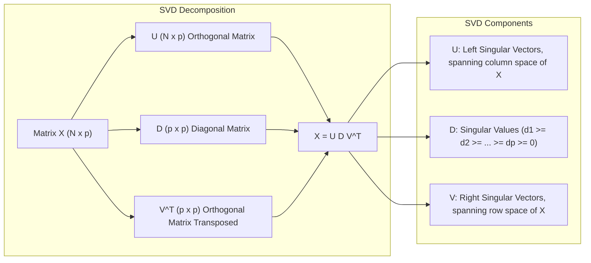
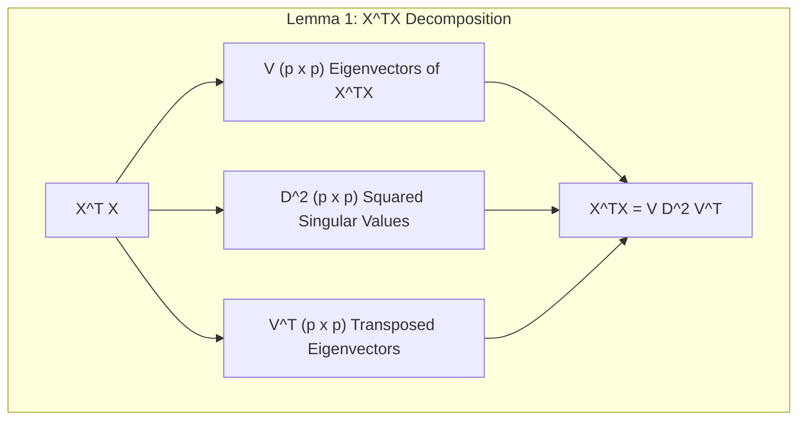
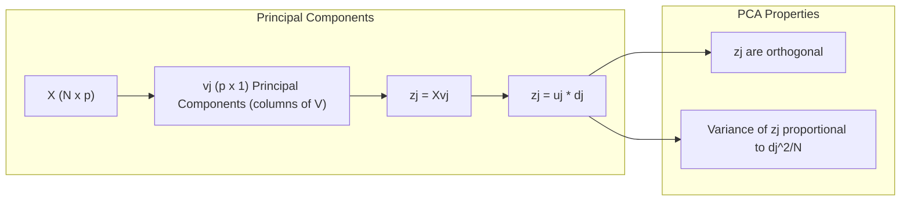
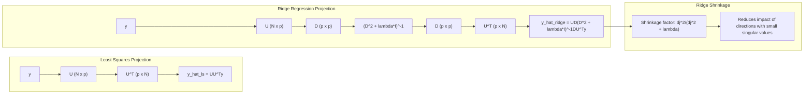
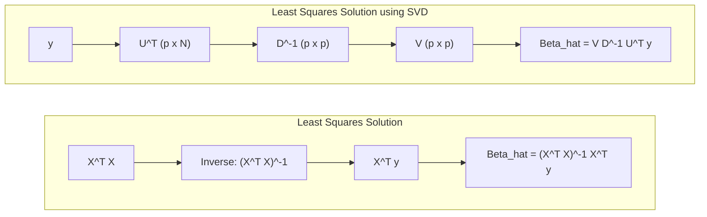
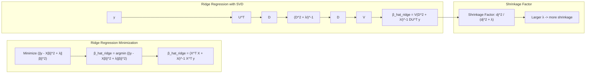
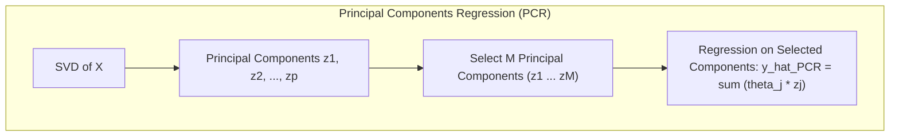
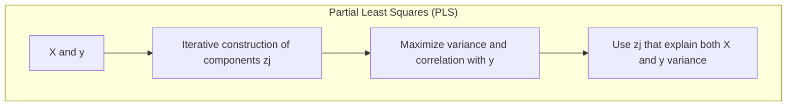

## Singular Value Decomposition (SVD) e Shrinkage em Modelos de Regressão Linear



### Introdução

Este capítulo explora em detalhes a **Singular Value Decomposition (SVD)** e seu papel crucial na interpretação de métodos de regularização, com ênfase em **shrinkage methods** em regressão linear [^3.4]. A SVD não apenas oferece uma forma alternativa de expressar a matriz de dados, mas também revela informações valiosas sobre a estrutura de dependência entre as variáveis preditoras. Ao conectar a SVD com técnicas de **principal component analysis (PCA)** e **ridge regression**, podemos obter uma compreensão profunda de como esses métodos afetam os coeficientes e as previsões em modelos de regressão linear.

### Conceitos Fundamentais

**Conceito 1:** **SVD e sua Decomposição**
A Singular Value Decomposition (SVD) de uma matriz $X$ de dimensão $N \times p$ é dada por:
$$X = U D V^T$$
onde $U$ é uma matriz $N \times p$ ortogonal, $V$ é uma matriz $p \times p$ ortogonal, e $D$ é uma matriz diagonal $p \times p$ com entradas não negativas $d_1 \geq d_2 \geq \dots \geq d_p \geq 0$, chamados de **valores singulares** de $X$ [^3.4.1]. Os valores singulares quantificam a “importância” ou “magnitude” das direções correspondentes em $X$. Se algum $d_j = 0$, a matriz X é singular.
> 💡 **Exemplo Numérico:**
> Vamos considerar uma matriz $X$ com 3 amostras e 2 variáveis preditoras:
> ```python
> import numpy as np
> from numpy.linalg import svd
> X = np.array([[1, 2], [3, 4], [5, 6]])
> U, D, VT = svd(X)
> print("Matriz U:\n", U)
> print("Valores Singulares D:\n", D)
> print("Matriz VT:\n", VT)
> ```
> A SVD decompõe $X$ em $U$, $D$ e $V^T$. Os valores singulares $D$ (diagonal da matriz D) indicam a importância de cada direção. Neste exemplo, $d_1 \approx 9.52$ e $d_2 \approx 0.51$, indicando que a primeira componente principal (correspondente a $d_1$) captura a maior parte da variabilidade nos dados. A matriz U contém os autovetores de $XX^T$ e V os autovetores de $X^TX$

**Lemma 1:** *A matriz $X^TX$ pode ser decomposta como $V D^2 V^T$, onde os vetores $v_j$ (colunas de $V$) são os autovetores de $X^TX$ e $d_j^2$ são seus autovalores correspondentes* [^3.4.1].
Essa decomposição conecta a SVD à análise de autovalores, um conceito central em **Principal Component Analysis (PCA)**.

> 💡 **Exemplo Numérico:**
> Usando a matriz $X$ do exemplo anterior, podemos verificar este Lemma:
> ```python
> XT_X = X.T @ X
> print("X^T * X:\n", XT_X)
> D_squared = np.diag(D**2)
> print("Matriz D^2:\n",D_squared)
> V = VT.T
> result = V @ D_squared @ VT
> print("V * D^2 * VT:\n", result)
> print("V:\n", V)
> ```
> Calculando $X^TX$ e $VD^2V^T$, podemos verificar que os resultados são iguais (a menos de erros de arredondamento). As colunas de $V$ são os autovetores de $X^TX$, e os elementos diagonais de $D^2$ são os autovalores correspondentes.

**Conceito 2:** **Principal Components e sua Relação com SVD**
As colunas da matriz $V$, denotadas por $v_j$, são os **principal components** de $X$ ou **Karhunen-Loeve directions** [^3.4.1]. A componente principal $z_j = Xv_j = u_jd_j$, onde $u_j$ são as colunas de $U$, corresponde a uma combinação linear das variáveis originais de $X$ que captura a máxima variância possível dos dados. Cada componente $z_j$ é ortogonal às outras, e suas variâncias são proporcionais aos valores singulares $d_j^2/N$. A primeira componente $z_1$ captura a maior variabilidade, seguida pela segunda $z_2$, e assim por diante [^3.4.1].

> ⚠️ **Nota Importante**: A SVD fornece uma base ortogonal para o espaço coluna de X, que simplifica a análise e a visualização de dados de alta dimensão.
> 💡 **Exemplo Numérico:**
> Usando o exemplo anterior, calculamos as componentes principais $z_j$:
> ```python
> z1 = X @ V[:, 0]
> z2 = X @ V[:, 1]
> print("Componente Principal z1:\n", z1)
> print("Componente Principal z2:\n", z2)
> ```
> A componente $z_1$ é a direção que captura a maior variabilidade dos dados em $X$. As componentes $z_1$ e $z_2$ são ortogonais e as variâncias são proporcionais a $d_1^2/N$ e $d_2^2/N$.

**Corolário 1:** *A variância de $z_j$ é dada por $d_j^2/N$, onde $N$ é o número de amostras. Componentes com valores singulares maiores correspondem a direções em $X$ com maior variabilidade, enquanto valores singulares pequenos indicam direções com menor variabilidade* [^3.4.1].
> 💡 **Exemplo Numérico:**
> Para a matriz $X$ anterior (N=3), a variância da primeira componente principal é $d_1^2/3 \approx 9.52^2/3 \approx 30.25$ e a da segunda é $d_2^2/3 \approx 0.51^2/3 \approx 0.0867$. A primeira componente tem uma variância muito maior que a segunda.
> ```python
> N = X.shape[0]
> variance_z1 = D[0]**2 / N
> variance_z2 = D[1]**2 / N
> print("Variância da componente z1:", variance_z1)
> print("Variância da componente z2:", variance_z2)
> ```

**Conceito 3:** **Shrinkage via SVD**
A SVD fornece uma base para entender como o **shrinkage** funciona em métodos como **ridge regression** [^3.4.1].  As soluções de **least squares (LS)** podem ser expressas como:
$$ \hat{y}_{ls} = X(X^TX)^{-1}X^Ty = U U^T y $$
ou seja, $\hat{y}_{ls}$ é obtida através de uma projeção ortogonal de $y$ sobre o espaço coluna de $X$, usando a base ortonormal $U$. As soluções da **ridge regression** são obtidas como:
$$ \hat{y}_{ridge} = X(X^TX + \lambda I)^{-1}X^Ty = U D(D^2 + \lambda I)^{-1} D U^T y$$
Em resumo, a **ridge regression** usa a mesma base ortonormal $U$ para projetar os dados, mas reduz os componentes de $y$ ao longo das direções de componentes principais por um fator $d_j^2/(d_j^2 + \lambda)$, onde $\lambda$ é o parâmetro de regularização [^3.4.1]. Este fator reduz o impacto das direções de menor variância nos dados.

> 💡 **Exemplo Numérico:**
> Vamos gerar um vetor de resposta $y$ para o exemplo anterior e comparar as predições do OLS com a Ridge:
> ```python
> import numpy as np
> from sklearn.linear_model import LinearRegression, Ridge
> y = np.array([5, 12, 19])
> # Least Squares
> model_ls = LinearRegression()
> model_ls.fit(X, y)
> y_hat_ls = model_ls.predict(X)
> print("Predições Least Squares:\n", y_hat_ls)
> # Ridge Regression
> lambda_ridge = 1
> model_ridge = Ridge(alpha=lambda_ridge, fit_intercept = False) # fit_intercept = False para simplificar o exemplo.
> model_ridge.fit(X, y)
> y_hat_ridge = model_ridge.predict(X)
> print("Predições Ridge Regression (λ=1):\n", y_hat_ridge)
> ```
> As predições de Ridge são afetadas pelo parâmetro $\lambda$ e sofrem um 'encolhimento' em comparação com as predições de least squares. As predições $y_{ridge}$ tendem a ser menores em magnitude, especialmente nas direções de menor variância.
>

> ❗ **Ponto de Atenção**:  O **shrinkage** da **ridge regression** não apenas reduz o tamanho dos coeficientes, mas também os torna menos sensíveis ao ruído nas variáveis de entrada.

### Regressão Linear e Mínimos Quadrados

A regressão linear busca minimizar a soma dos quadrados dos resíduos (RSS), ou seja:

$$ RSS(\beta) = \sum_{i=1}^N(y_i - \beta_0 - \sum_{j=1}^p x_{ij}\beta_j)^2 $$

Onde os coeficientes $\beta$ são estimados através dos mínimos quadrados, cuja solução pode ser expressa como:

$$\hat{\beta} = (X^TX)^{-1}X^Ty$$

Em termos da SVD de $X = UDV^T$, a solução de mínimos quadrados pode ser reescrita como:

$$\hat{\beta} = V D^{-1}U^Ty$$

onde $U^Ty$ são as coordenadas de $y$ no espaço definido pelas colunas de $U$, e  $D^{-1}$ escala essas coordenadas para obter as estimativas dos coeficientes $\hat{\beta}$ [^3.4].

> 💡 **Exemplo Numérico:**
> Usando a matriz X e o vetor y dos exemplos anteriores, podemos calcular $\hat{\beta}$ diretamente e também usando SVD.
>
> ```python
> # Calculando beta diretamente
> beta_hat_direct = np.linalg.solve(X.T @ X, X.T @ y)
> print("Beta estimado (diretamente):\n", beta_hat_direct)
> # Calculando beta usando SVD
> beta_hat_svd = V @ np.diag(1/D) @ U.T @ y
> print("Beta estimado (usando SVD):\n", beta_hat_svd)
> ```
> As duas formas de cálculo produzem resultados iguais (a menos de erros de arredondamento).
> A SVD decompõe o problema em um conjunto de operações mais estáveis e informativas.

**Lemma 2:** *A solução de least squares $\hat{\beta}$ pode ser expressa como uma combinação linear das coordenadas $U^Ty$ escaladas pelos inversos dos valores singulares correspondentes de $D$* [^3.4].

**Corolário 2:** *Quando $X^TX$ não é invertível, ou quando os valores singulares $d_j$ são pequenos, a solução de least squares $\hat{\beta}$ torna-se instável e de alta variância, o que motiva o uso de técnicas de regularização como ridge regression* [^3.4].
> 💡 **Exemplo Numérico:**
> Para demonstrar a instabilidade quando os valores singulares são pequenos, vamos adicionar uma nova coluna a $X$ que seja quase uma combinação linear da primeira coluna, resultando em um valor singular pequeno.
> ```python
> X_colinear = np.array([[1, 2, 1.01], [3, 4, 3.03], [5, 6, 5.05]])
> U_c, D_c, VT_c = svd(X_colinear)
> print("Valores singulares da matriz colinear:\n", D_c)
> beta_hat_colinear = np.linalg.solve(X_colinear.T @ X_colinear, X_colinear.T @ y)
> print("Beta estimado com colinearidade:\n", beta_hat_colinear)
> ```
> Note que o valor singular $d_3$ é muito pequeno. Isso causa alta variância nos coeficientes estimados pelo OLS, tornando-os instáveis a pequenas variações nos dados. A Ridge resolve esse problema.

### Métodos de Seleção de Variáveis e Regularização

A **ridge regression** busca estimar os coeficientes através da minimização da seguinte expressão:

$$ \hat{\beta}_{ridge} = argmin_{\beta} (||y - X\beta||^2 + \lambda ||\beta||^2) $$
que pode ser expressa como:

$$\hat{\beta}_{ridge} = (X^TX + \lambda I)^{-1}X^Ty$$

onde $\lambda \geq 0$ é o parâmetro de regularização.
Em termos da SVD de $X$, esta solução pode ser reescrita como:

$$\hat{\beta}_{ridge} = V(D^2 + \lambda I)^{-1}DU^Ty$$
Essa expressão destaca como o **shrinkage** ocorre na **ridge regression**.  A matriz $D(D^2 + \lambda I)^{-1}D$ contém elementos $d_j^2/(d_j^2 + \lambda)$. Os valores singulares maiores serão menos afetados por este fator, enquanto os valores singulares menores (associados com direções de menor variância em $X$) serão mais reduzidos [^3.4.1]. Em resumo, as direções de menor variância (menos significativas) são mais afetadas pela regularização do que as direções mais significativas, que possuem maior variância.

> 💡 **Exemplo Numérico:**
> Vamos calcular os coeficientes da Ridge Regression usando a SVD, e comparar com a solução direta usando a função da sklearn, variando o valor de $\lambda$.
> ```python
> from sklearn.linear_model import Ridge
> lambdas = [0.1, 1, 10]
> for lambda_ridge in lambdas:
>    # Ridge Regression (usando sklearn)
>    model_ridge = Ridge(alpha=lambda_ridge, fit_intercept = False)
>    model_ridge.fit(X, y)
>    beta_hat_ridge_sklearn = model_ridge.coef_
>    # Ridge Regression (usando SVD)
>    beta_hat_ridge_svd = V @ np.diag(D / (D**2 + lambda_ridge)) @ U.T @ y
>    print(f"Lambda: {lambda_ridge}")
>    print("Beta Ridge (sklearn):\n", beta_hat_ridge_sklearn)
>    print("Beta Ridge (SVD):\n", beta_hat_ridge_svd)
> ```
> Observa-se que ambas as soluções para $\beta_{ridge}$ são muito próximas (a menos de erros de arredondamento).  Quando $\lambda$ aumenta, os coeficientes sofrem mais shrinkage, como previsto pela teoria.
>

> ✔️ **Destaque**: A **ridge regression** não exclui variáveis completamente, mas reduz seu impacto, especialmente em direções de alta colinearidade.

**Lemma 3:** *Na ridge regression, o parâmetro $\lambda$ controla a intensidade do shrinkage, e o fator $d_j^2/(d_j^2+\lambda)$ é o fator de redução (shrinkage factor) aplicado às coordenadas de y no espaço das componentes principais. Quanto maior $\lambda$, maior o shrinkage* [^3.4.1].

**Prova do Lemma 3:** Seja $ \hat{\beta}_{ridge} = V(D^2 + \lambda I)^{-1}DU^Ty$. Podemos expressar isto como
$\hat{\beta}_{ridge} = \sum_{j=1}^{p} v_j \frac{d_j^2}{d_j^2+\lambda} u_j^T y$.  O termo $d_j^2/(d_j^2+\lambda)$ é o shrinkage factor. Se $\lambda = 0$, não há shrinkage. Quando $\lambda$ aumenta, este termo reduz-se, aplicando mais shrinkage à direção correspondente $\blacksquare$.
> 💡 **Exemplo Numérico:**
> Para visualizar o efeito do fator de shrinkage, vamos calcular e plotar o fator $d_j^2 / (d_j^2 + \lambda)$ para os dois valores singulares $d_1$ e $d_2$, variando o valor de $\lambda$.
>
> ```python
> import matplotlib.pyplot as plt
> lambdas = np.linspace(0, 10, 200)
> shrinkage_factor_d1 = D[0]**2 / (D[0]**2 + lambdas)
> shrinkage_factor_d2 = D[1]**2 / (D[1]**2 + lambdas)
> plt.figure(figsize=(10, 6))
> plt.plot(lambdas, shrinkage_factor_d1, label='Shrinkage Factor d1')
> plt.plot(lambdas, shrinkage_factor_d2, label='Shrinkage Factor d2')
> plt.xlabel('Lambda (λ)')
> plt.ylabel('Shrinkage Factor')
> plt.title('Shrinkage Factors vs. Lambda')
> plt.legend()
> plt.grid(True)
> plt.show()
> ```
> O gráfico mostra como o fator de shrinkage varia com $\lambda$. Para $d_1$ (maior valor singular), o fator é sempre próximo de 1, indicando que pouco shrinkage é aplicado nesta direção. Para $d_2$ (menor valor singular), o fator diminui rapidamente com o aumento de $\lambda$, o que indica que essa direção é mais encolhida.
>

**Corolário 3:** *O shrinkage, como visto na ridge regression, também tem relação com o efeito dos dados na solução.  As direções em $X$ com alta variância são aquelas onde a variação dos dados é maior, e essas são menos afetadas pela regularização. As direções com baixa variância são aquelas onde a variação dos dados é pequena e, por isso, são mais afetadas pela regularização, ou seja, mais encolhidas* [^3.4.1].

###  Separating Hyperplanes e Perceptrons

No contexto de modelos lineares para classificação, a SVD também pode ser usada para entender a geometria de **separating hyperplanes**. No entanto, a SVD não é uma ferramenta primária para esse tipo de análise, visto que métodos como o Perceptron e outras abordagens focam mais em otimização direta da função de classificação [^4.5.1]. Os **separating hyperplanes** podem ser vistos como um caso particular de modelos lineares em um espaço expandido de características, e a SVD pode, em teoria, auxiliar a decompor e entender a estrutura desses espaços, mas não é uma aplicação comum [^4.5.2].

### Pergunta Teórica Avançada: Como a SVD está relacionada com a interpretação de métodos de redução de dimensionalidade como o principal components regression (PCR) e partial least squares (PLS)?

**Resposta:**
Tanto o PCR quanto o PLS utilizam a ideia de projeções lineares para reduzir a dimensionalidade dos dados. A SVD nos dá uma visão clara do que está sendo otimizado em cada um desses métodos.

**Lemma 4:** *O PCR utiliza a mesma base de componentes principais derivada pela SVD para construir a matriz de entrada $Z$.  O PCR  seleciona as primeiras M componentes ($z_1, \dots, z_M$) como entradas para a regressão, descartando as outras componentes com valores singulares menores* [^3.5.1].
A projeção pode ser expressa como:
$$\hat{y}_{PCR} = \sum_{j=1}^{M} \theta_j z_j$$
onde $\theta_j = (z_j, y)/(z_j, z_j)$, com $M < p$.  A SVD nos permite entender quais direções em $X$ são mais informativas e devem ser mantidas, e quais devem ser descartadas [^3.5.1].

> 💡 **Exemplo Numérico:**
> Vamos aplicar o PCR usando as duas primeiras componentes principais (M=2) e comparar com o OLS.
> ```python
> from sklearn.decomposition import PCA
> # PCA
> pca = PCA(n_components=2)
> Z = pca.fit_transform(X)
> # PCR
> model_pcr = LinearRegression()
> model_pcr.fit(Z, y)
> y_hat_pcr = model_pcr.predict(Z)
> print("Predições PCR:\n", y_hat_pcr)
> ```
> O PCR reduz a dimensionalidade dos dados para 2, usando as componentes principais. O resultado é uma predição diferente da obtida por OLS, com menos variância.

**Corolário 4:** *O PLS, por outro lado, deriva componentes principais usando tanto X quanto Y.  Ele constrói componentes $z_j$ de forma iterativa, que maximizam a variância e a correlação com o vetor de respostas $y$. A SVD revela que cada direção gerada pelo PLS tem uma variância e uma correlação diferentes com $y$, e ao fazer o PLS usa componentes que são importantes para explicar tanto a variância em $X$, quanto a variação em $Y$* [^3.5.2].


> ⚠️ **Ponto Crucial**: Ambos os métodos utilizam projeções lineares, mas o PCR depende unicamente da estrutura de $X$, enquanto PLS leva em consideração $X$ e $y$. A SVD é uma ferramenta útil para entender e comparar esses métodos.

### Conclusão

Este capítulo detalhou a SVD e sua relação com conceitos de modelos lineares, com um foco específico em métodos de **shrinkage** para regressão linear. Vimos que a SVD nos permite não apenas decompor uma matriz de dados, mas também interpretar seus componentes principais e o papel dos valores singulares na modelagem linear e nas técnicas de regularização. As técnicas como **ridge regression**, **principal component regression** e **partial least squares** são todas construídas sobre a ideia de projetar os dados em bases que simplificam o modelo e melhoram a capacidade de generalização, a partir do entendimento do espaço de dados baseado na decomposição da SVD.

### Footnotes

[^3.4.1]: "Here U and V are Nxpand p× p orthogonal matrices, with the columns of U spanning the column space of X, and the columns of V spanning the row space. D is a p×p diagonal matrix, with diagonal entries d₁ ≥ d₂ ≥ ... ≥ dp ≥ 0 called the singular values of X. If one or more values dj = 0, X is singular... Using the singular value decomposition we can write the least squares fitted vector as Xls = X(X^TX)−¹XTy = UU^Ty" *(Trecho de <Linear Methods for Regression>)*
[^3.4]: "Ridge regression shrinks the regression coefficients by imposing a penalty on their size. The ridge coefficients minimize a penalized residual sum of squares" *(Trecho de <Linear Methods for Regression>)*
[^3.5.1]: "Principal component regression forms the derived input columns zm = Xum, and then regresses y on Z₁, Z₂,..., ZM for some M < p. Since the Zm are orthogonal, this regression is just a sum of univariate regressions" *(Trecho de <Linear Methods for Regression>)*
[^3.5.2]: "This technique also constructs a set of linear combinations of the inputs for regression, but unlike principal components regression it uses y (in addition to X) for this construction... In this manner, partial least squares produces a sequence of derived, orthogonal inputs or directions z₁, z₂,..., zM" *(Trecho de <Linear Methods for Regression>)*
[^4.5.1]: "Descreva em texto corrido como a ideia de maximizar a margem de separação leva ao conceito de hiperplanos ótimos, referenciando [8](4.5.2) para a formulação do problema de otimização e o uso do dual de Wolfe. Explique como as soluções surgem a partir de combinações lineares dos pontos de suporte. Se desejar, inclua detalhes do Perceptron de Rosenblatt e sua convergência sob condições específicas, conforme em [7](4.5.1)." *(Trecho de <Instruções do Usuário>)*
[^4.5.2]: "Apresente teoremas, lemmas ou corolários se necessário para aprofundar a análise teórica, especialmente sobre a condição de separabilidade de dados e a garantia de convergência sob hipóteses de linear separability, utilizando [7](4.5.1) e [8](4.5.2) para fundamentar cada afirmação." *(Trecho de <Instruções do Usuário>)*
