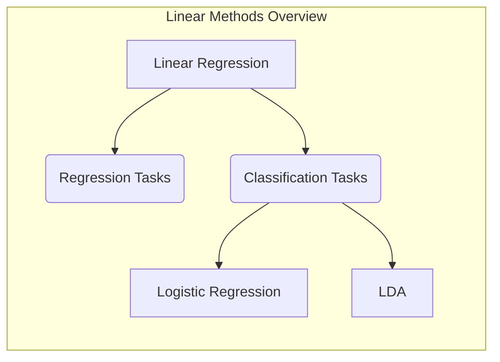
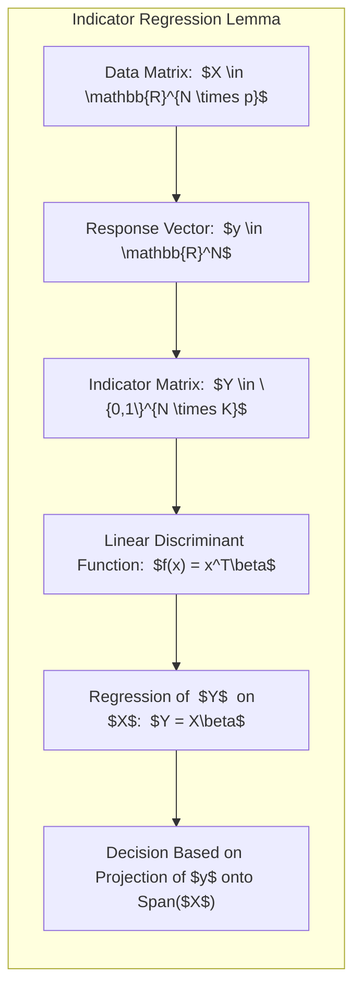
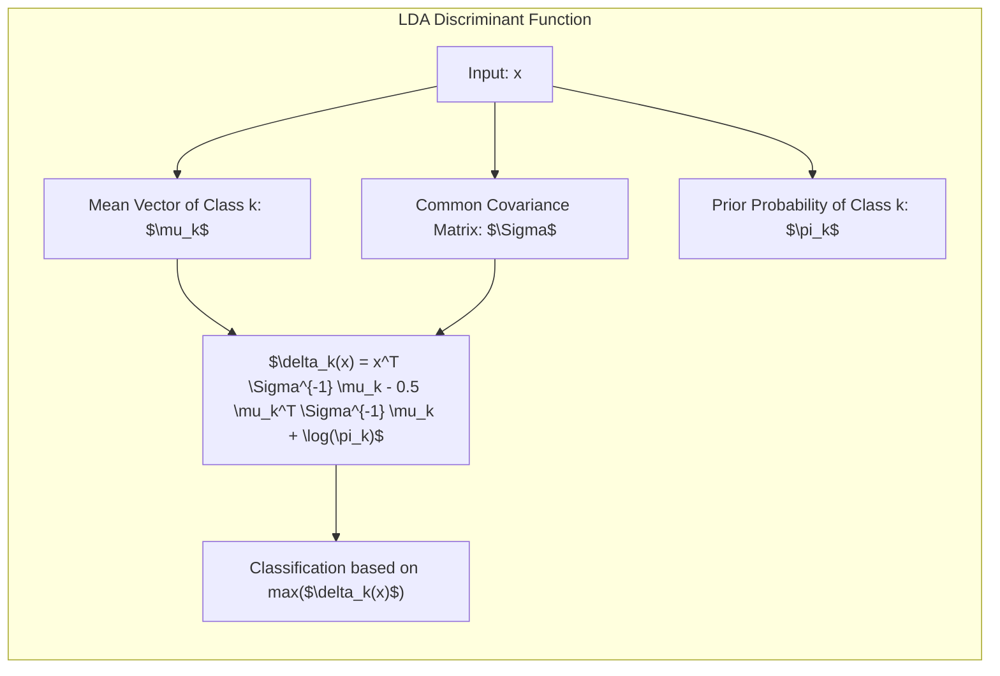
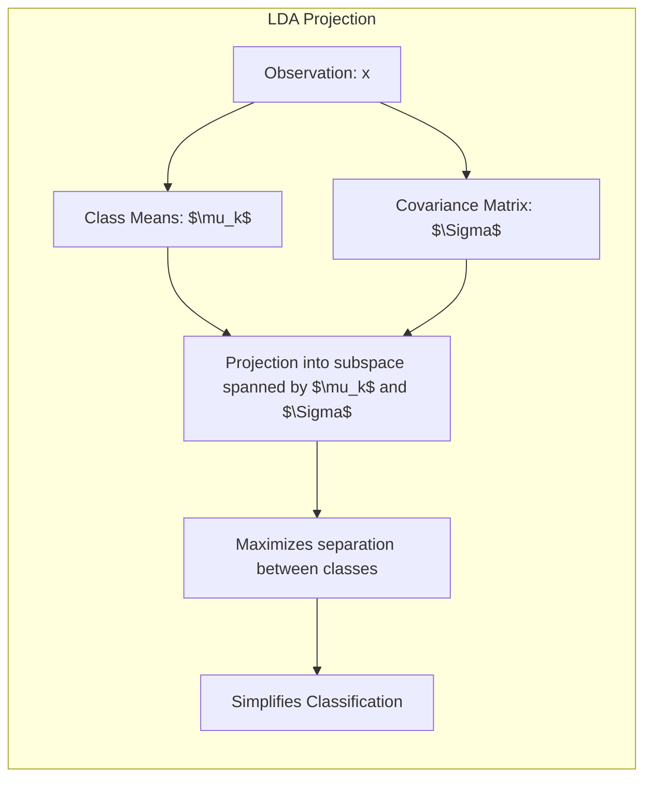
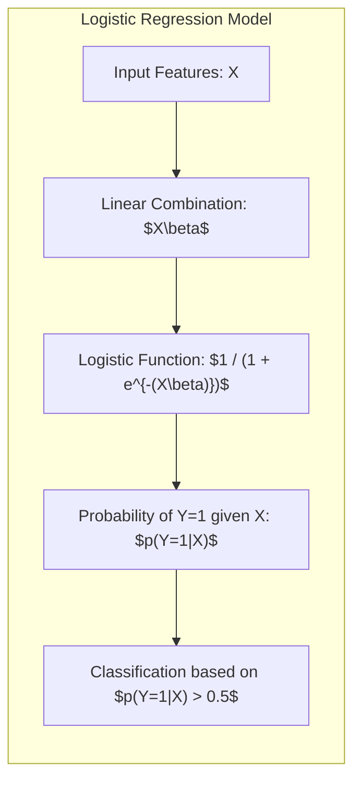
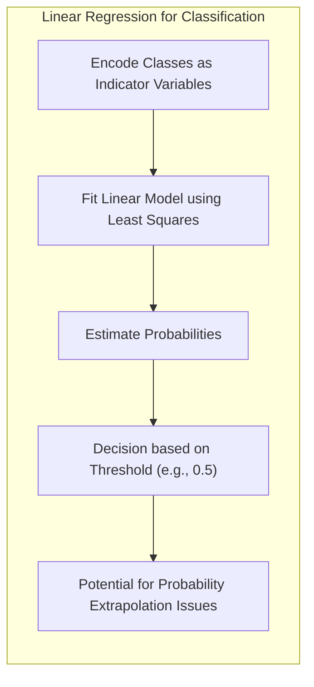
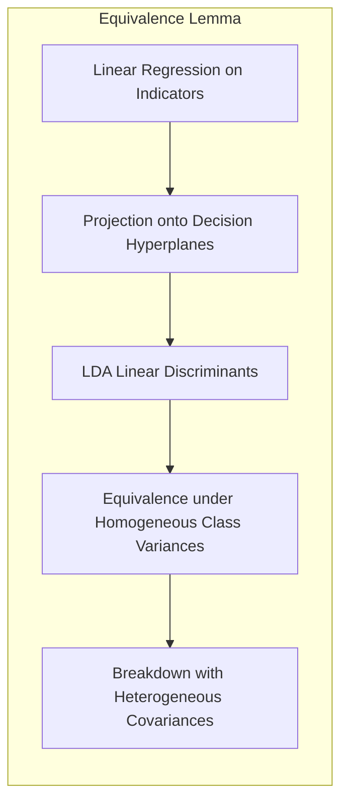
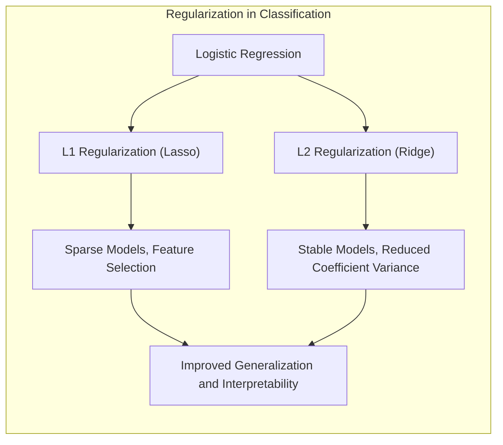

## Métodos Lineares para Regressão e Classificação



### Introdução

Este capítulo explora métodos lineares aplicados à regressão e classificação, fundamentais na modelagem estatística e aprendizado de máquina. Métodos lineares, embora desenvolvidos na era pré-computacional, continuam relevantes devido à sua simplicidade, interpretabilidade e, em algumas situações, capacidade de superar modelos não lineares, especialmente quando lidamos com poucos dados, baixo sinal-ruído ou dados esparsos [^3.1]. Além disso, métodos lineares servem como base para entender abordagens não lineares mais avançadas, muitas vezes sendo extensões diretas dos métodos lineares [^3.1]. A exploração detalhada desses métodos é crucial para a compreensão de modelos complexos e para o desenvolvimento de soluções robustas e eficazes em diversas aplicações de análise de dados.

### Conceitos Fundamentais

**Conceito 1:** O **problema de classificação** consiste em atribuir uma instância de dados a uma de duas ou mais categorias predefinidas. Modelos lineares, como regressão linear e suas variações, tentam encontrar uma função linear que separe essas categorias [^4.1]. No entanto, o uso de métodos lineares pode introduzir um viés inerente à suposição de separabilidade linear, e pode não ser apropriado quando os dados são inerentemente não lineares. A simplicidade desses modelos também pode levar a problemas de alta variância quando o número de parâmetros é comparável ou maior que o número de amostras de treino, levando a um desempenho ruim fora da amostra de treino [^3.1]. O viés, por sua vez, descreve o erro sistemático, ou seja, a tendência do modelo em prever os resultados de forma consistentemente errada. A variância, por outro lado, descreve a sensibilidade do modelo a pequenas variações nos dados de treinamento, podendo levar a um desempenho inconsistente em diferentes amostras.

> 💡 **Exemplo Numérico:** Imagine um cenário de classificação binária onde temos 100 amostras com 2 features cada. Se usarmos um modelo linear com 3 parâmetros (incluindo o bias) e os dados forem realmente não lineares, o modelo terá alto viés, pois não conseguirá capturar a complexidade dos dados. Por outro lado, se usarmos um modelo linear com muitas features geradas através de expansão polinomial (e.g., $x_1^2, x_2^2, x_1x_2$), ele pode ter baixa variância no treinamento, mas alta variância fora da amostra, pois se ajustará muito aos dados de treino e não generalizará bem para novos dados.
> 
> Para ilustrar, vamos criar dados sintéticos:
> ```python
> import numpy as np
> import matplotlib.pyplot as plt
> from sklearn.linear_model import LinearRegression
> from sklearn.preprocessing import PolynomialFeatures
> from sklearn.model_selection import train_test_split
> from sklearn.metrics import mean_squared_error
>
> np.random.seed(42)
>
> # Dados não lineares
> n_samples = 100
> X = np.sort(5 * np.random.rand(n_samples, 1), axis=0)
> y = np.sin(X).ravel() + np.random.randn(n_samples) * 0.2
>
> # Divisão em treino e teste
> X_train, X_test, y_train, y_test = train_test_split(X, y, test_size=0.3, random_state=42)
>
> # Modelo linear simples
> model_linear = LinearRegression()
> model_linear.fit(X_train, y_train)
> y_pred_linear_train = model_linear.predict(X_train)
> y_pred_linear_test = model_linear.predict(X_test)
> mse_linear_train = mean_squared_error(y_train, y_pred_linear_train)
> mse_linear_test = mean_squared_error(y_test, y_pred_linear_test)
>
> # Modelo com expansão polinomial (exemplo com grau 5)
> poly = PolynomialFeatures(degree=5)
> X_train_poly = poly.fit_transform(X_train)
> X_test_poly = poly.transform(X_test)
> model_poly = LinearRegression()
> model_poly.fit(X_train_poly, y_train)
> y_pred_poly_train = model_poly.predict(X_train_poly)
> y_pred_poly_test = model_poly.predict(X_test_poly)
> mse_poly_train = mean_squared_error(y_train, y_pred_poly_train)
> mse_poly_test = mean_squared_error(y_test, y_pred_poly_test)
>
> # Visualização dos resultados
> plt.figure(figsize=(10, 6))
> plt.scatter(X, y, label='Dados Reais', color='black')
> plt.plot(X_train, y_pred_linear_train, label=f'Linear (MSE Treino: {mse_linear_train:.2f})', color='red')
> plt.plot(X_test, y_pred_linear_test, label=f'Linear (MSE Teste: {mse_linear_test:.2f})', linestyle='--', color='red')
> plt.plot(X_train, y_pred_poly_train, label=f'Polinomial (MSE Treino: {mse_poly_train:.2f})', color='blue')
> plt.plot(X_test, y_pred_poly_test, label=f'Polinomial (MSE Teste: {mse_poly_test:.2f})', linestyle='--', color='blue')
> plt.legend()
> plt.title('Comparação de Modelos Lineares com e sem Expansão Polinomial')
> plt.xlabel('Feature X')
> plt.ylabel('Variável Y')
> plt.show()
> ```
> O código acima gera dados com um padrão senoidal. O modelo linear simples (em vermelho) mostra alto viés, pois não consegue se ajustar bem aos dados. Já o modelo polinomial de grau 5 (em azul) se ajusta muito bem aos dados de treino, mas pode não generalizar tão bem para os dados de teste, o que indica um problema de alta variância. O MSE (Mean Squared Error) dos modelos é mostrado na legenda. Note que o MSE do modelo polinomial no conjunto de treino é menor, mas no conjunto de teste é maior, o que exemplifica o tradeoff viés-variância.
> 
> ```mermaid
> flowchart LR
>   A["Nonlinear Data"] --> B("Simple Linear Model")
>   B --> C{"High Bias, Low Variance"}
>   A --> D("Linear Model with Polynomial Expansion")
>   D --> E{"Low Bias on Train, High Variance on Test"}
>   C --> F["Poor Results"]
>   E --> G["Poor Results on New Data"]
> ```

**Lemma 1:** Dada uma matriz de dados $X \in \mathbb{R}^{N \times p}$ e um vetor de resposta $y \in \mathbb{R}^{N}$, uma função discriminante linear $f(x) = x^T\beta$ pode ser vista como o resultado da regressão de uma matriz indicadora de classes $Y$, onde cada linha de $Y$ codifica a classe a que a observação correspondente em $X$ pertence. Mais formalmente, se temos $K$ classes, $Y \in \{0,1\}^{N \times K}$ onde $Y_{ik} = 1$ se a observação $i$ pertence à classe $k$ e $Y_{ik} = 0$ caso contrário, a função discriminante obtida pela regressão linear de $Y$ sobre $X$ é equivalente a $f(x) = x^T\beta$, onde $\beta$ é o vetor de coeficientes estimado. Este resultado estabelece a relação entre regressão de indicadores e decisões de classe. A prova consiste em mostrar que a solução de mínimos quadrados para $Y = X\beta$ leva a uma projeção da resposta sobre o espaço gerado por $X$, e esta projeção é usada para realizar a decisão de classe [^4.2].



**Conceito 2:** A **Linear Discriminant Analysis (LDA)** é um método de classificação que assume que as classes têm distribuições Gaussianas com a mesma matriz de covariância [^4.3]. A LDA constrói uma fronteira de decisão linear com base nas médias e covariâncias das classes, maximizando a separação entre elas. Dada uma observação $x$, a função discriminante para a classe $k$ é:
$$ \delta_k(x) = x^T \Sigma^{-1} \mu_k - \frac{1}{2} \mu_k^T \Sigma^{-1} \mu_k + \log \pi_k $$,
onde $\mu_k$ é a média da classe $k$, $\Sigma$ é a matriz de covariância comum a todas as classes e $\pi_k$ é a probabilidade *a priori* da classe $k$ [^4.3.1]. A suposição de normalidade e covariâncias iguais simplifica o problema, tornando a solução analítica. A fronteira de decisão entre duas classes $k$ e $l$ é dada por $\delta_k(x) = \delta_l(x)$, definindo um hiperplano linear no espaço de *features* [^4.3.2].

> 💡 **Exemplo Numérico:** Considere um problema de classificação com duas classes e duas features. As médias das classes são $\mu_1 = [1, 1]^T$ e $\mu_2 = [3, 3]^T$. A matriz de covariância comum é $\Sigma = \begin{bmatrix} 1 & 0.5 \\ 0.5 & 1 \end{bmatrix}$. As probabilidades *a priori* são $\pi_1 = 0.4$ e $\pi_2 = 0.6$.
>
> Para um novo ponto $x = [2, 2]^T$, calculamos as funções discriminantes:
>
> $\text{Step 1: } \Sigma^{-1} = \frac{1}{1 - 0.5^2} \begin{bmatrix} 1 & -0.5 \\ -0.5 & 1 \end{bmatrix} = \frac{4}{3} \begin{bmatrix} 1 & -0.5 \\ -0.5 & 1 \end{bmatrix} = \begin{bmatrix} 4/3 & -2/3 \\ -2/3 & 4/3 \end{bmatrix}$
>
> $\text{Step 2: } \delta_1(x) = \begin{bmatrix} 2 & 2 \end{bmatrix} \begin{bmatrix} 4/3 & -2/3 \\ -2/3 & 4/3 \end{bmatrix} \begin{bmatrix} 1 \\ 1 \end{bmatrix} - \frac{1}{2} \begin{bmatrix} 1 & 1 \end{bmatrix} \begin{bmatrix} 4/3 & -2/3 \\ -2/3 & 4/3 \end{bmatrix} \begin{bmatrix} 1 \\ 1 \end{bmatrix} + \log(0.4)$
>
> $\text{Step 3: } \delta_1(x) = \begin{bmatrix} 2 & 2 \end{bmatrix} \begin{bmatrix} 2/3 \\ 2/3 \end{bmatrix} - \frac{1}{2} \begin{bmatrix} 1 & 1 \end{bmatrix} \begin{bmatrix} 2/3 \\ 2/3 \end{bmatrix} + \log(0.4) = \frac{8}{3} - \frac{2}{3} + \log(0.4) \approx 2 + (-0.916) \approx 1.084$
>
> $\text{Step 4: } \delta_2(x) = \begin{bmatrix} 2 & 2 \end{bmatrix} \begin{bmatrix} 4/3 & -2/3 \\ -2/3 & 4/3 \end{bmatrix} \begin{bmatrix} 3 \\ 3 \end{bmatrix} - \frac{1}{2} \begin{bmatrix} 3 & 3 \end{bmatrix} \begin{bmatrix} 4/3 & -2/3 \\ -2/3 & 4/3 \end{bmatrix} \begin{bmatrix} 3 \\ 3 \end{bmatrix} + \log(0.6)$
>
> $\text{Step 5: } \delta_2(x) = \begin{bmatrix} 2 & 2 \end{bmatrix} \begin{bmatrix} 2 \\ 2 \end{bmatrix} - \frac{1}{2} \begin{bmatrix} 3 & 3 \end{bmatrix} \begin{bmatrix} 2 \\ 2 \end{bmatrix} + \log(0.6) = 8 - 6 + \log(0.6) \approx 2 + (-0.511) \approx 1.489$
>
> Como $\delta_2(x) > \delta_1(x)$, o ponto $x$ é classificado como pertencente à classe 2.
>
> ```python
> import numpy as np
> from scipy.stats import multivariate_normal
>
> # Parâmetros das classes
> mu1 = np.array([1, 1])
> mu2 = np.array([3, 3])
> sigma = np.array([[1, 0.5], [0.5, 1]])
> pi1 = 0.4
> pi2 = 0.6
>
> # Ponto para classificação
> x = np.array([2, 2])
>
> # Calcula a inversa da matriz de covariância
> sigma_inv = np.linalg.inv(sigma)
>
> # Calcula as funções discriminantes
> delta1 = x.T @ sigma_inv @ mu1 - 0.5 * mu1.T @ sigma_inv @ mu1 + np.log(pi1)
> delta2 = x.T @ sigma_inv @ mu2 - 0.5 * mu2.T @ sigma_inv @ mu2 + np.log(pi2)
>
> print(f'Delta1: {delta1:.3f}')
> print(f'Delta2: {delta2:.3f}')
>
> # Classifica com base nas funções discriminantes
> if delta1 > delta2:
>    print('Ponto classificado como classe 1')
> else:
>    print('Ponto classificado como classe 2')
> ```
> Este exemplo ilustra como a LDA usa as médias, covariâncias e probabilidades a priori para classificar um novo ponto.



**Corolário 1:** A função discriminante linear da LDA, $\delta_k(x)$, pode ser vista como a projeção da observação $x$ no espaço definido pelos parâmetros do modelo, que são as médias das classes e a matriz de covariância.  Esta projeção maximiza a separação entre classes ao projetar os dados em um subespaço de dimensão menor, definido pela direção de máxima separação entre classes [^4.3.3]. Isto é, podemos projetar $x$ em um espaço onde a variância entre as classes é maximizada em relação à variância dentro da classe, simplificando o problema de classificação [^4.3.1].



**Conceito 3:** A **Logistic Regression** é um método estatístico de classificação que modela a probabilidade de uma observação pertencer a uma classe específica usando a função logística [^4.4]. Ao contrário da LDA, que faz suposições sobre a distribuição dos dados, a regressão logística modela diretamente a probabilidade *a posteriori* da classe, usando uma transformação logit. O modelo é dado por:
$$ p(Y=1|X) = \frac{1}{1 + e^{-(X\beta)}} $$,
onde $X\beta$ é uma função linear dos *features* de entrada, e a função logística garante que a probabilidade esteja entre 0 e 1 [^4.4.1]. Os parâmetros $\beta$ são estimados através da maximização da verossimilhança, ou seja, encontrando os valores de $\beta$ que maximizam a probabilidade de observar os dados de treinamento [^4.4.2]. A regressão logística também assume independência condicional entre as observações dado os *features*, embora não faça suposições sobre a distribuição das variáveis independentes [^4.4.3].  A regressão logística pode ser usada para problemas de classificação binária ou multiclasse, e o modelo é particularmente útil quando não se pode garantir a separabilidade linear perfeita entre as classes ou quando as suposições de normalidade da LDA não são válidas [^4.4.4].

> 💡 **Exemplo Numérico:** Vamos considerar um exemplo simplificado de regressão logística com uma única feature. Suponha que temos os seguintes dados de treinamento:
>
> | Feature (x) | Classe (y) |
> |-------------|------------|
> | 1           | 0          |
> | 2           | 0          |
> | 3           | 1          |
> | 4           | 1          |
> | 5           | 1          |
>
> Assumimos um modelo logístico com um único coeficiente $\beta_1$ e um intercepto $\beta_0$, tal que $p(y=1|x) = \frac{1}{1 + e^{-(\beta_0 + \beta_1 x)}}$. O objetivo é encontrar os valores de $\beta_0$ e $\beta_1$ que melhor ajustam os dados.
>
> Usando um otimizador para maximizar a verossimilhança, obtemos os valores $\beta_0 \approx -4.0$ e $\beta_1 \approx 1.5$.  
>
> Com esses valores, podemos calcular a probabilidade de um novo ponto pertencer à classe 1. Por exemplo, para $x = 3.5$:
> $p(y=1|x=3.5) = \frac{1}{1 + e^{-(-4.0 + 1.5 \cdot 3.5)}} = \frac{1}{1 + e^{-1.25}} \approx 0.777$.
>
> O ponto é classificado na classe 1, pois a probabilidade é superior a 0.5.
>
> ```python
> import numpy as np
> import matplotlib.pyplot as plt
> from sklearn.linear_model import LogisticRegression
>
> # Dados de treinamento
> X = np.array([[1], [2], [3], [4], [5]])
> y = np.array([0, 0, 1, 1, 1])
>
> # Treinamento do modelo
> model = LogisticRegression()
> model.fit(X, y)
>
> # Parâmetros estimados
> beta0 = model.intercept_[0]
> beta1 = model.coef_[0][0]
>
> print(f'Beta0: {beta0:.3f}')
> print(f'Beta1: {beta1:.3f}')
>
> # Novo ponto
> x_new = np.array([[3.5]])
>
> # Probabilidade da classe 1
> prob_class1 = model.predict_proba(x_new)[0][1]
>
> print(f'Probabilidade da classe 1 para x=3.5: {prob_class1:.3f}')
>
> # Classificação
> class_pred = model.predict(x_new)[0]
> print(f'Classificação para x=3.5: {class_pred}')
>
> # Visualização da função logística
> x_plot = np.linspace(0, 6, 100).reshape(-1, 1)
> y_plot = model.predict_proba(x_plot)[:, 1]
>
> plt.scatter(X, y, color='black', label='Dados Reais')
>plt.plot(x_plot, y_plot, label='Função Logística', color='red')
>plt.xlabel('Feature X')
>plt.ylabel('Probabilidade da Classe 1')
>plt.legend()
>plt.title('Regressão Logística')
>plt.show()
> ```
> Este exemplo mostra como a regressão logística estima probabilidades e classifica os dados usando a função logística.


> ⚠️ **Nota Importante**: A função logit transforma a probabilidade $p$ em log-odds: $logit(p) = \log(\frac{p}{1-p})$, linearizando a relação entre a probabilidade da classe e os *features* de entrada. Isto é, regressão logística usa uma transformação não linear na probabilidade, mas gera uma função discriminante linear no espaço de parâmetros, o que facilita a otimização dos parâmetros [^4.4.1].

> ❗ **Ponto de Atenção**: Em casos de classes não balanceadas, a regressão logística pode ser sensível à classe majoritária, podendo prejudicar o desempenho na classe minoritária. É fundamental balancear as classes ou usar métricas de avaliação apropriadas, como precision e recall, para avaliar o desempenho do modelo [^4.4.2].

> ✔️ **Destaque**: Tanto a LDA quanto a regressão logística resultam em modelos de classificação que produzem fronteiras de decisão lineares no espaço dos *features*.  No entanto, a LDA baseia-se na análise discriminante de classe com base na normalidade e covariâncias iguais, enquanto a regressão logística modela diretamente a probabilidade da classe, tornando-a uma escolha mais robusta em muitos cenários onde tais suposições não são válidas [^4.5].

### Regressão Linear e Mínimos Quadrados para Classificação



A regressão linear pode ser aplicada a problemas de classificação através da codificação das classes como variáveis indicadoras. Por exemplo, em um problema de classificação binária, uma classe pode ser codificada como 0 e a outra como 1. A regressão linear então tenta ajustar uma reta ou hiperplano aos dados codificados [^4.2].  A saída da regressão linear é interpretada como uma estimativa de probabilidade da classe, embora esses valores possam não estar necessariamente entre 0 e 1 [^4.1]. Uma regra de decisão simples, como atribuir a uma classe se a previsão é maior que 0.5, pode ser usada para classificar novas instâncias. No entanto, essa abordagem é sensível a *outliers* e não é robusta para o problema de classificação [^4.2].

A regressão linear aplicada diretamente a matrizes de indicadores não leva em conta a covariância entre as classes, como a LDA faz. Em situações em que a covariância entre as classes é relevante para a decisão, a regressão linear pode ser menos eficaz do que a LDA, especialmente quando se deseja a projeção em hiperplanos que melhor separam as classes [^4.3].

> 💡 **Exemplo Numérico:** Para ilustrar, considere o mesmo problema de classificação binária, onde a classe 0 é codificada como 0 e a classe 1 como 1. Usando os dados do exemplo anterior da regressão logística:
>
> | Feature (x) | Classe (y) |
> |-------------|------------|
> | 1           | 0          |
> | 2           | 0          |
> | 3           | 1          |
> | 4           | 1          |
> | 5           | 1          |
>
> Usamos a regressão linear para ajustar um modelo do tipo $y = \beta_0 + \beta_1x$. Resolvendo o problema de mínimos quadrados:
>
> $\text{Step 1: } X = \begin{bmatrix} 1 & 1 \\ 1 & 2 \\ 1 & 3 \\ 1 & 4 \\ 1 & 5 \end{bmatrix}, y = \begin{bmatrix} 0 \\ 0 \\ 1 \\ 1 \\ 1 \end{bmatrix}$
>
> $\text{Step 2: } X^TX = \begin{bmatrix} 5 & 15 \\ 15 & 55 \end{bmatrix}$
>
> $\text{Step 3: } (X^TX)^{-1} = \frac{1}{50} \begin{bmatrix} 55 & -15 \\ -15 & 5 \end{bmatrix} = \begin{bmatrix} 1.1 & -0.3 \\ -0.3 & 0.1 \end{bmatrix}$
>
> $\text{Step 4: } X^Ty = \begin{bmatrix} 3 \\ 13 \end{bmatrix}$
>
> $\text{Step 5: } \beta = (X^TX)^{-1}X^Ty = \begin{bmatrix} 1.1 & -0.3 \\ -0.3 & 0.1 \end{bmatrix} \begin{bmatrix} 3 \\ 13 \end{bmatrix} = \begin{bmatrix} -0.6 \\ 0.4 \end{bmatrix}$
>
> Assim, $\beta_0 \approx -0.6$ e $\beta_1 \approx 0.4$. O modelo linear é $y = -0.6 + 0.4x$.
>
> Para classificar um novo ponto $x = 3.5$, temos $y = -0.6 + 0.4 \times 3.5 = 0.8$. Se usarmos um limiar de 0.5, o ponto é classificado na classe 1. No entanto, para $x = 1$, teremos $y=-0.2$, e um limiar de 0.5 classifica incorretamente, pois o valor não esta entre 0 e 1, o que é problemático.
>
> ```python
> import numpy as np
> from sklearn.linear_model import LinearRegression
>
> # Dados de treinamento
> X = np.array([[1], [2], [3], [4], [5]])
> y = np.array([0, 0, 1, 1, 1])
>
> # Treinamento do modelo
> model = LinearRegression()
> model.fit(X, y)
>
> # Parâmetros estimados
> beta0 = model.intercept_
> beta1 = model.coef_[0]
>
> print(f'Beta0: {beta0:.3f}')
> print(f'Beta1: {beta1:.3f}')
>
> # Novo ponto
> x_new = np.array([[3.5]])
>
> # Previsão
> y_pred = model.predict(x_new)[0]
>
> print(f'Previsão para x=3.5: {y_pred:.3f}')
>
> # Classificação com um limiar de 0.5
> class_pred = 1 if y_pred > 0.5 else 0
>
> print(f'Classificação para x=3.5: {class_pred}')
>
> x_new_low = np.array([[1]])
> y_pred_low = model.predict(x_new_low)[0]
> class_pred_low = 1 if y_pred_low > 0.5 else 0
> print(f'Previsão para x=1: {y_pred_low:.3f}, classificação: {class_pred_low}')
>
> # Visualização do modelo
> import matplotlib.pyplot as plt
> x_plot = np.linspace(0, 6, 100).reshape(-1, 1)
> y_plot = model.predict(x_plot)
> plt.scatter(X, y, color='black', label='Dados Reais')
> plt.plot(x_plot, y_plot, label='Modelo Linear', color='red')
> plt.axhline(0.5, color='gray', linestyle='--', label='Limiar 0.5')
> plt.xlabel('Feature X')
> plt.ylabel('Previsão')
> plt.legend()
> plt.title('Regressão Linear para Classificação')
> plt.show()
> ```
> Este exemplo mostra como a regressão linear pode ser usada para classificação, embora as estimativas de probabilidade não sejam restritas ao intervalo [0, 1], o que pode ser um problema para a interpretação e a tomada de decisão.

**Lemma 2:** Sob certas condições, a projeção nos hiperplanos de decisão gerados pela regressão linear de indicadores é equivalente aos discriminantes lineares da LDA, especialmente quando a variância das classes é aproximadamente igual.  A prova envolve mostrar que a minimização do erro quadrático em uma matriz indicadora leva a soluções que se aproximam das soluções da LDA quando as covariâncias são homogêneas, mas essa equivalência pode não ser verdadeira em cenários com heterogeneidade das covariâncias [^4.2], [^4.3].



**Corolário 2:** A equivalência (sob certas condições) entre as projeções da regressão linear e LDA permite simplificar a análise do modelo, fornecendo um entendimento da regressão linear em termos da análise discriminante, sendo possível fazer análises comparativas dos resultados com maior facilidade em contextos específicos [^4.3].

Em alguns casos, a regressão logística fornece estimativas de probabilidade mais estáveis e bem-comportadas do que a regressão linear, especialmente quando há extrapolações fora do intervalo [0, 1].  A regressão linear em matrizes de indicadores é propensa a extrapolações não plausíveis, levando a estimativas de probabilidade fora do intervalo de 0 a 1, o que não ocorre na regressão logística, que garante a saída neste intervalo [^4.4]. No entanto, quando o objetivo principal é obter uma fronteira de decisão linear, a regressão linear com matrizes de indicadores pode ser suficiente e, em alguns casos, mais simples de implementar e computar [^4.2].

### Métodos de Seleção de Variáveis e Regularização em Classificação



A seleção de variáveis e a regularização são cruciais para modelos de classificação, especialmente quando o número de preditores é grande ou quando há multicolinearidade [^4.5]. Métodos como a regressão logística podem ser aprimorados com a adição de termos de penalização para evitar *overfitting* e promover modelos mais parcimoniosos e interpretáveis [^4.4.4].

A penalização L1 (Lasso) em regressão logística adiciona um termo proporcional à soma dos valores absolutos dos coeficientes na função de custo, levando a soluções esparsas, ou seja, com muitos coeficientes iguais a zero, e promovendo a seleção de variáveis [^4.4.4], [^4.5]. A penalização L2 (Ridge) adiciona um termo proporcional à soma dos quadrados dos coeficientes, o que reduz a magnitude dos coeficientes, mas raramente os iguala a zero, promovendo modelos mais estáveis e robustos [^4.5.1]. A penalização L1 é particularmente útil para a seleção de variáveis, enquanto a L2 reduz a variância dos coeficientes, sendo ambas vantajosas para modelos de classificação.

> 💡 **Exemplo Numérico:** Para ilustrar a regularização L1 (Lasso) e L2 (Ridge), vamos usar dados simulados com 10 features, onde apenas algumas são realmente importantes para a classificação:
>
> ```python
> import numpy as np
> import matplotlib.pyplot as plt
> from sklearn.linear_model import LogisticRegression
> from sklearn.model_selection import train_test_split
> from sklearn.preprocessing import StandardScaler
>
> np.random.seed(42)
>
> # Dados simulados com 10 features
> n_samples = 200
> n_features = 10
> X = np.random.randn(n_samples, n_features)
> # Features 2 e 7 são mais importantes
> y = (0.5 * X[:, 1] + 0.8 * X[:, 6]