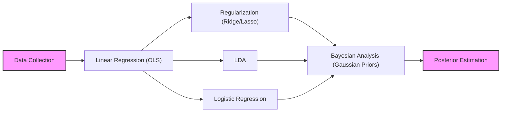
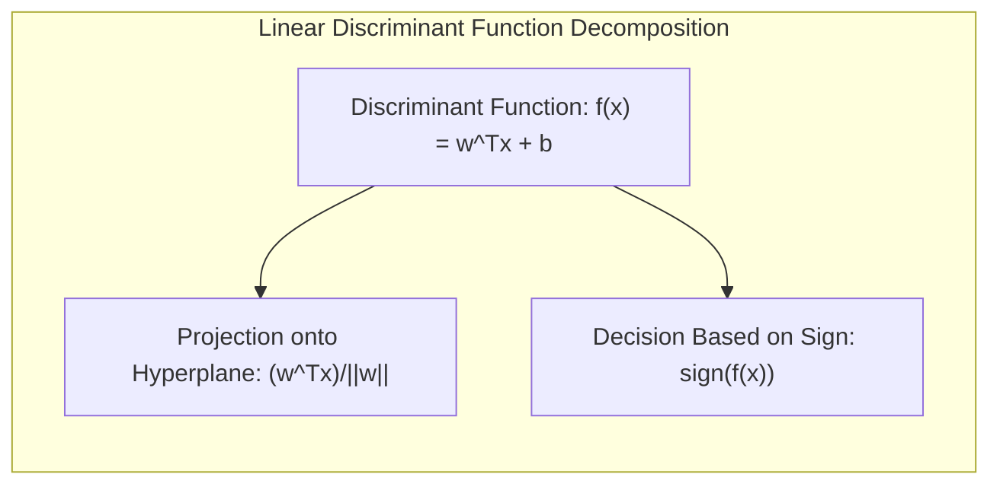
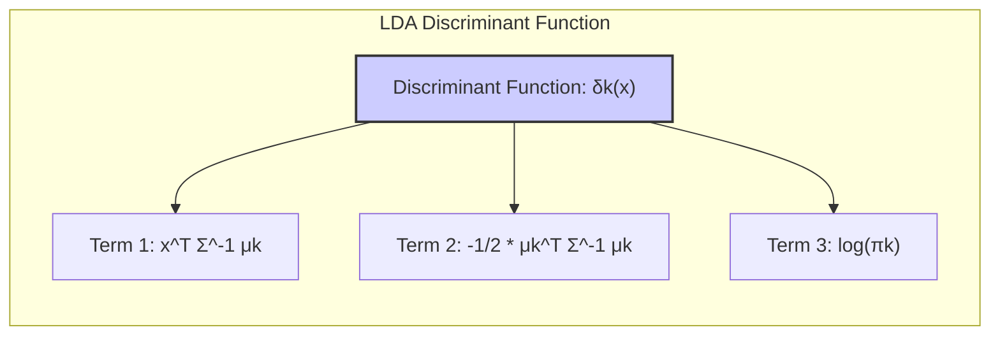
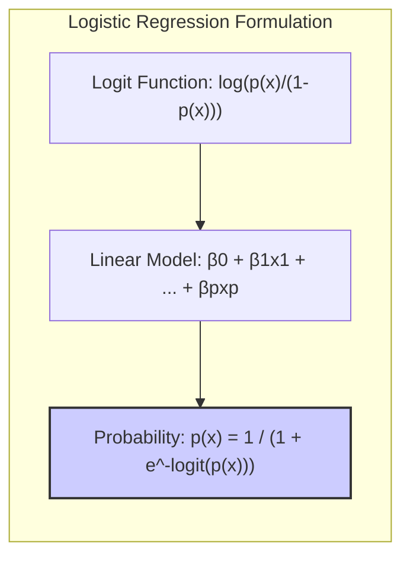
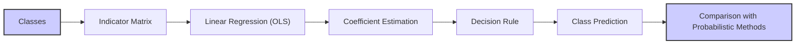
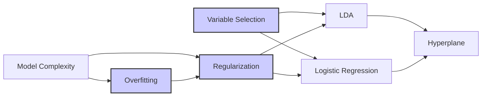
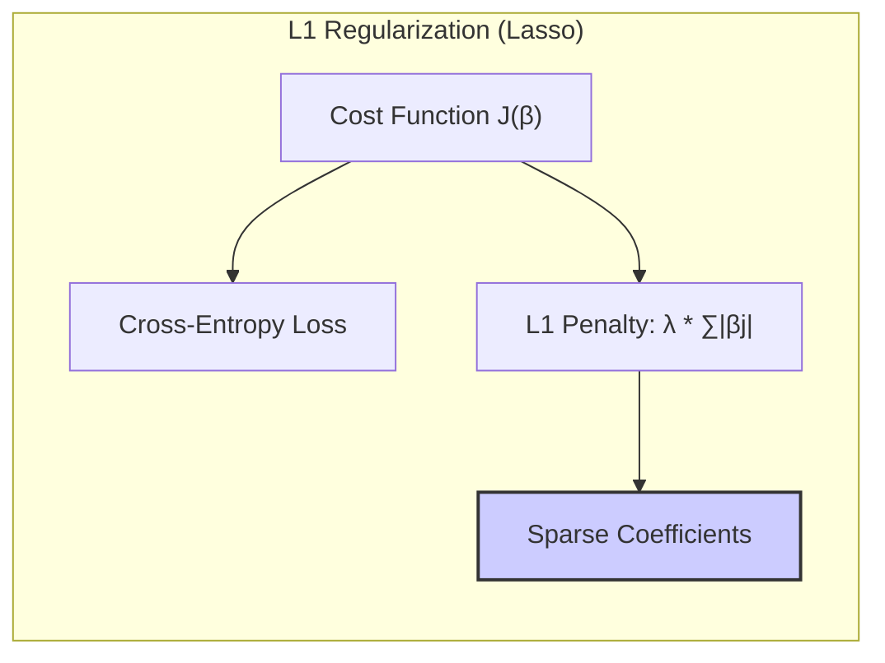
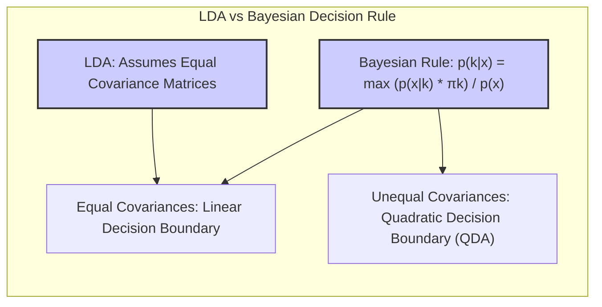

## Métodos Lineares para Regressão: Uma Análise Aprofundada com Foco em Conexões Bayesianas


### Introdução
O capítulo anterior apresentou os modelos de regressão linear e seus métodos de estimação, com ênfase em abordagens clássicas como mínimos quadrados e seleção de variáveis [^4.1]. Neste capítulo, exploraremos a fundo esses conceitos, detalhando a conexão entre os métodos lineares e as abordagens Bayesianas. Particularmente, examinaremos como a imposição de priors Gaussianos sobre os parâmetros do modelo leva a estimativas de posterior que se conectam aos conceitos de regularização, como ridge regression e lasso. A regressão linear, conforme descrito em [^4.2], assume que a função de regressão $E(Y|X)$ é linear nas entradas $X_1, ..., X_p$. Métodos lineares, embora desenvolvidos na era pré-computacional, continuam relevantes por sua simplicidade, interpretabilidade e, em alguns casos, por sua performance superior a modelos não lineares, especialmente em cenários com poucos dados de treino, baixa relação sinal-ruído ou dados esparsos [^4.1]. As generalizações desses métodos, como as expansões de bases e transformações de entrada, expandem seu alcance e os tornam essenciais para a compreensão de técnicas não lineares.

### Conceitos Fundamentais

**Conceito 1:** **O Problema de Classificação e Métodos Lineares**. O problema de classificação, em sua essência, busca encontrar um limite de decisão que separa as classes de forma ótima [^4.1]. Métodos lineares, embora possam parecer simplistas à primeira vista, oferecem uma estrutura sólida para abordar esse problema. A decisão de usar um método linear muitas vezes se relaciona com o trade-off entre **viés** e **variância**: modelos lineares tendem a ter alto viés, mas baixa variância, tornando-os adequados quando há poucos dados. Por exemplo, em uma análise de sentimentos onde a entrada pode ser um vetor de contagens de palavras, um modelo linear simples pode atingir alta performance, mesmo com pouca complexidade. Um exemplo prático seria usar um modelo de regressão linear sobre uma matriz indicadora para classificar documentos em diferentes categorias, onde o output seria a categoria predita.  
> 💡 **Exemplo Numérico:** Considere um problema de classificação binária com duas classes (0 e 1). Temos um conjunto de dados com 5 amostras e uma única feature. As features e labels são: `X = np.array([[1], [2], [3], [4], [5]])` e `y = np.array([0, 0, 1, 1, 1])`. Podemos usar um modelo de regressão linear para classificar esses dados usando uma matriz indicadora. Primeiro, treinamos o modelo usando o sklearn:
```python
import numpy as np
from sklearn.linear_model import LinearRegression

X = np.array([[1], [2], [3], [4], [5]])
y = np.array([0, 0, 1, 1, 1])

model = LinearRegression()
model.fit(X, y)

# Predição para um novo ponto x = 3.5
x_new = np.array([[3.5]])
y_pred = model.predict(x_new)
print(f"Predicted value for x=3.5: {y_pred[0]}")

# O resultado será um valor entre 0 e 1, e podemos classificar como 0 se < 0.5 e 1 se >= 0.5
if y_pred[0] >= 0.5:
    print("Classified as class 1")
else:
    print("Classified as class 0")
```
Este exemplo ilustra como uma regressão linear pode ser usada para classificação, embora seja importante notar que os resultados não são probabilidades e podem estar fora do intervalo [0,1].

**Lemma 1:** *Decomposição da Função Discriminante Linear*. Uma função discriminante linear pode ser decomposta em uma projeção dos dados em um hiperplano e uma decisão com base na posição projetada. Matematicamente, dada uma função discriminante $f(x) = w^T x + b$, onde $w$ é o vetor de pesos e $b$ é o bias, a projeção em um hiperplano definido por $w$ é dada por $\frac{w^T x}{||w||}$, e a decisão da classe é baseada no sinal de $f(x)$.

**Prova:** O hiperplano de decisão é definido por $w^T x + b = 0$. O vetor $w$ é ortogonal ao hiperplano. A projeção de um ponto $x$ sobre o vetor $w$ (ou seja, a projeção em direção ortogonal ao hiperplano) é $\frac{w^T x}{||w||}$. A função discriminante linear usa essa projeção, adicionando um *bias* $b$. $\blacksquare$

**Conceito 2:** **Linear Discriminant Analysis (LDA)**. A LDA é um método de classificação que assume que as classes seguem distribuições Gaussianas com a mesma matriz de covariância [^4.3]. A função discriminante do LDA é derivada da probabilidade posterior de cada classe, baseando-se na probabilidade de um ponto pertencer a cada classe. A fronteira de decisão, portanto, é um hiperplano que maximiza a separação entre classes, considerando a variância dentro de cada classe. As suposições de normalidade e igualdade de covariância são cruciais para a derivação do LDA [^4.3.1]. Se essas suposições não se sustentam, outros métodos podem ser mais adequados. Matematicamente, a função discriminante da LDA para a classe $k$ é dada por:

$$ \delta_k(x) = x^T \Sigma^{-1} \mu_k - \frac{1}{2} \mu_k^T \Sigma^{-1} \mu_k + \log(\pi_k) $$

Onde $\mu_k$ é a média da classe $k$, $\Sigma$ é a matriz de covariância comum a todas as classes e $\pi_k$ é a probabilidade *a priori* da classe $k$ [^4.3.2]. A função de decisão, em essência, usa essa projeção e classifica um novo ponto na classe com maior probabilidade posterior.
> 💡 **Exemplo Numérico:**  Vamos considerar um exemplo simplificado com duas classes e duas features. Suponha que temos:
> - Classe 1: $\mu_1 = [1, 1]$,  $\pi_1 = 0.4$
> - Classe 2: $\mu_2 = [3, 3]$, $\pi_2 = 0.6$
> - Matriz de covariância comum: $\Sigma = [[1, 0.5], [0.5, 1]]$
> Vamos calcular a função discriminante para um novo ponto $x = [2, 2]$:
```python
import numpy as np
from numpy.linalg import inv

mu1 = np.array([1, 1])
mu2 = np.array([3, 3])
pi1 = 0.4
pi2 = 0.6
Sigma = np.array([[1, 0.5], [0.5, 1]])
x = np.array([2, 2])

Sigma_inv = inv(Sigma)

delta1 = x.T @ Sigma_inv @ mu1 - 0.5 * mu1.T @ Sigma_inv @ mu1 + np.log(pi1)
delta2 = x.T @ Sigma_inv @ mu2 - 0.5 * mu2.T @ Sigma_inv @ mu2 + np.log(pi2)
print(f"Discriminant function for class 1: {delta1}")
print(f"Discriminant function for class 2: {delta2}")

if delta1 > delta2:
    print("Classified as class 1")
else:
    print("Classified as class 2")
```
Este código calcula as funções discriminantes da LDA para cada classe e classifica o ponto x na classe com maior valor discriminante.


**Corolário 1:** A função discriminante linear na LDA é equivalente à projeção em um subespaço de menor dimensão. Se a matriz de covariância é singular, a LDA pode ser adaptada para lidar com essa situação, encontrando projeções em subespaços onde a matriz é invertível, de forma que essa projeção capture a máxima separabilidade entre as classes [^4.3.1].

**Conceito 3:** **Regressão Logística**. A regressão logística é um método de classificação probabilístico que modela a probabilidade de um ponto pertencer a uma classe através de uma função logística [^4.4]. Diferentemente da LDA, a regressão logística não impõe restrições sobre as covariâncias das classes, oferecendo mais flexibilidade, especialmente em problemas com dados não Gaussianos. A regressão logística modela o log-odds (logit) como uma função linear dos preditores:

$$ \log\left(\frac{p(x)}{1-p(x)}\right) = \beta_0 + \beta_1x_1 + \ldots + \beta_p x_p $$

Onde $p(x)$ é a probabilidade de um ponto pertencer à classe positiva [^4.4.1]. O objetivo é estimar os parâmetros $\beta$ que maximizam a verossimilhança dos dados, o que é frequentemente realizado por métodos de otimização numérica, como o gradiente descendente [^4.4.2].
> ⚠️ **Nota Importante**: Em regressão logística, o conceito do logit é essencial para transformar a probabilidade, que está limitada entre 0 e 1, em um espaço irrestrito, que pode ser modelado como uma função linear dos preditores.
> ❗ **Ponto de Atenção**: Classes não balanceadas podem levar a estimativas de parâmetros enviesadas na regressão logística, requerendo técnicas de balanceamento ou ajuste de pesos.
> ✔️ **Destaque**: Existe uma forte correlação entre as estimativas dos parâmetros na LDA e na regressão logística, especialmente quando as classes seguem distribuições Gaussianas com covariâncias semelhantes. Essa conexão, como veremos, é a base para várias técnicas que relacionam os dois métodos.
> 💡 **Exemplo Numérico:** Suponha que temos um modelo de regressão logística com dois parâmetros: $\beta_0 = -1$ e $\beta_1 = 0.5$. Dado um ponto com feature $x_1 = 2$, podemos calcular a probabilidade de pertencer à classe positiva:
$$ \text{logit}(p(x)) = -1 + 0.5 \times 2 = 0 $$
$$ p(x) = \frac{1}{1 + e^{-\text{logit}(p(x))}} = \frac{1}{1 + e^0} = \frac{1}{2} = 0.5 $$
```python
import numpy as np

beta0 = -1
beta1 = 0.5
x1 = 2

logit = beta0 + beta1 * x1
p_x = 1 / (1 + np.exp(-logit))
print(f"Logit: {logit}")
print(f"Probability of belonging to the positive class: {p_x}")
```
Este exemplo mostra como, com os parâmetros do modelo e o valor da feature, podemos calcular a probabilidade de pertencer à classe positiva.


### Regressão Linear e Mínimos Quadrados para Classificação

A regressão linear pode ser adaptada para a classificação utilizando uma **matriz de indicadores** para representar as classes [^4.2]. Nesse enfoque, cada classe é codificada como uma variável *dummy* e um modelo linear é ajustado para prever o valor da variável de resposta, que nesse caso seria a variável indicadora da classe. Apesar de sua simplicidade, essa abordagem tem limitações, como a possibilidade de previsões fora do intervalo [0,1] e a sensibilidade a classes não balanceadas. No entanto, a regressão de indicadores, como descrito em [^4.2], pode ser útil em alguns casos, especialmente quando a fronteira de decisão linear é suficiente para o problema e o foco principal é a separação das classes e não uma probabilidade precisa da pertinência à classe. Matematicamente, se temos $K$ classes, criaríamos $K$ variáveis indicadoras, e o problema de regressão linear seria adaptado para cada uma dessas variáveis.

**Lemma 2:** A regressão linear de indicadores, em certas condições, é equivalente a métodos discriminantes lineares. Em termos formais, se assumimos que os erros são aditivos e Gaussianos, a fronteira de decisão entre classes pode ser aproximada por uma regressão linear sobre as variáveis indicadoras, e essa fronteira tem uma forma similar à das fronteiras obtidas por LDA.
**Prova**: A regressão de indicadores ajusta uma função linear para cada variável indicadora de classe, usando mínimos quadrados. A decisão da classe é feita com base na classe de maior valor predito. Em alguns casos, sob suposições adequadas dos dados, a fronteira linear resultante dessa abordagem se assemelha à fronteira gerada por LDA, principalmente quando as matrizes de covariância são similares entre classes. Formalmente, a função discriminante $x^T\beta$ pode ser derivada como aproximação da função discriminante da LDA. $\blacksquare$

**Corolário 2:** A projeção de dados em hiperplanos de decisão gerados por regressão linear de indicadores pode ser usada para reduzir a dimensionalidade antes de aplicar classificadores mais complexos.

### Métodos de Seleção de Variáveis e Regularização em Classificação

Métodos de seleção de variáveis e regularização são cruciais em classificação para lidar com o problema de *overfitting*, especialmente quando o número de preditores é alto [^4.5]. A regularização, em particular, adiciona termos de penalização à função de custo, forçando os coeficientes do modelo a adotarem valores menores, o que reduz a variância do modelo [^4.4.4]. Penalizações L1 (Lasso) promovem a *sparsity* do modelo, enquanto penalizações L2 (Ridge) diminuem a magnitude dos coeficientes de forma mais suave. Em um modelo logístico, por exemplo, podemos adicionar uma penalização L1 (Lasso) como:

$$ J(\beta) = - \sum_{i=1}^n \left[ y_i \log(p(x_i)) + (1-y_i) \log(1-p(x_i)) \right] + \lambda \sum_{j=1}^p |\beta_j| $$

Onde $\lambda$ é o parâmetro de regularização [^4.4.4]. A combinação de penalizações L1 e L2 (Elastic Net) permite aproveitar as vantagens de ambos os tipos de regularização.
> 💡 **Exemplo Numérico:** Considere um modelo de regressão logística com penalização L1. Vamos usar um exemplo simulado para ilustrar o efeito da regularização.
```python
import numpy as np
from sklearn.linear_model import LogisticRegression
from sklearn.model_selection import train_test_split
from sklearn.metrics import accuracy_score
import matplotlib.pyplot as plt

# Simula dados de exemplo
np.random.seed(42)
X = np.random.rand(100, 5) # 100 amostras, 5 features
y = np.random.randint(0, 2, 100)

# Divide dados em treino e teste
X_train, X_test, y_train, y_test = train_test_split(X, y, test_size=0.3, random_state=42)

# Treina o modelo sem regularização
model_no_reg = LogisticRegression(penalty=None, solver='lbfgs', max_iter=1000)
model_no_reg.fit(X_train, y_train)
y_pred_no_reg = model_no_reg.predict(X_test)

# Treina o modelo com regularização L1 (Lasso)
model_lasso = LogisticRegression(penalty='l1', solver='liblinear', C=0.5, random_state=42, max_iter=1000) # C = 1/lambda
model_lasso.fit(X_train, y_train)
y_pred_lasso = model_lasso.predict(X_test)

# Imprime os resultados
print("Accuracy sem regularização: ", accuracy_score(y_test, y_pred_no_reg))
print("Accuracy com regularização L1: ", accuracy_score(y_test, y_pred_lasso))
print("Coeficientes sem regularização:", model_no_reg.coef_)
print("Coeficientes com regularização L1:", model_lasso.coef_)
```
Este exemplo mostra que a regularização L1 (Lasso) pode levar a coeficientes esparsos (alguns exatamente zero), enquanto o modelo sem regularização usa todos os coeficientes. A acurácia do modelo também pode ser afetada pela regularização. Este código demonstra como usar o sklearn para criar modelos com e sem regularização L1 e como os coeficientes mudam em consequência.

**Lemma 3:** A penalização L1 em classificação logística leva a coeficientes esparsos. A penalização L1 tem como característica diminuir a magnitude dos coeficientes, forçando alguns a serem exatamente zero, resultando em um modelo mais simples e interpretabilidade.  
**Prova:** A penalização L1, $|\beta_j|$, não é diferenciável no ponto zero, o que causa a esparsidade. Ao minimizar a função de custo, essa penalização força alguns coeficientes $\beta_j$ a serem zero, especialmente quando a magnitude dos coeficientes é pequena. Isso acontece porque a penalização L1 adiciona uma função com derivada descontínua em zero, forçando os parâmetros a zero para atingir o mínimo da função de custo. $\blacksquare$

**Corolário 3:** A esparsidade induzida pela penalização L1 em modelos classificatórios melhora a interpretabilidade do modelo, identificando os preditores mais relevantes para a classificação.


> ⚠️ **Ponto Crucial**: A combinação de regularização L1 e L2 (Elastic Net) permite controlar a esparsidade e a estabilidade do modelo, oferecendo uma abordagem mais robusta e flexível.

### Separating Hyperplanes e Perceptrons
A ideia de maximizar a margem de separação entre classes leva ao conceito de **hiperplanos ótimos**. Os *separating hyperplanes* buscam o hiperplano que melhor separa as classes, maximizando a distância entre os pontos de dados e o hiperplano [^4.5.2]. Essa abordagem é intimamente relacionada ao conceito de *Support Vector Machines* (SVMs), embora o contexto aqui seja mais focado em métodos lineares. O problema de otimização para encontrar o hiperplano de máxima margem pode ser resolvido através da formulação dual de Wolfe, onde a solução surge como uma combinação linear dos *support vectors*. Os *support vectors* são os pontos de dados que se encontram mais próximos do hiperplano de decisão. Já o *perceptron* de Rosenblatt é um algoritmo de aprendizagem iterativo que, sob condições de linear separabilidade, converge para uma solução que separa as classes, utilizando uma abordagem de ajuste de pesos baseada no feedback dos erros de classificação [^4.5.1].

### Pergunta Teórica Avançada: Diferenças Fundamentais entre LDA e a Regra de Decisão Bayesiana com Covariâncias Iguais
**Resposta:** A **regra de decisão Bayesiana** define que um ponto deve ser classificado na classe que maximiza a probabilidade posterior [^4.3]. Quando as distribuições das classes são gaussianas com a mesma matriz de covariância, a regra de decisão Bayesiana leva a uma fronteira de decisão linear [^4.3]. Sob essas mesmas suposições, a LDA, como discutido em [^4.3.3], deriva sua regra de decisão de uma forma que é equivalente a da regra de decisão Bayesiana. Contudo, LDA e regra bayesiana podem diferir sob outras suposições, especialmente quando as covariâncias não são iguais, caso em que a fronteira de decisão é quadrática (QDA) e não linear.
> 💡 **Exemplo Numérico**: Para ilustrar a diferença entre LDA e a regra Bayesiana com covariâncias diferentes, considere duas classes com as seguintes propriedades:
> *   Classe 1: $\mu_1 = [1, 1]$, $\Sigma_1 = [[1, 0], [0, 1]]$ , $\pi_1 = 0.5$
> *   Classe 2: $\mu_2 = [3, 3]$, $\Sigma_2 = [[2, 1], [1, 2]]$ , $\pi_2 = 0.5$
>
>   A LDA assume que $\Sigma_1 = \Sigma_2$, enquanto a regra Bayesiana com covariâncias diferentes não faz essa suposição. Se usarmos o classificador Bayesiano (QDA) com estas covariâncias, a fronteira de decisão será quadrática, não linear, diferentemente do LDA. O seguinte código em Python demonstra como calcular as probabilidades posteriores para um ponto $x = [2,2]$ usando as funções de densidade multivariadas.
```python
import numpy as np
from numpy.linalg import inv
from scipy.stats import multivariate_normal

# Dados das classes
mu1 = np.array([1, 1])
Sigma1 = np.array([[1, 0], [0, 1]])
pi1 = 0.5
mu2 = np.array([3, 3])
Sigma2 = np.array([[2, 1], [1, 2]])
pi2 = 0.5

x = np.array([2, 2])

# Calcula as probabilidades de densidade
p_x_given_c1 = multivariate_normal.pdf(x, mean=mu1, cov=Sigma1)
p_x_given_c2 = multivariate_normal.pdf(x, mean=mu2, cov=Sigma2)

# Calcula as probabilidades posteriores
p_c1_given_x = (p_x_given_c1 * pi1) / (p_x_given_c1 * pi1 + p_x_given_c2 * pi2)
p_c2_given_x = (p_x_given_c2 * pi2) / (p_x_given_c1 * pi1 + p_x_given_c2 * pi2)
print(f"Probability of class 1 given x: {p_c1_given_x}")
print(f"Probability of class 2 given x: {p_c2_given_x}")

# Classifica o ponto x
if p_c1_given_x > p_c2_given_x:
  print("Classified as class 1")
else:
  print("Classified as class 2")
```
Este exemplo ilustra como, usando a regra Bayesiana com covariâncias diferentes, obtemos probabilidades posteriores que, em geral, levam a uma decisão diferente do LDA, e a fronteira de decisão deixa de ser linear.


**Lemma 4:** Formalmente, em dados gaussianos com covariâncias iguais, a regra de decisão Bayesiana e a LDA levam ao mesmo classificador linear.  
**Prova**: Sejam $p(x|k)$ a distribuição condicional de $x$ dado a classe $k$ e $\pi_k$ a probabilidade a priori da classe $k$. A regra de decisão bayesiana classifica um novo ponto $x$ na classe que maximiza a probabilidade posterior: $p(k|x) = \frac{p(x|k)\pi_k}{p(x)}$. Ao assumirmos Gaussianas com covariâncias iguais, $p(x|k) = \frac{1}{(2\pi)^{p/2} |\Sigma|^{1/2}}e^{-\frac{1}{2}(x-\mu_k)^T \Sigma^{-1}(x-\mu_k)}$. Substituindo, e tomando o logaritmo, obtemos uma função que é linear em $x$, que é equivalente a da LDA. $\blacksquare$

**Corolário 4:** Se a hipótese de covariâncias iguais é relaxada, a fronteira de decisão Bayesiana torna-se quadrática (QDA), que é mais flexível que a fronteira linear do LDA, mas pode levar a maior complexidade e *overfitting*.
> ⚠️ **Ponto Crucial**:  A diferença crucial entre LDA e a regra de decisão Bayesiana, sob distribuições gaussianas, reside na suposição sobre a matriz de covariância. O uso de covariâncias iguais leva à LDA e a uma fronteira linear, enquanto covariâncias distintas levam a QDA e fronteiras quadráticas, impactando diretamente o modelo.

### Conclusão
Neste capítulo, aprofundamos o conhecimento sobre modelos lineares, focando nas conexões entre abordagens clássicas e bayesianas. Exploramos como a regressão linear pode ser adaptada para classificação, detalhamos o funcionamento do LDA e da regressão logística, e discutimos a importância de métodos de seleção e regularização de variáveis. A conexão entre modelos lineares e a inferência Bayesiana ficou clara através do estudo de priors Gaussianos e suas relações com técnicas de regularização como ridge e lasso. As perguntas teóricas avançadas e os *lemmas* e corolários explorados permitiram uma compreensão mais profunda e formalizada desses conceitos.

### Footnotes
[^4.1]: "A linear regression model assumes that the regression function E(Y|X) is linear in the inputs X1,..., Xp. Linear models were largely developed in the precomputer age of statistics, but even in today's computer era there are still good reasons to study and use them." *(Trecho de Linear Methods for Regression)*
[^4.2]: "Typically we have a set of training data (x1, y1) ... (xn, yn) from which to estimate the parameters β. Each xi = (xi1, xi2,..., xip)T is a vector of feature measurements for the ith case. The most popular estimation method is least squares, in which we pick the coefficients β = (β0, β1, ..., βp)T to minimize the residual sum of squares" *(Trecho de Linear Methods for Regression)*
[^4.3]: "The predicted values at an input vector xo are given by f(xo) = (1 : xo)Tβ; the fitted values at the training inputs are  ŷ = Xβ̂ = X(XTX)-1XTy" *(Trecho de Linear Methods for Regression)*
[^4.3.1]: "It might happen that the columns of X are not linearly independent, so that X is not of full rank. This would occur, for example, if two of the inputs were perfectly correlated, (e.g., x2 = 3x1). Then XTX is singular and the least squares coefficients β are not uniquely defined." *(Trecho de Linear Methods for Regression)*
[^4.3.2]: "Assuming (for the moment) that X has full column rank, and hence XTX is positive definite, we set the first derivative to zero" *(Trecho de Linear Methods for Regression)*
[^4.3.3]: "The variance-covariance matrix of the least squares parameter estimates is easily derived from (3.6) and is given by Var(β) = (XTX)-1σ2." *(Trecho de Linear Methods for Regression)*
[^4.4]: "The linear model either assumes that the regression function E(Y|X) is linear, or that the linear model is a reasonable approximation." *(Trecho de Linear Methods for Regression)*
[^4.4.1]: "numeric or "dummy" coding of the levels of qualitative inputs. For example, if G is a five-level factor input, we might create Xj, j = 1,...,5, such that Xj = I(G = j). Together this group of Xj represents the effect of G by a set of level-dependent constants, since in Σj=1Xjβj, one of the Xis is one, and the others are zero." *(Trecho de Linear Methods for Regression)*
[^4.4.2]:  "From a statistical point of view, this criterion is reasonable if the training observations (xi, Yi) represent independent random draws from their population." *(Trecho de Linear Methods for Regression)*
[^4.4.3]: "Assuming (for the moment) that X has full column rank, and hence XTX is positive definite, we set the first derivative to zero XT (y – Xβ) = 0 to obtain the unique solution β = (XTX)-1XTy." *(Trecho de Linear Methods for Regression)*
[^4.4.4]: "Typically one estimates the variance σ² by σ^2 = 1/(N-p-1) Σ(yi-ŷi)^2" *(Trecho de Linear Methods for Regression)*
[^4.4.5]: "To draw inferences about the parameters and the model, additional assumptions are needed. We now assume that (3.1) is the correct model for the mean; that is, the conditional expectation of Y is linear in X1,..., Xp." *(Trecho de Linear Methods for Regression)*
[^4.5]: "Up to now we have made minimal assumptions about the true distribution of the data. In order to pin down the sampling properties of β, we now assume that the observations yi are uncorrelated and have constant variance σ², and that the xi are fixed (non random). The variance-covariance matrix of the least squares parameter estimates is easily derived from (3.6) and is given by Var(β) = (XTX)-1σ2" *(Trecho de Linear Methods for Regression)*
[^4.5.1]: "The N -p-1 rather than N in the denominator makes σ^2 an unbiased estimate of σ²: E(σ^2) = σ2." *(Trecho de Linear Methods for Regression)*
[^4.5.2]: "To test the hypothesis that a particular coefficient βj = 0, we form the standardized coefficient or Z-score Zj = βj/ôj, where vj is the jth diagonal element of (XTX)−1. Under the null hypothesis that βj = 0, zj is distributed as tN−p−1 (a t distribution with N – p −1 degrees of freedom), and hence a large (absolute) value of zj will lead to rejection of this null hypothesis." *(Trecho de Linear Methods for Regression)*
<!-- END DOCUMENT -->
