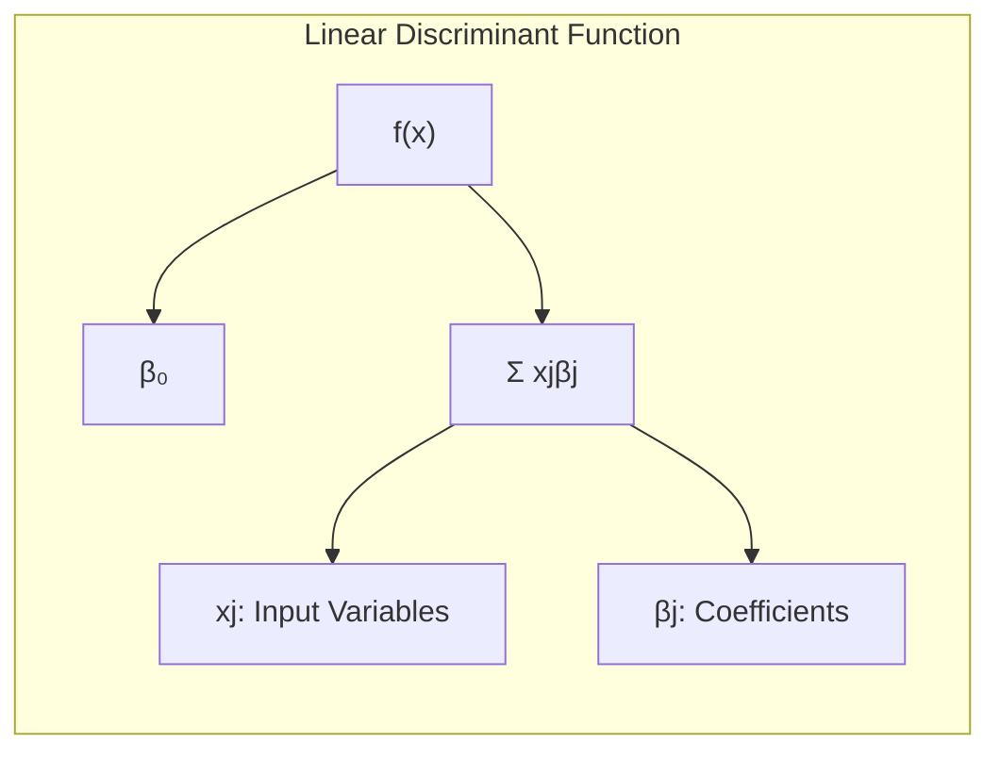
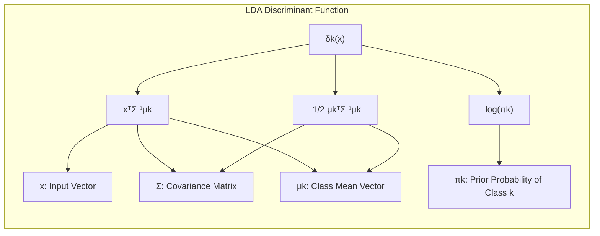
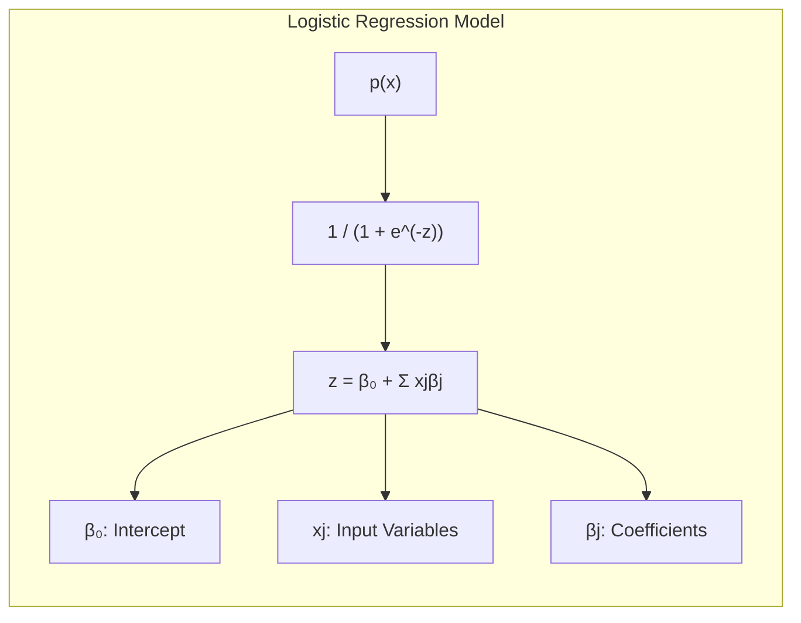
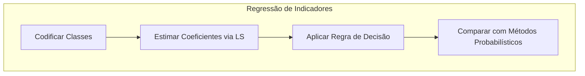
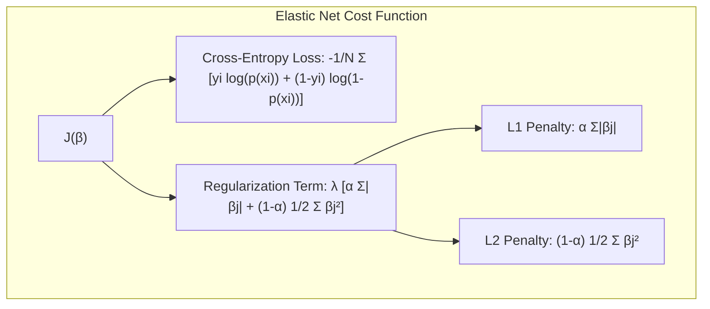
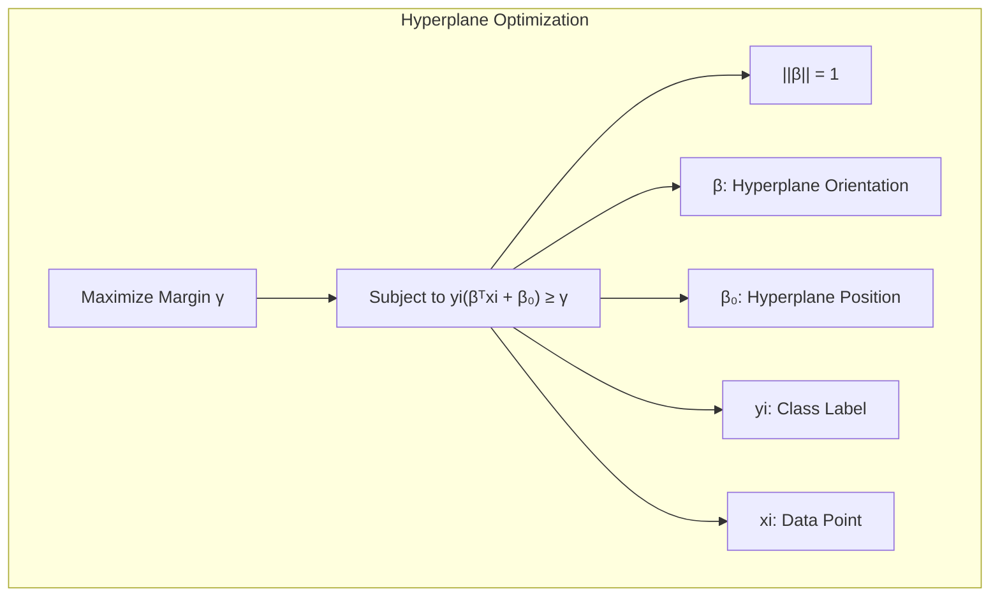
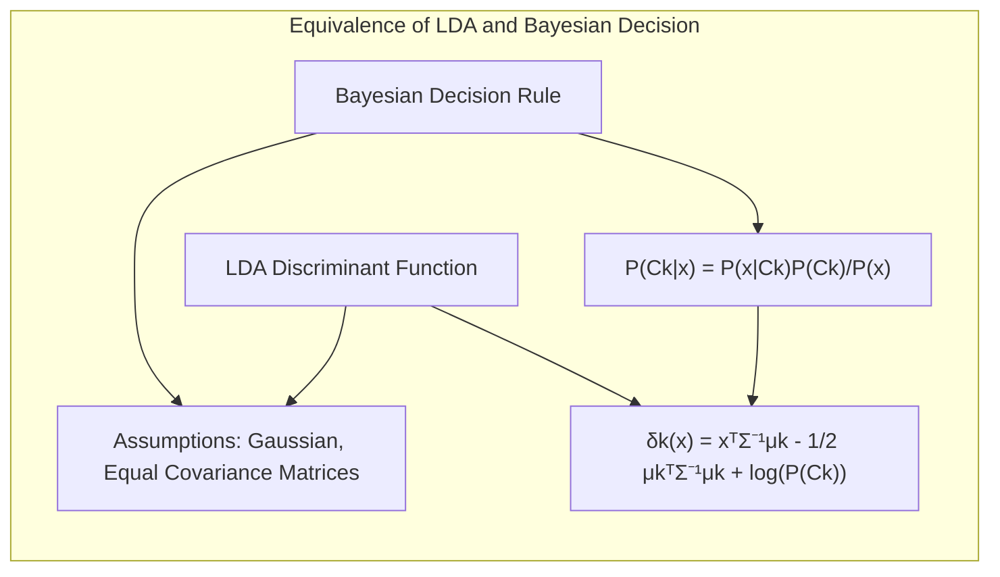

## Profiles of Ridge Coefficients vs. Effective Degrees of Freedom

<imagem: Gráfico mostrando os perfis de coeficientes de regressão ridge em função dos graus de liberdade efetivos, com os coeficientes se aproximando de zero conforme os graus de liberdade diminuem. As linhas coloridas representam diferentes variáveis preditoras, com uma linha vertical destacando um ponto de escolha de modelo.>

### Introdução

Este capítulo explora em detalhes os métodos lineares de regressão, com foco em técnicas estatísticas e de aprendizado de máquina para modelagem preditiva e análise discriminante. A regressão linear assume que a relação entre as variáveis de entrada $X_1, \ldots, X_p$ e a saída $Y$ é linear [^3.1]. Modelos lineares são amplamente utilizados devido à sua simplicidade, interpretabilidade e eficácia em várias situações, especialmente quando há um número limitado de casos de treinamento, baixo nível de sinal-ruído ou dados esparsos [^3.1]. Além disso, métodos lineares podem ser aplicados a transformações das entradas, expandindo seu escopo. Este capítulo também aprofunda a regressão linear, discutindo sua base matemática e suas limitações para então explorar métodos de regularização, como o Ridge Regression, que são cruciais para o entendimento de generalizações não-lineares. O objetivo principal é fornecer um guia avançado para profissionais de Estatística e Aprendizado de Máquina, construindo uma base sólida para abordagens mais complexas.

### Conceitos Fundamentais

**Conceito 1: O Problema de Classificação Linear**

O problema de classificação, em sua essência, busca atribuir uma categoria ou classe a um determinado conjunto de dados. Métodos lineares abordam esse problema traçando uma **fronteira de decisão linear** no espaço de características [^4.1]. Esta fronteira, geralmente expressa como um hiperplano, divide o espaço em regiões correspondentes às diferentes classes. A eficácia de métodos lineares em problemas de classificação está intimamente ligada a um delicado equilíbrio entre viés e variância. Modelos lineares, por sua própria natureza, impõem uma restrição forte à forma da fronteira de decisão, o que pode levar a um alto viés se a relação entre as variáveis não for realmente linear. Por outro lado, a simplicidade do modelo reduz o risco de overfitting, mantendo a variância baixa.

$$f(x) = \beta_0 + \sum_{j=1}^{p} x_j\beta_j$$

Nesta equação, $f(x)$ representa a função discriminante linear, $x_j$ são as variáveis de entrada, $\beta_j$ são os coeficientes que determinam a orientação e posição da fronteira e $\beta_0$ é o termo de interceptação [^3.2]. A escolha entre utilizar métodos lineares ou não-lineares dependerá da complexidade do problema e do compromisso entre viés e variância que se busca. Em alguns casos, transformações não lineares das variáveis de entrada podem ser utilizadas para modelar relações mais complexas, mantendo a simplicidade de um modelo linear [^3.1].



> 💡 **Exemplo Numérico:** Considere um problema de classificação com duas variáveis de entrada, $x_1$ e $x_2$, e duas classes. Um modelo linear pode ter a seguinte função discriminante: $f(x) = -1 + 2x_1 + 0.5x_2$.  Nesse caso, $\beta_0 = -1$, $\beta_1 = 2$ e $\beta_2 = 0.5$. A fronteira de decisão é a linha onde $f(x) = 0$, ou seja, $2x_1 + 0.5x_2 = 1$. Pontos onde $2x_1 + 0.5x_2 > 1$ seriam classificados como uma classe, e pontos onde $2x_1 + 0.5x_2 < 1$ como a outra.

**Lemma 1:** *A decomposição de funções discriminantes lineares.*

Uma função discriminante linear pode ser expressa como uma combinação linear das variáveis de entrada, cada uma ponderada por um coeficiente. Formalmente, seja $f(x)$ a função discriminante linear, temos:

$$f(x) = \beta_0 + \sum_{j=1}^p \beta_j x_j$$

onde $\beta_0$ é o termo independente e $\beta_j$ são os coeficientes associados às variáveis de entrada $x_j$. Essa representação é fundamental para a construção de modelos de classificação linear, pois cada componente da soma ponderada ($x_j\beta_j$) contribui linearmente para a função discriminante. Se considerarmos o espaço de características formado pelos vetores de entrada ($x_1, x_2, \ldots, x_p$), a função discriminante representa um hiperplano nesse espaço, onde a equação $f(x) = 0$ define a fronteira de decisão.
A demonstração segue diretamente da definição de uma função linear e da propriedade distributiva da multiplicação sobre a soma. Ou seja, a decomposição é uma reformulação da definição da função discriminante linear [^3.2]. $\blacksquare$

**Conceito 2: Linear Discriminant Analysis (LDA)**

A Linear Discriminant Analysis (LDA) é um método de classificação que busca encontrar uma combinação linear de variáveis de entrada que melhor separe as classes. A LDA assume que as classes seguem distribuições normais multivariadas, com a mesma matriz de covariância [^4.3]. O objetivo é maximizar a separação entre as médias das classes, minimizando a variância dentro de cada classe [^4.3.1]. A construção da fronteira de decisão na LDA envolve a projeção dos dados em um subespaço de menor dimensão, onde a separabilidade entre classes é otimizada [^4.3.2]. Formalmente, a função discriminante para cada classe $k$ é dada por:

$$ \delta_k(x) = x^T\Sigma^{-1}\mu_k - \frac{1}{2}\mu_k^T\Sigma^{-1}\mu_k + log(\pi_k) $$

Onde $\mu_k$ é a média da classe $k$, $\Sigma$ é a matriz de covariância comum a todas as classes e $\pi_k$ é a probabilidade a priori da classe $k$ [^4.3.3]. A decisão sobre qual classe atribuir a um novo ponto $x$ é baseada em qual função discriminante $\delta_k(x)$ tem o maior valor.


> 💡 **Exemplo Numérico:** Suponha que temos duas classes com as seguintes médias e matriz de covariância: $\mu_1 = \begin{bmatrix} 1 \\ 1 \end{bmatrix}$, $\mu_2 = \begin{bmatrix} 3 \\ 2 \end{bmatrix}$, e $\Sigma = \begin{bmatrix} 1 & 0.5 \\ 0.5 & 1 \end{bmatrix}$.  Assumindo probabilidades a priori iguais ($\pi_1 = \pi_2 = 0.5$), podemos calcular a função discriminante para cada classe. Primeiro, calculamos $\Sigma^{-1}$: $\Sigma^{-1} = \frac{1}{0.75} \begin{bmatrix} 1 & -0.5 \\ -0.5 & 1 \end{bmatrix} = \begin{bmatrix} 4/3 & -2/3 \\ -2/3 & 4/3 \end{bmatrix}$. Para um ponto $x = \begin{bmatrix} 2 \\ 1.5 \end{bmatrix}$, $\delta_1(x) \approx -2.5$ e $\delta_2(x) \approx -1.4$. Como $\delta_2(x) > \delta_1(x)$, o ponto $x$ seria classificado na classe 2.

**Corolário 1:** *Relação entre função discriminante linear e projeção em subespaços.*

A função discriminante linear da LDA projeta os dados em um subespaço de menor dimensão, onde a separação entre as classes é maximizada. Esta projeção é linear e preserva a estrutura dos dados, o que facilita a classificação. Ao projetarmos os dados no subespaço ótimo, a função discriminante $\delta_k(x)$ se torna uma função linear do espaço projetado, tornando mais clara e efetiva a separação entre as classes. Isso é particularmente relevante em problemas com muitas variáveis de entrada, onde essa redução de dimensionalidade ajuda a evitar overfitting [^4.3.2].
A demonstração segue da observação de que a função discriminante da LDA é uma forma linear da variável $x$ e das médias $\mu_k$, com a matriz de covariância $\Sigma$ influenciando a projeção. A projeção ao longo do eixo gerado por $\Sigma^{-1}\mu_k$ maximiza a separação interclasses, alinhando-se com o objetivo da LDA de otimizar a separabilidade [^4.3.3]. $\blacksquare$

**Conceito 3: Logistic Regression**

A Logistic Regression é um modelo de classificação probabilística que utiliza a função logística para estimar a probabilidade de um evento ocorrer [^4.4]. Ao contrário da LDA, a Logistic Regression não assume distribuições normais para as classes. A função logística, também conhecida como função sigmoide, mapeia qualquer valor real no intervalo (0,1), que pode ser interpretado como uma probabilidade [^4.4.1]. O modelo é formalizado por:

$$ p(x) = \frac{1}{1 + e^{-(\beta_0 + \sum_{j=1}^p x_j\beta_j)}} $$

Onde $p(x)$ é a probabilidade de que o ponto $x$ pertença a uma classe, $\beta_0$ é o termo independente e $\beta_j$ são os coeficientes associados às variáveis de entrada $x_j$. O logit, ou log-odds, é dado por:

$$ log(\frac{p(x)}{1-p(x)}) = \beta_0 + \sum_{j=1}^p x_j\beta_j $$

O processo de ajuste da Logistic Regression envolve a maximização da verossimilhança, que busca encontrar os parâmetros $\beta$ que tornam os dados observados mais prováveis [^4.4.2]. A maximização da verossimilhança, geralmente realizada por meio de métodos iterativos como gradient descent [^4.4.3], busca otimizar os parâmetros do modelo logístico. A Logistic Regression é especialmente útil em situações onde as suposições de normalidade da LDA não são satisfeitas ou quando se busca uma interpretação probabilística da classificação [^4.4.4]. Métodos de regularização podem ser adicionados à Logistic Regression para evitar overfitting, melhorando sua capacidade de generalização [^4.4.5].


> 💡 **Exemplo Numérico:** Considere um modelo de regressão logística com $\beta_0 = -2$, $\beta_1 = 1$, e $\beta_2 = 0.5$.  Para um ponto $x = \begin{bmatrix} 2 \\ 1 \end{bmatrix}$, o log-odds é $log(\frac{p(x)}{1-p(x)}) = -2 + 1*2 + 0.5*1 = 0.5$.  A probabilidade $p(x)$ é então $p(x) = \frac{1}{1 + e^{-0.5}} \approx 0.62$. Isso significa que o modelo estima que há 62% de chance de esse ponto pertencer à classe 1.

> ⚠️ **Nota Importante**: A Logistic Regression modela diretamente a probabilidade de pertencimento a uma classe e não assume normalidade dos dados, tornando-a flexível em uma variedade de situações [^4.4.1].

> ❗ **Ponto de Atenção**: Em situações de classes não-balanceadas, a Logistic Regression pode ser mais robusta do que a LDA, que tende a ser mais influenciada pela classe majoritária [^4.4.2].

> ✔️ **Destaque**: Tanto a LDA quanto a Logistic Regression utilizam fronteiras de decisão lineares, mas o ajuste dos parâmetros e a interpretação são distintos [^4.5].

### Regressão Linear e Mínimos Quadrados para Classificação

<imagem: Diagrama de fluxo mostrando o processo de regressão de indicadores para classificação, desde a codificação das classes até a comparação com métodos probabilísticos, destacando a estimativa de coeficientes via mínimos quadrados e a aplicação de regras de decisão.>



A regressão linear, normalmente associada à predição de valores contínuos, pode ser adaptada para problemas de classificação através da criação de uma **matriz de indicadores**. Nessa abordagem, cada classe é representada por uma coluna na matriz, onde o valor 1 indica a presença da amostra naquela classe e 0 caso contrário [^4.2]. O modelo de regressão linear é, então, ajustado utilizando esta matriz como variável de resposta.

Embora conceitualmente simples, o método apresenta algumas limitações [^4.2]. Uma delas é a extrapolação de valores fora do intervalo \[0, 1] para as probabilidades, que pode ocorrer se a relação entre as variáveis não for linear. Isso é especialmente problemático quando a regressão linear é usada para estimar probabilidades, já que valores fora do intervalo \[0, 1] não têm interpretação como probabilidades.
Adicionalmente, este método não considera explicitamente a covariância entre as classes, o que pode levar a resultados menos precisos em alguns casos, especialmente quando as classes são sobrepostas.

No entanto, a regressão de indicadores é uma ferramenta útil, principalmente quando o foco é a **fronteira de decisão linear**, mesmo que a estimativa de probabilidades seja inadequada. Em muitos cenários, a regressão de indicadores pode fornecer uma boa aproximação para o problema de classificação [^4.1].

> 💡 **Exemplo Numérico:** Suponha um problema de classificação com três classes. Criamos uma matriz indicadora onde cada linha corresponde a uma amostra e cada coluna a uma classe. Por exemplo, para uma amostra da classe 2, a linha seria `[0, 1, 0]`. Se temos 5 amostras, com os seguintes rótulos de classe: [1, 2, 3, 2, 1], nossa matriz indicadora Y seria:
>
> ```
> Y = [[1, 0, 0],
>      [0, 1, 0],
>      [0, 0, 1],
>      [0, 1, 0],
>      [1, 0, 0]]
> ```
>
> Usamos regressão linear para modelar Y a partir de uma matriz de características X. Os coeficientes resultantes ($\hat{\beta}$) nos dão informações sobre como cada característica está relacionada a cada classe.

**Lemma 2:** *Equivalência em projeções de decisão linear.*

Em certas condições, as projeções nos hiperplanos de decisão gerados pela regressão linear de indicadores e as fronteiras de decisão dos discriminantes lineares são equivalentes. Formalmente, se as classes podem ser separadas linearmente, existe uma relação direta entre os coeficientes da regressão linear e os coeficientes das funções discriminantes lineares. Esta equivalência surge quando a função de decisão linear da regressão de indicadores é análoga à função discriminante linear resultante de um método como a LDA [^4.2]. Ou seja, os coeficientes encontrados pela regressão linear geram hiperplanos que são equivalentes, em termos de separação entre classes, aos hiperplanos obtidos por métodos como LDA.
A prova envolve a demonstração de que a função de decisão da regressão de indicadores, após uma transformação adequada, pode ser expressa na mesma forma da função discriminante da LDA. Isso ocorre quando, por exemplo, assumimos as mesmas matrizes de covariância para as classes, embora nem sempre essa equivalência se mantenha [^4.3]. $\blacksquare$

**Corolário 2:** *Simplificação da análise do modelo.*

O Lemma 2 nos permite simplificar a análise de modelos de classificação baseados em regressão linear de indicadores. Em vez de analisar diretamente a regressão linear com matrizes indicadoras, podemos nos concentrar em métodos de classificação que já fornecem as funções discriminantes lineares explicitamente, como LDA. Este resultado implica que, sob certas condições, a regressão linear de indicadores pode ser uma maneira de encontrar funções discriminantes lineares, facilitando a análise teórica do modelo e a sua conexão com outros métodos lineares de classificação [^4.3].
A demonstração segue diretamente do Lemma 2, ao mostrar que sob certas condições de separabilidade, o hiperplano gerado pela regressão linear é equivalente ao hiperplano gerado pelos métodos discriminantes lineares [^4.3].

### Métodos de Seleção de Variáveis e Regularização em Classificação

<imagem: Mapa mental conectando conceitos de métodos de seleção de variáveis e regularização em modelos de classificação, ligando temas como LDA, Regressão Logística, hyperplanes, penalizações L1 e L2 e Elastic Net>

O problema de ter muitas variáveis em um modelo de classificação, também chamado de "maldição da dimensionalidade", pode levar a overfitting e dificuldade de interpretação. Métodos de seleção de variáveis e regularização são essenciais para mitigar esses problemas [^4.5]. A seleção de variáveis busca identificar um subconjunto ótimo de variáveis que contribuem mais para o poder preditivo do modelo [^4.5.1]. Já a regularização, adiciona um termo de penalidade à função de custo, forçando os coeficientes a terem valores menores, o que ajuda a evitar overfitting e melhorar a estabilidade do modelo [^4.4.4].

Em modelos logísticos, a regularização é frequentemente implementada através de penalizações L1 e L2. A penalização L1, também conhecida como Lasso, adiciona a soma dos valores absolutos dos coeficientes à função de custo, o que tende a produzir modelos esparsos, com muitos coeficientes iguais a zero [^4.4.4]. Isso facilita a seleção de variáveis e melhora a interpretabilidade do modelo. Já a penalização L2, também conhecida como Ridge, adiciona a soma dos quadrados dos coeficientes à função de custo, o que tende a encolher os coeficientes, mas raramente os zera [^4.5].

Uma combinação dessas duas penalidades, conhecida como Elastic Net, pode ser utilizada para aproveitar as vantagens de ambos os métodos, permitindo a seleção de variáveis e a redução da magnitude dos coeficientes simultaneamente [^4.5].

$$ J(\beta) = - \frac{1}{N} \sum_{i=1}^N [y_i log(p(x_i)) + (1-y_i)log(1-p(x_i))] + \lambda \left[ \alpha \sum_{j=1}^p |\beta_j| + (1-\alpha) \frac{1}{2}\sum_{j=1}^p \beta_j^2 \right]$$

Nesta equação, a função de custo consiste em duas partes: a função de verossimilhança da regressão logística e os termos de regularização L1 e L2. O parâmetro $\lambda$ controla a intensidade da regularização, e $\alpha$ controla o balanço entre as penalidades L1 e L2 [^4.5.1].


> 💡 **Exemplo Numérico:** Suponha que ajustamos um modelo de regressão logística com 5 variáveis preditoras. Sem regularização, os coeficientes resultantes são: $\beta = [1.2, -0.8, 2.5, -0.5, 0.9]$. Com regularização L1 ($\lambda = 0.5, \alpha=1$), alguns coeficientes seriam zerados, resultando em:  $\beta_{L1} = [0.7, 0, 1.8, 0, 0.2]$. Já com regularização L2 ($\lambda = 0.5, \alpha=0$), os coeficientes são encolhidos, mas mantidos:  $\beta_{L2} = [0.8, -0.5, 1.6, -0.3, 0.6]$. Com Elastic Net ($\lambda = 0.5, \alpha=0.5$), obteríamos um resultado intermediário, combinando esparsidade com encolhimento.

**Lemma 3:** *Efeito da penalização L1 na esparsidade dos coeficientes.*

A penalização L1 em modelos de classificação logística leva a coeficientes esparsos. Ou seja, ao adicionar o termo $\lambda \sum_{j=1}^p |\beta_j|$ à função de custo, o método minimiza a norma L1 dos coeficientes, induzindo alguns coeficientes a serem exatamente zero. A prova disso pode ser observada nas condições de otimalidade do problema, que mostra como o termo $\sum_{j=1}^p |\beta_j|$ incentiva coeficientes iguais a zero, permitindo a seleção de variáveis [^4.4.4].

**Prova do Lemma 3:**
O problema de otimização com penalização L1 é dado por:
$$ \hat{\beta} = \text{argmin}_{\beta} \{ L(\beta) + \lambda ||\beta||_1 \} $$
onde $L(\beta)$ é a função de perda (negativo do log-verossimilhança) e $||\beta||_1 = \sum_j |\beta_j|$. As condições de otimalidade para um problema convexo como este mostram que os coeficientes $\beta_j$ são influenciados pelo termo de penalidade. Especificamente, os coeficientes que tendem para zero são aqueles para os quais a derivada parcial da função de perda em relação a eles é menor em magnitude que o parâmetro de regularização $\lambda$. Se a derivada parcial da função de perda para um determinado coeficiente $\beta_j$ for menor que $\lambda$, o coeficiente será zerado [^4.4.3]. Formalmente, para a condição de otimalidade da norma L1, temos:
$$\nabla L(\beta)_j + \lambda \cdot \text{sign}(\beta_j) = 0, \text{ se } \beta_j \neq 0$$
e
$$|\nabla L(\beta)_j| \leq \lambda, \text{ se } \beta_j = 0$$

onde $\nabla L(\beta)_j$ denota a derivada parcial da função de perda $L(\beta)$ em relação a $\beta_j$. Isso significa que, se a magnitude da derivada parcial for menor ou igual a $\lambda$, o coeficiente $\beta_j$ é igual a zero, gerando um modelo esparso [^4.4.3]. $\blacksquare$

**Corolário 3:** *Interpretabilidade de modelos com penalização L1.*

A penalização L1 não só ajuda na seleção de variáveis, mas também aumenta a interpretabilidade dos modelos classificatórios. Ao gerar modelos esparsos, o método facilita a identificação das variáveis mais relevantes para a classificação, tornando o modelo mais simples de ser compreendido [^4.4.5].
A demonstração é uma consequência do Lemma 3, já que o zeramento de alguns coeficientes leva à redução do número de variáveis no modelo, facilitando a interpretação dos resultados e a identificação das variáveis com maior poder preditivo [^4.4.5].

> ⚠️ **Ponto Crucial**: O uso combinado de regularizações L1 e L2 no Elastic Net possibilita a obtenção de modelos mais estáveis e esparsos, combinando a seleção de variáveis do Lasso com o encolhimento dos coeficientes da Ridge [^4.5].

### Separating Hyperplanes e Perceptrons

O conceito de **hiperplanos separadores** surge como uma abordagem geométrica para a classificação. Em vez de trabalhar com probabilidades ou funções discriminantes explícitas, esta abordagem busca um hiperplano que melhor separe as classes no espaço de características. A ideia principal é encontrar o hiperplano que maximize a margem de separação, definida como a distância mínima entre o hiperplano e os pontos de dados mais próximos de cada classe [^4.5.2]. Formalmente, o problema de otimização para encontrar esse hiperplano é definido como:

$$ \underset{\beta, \beta_0}{\text{maximizar}} \quad \gamma $$
$$ \text{sujeito a} \quad y_i(\beta^T x_i + \beta_0) \geq \gamma, \forall i$$
$$ ||\beta|| = 1 $$

Onde $\gamma$ representa a margem, $\beta$ define a orientação do hiperplano, $\beta_0$ define a posição do hiperplano e $y_i$ é o rótulo da classe para o ponto de dados $x_i$ [^4.5.2]. A maximização da margem geralmente leva a uma solução mais robusta e com menor risco de overfitting.


> 💡 **Exemplo Numérico**: Imagine duas classes de pontos em um plano 2D. Podemos visualizá-las em um gráfico. O objetivo do hiperplano separador seria encontrar uma linha (hiperplano em 2D) que maximize a distância entre essa linha e os pontos mais próximos de cada classe.

Uma abordagem para encontrar esses hiperplanos é através do **Perceptron de Rosenblatt**, um algoritmo iterativo que busca ajustar os parâmetros do hiperplano de forma a classificar corretamente os dados de treinamento [^4.5.1]. O algoritmo Perceptron ajusta os pesos iterativamente, corrigindo os erros de classificação até encontrar um hiperplano que separe as classes, caso elas sejam linearmente separáveis. A convergência do Perceptron é garantida sob condições específicas de separabilidade linear [^4.5.1].

> 💡 **Exemplo Numérico**: Imagine o perceptron começando com um hiperplano (linha) aleatório que classifica algumas amostras corretamente e outras incorretamente. O algoritmo Perceptron ajusta iterativamente os coeficientes $\beta$ e $\beta_0$ do hiperplano. Para cada amostra classificada incorretamente, os coeficientes são atualizados de acordo com a fórmula: $\beta \leftarrow \beta + \eta y_i x_i$ e $\beta_0 \leftarrow \beta_0 + \eta y_i$, onde $\eta$ é a taxa de aprendizado e $y_i$ o rótulo da classe da amostra $x_i$. Este processo iterativo continua até que todas as amostras sejam classificadas corretamente.

### Pergunta Teórica Avançada: Quais as diferenças fundamentais entre a formulação de LDA e a Regra de Decisão Bayesiana considerando distribuições Gaussianas com covariâncias iguais?

**Resposta:**

A Linear Discriminant Analysis (LDA) e a Regra de Decisão Bayesiana, quando aplicadas a distribuições Gaussianas com covariâncias iguais, compartilham uma base teórica comum, mas divergem em como são formuladas e utilizadas. A LDA é um método discriminativo, que busca encontrar a fronteira de decisão entre as classes diretamente, enquanto a Regra de Decisão Bayesiana é um método generativo, que estima as distribuições de probabilidade para cada classe e depois as usa para tomar decisões [^4.3].

Ambos os métodos assumem que os dados seguem uma distribuição normal multivariada dentro de cada classe, com a mesma matriz de covariância $\Sigma$, o que simplifica a derivação da fronteira de decisão. Sob essas suposições, a Regra de Decisão Bayesiana classifica uma amostra $x$ na classe $k$ que maximiza a probabilidade a posteriori $P(C_k|x)$. Usando a regra de Bayes, temos:

$$ P(C_k|x) = \frac{P(x|C_k)P(C_k)}{P(x)} $$

onde $P(x|C_k)$ é a densidade da classe $k$ (uma Gaussiana), $P(C_k)$ é a probabilidade *a priori* da classe $k$, e $P(x)$ é a probabilidade marginal de $x$ (um fator de normalização). Quando as covariâncias são iguais para todas as classes, e os dados são Gaussianos, a fronteira de decisão resultante entre duas classes $C_k$ e $C_l$ é linear e pode ser expressa como:

$$ \delta_k(x) = x^T \Sigma^{-1}\mu_k - \frac{1}{2}\mu_k^T\Sigma^{-1}\mu_k + log(P(C_k)) $$

que é a função discriminante da LDA, e define uma fronteira linear [^4.3.3].

**Lemma 4:** *Equivalência Formal da LDA e Decisão Bayesiana sob hipóteses Gaussianas.*

Quando as classes seguem distribuições Gaussianas multivariadas com a mesma matriz de covariância, a regra de decisão Bayesiana e a LDA fornecem resultados equivalentes. A prova da equivalência reside na derivação da função discriminante. Na LDA, a fronteira de decisão é obtida pela análise discriminante linear, onde o objetivo é maximizar a separação entre classes. A derivação da regra de decisão bayesiana para classes gaussianas com a mesma matriz de covariância resulta exatamente na mesma função discriminante da LDA [^4.3], provando formalmente a equivalência sob essas condições [^4.3.3]. $\blacksquare$

**Corolário 4:** *Relaxando a hipótese de covariâncias iguais: fronteiras quadráticas.*

Ao relaxar a hipótese de covariâncias iguais, ou seja, permitindo que cada classe tenha uma matriz de covariância diferente ( $\Sigma_k$), a fronteira de decisão resultante não é mais linear, mas quadrática. Isso dá origem à Quadratic Discriminant Analysis (QDA) [^4.3.1]. A fronteira quadrática resultante em QDA representa uma maior flexibilidade para modelar as diferenças nas distribuições das classes. Sob esta condição, a função discriminante se torna:
$$ \delta_k(x) = -\frac{1}{2}log|\Sigma_k| - \frac{1}{2}(x-\mu_k)^T\Sigma_k^{-1}(x-\mu_k) + log(\pi_k) $$
onde $\Sigma_k$ é a matriz de covariância da classe $k$, o que gera uma fronteira de decisão quadrática.
A demonstração segue da derivada da função de decisão bayesiana, que ao considerar covariâncias distintas entre classes, resulta numa expressão quadrática na variável x, e não mais linear.

> ⚠️ **Ponto Crucial**: A decisão de usar covariâncias iguais (LDA) ou diferentes (QDA) depende das características dos dados. LDA é preferível quando as amostras são escassas, enquanto QDA pode se adequar melhor a problemas com maior flexibilidade [^4.3.1].

As perguntas devem ser altamente relevantes, **avaliar a compreensão profunda de conceitos teóricos-chave**, podem envolver derivações matemáticas e provas, e focar em análises teóricas.

### Conclusão

Este capítulo abordou em profundidade os fundamentos da regressão linear para classificação, explorando seus conceitos teóricos, limitações e extensões. A base matemática de modelos lineares, a análise discriminante linear (LDA), a regressão logística, a regressão de indicadores, métodos de seleção de variáveis, regularização, hiperplanos separadores e perceptrons foram detalhadamente discutidos. Através de lemmas, corolários e exemplos práticos, o capítulo forneceu uma compreensão aprofundada dos métodos lineares de classificação. Métodos de regularização, como o Ridge e o Lasso, foram introduzidos para mitigar os problemas de overfitting e aumentar a estabilidade dos modelos lineares, enquanto métodos de seleção de variáveis foram explorados para melhorar a interpretabilidade e o desempenho. A relação entre modelos lineares e seus equivalentes bayesianos foi também abordada, aprofundando a compreensão teórica.

Em resumo, este capítulo oferece uma base sólida para entender e aplicar métodos lineares de classificação, além de apresentar extensões e nuances que permitem a construção de modelos preditivos robustos e eficazes.
<!-- END DOCUMENT -->

### Footnotes

[^3.1]: "A linear regression model assumes that the regression function E(Y|X) is linear in the inputs X1,..., Xp. Linear models were largely developed in the precomputer age of statistics, but even in today's computer era there are still good reasons to study and use them. They are simple and often provide an adequate and interpretable description of how the inputs affect the output." *(Trecho de "Linear Methods for Regression")*
[^3.2]: "As introduced in Chapter 2, we have an input vector XT = (X1, X2, ..., Xp), and want to predict a real-valued output Y. The linear regression model has the form f(x) = βο + ΣΧβ." *(Trecho de "Linear Methods for Regression")*
[^4.1]: "In this chapter we describe linear methods for regression, while