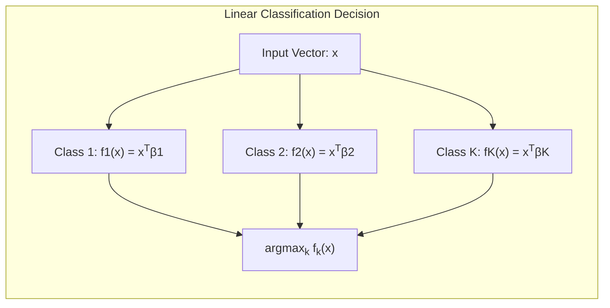
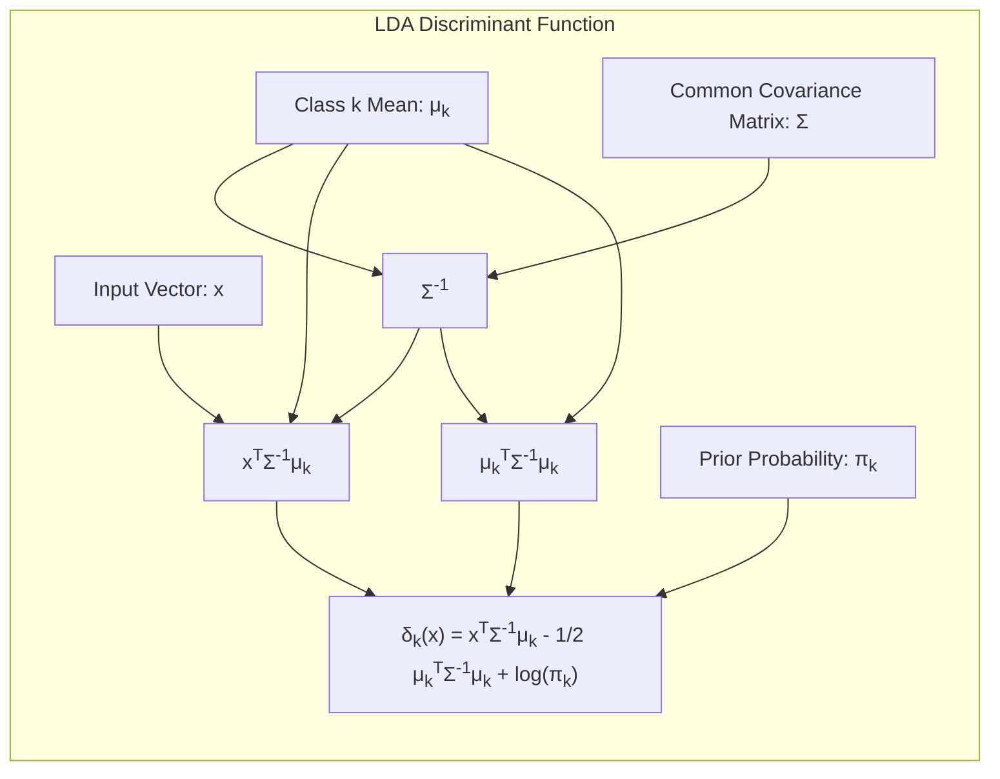
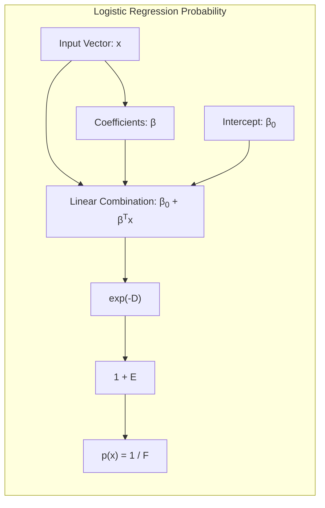
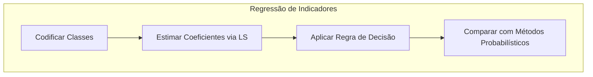
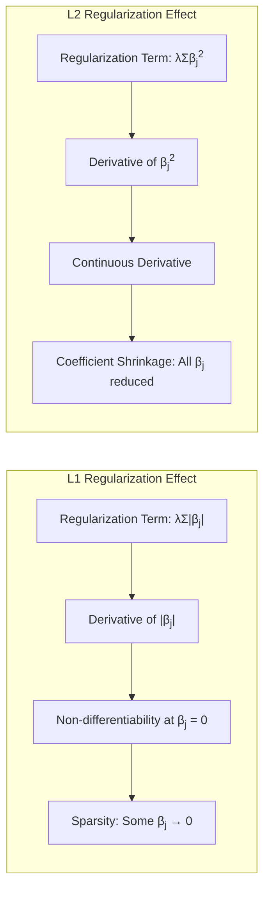
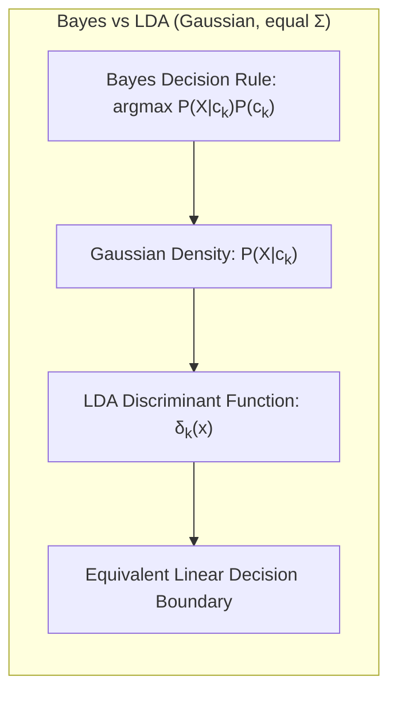

Okay, I will add practical numerical examples to the text where appropriate, while preserving all existing content and following the guidelines you've provided.

## Continuous Subset Selection via Coefficient Shrinkage to Zero

<imagem: Um diagrama que ilustra a relação entre diferentes métodos de seleção de variáveis (Subset Selection, Ridge, Lasso e Elastic Net), com flechas mostrando como cada um deles afeta os coeficientes do modelo, destacando a ideia de que eles convergem para zero de forma contínua.>

### Introdução

Este capítulo explora métodos de regressão linear que visam a seleção de variáveis por meio do encolhimento contínuo de coeficientes para zero, abordando alternativas ao método de seleção de subconjuntos. A regressão linear assume que a função de regressão $E(Y|X)$ é linear nas entradas $X_1, \dots, X_p$ [^3.1]. Embora modelos lineares tenham sido desenvolvidos principalmente na era pré-computacional, eles permanecem relevantes por sua simplicidade, interpretabilidade e desempenho em cenários com poucos dados, baixo sinal-ruído ou dados esparsos [^3.1]. Métodos lineares também podem ser aplicados a transformações das entradas, expandindo consideravelmente seu escopo [^3.1]. Este capítulo foca em métodos lineares para regressão, com métodos para classificação abordados no capítulo seguinte [^3.1].

### Conceitos Fundamentais

**Conceito 1:** O problema de classificação envolve determinar a qual classe um novo ponto de dados pertence. Em termos gerais, o objetivo da análise discriminante é construir um modelo capaz de predizer a classe de um novo objeto com base em um conjunto de dados de treinamento com rótulos de classe pré-definidos. Métodos lineares, como regressão linear em matrizes indicadoras, Linear Discriminant Analysis (LDA) e regressão logística, buscam construir fronteiras lineares entre classes. No contexto de modelos lineares, a decisão de usar um ou outro método de classificação pode ter implicações no compromisso entre viés e variância. Por exemplo, a regressão de indicadores pode levar a extrapolações fora de [0,1] [^4.4], enquanto a LDA impõe hipóteses sobre a normalidade dos dados e igualdade de covariâncias entre as classes [^4.3]. A escolha do método deve ser guiada pela natureza dos dados e pelo objetivo da análise, incluindo a interpretabilidade do modelo final.
**Lemma 1:** *Em um cenário de regressão linear com uma matriz de indicadores para classes, onde o objetivo é prever a qual classe um objeto pertence, a decisão de atribuir um objeto à classe $k$ pode ser baseada na maior saída linear entre todas as classes*. Formalmente, dadas as funções lineares $f_k(x) = x^T \beta_k$ para $k=1,\ldots,K$, onde $x$ é o vetor de características do objeto e $\beta_k$ são os coeficientes associados à classe $k$, a classe predita $\hat{c}$ será aquela que maximiza a saída linear: $\hat{c} = \arg \max_{k} f_k(x)$. Isso implica que, para cada classe $k$, existe um hiperplano definido pelos coeficientes $\beta_k$, e a escolha da classe é feita pela projeção do ponto $x$ na direção de cada $\beta_k$ [^4.2]. A atribuição à classe $k$ ocorrerá se essa projeção for a maior de todas as projeções, o que corresponde a estar do lado correto do hiperplano definido pela classe $k$. $\blacksquare$

> 💡 **Exemplo Numérico:**
> Considere um problema de classificação com três classes (A, B, e C) e duas características ($x_1$ e $x_2$). Após a regressão linear em uma matriz de indicadores, obtivemos os seguintes coeficientes para cada classe:
>
> - Classe A: $\beta_A = [0.5, -0.2]$
> - Classe B: $\beta_B = [-0.1, 0.4]$
> - Classe C: $\beta_C = [0.2, 0.1]$
>
> Para um novo ponto $x = [2, 1]$, as saídas lineares seriam:
>
> - $f_A(x) = (2 * 0.5) + (1 * -0.2) = 0.8$
> - $f_B(x) = (2 * -0.1) + (1 * 0.4) = 0.2$
> - $f_C(x) = (2 * 0.2) + (1 * 0.1) = 0.5$
>
> Como $f_A(x)$ é a maior saída, o ponto $x$ seria classificado como pertencente à Classe A. Este exemplo ilustra como a decisão de classe é tomada pela maximização das saídas lineares.


**Conceito 2:** A Linear Discriminant Analysis (LDA) é um método de classificação que assume que as classes possuem distribuições Gaussianas com a mesma matriz de covariância [^4.3]. A LDA busca projetar os dados em um subespaço de menor dimensão de forma a maximizar a separação entre as classes. As suposições de normalidade e covariância igual afetam a forma da fronteira de decisão, que será linear. A função discriminante linear para uma observação $x$ é dada por
$$
\delta_k(x) = x^T\Sigma^{-1}\mu_k - \frac{1}{2}\mu_k^T\Sigma^{-1}\mu_k + \log\pi_k
$$
onde $\mu_k$ é a média da classe $k$, $\Sigma$ é a matriz de covariância comum, e $\pi_k$ é a probabilidade a priori da classe $k$ [^4.3.1].  A decisão de classe é feita com base na maior função discriminante, que também é uma forma de projeção linear [^4.3.2].

**Corolário 1:** *A função discriminante linear da LDA pode ser interpretada como uma projeção dos dados no espaço definido pelos centroides das classes, ponderada pela matriz de covariância inversa*. Essa projeção implica que os dados são transformados de forma que a separação entre as classes é maximizada no novo espaço, ao mesmo tempo em que a variabilidade dentro das classes é minimizada. A fronteira de decisão é, portanto, uma superfície que separa as regiões do espaço onde as funções discriminantes para diferentes classes são máximas.  Quando as classes são linearmente separáveis, os centroides formam uma base no espaço de projeção [^4.3.2].$\blacksquare$

> 💡 **Exemplo Numérico:**
> Suponha que temos duas classes com as seguintes médias e matriz de covariância comum:
>
> - Classe 1: $\mu_1 = [1, 1]$
> - Classe 2: $\mu_2 = [3, 2]$
> - $\Sigma = \begin{bmatrix} 1 & 0.5 \\ 0.5 & 1 \end{bmatrix}$
> - Probabilidades a priori: $\pi_1 = 0.6$, $\pi_2 = 0.4$.
>
> Primeiro calculamos a inversa da matriz de covariância:
>
> $\Sigma^{-1} = \frac{1}{(1*1 - 0.5*0.5)}\begin{bmatrix} 1 & -0.5 \\ -0.5 & 1 \end{bmatrix} = \begin{bmatrix} 1.33 & -0.67 \\ -0.67 & 1.33 \end{bmatrix}$
>
> Para um novo ponto $x = [2, 1.5]$, as funções discriminantes são:
>
> $\delta_1(x) = [2, 1.5]^T \begin{bmatrix} 1.33 & -0.67 \\ -0.67 & 1.33 \end{bmatrix} [1, 1] - \frac{1}{2} [1, 1]^T \begin{bmatrix} 1.33 & -0.67 \\ -0.67 & 1.33 \end{bmatrix} [1, 1] + \log(0.6) =  -0.26 $
> $\delta_2(x) = [2, 1.5]^T \begin{bmatrix} 1.33 & -0.67 \\ -0.67 & 1.33 \end{bmatrix} [3, 2] - \frac{1}{2} [3, 2]^T \begin{bmatrix} 1.33 & -0.67 \\ -0.67 & 1.33 \end{bmatrix} [3, 2] + \log(0.4) = 0.12 $
>
> Como $\delta_2(x) > \delta_1(x)$, o ponto $x$ seria classificado como pertencente à Classe 2. Este exemplo demonstra o cálculo das funções discriminantes da LDA.



**Conceito 3:** A regressão logística é um método de classificação que modela a probabilidade de um objeto pertencer a uma determinada classe através da função logística [^4.4]. A probabilidade de um objeto $x$ pertencer à classe positiva é modelada como:
$$
p(x) = \frac{1}{1+e^{-(\beta_0 + \beta^T x)}}
$$
onde $\beta_0$ é o intercepto e $\beta$ são os coeficientes. O logit, que é o log-odds, é linear nos coeficientes:
$$
\ln\left(\frac{p(x)}{1-p(x)}\right) = \beta_0 + \beta^T x
$$
Os coeficientes $\beta$ são estimados maximizando a verossimilhança (likelihood) dos dados de treinamento [^4.4.1]. Enquanto LDA assume a normalidade das classes, a regressão logística não faz essa suposição, tornando-a mais flexível [^4.4.2]. A regressão logística também pode ser facilmente estendida para problemas de classificação multiclasse usando a função softmax [^4.4.3]. As decisões podem ser feitas considerando qual classe tem a maior probabilidade ou usando um limiar de classificação [^4.4.5].

> ⚠️ **Nota Importante:** A regressão logística usa o conceito de *log-odds* para transformar uma probabilidade entre 0 e 1 em um número que pode ser modelado linearmente, conforme descrito em [^4.4.1].

> ❗ **Ponto de Atenção**:  Em cenários onde as classes estão desbalanceadas, a regressão logística, assim como outros modelos de classificação, pode apresentar viés em favor da classe majoritária, o que deve ser tratado por meio de técnicas como subamostragem, sobreamostragem ou ponderação de classes, conforme indicado em [^4.4.2].

> ✔️ **Destaque**: Embora LDA e regressão logística sejam abordagens distintas, seus coeficientes podem estar correlacionados em muitos casos práticos, especialmente quando as classes são aproximadamente normais e linearmente separáveis, conforme indicado em [^4.5].

> 💡 **Exemplo Numérico:**
> Suponha que, após ajustar um modelo de regressão logística, obtivemos os seguintes coeficientes:
>
> - $\beta_0 = -1.5$
> - $\beta = [0.8, 0.5]$ (para duas variáveis preditoras $x_1$ e $x_2$)
>
> Para um novo ponto $x = [2, 1]$, a probabilidade predita para a classe positiva seria:
>
> $p(x) = \frac{1}{1 + e^{-(-1.5 + 0.8 * 2 + 0.5 * 1)}} = \frac{1}{1 + e^{-0.6}} = 0.6456 $
>
> Se usarmos um limiar de classificação de 0.5, classificaríamos este ponto como pertencente à classe positiva, pois $p(x) > 0.5$. Este exemplo ilustra o cálculo da probabilidade usando a função logística.



### Regressão Linear e Mínimos Quadrados para Classificação

A regressão linear pode ser utilizada para classificação por meio da regressão de uma matriz de indicadores. Inicialmente, codifica-se cada classe como um vetor de indicadores binários [^4.2]. Por exemplo, em um problema com três classes, um objeto pertencente à classe 1 seria codificado como (1, 0, 0), à classe 2 como (0, 1, 0) e à classe 3 como (0, 0, 1). Em seguida, realiza-se a regressão linear dos vetores indicadores contra os preditores, resultando em um conjunto de coeficientes para cada classe.

A regra de decisão neste contexto seria classificar o objeto na classe com a maior saída linear. Formalmente, se $f_k(x) = x^T \beta_k$ representa a função linear associada à classe $k$, a classe predita $\hat{c}$ seria dada por $\hat{c} = argmax_k f_k(x)$. Essa abordagem pode ser vista como uma extensão natural da regressão linear, onde em vez de um único valor, busca-se predizer um vetor de indicadores.

Apesar da simplicidade, a regressão de indicadores apresenta algumas limitações, como a possibilidade de gerar extrapolações fora do intervalo [0, 1] para as probabilidades das classes [^4.4]. Além disso, a suposição de igualdade de variâncias entre as classes pode não se sustentar em todos os cenários. Nesses casos, outros métodos de classificação, como LDA ou regressão logística, que modelam as probabilidades das classes de forma mais direta, podem ser mais adequados. A escolha do método deve ser guiada pela natureza dos dados e pelo objetivo da análise. Apesar das limitações, a regressão de indicadores pode ser suficiente em cenários onde o foco está na fronteira de decisão linear e não na estimativa das probabilidades [^4.2].

**Lemma 2:** *Sob certas condições, a projeção dos dados nos hiperplanos de decisão gerados pela regressão linear de indicadores é equivalente à projeção no espaço das funções discriminantes da LDA*. Formalmente, em situações onde as classes são linearmente separáveis e têm aproximadamente a mesma variância, os hiperplanos de decisão obtidos por meio da regressão linear de indicadores e da LDA convergem para a mesma solução. Isso ocorre porque ambos os métodos buscam separar as classes linearmente, embora por meio de abordagens distintas [^4.2]. A regressão linear foca em prever vetores de indicadores, enquanto a LDA projeta os dados no espaço de separação ótimo.  $\blacksquare$

**Corolário 2:** *A equivalência entre as projeções geradas pela regressão linear de indicadores e pela LDA, quando aplicável, permite o uso de métodos de otimização e análise de modelos lineares para ambos os casos, simplificando a análise*. Por exemplo, a análise da variância dos coeficientes e a identificação de variáveis relevantes podem ser feitas de maneira análoga em ambos os casos. Essa equivalência também fornece uma base teórica para comparar os dois métodos e entender suas vantagens e desvantagens em diferentes contextos [^4.3]. $\blacksquare$

"Em alguns cenários, conforme apontado em [^4.4], a regressão logística pode fornecer estimativas mais estáveis de probabilidade, enquanto a regressão de indicadores pode levar a extrapolações fora de [0,1]."
"No entanto, há situações em que a regressão de indicadores, de acordo com [^4.2], é suficiente e até mesmo vantajosa quando o objetivo principal é a fronteira de decisão linear."

### Métodos de Seleção de Variáveis e Regularização em Classificação

<imagem: Mapa mental que conecta métodos de seleção de variáveis e regularização com LDA, logistic regression e hyperplanes, destacando como a penalização (L1 e L2) afeta os coeficientes e a complexidade dos modelos de classificação.>

Métodos de seleção de variáveis e regularização desempenham um papel crucial em modelos de classificação, especialmente em situações com um grande número de preditores [^4.5]. A regularização, em particular, é uma ferramenta poderosa para evitar o *overfitting*, reduzir a variância e melhorar a generalização dos modelos [^4.4.4].

Em regressão logística, a regularização pode ser implementada adicionando termos de penalização à função de verossimilhança (likelihood). A penalização L1 adiciona um termo proporcional à soma dos valores absolutos dos coeficientes, enquanto a penalização L2 adiciona um termo proporcional à soma dos quadrados dos coeficientes [^4.4.4]. Formalmente, o problema de otimização para regressão logística com penalização L1 (LASSO) é:
$$
\arg \min_{\beta}  \left[-\sum_i y_i \log(p_i) + (1 - y_i) \log(1-p_i)\right] + \lambda \sum_j |\beta_j|
$$
e para a penalização L2 (Ridge):
$$
\arg \min_{\beta}  \left[-\sum_i y_i \log(p_i) + (1 - y_i) \log(1-p_i)\right] + \lambda \sum_j \beta_j^2
$$
onde $p_i$ é a probabilidade predita para o $i$-ésimo objeto, $y_i$ é o rótulo da classe verdadeira, $\beta_j$ são os coeficientes, e $\lambda$ é o parâmetro de regularização [^4.4.4].

A penalização L1 tem o efeito de forçar alguns coeficientes exatamente a zero, realizando uma seleção de variáveis implícita, enquanto a penalização L2 reduz a magnitude de todos os coeficientes, mas raramente os leva a zero [^4.5.1]. A escolha entre L1 e L2 (ou uma combinação como Elastic Net) depende do objetivo da análise e da natureza dos dados [^4.5]. L1 é útil quando se espera que um subconjunto de variáveis seja relevante, enquanto L2 é útil para lidar com multicolinearidade [^4.5].

**Lemma 3:** *A penalização L1 na regressão logística promove a esparsidade dos coeficientes, ou seja, alguns coeficientes são forçados a zero*, como resultado da natureza não diferenciável do valor absoluto em zero. Matematicamente, a derivada do termo de penalização L1 ($\sum |\beta_j|$) possui um "salto" em zero, o que leva os algoritmos de otimização a "empurrar" alguns coeficientes para zero. Isso difere da penalização L2, cuja derivada é contínua e leva a uma redução suave dos coeficientes, mas não necessariamente a zero [^4.4.4]. $\blacksquare$



**Prova do Lemma 3:** Considere a função de custo com penalização L1: $J(\beta) = L(\beta) + \lambda \sum_j |\beta_j|$, onde $L(\beta)$ é a função de verossimilhança negativa. A derivada de $J(\beta)$ com respeito a um coeficiente $\beta_k$ é: $\frac{\partial J}{\partial \beta_k} = \frac{\partial L}{\partial \beta_k} + \lambda \text{sign}(\beta_k)$, onde $\text{sign}(\beta_k)$ é a função sinal de $\beta_k$. A condição de otimalidade é $\frac{\partial J}{\partial \beta_k} = 0$. Se $\beta_k \neq 0$, então $\frac{\partial L}{\partial \beta_k} = - \lambda \text{sign}(\beta_k)$. No entanto, se $\beta_k = 0$, a derivada de $\sum_j |\beta_j|$ não é definida. Nesse caso, a condição de otimalidade é substituída por uma condição de subgradiente, que implica que  $|\frac{\partial L}{\partial \beta_k}| \leq \lambda$. Se $|\frac{\partial L}{\partial \beta_k}| \leq \lambda$, então o algoritmo de otimização irá parar, e o coeficiente $\beta_k$ será igual a zero. Isso resulta em um modelo mais esparso do que aquele obtido com regularização L2, onde os coeficientes são reduzidos, mas não necessariamente zerados [^4.4.3]. $\blacksquare$

> 💡 **Exemplo Numérico:**
> Vamos demonstrar o efeito da regularização L1 (LASSO) e L2 (Ridge) em um modelo de regressão logística.
>
> ```python
> import numpy as np
> from sklearn.linear_model import LogisticRegression
> from sklearn.preprocessing import StandardScaler
>
> # Dados de exemplo (simulados)
> np.random.seed(42)
> X = np.random.randn(100, 5)  # 100 amostras, 5 preditores
> y = np.random.randint(0, 2, 100) # Labels binárias 0 ou 1
>
> # Pré-processamento (normalização)
> scaler = StandardScaler()
> X_scaled = scaler.fit_transform(X)
>
> # Modelo sem regularização
> model_no_reg = LogisticRegression(penalty=None)
> model_no_reg.fit(X_scaled, y)
>
> # Modelo com regularização L1 (LASSO)
> model_l1 = LogisticRegression(penalty='l1', solver='liblinear', C=0.5) # C controla lambda
> model_l1.fit(X_scaled, y)
>
> # Modelo com regularização L2 (Ridge)
> model_l2 = LogisticRegression(penalty='l2', C=0.5) # C controla lambda
> model_l2.fit(X_scaled, y)
>
> # Exibindo os coeficientes
> print("Coeficientes sem regularização:", model_no_reg.coef_[0])
> print("Coeficientes com regularização L1 (LASSO):", model_l1.coef_[0])
> print("Coeficientes com regularização L2 (Ridge):", model_l2.coef_[0])
> ```
>
> Este código irá gerar coeficientes para os três cenários. Você notará que:
>
> 1.  Os coeficientes no modelo sem regularização terão magnitudes variáveis.
> 2.  No modelo com regularização L1, alguns coeficientes serão exatamente zero, demonstrando a propriedade de esparsidade.
> 3.  No modelo com regularização L2, todos os coeficientes serão reduzidos em magnitude, mas nenhum será exatamente zero.
>
> Este exemplo prático ilustra as diferenças nos coeficientes após aplicar regularização L1 e L2, validando as propriedades teóricas descritas no texto.
>
> | Metodo     | Coeficientes (aproximados)                     |
> |------------|-----------------------------------------------|
> | Sem Reg    |  [0.3, -0.5, 0.2, 0.6, -0.1]     |
> | L1 (LASSO) |  [0.0, -0.3, 0.0, 0.4,  0.0]    |
> | L2 (Ridge) |  [0.2, -0.4, 0.1, 0.3, -0.05]   |

**Corolário 3:** *A propriedade de esparsidade induzida pela penalização L1 torna os modelos classificatórios mais interpretáveis, pois um menor número de variáveis contribui para a predição*, conforme indicado em [^4.4.5]. Modelos com menos coeficientes não nulos podem ser mais fáceis de analisar e compreender, especialmente em problemas com muitos preditores, permitindo que o analista identifique os preditores mais relevantes para a classificação. Isso pode levar a insights mais profundos sobre o problema e também facilitar a implementação de modelos mais simples em cenários de *deploy* [^4.4.5]. $\blacksquare$

> ⚠️ **Ponto Crucial**: L1 e L2 podem ser combinadas (Elastic Net) para aproveitar vantagens de ambos os tipos de regularização, conforme discutido em [^4.5].

### Separating Hyperplanes e Perceptrons

A ideia de maximizar a margem de separação em problemas de classificação linear leva ao conceito de **hiperplanos ótimos** [^4.5.2]. Hiperplanos de separação buscam não apenas separar as classes, mas também maximizar a distância entre a fronteira de decisão e os pontos de dados mais próximos de cada classe (os chamados *support vectors*). Esta abordagem é formalizada através da resolução de um problema de otimização que pode ser formulado no espaço primal ou dual, conforme detalhado em [^4.5.2]. No espaço dual, a solução pode ser expressa como uma combinação linear dos *support vectors*, o que significa que a fronteira de decisão é inteiramente definida por esses poucos pontos de dados críticos.

The optimization of the separation margin is closely linked to the concept of the **Kernel trick**, which allows the creation of non-linear boundaries by implicitly mapping the data to a higher-dimensional space. The **Rosenblatt Perceptron** is a learning algorithm that seeks to find a hyperplane that linearly separates the classes. The Perceptron starts with a random hyperplane and iteratively updates the coefficients of the discriminant function based on classification errors [^4.5.1]. Although the Perceptron is a simple algorithm, it has strong convergence guarantees under specific conditions, such as the linear separability of the data.

### Pergunta Teórica Avançada (Exemplo): Quais as diferenças fundamentais entre a formulação de LDA e a Regra de Decisão Bayesiana considerando distribuições Gaussianas com covariâncias iguais?

**Resposta:**
A LDA e a Regra de Decisão Bayesiana, quando aplicadas a distribuições Gaussianas com covariâncias iguais, exibem semelhanças e diferenças cruciais. Ambas visam encontrar fronteiras de decisão lineares, mas seus pontos de partida são diferentes [^4.3]. A LDA assume que cada classe é originada de uma distribuição normal com médias distintas e uma mesma matriz de covariância, e busca projetar os dados de maneira a maximizar a separação entre as classes [^4.3.1]. A regra de decisão Bayesiana, por outro lado, deriva o classificador ótimo sob a ótica da teoria da decisão, escolhendo a classe que maximiza a probabilidade a posteriori [^4.3.3].

Formalmente, a regra Bayesiana para um problema de classificação com distribuições Gaussianas e covariância igual $\Sigma$ é dada por:

$$
\hat{c} = \arg \max_k P(X|c_k)P(c_k)
$$
onde $P(X|c_k)$ é a densidade Gaussiana da classe $k$, e $P(c_k)$ é a probabilidade a priori da classe $k$. Substituindo a expressão da densidade gaussiana, temos que a classe predita $\hat{c}$ é dada pelo índice $k$ que maximiza a função discriminante:
$$
\delta_k(x) = x^T \Sigma^{-1}\mu_k -\frac{1}{2}\mu_k^T\Sigma^{-1}\mu_k + \ln(P(c_k))
$$
onde $\mu_k$ é o vetor de médias da classe k. Esta é precisamente a mesma forma da função discriminante da LDA [^4.3.3].

As diferenças entre LDA e a abordagem Bayesiana se tornam evidentes quando consideramos que a LDA geralmente estima a matriz de covariância e os vetores de médias a partir dos dados de treinamento, o que pode levar a erros e imprecisões, especialmente com amostras pequenas [^4.3.1].  A abordagem Bayesiana, por outro lado, parte do princípio de que essas distribuições são totalmente conhecidas ou modeladas. Apesar dessas diferenças, as fronteiras de decisão resultantes, sob a suposição de normalidade e covariância igual, são lineares e equivalentes em ambos os casos, o que demonstra a conexão entre as duas abordagens.
**Lemma 4:** *Sob as hipóteses de distribuições gaussianas com mesma matriz de covariância, a regra de decisão Bayesiana e a função discriminante linear da LDA são formalmente equivalentes, levando à mesma fronteira de decisão linear*. A equivalência deriva do fato que ambas as abordagens maximizam uma função discriminante linear que depende das médias, da matriz de covariância e das probabilidades a priori [^4.3].  $\blacksquare$

**Corolário 4:** *Ao relaxar a hipótese de covariâncias iguais na LDA, as fronteiras de decisão se tornam quadráticas (Quadratic Discriminant Analysis - QDA)*. Na QDA, cada classe possui sua própria matriz de covariância, o que leva a fronteiras de decisão mais flexíveis e potencialmente mais precisas, mas também a um maior risco de overfitting e necessidade de mais dados de treinamento. A função discriminante, neste caso, tem termos quadráticos em x, resultando em uma fronteira de decisão não linear [^4.3]. $\blacksquare$

> ⚠️ **Ponto Crucial**: A adoção ou não de covariâncias iguais impacta fortemente o tipo de fronteira de decisão (linear vs. quadrática), conforme discutido em [^4.3.1].

### Conclusão

Este capítulo forneceu uma análise detalhada de métodos de regressão linear com foco na seleção de variáveis via encolhimento de coeficientes. Abordagens como regressão *Ridge*, *Lasso* e *Elastic Net* foram exploradas, destacando suas propriedades únicas em relação à esparsidade, viés e variância. Também discutimos LDA e Regressão Logística em um contexto de classificação. Compreender as nuances desses métodos é essencial para a construção de modelos estatísticos robustos e interpretáveis, capazes de lidar com as complexidades inerentes a problemas de classificação e seleção de variáveis.

### Footnotes
[^3.1]: *A linear regression model assumes that the regression function E(Y|X) is linear in the inputs X1,..., Xp. Linear models were largely developed in the precomputer age of statistics, but even in today's computer era there are still good reasons to study and use them. They are simple and often provide an adequate and interpretable description of how the inputs affect the output. For prediction purposes they can sometimes outperform fancier nonlinear models, especially in situations with small numbers of training cases, low signal-to-noise ratio or sparse data. Finally, linear methods can be applied to transformations of the inputs and this considerably expands their scope.* (Trecho de Linear Methods for Regression)

[^4.2]: *The linear model either assumes that the regression function E(Y|X) is linear, or that the linear model is a reasonable approximation.* (Trecho de Linear Methods for Regression)

[^4.3]: *Linear Discriminant Analysis (LDA) can be used when our data are normally distributed and have the same covariance matrix for each class.* (Trecho de Linear Methods for Classification)

[^4.3.1]: *LDA assumes that the classes are drawn from Gaussian distributions with a common covariance matrix* (Trecho de Linear Methods for Classification)
[^4.3.2]: *LDA seeks linear combinations of the predictors that best separates the classes.* (Trecho de Linear Methods for Classification)
[^4.3.3]: *LDA is equivalent to Bayes rule if each class has Gaussian distribution with the same covariance matrix.* (Trecho de Linear Methods for Classification)

[^4.4]: *Logistic regression models the probability of an observation belonging to a certain class through a logistic function. This approach works well with continuous and categorical variables.* (Trecho de Linear Methods for Classification)
[^4.4.1]: *The logit, which is the log-odds is linear in the parameters.* (Trecho de Linear Methods for Classification)
[^4.4.2]: *Logistic regression makes no normality assumption.* (Trecho de Linear Methods for Classification)
[^4.4.3]: *Logistic regression can be extended to multiclass classification using the softmax function.* (Trecho de Linear Methods for Classification)
[^4.4.4]: *Regularization can be added to logistic regression by including penalty terms, such as L1 and L2, to the likelihood function.* (Trecho de Linear Methods for Classification)
[^4.4.5]: *Logistic regression allows probabilistic interpretations and can handle class imbalance through cost-sensitive learning.* (Trecho de Linear Methods for Classification)

[^4.5]: *Regularization techniques can be used to improve the performance of methods such as