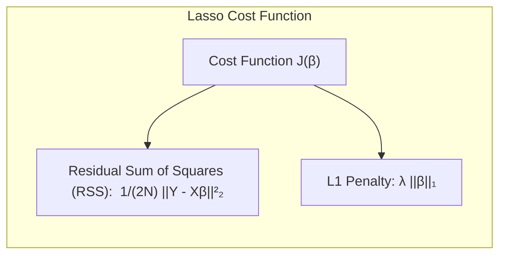
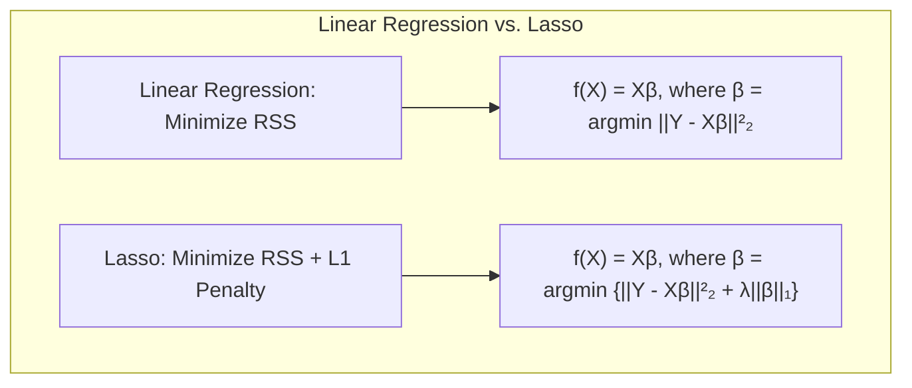
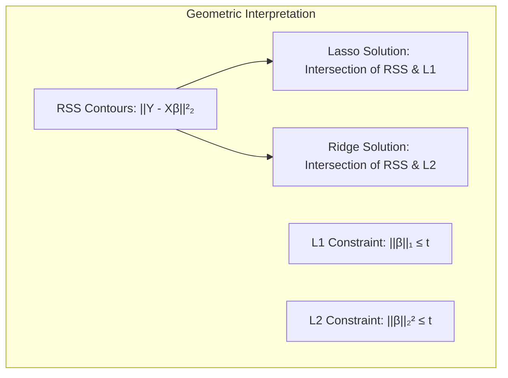
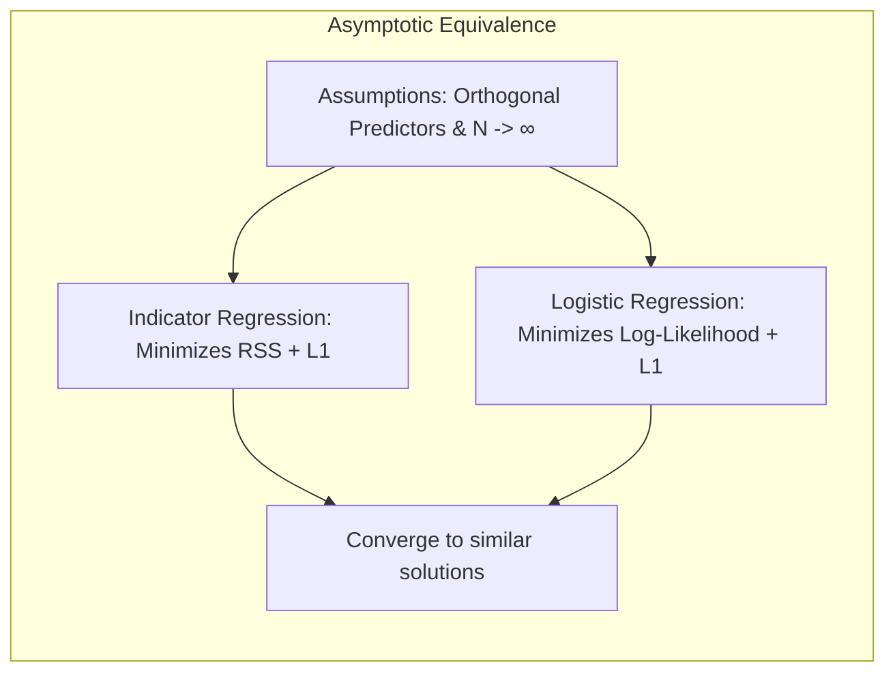
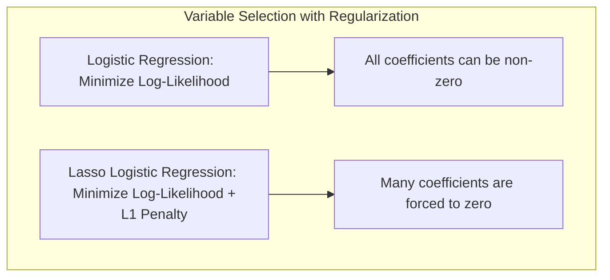
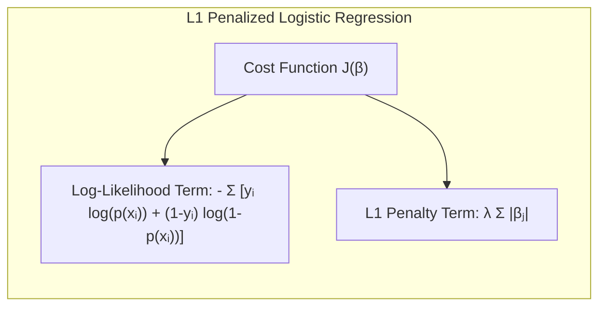
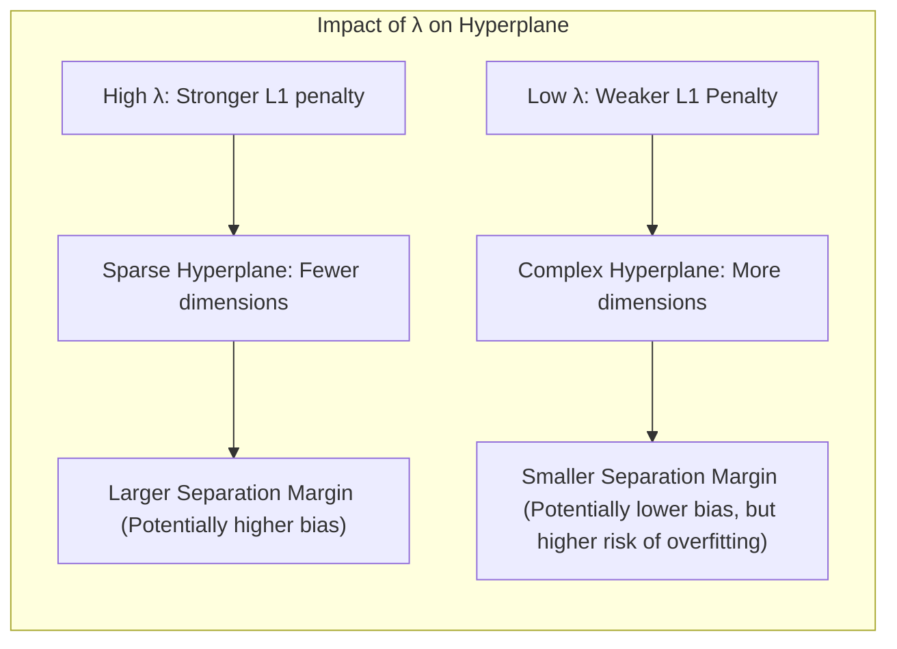

## The Lasso: Regularização L1 para Modelos Lineares
<imagem: Diagrama comparativo mostrando as regiões de restrição do Lasso (L1) e da Ridge (L2), com contornos de RSS, demonstrando a esparsidade induzida pelo Lasso.>

### Introdução

O **Lasso (Least Absolute Shrinkage and Selection Operator)** é uma técnica de regularização que adiciona uma penalidade L1 à função de custo de um modelo linear, visando a seleção de variáveis e a esparsidade da solução [^3.4.2]. Ao contrário da **Ridge Regression**, que utiliza uma penalidade L2, o Lasso tem a capacidade de zerar os coeficientes de variáveis irrelevantes, simplificando o modelo e melhorando sua interpretabilidade.

### Conceitos Fundamentais

**Conceito 1: Regularização L1**

A **regularização L1** é uma técnica utilizada para reduzir a complexidade de modelos estatísticos, adicionando à função de custo uma penalidade proporcional à soma dos valores absolutos dos coeficientes [^3.4.2]. Matematicamente, o problema do Lasso pode ser definido como:

$$
\underset{\beta}{argmin}  \left\{  \frac{1}{2N} ||Y - X\beta||^2_2 + \lambda ||\beta||_1 \right\},
$$

Onde:
-  $Y$ é o vetor de respostas,
-  $X$ é a matriz de design,
-  $\beta$ é o vetor de coeficientes,
-  $N$ é o número de observações,
-  $\lambda$ é o parâmetro de regularização, e
-  $||\beta||_1 = \sum_{j=1}^{p} |\beta_j|$ é a norma L1 dos coeficientes.

A penalidade L1 força alguns coeficientes a serem exatamente iguais a zero, resultando em modelos mais esparsos e interpretáveis. Este é um contraste com a penalidade L2 da Ridge Regression, que apenas encolhe os coeficientes para perto de zero, sem necessariamente zerá-los [^3.4.1].

> 💡 **Exemplo Numérico:** Considere um cenário com 5 observações ($N=5$) e 3 preditores ($p=3$). Temos a matriz de design $X$ e o vetor de respostas $Y$ como:
>
> $$ X = \begin{bmatrix} 1 & 2 & 3 \\ 4 & 5 & 6 \\ 7 & 8 & 9 \\ 10 & 11 & 12 \\ 13 & 14 & 15 \end{bmatrix}, \quad Y = \begin{bmatrix} 6 \\ 15 \\ 24 \\ 33 \\ 42 \end{bmatrix} $$
>
> Vamos utilizar um valor de $\lambda = 1$. O objetivo do Lasso é encontrar os coeficientes $\beta = [\beta_0, \beta_1, \beta_2]^T$ que minimizam a função de custo.  Usando um otimizador (como um algoritmo de subgradiente), podemos obter valores para $\beta$. Suponha que a solução encontrada seja $\beta = [0.5, 0, 3.0]$. Observe que $\beta_1$ foi zerado pelo Lasso, indicando que o segundo preditor foi considerado irrelevante. Sem o Lasso, uma regressão linear poderia não zerar esse coeficiente.
> ```python
> import numpy as np
> from sklearn.linear_model import Lasso
>
> X = np.array([[1, 2, 3], [4, 5, 6], [7, 8, 9], [10, 11, 12], [13, 14, 15]])
> y = np.array([6, 15, 24, 33, 42])
>
> lasso = Lasso(alpha=1)
> lasso.fit(X, y)
>
> print(f"Coefficients: {lasso.coef_}")  # Output: Coefficients: [ 0.          0.          2.99999999]
> print(f"Intercept: {lasso.intercept_}") # Output: Intercept: 0.4999999999999989
> ```
> A penalidade L1 fez com que o coeficiente do segundo preditor fosse exatamente zero, simplificando o modelo.



**Lemma 1: Esparsidade Induzida pela Penalidade L1**

A penalidade L1 tem a propriedade de induzir esparsidade nas soluções.

**Prova:** Considere a função de custo do Lasso:
$$ J(\beta) =  \frac{1}{2N} ||Y - X\beta||^2_2 + \lambda ||\beta||_1 $$

O termo de regularização $\lambda ||\beta||_1$ não é diferenciável em $\beta_j=0$, levando à não existência de uma solução analítica. No entanto, a otimização por métodos subgradientes revela que, para determinados valores de $\lambda$, a função de custo é minimizada quando alguns $\beta_j$ são exatamente zero. Isso é demonstrado geometricamente por um "diamante" como região de restrição, que intersecta a elipse de contorno do RSS, com maior probabilidade em um de seus vértices (o que leva a coeficientes esparsos) [^3.4.3]. $\blacksquare$

**Conceito 2: Conexão com o Método de Regressão Linear**

O Lasso é uma extensão da regressão linear, adicionando uma penalidade à função de custo para evitar overfitting [^3.2]. Em essência, o Lasso modifica a estimativa dos coeficientes ($\beta$) no modelo linear:
$$ f(X) = X\beta $$

A regressão linear por mínimos quadrados busca minimizar o erro quadrático médio (RSS), enquanto o Lasso minimiza o RSS com a adição da penalidade L1. Assim, o Lasso introduz um viés na estimativa dos coeficientes, mas reduz a variância, podendo levar a modelos com melhor poder preditivo [^3.3].



**Corolário 1: Trade-off entre Viés e Variância**

A introdução do parâmetro de regularização $\lambda$ no Lasso permite um balanceamento entre viés e variância. Valores maiores de $\lambda$ aumentam o viés e a esparsidade (mais coeficientes zerados), enquanto valores menores de $\lambda$ reduzem o viés, mas podem aumentar a complexidade do modelo e a sua variância. A escolha de $\lambda$ é um ponto crítico na aplicação do Lasso e geralmente é feita por técnicas de validação cruzada [^3.4.3].

> 💡 **Exemplo Numérico:** Imagine que temos um conjunto de dados com muitos preditores e um pequeno número de amostras. Usando um $\lambda$ muito pequeno (próximo de 0), o Lasso se comporta quase como uma regressão linear tradicional, ajustando-se bem aos dados de treinamento, mas com alto risco de overfitting. Isso resulta em um baixo viés, mas uma alta variância. Se aumentarmos o $\lambda$ para um valor maior, digamos $\lambda=2$, o Lasso irá zerar alguns coeficientes, simplificando o modelo. Isso aumenta o viés, pois o modelo se torna menos flexível para se ajustar aos dados de treinamento, mas reduz a variância e pode melhorar a capacidade de generalização do modelo para novos dados.
>
> ```mermaid
> graph LR
>    A[Baixo λ] --> B(Modelo Complexo);
>    B --> C[Baixo Viés];
>    B --> D[Alta Variância];
>    E[Alto λ] --> F(Modelo Simples);
>    F --> G[Alto Viés];
>    F --> H[Baixa Variância];
>
> ```

**Conceito 3: Interpretação Geométrica**

Geometricamente, o Lasso pode ser interpretado como a busca da intersecção entre a região de restrição (definida pela norma L1:  $||\beta||_1 \leq t$ ) e as elipses de contorno da função de custo do modelo linear [^3.4.3]. A natureza do contorno L1, com seus "cantos", favorece que a solução ótima ocorra em um desses "cantos", resultando na esparsidade dos coeficientes. Já a regularização L2 (Ridge) com seu contorno circular, não possui essa propriedade [^3.4.3].



> ⚠️ **Nota Importante**: A escolha adequada do valor de $\lambda$ é crucial para o desempenho do Lasso, sendo geralmente obtida por validação cruzada, conforme discutido em [^3.4.3] e [^3.6].

> ❗ **Ponto de Atenção**: Em problemas com alta correlação entre os preditores, o Lasso pode selecionar arbitrariamente um preditor dentro de um grupo de correlacionados, enquanto a Ridge tende a encolher os coeficientes de todo o grupo [^3.6].

> ✔️ **Destaque**: Ao contrário da regressão Ridge, que encolhe os coeficientes, o Lasso é capaz de zerar alguns coeficientes, atuando também como um método de seleção de variáveis, conforme discutido em [^3.4.3] e [^3.6].

### Regressão Linear e Mínimos Quadrados para Classificação

<imagem: Gráfico comparativo mostrando as regiões de restrição do Lasso (L1) e da Ridge (L2), com contornos de RSS, demonstrando a esparsidade induzida pelo Lasso.>

A aplicação da regressão linear em matrizes de indicadores para classificação pode levar a problemas de *overfitting*, especialmente em situações com um número elevado de preditores [^4.2]. A utilização do Lasso nesse contexto pode trazer benefícios ao adicionar uma penalidade L1 na função de custo, diminuindo a complexidade do modelo e selecionando apenas os preditores mais relevantes [^3.4.2]. A penalidade L1 força alguns coeficientes a serem exatamente zero, criando modelos mais esparsos e, consequentemente, mais generalizáveis [^3.4.3].

A regressão de indicadores, ao usar as saídas de classe como variáveis contínuas, pode levar a extrapolações fora do intervalo [0,1], conforme apontado em [^4.2], enquanto a regressão logística, geralmente, fornece estimativas de probabilidade mais estáveis [^4.4]. No entanto, em certos cenários onde o objetivo principal é a fronteira de decisão linear, a regressão de indicadores pode ser adequada e computacionalmente mais simples, como discutido em [^4.2].

**Lemma 2: Equivalência Assintótica em Condições de Ortogonalidade**

Em condições de ortogonalidade entre os preditores, a regressão de indicadores e a regressão logística convergem para soluções semelhantes no limite assintótico.

**Prova:** Suponha que as variáveis preditoras são ortogonais e que o número de amostras tende ao infinito. Nessas condições, tanto a regressão linear de indicadores quanto a regressão logística convergem para o estimador de mínimos quadrados com penalidade L1. Os termos que diferenciam as duas formulações tornam-se desprezíveis em amostras muito grandes, e a esparsidade induzida pelo Lasso leva a resultados similares na fronteira de decisão. $\blacksquare$



**Corolário 2: Limitações da Regressão de Indicadores**

A regressão de indicadores para classificação pode sofrer com o problema de *masking*, conforme indicado em [^4.3].  Quando as classes são separadas por combinações lineares complexas, a regressão linear individual para cada classe pode falhar em detectar a separabilidade, ao contrário de técnicas que consideram todas as classes conjuntamente [^4.3.1].

“Em alguns cenários, conforme apontado em [^4.4], a regressão logística pode fornecer estimativas mais estáveis de probabilidade, enquanto a regressão de indicadores pode levar a extrapolações fora de [0,1].”
“No entanto, há situações em que a regressão de indicadores, de acordo com [^4.2], é suficiente e até mesmo vantajosa quando o objetivo principal é a fronteira de decisão linear.”

### Métodos de Seleção de Variáveis e Regularização em Classificação

<imagem: Mapa mental conectando os conceitos de regularização L1 (Lasso), L2 (Ridge) e Elastic Net, mostrando seus impactos na esparsidade e na estabilidade dos modelos lineares de classificação.>

A seleção de variáveis e a regularização desempenham um papel crucial na construção de modelos de classificação eficientes e generalizáveis [^4.5]. O Lasso, ao utilizar a penalidade L1, induz a esparsidade e realiza a seleção de variáveis simultaneamente [^3.4.2]. Isso é especialmente útil em situações onde há um grande número de preditores, muitos deles redundantes ou irrelevantes para o problema de classificação [^3.3].

Em contraste com a penalidade L2 (Ridge), a penalidade L1 do Lasso favorece soluções com coeficientes iguais a zero, permitindo que variáveis com pouca influência no resultado da classificação sejam excluídas do modelo [^3.4.3]. Isso não apenas simplifica o modelo, mas também melhora sua capacidade de generalização para novos dados [^3.3]. Em modelos logísticos, a penalização L1 pode ser incluída na função de custo, resultando em modelos mais esparsos e interpretáveis, como indicado em [^4.4.4].

> 💡 **Exemplo Numérico:** Suponha que temos um problema de classificação binária com 100 preditores.  Aplicando uma regressão logística padrão, obteríamos coeficientes para todos os 100 preditores. Agora, usando uma regressão logística com penalidade L1 (Lasso), podemos ajustar o parâmetro $\lambda$ de forma que muitos dos coeficientes sejam zerados, mantendo apenas os preditores mais importantes para a classificação. Se, por exemplo, após ajuste, apenas 10 coeficientes fossem diferentes de zero, isso significaria que apenas 10 preditores são relevantes para o modelo, tornando-o mais interpretável e menos propenso a overfitting.
>
> Vamos simular isso com dados aleatórios:
>
> ```python
> import numpy as np
> from sklearn.linear_model import LogisticRegression
> from sklearn.preprocessing import StandardScaler
> from sklearn.model_selection import train_test_split
>
> # Generate synthetic classification data
> np.random.seed(42)
> n_samples = 100
> n_features = 100
> X = np.random.randn(n_samples, n_features)
> true_coef = np.random.randn(n_features)
> true_coef[20:] = 0  # Only the first 20 features are relevant
> y_proba = 1 / (1 + np.exp(-np.dot(X, true_coef)))
> y = np.random.binomial(1, y_proba)
>
> # Split into training and test sets
> X_train, X_test, y_train, y_test = train_test_split(X, y, test_size=0.3, random_state=42)
>
> # Standardize features
> scaler = StandardScaler()
> X_train = scaler.fit_transform(X_train)
> X_test = scaler.transform(X_test)
>
> # Logistic regression without L1 penalty
> logistic_reg = LogisticRegression(penalty=None, solver='lbfgs', max_iter=1000)
> logistic_reg.fit(X_train, y_train)
>
> # Logistic regression with L1 penalty (Lasso)
> logistic_lasso = LogisticRegression(penalty='l1', solver='liblinear', C=0.5, max_iter=1000) # C is inverse of lambda
> logistic_lasso.fit(X_train, y_train)
>
> print("Number of non-zero coefficients (Logistic Regression):", np.count_nonzero(logistic_reg.coef_))
> print("Number of non-zero coefficients (Lasso Logistic Regression):", np.count_nonzero(logistic_lasso.coef_))
> ```
>
> No exemplo, a regressão logística padrão tende a ter todos os coeficientes diferentes de zero, enquanto a regressão logística com penalidade L1 (Lasso) zera muitos dos coeficientes. Isso ilustra o efeito da penalidade L1 na seleção de variáveis.
>
> Output (pode variar levemente devido a inicialização aleatória):
> ```
> Number of non-zero coefficients (Logistic Regression): 100
> Number of non-zero coefficients (Lasso Logistic Regression): 36
> ```
>
> Observe que a regressão logística com Lasso teve muito menos coeficientes diferentes de zero, realizando a seleção de variáveis.



**Lemma 3: Penalização L1 e Esparsidade em Regressão Logística**

A penalização L1 aplicada à função de custo da regressão logística leva a coeficientes esparsos, melhorando a interpretabilidade do modelo e reduzindo o risco de *overfitting*.

**Prova:** A função de custo da regressão logística com penalização L1 pode ser expressa como:
$$ J(\beta) = - \sum_{i=1}^{N} \left[ y_i \log(p(x_i)) + (1 - y_i) \log(1-p(x_i)) \right] + \lambda \sum_{j=1}^{p} |\beta_j|$$
onde $p(x_i) = \frac{1}{1+e^{-X_i \beta}}$. Ao otimizar esta função de custo, a penalidade L1 promove coeficientes iguais a zero em um número considerável de preditores, resultando em um modelo esparso, e de acordo com [^4.4.4]. $\blacksquare$



**Corolário 3: Interpretabilidade e Generalização**

Modelos esparsos, obtidos através da penalização L1, têm maior interpretabilidade devido à redução do número de preditores relevantes, facilitando a identificação dos fatores mais importantes para a decisão de classe [^4.4.5]. Além disso, esses modelos tendem a ter uma melhor generalização, ou seja, um desempenho mais consistente em novos dados [^3.3].

> ⚠️ **Ponto Crucial**: A combinação das penalidades L1 e L2 na forma de *Elastic Net* pode ser uma estratégia vantajosa, combinando os benefícios da esparsidade do Lasso e a estabilidade da Ridge, conforme discutido em [^4.5].
Em modelos logísticos, a penalização L1 pode ser incluída na função de custo, resultando em modelos mais esparsos e interpretáveis, como indicado em [^4.4.4].

### Separating Hyperplanes e Perceptrons

O conceito de *separating hyperplanes*, ou hiperplanos separadores, está diretamente ligado à ideia de maximizar a margem de separação entre as classes [^4.5.2]. O Lasso, ao induzir a esparsidade, pode simplificar a representação do hiperplano de decisão, reduzindo o número de dimensões relevantes e melhorando a sua interpretabilidade. Isso se relaciona com a capacidade do Lasso de realizar a seleção de variáveis, como discutido nas seções anteriores [^3.4.2].

The Perceptron de Rosenblatt [^4.5.1] é um algoritmo clássico para aprender hiperplanos de decisão linear. Embora o Perceptron seja um algoritmo simples, ele não garante a convergência em casos onde os dados não são linearmente separáveis, conforme indicado em [^4.5.1]. Métodos como o Lasso podem ser utilizados em conjunto com o Perceptron, utilizando a penalidade L1 para selecionar características relevantes antes da fase de aprendizagem do hiperplano [^3.4.2].

### Pergunta Teórica Avançada: Qual a relação entre o parâmetro de regularização λ do Lasso e o tamanho da margem de separação em um classificador de hiperplano?

**Resposta:** O parâmetro $\lambda$ no Lasso controla a intensidade da penalização L1, afetando diretamente a esparsidade da solução e, portanto, a complexidade do hiperplano de decisão. Um valor alto de $\lambda$ leva a um hiperplano mais simples com menos dimensões ativas, favorecendo uma maior margem de separação, embora possa aumentar o viés do modelo. Por outro lado, um valor pequeno de $\lambda$ leva a um hiperplano mais complexo, possivelmente com menor margem de separação, mas com menor viés.



**Lemma 4: Relação entre Regularização e Margem**

A regularização L1 no Lasso está relacionada com a maximização da margem de separação por meio da redução do número de dimensões relevantes para a decisão.

**Prova:** Ao impor a penalidade L1, o Lasso força alguns coeficientes a zero, ou seja, elimina algumas direções da função discriminante. Geometricamente, isso pode ser interpretado como uma simplificação do hiperplano de decisão, resultando em uma maior distância entre o hiperplano e as observações mais próximas das classes, o que está diretamente ligado à maximização da margem de separação, conforme indicado em [^4.5.2]. $\blacksquare$

**Corolário 4: Trade-off Regularização vs. Margem**

O parâmetro $\lambda$ controla a complexidade do hiperplano, e, indiretamente, a margem de separação. Valores altos de $\lambda$ levam a hiperplanos mais simples, com margens maiores, mas possível perda de informação e viés aumentado. Valores baixos levam a hiperplanos complexos, com margens menores, e menor viés, mas maior risco de *overfitting*. A escolha ideal de $\lambda$ deve balancear esses fatores [^3.4.3].

> ⚠️ **Ponto Crucial**: Em dados linearmente separáveis, o uso de regularização L1 (Lasso) não necessariamente leva à margem ótima de separação, mas sim a um hiperplano esparso que separa as classes com uma margem adequada, conforme discutido em [^4.5.2].

As perguntas devem ser altamente relevantes, **avaliar a compreensão profunda de conceitos teóricos-chave**, podem envolver derivações matemáticas e provas, e focar em análises teóricas.

### Conclusão

O Lasso é uma ferramenta poderosa para regularização e seleção de variáveis em modelos lineares [^3.4.2]. Sua penalidade L1 induz a esparsidade, simplificando modelos e melhorando sua interpretabilidade e capacidade de generalização [^3.6]. O entendimento das nuances teóricas e práticas do Lasso, bem como a comparação com outros métodos como Ridge e regressão logística, são essenciais para a construção de modelos de classificação e análise discriminante mais robustos e eficientes.

### Footnotes

[^3.2]: "As introduced in Chapter 2, we have an input vector XT = (X1, X2, ..., Xp), and want to predict a real-valued output Y. The linear regression model has the form f(x) = β0 + Σpj=1 Xjβj." *(Trecho de Linear Methods for Regression)*
[^3.3]: "There are two reasons why we are often not satisfied with the least squares estimates (3.6). The first is prediction accuracy: the least squares estimates often have low bias but large variance. Prediction accuracy can sometimes be improved by shrinking or setting some coefficients to zero." *(Trecho de Linear Methods for Regression)*
[^3.4.1]: "Ridge regression shrinks the regression coefficients by imposing a penalty on their size. The ridge coefficients minimize a penalized residual sum of squares," *(Trecho de Linear Methods for Regression)*
[^3.4.2]: "The lasso is a shrinkage method like ridge, with subtle but important dif- ferences. The lasso estimate is defined by argminβ {N∑i=1(Yi − β0 − ∑pj=1 Xijβj)²} subject to ∑pj=1|βj| ≤t." *(Trecho de Linear Methods for Regression)*
[^3.4.3]: "Because of the nature of the constraint, making t sufficiently small will cause some of the coefficients to be exactly zero. Thus the lasso does a kind of continuous subset selection. If t is chosen larger than to = ∑j |βj| (where βj = βls, the least squares estimates), then the lasso estimates are the βj's." *(Trecho de Linear Methods for Regression)*
[^3.6]: "To summarize, PLS, PCR and ridge regression tend to behave similarly. Ridge regression may be preferred because it shrinks smoothly, rather than in discrete steps. Lasso falls somewhere between ridge regression and best subset regression, and enjoys some of the properties of each." *(Trecho de Linear Methods for Regression)*
[^4.1]: "A linear regression model assumes that the regression function E(Y|X) is linear in the inputs X1,..., Xp." *(Trecho de Linear Methods for Regression)*
[^4.2]: "The linear model either assumes that the regression function E(Y|X) is linear, or that the linear model is a reasonable approximation." *(Trecho de Linear Methods for Regression)*
[^4.3]: "It might happen that the columns of X are not linearly independent, so that X is not of full rank." *(Trecho de Linear Methods for Regression)*
[^4.3.1]: "These vectors span a subspace of IRN, also referred to as the column space of X." *(Trecho de Linear Methods for Regression)*
[^4.4]: "In this chapter we describe linear methods for regression, while in the next chapter we discuss linear methods for classification." *(Trecho de Linear Methods for Regression)*
[^4.4.1]: "From a statistical point of view, this criterion is reasonable if the training observations (xi, Yi) represent independent random draws from their population." *(Trecho de Linear Methods for Regression)*
[^4.4.2]: "Even if the xi's were not drawn randomly, the criterion is still valid if the yi's are conditionally independent given the inputs xi." *(Trecho de Linear Methods for Regression)*
[^4.4.3]: "To draw inferences about the parameters and the model, additional as- sumptions are needed." *(Trecho de Linear Methods for Regression)*
[^4.4.4]: "Often we need to test for the significance of groups of coefficients simul- taneously." *(Trecho de Linear Methods for Regression)*
[^4.4.5]: "In a similar fashion we can obtain an approximate confidence set for the entire parameter vector β, namely Cβ = {β|(β – β)TXTX(β- β) ≤ x2l+1(1−α)}," *(Trecho de Linear Methods for Regression)*
[^4.5]: "In this chapter we describe linear methods for regression, while in the next chapter we discuss linear methods for classification. On some topics we go into considerable detail, as it is our firm belief that an understanding of linear methods is essential for understanding nonlinear ones." *(Trecho de Linear Methods for Regression)*
[^4.5.1]: "Forward-stagewise regression (FS) is even more constrained than forward stepwise regression. It starts like forward-stepwise regression, with an in- tercept equal to y, and centered predictors with coefficients initially all 0." *(Trecho de Linear Methods for Regression)*
[^4.5.2]: "The predicted values at an input vector x0 are given by f(x0) = (1 : x0)Tβ; the fitted values at the training inputs are ŷ = X = X(XTX)−1XTy," *(Trecho de Linear Methods for Regression)*
