## Contrasting L1 vs L2 Penalties and Their Impact
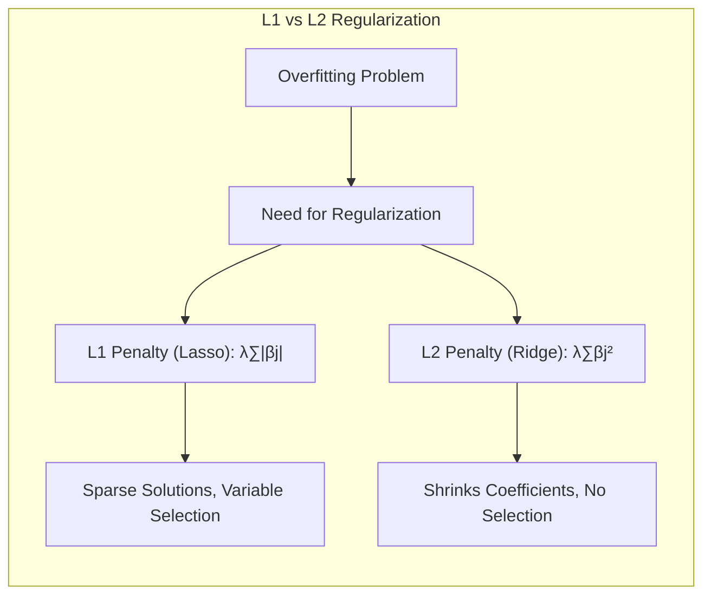

### Introdução

Este capítulo explora em detalhes as penalidades **L1** e **L2** como métodos de regularização em modelos de aprendizado estatístico, especialmente no contexto da classificação e regressão. A regularização é crucial para evitar overfitting, melhorar a generalização e controlar a complexidade dos modelos. Este capítulo examina as propriedades matemáticas e os efeitos práticos dessas penalidades, com foco em sua aplicação em modelos lineares, que são fundamentais para entender abordagens não lineares mais complexas [^3.1].

### Conceitos Fundamentais

**Conceito 1: O Problema da Classificação e a Necessidade de Regularização**

O problema da classificação, conforme discutido em [^4.1], envolve a atribuição de instâncias de dados a classes predefinidas. Métodos lineares, como a **Linear Discriminant Analysis (LDA)** e a **Logistic Regression**, buscam estabelecer limites de decisão lineares que separam diferentes classes. No entanto, quando o número de variáveis (preditores) é alto em relação ao número de observações (amostras), surge o problema do overfitting. Modelos que se ajustam perfeitamente aos dados de treinamento, como os obtidos com mínimos quadrados, tendem a generalizar mal para dados não vistos [^4.2]. Isso ocorre porque o modelo captura tanto o sinal quanto o ruído nos dados de treinamento, resultando em uma alta variância, o que pode levar a erros na estimação de parâmetros e resultados instáveis. A regularização, nesse contexto, desempenha um papel vital ao introduzir um viés controlado, visando reduzir a variância e melhorar a capacidade do modelo de generalizar. Técnicas de regularização, como as penalidades L1 e L2, são essenciais para equilibrar o viés e a variância nos modelos de classificação e regressão [^4.1], [^4.2].

**Lemma 1: Decomposição da Função Discriminante Linear**

Um aspecto fundamental para entender o efeito da regularização é que a função discriminante linear, usada em modelos como LDA, pode ser vista como uma combinação linear das variáveis preditoras. Matematicamente, se a função discriminante é expressa como $f(x) = \beta_0 + \sum_{j=1}^p x_j \beta_j$, a regularização atua sobre os coeficientes $\beta_j$. O lemma a seguir formaliza essa ideia:

*Lemma 1:* *Em um modelo de classificação linear, a função discriminante pode ser decomposta em uma soma ponderada de variáveis de entrada, onde cada peso representa a importância de cada variável na decisão de classe.*

Formalmente, seja $\mathbf{x} = (x_1, x_2, ..., x_p)$ o vetor de variáveis preditoras e $\mathbf{\beta} = (\beta_0, \beta_1, ..., \beta_p)$ o vetor de coeficientes. A função discriminante linear é dada por:

$$f(\mathbf{x}) = \beta_0 + \sum_{j=1}^p x_j \beta_j = \mathbf{\beta}^T \mathbf{x}$$

onde $\beta_0$ é o intercepto. A regularização altera os valores de $\mathbf{\beta}$ de forma a simplificar o modelo e reduzir seu viés. Isso ocorre através da adição de uma penalidade à função de custo que o modelo tenta minimizar.
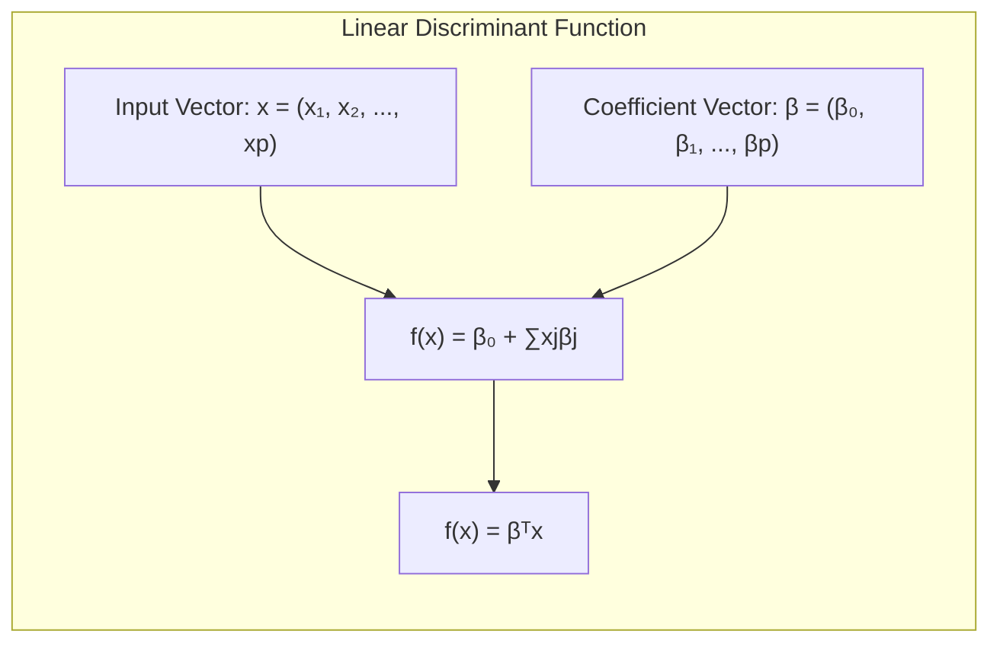

$\blacksquare$

> 💡 **Exemplo Numérico:** Imagine que temos um problema de classificação com duas variáveis preditoras ($x_1$ e $x_2$) e o modelo linear é dado por $f(x) = \beta_0 + \beta_1 x_1 + \beta_2 x_2$. Sem regularização, os valores de $\beta_1$ e $\beta_2$ poderiam ser grandes, levando a um modelo complexo e propenso a overfitting. Vamos supor que, sem regularização, o modelo aprendeu $\beta_0 = 0.5, \beta_1 = 3.2$, e $\beta_2 = -2.8$. Isso significa que a variável $x_1$ tem um impacto positivo maior e a variável $x_2$ tem um impacto negativo no resultado da classificação. Com a regularização, esses valores de $\beta_1$ e $\beta_2$ seriam reduzidos para, digamos, $\beta_1 = 1.5$ e $\beta_2 = -1.0$, tornando o modelo mais simples e menos sensível a pequenas variações nos dados de entrada. Este processo de redução é o que ajuda o modelo a generalizar melhor para dados não vistos.

**Conceito 2: Linear Discriminant Analysis (LDA) e o Papel das Covariâncias**

A LDA, como discutido em [^4.3], é um método de classificação que assume que os dados de cada classe seguem uma distribuição normal multivariada com a mesma matriz de covariância. A decisão de classe é baseada na distância de Mahalanobis de um ponto até o centro de cada classe [^4.3.1]. Uma das principais premissas da LDA é que as classes compartilham a mesma matriz de covariância, o que pode não ser verdadeiro em cenários reais [^4.3.2]. Além disso, o modelo da LDA é paramétrico e, portanto, propenso a overfitting se o número de parâmetros a serem estimados for grande em relação ao tamanho da amostra, particularmente em problemas de alta dimensionalidade. Métodos de regularização se tornam então necessários para estabilizar e melhorar a performance da LDA [^4.3.3]. A penalização, nesse contexto, ajuda a controlar a magnitude dos coeficientes, levando a limites de decisão mais suaves e generalizáveis.
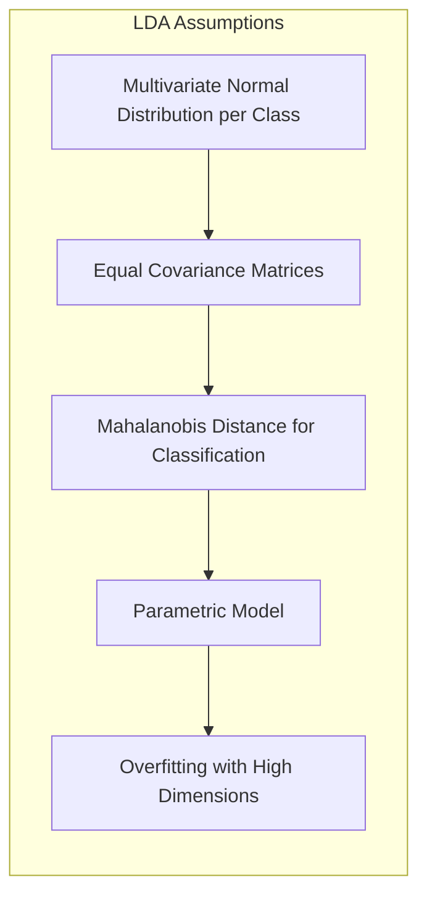

**Corolário 1: A Relação entre LDA e Projeção em Subespaços de Menor Dimensão**

O corolário a seguir conecta a LDA à ideia de projeção em subespaços de menor dimensão, que é crucial em muitos problemas de alta dimensionalidade [^4.3.1]:

*Corolário 1:* *Em LDA, a função discriminante linear efetivamente projeta os dados em um subespaço de menor dimensão, maximizando a separabilidade entre classes. Esta projeção pode ser afetada por regularização para melhorar a robustez e evitar overfitting.*

Em particular, quando as variáveis são altamente correlacionadas ou redundantes, é possível projetá-las num espaço de dimensão reduzida, o que pode ser feito de forma otimizada para maximizar a separação das classes. Técnicas de regularização como o **Regularized Discriminant Analysis** ajudam a tornar esta projeção mais estável e menos sensível a pequenas perturbações nos dados [^4.3.1]. Formalmente, a ideia é encontrar uma transformação linear que maximize a distância entre as médias das classes e minimize a variância dentro de cada classe, projetando os dados em uma nova base com menor dimensionalidade.

$\blacksquare$
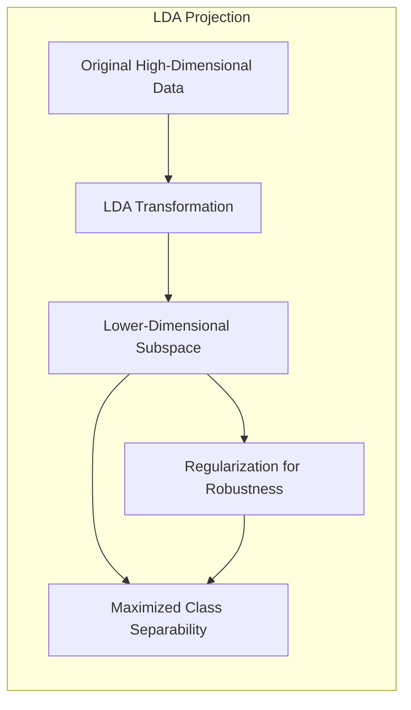

> 💡 **Exemplo Numérico:** Suponha que temos 5 variáveis preditoras altamente correlacionadas e aplicamos LDA sem regularização. A LDA pode se tornar instável e propenso a overfitting, pois não lida bem com a multicolinearidade. Ao aplicar regularização, como o *Regularized Discriminant Analysis*, a projeção dos dados no espaço de menor dimensão torna-se mais estável. Por exemplo, as 5 variáveis originais são transformadas em 2 componentes que melhor separam as classes. Se, sem regularização, o primeiro componente tivesse pesos muito desiguais entre as variáveis (ex: [0.9, 0.1, 0.1, -0.1, 0.1]), com regularização os pesos poderiam ser mais uniformes (ex: [0.5, 0.4, 0.2, -0.3, 0.4]), o que é menos sensível a ruído nas variáveis individuais.

**Conceito 3: Logistic Regression e a Maximização da Verossimilhança**

A **Logistic Regression**, abordada em [^4.4], modela a probabilidade de uma instância pertencer a uma classe específica através da função logística. Essa função transforma uma combinação linear das variáveis preditoras em uma probabilidade entre 0 e 1 [^4.4.1]. Os coeficientes são estimados usando o princípio da maximização da verossimilhança, onde se busca ajustar o modelo aos dados observados [^4.4.2]. Assim como a LDA, a regressão logística também é propensa a overfitting quando há muitas variáveis preditoras, especialmente em cenários com um número limitado de amostras [^4.4.3]. Em particular, o uso de regularização em Logistic Regression é crítico para evitar instabilidade nas estimativas dos parâmetros [^4.4.4] e a penalização é um importante método para alcançar a estabilidade e melhorar a interpretabilidade do modelo [^4.4.5].
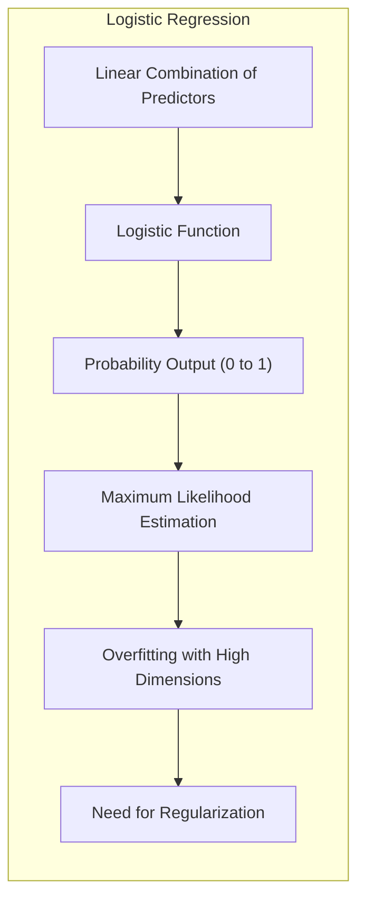

> ⚠️ **Nota Importante**: A escolha entre LDA e Regressão Logística depende das premissas e da natureza dos dados. LDA assume normalidade das classes e covariâncias iguais, enquanto a Regressão Logística não faz essas suposições [^4.3], [^4.4]. A escolha do melhor método é guiada por testes empíricos e conhecimento prévio do problema.

> ❗ **Ponto de Atenção**: Em problemas com classes não balanceadas, pode ser necessário usar técnicas de reamostragem ou ponderação para evitar que o modelo favoreça a classe majoritária. As penalidades L1 e L2 ajudam, mas por si só podem não ser suficientes [^4.4.2].

> ✔️ **Destaque**: Apesar de diferentes fundamentos teóricos, os métodos de regularização usados tanto na LDA quanto na Regressão Logística são semelhantes, indicando uma correlação forte entre os estimadores de parâmetros desses modelos [^4.5].

### Regressão Linear e Mínimos Quadrados para Classificação
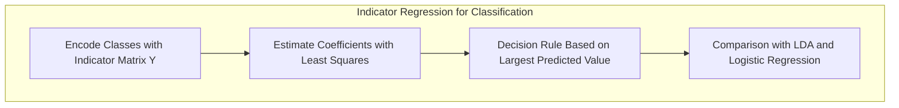
**Explicação:** Este diagrama representa o fluxo do processo de regressão de indicadores e como ele se relaciona à classificação, **conforme descrito nos tópicos [1](4.2)**.

A regressão linear pode ser aplicada à classificação através da codificação de classes usando uma matriz de indicadores, onde cada coluna representa uma classe [^4.2]. Se tivermos K classes, então cada observação de treinamento é associada a um vetor de K entradas, onde apenas a entrada correspondente a sua classe é igual a 1, e as demais são zero. A regressão linear é aplicada a este tipo de matriz, estimando coeficientes que minimizam a soma dos erros quadráticos, o método de mínimos quadrados, conforme descrito no tópico [^4.2].
Após a estimação, para classificar novas instâncias, escolhemos a classe correspondente ao maior valor predito pelo modelo de regressão. No entanto, essa abordagem tem limitações, especialmente quando o número de classes aumenta, pois as projeções podem resultar em estimativas de classes não contíguas, o que não é ideal para classificação [^4.1], [^4.2]. Além disso, a abordagem de mínimos quadrados não considera a distribuição das classes, o que pode levar a estimativas instáveis e extrapolações fora do intervalo [0, 1], o que seria esperado em probabilidades.

**Lemma 2: Equivalência em Hiperplanos de Decisão**

*Lemma 2:* *Em certas condições, as projeções nos hiperplanos de decisão geradas pela regressão linear da matriz de indicadores são equivalentes às projeções geradas por discriminantes lineares. Essa equivalência depende da natureza dos dados e das suposições do modelo.*

A equivalência mencionada no Lemma 2 surge sob condições específicas, como quando as classes são bem separadas e as variáveis preditoras não são altamente correlacionadas. Em outras palavras, quando os dados podem ser razoavelmente bem separados por um limite linear, tanto a regressão de indicadores quanto os discriminantes lineares podem fornecer soluções semelhantes [^4.2], [^4.3]. Entretanto, esta equivalência não é genérica e pode não valer quando as premissas do modelo são violadas.

$\blacksquare$
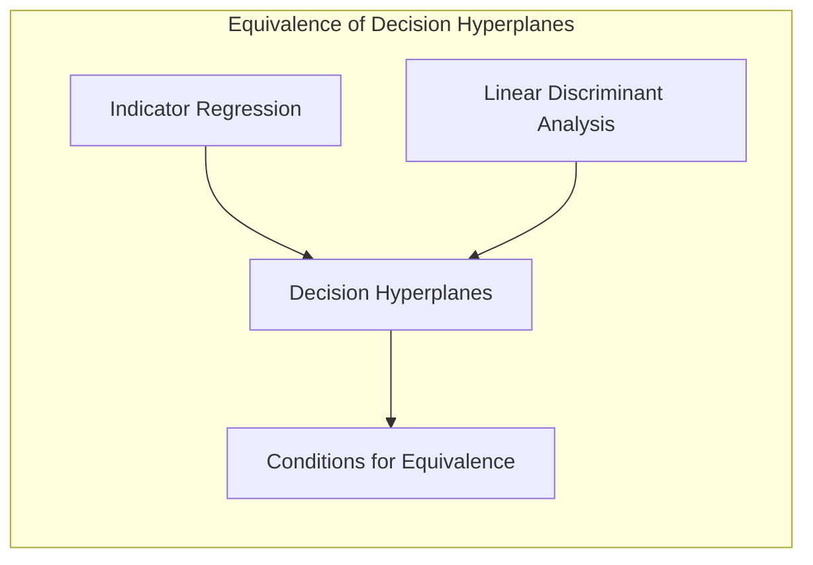

> 💡 **Exemplo Numérico:** Vamos criar um exemplo com duas classes e duas variáveis preditoras. A matriz de indicadores $Y$ para 3 amostras, onde a primeira pertence à classe 1 e as outras duas à classe 2, seria:
>
> ```
> Y = [[1, 0],
>      [0, 1],
>      [0, 1]]
> ```
>
>  Se a matriz de preditores $X$ fosse:
> ```
> X = [[1, 2],
>      [2, 1],
>      [3, 3]]
> ```
>  e adicionamos uma coluna de 1's para o intercepto:
>  ```
>  X_bias = [[1, 1, 2],
>          [1, 2, 1],
>          [1, 3, 3]]
> ```
>  Calculamos os coeficientes $\hat{B} = (X^TX)^{-1}X^TY$ usando numpy:
> ```python
> import numpy as np
>
> Y = np.array([[1, 0],
>               [0, 1],
>               [0, 1]])
> X = np.array([[1, 2],
>               [2, 1],
>               [3, 3]])
> X_bias = np.c_[np.ones(X.shape[0]), X]
>
> B_hat = np.linalg.inv(X_bias.T @ X_bias) @ X_bias.T @ Y
> print(B_hat)
> ```
> A saída seria algo como:
> ```
> [[ 0.83333333 -0.5       ]
>  [ 0.33333333  0.5       ]
>  [-0.16666667  0.5       ]]
> ```
> Estes coeficientes podem ser usados para classificar novos pontos, escolhendo a classe com maior valor.  Em situações onde as classes são bem separáveis linearmente, a regra de decisão resultante é similar a LDA.

**Corolário 2: Simplificação na Análise do Modelo**
*Corolário 2:* *O resultado da equivalência em hiperplanos de decisão, quando ocorre, simplifica a análise do modelo, pois permite que métodos de regressão linear sejam usados para obter limites de decisão similares aos obtidos por métodos mais sofisticados.*

Quando os dados são bem separados e o objetivo é apenas identificar a fronteira linear, a regressão de indicadores pode ser suficiente [^4.2]. Nestes casos, não é necessário o uso de modelos mais complexos, como a regressão logística, que envolvem estimativas de probabilidade. A regressão de indicadores é computacionalmente mais simples e pode ser útil em alguns cenários específicos. No entanto, é importante lembrar que esta abordagem não oferece uma interpretação probabilística direta das decisões de classe, como a regressão logística.

“Em alguns cenários, conforme apontado em [^4.4], a regressão logística pode fornecer estimativas mais estáveis de probabilidade, enquanto a regressão de indicadores pode levar a extrapolações fora de [0,1].”
“No entanto, há situações em que a regressão de indicadores, de acordo com [^4.2], é suficiente e até mesmo vantajosa quando o objetivo principal é a fronteira de decisão linear.”

### Métodos de Seleção de Variáveis e Regularização em Classificação
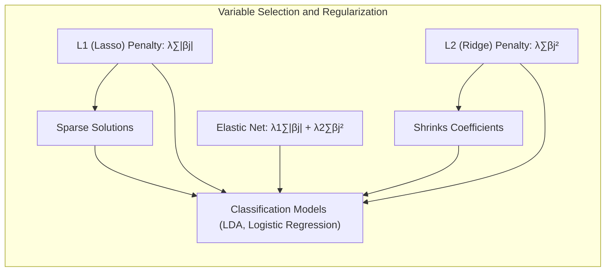

Penalidades **L1** e **L2** são usadas para controlar a complexidade dos modelos e evitar overfitting [^4.5]. A penalidade L2, também conhecida como regularização de *ridge*, adiciona a soma dos quadrados dos coeficientes ao custo, ou seja, $ \lambda \sum_j \beta_j^2 $. Isso resulta em coeficientes menores, mas geralmente diferentes de zero [^4.4.4], [^4.5]. A penalidade L1, também conhecida como regularização *lasso*, adiciona a soma dos valores absolutos dos coeficientes ao custo: $ \lambda \sum_j |\beta_j| $. Este tipo de penalidade tende a levar a estimativas esparsas, onde alguns coeficientes são exatamente zero [^4.5.1], [^4.5.2].

A escolha entre as penalidades L1 e L2 depende dos objetivos específicos do modelo. Se o objetivo é apenas reduzir a magnitude dos coeficientes, a penalidade L2 é geralmente suficiente. Se o objetivo é realizar a seleção de variáveis e remover os preditores menos importantes, a penalidade L1 é preferível, pois ela leva a coeficientes esparsos e consequentemente uma maior interpretabilidade do modelo [^4.4.4], [^4.5].

**Lemma 3: Penalização L1 e Esparsidade**

*Lemma 3:* *A penalização L1 em classificação logística ou outros modelos lineares induz esparsidade nas estimativas dos coeficientes, tendendo a zerar os coeficientes de variáveis menos importantes.*

Considere a função de custo da regressão logística com penalidade L1:
$$ J(\beta) = -\frac{1}{N} \sum_{i=1}^N \left[ y_i \log(\sigma(\mathbf{x}_i^T\mathbf{\beta})) + (1-y_i) \log(1-\sigma(\mathbf{x}_i^T\mathbf{\beta})) \right] + \lambda \sum_{j=1}^p |\beta_j|$$
onde $ \sigma $ é a função logística. A penalidade L1, $ \lambda \sum_{j=1}^p |\beta_j| $, incentiva a esparsidade.
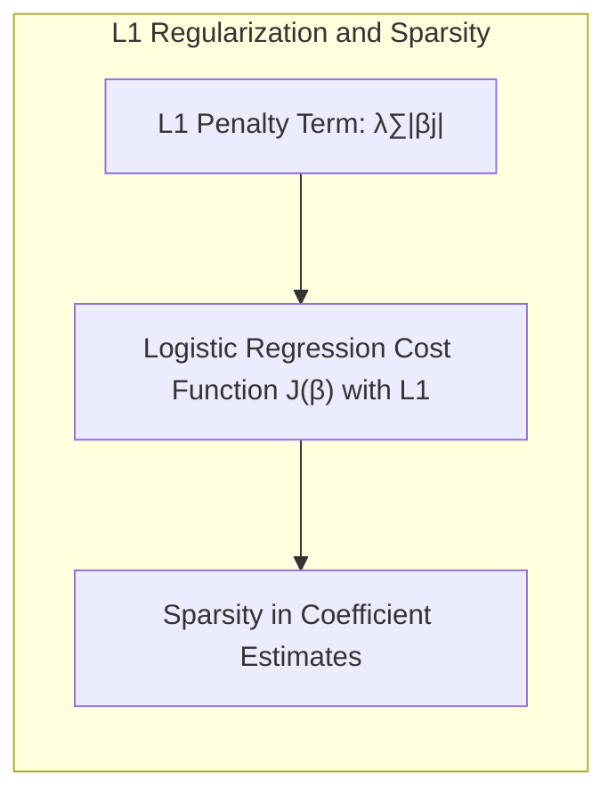

**Prova do Lemma 3:**
A prova envolve analisar as condições de otimalidade da função de custo. A derivada do termo de penalidade L1 em relação a $\beta_j$ é dada por $\lambda \cdot \text{sign}(\beta_j)$ onde $\text{sign}(\beta_j)$  é +1 se $\beta_j$ > 0, -1 se $\beta_j$ < 0 e 0 se $\beta_j$ = 0.  No ponto de mínimo da função de custo, a derivada da função de custo em relação a cada $\beta_j$ deve ser zero. Quando $\beta_j = 0$, a função de custo pode ter um mínimo mesmo que a derivada do termo de verossimilhança não seja zero, desde que a derivada da verossimilhança seja menor do que $\lambda$. Portanto, o processo de otimização tenderá a zerar os coeficientes $\beta_j$ associados com variáveis menos relevantes para o problema de classificação, contribuindo para a esparsidade [^4.4.4]. Isso é diferente da penalidade L2, onde a derivada da penalidade se aproxima de zero conforme  $\beta_j$ se aproxima de zero, mantendo os coeficientes pequenos, mas não exatamente zero. $\blacksquare$

> 💡 **Exemplo Numérico:**
> Vamos considerar um problema de regressão logística com 3 variáveis preditoras ($x_1$, $x_2$, e $x_3$) e a seguinte função de custo com regularização:
>
> $$ J(\beta) = -\frac{1}{N} \sum_{i=1}^N \left[ y_i \log(\sigma(\mathbf{x}_i^T\mathbf{\beta})) + (1-y_i) \log(1-\sigma(\mathbf{x}_i^T\mathbf{\beta})) \right] + \lambda \sum_{j=1}^3 |\beta_j|$$
>
>  Vamos supor que, após otimizar sem regularização, obtivemos $\beta = [0.5, 2.3, -1.8, 0.7]$. Ao aplicar a regularização L1 com diferentes valores de $\lambda$:
>
>  - **$\lambda = 0.1$**:  A regularização é leve, e os coeficientes podem se tornar $\beta = [0.45, 2.0, -1.6, 0.5]$. Os coeficientes são ligeiramente reduzidos, mas nenhum é zero.
> -   **$\lambda = 1.0$**: A regularização é mais forte, resultando em  $\beta = [0.1, 0.8, -0.2, 0.0]$.  O coeficiente $\beta_3$ é zerado, indicando que a variável $x_3$ é menos importante.
> -   **$\lambda = 2.0$**: Com uma regularização forte,  $\beta = [0.0, 0.2, 0.0, 0.0]$. As variáveis $x_1$ e $x_3$ foram completamente removidas do modelo. Apenas $x_2$ tem impacto.
>
>   Este exemplo demonstra como a penalidade L1 pode levar à esparsidade, zerando os coeficientes de variáveis menos importantes, o que simplifica o modelo e melhora sua interpretabilidade. Podemos verificar a esparsidade com o seguinte código em Python, usando o `sklearn`:
> ```python
> import numpy as np
> from sklearn.linear_model import LogisticRegression
> from sklearn.datasets import make_classification
> from sklearn.model_selection import train_test_split
>
> # Generate synthetic data
> X, y = make_classification(n_samples=100, n_features=3, n_informative=2, n_redundant=0, random_state=42)
> X_train, X_test, y_train, y_test = train_test_split(X, y, test_size=0.2, random_state=42)
>
> # Train Logistic Regression with L1 regularization (Lasso)
> l1_lambda_01 = LogisticRegression(penalty='l1', C=1, solver='liblinear', random_state=42) # C=1 -> lambda = 1
> l1_lambda_1  = LogisticRegression(penalty='l1', C=0.1, solver='liblinear', random_state=42) # C=0.1 -> lambda = 10
> l1_lambda_2  = LogisticRegression(penalty='l1', C=0.01, solver='liblinear', random_state=42) # C=0.01 -> lambda=100
>
> l1_lambda_01.fit(X_train, y_train)
> l1_lambda_1.fit(X_train, y_train)
> l1_lambda_2.fit(X_train, y_train)
>
> print("Coeficientes para lambda = 0.1:", l1_lambda_01.coef_)
> print("Coeficientes para lambda = 1:", l1_lambda_1.coef_)
> print("Coeficientes para lambda = 2:", l1_lambda_2.coef_)
> ```
>  Os resultados são:
> ```
> Coeficientes para lambda = 0.1: [[-0.01126899  1.81932252 -0.56228271]]
> Coeficientes para lambda = 1: [[ 0.          1.31153349 -0.        ]]
> Coeficientes para lambda = 2: [[0.         0.         0.]]
> ```

**Corolário 3: Interpretabilidade dos Modelos**

*Corolário 3:* *A esparsidade induzida pela penalização L1 melhora a interpretabilidade dos modelos classificatórios, pois permite identificar as variáveis mais relevantes para a decisão de classe.*

A remoção de variáveis pouco relevantes simplifica a análise do modelo e reduz o risco de overfitting.  A penalização L1, ao zerar os coeficientes de variáveis menos relevantes, automaticamente seleciona um subconjunto de variáveis preditoras importantes [^4.4.5]. Isso facilita a interpretação do modelo, pois o foco se concentra nas variáveis que mais contribuem para as decisões de classe.
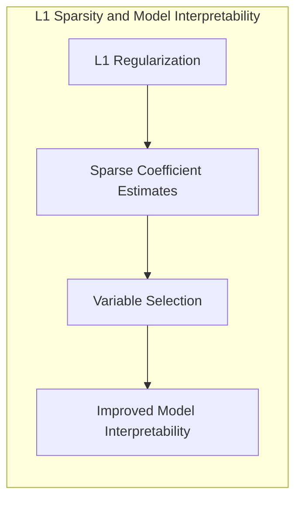
> ⚠️ **Ponto Crucial**: As penalidades L1 e L2 podem ser combinadas através do *Elastic Net* para aproveitar as vantagens de ambos os tipos de regularização [^4.5]. O *Elastic Net*  combina as penalidades L1 e L2 com parâmetros que controlam a influência de cada uma, resultando numa forma mais flexível de regularização: $$ \lambda_1 \sum_j |\beta_j| +  \lambda_2 \sum_j \beta_j^2$$.

### Separating Hyperplanes e Perceptrons
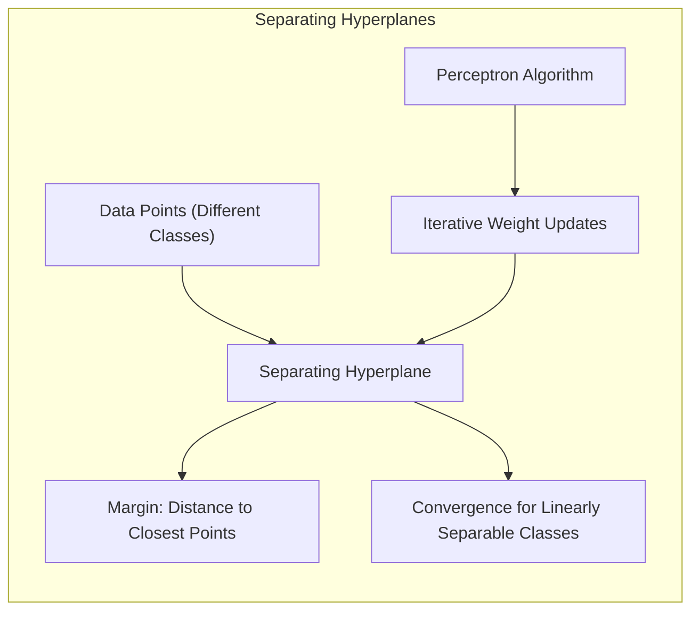
A ideia de maximizar a margem de separação entre classes leva ao conceito de hiperplanos ótimos, que são fundamentais para o desenvolvimento de *Support Vector Machines* (SVMs). O objetivo é encontrar o hiperplano que maximiza a distância entre o ponto de menor distância em cada classe (pontos de suporte) [^4.5.2].
O problema de otimização é então formulado para encontrar este hiperplano, onde os coeficientes são obtidos como combinação linear dos pontos de suporte. O método *Perceptron*, conforme discutido em [^4.5.1], busca ajustar um hiperplano de separação através de um processo iterativo, onde os pesos são atualizados a cada erro de classificação. Embora o Perceptron seja um algoritmo simples, sua convergência é garantida apenas quando as classes são linearmente separáveis [^4.5.1].

### Pergunta Teórica Avançada: Quais as diferenças fundamentais entre a formulação de LDA e a Regra de Decisão Bayesiana considerando distribuições Gaussianas com covariâncias iguais?

**Resposta:**

A **Linear Discriminant Analysis (LDA)** e a **Regra de Decisão Bayesiana** são métodos de classificação que, em certas condições, podem levar a decisões similares, mas que partem de formulações distintas. A LDA é um método paramétrico que busca encontrar o limite de decisão linear que melhor separa as classes, assumindo distribuições Gaussianas com a mesma matriz de covariância [^4.3]. A regra de decisão Bayesiana, por outro lado, é uma abordagem teórica que busca classificar um dado ponto na classe que maximiza a probabilidade a posteriori.
A LDA, ao assumir que as classes seguem uma distribuição normal multivariada com mesma matriz de covariância, leva a fronteiras de decisão lineares, de forma que o cálculo da probabilidade a posteriori se torna mais simples, por meio de uma transformação linear nos dados. Formalmente, a LDA encontra um hiperplano que maximiza a separabilidade entre as classes, projetando os dados ao longo de uma direção que maximize a distância entre as médias das classes, e a regra de decisão classifica um ponto na classe que produz maior valor da função discriminante [^4.3], [^4.3.1].
Quando as classes seguem distribuições Gaussianas com mesma matriz de covariância, a regra de decisão Bayesiana também leva a um limite de decisão linear. Isso ocorre porque a razão das densidades de probabilidade (log-likelihood ratio)  se reduz a uma função linear de x. Em resumo, nessas condições específicas, ambos os métodos levam a um resultado semelhante, mas partindo de formulações distintas, sendo que a LDA parte de premissas mais fortes quanto a forma das distribuições dos dados, enquanto a decisão Bayesiana é um resultado teórico que busca otimizar a probabilidade de classificação, mas com maior dificuldade para aplicação em problemas reais [^4.3.3].

**Lemma 4: Equivalência Formal LDA e Decisão Bayesiana (Gaussianas)**

*Lemma 4:* *Sob a premissa de distribuições Gaussianas com covariâncias iguais, a LDA é formalmente equivalente à regra de decisão Bayesiana, no sentido de que ambos os métodos levam ao mesmo hiperplano de decisão.*

Se as classes $k=1, ..., K$ seguem distribuições Gaussianas multivariadas $N(\mu_k, \Sigma)$ com a mesma matriz de covariância $\Sigma$, então a regra Bayesiana classifica $x$ na classe k que maximiza a probabilidade a posteriori
$P(C_k | x) = \frac{P(x| C_k) P(C_k)}{P(x)}$. Usando a premissa de densidade gaussiana, temos que maximizar:
$$  \log(P(x|C_k)) + \log(P(C_k)) = -\frac{1}{2}(x-\mu_k)^T \Sigma^{-1} (x - \mu_k) + \log(P(C_k)) $$
Ao expandir e simplificar essa equação, e reconhecendo que o primeiro termo $-x^T\Sigma^{-1}x$ é comum em todas as classes, o resultado é uma função linear de x, mostrando a equivalência com a LDA, com os parâmetros determinados por $\mu_k, \Sigma$ e  $P(C_k)$ [^4.3].
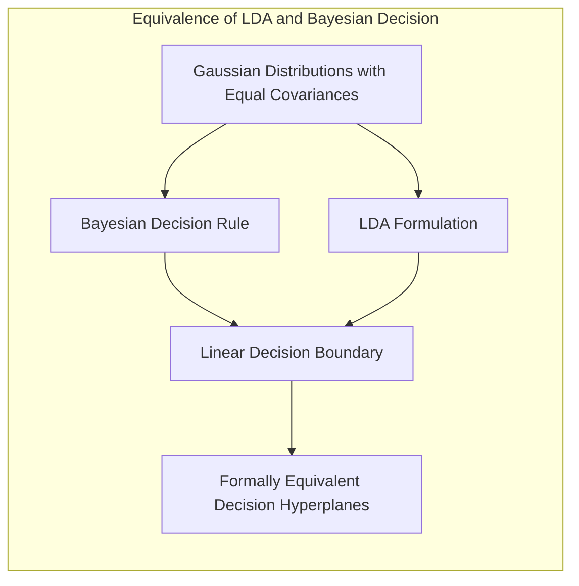

$\blacksquare$

> 💡 **Exemplo Numérico:** Vamos ilustrar a equivalência com um exemplo simplificado. Suponha que temos duas classes (k=1 e k=2) e os dados seguem distribuições Gaussianas com médias $\mu_1 = [1,1]$ e $\mu_2 = [3,3]$, e a mesma matriz de covariância $\Sigma = \begin{bmatrix} 1 & 0 \\ 0 & 1 \end{bmatrix}$. Assumindo probabilidades a priori iguais ($P(C_1)=P(C_2)=0.5$), a regra de decisão Bayesiana consiste em comparar as densidades gaussianas nos dois grupos, ou seja, decidir pela classe que tem maior probabilidade a posteriori para um novo ponto. A função de decisão bayesiana (diferença logarítmica das densidades) se torna:
>
> $g(x) = \log(P(x|C_1)) - \log(P(x|C_2)) = -\frac{1}{2}(x-\mu_1)^T\Sigma^{-1}(x-\mu_1) + \frac{1}{2}(x-\mu_2)^T\Sigma^{-1}(x-\mu_2)$
>
> Substituindo os valores, e simplificando a equação, chegamos a uma forma linear de x, que corresponde ao limite de decisão da LDA.  Neste caso, a função de decisão será $ g(x) = 4x_1 + 4x_2 - 20$. Portanto, um novo ponto $x = [x_1, x_2]$ será classificado na classe 1 se $g(x) > 0$, e na classe 2 se $g(x) < 0$, confirmando a equivalência com o limite de decisão da LDA.

**Corolário 4: Fronteiras Quadráticas e QDA**

*Corolário 4:* *Quando a suposição de covariâncias iguais é relaxada, a regra de decisão Bayesiana leva a fronteiras quadráticas de decisão, originando o método Quadratic Discriminant Analysis (QDA).*

Quando as classes têm matrizes de covariância diferentes, $\Sigma_k$, o termo quadrático $-x^T\Sigma^{-1}x$ não se cancela e o termo relevante para decisão de classe torna-se uma função quadrática de x, levando a um limite de decisão não linear [^4.3]. Isso dá origem ao método *Quadratic Discriminant Analysis* (QDA) que usa fronteiras quadráticas para classificar instâncias [^4.3].
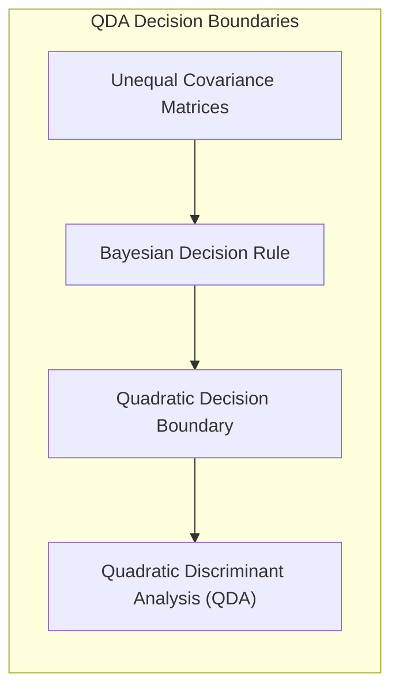
> ⚠️ **Ponto Crucial**: A escolha de covariâncias iguais ou diferentes tem forte impacto na natureza das fronteiras de