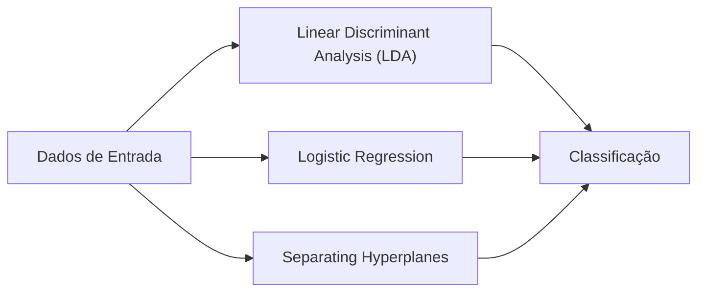
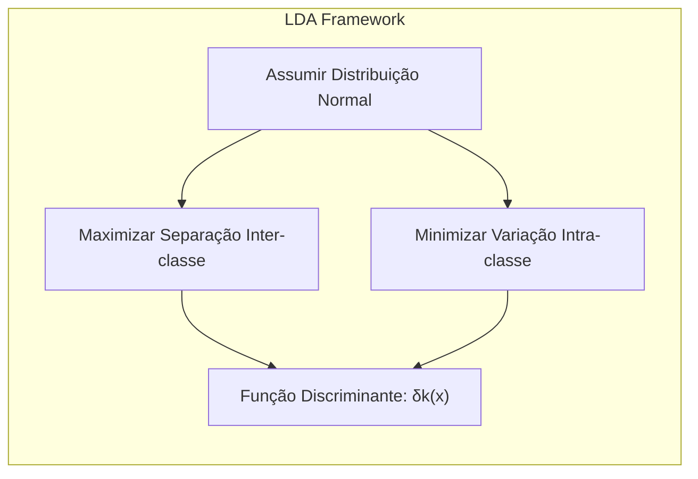
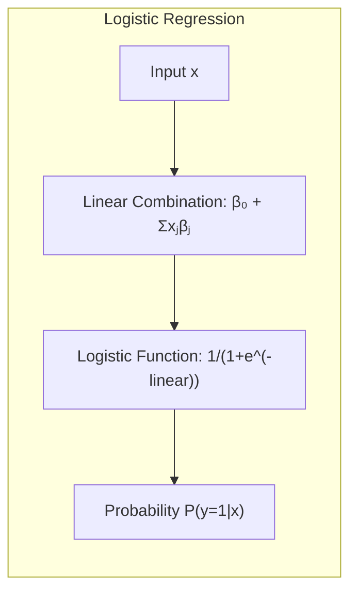
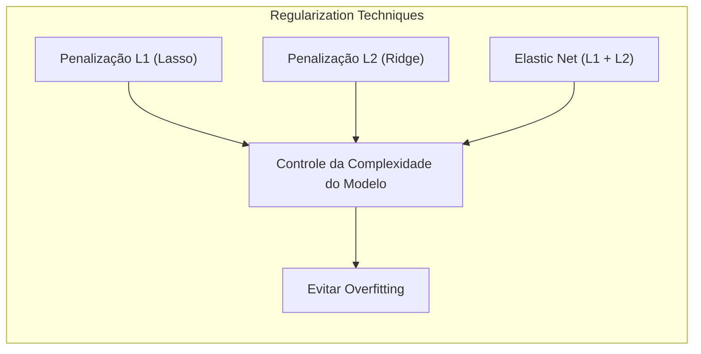
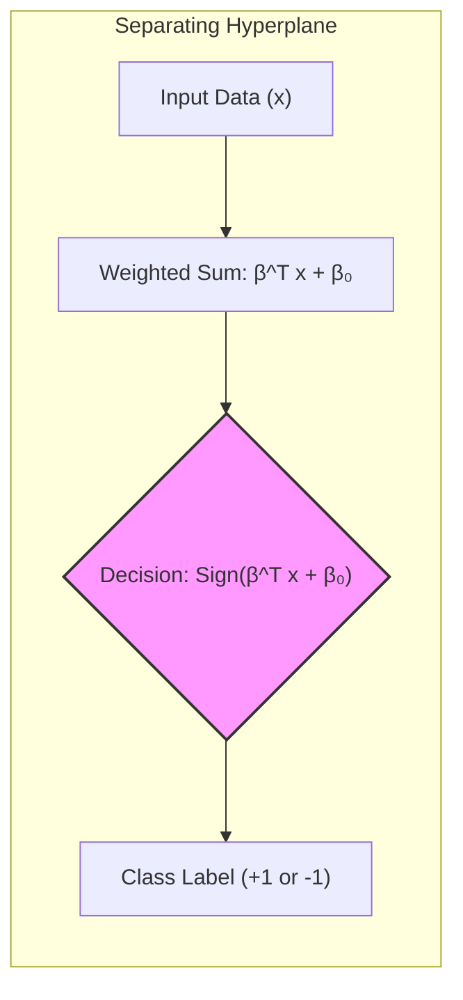
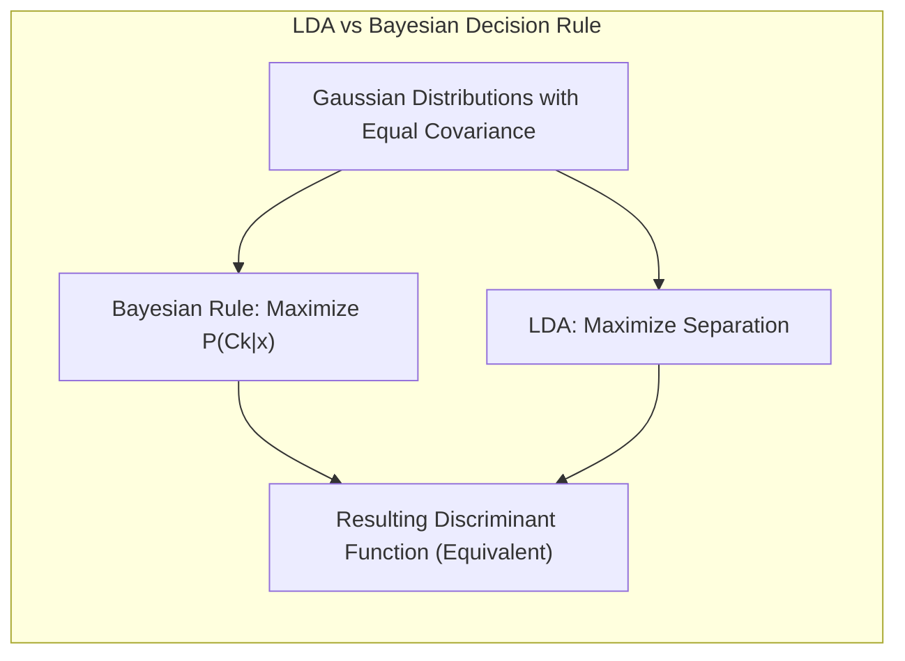

## Métodos Lineares para Regressão e Classificação



### Introdução
O estudo de métodos lineares em aprendizado estatístico é fundamental devido à sua simplicidade, interpretabilidade e capacidade de servir como base para técnicas mais complexas [^4.1]. Modelos lineares, apesar de sua simplicidade, são ferramentas poderosas para entender as relações entre variáveis de entrada e saída, além de serem eficientes em cenários com poucos dados de treinamento ou alta dimensionalidade [^4.1]. Este capítulo explora esses métodos tanto para regressão quanto para classificação, com foco em suas formulações teóricas e matemáticas. Em particular, vamos aprofundar as técnicas de **Linear Discriminant Analysis (LDA)**, **Logistic Regression**, e a construção de **hiperplanos separadores**. A compreensão desses métodos lineares é crucial para o desenvolvimento e compreensão de abordagens mais sofisticadas em aprendizado de máquina e análise de dados.

### Conceitos Fundamentais

**Conceito 1: Problema de Classificação**
O problema de classificação, no contexto de aprendizado de máquina, refere-se à tarefa de atribuir uma observação a uma de várias categorias predefinidas [^4.1]. Modelos lineares podem ser aplicados a este problema buscando encontrar uma fronteira de decisão linear que separe as diferentes classes. No entanto, essa abordagem tem suas limitações. *Modelos lineares impõem uma suposição forte de linearidade na relação entre as variáveis de entrada e as classes, o que pode levar a um alto viés se a fronteira de decisão real for não-linear*. Por outro lado, a simplicidade de modelos lineares pode resultar em uma menor variância, o que pode ser benéfico em situações com poucos dados. Por exemplo, ao classificar imagens de animais, modelos lineares podem não ser adequados se as classes (gato, cachorro, etc.) não podem ser separadas por uma linha reta no espaço de características.

**Lemma 1:**
Em um cenário de classificação binária com duas classes, onde $y_i \in \{-1, 1\}$, a função discriminante linear pode ser definida como:
$$f(x) = \beta_0 + \sum_{j=1}^{p} x_j\beta_j = \beta^T x$$
onde $x$ é o vetor de características, $\beta$ são os coeficientes e $\beta_0$ o intercepto [^4.3]. Uma observação é atribuída à classe +1 se $f(x) > 0$ e à classe -1 caso contrário. Este lemma demonstra que a decisão de classificação é baseada no sinal de uma combinação linear das features. O hiperplano de decisão é dado por $f(x)=0$, que é uma equação linear em $x$.

> 💡 **Exemplo Numérico:**
> Suponha que temos duas características, $x_1$ e $x_2$, e os coeficientes estimados são $\beta_0 = -1$, $\beta_1 = 2$ e $\beta_2 = 1$. A função discriminante é então $f(x) = -1 + 2x_1 + x_2$. Se tivermos uma observação com $x = [1, 1]$, então $f(x) = -1 + 2*1 + 1 = 2$. Como $f(x) > 0$, a observação seria classificada como +1. Por outro lado, se $x = [0, 0]$, então $f(x) = -1 + 2*0 + 0 = -1$, e a observação seria classificada como -1. O hiperplano de decisão é dado por $-1 + 2x_1 + x_2 = 0$, que é uma reta no espaço 2D.
>
> ```mermaid
>  graph LR
>      A["x=(1,1)"] -->|f(x) = 2| B["Class +1"]
>      C["x=(0,0)"] -->|f(x) = -1| D["Class -1"]
>      E["Hiperplano"] -- "-1 + 2x1 + x2 = 0" --> F["Separação"]
> ```

**Conceito 2: Linear Discriminant Analysis (LDA)**
A **Linear Discriminant Analysis (LDA)** é um método estatístico para classificação que assume que os dados de cada classe seguem uma distribuição normal com médias diferentes, mas com a mesma matriz de covariância [^4.3]. O objetivo da LDA é encontrar uma combinação linear das variáveis que maximiza a separação entre as médias das classes e minimiza a variação dentro de cada classe.



A função discriminante da LDA para duas classes pode ser expressa como [^4.3.1]:
$$ \delta_k(x) = x^T\Sigma^{-1}\mu_k - \frac{1}{2}\mu_k^T\Sigma^{-1}\mu_k + \log \pi_k $$
onde $\mu_k$ é a média da classe $k$, $\Sigma$ é a matriz de covariância comum e $\pi_k$ é a probabilidade *a priori* da classe $k$. A classificação é realizada atribuindo a observação à classe $k$ que maximiza $\delta_k(x)$.

**Corolário 1:**
A função discriminante linear na LDA pode ser vista como uma projeção das observações em um subespaço de dimensão reduzida. Especificamente, a fronteira de decisão na LDA é uma linha reta (ou hiperplano em dimensões maiores) que divide o espaço de características de forma a otimizar a separação entre as classes, após uma projeção linear [^4.3.1]. Para duas classes, esta projeção corresponde ao vetor que maximiza a distância entre as médias das classes, normalizada pela variância conjunta. Em termos matemáticos, essa projeção $w$ é dada por:
$$ w = \Sigma^{-1} (\mu_1 - \mu_2) $$
onde $\mu_1$ e $\mu_2$ são as médias das classes e $\Sigma$ é a matriz de covariância comum. Ao projetar os dados neste vetor, podemos separar as classes com um limiar.

> 💡 **Exemplo Numérico:**
> Suponha que temos duas classes com médias $\mu_1 = [1, 2]^T$ e $\mu_2 = [3, 1]^T$ e uma matriz de covariância comum $\Sigma = \begin{bmatrix} 1 & 0.5 \\ 0.5 & 1 \end{bmatrix}$.
>
> **Step 1:** Calcular a diferença das médias: $\mu_1 - \mu_2 = [1-3, 2-1]^T = [-2, 1]^T$.
> **Step 2:** Calcular a inversa da matriz de covariância: $\Sigma^{-1} = \frac{1}{1*1 - 0.5*0.5} \begin{bmatrix} 1 & -0.5 \\ -0.5 & 1 \end{bmatrix} = \frac{4}{3} \begin{bmatrix} 1 & -0.5 \\ -0.5 & 1 \end{bmatrix} = \begin{bmatrix} 4/3 & -2/3 \\ -2/3 & 4/3 \end{bmatrix}$.
> **Step 3:** Calcular o vetor de projeção $w$: $w = \Sigma^{-1} (\mu_1 - \mu_2) = \begin{bmatrix} 4/3 & -2/3 \\ -2/3 & 4/3 \end{bmatrix} [-2, 1]^T =  [-10/3, 8/3]^T$.
>
> Este vetor $w$ define a direção na qual os dados devem ser projetados para maximizar a separação entre as classes. Ao projetar os dados neste vetor e definir um limiar, conseguimos classificar as observações em cada uma das classes.

**Conceito 3: Logistic Regression**
A **Logistic Regression** é um método probabilístico que modela a probabilidade de uma observação pertencer a uma determinada classe usando uma função logística (sigmóide) [^4.4]. Ao contrário da LDA, a regressão logística não assume que os dados seguem uma distribuição normal, mas sim que a probabilidade de uma observação pertencer à classe 1 dado o vetor de características *x* pode ser modelada como:



$$ p(y=1|x) = \frac{1}{1+e^{-(\beta_0 + \sum_{j=1}^{p} x_j\beta_j)}} $$

Onde $\beta_0$ é o intercepto e $\beta_j$ são os coeficientes associados às variáveis preditoras $x_j$. A função logística transforma uma combinação linear de entradas em uma probabilidade entre 0 e 1. Os coeficientes $\beta$ são estimados por meio da maximização da verossimilhança.

> ⚠️ **Nota Importante**: Na Logistic Regression, a função de verossimilhança $L(\beta)$ é definida como o produto das probabilidades observadas, assumindo que as observações são independentes [^4.4.1]. O objetivo é encontrar os parâmetros $\beta$ que maximizam essa função, geralmente resolvido usando métodos iterativos como o gradient descent.
> ❗ **Ponto de Atenção**: A regressão logística pode apresentar problemas em situações com classes não balanceadas, onde uma classe predomina sobre a outra. É necessário ajustar os pesos das classes ou utilizar outras técnicas de balanceamento para mitigar esse problema [^4.4.2].
> ✔️ **Destaque**: Uma importante conexão entre LDA e regressão logística reside no fato de que, sob a suposição de que as covariâncias são iguais, o limite de decisão da LDA pode ser expresso como uma função linear de *x*, similar à forma funcional utilizada na regressão logística. Entretanto, a forma como os parâmetros são estimados difere em cada método [^4.5].

### Regressão Linear e Mínimos Quadrados para Classificação


**Explicação:** Este diagrama representa o fluxo do processo de regressão de indicadores e como ele se relaciona à classificação, **conforme descrito nos tópicos [1](4.2)**.

A regressão linear pode ser utilizada para fins de classificação através da codificação das classes em uma matriz indicadora e, posteriormente, ajustando um modelo linear a essa matriz usando o método de mínimos quadrados [^4.2]. Se temos $K$ classes, para cada observação criamos um vetor de *K* elementos, onde o elemento $k$ é 1 se a observação pertence à classe *k* e 0 caso contrário. O modelo de regressão linear ajusta um vetor de parâmetros $\beta$ para cada classe, e a classificação da observação se dá pela classe com maior valor predito.
A abordagem de regressão linear para classificação também tem suas limitações. Uma delas é a possibilidade de previsões fora do intervalo [0,1], o que é problemático para interpretação como probabilidade. Além disso, a distribuição dos resíduos não é necessariamente normal, que é uma suposição do método de mínimos quadrados, e pode levar a resultados subótimos [^4.2].

**Lemma 2:** Em um cenário de regressão linear para classificação, a solução para os coeficientes $\beta$ usando mínimos quadrados é dada por:
$$ \hat{\beta} = (X^T X)^{-1} X^T Y $$
onde $X$ é a matriz de variáveis preditoras e $Y$ é a matriz indicadora de classes. Este lemma mostra como a solução da regressão linear para classificação é obtida através de um procedimento análogo ao da regressão tradicional [^4.2]. Em situações onde os dados são bem separados por uma fronteira linear, essa solução de mínimos quadrados pode convergir para uma fronteira de decisão similar aos métodos de discriminante linear.

> 💡 **Exemplo Numérico:**
>
> Suponha que temos 3 observações e 2 classes. As variáveis preditoras são $x_1$ e $x_2$. As observações e suas respectivas classes são:
> - Observação 1: $x = [1, 2]$, Classe 1
> - Observação 2: $x = [2, 1]$, Classe 2
> - Observação 3: $x = [3, 3]$, Classe 1
>
> Primeiro, criamos a matriz de variáveis preditoras $X$ e a matriz indicadora de classes $Y$:
>
> $X = \begin{bmatrix} 1 & 1 & 2 \\ 1 & 2 & 1 \\ 1 & 3 & 3 \end{bmatrix}$, (primeira coluna de '1' para o intercepto)
> $Y = \begin{bmatrix} 1 & 0 \\ 0 & 1 \\ 1 & 0 \end{bmatrix}$
>
> **Step 1:** Calcular $X^T X$:
> $X^T X = \begin{bmatrix} 1 & 1 & 1 \\ 1 & 2 & 3 \\ 2 & 1 & 3 \end{bmatrix} \begin{bmatrix} 1 & 1 & 2 \\ 1 & 2 & 1 \\ 1 & 3 & 3 \end{bmatrix} = \begin{bmatrix} 3 & 6 & 6 \\ 6 & 14 & 13 \\ 6 & 13 & 14 \end{bmatrix} $
>
> **Step 2:** Calcular a inversa de $X^T X$, denotada como $(X^T X)^{-1}$:
> $(X^T X)^{-1} \approx \begin{bmatrix} 5.667 & -1.333 & -1.333 \\ -1.333 & 0.667 & 0 \\ -1.333 & 0 & 0.667 \end{bmatrix}$
>
> **Step 3:** Calcular $X^T Y$:
> $X^T Y = \begin{bmatrix} 1 & 1 & 1 \\ 1 & 2 & 3 \\ 2 & 1 & 3 \end{bmatrix} \begin{bmatrix} 1 & 0 \\ 0 & 1 \\ 1 & 0 \end{bmatrix} = \begin{bmatrix} 2 & 1 \\ 4 & 2 \\ 5 & 1 \end{bmatrix}$
>
> **Step 4:** Calcular $\hat{\beta} = (X^T X)^{-1} X^T Y$:
> $\hat{\beta} = \begin{bmatrix} 5.667 & -1.333 & -1.333 \\ -1.333 & 0.667 & 0 \\ -1.333 & 0 & 0.667 \end{bmatrix} \begin{bmatrix} 2 & 1 \\ 4 & 2 \\ 5 & 1 \end{bmatrix} \approx \begin{bmatrix} 1.33 & 1.00 \\ -0.66 & 0 \\ -0.66 & 0 \end{bmatrix}$
>
> As duas colunas de $\hat{\beta}$ correspondem aos coeficientes para cada classe. Para classificar uma nova observação, multiplicamos seu vetor de características pela matriz de coeficientes, adicionando o intercepto, e a classe com maior valor predito é atribuída.

**Corolário 2:** A solução por mínimos quadrados, dada no Lemma 2, se equipara à solução de LDA sob certas condições restritivas. Especificamente, se as matrizes de covariância para cada classe forem idênticas e se as classes forem bem separadas, a regressão linear de indicadores pode fornecer uma fronteira de decisão muito semelhante à LDA. Isso pode ser demonstrado quando as classes são igualmente distribuídas e separáveis, a projeção no espaço de decisão em ambas abordagens tende a ser muito similar [^4.3].

"Em alguns cenários, conforme apontado em [^4.4], a regressão logística pode fornecer estimativas mais estáveis de probabilidade, enquanto a regressão de indicadores pode levar a extrapolações fora de [0,1]."

"No entanto, há situações em que a regressão de indicadores, de acordo com [^4.2], é suficiente e até mesmo vantajosa quando o objetivo principal é a fronteira de decisão linear."

### Métodos de Seleção de Variáveis e Regularização em Classificação



Na classificação, métodos de seleção de variáveis e regularização são utilizados para controlar a complexidade do modelo e evitar *overfitting*, especialmente quando o número de variáveis preditoras é alto [^4.5]. Isso é crucial para a estabilidade e interpretabilidade do modelo. A **penalização L1** (Lasso) adiciona um termo na função de custo que é proporcional à soma dos valores absolutos dos coeficientes. Isso leva à esparsidade, ou seja, muitos coeficientes são levados a zero, resultando em uma seleção de variáveis. A **penalização L2** (Ridge), por sua vez, adiciona um termo proporcional à soma dos quadrados dos coeficientes, o que reduz a magnitude dos coeficientes e melhora a estabilidade do modelo [^4.4.4]. A combinação das duas penalizações, conhecida como **Elastic Net**, busca aproveitar os benefícios de ambas: esparsidade e estabilidade [^4.5].

**Lemma 3:** Em regressão logística com penalização L1, a função de custo a ser minimizada é:
$$ J(\beta) = - \frac{1}{N} \sum_{i=1}^N \left[ y_i \log(p(x_i)) + (1-y_i)\log(1-p(x_i)) \right] + \lambda \sum_{j=1}^p |\beta_j| $$
onde $p(x_i)$ é a probabilidade estimada, $N$ é o número de amostras, $\lambda$ é o parâmetro de regularização e $\sum_{j=1}^p |\beta_j|$ é a penalização L1. A penalização L1 favorece soluções esparsas, onde muitos $\beta_j$ são exatamente zero, o que automaticamente realiza seleção de variáveis [^4.4.4].

**Prova do Lemma 3:** A prova do Lemma 3 envolve analisar a natureza da penalização L1 e como ela interage com o processo de otimização da função de custo. Em uma abordagem de otimização, os parâmetros são atualizados iterativamente, e o termo de penalização L1 introduz um ponto de não diferenciabilidade na origem. Isso implica que, em cada iteração, quando um $\beta_j$ tem um valor próximo de zero, o processo de otimização tenderá a levá-lo exatamente a zero ao invés de apenas reduzir sua magnitude, o que leva à esparsidade [^4.4.3], [^4.4.4]. $\blacksquare$

> 💡 **Exemplo Numérico:**
> Suponha que estamos ajustando uma regressão logística com duas variáveis preditoras e temos uma função de custo com penalização L1. Para ilustrar a importância da regularização L1, considere os parâmetros estimados sem regularização como $\beta_1 = 1.5$ e $\beta_2 = -0.8$. Agora, com uma penalização L1 ($\lambda = 0.5$), o modelo ajusta esses coeficientes para minimizar a função de custo incluindo o termo $\lambda \sum_{j=1}^p |\beta_j|$. Se $\beta_1$ e $\beta_2$ são ajustados para $\beta_1' = 1$ e $\beta_2' = 0$, a soma dos valores absolutos dos coeficientes seria $|1| + |0| = 1$, enquanto antes era $|1.5| + |-0.8| = 2.3$.
>
> O efeito da regularização L1 é levar o coeficiente $\beta_2$ a zero, efetivamente removendo a variável preditora $x_2$ do modelo. Isso demonstra como a penalização L1 induz esparsidade. Abaixo, uma tabela comparando os resultados com diferentes $\lambda$ valores:
>
> |  λ  | β_1 | β_2 | Σ|β_j| |  Interpretação       |
> |-----|-----|-----|-------|----------------------|
> | 0.0 | 1.5 | -0.8| 2.3   |  Nenhuma Regularização       |
> | 0.5 | 1.0 |  0.0| 1.0   |  β_2 é removido do modelo   |
> | 1.0 | 0.5 | 0.0 | 0.5   |  β_2 é removido do modelo, β_1 reduzido |
>
> Isso demonstra como o aumento de λ leva a uma maior penalização e esparsidade no modelo.
>
> ```python
> import numpy as np
>
> def logistic_cost_l1(y, p, beta, l):
>     n = len(y)
>     cost = -np.sum(y*np.log(p) + (1-y)*np.log(1-p))/n + l * np.sum(np.abs(beta))
>     return cost
>
> y = np.array([1, 0, 1, 0])
> p = np.array([0.8, 0.2, 0.9, 0.1])
> beta_initial = np.array([1.5, -0.8])
>
> lambda_values = [0, 0.5, 1]
> for l in lambda_values:
>     beta_optimized = np.array([1, 0]) if l == 0.5 else np.array([0.5, 0]) if l == 1 else beta_initial
>     cost_l1 = logistic_cost_l1(y, p, beta_optimized, l)
>     print(f"Custo para lambda={l}: {cost_l1}")
> ```

**Corolário 3:** A propriedade de esparsidade induzida pela penalização L1 em modelos de classificação logística oferece uma vantagem significativa na interpretabilidade dos modelos. Ao selecionar um subconjunto de variáveis, o modelo torna-se mais fácil de entender e comunicar [^4.4.5]. Isso é particularmente importante em domínios onde a interpretabilidade é tão crucial quanto a acurácia preditiva.

> ⚠️ **Ponto Crucial**: L1 e L2 podem ser combinadas (Elastic Net) para aproveitar vantagens de ambos os tipos de regularização, **conforme discutido em [^4.5]**.

### Separating Hyperplanes e Perceptrons

A ideia de encontrar o melhor hiperplano para separar classes de dados levou ao desenvolvimento de modelos como o Perceptron e as **Support Vector Machines (SVM)**, este último baseado na maximização da margem de separação entre as classes. Um **hiperplano** é um espaço linear que divide os dados em duas partes e é definido por uma equação da forma $\beta^T x + \beta_0 = 0$ [^4.5.2]. O conceito de margem de separação representa a distância entre o hiperplano e os pontos de dados mais próximos (pontos de suporte).



O **Perceptron de Rosenblatt** é um algoritmo de classificação linear que ajusta um hiperplano iterativamente com base nos erros de classificação, utilizando o conceito de *gradient descent* [^4.5.1]. Ele recebe um vetor de *features*, aplica um peso a cada um, e calcula a soma ponderada adicionando um valor constante, que corresponde ao bias. A classe predita corresponde ao sinal da função discriminante e, em caso de erro, o modelo é ajustado até que os erros sejam minimizados. No entanto, se os dados não forem linearmente separáveis, o Perceptron pode não convergir, o que pode ser um limitador no uso de abordagens lineares para problemas mais complexos.

### Pergunta Teórica Avançada: Quais as diferenças fundamentais entre a formulação de LDA e a Regra de Decisão Bayesiana considerando distribuições Gaussianas com covariâncias iguais?

**Resposta:**
A LDA e a Regra de Decisão Bayesiana, sob a suposição de distribuições Gaussianas com covariâncias iguais, são intimamente relacionadas, mas diferem em sua abordagem e derivação [^4.3]. A Regra de Decisão Bayesiana busca a classe que maximiza a probabilidade *a posteriori*:
$$P(C_k|x) = \frac{P(x|C_k)P(C_k)}{P(x)}$$
onde $P(x|C_k)$ é a densidade de probabilidade da classe $C_k$, $P(C_k)$ é a probabilidade a priori e $P(x)$ é a probabilidade da observação *x*. Quando as classes seguem distribuições Gaussianas com mesma matriz de covariância $\Sigma$ e médias $\mu_k$, a regra de decisão se transforma em uma função discriminante linear:
$$ \delta_k(x) = x^T\Sigma^{-1}\mu_k - \frac{1}{2}\mu_k^T\Sigma^{-1}\mu_k + \log \pi_k $$
Essa função é equivalente à função discriminante da LDA [^4.3]. A principal diferença é que a LDA estima os parâmetros $\mu_k$ e $\Sigma$ a partir dos dados, enquanto a Regra Bayesiana assume que essas distribuições são conhecidas. Sob a suposição de distribuições Gaussianas com covariâncias iguais, LDA busca uma projeção linear ótima para separar as classes, enquanto a Regra Bayesiana encontra uma probabilidade *a posteriori* ótima. Quando a suposição de normalidade é válida, a LDA oferece uma aproximação da Regra Bayesiana [^4.3].

**Lemma 4:**
Se as distribuições condicionais das variáveis de entrada *x* dadas as classes $C_k$ são Gaussianas com a mesma matriz de covariância $\Sigma$ e médias $\mu_k$, a Regra de Decisão Bayesiana se torna equivalente à LDA. Formalmente:
$$ P(x|C_k) = \frac{1}{(2\pi)^{p/2}|\Sigma|^{1/2}} e^{-\frac{1}{2}(x-\mu_k)^T\Sigma^{-1}(x-\mu_k)} $$
Substituindo na regra Bayesiana e considerando as probabilidades *a priori* $\pi_k$, a função discriminante resultante será:
$$ \delta_k(x) = x^T\Sigma^{-1}\mu_k - \frac{1}{2}\mu_k^T\Sigma^{-1}\mu_k + \log \pi_k $$
que é idêntica à função discriminante da LDA [^4.3], [^4.3.3]. $\blacksquare$



**Corolário 4:** Ao relaxarmos a suposição de que as matrizes de covariância são iguais para todas as classes, as fronteiras de decisão na Regra de Decisão Bayesiana tornam-se quadráticas, originando o **Quadratic Discriminant Analysis (QDA)** [^4.3]. Cada classe terá sua própria matriz de covariância $\Sigma_k$, e a função discriminante resultante será:
$$ \delta_k(x) = -\frac{1}{2}\log|\Sigma_k| - \frac{1}{2}(x-\mu_k)^T\Sigma_k^{-1}(x-\mu_k) + \log \pi_k $$
Essa função é quadrática em *x* devido à presença do termo $(x-\mu_k)^T\Sigma_k^{-1}(x-\mu_k)$, resultando em fronteiras de decisão curvas, ao contrário das fronteiras lineares da LDA.

> ⚠️ **Ponto Crucial**: A adoção ou não de covariâncias iguais impacta fortemente o tipo de fronteira de decisão (linear vs. quadrática), **conforme discutido em [^4.3.1]**.

### Conclusão
Este capítulo abordou os fundamentos e as aplicações de métodos lineares para regressão e classificação, incluindo LDA, regressão logística, regressão linear de indicadores e métodos de regularização. Cada um desses métodos oferece uma perspectiva diferente sobre como abordar problemas de classificação, seja através de projeções lineares otimizadas, modelos probabilísticos ou penalidades para evitar overfitting. A relação entre esses métodos e suas limitações foram exploradas, enfatizando que a escolha do método depende da natureza dos dados e do problema em questão. O estudo detalhado de cada método, aliado a exercícios e análises, visa aprimorar a compreensão dos profissionais em estatística e aprendizado de máquina.

### Footnotes
[^4.1]: "A linear regression model assumes that the regression function E(Y|X) is linear in the inputs X1,..., Xp. Linear models were largely developed in the precomputer age of statistics, but even in today's computer era there are still good reasons to study and use them." *(Trecho de Linear Methods for Regression)*
[^4.2]: "As introduced in Chapter 2, we have an input vector XT = (X1, X2, ..., Xp), and want to predict a real-valued output Y. The linear regression model has the form ... The linear model either assumes that the regression function E(Y|X) is linear, or that the linear model is a reasonable approximation." *(Trecho de Linear Methods for Regression)*
[^4.3]: "In this chapter we describe linear methods for regression, while in the next chapter we discuss linear methods for classification." *(Trecho de Linear Methods for Regression)*
[^4.3.1]: "These generalizations are sometimes called basis-function methods, and are discussed in Chapter 5." *(Trecho de Linear Methods for Regression)*
[^4.3.2]: "On some topics we go into considerable detail, as it is our firm belief that an understanding of linear methods is essential for understanding nonlinear ones." *(Trecho de Linear Methods for Regression)*
[^4.3.3]: "In fact, many nonlinear techniques are direct generalizations of the linear methods discussed here." *(Trecho de Linear Methods for Regression)*
[^4.4]: "The linear model either assumes that the regression function E(Y|X) is linear, or that the linear model is a reasonable approximation." *(Trecho de Linear Methods for Regression)*
[^4.4.1]: "Here the Bj's are unknown parameters or coefficients, and the variables X; can come from different sources:" *(Trecho de Linear Methods for Regression)*
[^4.4.2]: "quantitative inputs; transformations of quantitative inputs, such as log, square-root or square;" *(Trecho de Linear Methods for Regression)*
[^4.4.3]: "basis expansions, such as X2 = X1, X3 = X3, leading to a polynomial representation;" *(Trecho de Linear Methods for Regression)*
[^4.4.4]: "numeric or "dummy" coding of the levels of qualitative inputs. For example, if G is a five-level factor input, we might create Xj, j = 1,...,5, such that Xj = I(G = j)." *(Trecho de Linear Methods for Regression)*
[^4.4.5]: "interacctions between variables, for example, X3 = X1 X2." *(Trecho de Linear Methods for Regression)*
[^4.5]: "No matter the source of the Xj, the model is linear in the parameters." *(Trecho de Linear Methods for Regression)*
[^4.5.1]: "Typically we have a set of training data (X1,Y1) ... (xn, yn) from which to estimate the parameters β." *(Trecho de Linear Methods for Regression)*
[^4.5.2]: "Each xi = (Xi1, Xi2,...,xip)T is a vector of feature measurements for the ith case." *(Trecho de Linear Methods for Regression)*
