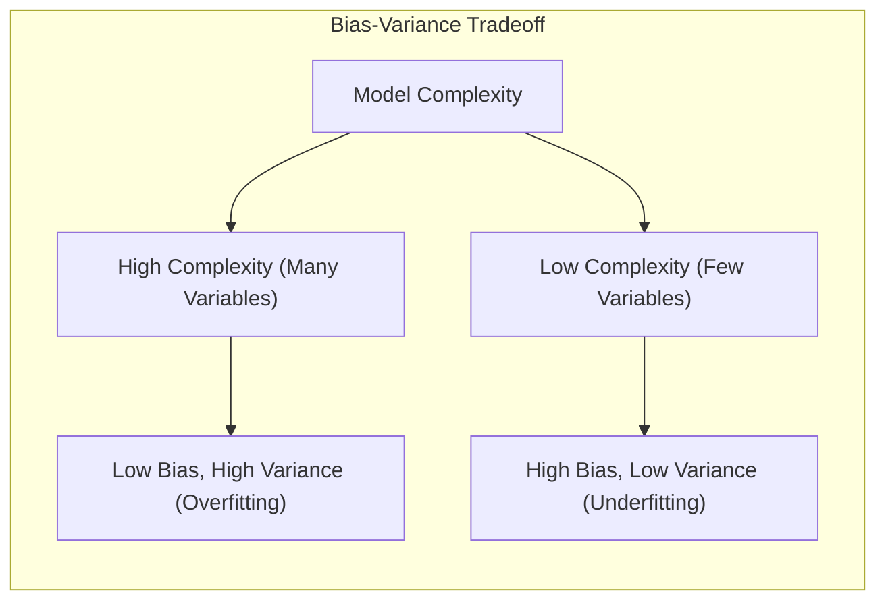
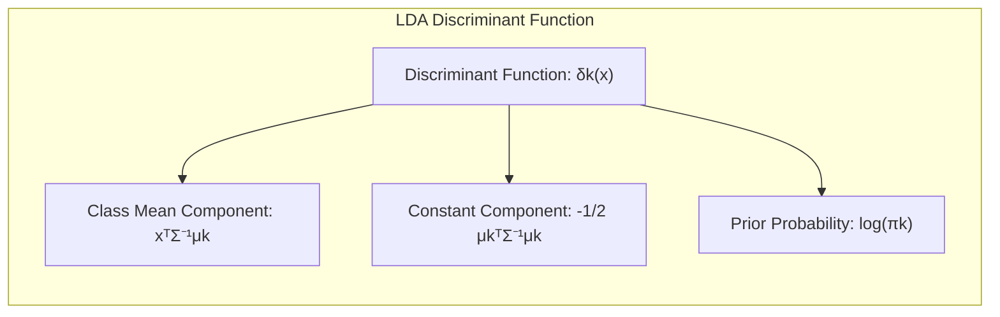
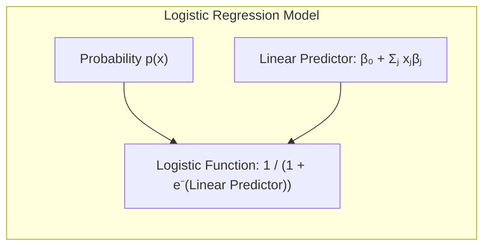
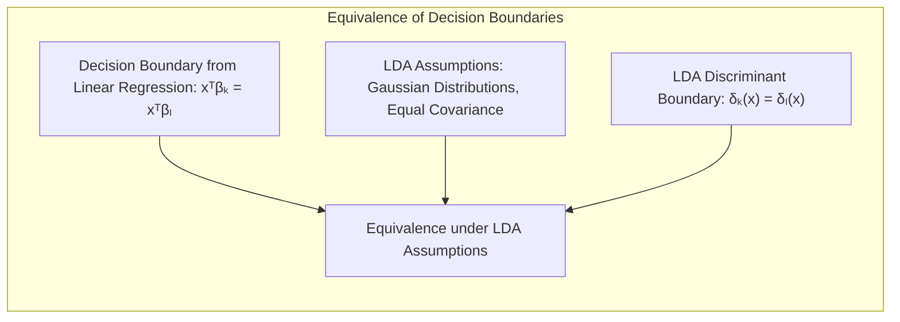
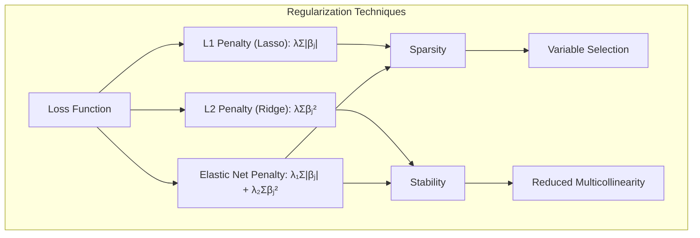
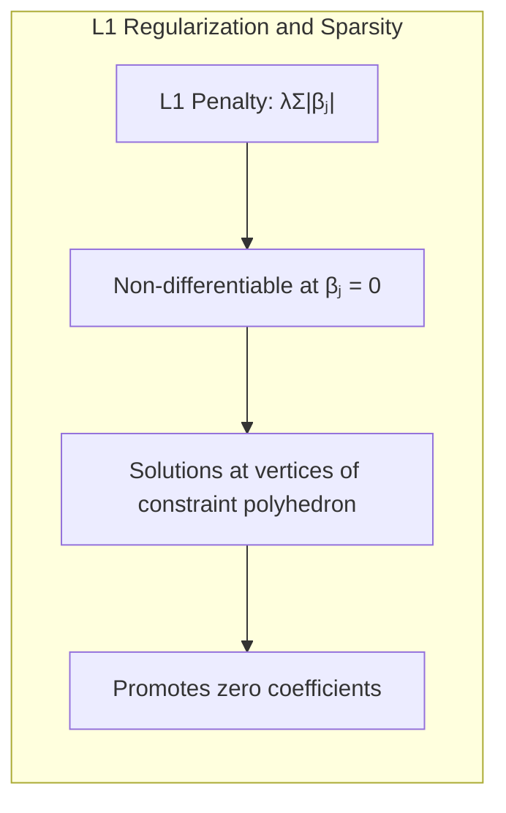

## Discussão sobre Seleção de Subconjuntos, Ridge Regression e Lasso
<imagem: Mapa mental abrangente que conecte os conceitos de seleção de subconjuntos, regressão ridge e lasso, mostrando suas características, vantagens, desvantagens e quando cada um é mais apropriado.>

### Introdução
Neste capítulo, exploraremos em profundidade o tema da **classificação e análise discriminante**, com foco em métodos lineares e técnicas de regularização. O objetivo é fornecer uma compreensão abrangente e avançada para profissionais experientes em Estatística e Aprendizado de Máquina. O ponto de partida é o reconhecimento de que modelos lineares, embora simples, são fundamentais para a construção de modelos mais complexos e para a compreensão de generalizações não lineares [^4.1]. Este capítulo aborda inicialmente conceitos básicos, aprofunda-se em métodos como Linear Discriminant Analysis (LDA) e Regressão Logística e culmina na discussão detalhada de técnicas de seleção de variáveis e regularização, incluindo a regressão ridge, o lasso e o conceito de hiperplanos separadores.

### Conceitos Fundamentais

**Conceito 1: O Problema da Classificação**

O problema da classificação, em sua essência, envolve a atribuição de observações a categorias predefinidas com base em um conjunto de *features* [^4.1]. Métodos lineares, como a regressão linear com uma matriz de indicadores, abordam este problema através da construção de *hyperplanes* que separam as classes [^4.2]. Em outras palavras, procuramos encontrar uma função linear da forma $$f(x) = \beta_0 + \sum_{j=1}^p x_j \beta_j$$, onde o sinal de $$f(x)$$ determina a classe predita.  Este processo, embora simples, está sujeito a um trade-off entre viés e variância, com modelos mais flexíveis que podem apresentar menor viés, mas maior variância [^4.1].  Por exemplo, ao ajustar um modelo linear complexo com muitas variáveis (alto grau de liberdade), podemos nos ajustar muito bem aos dados de treinamento (baixo viés), mas o modelo resultante pode não se generalizar bem para novos dados (alta variância). Inversamente, um modelo mais simples com menos variáveis pode ter um viés maior, mas, ao mesmo tempo, uma variância menor, apresentando melhor desempenho em novos dados [^4.1].

> 💡 **Exemplo Numérico:** Considere um problema de classificação binária com duas features ($x_1$ e $x_2$) e duas classes (0 e 1). Queremos modelar a classe usando um modelo linear. Suponha que tenhamos 10 observações de treinamento:
>  
> | Observação | $x_1$ | $x_2$ | Classe |
> |------------|-------|-------|--------|
> | 1          | 1     | 2     | 0      |
> | 2          | 2     | 1     | 0      |
> | 3          | 2     | 3     | 0      |
> | 4          | 3     | 2     | 0      |
> | 5          | 4     | 3     | 0      |
> | 6          | 5     | 6     | 1      |
> | 7          | 6     | 5     | 1      |
> | 8          | 6     | 7     | 1      |
> | 9          | 7     | 6     | 1      |
> | 10         | 7     | 8     | 1      |
>
> Um modelo linear simples pode ser $f(x) = \beta_0 + \beta_1 x_1 + \beta_2 x_2$. Se usarmos uma regressão linear para estimar $\beta$ (com a classe como variável dependente), poderíamos obter coeficientes como $\beta_0 = -2$, $\beta_1 = 0.5$ e $\beta_2 = 0.7$. A classe predita seria então determinada pelo sinal de $f(x)$. Por exemplo, para a observação 1, temos $f(1,2) = -2 + 0.5*1 + 0.7*2 = -0.1$, que prediz a classe 0, e para a observação 6, $f(5,6) = -2 + 0.5*5 + 0.7*6 = 4.7$, que prediz a classe 1. Observe que, mesmo que a regressão linear tenha baixo viés no conjunto de treinamento, ela pode se ajustar demais (alta variância) se usarmos muitas features, e isso pode levar a classificações incorretas em novos dados.

**Lemma 1:** *Em um problema de classificação com k classes, podemos codificar a resposta usando uma matriz de indicadores binários Y de dimensão NxK, onde cada linha representa uma observação e cada coluna corresponde a uma classe. A regressão linear aplicada a essa matriz de indicadores busca encontrar um conjunto de coeficientes \(\beta\) que minimizem a soma dos erros quadrados.* 

**Demonstração:** Seja \(Y\) uma matriz de indicadores de dimensão N × K. O modelo de regressão linear é dado por $$Y = X\beta + \epsilon$$, onde X é a matriz de preditores (N x p) e \(\beta\) é a matriz de coeficientes (p x K). O objetivo é encontrar \(\beta\) que minimize a soma dos quadrados dos erros, dada por: $$RSS(\beta) = \sum_{i=1}^{N} \sum_{k=1}^{K} (y_{ik} - x_i^T \beta_k)^2$$. Minimizar o RSS é equivalente a resolver as equações normais $$X^T X \beta = X^T Y$$, que nos levam a solução \(\hat{\beta} = (X^T X)^{-1} X^T Y\). A decisão da classe é feita comparando os valores preditos para cada classe, e escolhendo a classe com o maior valor. 
$\blacksquare$
> 💡 **Exemplo Numérico:** Considere um problema de classificação com 3 classes (A, B, C) e 2 features ($x_1$ e $x_2$). Temos 5 observações de treinamento:
>  
> | Observação | $x_1$ | $x_2$ | Classe |
> |------------|-------|-------|--------|
> | 1          | 1     | 2     | A      |
> | 2          | 2     | 1     | A      |
> | 3          | 2     | 3     | B      |
> | 4          | 3     | 2     | B      |
> | 5          | 4     | 3     | C      |
>
> A matriz de indicadores Y será uma matriz 5x3, com cada coluna representando uma classe (A, B, C):
>
> $$Y = \begin{bmatrix} 1 & 0 & 0 \\ 1 & 0 & 0 \\ 0 & 1 & 0 \\ 0 & 1 & 0 \\ 0 & 0 & 1 \end{bmatrix}$$
>
> A matriz X (matriz de preditores) será uma matriz 5x3 (considerando um intercepto):
>
> $$X = \begin{bmatrix} 1 & 1 & 2 \\ 1 & 2 & 1 \\ 1 & 2 & 3 \\ 1 & 3 & 2 \\ 1 & 4 & 3 \end{bmatrix}$$
>
> Usando a fórmula \(\hat{\beta} = (X^T X)^{-1} X^T Y\), podemos calcular a matriz de coeficientes $\beta$ (3x3 neste caso). Os valores preditos para cada observação serão $X\beta$, e a classe predita será a classe com o maior valor nessa matriz. Por exemplo, a primeira linha da matriz de valores preditos pode ser [0.8, 0.1, 0.1], então a classe predita seria A.

**Conceito 2: Linear Discriminant Analysis (LDA)**

A Linear Discriminant Analysis (LDA) é um método de classificação que assume que as classes seguem distribuições Gaussianas com mesma matriz de covariância [^4.3].  O objetivo da LDA é encontrar projeções lineares dos dados que maximizem a separação entre as classes, enquanto minimizam a variabilidade dentro das classes [^4.3.1], [^4.3.2]. Isso é obtido pela maximização da razão de variância inter-classes para variância intra-classes, através da função discriminante linear $$ \delta_k(x) = x^T \Sigma^{-1} \mu_k - \frac{1}{2} \mu_k^T \Sigma^{-1} \mu_k + \log(\pi_k)$$, onde $$\mu_k$$ é o vetor médio da classe k, $$\Sigma$$ é a matriz de covariância comum e $$\pi_k$$ é a probabilidade *a priori* da classe k [^4.3.3].  A fronteira de decisão entre duas classes k e l é dada por  $$\delta_k(x) = \delta_l(x)$$, resultando em um hiperplano linear [^4.3.2]. A LDA assume que as classes possuem a mesma matriz de covariância, caso contrário, teríamos *Quadratic Discriminant Analysis (QDA)* [^4.3.1].

> 💡 **Exemplo Numérico:** Considere um problema de classificação com duas classes (0 e 1) e duas features ($x_1$ e $x_2$). Suponha que as médias das classes sejam:
>
> - Classe 0: $\mu_0 = [1, 1]^T$
> - Classe 1: $\mu_1 = [3, 3]^T$
>
> E que a matriz de covariância comum seja:
>
> $$\Sigma = \begin{bmatrix} 1 & 0.5 \\ 0.5 & 1 \end{bmatrix}$$
>
> Suponha ainda que as probabilidades a priori sejam iguais: $\pi_0 = \pi_1 = 0.5$. Para classificar um novo ponto $x = [2, 2]^T$, calculamos as funções discriminantes:
>
> $\delta_0(x) = x^T \Sigma^{-1} \mu_0 - \frac{1}{2} \mu_0^T \Sigma^{-1} \mu_0 + \log(\pi_0)$
> $\delta_1(x) = x^T \Sigma^{-1} \mu_1 - \frac{1}{2} \mu_1^T \Sigma^{-1} \mu_1 + \log(\pi_1)$
>
> Primeiro, calculamos $\Sigma^{-1}$:
> $$\Sigma^{-1} = \frac{1}{1 - 0.5^2} \begin{bmatrix} 1 & -0.5 \\ -0.5 & 1 \end{bmatrix} = \frac{4}{3} \begin{bmatrix} 1 & -0.5 \\ -0.5 & 1 \end{bmatrix} = \begin{bmatrix} 4/3 & -2/3 \\ -2/3 & 4/3 \end{bmatrix}$$
>
> Agora, calculamos as funções discriminantes:
>
> $\delta_0(x) = [2, 2] \begin{bmatrix} 4/3 & -2/3 \\ -2/3 & 4/3 \end{bmatrix} [1, 1]^T - \frac{1}{2} [1, 1] \begin{bmatrix} 4/3 & -2/3 \\ -2/3 & 4/3 \end{bmatrix} [1, 1]^T + \log(0.5) = [2, 2] [2/3, 2/3]^T - \frac{1}{2} [1, 1] [2/3, 2/3]^T + \log(0.5) = 8/3 - 2/3 + \log(0.5) \approx 2 - 0.693 = 1.307$
>
> $\delta_1(x) = [2, 2] \begin{bmatrix} 4/3 & -2/3 \\ -2/3 & 4/3 \end{bmatrix} [3, 3]^T - \frac{1}{2} [3, 3] \begin{bmatrix} 4/3 & -2/3 \\ -2/3 & 4/3 \end{bmatrix} [3, 3]^T + \log(0.5) = [2, 2] [2, 2]^T - \frac{1}{2} [3, 3] [2, 2]^T + \log(0.5) = 8 - 6 + \log(0.5) \approx 2 - 0.693 = 1.307$
>
> Como $\delta_1(x) > \delta_0(x)$ , classificamos o ponto x como pertencente à classe 1.
>
> Observe que este cálculo é feito sem a necessidade de otimização de nenhum parâmetro.

**Corolário 1:** *Sob as premissas da LDA, a função discriminante linear pode ser vista como uma projeção dos dados em um subespaço linear onde a separação entre as classes é maximizada, equivalentemente,  a decisão pode ser feita calculando a distância de Mahalanobis para cada centroide e escolhendo a classe mais próxima.*

**Demonstração:**  O objetivo da LDA é encontrar um vetor de projeção *w* que maximize a razão entre a variância interclasse e a variância intraclasse. Matematicamente, essa razão é dada por: $$J(w) = \frac{w^T S_B w}{w^T S_W w}$$, onde *S_B* é a matriz de espalhamento entre classes e *S_W* a matriz de espalhamento dentro das classes. O vetor *w* que maximiza *J(w)* é o autovetor correspondente ao maior autovalor de $$S_W^{-1} S_B$$. A função discriminante linear pode ser interpretada como a projeção do ponto x no espaço de *w*, dada por $$x^Tw$$. A distância de Mahalanobis de um ponto *x* ao centroide da classe *k*, é dada por $$d^2(x, \mu_k) = (x - \mu_k)^T \Sigma^{-1} (x - \mu_k)$$.  Quando as classes têm a mesma matriz de covariância, a regra de decisão da LDA é escolher a classe com o menor valor de $$d^2$$, o que é equivalente a escolher a classe com o maior valor de $$\delta_k(x)$$.  
$\blacksquare$
> 💡 **Exemplo Numérico:** Usando os dados do exemplo anterior, a distância de Mahalanobis para um ponto $x = [2, 2]^T$ em relação aos centros das classes é:
>
> $d^2(x, \mu_0) = [2-1, 2-1] \begin{bmatrix} 4/3 & -2/3 \\ -2/3 & 4/3 \end{bmatrix} [2-1, 2-1]^T = [1, 1] [2/3, 2/3]^T = 4/3$
>
> $d^2(x, \mu_1) = [2-3, 2-3] \begin{bmatrix} 4/3 & -2/3 \\ -2/3 & 4/3 \end{bmatrix} [2-3, 2-3]^T = [-1, -1] [2/3, 2/3]^T = 4/3$
>
> Como as distâncias de Mahalanobis são iguais, a classificação dependeria das probabilidades a priori (que eram iguais no exemplo), que leva à mesma conclusão anterior.

**Conceito 3: Regressão Logística**

A Regressão Logística é um modelo estatístico para classificação binária que modela a probabilidade de uma observação pertencer a uma classe específica [^4.4]. Ao contrário da LDA, ela não assume distribuições Gaussianas para as classes, mas modela a probabilidade da classe 1 através de uma função logística aplicada a uma combinação linear das *features* [^4.4.1]. A função *logit*, definida como $$\log(\frac{p(x)}{1-p(x)})$$ relaciona a probabilidade com o modelo linear [^4.4.2]. A função de verossimilhança é dada por $$L(\beta) = \sum_{i=1}^N \left[ y_i \log(p(x_i)) + (1 - y_i) \log(1 - p(x_i)) \right]$$ e o objetivo é maximizar essa verossimilhança para estimar os parâmetros [^4.4.3].  O modelo de regressão logística pode ser expresso como $$p(x) = \frac{1}{1 + e^{-(\beta_0 + \sum_{j=1}^{p} x_j \beta_j)}}$$, onde $$p(x)$$ é a probabilidade da classe 1 dado o vetor de *features* $$x$$. A estimativa dos parâmetros na regressão logística é realizada por meio de otimização da função de verossimilhança usando algoritmos iterativos como *Newton-Raphson* ou *Gradiente Descendente* [^4.4.4]. A Regressão Logística é especialmente útil quando a resposta é binária ou categórica, e fornece uma estimativa probabilística da classificação [^4.4.5].

> 💡 **Exemplo Numérico:** Para o mesmo problema de classificação binária com duas features ($x_1$ e $x_2$), o modelo de regressão logística seria:
>
> $p(x) = \frac{1}{1 + e^{-(\beta_0 + \beta_1 x_1 + \beta_2 x_2)}}$
>
> Suponha que, após a otimização da função de verossimilhança, encontremos os seguintes coeficientes: $\beta_0 = -5$, $\beta_1 = 1$ e $\beta_2 = 1$. Para o ponto $x = [2, 2]^T$, calculamos a probabilidade de pertencer à classe 1:
>
> $p(x) = \frac{1}{1 + e^{-(-5 + 1*2 + 1*2)}} = \frac{1}{1 + e^{-(-1)}} = \frac{1}{1 + e} \approx \frac{1}{1 + 2.718} \approx 0.269$
>
> Se usarmos um limiar de 0.5, classificaríamos este ponto como pertencente à classe 0, já que a probabilidade de ser classe 1 é de aproximadamente 0.269. Se o limiar fosse 0.3, seria classificado como classe 1. A regressão logística fornece uma probabilidade e, portanto, uma forma de ajustar o limiar para diferentes classificações, o que a torna mais versátil em algumas aplicações.

> ⚠️ **Nota Importante**: A Regressão Logística não requer a premissa de covariâncias iguais entre classes como a LDA, tornando-a mais flexível em alguns casos [^4.4.1].
> ❗ **Ponto de Atenção**: Em situações de classes desbalanceadas, é crucial ajustar a função de custo ou utilizar técnicas de reamostragem para evitar o viés do modelo em direção à classe majoritária [^4.4.2].
> ✔️ **Destaque**: Embora LDA e Regressão Logística compartilhem a ideia de modelos lineares, suas estimativas de parâmetros não são idênticas, e suas aplicações podem variar dependendo das premissas e dos objetivos do problema [^4.5].

### Regressão Linear e Mínimos Quadrados para Classificação
<imagem: Diagrama de fluxo mostrando o processo de regressão linear com matriz de indicadores para classificação, incluindo a codificação de classes, a estimativa de coeficientes por mínimos quadrados, a aplicação da regra de decisão e a comparação com métodos probabilísticos.>

A regressão linear com uma matriz de indicadores oferece uma abordagem intuitiva para problemas de classificação, codificando as classes como variáveis binárias e aplicando o método dos mínimos quadrados para estimar os coeficientes [^4.2].  Este método, embora simples e eficiente computacionalmente, pode apresentar algumas limitações, especialmente quando comparado a abordagens mais probabilísticas como a LDA ou a Regressão Logística [^4.1]. Especificamente, a regressão linear pode produzir probabilidades preditas fora do intervalo [0,1], o que não acontece com a Regressão Logística, que utiliza uma função sigmoide para garantir que as probabilidades fiquem dentro desse intervalo.

Na prática, a regressão linear com matrizes de indicadores envolve transformar as variáveis categóricas de um problema de classificação em variáveis numéricas, geralmente usando o esquema de 1-de-K (um-contra-todos), em que cada classe é representada por uma coluna na matriz de design (matriz X), onde 1 representa a presença da classe e 0 a ausência.  A regressão linear é então aplicada para ajustar um modelo a esta matriz de design, produzindo uma matriz de coeficientes. A classificação é realizada atribuindo uma observação à classe correspondente com o maior valor predito pela matriz de coeficientes [^4.2]. Este procedimento pode ser formulado como: $$Y = X\beta + \epsilon$$, onde \(Y\) é a matriz de indicadores (N x K), X é a matriz de preditores (N x p) e \(\beta\) é a matriz de coeficientes (p x K).  

**Lemma 2:** *Em certas condições, as fronteiras de decisão obtidas através de regressão linear com matriz de indicadores podem ser equivalentes às fronteiras obtidas por LDA, especialmente quando as classes têm distribuições Gaussianas com matrizes de covariância iguais.* 

**Demonstração:** Ao realizar a regressão linear com matriz de indicadores, a fronteira de decisão entre duas classes k e l pode ser determinada pela igualdade $$x^T\beta_k = x^T \beta_l$$, onde $$\beta_k$$ e $$\beta_l$$ são os coeficientes da regressão para as classes k e l, respectivamente. Sob as suposições da LDA (distribuições gaussianas e mesma matriz de covariância), e utilizando a solução da equação normal para a matriz de indicadores, podemos mostrar que a fronteira de decisão é equivalente a um hiperplano. Ao derivar a função discriminante linear da LDA, chegamos a mesma estrutura de fronteira de decisão. Portanto, em condições ideais de dados com distribuição Gaussiana e covariância igual, a regressão linear com matrizes de indicadores e LDA são equivalentes em termos da decisão de classe.
$\blacksquare$

> 💡 **Exemplo Numérico:** Considere o mesmo conjunto de dados com 3 classes (A, B, C) e 2 features ($x_1$, $x_2$) do exemplo do Lemma 1. Após realizar a regressão linear com a matriz de indicadores, podemos obter uma matriz de coeficientes $\beta$. Por exemplo, vamos supor que a matriz de coeficientes seja:
>
> $$\beta = \begin{bmatrix} -1 & 0 & 1 \\ 0.5 & 1 & -0.5 \\ 0.2 & -0.1 & -0.1 \end{bmatrix}$$
>
> Para classificar a observação com $x = [2, 2]$, calcularíamos $x^T \beta$, considerando o intercepto, o que resulta em:
>
> $[1, 2, 2] \begin{bmatrix} -1 & 0 & 1 \\ 0.5 & 1 & -0.5 \\ 0.2 & -0.1 & -0.1 \end{bmatrix} = [0.4, 1.8, -0.7]$
>
> A classe predita seria B, pois é a classe com o maior valor (1.8). Observe que as classes podem ser representadas por valores numéricos arbitrários, mas o que importa é a classe que resulta no maior valor. Note que, dependendo da matriz de coeficientes, o modelo pode prever valores negativos ou maiores que 1, algo que a regressão logística evita.

**Corolário 2:** *A equivalência entre as fronteiras de decisão da regressão linear e da LDA, quando as premissas da LDA são satisfeitas, permite uma interpretação geométrica da regressão linear como projeção em um espaço onde as classes são otimamente separáveis. Este resultado simplifica a análise do modelo em certos cenários.*

Apesar da sua simplicidade, a regressão linear com matrizes de indicadores tem limitações.  Em particular, a ausência de restrições de probabilidade pode levar a valores preditos fora do intervalo \[0,1], além de não garantir uma boa separabilidade das classes, especialmente quando essas classes não são linearmente separáveis.   Além disso, o "masking problem" (quando uma variável mascará o efeito de outra) e a sensibilidade a covariâncias entre classes também podem complicar a interpretação dos resultados [^4.3].  
No entanto, a facilidade de implementação e a eficiência computacional tornam a regressão linear com matrizes de indicadores uma abordagem valiosa em certas circunstâncias, especialmente como ponto de partida para modelos mais complexos.

### Métodos de Seleção de Variáveis e Regularização em Classificação
<imagem: Mapa mental que relaciona as técnicas de seleção de variáveis (L1, L2)  e regularização (lasso, ridge, elastic net) e o conceito de hiperplanos separadores, mostrando seus objetivos (sparsity, estabilidade), vantagens, desvantagens e a sua relação com as técnicas LDA e Regressão Logística.>

A seleção de variáveis e a regularização são técnicas cruciais para melhorar a performance e a interpretabilidade dos modelos de classificação, especialmente em situações com alta dimensionalidade (muitas variáveis) ou presença de *multicolinearidade* [^4.5]. A regularização, em particular, adiciona um termo de penalidade à função de custo, que controla a complexidade do modelo, reduzindo a variância e evitando *overfitting* [^4.4.4].  A regularização L1 (Lasso) promove a *sparsity* do modelo, definindo coeficientes iguais a zero, enquanto a regularização L2 (Ridge) tende a encolher os coeficientes em direção a zero, sem zerá-los completamente [^4.5].

A regularização L1, também conhecida como Lasso (Least Absolute Shrinkage and Selection Operator), adiciona a penalidade $$λ \sum_{j=1}^p |\beta_j|$$ à função de custo, onde $$\lambda$$ é o parâmetro de regularização.  Essa penalidade promove a esparsidade, selecionando um subconjunto de *features* mais relevantes, ou seja, alguns coeficientes são definidos como zero, simplificando o modelo [^4.4.4]. Já a regularização L2, ou Ridge, adiciona a penalidade $$λ \sum_{j=1}^p \beta_j^2$$ à função de custo, que tende a encolher os coeficientes em direção a zero sem necessariamente zerá-los completamente, estabilizando o modelo, especialmente em casos de multicolinearidade [^4.5.1]. A regularização *Elastic Net* combina as regularizações L1 e L2, com a penalidade $$λ_1 \sum_{j=1}^p |\beta_j| + λ_2 \sum_{j=1}^p \beta_j^2$$ onde $$λ_1$$ e $$λ_2$$ são os parâmetros de regularização, combinando as vantagens da *sparsity* do lasso e a estabilidade da ridge [^4.5].

> 💡 **Exemplo Numérico:** Considere um problema de regressão linear com 3 features ($x_1$, $x_2$, $x_3$) e um target $y$. Para ilustrar a regularização, vamos supor que os coeficientes de um modelo de regressão linear (sem regularização) sejam: $\beta_0 = 1$, $\beta_1 = 5$, $\beta_2 = -3$ e $\beta_3 = 2$.
>
> **Ridge:** Se usarmos a regularização Ridge com $\lambda = 1$, a função de custo se torna:
>
> $$RSS(\beta) + \lambda (\beta_1^2 + \beta_2^2 + \beta_3^2)$$
>
> A otimização com esta penalização pode levar a coeficientes reduzidos, por exemplo: $\beta_0 = 0.9$, $\beta_1 = 3$, $\beta_2 = -2$ e $\beta_3 = 1.5$. Observe que os coeficientes são menores, mas nenhum deles é zero.
>
> **Lasso:** Se usarmos a regularização Lasso com $\lambda = 1$, a função de custo se torna:
>
> $$RSS(\beta) + \lambda (|\beta_1| + |\beta_2| + |\beta_3|)$$
>
> A otimização com esta penalização pode levar a alguns coeficientes exatamente zero, por exemplo: $\beta_0 = 0.8$, $\beta_1 = 2.5$, $\beta_2 = 0$ e $\beta_3 = 0.5$. Observe que $\beta_2$ foi zerado, realizando a seleção de variáveis.
>
> **Elastic Net:** Se usarmos Elastic Net com $\lambda_1 = 0.5$ e $\lambda_2 = 0.5$, a função de custo se torna:
>
> $$RSS(\beta) + \lambda_1(|\beta_1| + |\beta_2| + |\beta_3|) + \lambda_2(\beta_1^2 + \beta_2^2 + \beta_3^2)$$
>
> A otimização com esta penalização pode levar a coeficientes reduzidos e alguns zerados, por exemplo: $\beta_0 = 0.9$, $\beta_1 = 1.5$, $\beta_2 = 0$ e $\beta_3 = 0.8$.
>
> A regularização nos permite controlar a complexidade do modelo, o que nos permite aumentar a generalização.

**Lemma 3:** *A penalização L1 na classificação logística leva à esparsidade dos coeficientes porque a norma L1 é não-diferenciável em zero, induzindo soluções nos vértices de um poliedro e, portanto, promovendo coeficientes zerados em vez de meramente reduzidos.*

**Prova:** A regressão logística com penalização L1 tem a função de custo dada por: $$L(\beta) = - \sum_{i=1}^N (y_i \log(p(x_i)) + (1-y_i)\log(1-p(x_i))) + \lambda \sum_{j=1}^p |\beta_j|$$, onde $$p(x_i)$$ é a probabilidade da classe 1 e $$\lambda$$ controla a intensidade da regularização. O termo $$λ \sum_{j=1}^p |\beta_j|$$ é não diferenciável quando um coeficiente $$\beta_j$$ é igual a zero. A norma L1 promove soluções esparsas porque a otimização tende a encontrar pontos em que alguns coeficientes são exatamente zero, o que corresponde a soluções nos vértices do poliedro de restrição em $$|\beta|$$. A geometria da norma L1 favorece soluções com muitos coeficientes iguais a zero, promovendo a seleção automática de variáveis. 
$\blacksquare$

**Corolário 3:** *A esparsidade induzida pela penalização L1 resulta em modelos de classificação mais interpretáveis, pois um subconjunto reduzido de features é utilizado para construir o modelo. Além disso, a seleção de variáveis através da norma L1 pode levar a modelos mais generalizáveis, uma vez que são menos propensos a overfitting.*
> ⚠️ **Ponto Crucial:** A escolha entre L1 e L2 (e suas combinações) depende do objetivo do problema. L1 é preferível para seleção de variáveis e L2 para estabilidade e quando todas as variáveis são importantes.
É importante notar que a escolha do parâmetro de regularização  $$\lambda$$ é fundamental, e geralmente é realizada utilizando técnicas de validação cruzada, para encontrar o valor que equilibra o viés e a variância do modelo.

### Separating Hyperplanes e Perceptrons
<imagem: Gráfico que ilustra os conceitos de hiperplanos separadores, margem de separação e vetores de suporte em um espaço bidimensional.>
O conceito de *separating hyperplanes* ou hiperplanos separadores está intrinsecamente ligado ao objetivo de criar fronteiras de decisão lineares entre classes [^4.5.2]. A ideia central é maximizar a margem de separação, ou seja, a distância entre o hiperplano e os pontos de dados mais próximos, também conhecidos como *vetores de suporte*. Essa maximização da margem busca otimizar a generalização do modelo, garantindo que o hiperplano seja o mais robusto possível contra novos dados. Os parâmetros do hiperplano são estimados por meio da solução de um problema de otimização, comumente utilizando