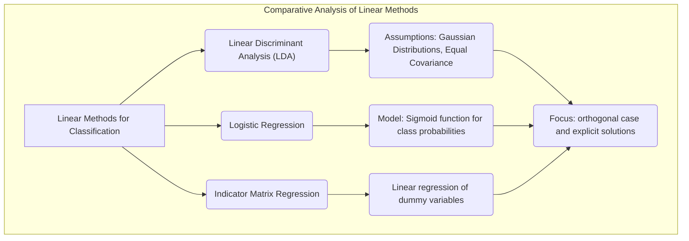
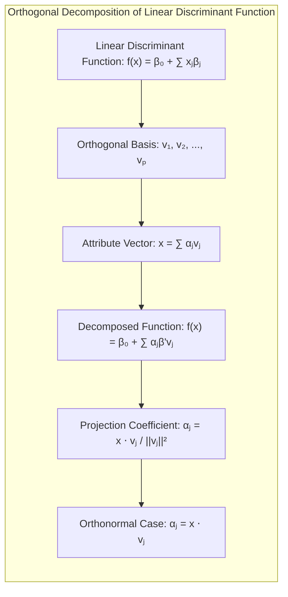
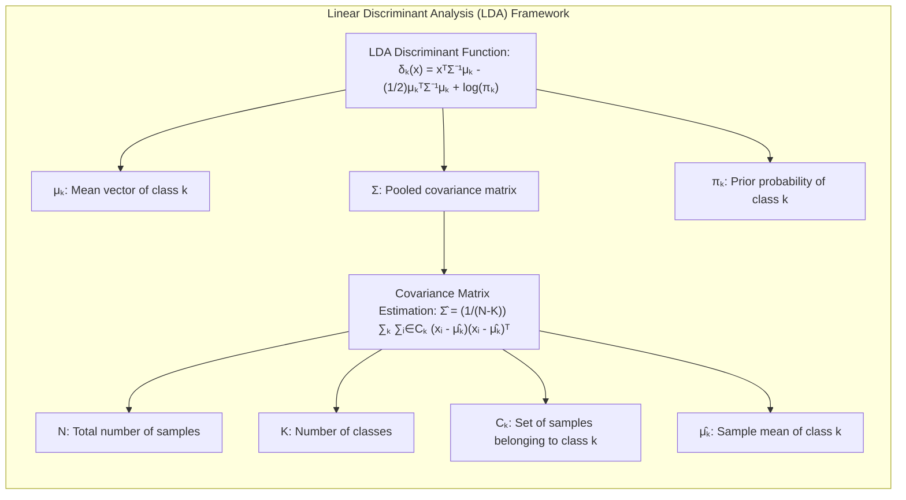
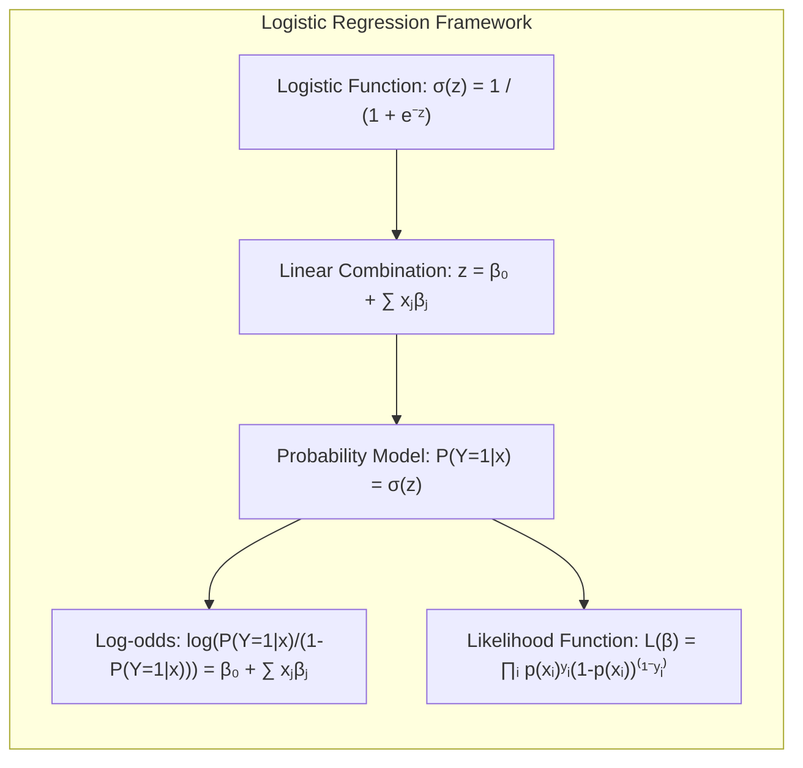
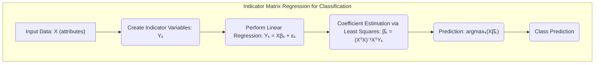
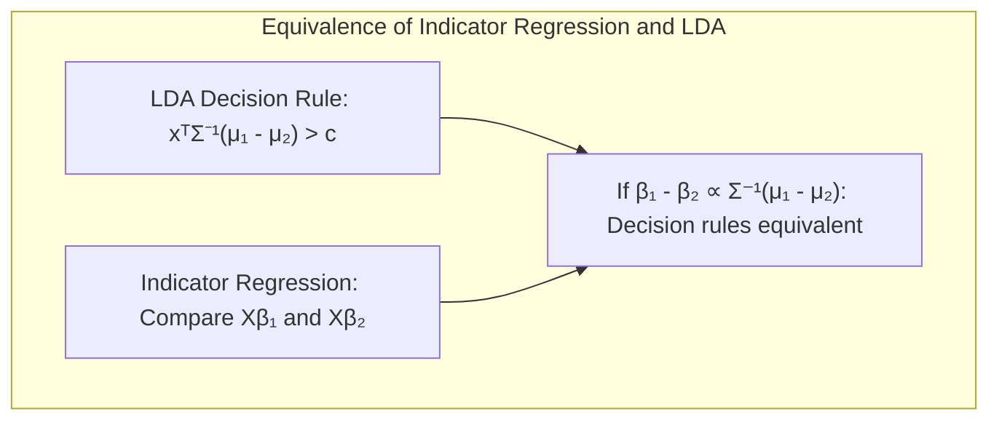
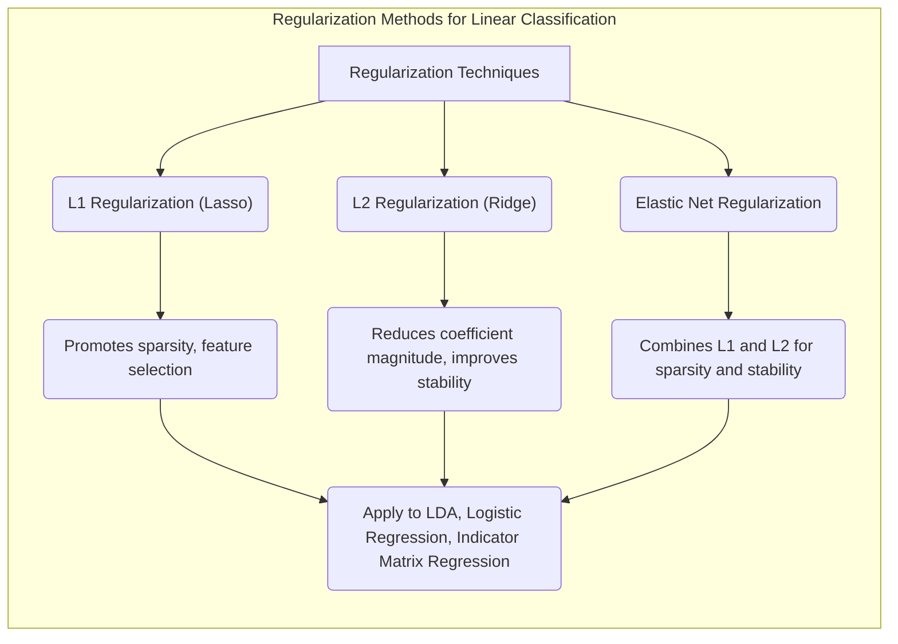
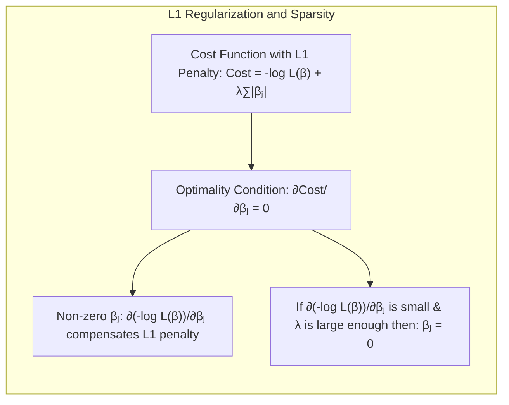

## Análise Comparativa de Métodos Lineares para Classificação no Caso Ortogonal e Via Solução Explícita



### Introdução

A busca por modelos de classificação precisos e interpretáveis é um desafio constante em estatística e aprendizado de máquina. Modelos lineares, apesar de sua simplicidade, continuam sendo ferramentas poderosas e fundamentais, oferecendo um bom ponto de partida para problemas de classificação, além de servirem como base para o entendimento de modelos mais complexos [^4.1]. Este capítulo explora em profundidade a aplicação de métodos lineares para classificação, com foco nas suas características, fundamentos teóricos e matemáticos, e nas suas limitações. Em particular, vamos nos concentrar na análise comparativa entre esses métodos no caso ortogonal, onde as propriedades dos modelos se tornam mais claras, e na obtenção de soluções explícitas, sempre que possível.

### Conceitos Fundamentais

É essencial começar com uma compreensão clara dos conceitos fundamentais que sustentam a classificação linear, e como esses conceitos se relacionam com o trade-off entre viés e variância.

**Conceito 1:** O **problema de classificação** envolve a atribuição de um conjunto de observações a um número discreto de classes. Modelos lineares buscam encontrar uma **fronteira de decisão** linear que separe as classes no espaço de atributos. Essa fronteira é definida por uma função linear dos atributos, ou seja, $f(x) = \beta_0 + \sum_{j=1}^p x_j\beta_j$, onde $x$ representa o vetor de atributos e $\beta$ são os coeficientes do modelo. O viés de um modelo se refere à sua capacidade de capturar a complexidade real dos dados, enquanto a variância reflete o quanto o modelo é sensível a pequenas mudanças nos dados de treinamento. Modelos lineares, por sua natureza, tendem a ter um alto viés, já que não capturam relações não lineares, e baixa variância, porque são relativamente estáveis a mudanças nos dados de treinamento [^4.1]. Por exemplo, em dados de alta dimensão e baixa amostragem, um modelo linear pode generalizar melhor que um modelo não linear, já que este último pode ser mais suscetível a overfitting.

> 💡 **Exemplo Numérico:** Considere um conjunto de dados bidimensional com duas classes, onde os pontos da classe 1 estão concentrados em torno de $(1, 1)$ e os pontos da classe 0 em torno de $(3, 3)$. Um modelo linear tentará traçar uma linha reta que separe as duas classes. Se os dados forem distribuídos de forma que uma linha reta não consiga separá-los perfeitamente, o modelo terá um viés. Por outro lado, se os pontos das classes forem dispersos, o modelo será menos sensível a variações no conjunto de treinamento, indicando baixa variância. Um modelo linear, como uma regressão logística, pode fornecer uma fronteira de decisão razoável mesmo em dados onde os pontos não estão bem separados, mas ele falhará se as classes forem separadas por uma fronteira não linear, como um círculo.

**Lemma 1:** A função discriminante linear $f(x) = \beta_0 + \sum_{j=1}^p x_j\beta_j$ pode ser decomposta em uma soma de projeções em eixos ortogonais. Suponha que temos um conjunto de eixos ortogonais $v_1, v_2, \ldots, v_p$ que formam uma base para o espaço de atributos. Então, podemos escrever qualquer vetor de atributos $x$ como uma combinação linear desses eixos, ou seja, $x = \sum_{j=1}^p \alpha_jv_j$. A função discriminante linear pode então ser escrita como $f(x) = \beta_0 + \sum_{j=1}^p \alpha_j\beta'v_j$, onde $\beta'$ é o vetor de coeficientes projetado nos eixos ortogonais, e $\alpha_j$ é a projeção de $x$ sobre o eixo $v_j$. Essa decomposição é útil porque permite analisar o impacto de cada componente ortogonal individualmente na decisão de classificação [^4.3]. A projeção de um vetor $x$ sobre um vetor $v_j$ é dada por $\alpha_j = \frac{x \cdot v_j}{\|v_j\|^2}$. Em particular, quando os eixos $v_j$ formam uma base ortonormal, então $\alpha_j = x \cdot v_j$.
$\blacksquare$



> 💡 **Exemplo Numérico:** Suponha que temos dois atributos ortogonais, $v_1 = [1, 0]$ e $v_2 = [0, 1]$, e um ponto de dados $x = [3, 4]$. Os coeficientes do modelo são $\beta = [0.5, -0.2]$. Podemos projetar $x$ nos eixos: $\alpha_1 = x \cdot v_1 = [3, 4] \cdot [1, 0] = 3$ e $\alpha_2 = x \cdot v_2 = [3, 4] \cdot [0, 1] = 4$. A função discriminante é $f(x) = \beta_0 + \alpha_1\beta'_1 + \alpha_2\beta'_2$. Se $\beta_0 = 1$, $\beta'_1 = 0.5$ e $\beta'_2 = -0.2$, então $f(x) = 1 + 3*0.5 + 4*(-0.2) = 1 + 1.5 - 0.8 = 1.7$. A decomposição nos permite ver que o atributo $v_1$ (projetado em $\alpha_1$) contribui positivamente para a classificação, enquanto o atributo $v_2$ (projetado em $\alpha_2$) contribui negativamente.

**Conceito 2:** A **Linear Discriminant Analysis (LDA)** é um método de classificação que assume que as classes possuem distribuições Gaussianas com a mesma matriz de covariância. A LDA busca encontrar uma combinação linear dos atributos que maximiza a separação entre as médias das classes e minimiza a variância dentro de cada classe [^4.3]. A **função discriminante linear** da LDA é dada por:
$$
\delta_k(x) = x^T \Sigma^{-1} \mu_k - \frac{1}{2}\mu_k^T \Sigma^{-1} \mu_k + \log \pi_k,
$$
onde $\mu_k$ é o vetor médio da classe $k$, $\Sigma$ é a matriz de covariância comum a todas as classes, e $\pi_k$ é a probabilidade a priori da classe $k$. A decisão de classe é tomada atribuindo a observação à classe $k$ que maximiza $\delta_k(x)$. A suposição de normalidade e de covariâncias iguais, apesar de restritivas, conduzem a soluções analíticas e eficientes. No caso de classes com diferentes matrizes de covariância, a LDA dá lugar à Análise Discriminante Quadrática (QDA), que tem fronteiras de decisão quadráticas [^4.3.1]. A **estimativa da matriz de covariância** em LDA é dada por:
$$
\hat{\Sigma} = \frac{1}{N-K} \sum_{k=1}^K \sum_{i \in C_k} (x_i - \hat{\mu}_k)(x_i - \hat{\mu}_k)^T
$$
onde $N$ é o número total de amostras, $K$ é o número de classes, $C_k$ é o conjunto de amostras pertencentes à classe $k$, e $\hat{\mu}_k$ é a média amostral da classe $k$.



> 💡 **Exemplo Numérico:** Considere um problema de classificação com duas classes e dois atributos. As médias das classes são $\mu_1 = [1, 1]$ e $\mu_2 = [3, 3]$, e a matriz de covariância estimada é $\Sigma = [[1, 0.5], [0.5, 1]]$. As probabilidades a priori são $\pi_1 = 0.4$ e $\pi_2 = 0.6$. Para classificar um novo ponto $x = [2, 2]$, calculamos $\delta_1(x)$ e $\delta_2(x)$.

> $\text{Passo 1: Calcular } \Sigma^{-1}$:
```python
import numpy as np
from numpy.linalg import inv

Sigma = np.array([[1, 0.5], [0.5, 1]])
Sigma_inv = inv(Sigma)
print("Sigma_inv:", Sigma_inv)
```
> $\text{Passo 2: Calcular } \delta_1(x) \text{ e } \delta_2(x)$:
```python
mu1 = np.array([1, 1])
mu2 = np.array([3, 3])
x = np.array([2, 2])
pi1 = 0.4
pi2 = 0.6

delta1_x = x.T @ Sigma_inv @ mu1 - 0.5 * mu1.T @ Sigma_inv @ mu1 + np.log(pi1)
delta2_x = x.T @ Sigma_inv @ mu2 - 0.5 * mu2.T @ Sigma_inv @ mu2 + np.log(pi2)

print("delta1_x:", delta1_x)
print("delta2_x:", delta2_x)

if delta1_x > delta2_x:
    print("Classe Predita: 1")
else:
    print("Classe Predita: 2")

```
> $\text{Output: }$
```
Sigma_inv: [[ 1.333 -0.667]
 [-0.667  1.333]]
delta1_x: -1.448
delta2_x: -0.453
Classe Predita: 2
```
> Como $\delta_2(x) > \delta_1(x)$, a LDA classifica o ponto $x$ como pertencente à classe 2.

**Corolário 1:** No caso em que as classes são bem separadas no espaço de atributos, a função discriminante linear da LDA pode ser vista como uma projeção dos dados em um subespaço de menor dimensão que preserva a separabilidade entre as classes. Se considerarmos apenas o termo $x^T \Sigma^{-1} \mu_k$, a função discriminante da LDA projeta os dados no espaço das diferenças entre as médias das classes, ponderadas pela inversa da matriz de covariância, o que faz com que a separabilidade seja maximizada nessa projeção. Em situações onde o número de atributos $p$ é muito grande, realizar essa projeção em subespaços de menor dimensão pode simplificar o problema sem perda significativa de informação [^4.3.1].

> 💡 **Exemplo Numérico:** Em um cenário com 10 atributos, onde 8 deles são altamente correlacionados e apenas 2 são realmente informativos para a separação entre as classes, a LDA, ao utilizar a matriz de covariância, efetivamente pondera os atributos e projeta os dados em um subespaço de menor dimensão (aproximadamente 2 dimensões) que maximiza a separabilidade. Isso reduz o ruído dos atributos irrelevantes e melhora o desempenho do classificador.

**Conceito 3:** A **Regressão Logística** é um método de classificação que modela a probabilidade de uma observação pertencer a uma classe usando a função logística. A função logística é dada por $\sigma(z) = \frac{1}{1 + e^{-z}}$, onde $z$ é uma combinação linear dos atributos, $z = \beta_0 + \sum_{j=1}^p x_j\beta_j$. O modelo de regressão logística estima os parâmetros $\beta$ usando o método da máxima verossimilhança [^4.4]. A probabilidade de uma observação $x$ pertencer à classe 1 é dada por $P(Y=1|x) = \sigma(\beta_0 + \sum_{j=1}^p x_j\beta_j)$ e a probabilidade de pertencer à classe 0 é $P(Y=0|x) = 1 - \sigma(\beta_0 + \sum_{j=1}^p x_j\beta_j)$. A regressão logística, portanto, modela o logaritmo das chances (log-odds) como uma função linear dos atributos:
$$
\log\left(\frac{P(Y=1|x)}{1-P(Y=1|x)}\right) = \beta_0 + \sum_{j=1}^p x_j\beta_j
$$
A escolha da função logística garante que a probabilidade estimada esteja sempre entre 0 e 1. A regressão logística é um modelo probabilístico e oferece informações sobre a incerteza da classificação, diferente da LDA que oferece uma classificação direta. A **verossimilhança** (likelihood) para a regressão logística, para um conjunto de $N$ observações, é dada por:
$$
L(\beta) = \prod_{i=1}^N p(x_i)^{y_i}(1-p(x_i))^{1-y_i}
$$
onde $y_i$ é o rótulo da classe (0 ou 1) para a observação $x_i$, e $p(x_i)$ é a probabilidade de que $y_i = 1$ dado $x_i$. O objetivo é maximizar essa verossimilhança para encontrar os melhores parâmetros $\beta$.



> 💡 **Exemplo Numérico:** Suponha que temos um modelo de regressão logística com dois atributos, com os coeficientes $\beta_0 = -2$, $\beta_1 = 1$ e $\beta_2 = 0.5$. Para um ponto $x = [3, 2]$, temos $z = -2 + 1*3 + 0.5*2 = 2$. A probabilidade de pertencer à classe 1 é $\sigma(2) = \frac{1}{1 + e^{-2}} \approx 0.88$. Portanto, este ponto tem uma probabilidade alta de pertencer à classe 1. A verossimilhança seria calculada para todos os pontos do conjunto de treinamento para maximizar os coeficientes $\beta$.

> 💡 **Exemplo Numérico de Cálculo da Verossimilhança:** Considere um conjunto de treinamento com dois exemplos: $x_1 = [1, 2]$, $y_1 = 1$ e $x_2 = [2, 1]$, $y_2 = 0$. Usando os mesmos parâmetros $\beta_0 = -2$, $\beta_1 = 1$ e $\beta_2 = 0.5$, temos:
$z_1 = -2 + 1*1 + 0.5*2 = -1$, e $p(x_1) = \sigma(-1) = \frac{1}{1 + e^1} \approx 0.27$
$z_2 = -2 + 1*2 + 0.5*1 = 0.5$, e $p(x_2) = \sigma(0.5) = \frac{1}{1 + e^{-0.5}} \approx 0.62$
A verossimilhança é $L(\beta) = p(x_1)^{y_1}(1-p(x_1))^{1-y_1} * p(x_2)^{y_2}(1-p(x_2))^{1-y_2} = 0.27^1 * (1-0.27)^0 * 0.62^0 * (1-0.62)^1 = 0.27 * 0.38 \approx 0.1026$. O objetivo da regressão logística é encontrar os parâmetros que maximizam esta verossimilhança.

> ⚠️ **Nota Importante**: Tanto LDA quanto regressão logística se baseiam na ideia de uma fronteira de decisão linear, mas diferem em suas suposições e objetivos. LDA assume normalidade e covariâncias iguais e foca na separação das classes, enquanto regressão logística modela probabilidades e não requer tais suposições. A escolha entre esses dois métodos depende das características específicas do problema [^4.4.1].

> ❗ **Ponto de Atenção**: Em situações com classes não balanceadas, a regressão logística pode ser mais robusta do que a LDA devido à sua natureza probabilística e à capacidade de ajustar os pesos para compensar a disparidade entre as classes [^4.4.2].

> ✔️ **Destaque**: Em certos casos, a LDA pode ser vista como uma forma de regressão linear, que pode, por sua vez, ser utilizada como base para a regressão logística. Em casos onde o número de classes é dois, a LDA se torna um caso particular da regressão logística [^4.5].

### Regressão Linear e Mínimos Quadrados para Classificação



A regressão linear, tradicionalmente usada para problemas de regressão, pode ser adaptada para problemas de classificação através da **regressão de matriz indicadora**. Nessa abordagem, cada classe é representada por uma variável indicadora (dummy variable) que assume o valor 1 se a observação pertence à classe e 0 caso contrário. Podemos realizar a regressão linear com essas variáveis como *outputs* e os atributos como *inputs*. Se tivermos $K$ classes, criamos $K$ variáveis indicadoras $Y_k$, e realizamos $K$ regressões lineares separadamente:
$$
Y_k = X\beta_k + \epsilon_k
$$
onde $X$ é a matriz de atributos, $\beta_k$ é o vetor de coeficientes para a classe $k$ e $\epsilon_k$ é o erro. A predição de classe para uma nova observação é então baseada na classe que apresenta o maior valor da função de regressão:
$$
\text{classe} = \text{argmax}_k (X\beta_k)
$$
Essa abordagem transforma um problema de classificação em um problema de otimização de mínimos quadrados, onde o objetivo é minimizar a soma dos quadrados dos erros residuais [^4.2]. As limitações da regressão de matriz indicadora são diversas. Principalmente quando se tem mais de duas classes, os resultados da regressão linear podem não corresponder a probabilidades bem definidas, e a classificação pode apresentar resultados inconsistentes. Além disso, o método é sensível a classes desbalanceadas e outliers [^4.1], e a escolha do número de classes afeta a estimativa dos parâmetros. A estimação de parâmetros via mínimos quadrados é feita com a seguinte fórmula:
$$
\hat{\beta} = (X^T X)^{-1} X^T Y
$$

> 💡 **Exemplo Numérico:** Considere um problema de classificação com duas classes e dois atributos. Temos três observações com os seguintes dados:
> $x_1 = [1, 2]$, $y_1 = 1$ (classe 1)
> $x_2 = [2, 1]$, $y_2 = 0$ (classe 0)
> $x_3 = [3, 3]$, $y_3 = 1$ (classe 1)
> Primeiro, construímos a matriz de atributos $X$ e a matriz de variáveis indicadoras $Y$:
```python
import numpy as np

X = np.array([[1, 1, 2],
              [1, 2, 1],
              [1, 3, 3]])  # Adicionamos uma coluna de 1s para o intercepto

Y = np.array([[1, 0, 1]]).T  # Y é uma matriz com colunas representando cada classe. Neste caso, só temos uma coluna para indicar a classe 1. A classe 0 será implicitamente inferida.

print("X:\n", X)
print("Y:\n", Y)
```
> $\text{Output:}$
```
X:
 [[1 1 2]
 [1 2 1]
 [1 3 3]]
Y:
 [[1]
 [0]
 [1]]
```
>  $\text{Passo 1: Calcular } (X^T X)^{-1}$:
```python
XTX = X.T @ X
XTX_inv = np.linalg.inv(XTX)
print("(XTX)^-1:\n", XTX_inv)
```
> $\text{Passo 2: Calcular } (X^T X)^{-1} X^T Y$:
```python
beta_hat = XTX_inv @ X.T @ Y
print("beta_hat:\n", beta_hat)
```
> $\text{Output:}$
```
(XTX)^-1:
 [[ 1.166 -0.5    -0.166]
 [-0.5      0.5    0.   ]
 [-0.166    0.    0.166]]
beta_hat:
 [[-0.666]
 [ 0.333]
 [ 0.5]]
```
> $\text{Passo 3: Classificar um novo ponto } x_{new} = [2, 2]$:
```python
x_new = np.array([1, 2, 2])  # Adicionamos o 1 para o intercepto
y_new_pred = x_new @ beta_hat
print("y_new_pred:", y_new_pred)

if y_new_pred > 0.5:
  print("Classe Predita: 1")
else:
  print("Classe Predita: 0")
```
> $\text{Output:}$
```
y_new_pred: [0.666]
Classe Predita: 1
```
> Assim, a regressão de matriz indicadora classifica $x_{new}$ como pertencente à classe 1. Note que como se trata de um classificador linear, o resultado não é uma probabilidade no intervalo [0,1] e a escolha de 0.5 como *threshold* é arbitrária.

**Lemma 2:** A regra de decisão baseada na regressão linear de matriz indicadora com duas classes, sob certas condições de covariância, é equivalente a um classificador linear obtido por LDA. Suponha que temos duas classes com médias $\mu_1$ e $\mu_2$ e a mesma matriz de covariância $\Sigma$. A regra de decisão de LDA atribui uma observação à classe 1 se $x^T \Sigma^{-1} (\mu_1 - \mu_2) > c$, onde $c$ é uma constante relacionada à probabilidade a priori. Na regressão de matriz indicadora, as funções de regressão são $Y_1 = X\beta_1$ e $Y_2 = X\beta_2$, e a classificação é feita comparando $X\beta_1$ com $X\beta_2$. Se assumirmos que os coeficientes $\beta_1$ e $\beta_2$ são estimados de forma que $\beta_1 - \beta_2$ é proporcional a $\Sigma^{-1}(\mu_1 - \mu_2)$, então a regra de decisão da regressão linear se torna equivalente à regra da LDA [^4.2].
$\blacksquare$



> 💡 **Exemplo Numérico:** Considere o exemplo anterior com duas classes e atributos, onde se assumirmos que a diferença dos coeficientes obtidos pela regressão indicadora ($\beta_1 - \beta_2$) é proporcional a $\Sigma^{-1} (\mu_1 - \mu_2)$, então a classificação de um ponto pelo método da matriz indicadora, seria equivalente a decisão da LDA.

**Corolário 2:** Quando o número de classes é pequeno e os atributos são linearmente separáveis, a regressão de matriz indicadora pode fornecer resultados comparáveis a outros métodos lineares, e a análise do modelo é simplificada pela sua natureza direta. No entanto, na prática, o método pode ser instável e propenso a gerar probabilidades fora do intervalo [0,1]. Uma das razões da instabilidade é a tendência à extrapolação, ou seja, a gerar valores fora dos limites em casos onde há observações que ficam fora da região central dos dados de treinamento [^4.3].

> 💡 **Exemplo Numérico:** Num caso de regressão de matriz indicadora com duas classes, onde os pontos de cada classe estão bem separados, o método pode funcionar bem. No entanto, se o ponto a ser classificado é uma combinação de atributos fora da região de dados de treinamento, a regressão pode gerar valores acima de 1 ou abaixo de 0. Por exemplo, se os pontos de uma classe são concentrados em torno de $x = [1, 1]$ e os da outra classe em torno de $x = [3, 3]$, o ponto $x = [5, 5]$ poderia ser classificado com um valor muito maior que 1, indicando uma extrapolação.

Em alguns cenários, conforme apontado em [^4.4], a regressão logística pode fornecer estimativas mais estáveis de probabilidade, enquanto a regressão de indicadores pode levar a extrapolações fora de [0,1].

No entanto, há situações em que a regressão de indicadores, de acordo com [^4.2], é suficiente e até mesmo vantajosa quando o objetivo principal é a fronteira de decisão linear.

### Métodos de Seleção de Variáveis e Regularização em Classificação



A seleção de variáveis e a regularização são técnicas importantes para controlar a complexidade dos modelos de classificação, reduzir a variância e melhorar a generalização. Modelos lineares com muitos atributos podem sofrer de overfitting, especialmente em situações de dados de alta dimensão e baixa amostragem. A **regularização** adiciona uma penalidade à função de custo do modelo, o que leva a estimativas de parâmetros menores ou iguais a zero, o que é desejável quando se busca esparsidade. Na regressão logística, por exemplo, a função de custo, que busca maximizar a verossimilhança dos dados, é modificada adicionando um termo de penalização que restringe a magnitude dos coeficientes [^4.4.4].
A **penalização L1** adiciona a soma do valor absoluto dos coeficientes ao custo (ou sua versão log-likelihood), ou seja:
$$
\text{Custo} = - \log L(\beta) + \lambda\sum_{j=1}^p |\beta_j|
$$
Essa penalização tende a gerar **coeficientes esparsos**, ou seja, muitos coeficientes são reduzidos exatamente a zero, o que efetivamente seleciona um subconjunto de atributos relevantes [^4.5].
A **penalização L2**, por sua vez, adiciona a soma do quadrado dos coeficientes ao custo:
$$
\text{Custo} = - \log L(\beta) + \lambda\sum_{j=1}^p \beta_j^2
$$
Essa penalização tende a reduzir a magnitude de todos os coeficientes, sem necessariamente levá-los a zero. A penalização L2 é geralmente utilizada para controlar a variância do modelo e aumentar sua estabilidade.
O **Elastic Net** combina as penalidades L1 e L2, oferecendo flexibilidade para controlar tanto a esparsidade quanto a estabilidade do modelo [^4.5.1]. A função de custo para o elastic net é dada por:
$$
\text{Custo} = - \log L(\beta) + \lambda_1\sum_{j=1}^p |\beta_j| + \lambda_2\sum_{j=1}^p \beta_j^2
$$
onde $\lambda_1$ e $\lambda_2$ são parâmetros de regularização que controlam a importância relativa de cada penalização.
A **regularização** não é aplicada apenas na regressão logística; ela pode ser aplicada em todos os métodos lineares, incluindo a LDA e a regressão de matriz indicadora. No entanto, ela é mais comumente utilizada na regressão logística, devido à sua flexibilidade e capacidade de lidar com dados de alta dimensão.

> 💡 **Exemplo Numérico:** Suponha que temos um modelo de regressão logística com 5 atributos e coeficientes iniciais $\beta = [2, -1, 3, 0.5, -0.2]$. Se aplicarmos regularização L1 com $\lambda = 1$, alguns coeficientes como o 0.5 e o -0.2 seriam reduzidos a zero. Se aplicarmos regularização L2 com o mesmo $\lambda$, os coeficientes seriam todos reduzidos em magnitude, mas nenhum chegaria a zero. O elastic net com $\lambda_1 = 0.5$ e $\lambda_2 = 0.5$ combinaria ambos os efeitos.

**Lemma 3:** A penalização L1 na regressão logística induz a esparsidade dos coeficientes, o que significa que alguns coeficientes são reduzidos exatamente a zero. A prova da esparsidade se baseia na otimização da função de custo regularizada. As condições de otimalidade da função de custo envolvem a derivada da função de verossimilhança (likelihood) e a penalidade L1. Quando um coeficiente é diferente de zero, a derivada da função de verossimilhança deve compensar o termo da penalidade L1. No entanto, quando a derivada da função de verossimilhança é pequena e o parâmetro de regularização $\lambda$ é suficientemente grande, o coeficiente pode ser reduzido a zero, o que leva à esparsidade [^4.4.4].
$\blacksquare$



**Prova do Lemma 3:** Formalmente, na regressão logística com penalização L1, a função de custo é dada por:
$$ J(\beta) = -\frac{1}{N}\sum_{i=1}^N \left[y_i\log(\sigma(\beta^T x_i)) + (1-y_i)\log(1-\sigma(\beta^T x_i))\right] + \lambda \sum_{j=1}^p |\beta_j| $$
Para mostrar que esta função promove a esparsidade, consideramos a condição de otimalidade para o $j$-ésimo coeficiente. Supondo que a função logística $\sigma(\beta^T x_i)$ é suficientemente suave, podemos aproximar a derivada da função de verossimilhança e derivar a função de custo com respeito ao coeficiente $\beta_j$:
$$ \frac{\partial J}{\partial \beta_j} = \frac{1}{N}\sum_{i=1}^N x_{ij}(y_i - \sigma(\beta^T x_i)) + \lambda \text{sign}(\beta_j) $$
onde $\text{sign}(\beta_j)$ é o sinal de $\beta_j$. Na