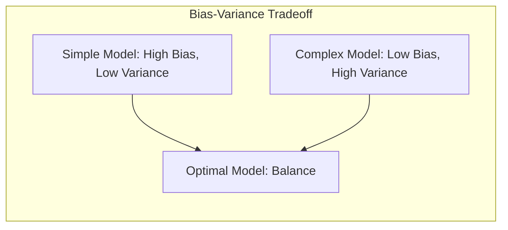
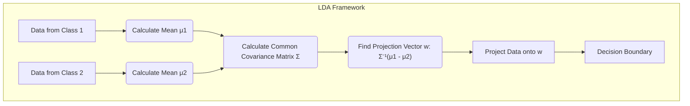
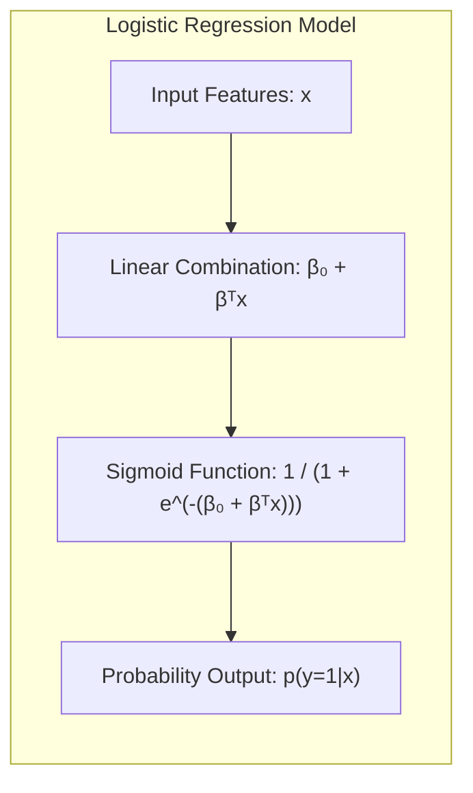
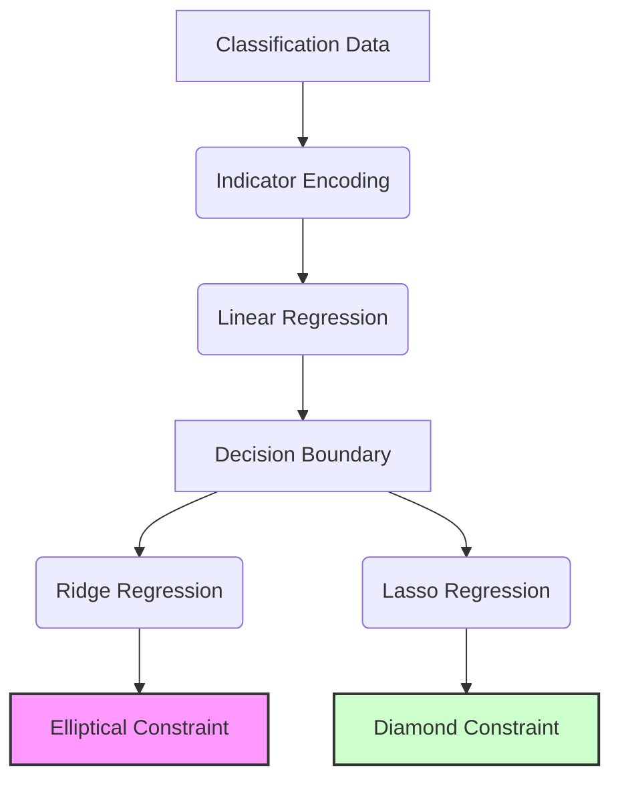
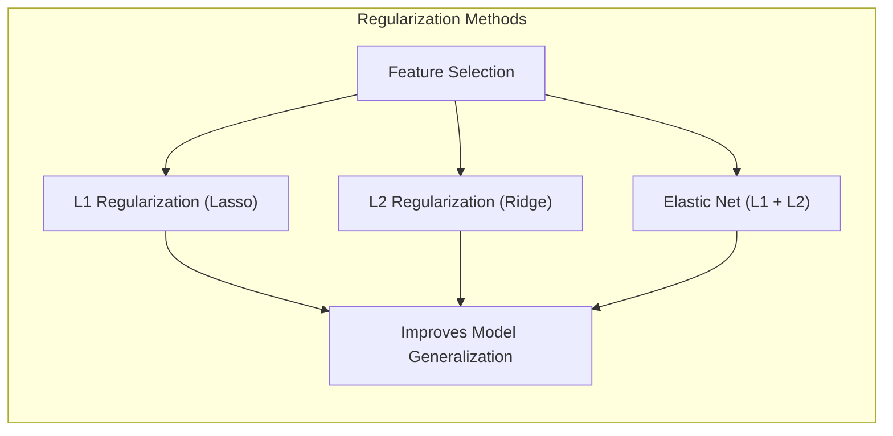
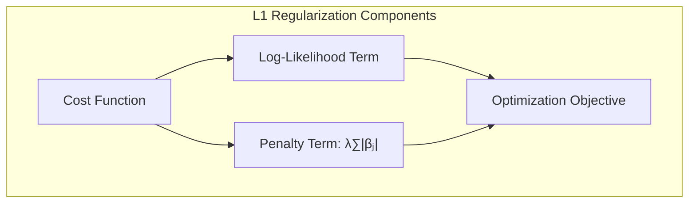
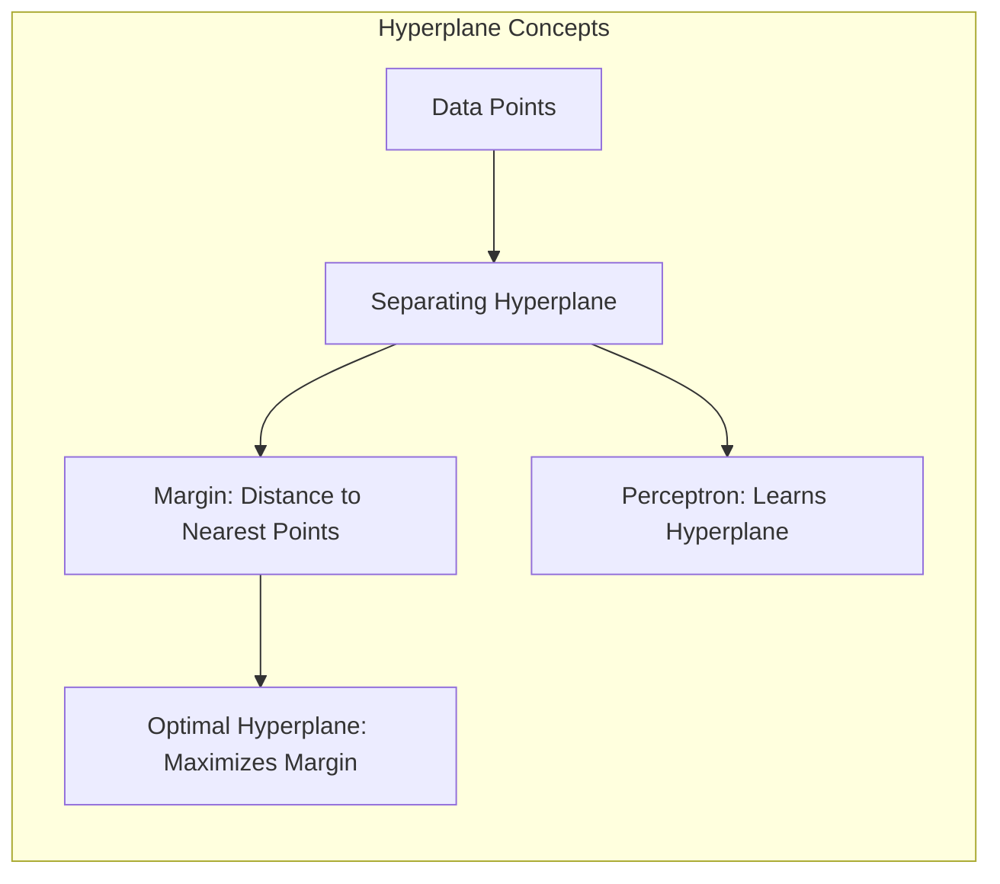
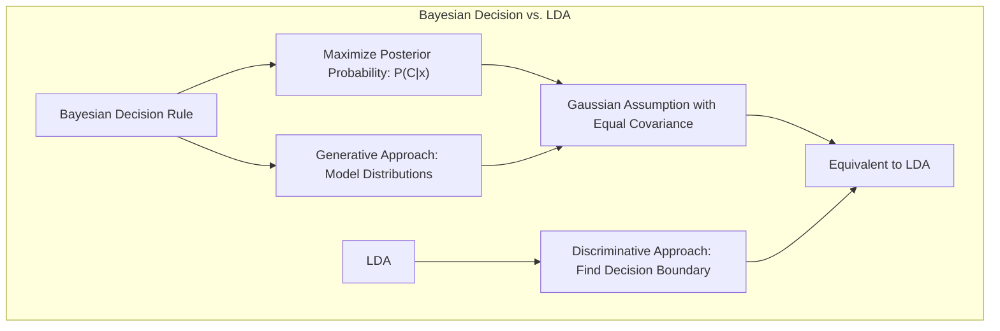

## Visualizations with Elliptic and Diamond Constraint Regions: Implications for Model Complexity

<imagem: Diagram showing a scatter plot of data points in a 2D space, with overlaid elliptic (ridge) and diamond (lasso) constraint regions, centered at the least squares solution. The image includes visual markers to highlight the points where the constraint boundaries touch the error contours, illustrating how different constraints lead to different model solutions.>

### Introdução
A escolha de um modelo de aprendizado de máquina muitas vezes envolve equilibrar a complexidade do modelo com sua capacidade de generalizar para novos dados. Métodos de regularização, como **Ridge Regression** e **Lasso Regression**, introduzem restrições nos coeficientes do modelo para evitar *overfitting* e melhorar a generalização. Estas restrições podem ser visualizadas geometricamente através de regiões de restrição elípticas e diamantadas, respectivamente. O estudo detalhado dessas visualizações nos permite compreender as implicações dessas restrições na complexidade do modelo, conforme explorado nos tópicos [^4.1], [^4.2] e [^4.3].

### Conceitos Fundamentais
**Conceito 1: O Problema da Classificação e Modelos Lineares**

Em um problema de classificação, o objetivo é determinar a qual categoria um determinado conjunto de dados pertence. Os modelos lineares, como a **Linear Discriminant Analysis (LDA)** e a **Logistic Regression**, são frequentemente usados devido à sua simplicidade e interpretabilidade, conforme mencionado em [^4.1]. Estes modelos tentam encontrar uma fronteira de decisão linear que separe as diferentes classes no espaço de características. No entanto, como discutido em [^4.2], modelos lineares podem ter um alto viés (bias), o que os torna incapazes de capturar relações complexas nos dados. Por outro lado, modelos mais complexos podem ter alta variância e se ajustarem excessivamente aos dados de treinamento, resultando em baixo desempenho em dados não vistos. Este trade-off entre bias e variância é fundamental para entender a escolha de um modelo apropriado.

**Lemma 1: Decomposição da Função Discriminante Linear**
Um **lemma** útil para entender a classificação linear é a decomposição da função discriminante linear. Em um espaço de duas classes, uma função discriminante linear pode ser expressa como $f(x) = \beta_0 + \beta^T x$, onde $x$ é o vetor de entrada, $\beta$ é o vetor de coeficientes e $\beta_0$ é o intercepto. Este lemma nos permite visualizar como cada característica contribui para a classificação:

$$f(x) = \beta_0 + \sum_{i=1}^{p} \beta_i x_i$$

Esta decomposição nos ajuda a entender como a contribuição de cada feature $x_i$ (com peso $\beta_i$) afeta o valor da função discriminante, influenciando a decisão de classe. Esta representação linear também é crucial em LDA, onde a projeção dos dados em um subespaço de menor dimensão maximiza a separabilidade das classes, conforme detalhado em [^4.3].
$\blacksquare$

> 💡 **Exemplo Numérico:** Considere um problema de classificação com duas features, $x_1$ e $x_2$, e um modelo linear com $\beta_0 = 0.5$, $\beta_1 = 2$, e $\beta_2 = -1$. A função discriminante é $f(x) = 0.5 + 2x_1 - 1x_2$. Se tivermos um ponto de dados $x = [1, 2]$, então $f(x) = 0.5 + 2(1) - 1(2) = 0.5$. Se $f(x) > 0$, classificamos a instância na classe positiva; caso contrário, na classe negativa. Este exemplo mostra como os coeficientes $\beta_1$ e $\beta_2$ ponderam a importância de cada feature na decisão final.

**Conceito 2: Linear Discriminant Analysis (LDA)**
A **Linear Discriminant Analysis (LDA)** é uma técnica de classificação que assume que os dados de cada classe seguem uma distribuição normal com a mesma matriz de covariância [^4.3]. A LDA busca a projeção linear que melhor separe as classes, maximizando a distância entre as médias das classes e minimizando a dispersão dentro de cada classe, conforme discutido em [^4.3.1]. A fronteira de decisão resultante é uma linha ou um hiperplano. A função discriminante da LDA é uma função linear da forma $f(x) = w^T x + b$, onde $w$ é o vetor de pesos e $b$ é o termo de viés (bias). As suposições de normalidade e covariâncias iguais podem limitar sua aplicação em conjuntos de dados complexos, mas sua simplicidade e eficiência o tornam uma ferramenta valiosa [^4.3.2].

**Corolário 1: Projeção em Subespaços de Menor Dimensão**
O **corolário** derivado da LDA estabelece que a função discriminante linear pode ser vista como uma projeção dos dados em um subespaço de menor dimensão que maximiza a separação das classes. Matematicamente, a LDA encontra uma direção $w$ tal que a projeção de $x$ em $w$ resulta em uma boa separação entre as classes:

$$w = \Sigma^{-1}(\mu_1 - \mu_2)$$

onde $\mu_1$ e $\mu_2$ são as médias das classes e $\Sigma$ é a matriz de covariância comum. Este corolário nos mostra como reduzir a dimensionalidade dos dados mantendo a capacidade de separar as classes, conforme mencionado em [^4.3.1]. $\blacksquare$

> 💡 **Exemplo Numérico:** Considere um problema de classificação binária com duas classes. A classe 1 tem média $\mu_1 = [2, 2]$ e a classe 2 tem média $\mu_2 = [0, 0]$. A matriz de covariância comum é $\Sigma = \begin{bmatrix} 1 & 0 \\ 0 & 1 \end{bmatrix}$. O vetor de projeção $w$ é calculado como $w = \Sigma^{-1}(\mu_1 - \mu_2) = \begin{bmatrix} 1 & 0 \\ 0 & 1 \end{bmatrix}^{-1} ([2, 2] - [0, 0]) = \begin{bmatrix} 2 \\ 2 \end{bmatrix}$. A direção $w$ indica a direção em que a projeção maximiza a separação entre as classes.

**Conceito 3: Logistic Regression**
A **Logistic Regression** é um modelo probabilístico que usa a função sigmóide (logistic) para modelar a probabilidade de uma instância pertencer a uma determinada classe [^4.4]. Ao contrário da LDA, a Logistic Regression não assume distribuições normais para os dados, tornando-a mais flexível em algumas situações, conforme indicado em [^4.4.1]. A função logística transforma a combinação linear das features em uma probabilidade, definida por:
$$p(y=1|x) = \frac{1}{1+e^{-(\beta_0 + \beta^T x)}}$$
O modelo é ajustado através da maximização da verossimilhança (likelihood), encontrando os parâmetros $\beta_0$ e $\beta$ que melhor explicam os dados, como discutido em [^4.4.3]. A Logistic Regression, apesar de ser um classificador linear, pode lidar com dados não-lineares através da inclusão de termos polinomiais ou outras transformações das features [^4.4.5].

> ⚠️ **Nota Importante**: A regressão logística não faz suposições sobre a distribuição dos dados de entrada, ao contrário da LDA. **Referência ao tópico [^4.4.1]**.
> ❗ **Ponto de Atenção**: Em cenários com classes não balanceadas, a regressão logística pode ser sensível e requer técnicas como reamostragem ou ponderação de classes. **Conforme indicado em [^4.4.2]**.
> ✔️ **Destaque**: Embora a LDA e a regressão logística compartilhem a propriedade de produzir fronteiras de decisão lineares, elas diferem em suas suposições e na forma como estimam os parâmetros. **Baseado no tópico [^4.5]**.

### Regressão Linear e Mínimos Quadrados para Classificação
<imagem: Diagrama mostrando um gráfico 2D com pontos de dados coloridos por classe, uma fronteira de decisão linear obtida por regressão de indicadores, uma elipse indicando a região de restrição da ridge regression e um diamante indicando a região de restrição da lasso. O diagrama mostra também a influência dos coeficientes sobre a inclinação da fronteira e como as restrições podem levar a diferentes soluções.>

A **regressão linear** aplicada a uma matriz de indicadores é uma abordagem para classificação onde cada classe é codificada como um vetor binário (variáveis dummy) [^4.2]. Uma regressão linear é então ajustada a cada uma dessas colunas, resultando em um vetor de coeficientes para cada classe. A classe predita para uma nova instância é aquela com a maior saída da regressão. Em termos matemáticos, temos uma matriz de indicadores $Y \in \mathbb{R}^{N \times K}$, onde $N$ é o número de instâncias e $K$ é o número de classes. A regressão linear ajusta cada coluna de $Y$ usando a matriz de características $X$:

$$\hat{Y} = X\hat{\beta}$$

onde $\hat{\beta} = (X^T X)^{-1} X^T Y$. A decisão de classe é feita pelo índice da coluna $\hat{Y}$ com maior valor para cada observação.

A principal limitação da regressão de indicadores é que ela trata classes categóricas como se fossem ordenadas, e portanto, pode não funcionar bem se as classes forem muito diferentes. A regressão linear também pode produzir valores fora do intervalo $[0, 1]$, que são incompatíveis com probabilidades, conforme discutido em [^4.2]. Apesar de suas limitações, ela pode ser uma forma eficiente de criar um classificador linear, particularmente quando o objetivo principal é definir as fronteiras de decisão lineares.

**Lemma 2: Equivalência em Condições Específicas**

Sob certas condições, as projeções geradas pela regressão linear da matriz de indicadores são equivalentes às projeções obtidas por discriminantes lineares. Especificamente, se assumirmos que as classes têm variâncias iguais, as projeções resultantes da regressão linear e da LDA serão semelhantes [^4.2]. No entanto, em geral, as abordagens não são idênticas. A matriz de projeção $P$ da regressão linear de indicadores é dada por:

$$P = X(X^T X)^{-1} X^T$$

Esta matriz projeta os dados no espaço das classes. O lemma demonstra que esta projeção se assemelha à projeção realizada pela LDA sob suposições de covariâncias iguais.
$\blacksquare$

> 💡 **Exemplo Numérico:** Suponha que temos um conjunto de dados com 3 amostras e 2 classes. As features são $X = \begin{bmatrix} 1 & 2 \\ 2 & 1 \\ 3 & 3 \end{bmatrix}$. A matriz de indicadores $Y$ seria $Y = \begin{bmatrix} 1 & 0 \\ 0 & 1 \\ 1 & 0 \end{bmatrix}$ se a primeira e a terceira amostras pertencem à classe 1, e a segunda à classe 2. O cálculo de $\hat{\beta}$ envolve primeiro $X^T X = \begin{bmatrix} 14 & 13 \\ 13 & 14 \end{bmatrix}$ e $(X^T X)^{-1} = \frac{1}{27}\begin{bmatrix} 14 & -13 \\ -13 & 14 \end{bmatrix}$. Então, $X^T Y = \begin{bmatrix} 4 & 5 \\ 8 & 4 \end{bmatrix}$ e finalmente $\hat{\beta} = (X^T X)^{-1} X^T Y = \frac{1}{27}\begin{bmatrix} 14 & -13 \\ -13 & 14 \end{bmatrix} \begin{bmatrix} 4 & 5 \\ 8 & 4 \end{bmatrix} = \frac{1}{27}\begin{bmatrix} -48 & 18 \\ 60 & -9 \end{bmatrix} = \begin{bmatrix} -1.78 & 0.67 \\ 2.22 & -0.33 \end{bmatrix}$.

**Corolário 2: Análise da Simplificação do Modelo**
O **corolário** derivado do Lemma 2 mostra que a análise de um modelo linear de regressão de indicadores pode ser simplificada em certas condições, pois é equivalente à análise de discriminantes lineares. Em cenários onde a principal preocupação é criar um bom classificador linear e não probabilidades exatas, a regressão linear de indicadores, de acordo com [^4.2], pode ser suficiente, e tem vantagens computacionais em relação a modelos mais complexos como a regressão logística, em algumas situações.
$\blacksquare$

A escolha entre regressão linear, regressão logística e LDA depende de várias considerações, tais como suposições sobre os dados, objetivos do modelo e requisitos de interpretabilidade. Enquanto a regressão linear de indicadores pode ser suficiente em alguns casos para separação linear, a regressão logística oferece probabilidades bem calibradas, e a LDA maximiza a separação sob suposições de normalidade.

### Métodos de Seleção de Variáveis e Regularização em Classificação
<imagem: Diagrama que mostra um mapa mental conectando métodos de seleção de variáveis como penalidades L1 e L2. Inclui ligações com LDA, logistic regression e hyperplanes, ilustrando como eles se interconectam na busca de um modelo ideal.>

Os métodos de seleção de variáveis e regularização, como penalidades L1 e L2, são cruciais para lidar com o problema de multicolinearidade e overfitting em modelos classificatórios [^4.4.4], [^4.5]. A **regularização L1**, como usada no Lasso, adiciona uma penalidade à soma dos valores absolutos dos coeficientes ($\lambda \sum_{j=1}^{p} |\beta_j|$), resultando em modelos esparsos, onde muitos coeficientes são zero, tornando o modelo mais interpretável e robusto [^4.5.1]. A **regularização L2**, como usada no Ridge, adiciona uma penalidade à soma dos quadrados dos coeficientes ($\lambda \sum_{j=1}^{p} \beta_j^2$), que encolhe os coeficientes em direção a zero de maneira uniforme, reduzindo a variância [^4.4.4]. Em modelos logísticos, a regularização é aplicada ao termo de verossimilhança (likelihood), onde os parâmetros do modelo são determinados com base na maximização da probabilidade dos dados. A regularização L1 também pode ser usada em LDA (Regularized Discriminant Analysis) para ajudar a lidar com problemas de *ill-posedness* [^4.5].

**Lemma 3: Sparsity com Penalização L1**

A penalização L1 induz coeficientes esparsos porque sua geometria de contorno (forma de diamante) faz com que os coeficientes de alguns parâmetros sejam exatamente zero no ponto de mínimo. Matematicamente, ao minimizar a função de custo penalizada com L1:
$$Cost(\beta) = -\frac{1}{N}\sum_{i=1}^{N} y_i \log(\sigma(\beta^T x_i)) + (1-y_i)\log(1-\sigma(\beta^T x_i)) + \lambda \sum_{j=1}^{p} |\beta_j|$$
onde $\sigma$ é a função logística, o termo penalidade força alguns coeficientes a se tornarem nulos.
$\blacksquare$

> 💡 **Exemplo Numérico:** Suponha um modelo de regressão logística com duas features ($x_1$ e $x_2$) e $\lambda = 1$. A função de custo penalizada com L1 seria $Cost(\beta) = \text{log-likelihood} + 1(|\beta_1| + |\beta_2|)$. Se, em um dado passo de otimização, $\beta_1 = 0.5$ e $\beta_2 = -0.2$. Se, durante a minimização do custo, $\beta_2$ se tornar 0, o modelo se torna esparso, utilizando apenas a feature $x_1$. Em comparação, a penalidade L2 (Ridge) apenas encolheria os coeficientes para valores próximos de zero, mas não necessariamente zerá-los.

**Prova do Lemma 3:**
A prova envolve a análise das condições de otimalidade do problema. O gradiente da função de custo em relação a um coeficiente $\beta_j$ é:
$$\frac{\partial Cost(\beta)}{\partial \beta_j} = \frac{1}{N} \sum_{i=1}^{N} x_{ij}(\sigma(\beta^T x_i) - y_i) + \lambda \text{sign}(\beta_j)$$
A condição para que $\beta_j=0$ seja uma solução ótima é que o gradiente no ponto zero esteja no intervalo $[-\lambda, \lambda]$. Este comportamento é diferente da penalidade L2, onde os coeficientes são apenas encolhidos. Este resultado é fundamental para a interpretabilidade do modelo, como discutido em [^4.4.3]. $\blacksquare$

**Corolário 3: Interpretabilidade dos Modelos**
O **corolário** decorrente do Lemma 3 enfatiza a importância da esparsidade para a interpretabilidade dos modelos classificatórios. Ao zerar muitos coeficientes, a penalização L1 simplifica o modelo e foca nas características mais relevantes para a classificação, tornando-o mais fácil de entender e explicar [^4.4.5]. Isso permite que cientistas de dados identifiquem as características que têm maior impacto no processo de decisão, facilitando o entendimento do processo de classificação e, potencialmente, a tomada de decisões informadas.
$\blacksquare$

> ⚠️ **Ponto Crucial**: O uso combinado de L1 e L2 (Elastic Net) oferece o benefício de modelos esparsos (L1) e coeficientes estáveis (L2). **Conforme discutido em [^4.5]**.

### Separating Hyperplanes e Perceptrons
<imagem: Diagrama mostrando diferentes exemplos de hiperplanos separadores em um espaço 2D, ilustrando hiperplanos ótimos com margem máxima e também hiperplanos não ótimos. As fronteiras de decisão são destacadas em diferentes cores para mostrar o efeito da margem e diferentes classificações.>

A ideia de **hiperplanos separadores** baseia-se na busca por uma superfície linear que melhor separe os dados em diferentes classes [^4.5.2]. A distância entre o hiperplano e os pontos mais próximos é denominada **margem**. O objetivo é encontrar um hiperplano que maximize essa margem, o que leva a modelos mais robustos e com melhor generalização, conforme mencionado em [^4.5.2]. Esta ideia está relacionada com a abordagem dos Support Vector Machines (SVM). Um hiperplano pode ser representado como:

$$w^T x + b = 0$$
onde $w$ é um vetor ortogonal ao hiperplano e $b$ é o viés.
O **Perceptron** de Rosenblatt é um algoritmo que busca encontrar um hiperplano separador. O algoritmo ajusta iterativamente os pesos $w$ com base em exemplos mal classificados, até que todos os exemplos sejam corretamente classificados. A convergência do Perceptron é garantida se os dados forem linearmente separáveis, como mencionado em [^4.5.1].

> 💡 **Exemplo Numérico:** Considere um Perceptron com pesos iniciais $w = [0.1, -0.2]$ e bias $b = 0.5$. Temos um ponto de dados $x = [2, 1]$. A decisão do Perceptron é dada por $w^T x + b = (0.1)(2) + (-0.2)(1) + 0.5 = 0.5$. Se a classe real for 1 e o resultado for maior que 0 (como nesse caso), a classificação está correta. Se a classificação estiver errada, os pesos são atualizados usando a regra de atualização do Perceptron.

### Pergunta Teórica Avançada (Exemplo): Quais as diferenças fundamentais entre a formulação de LDA e a Regra de Decisão Bayesiana considerando distribuições Gaussianas com covariâncias iguais?

**Resposta:**
A LDA e a regra de decisão Bayesiana compartilham o objetivo de classificar instâncias em categorias baseadas em dados. A principal diferença reside na maneira como esses métodos abordam o problema [^4.3]. A LDA é um método discriminativo, focando diretamente na construção da fronteira de decisão, enquanto a regra Bayesiana é um método generativo, que modela a distribuição de probabilidade de cada classe e usa o teorema de Bayes para classificar novas instâncias.
Sob a hipótese de que os dados vêm de distribuições Gaussianas com a mesma matriz de covariância $\Sigma$, a regra de decisão Bayesiana com distribuições Gaussianas é equivalente a uma fronteira de decisão linear, similar à encontrada pela LDA [^4.3.3].

**Lemma 4: Equivalência Formal**
Sob as condições de que os dados de cada classe sigam distribuições Gaussianas com a mesma matriz de covariância $\Sigma$, é possível mostrar que a regra de decisão Bayesiana é equivalente à LDA [^4.3]. A regra de decisão Bayesiana atribui uma instância $x$ à classe $c$ que maximiza a probabilidade posterior $P(C=c|x)$, dada por:
$$P(C=c|x) = \frac{P(x|C=c)P(C=c)}{P(x)}$$
Com distribuições Gaussianas e covariâncias iguais, a probabilidade condicional $P(x|C=c)$ é dada por:
$$P(x|C=c) = \frac{1}{(2\pi)^{p/2}|\Sigma|^{1/2}}\text{exp}\left(-\frac{1}{2}(x - \mu_c)^T\Sigma^{-1}(x - \mu_c)\right)$$
onde $\mu_c$ é a média da classe $c$. O logaritmo da razão das probabilidades posteriores resulta em uma função linear da forma $w^T x + b$, que é a mesma função discriminante encontrada pela LDA, como descrito em [^4.3.3].
$\blacksquare$

**Corolário 4: Fronteiras Quadráticas com Covariâncias Desiguais**

O **corolário** ao Lemma 4 explora a situação onde a suposição de covariâncias iguais é relaxada. Quando as classes têm matrizes de covariância distintas ($\Sigma_c$), a regra de decisão Bayesiana gera fronteiras de decisão quadráticas, que são mais flexíveis do que as fronteiras lineares da LDA [^4.3]. Este método é conhecido como Quadratic Discriminant Analysis (QDA).

$$P(x|C=c) = \frac{1}{(2\pi)^{p/2}|\Sigma_c|^{1/2}}\text{exp}\left(-\frac{1}{2}(x - \mu_c)^T\Sigma_c^{-1}(x - \mu_c)\right)$$
Neste caso, a função discriminante resultante é uma função quadrática de $x$.
$\blacksquare$
> ⚠️ **Ponto Crucial**: A suposição de covariâncias iguais ou diferentes na regra de decisão Bayesiana (e suas simplificações) leva a diferentes tipos de fronteiras de decisão (linear ou quadrática, respectivamente), como discutido em [^4.3.1] e [^4.3.3].

As abordagens discriminativas e generativas podem levar a soluções semelhantes, mas diferem em suas suposições e maneiras de lidar com os dados. Esta diferença é essencial para o entendimento das diferenças conceituais entre LDA e a regra Bayesiana, e como tais escolhas podem levar a modelos mais adequados a diferentes situações.

### Conclusão
Este capítulo explorou a fundo os métodos de classificação linear e suas variações, abrangendo desde conceitos fundamentais, como o trade-off entre bias e variância, até métodos mais avançados como LDA, regressão logística, regularização e hiperplanos separadores. A utilização de visualizações geométricas das regiões de restrição do ridge e do lasso permitiu uma compreensão mais profunda das implicações desses métodos na complexidade do modelo. Através da análise de lemmas e corolários, foi possível conectar a teoria com a prática, culminando na discussão de questões teóricas avançadas sobre a equivalência da LDA e da regra Bayesiana. O objetivo central é fornecer uma base sólida para a aplicação e a interpretação desses modelos em problemas práticos. <!-- END DOCUMENT -->

### Footnotes
[^4.1]: "A linear regression model assumes that the regression function E(Y|X) is linear in the inputs X1,..., Xp. Linear models were largely developed in the precomputer age of statistics, but even in today's computer era there are still good reasons to study and use them. They are simple and often provide an adequate and interpretable description of how the inputs affect the output." *(Trecho de Linear Methods for Regression)*
[^4.2]: "As introduced in Chapter 2, we have an input vector XT = (X1, X2, ..., Xp), and want to predict a real-valued output Y. The linear regression model has the form  f(x) = β0 + ∑j=1pXjβj." *(Trecho de Linear Methods for Regression)*
[^4.3]: "In this chapter we describe linear methods for regression, while in the next chapter we discuss linear methods for classification." *(Trecho de Linear Methods for Regression)*
[^4.3.1]: "Typically we have a set of training data (X1,Y1) ... (xn, yn) from which to estimate the parameters β. Each xi = (xi1, xi2,...,xip)T is a vector of feature measurements for the ith case. The most popular estimation method is least squares, in which we pick the coefficients β = (β0, β1, ..., βp)T to minimize the residual sum of squares" *(Trecho de Linear Methods for Regression)*
[^4.3.2]: "From a statistical point of view, this criterion is reasonable if the training observations (xi, Yi) represent independent random draws from their population." *(Trecho de Linear Methods for Regression)*
[^4.3.3]: "How do we minimize (3.2)? Denote by X the N x (p + 1) matrix with each row an input vector (with a 1 in the first position), and similarly let y be the N-vector of outputs in the training set. Then we can write the residual sum-of-squares as RSS(β) = (y – Xβ)T (y – Xβ)." *(Trecho de Linear Methods for Regression)*
[^4.4]: "The linear model either assumes that the regression function E(Y|X) is linear, or that the linear model is a reasonable approximation." *(Trecho de Linear Methods for Regression)*
[^4.4.1]: "No matter the source of the Xj, the model is linear in the parameters." *(Trecho de Linear Methods for Regression)*
[^4.4.2]: "Typically we have a set of training data (X1,Y1) ... (xn, yn) from which to estimate the parameters β." *(Trecho de Linear Methods for Regression)*
[^4.4.3]: "The most popular estimation method is least squares, in which we pick the coefficients β = (β0, β1, ..., βp)T to minimize the residual sum of squares" *(Trecho de Linear Methods for Regression)*
[^4.4.4]: "From a statistical point of view, this criterion is reasonable if the training observations (xi, Yi) represent independent random draws from their population. Even if the xi's were not drawn randomly, the criterion is still valid if the yi's are conditionally independent given the inputs xi." *(Trecho de Linear Methods for Regression)*
[^4.4.5]: "Figure 3.1 illustrates the geometry of least-squares fitting in the IR+1-dimensional space occupied by the pairs (X, Y)." *(Trecho de Linear Methods for Regression)*
[^4.5]: "Note that (3.2) makes no assumptions about the validity of model (3.1); it simply finds the best linear fit to the data." *(Trecho de Linear Methods for Regression)*
[^4.5.1]: "Least squares fitting is intuitively satisfying no matter how the data arise; the criterion measures the average lack of fit." *(Trecho de Linear Methods for Regression)*
[^4.5.2]: "Assuming (for the moment) that X has full column rank, and hence XTX is positive definite, we set the first derivative to zero XT (y – Xβ) = 0 to obtain the unique solution β = (XTX)-1X7y." *(Trecho de Linear Methods for Regression)*
