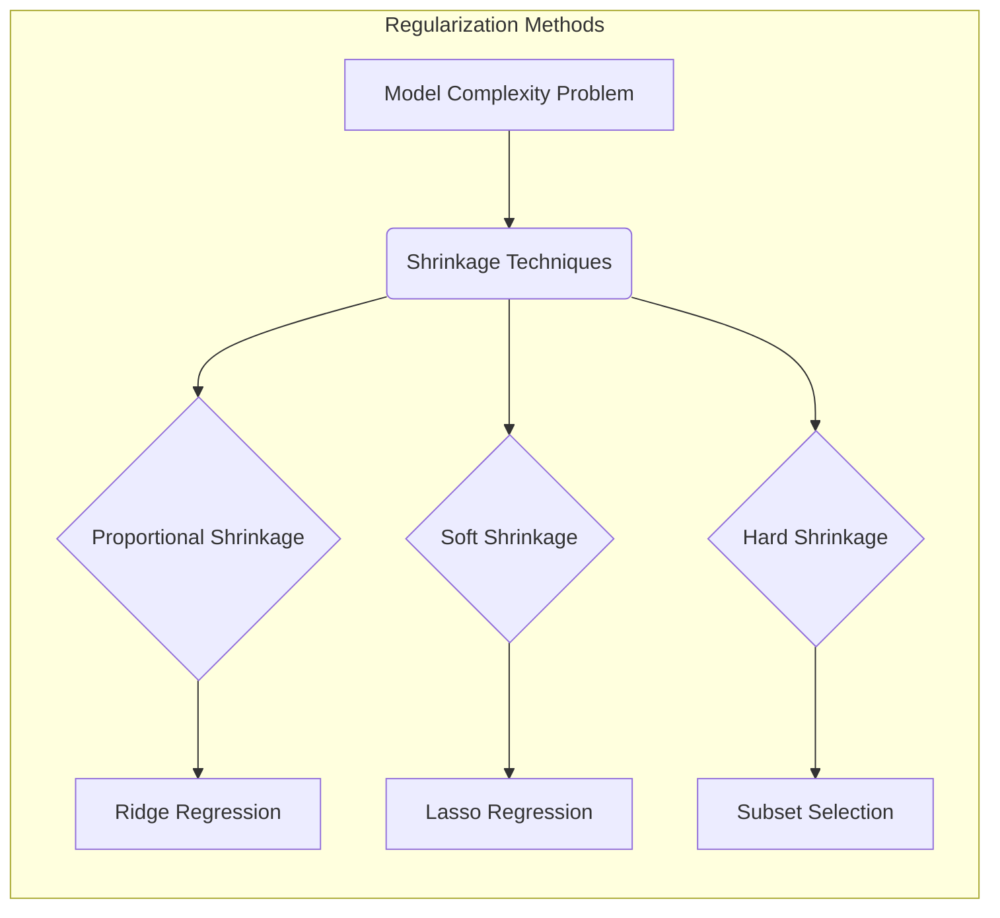
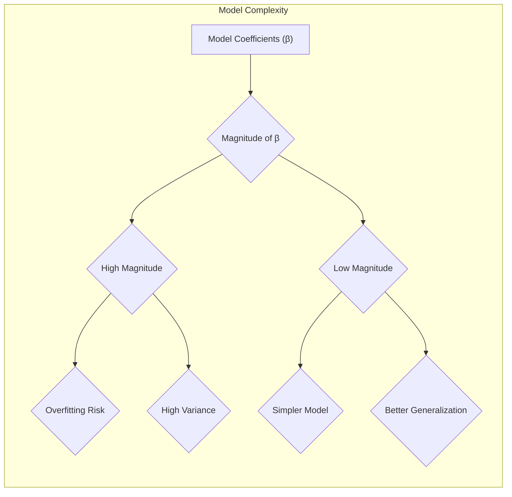
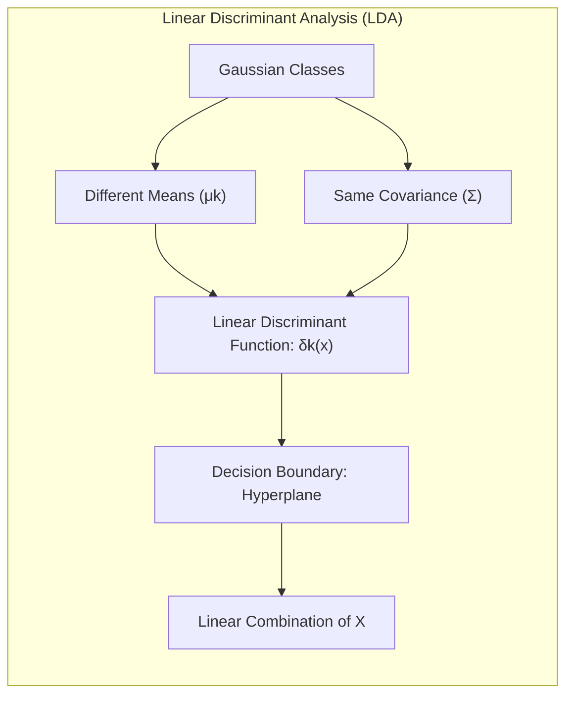
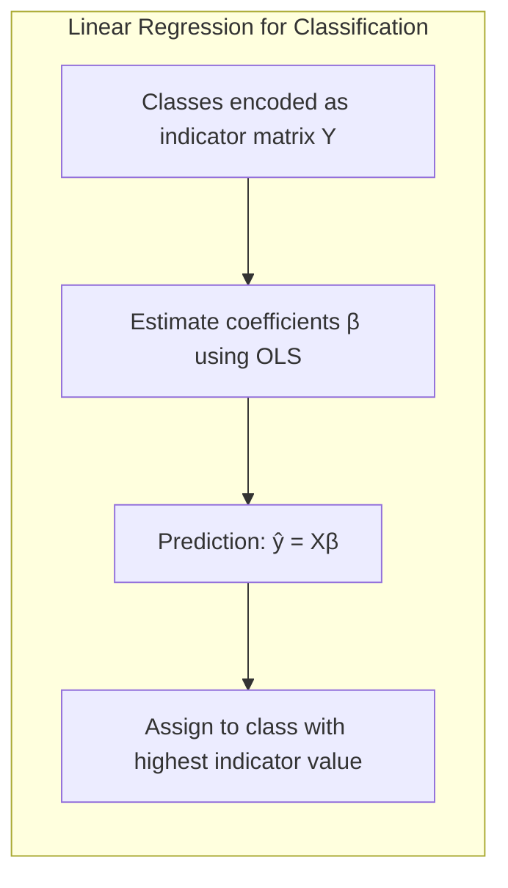
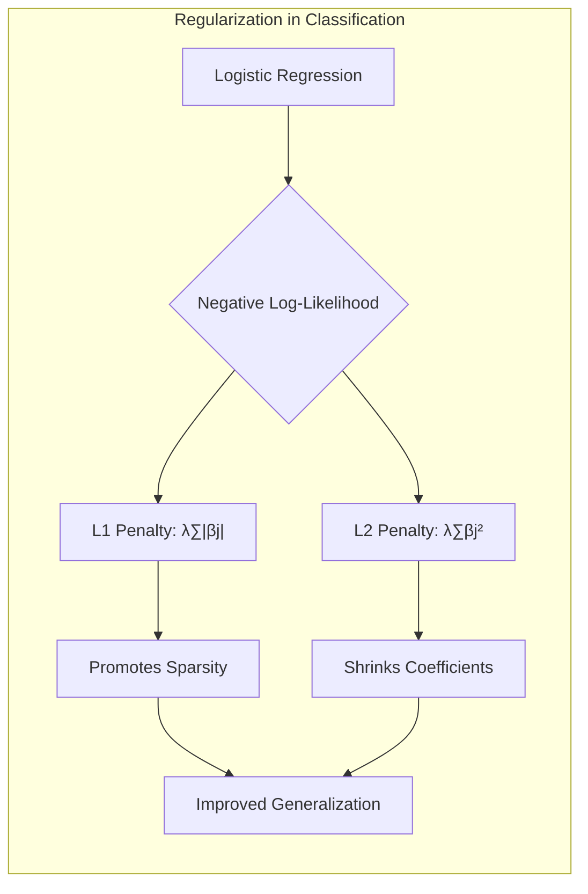
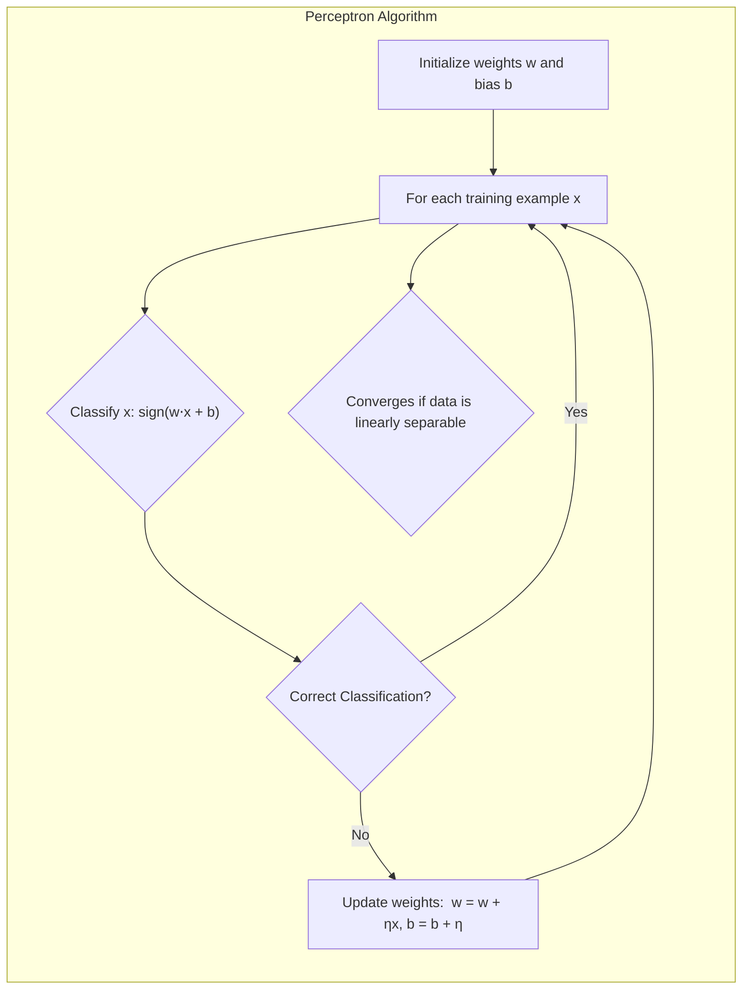
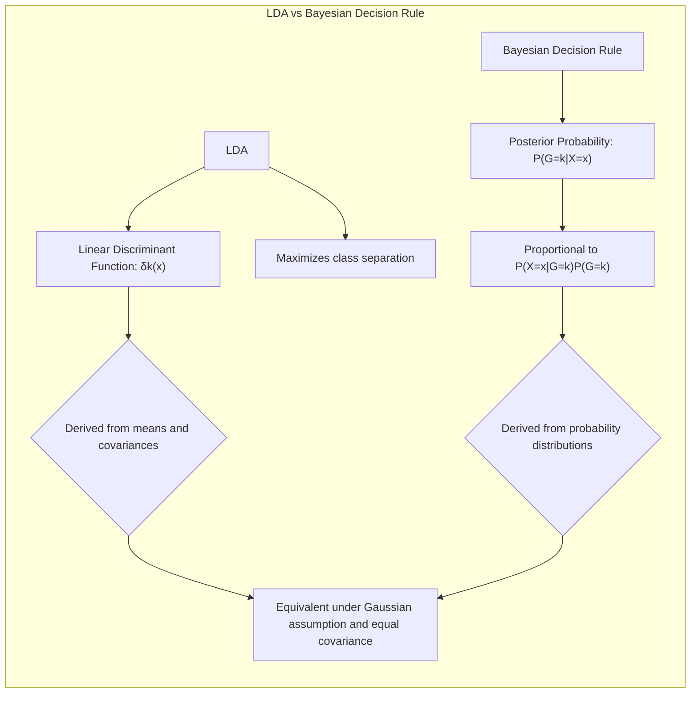

## Shrinkage Methods: A Deep Dive into Proportional, Soft, and Hard Approaches



### Introdução
No campo da **modelagem estatística**, particularmente em problemas de **regressão e classificação**, a complexidade e o risco de *overfitting* são desafios constantes [^4.1]. A capacidade de um modelo se ajustar excessivamente aos dados de treino, em detrimento de sua performance em dados não vistos, leva a generalizações pobres e resultados não confiáveis. Para mitigar esse problema, foram desenvolvidas as chamadas técnicas de **regularização** ou *shrinkage*, que visam reduzir a magnitude dos coeficientes do modelo, favorecendo soluções mais simples e robustas. Este capítulo explora em profundidade diferentes abordagens de *shrinkage*, com foco nas técnicas proporcionais, *soft* e *hard* [^4.1].

### Conceitos Fundamentais
Para uma compreensão sólida, é crucial dominar alguns conceitos fundamentais [^4.1], [^4.2].

**Conceito 1: O Problema da Complexidade do Modelo**
Modelos de regressão linear, dados por $f(x) = \beta_0 + \sum_{j=1}^p X_j\beta_j$, são suscetíveis ao *overfitting*, especialmente quando o número de preditores ($p$) é alto em relação ao número de observações ($N$) [^4.1]. A regressão linear padrão (mínimos quadrados) tende a gerar coeficientes que se ajustam aos ruídos específicos dos dados de treinamento, resultando em alta variância e baixa capacidade de generalização.  O objetivo central das técnicas de *shrinkage* é controlar esse *trade-off* entre **viés** e **variância** [^4.2].

> 💡 **Exemplo Numérico:** Imagine um cenário com 100 observações ($N=100$) e 50 preditores ($p=50$). Um modelo de regressão linear com mínimos quadrados pode se ajustar excessivamente aos dados de treinamento, gerando coeficientes muito grandes que capturam o ruído aleatório. Isso resultaria em um modelo com baixa capacidade de generalização para novos dados. Técnicas de *shrinkage* ajudam a mitigar esse problema, reduzindo a magnitude dos coeficientes.

**Lemma 1:**  A complexidade de um modelo linear está diretamente relacionada à magnitude de seus coeficientes.  Modelos com coeficientes maiores têm maior capacidade de se ajustar ao ruído dos dados, levando a maior variância e menor capacidade de generalização.
*Prova:*  Em regressão linear, os coeficientes são estimados minimizando o RSS (Residual Sum of Squares), conforme definido em (3.2) [^4.2].  Coeficientes maiores tendem a produzir um RSS menor nos dados de treino, mas podem aumentar a probabilidade de se ajustarem ao ruído, aumentando a variância. $\blacksquare$


**Conceito 2: Linear Discriminant Analysis (LDA) e suas Premissas**
A **Linear Discriminant Analysis (LDA)** é um método de classificação linear que assume que as classes são normalmente distribuídas, com médias diferentes, mas com matriz de covariância comum [^4.3]. A LDA busca encontrar a combinação linear de preditores que melhor separam as classes, maximizando a distância entre as médias e minimizando a variância dentro das classes. Uma abordagem de classificação linear é apresentada em [^4.2] onde $f(X) = \beta_0 + \sum_{j=1}^p X_j \beta_j$, e os coeficientes $\beta_j$ podem ser estimados via mínimos quadrados. As suposições de normalidade e homogeneidade de variâncias em LDA, embora simplificadoras, podem influenciar a escolha do melhor método de *shrinkage*.

**Corolário 1:**  Sob a suposição de classes Gaussianas com mesma covariância, a fronteira de decisão ideal entre duas classes é um hiperplano. A LDA busca uma projeção linear dos dados que maximize a separabilidade das classes.
*Prova:* A função discriminante linear na LDA,  $\delta_k(x) = x^T \Sigma^{-1}\mu_k - \frac{1}{2}\mu_k^T\Sigma^{-1}\mu_k + log(\pi_k)$ , mostra que a decisão de classe é baseada em uma função linear de x. Ao assumir covariâncias iguais, $\Sigma$, essa função simplifica a uma combinação linear de $x$ [^4.3.1].  $\blacksquare$


> 💡 **Exemplo Numérico:** Considere duas classes com médias $\mu_1 = [1, 1]^T$ e $\mu_2 = [3, 3]^T$, e uma matriz de covariância comum $\Sigma = \begin{bmatrix} 1 & 0 \\ 0 & 1 \end{bmatrix}$. A LDA encontrará um hiperplano (neste caso, uma linha) que separa as duas classes da melhor forma possível.  A função discriminante simplificada,  $\delta_k(x) = x^T \Sigma^{-1}\mu_k - \frac{1}{2}\mu_k^T\Sigma^{-1}\mu_k + log(\pi_k)$, mostrará que a decisão é baseada em uma combinação linear de *x*.

**Conceito 3: Regressão Logística e a Função Logit**
A **Regressão Logística**, por sua vez, é um método para problemas de classificação onde a variável resposta é binária [^4.4]. Ela modela a probabilidade de um evento (classe) usando a função *logit*, que é uma transformação logarítmica das *odds* de um evento: $logit(p(x)) = \log(\frac{p(x)}{1 - p(x)})$. A regressão logística estima os parâmetros $\beta$ do modelo maximizando a verossimilhança dos dados [^4.4.1].  A regularização é, também nesse contexto, essencial para estabilizar e melhorar a generalização do modelo. A escolha entre LDA e regressão logística depende das suposições sobre a distribuição dos dados, conforme detalhado nos tópicos [^4.3] e [^4.4].

> ⚠️ **Nota Importante**:  A Regressão Logística e LDA, apesar de serem diferentes em formulação, podem levar a decisões de classe semelhantes quando os dados são aproximadamente lineares [^4.5].
> ❗ **Ponto de Atenção**:  Em situações com dados desbalanceados, a regressão logística pode ser mais adequada para modelar a probabilidade da classe minoritária [^4.4.2].
> ✔️ **Destaque**:  A comparação entre os coeficientes de LDA e regressão logística fornece insights valiosos sobre a importância relativa dos preditores em cada contexto [^4.5].

### Regressão Linear e Mínimos Quadrados para Classificação

**Explicação:**  Este diagrama ilustra o processo de regressão de indicadores e seu fluxo em um problema de classificação, em comparação com outros métodos [^4.2].

A regressão linear pode ser utilizada em problemas de classificação, codificando as classes em uma matriz de indicadores e aplicando o método dos mínimos quadrados para estimar os coeficientes [^4.2].  Neste contexto, cada coluna da matriz de indicadores representa uma classe, e a predição é feita atribuindo uma nova observação à classe cujo indicador apresenta o maior valor previsto. Formalmente, se $Y$ é a matriz de indicadores onde $Y_{ik}$ = 1 se a i-ésima observação pertence à k-ésima classe, e 0 caso contrário,  o modelo de regressão é dado por $Y=X\beta + \epsilon$ [^4.2]. O objetivo é estimar $\beta$ de modo a minimizar o RSS.  A decisão de classe é dada por $\hat{y} = argmax_k (X\hat{\beta})_k$.

> 💡 **Exemplo Numérico:** Considere um problema de classificação com 3 classes e 4 observações. A matriz de indicadores *Y* e a matriz de preditores *X* podem ser representadas como:
>
> $$
> Y = \begin{bmatrix} 1 & 0 & 0 \\ 0 & 1 & 0 \\ 0 & 0 & 1 \\ 1 & 0 & 0 \end{bmatrix}, \quad
> X = \begin{bmatrix} 1 & 2 \\ 2 & 1 \\ 3 & 3 \\ 4 & 2 \end{bmatrix}
> $$
>
> Usando o método dos mínimos quadrados, podemos estimar os coeficientes $\beta$ como $\hat{\beta} = (X^TX)^{-1}X^TY$.
>  ```python
> import numpy as np
> from numpy.linalg import inv
>
> X = np.array([[1, 2], [2, 1], [3, 3], [4, 2]])
> Y = np.array([[1, 0, 0], [0, 1, 0], [0, 0, 1], [1, 0, 0]])
>
> X_transpose = X.T
> beta_hat = np.dot(np.dot(inv(np.dot(X_transpose, X)), X_transpose), Y)
> print("Estimated beta: \n", beta_hat)
> ```
> A saída do código mostra os coeficientes $\hat{\beta}$ que, quando multiplicados por um novo conjunto de preditores, permitirão a alocação à classe com maior valor predito.
> Para uma nova observação $x_{new} = [2, 2]$, a predição é $x_{new}\hat{\beta}$.

**Lemma 2:**  A regressão linear em matrizes de indicadores, sob certas condições, gera fronteiras de decisão lineares similares à LDA.
*Prova:*  Quando as classes podem ser razoavelmente separadas por hiperplanos, o método de mínimos quadrados aplicado à matriz de indicadores encontra uma solução que se assemelha às projeções geradas por um discriminante linear.  No entanto, sob condições de alta dimensionalidade e *collinearities* entre as classes, regressão linear pode levar a resultados instáveis ou mesmo a extrapolações fora do intervalo [0,1]  [^4.2], [^4.3].  $\blacksquare$

**Corolário 2:**  Embora a regressão linear em matriz de indicadores possa gerar resultados comparáveis a outros métodos lineares como LDA, ela é sensível a multicolinearidade e pode produzir estimativas menos estáveis quando as classes não são bem separadas.
*Prova:* A estimativa de parâmetros na regressão linear de indicadores pode ser instável e levar a extrapolações problemáticas, principalmente quando a multicolinearidade entre as classes é alta [^4.2]. A LDA, por sua vez, utiliza uma estrutura baseada na análise de covariância, que muitas vezes leva a estimativas mais robustas. $\blacksquare$

Apesar de sua simplicidade, a regressão linear com matrizes de indicadores apresenta limitações, como a dificuldade em modelar probabilidades, e a possibilidade de gerar previsões fora do intervalo [0,1].

### Métodos de Seleção de Variáveis e Regularização em Classificação

 A seleção de variáveis e a regularização são técnicas cruciais para lidar com problemas de classificação em altas dimensões [^4.5], [^4.4.4]. As técnicas de regularização, como L1 e L2, impõem restrições aos coeficientes do modelo,  penalizando os coeficientes maiores e promovendo modelos mais simples e generalizáveis. Na regressão logística, o logit do modelo é geralmente ajustado utilizando um processo de máxima verossimilhança, que pode ser facilmente adaptado para incluir termos de regularização.

A função de custo em regressão logística, geralmente expressa como *negative log-likelihood*, pode ser regularizada pela adição de termos de penalidade. A **penalidade L1**, dada por $\lambda \sum_{j=1}^p |\beta_j|$, promove a esparsidade do modelo, fazendo com que alguns coeficientes sejam exatamente zero [^4.4.4]. Isso realiza uma seleção de variáveis *embutida*, identificando os preditores mais relevantes.  Por outro lado, a **penalidade L2**, expressa como $\lambda \sum_{j=1}^p \beta_j^2$, reduz a magnitude de todos os coeficientes, promovendo estabilidade e evitando soluções com parâmetros muito grandes [^4.4.4], [^4.5]. Ambas as abordagens ajudam a lidar com o *overfitting*.

> 💡 **Exemplo Numérico:** Para ilustrar a diferença entre L1 e L2, vamos gerar um conjunto de dados sintético para regressão logística e aplicar ambas as regularizações:
> ```python
> import numpy as np
> import matplotlib.pyplot as plt
> from sklearn.linear_model import LogisticRegression
> from sklearn.preprocessing import StandardScaler
> from sklearn.pipeline import make_pipeline
> from sklearn.model_selection import train_test_split
>
> # Gerar dados sintéticos
> np.random.seed(42)
> X = np.random.randn(100, 10)
> y = np.random.randint(0, 2, 100)
> X_train, X_test, y_train, y_test = train_test_split(X, y, test_size=0.3, random_state=42)
>
> # Criar modelos regularizados
> model_l1 = make_pipeline(StandardScaler(), LogisticRegression(penalty='l1', solver='liblinear', C=0.1))
> model_l2 = make_pipeline(StandardScaler(), LogisticRegression(penalty='l2', C=0.1))
>
> # Ajustar modelos
> model_l1.fit(X_train, y_train)
> model_l2.fit(X_train, y_train)
>
> # Obter coeficientes
> coef_l1 = model_l1.named_steps['logisticregression'].coef_[0]
> coef_l2 = model_l2.named_steps['logisticregression'].coef_[0]
>
> print("L1 Coefficients:", coef_l1)
> print("L2 Coefficients:", coef_l2)
>
> # Plotar coeficientes
> plt.figure(figsize=(10, 6))
> plt.plot(coef_l1, label='L1 (Lasso)')
> plt.plot(coef_l2, label='L2 (Ridge)')
> plt.xlabel('Coeficiente Index')
> plt.ylabel('Valor do Coeficiente')
> plt.title('Comparação de coeficientes L1 e L2')
> plt.legend()
> plt.grid(True)
> plt.show()
> ```
> Este exemplo demonstra que a regularização L1 (Lasso) tende a zerar alguns coeficientes, resultando em um modelo mais esparso, enquanto a L2 (Ridge) apenas reduz a magnitude dos coeficientes.

**Lemma 3:** A penalidade L1 em regressão logística leva a coeficientes esparsos, ou seja, alguns coeficientes tendem a ser exatamente zero.
*Prova:* O termo da penalidade L1, dado por $\lambda \sum_{j=1}^p |\beta_j|$, é não-diferenciável em zero, o que resulta na concentração de probabilidade nas bordas da região de solução.  Essa característica provoca a redução de alguns coeficientes para exatamente zero, efetivando uma seleção de variáveis [^4.4.4], [^4.4.5]. $\blacksquare$

**Prova do Lemma 3:**  A prova formal envolve a análise da subgradiente da função de penalidade, mostrando como a não-diferenciabilidade em zero faz com que algumas soluções mínimas ocorram onde um ou mais $\beta_j$ são nulos [^4.4.3].  Este processo está relacionado à busca por soluções "esparsas" que simplificam a interpretação e melhoram a generalização do modelo. $\blacksquare$

**Corolário 3:**  A esparsidade promovida pela penalidade L1 facilita a interpretação dos modelos classificatórios, identificando quais preditores são mais relevantes para a decisão de classe.
*Prova:*  Ao reduzir a quantidade de parâmetros ativos, a penalização L1 torna o modelo mais parcimonioso e, consequentemente, mais fácil de ser interpretado. Os preditores com coeficientes diferentes de zero são os que efetivamente contribuem para a decisão de classe [^4.4.5]. $\blacksquare$

> ⚠️ **Ponto Crucial**:  A combinação das penalidades L1 e L2, conhecida como *Elastic Net*, permite aproveitar as vantagens de ambos os métodos, promovendo tanto a esparsidade quanto a estabilidade do modelo [^4.5].

### Separating Hyperplanes e Perceptrons

A ideia de **hiperplanos separadores** é fundamental para a classificação linear, representando a fronteira de decisão entre diferentes classes [^4.5.2]. Em um espaço de alta dimensionalidade, um hiperplano é uma superfície linear que divide o espaço em regiões correspondentes a diferentes classes. A busca por um hiperplano ótimo geralmente envolve a maximização da margem de separação, ou seja, a distância entre o hiperplano e os pontos mais próximos de cada classe. O modelo de regressão logística, embora estime probabilidades, também gera hiperplanos de decisão lineares.

O **Perceptron**, um algoritmo clássico de aprendizagem, busca encontrar um hiperplano separador iterativamente [^4.5.1]. O algoritmo começa com uma fronteira de decisão aleatória, e a cada iteração, atualiza seus pesos com base em erros de classificação. Se a classificação de uma observação estiver incorreta, os pesos são ajustados de modo a mover a fronteira de decisão na direção correta, garantindo eventualmente uma separação perfeita caso as classes sejam linearmente separáveis [^4.5.1].

> 💡 **Exemplo Numérico:** Considere duas classes linearmente separáveis com os seguintes pontos: Classe 1:  $(-1, -1), (-2, -2)$; Classe 2: $(1, 1), (2, 2)$. Inicializamos pesos aleatórios, por exemplo, $w = [0.1, 0.2]$ e um bias $b = 0.0$. O Perceptron itera sobre os pontos, atualizando os pesos quando uma classificação incorreta é encontrada:
>
> 1. Ponto $(-1, -1)$:  $w \cdot x + b = 0.1*(-1) + 0.2*(-1) + 0 = -0.3$. Classificação incorreta (deveria ser > 0).  Atualiza $w = w + \eta x = [0.1, 0.2] + 1*[-1,-1] = [-0.9,-0.8]$, $b = b + \eta * 1 = 0 + 1 = 1$ (onde $\eta = 1$).
> 2. Ponto $(-2, -2)$: $w \cdot x + b = -0.9*(-2) + (-0.8)*(-2) + 1 = 1.8 + 1.6 + 1 = 4.4$. Classificação correta.
> 3. Ponto $(1, 1)$:  $w \cdot x + b = -0.9*(1) + (-0.8)*(1) + 1 = -0.7$. Classificação incorreta (deveria ser < 0). Atualiza $w = w - \eta x = [-0.9, -0.8] - 1*[1,1] = [-1.9, -1.8]$, $b = b - \eta * 1 = 1 - 1 = 0$
> 4. Ponto $(2, 2)$: $w \cdot x + b = -1.9*(2) + (-1.8)*(2) + 0 = -3.8 - 3.6 = -7.4$. Classificação correta.
>
> Este processo continua até que não haja classificações incorretas, encontrando um hiperplano separador.

**Teorema:** Se os dados forem linearmente separáveis, o algoritmo do Perceptron converge em um número finito de iterações. A prova envolve a demonstração de que cada atualização de pesos reduz a distância entre as classificações e a fronteira de decisão até que o erro seja nulo.
*Prova:* A prova do teorema do Perceptron usa o conceito de separabilidade dos dados para demonstrar que a cada atualização da função discriminante, o erro de classificação é reduzido, garantindo a convergência em número finito de passos [^4.5.1]. $\blacksquare$

### Pergunta Teórica Avançada (Exemplo): Quais as diferenças fundamentais entre a formulação de LDA e a Regra de Decisão Bayesiana considerando distribuições Gaussianas com covariâncias iguais?

**Resposta:** A Linear Discriminant Analysis (LDA) e a Regra de Decisão Bayesiana compartilham um objetivo comum: encontrar a melhor forma de classificar dados, dadas as distribuições das classes. Quando ambas assumem distribuições Gaussianas com matrizes de covariância iguais entre classes, elas se tornam profundamente relacionadas [^4.3].

Na **Regra de Decisão Bayesiana**, a decisão de classificar uma observação x para a classe k é baseada na probabilidade posterior $P(G=k|X=x)$, que é proporcional a $P(X=x|G=k)P(G=k)$ [^4.3]. Para distribuições Gaussianas com mesma covariância, $P(X=x|G=k) \sim \mathcal{N}(\mu_k, \Sigma)$ e a função discriminante resultante é uma função linear de $x$ [^4.3.3].

Por outro lado, a **LDA** deriva uma função discriminante linear diretamente, buscando maximizar a separação entre as classes. Dada a premissa de covariâncias iguais para as classes, a LDA utiliza a fórmula $\delta_k(x) = x^T \Sigma^{-1}\mu_k - \frac{1}{2}\mu_k^T\Sigma^{-1}\mu_k + log(\pi_k)$ [^4.3.1]. As similaridades entre LDA e a regra de decisão Bayesiana são mais evidentes quando comparamos o discriminante da LDA com a probabilidade posterior logarítmica. A diferença reside principalmente na abordagem utilizada: A regra Bayesiana parte das probabilidades posteriores, enquanto a LDA deriva a função linear diretamente através da análise das médias e covariâncias.

**Lemma 4:**  Em distribuições Gaussianas com covariâncias iguais, as fronteiras de decisão definidas pela LDA são idênticas às fronteiras obtidas pela regra de decisão Bayesiana.
*Prova:* Ao analisar as funções discriminantes de cada método e expandir seus termos, fica claro que ambos utilizam combinações lineares de x, utilizando as médias de cada classe ponderadas pela inversa da matriz de covariância comum [^4.3], [^4.3.3].  Sob as premissas de normalidade e covariâncias iguais, o discriminante da LDA se torna proporcional ao logaritmo da probabilidade posterior definida pela regra de Bayes.  $\blacksquare$

**Corolário 4:**  Ao relaxar a suposição de covariâncias iguais, a regra de decisão Bayesiana leva a fronteiras de decisão quadráticas, conhecidas como **Quadratic Discriminant Analysis (QDA)**.  A LDA, que assume igualdade nas matrizes de covariâncias, não é capaz de gerar tais fronteiras quadráticas.
*Prova:* Sem a igualdade nas covariâncias, o discriminante de Bayes torna-se uma função quadrática de $x$ dada por $\delta_k(x) = - \frac{1}{2}(x - \mu_k)^T \Sigma_k^{-1}(x - \mu_k) + \log(\pi_k)$ [^4.3], [^4.3.1]. $\blacksquare$

> ⚠️ **Ponto Crucial**: A escolha entre LDA e QDA depende da validade da suposição de homogeneidade das covariâncias. Quando essa suposição é violada, a QDA pode ser mais apropriada, embora com o custo de mais parâmetros a serem estimados e um maior risco de *overfitting* [^4.3.1].

### Conclusão
Este capítulo abordou em profundidade as técnicas de *shrinkage*, explorando abordagens proporcionais, *soft* e *hard* no contexto da modelagem estatística. O *trade-off* entre viés e variância foi um tema central, e as ferramentas apresentadas visam a encontrar um equilíbrio ideal para cada problema específico [^4.1]. A exploração de métodos como LDA e Regressão Logística, junto com a discussão de regularização L1, L2, e métodos como a regressão de indicadores,  forneceu uma visão completa dos desafios e das soluções na modelagem de dados complexos [^4.2], [^4.3], [^4.4], [^4.5].  O uso de modelos lineares, como hiperplanos separadores, Perceptrons, bem como a discussão de seleções de variáveis, e aprofundamento dos conceitos, fornecem uma base sólida para a compreensão do que se segue nesse campo.
<!-- END DOCUMENT -->

### Footnotes
[^4.1]: "A linear regression model assumes that the regression function E(Y|X) is linear in the inputs X1,..., Xp. Linear models were largely developed in the precomputer age of statistics, but even in today's computer era there are still good reasons to study and use them." *(Trecho de Linear Methods for Regression)*
[^4.2]: "The linear model either assumes that the regression function E(Y|X) is linear, or that the linear model is a reasonable approximation. Here the Bj's are unknown parameters or coefficients, and the variables X; can come from different sources" *(Trecho de Linear Methods for Regression)*
[^4.3]: "Typically we have a set of training data (X1, Y1) ... (xn, yn) from which to estimate the parameters β. Each xi = (Xi1, Xi2,...,xip)T is a vector of feature measurements for the ith case." *(Trecho de Linear Methods for Regression)*
[^4.3.1]: "Assuming (for the moment) that X has full column rank, and hence XTX is positive definite, we set the first derivative to zero  XT (y – Xẞ) = 0 to obtain the unique solution  β = (XTX)-1XTy." *(Trecho de Linear Methods for Regression)*
[^4.3.2]: "The predicted values at an input vector xo are given by f(xo) = (1 : xo)Tẞ; the fitted values at the training inputs are y = Xẞ = X(XX)-1X7y, where ŷi = f(xi)." *(Trecho de Linear Methods for Regression)*
[^4.3.3]: "We denote the column vectors of X by x0, x1,..., Xp, with x0 = 1. For much of what follows, this first column is treated like any other. These vectors span a subspace of IRN, also referred to as the column space of X." *(Trecho de Linear Methods for Regression)*
[^4.4]: "To draw inferences about the parameters and the model, additional assumptions are needed. We now assume that (3.1) is the correct model for the mean; that is, the conditional expectation of Y is linear in X1,..., Xp." *(Trecho de Linear Methods for Regression)*
[^4.4.1]: "We also assume that the deviations of Y around its expectation are additive and Gaussian. Hence  Y = E(Y|X1,..., Xp) + ε  =  β0 + \sum_{j=1}^p X_j\beta_j + ε, where the error ε is a Gaussian random variable with expectation zero and variance σ², written ε ~ N(0, σ²)." *(Trecho de Linear Methods for Regression)*
[^4.4.2]: "Often we need to test for the significance of groups of coefficients simul- taneously. For example, to test if a categorical variable with k levels can be excluded from a model, we need to test whether the coefficients of the dummy variables used to represent the levels can all be set to zero." *(Trecho de Linear Methods for Regression)*
[^4.4.3]: "Here we use the F statistic,  F = (RSS0 - RSS1)/(P1 - ро)  RSS1/(N-P1 – 1) where RSS₁ is the residual sum-of-squares for the least squares fit of the big- ger model with p₁ +1 parameters, and RSSo the same for the nested smaller model with po + 1 parameters, having p1 - po parameters constrained to be zero." *(Trecho de Linear Methods for Regression)*
[^4.4.4]: "The F statistic measures the change in residual sum-of-squares per additional parameter in the bigger model, and it is normalized by an esti- mate of σ2." *(Trecho de Linear Methods for Regression)*
[^4.4.5]: "Under the Gaussian assumptions, and the null hypothesis that the smaller model is correct, the F statistic will have a Fp1-po,N-p1-1 dis- tribution." *(Trecho de Linear Methods for Regression)*
[^4.5]: "By retaining a subset of the predictors and discarding the rest, subset selection produces a model that is interpretable and has possibly lower predic- tion error than the full model." *(Trecho de Linear Methods for Regression)*
[^4.5.1]: "However, because it is a discrete process— variables are either retained or discarded—it often exhibits high variance, and so doesn't reduce the prediction error of the full model. Shrinkage methods are more continuous, and don't suffer as much from high variability." *(Trecho de Linear Methods for Regression)*
[^4.5.2]: "Ridge regression shrinks the regression coefficients by imposing a penalty on their size. The ridge coefficients minimize a penalized residual sum of squares,"  *(Trecho de Linear Methods for Regression)*
