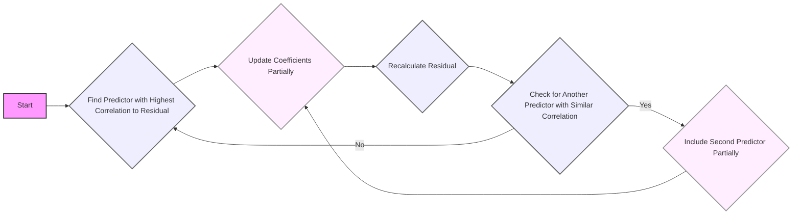
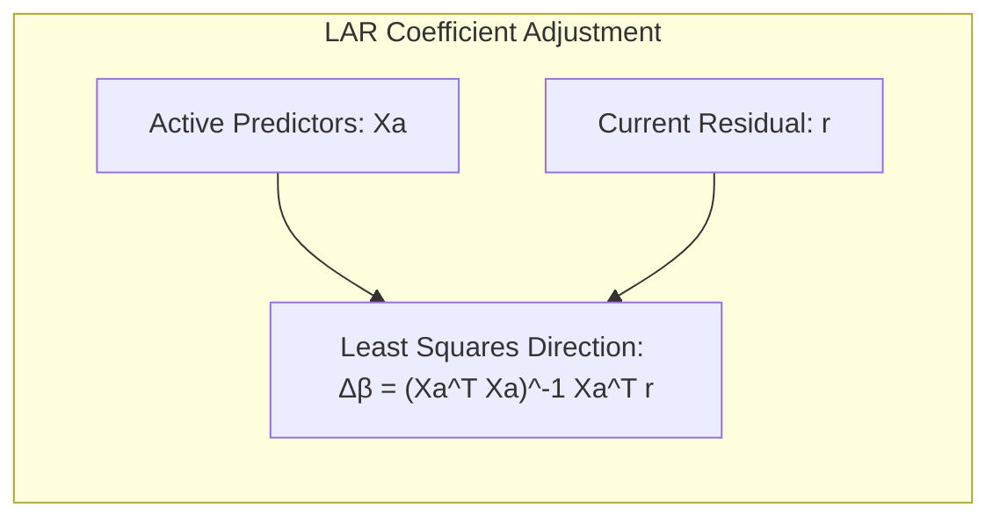
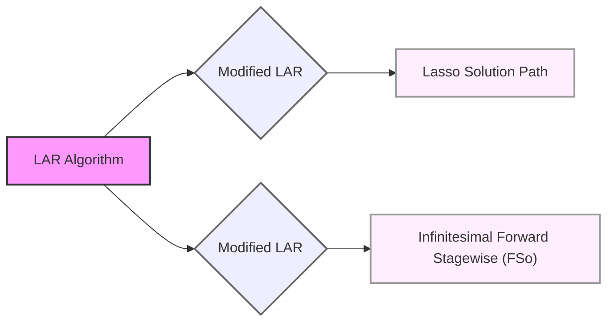
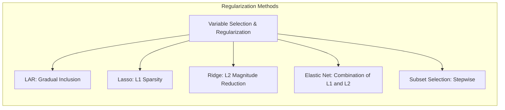
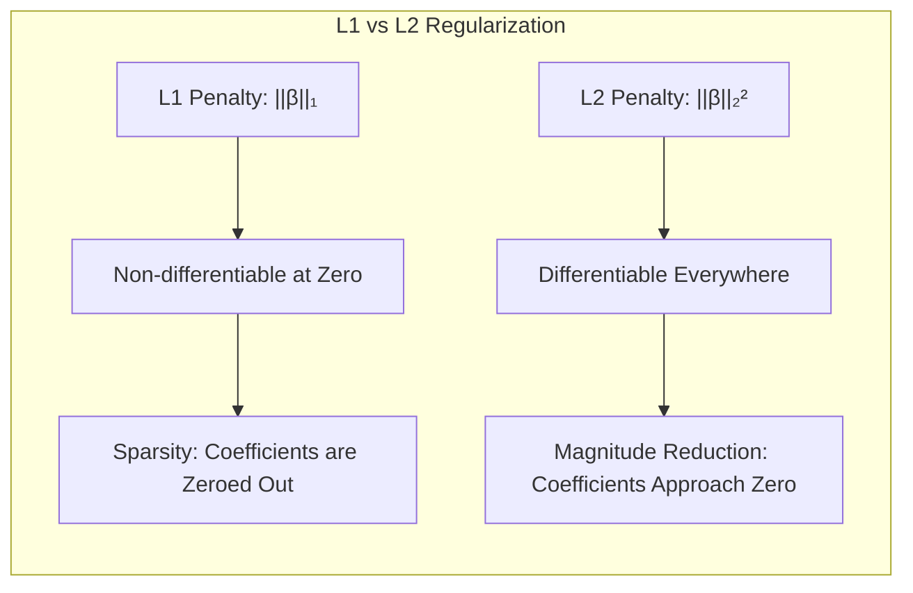
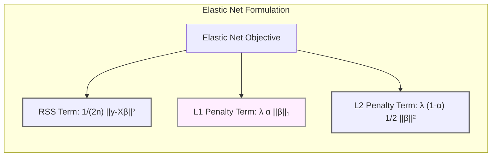
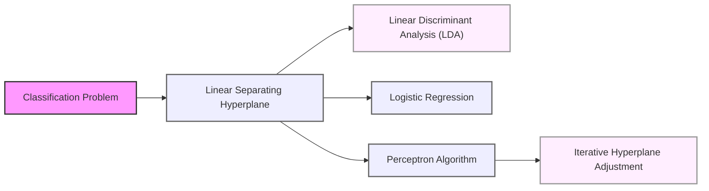
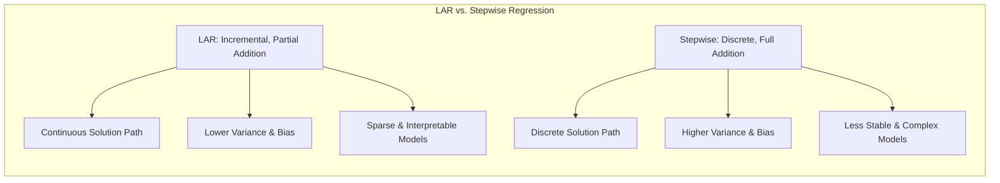

## Least Angle Regression: A Democratic Approach to Forward Stepwise Selection with Partial Predictor Inclusion and Correlated Variable Tracking



### Introdução

A **Least Angle Regression (LAR)** surge como um método de seleção de variáveis e regularização em modelos lineares, oferecendo uma perspectiva distinta em relação aos métodos tradicionais como a regressão stepwise forward e backward. O LAR se destaca por sua abordagem democrática, que inclui os preditores de forma gradual no modelo, monitorando as correlações residuais e evitando a exclusão abrupta de variáveis relevantes [^4.1], [^4.2]. Este capítulo explora o LAR em detalhes, destacando suas propriedades, conexões com outros métodos e aplicações.

### Conceitos Fundamentais

**Conceito 1: Seleção Democrática de Variáveis:** O LAR, diferentemente da regressão stepwise que seleciona variáveis de forma binária (incluídas ou excluídas), incorpora os preditores de forma *parcial*. Cada variável entra no modelo com um *incremento proporcional* à sua correlação com o resíduo atual, permitindo que múltiplas variáveis participem simultaneamente do ajuste [^4.5.1]. Esse processo evita decisões de seleção unilaterais, como as observadas no método stepwise, e permite uma visão mais equilibrada da influência de cada preditor.

> 💡 **Exemplo Numérico:** Imagine que temos um modelo com três preditores (X1, X2, X3) e um resíduo inicial.  Suponha que as correlações de X1, X2 e X3 com o resíduo sejam 0.7, 0.4 e 0.2, respectivamente.  Na regressão stepwise, X1 seria a primeira a entrar no modelo. No LAR, X1 entraria primeiro, mas X2 e X3 também seriam adicionados simultaneamente, com incrementos de seus coeficientes proporcionais a suas correlações residuais (0.7 > 0.4 > 0.2). Se X1, X2 e X3 fossem perfeitamente correlacionados entre si e com o resíduo, seus coeficientes cresceriam em conjunto até que a correlação do resíduo com esses preditores fosse nula. Este processo difere da regressão stepwise, onde a inclusão de X1 poderia "mascarar" a importância de X2 e X3, impedindo-as de entrarem no modelo.

**Lemma 1:** *O caminho da solução do LAR é linear por partes*. Isso significa que os coeficientes dos preditores variam linearmente entre os pontos de inclusão ou exclusão de variáveis. Esta propriedade surge das condições de otimalidade que garantem que as correlações residuais sejam mantidas o mais próximas possível entre as variáveis incluídas. Em outras palavras, enquanto uma variável permanece ativa, seu coeficiente se move em linha reta, com velocidade constante, até que outra variável alcance sua mesma correlação com os resíduos [^4.5.1].

> 💡 **Exemplo Numérico:**  Suponha que, durante a execução do LAR, a variável X1 é a primeira a entrar no modelo. O coeficiente de X1, denotado por β₁, começa a crescer a partir de zero.  Enquanto nenhuma outra variável tem uma correlação tão alta com o resíduo quanto X1, β₁ cresce linearmente.  Se em algum momento a variável X2 alcança a mesma correlação com o resíduo, então X2 também entra no modelo com um coeficiente β₂.  A partir desse ponto, ambos β₁ e β₂ podem crescer (ou diminuir) linearmente com uma taxa definida, até que uma terceira variável seja considerada. Visualmente, se plotarmos o valor dos coeficientes em função do caminho da solução do LAR, obteremos segmentos de retas, cada um representando uma fase em que certas variáveis estão "ativas".
> ```mermaid
> graph LR
>     A[Início] --> B(X1 Entra);
>     B --> C(β1 Cresce Linearmente);
>     C --> D(X2 Entra);
>     D --> E(β1 e β2 Crescem Linearmente);
>     E --> F[Fim];
>     style A fill:#f9f,stroke:#333,stroke-width:2px
>     style B fill:#eef,stroke:#666,stroke-width:2px
>     style C fill:#fef,stroke:#999,stroke-width:2px
>      style D fill:#eef,stroke:#666,stroke-width:2px
>      style E fill:#fef,stroke:#999,stroke-width:2px
>      style F fill:#eef,stroke:#666,stroke-width:2px
> ```

**Conceito 2: Monitoramento das Correlações Residuais:** Central para o funcionamento do LAR é a manutenção de um acompanhamento contínuo das *correlações residuais*. A cada passo, o método identifica a variável que possui a *maior correlação* (em valor absoluto) com o resíduo atual. Ao invés de incluir a variável por completo, o LAR ajusta seus coeficientes de modo a reduzir sua correlação com o resíduo, prosseguindo até que outra variável atinja uma correlação semelhante [^4.5.2]. Esse processo iterativo assegura que as variáveis com maior importância para a redução do erro sejam priorizadas.

> 💡 **Exemplo Numérico:** Considere um resíduo inicial $\mathbf{r}$ e três preditores X1, X2 e X3. Suponha que as correlações com $\mathbf{r}$ sejam: $corr(\mathbf{r}, \text{X1}) = 0.8$, $corr(\mathbf{r}, \text{X2}) = -0.6$, e $corr(\mathbf{r}, \text{X3}) = 0.3$. O LAR selecionaria X1 inicialmente (maior valor absoluto da correlação). O algoritmo aumentaria o coeficiente de X1, reduzindo a correlação entre $\mathbf{r}$ e X1.  Esse processo continuaria até que outra variável (por exemplo, X2, com correlação inicial -0.6) tivesse uma correlação em valor absoluto igual à de X1. Nesse ponto, X2 também entraria no modelo, e ambos os coeficientes ajustados simultaneamente para reduzir suas correlações com o resíduo. Este acompanhamento das correlações residuais garante que os preditores relevantes sejam adicionados ao modelo, seguindo uma lógica de otimização.

**Corolário 1:** *A direção de ajuste dos coeficientes no LAR é a direção de mínimos quadrados*. Os coeficientes dos preditores ativos se movem na direção da solução de mínimos quadrados para o subespaço definido pelos preditores no conjunto ativo. Isso implica que a cada etapa do LAR, a mudança nos coeficientes é a solução que melhor ajusta os dados no subespaço de preditores considerados, levando a uma otimização eficiente do ajuste do modelo [^4.5.1].


> 💡 **Exemplo Numérico:** Suponha que, em um dado passo do LAR, as variáveis X1 e X2 estejam ativas (com coeficientes $\beta_1$ e $\beta_2$, respectivamente). A direção do ajuste (o quanto $\beta_1$ e $\beta_2$ devem variar) é determinada pela solução de mínimos quadrados para o subespaço gerado por X1 e X2.  Matematicamente, se $X_a$ é a matriz dos preditores ativos (X1 e X2 nesse caso), e $\mathbf{r}$ é o resíduo atual, o incremento nos coeficientes $\Delta\beta$  é calculado como: $\Delta\beta = (X_a^T X_a)^{-1}X_a^T \mathbf{r}$. Esse vetor $\Delta\beta$ indica como os coeficientes devem ser ajustados para reduzir o resíduo, dentro do subespaço de X1 e X2, de forma ótima. Este processo se repete a cada passo do LAR, sempre buscando a melhor direção de ajuste dentro do conjunto de preditores ativos.

**Conceito 3: Conexão com o Lasso e o FSo:** O LAR está intimamente relacionado ao **Lasso** (Least Absolute Shrinkage and Selection Operator) e ao **FSo** (Infinitesimal Forward Stagewise Regression). De fato, uma pequena modificação do algoritmo LAR é capaz de gerar o mesmo caminho de soluções que o Lasso, o que o torna uma ferramenta computacional eficiente para a obtenção de soluções do Lasso. O FSo, por sua vez, representa uma versão infinitesimal da regressão stepwise, onde os coeficientes são atualizados de forma contínua e proporcional à correlação com os resíduos, e que também pode ser alcançada com uma modificação do algoritmo LAR [^4.5.2], [^4.8]. Essas conexões revelam que o LAR não é apenas um método, mas um framework flexível para diferentes abordagens de regularização.


> ⚠️ **Nota Importante:** O LAR, o Lasso e o FSo compartilham um comportamento de linearidade por partes no caminho de soluções, o que permite a utilização de algoritmos eficientes para explorar todo o espaço de regularização.
>
> ❗ **Ponto de Atenção:** Apesar de sua semelhança, o LAR difere do Lasso em sua implementação original. A inclusão/remoção de variáveis no LAR é baseada na correlação, enquanto o Lasso busca uma solução que minimize o erro e a norma L1 dos coeficientes.
>
> ✔️ **Destaque:** A formulação do LAR como um método de mínimos quadrados com restrição não-negativa (ver algoritmo 3.2b no contexto) é crucial para sua conexão com o FSo e outros métodos de regularização.

### Regressão Linear e Mínimos Quadrados para Classificação

```mermaid
graph LR
    A["Regression Task"] --> B["Linear Regression"]
    B --> C["Least Squares"]
    C --> D["Minimization of RSS"]
    D --> E["Coefficient Calculation"]
    E --> F["Indicator Regression for Classification"]
    F --> G["Linear Decision Boundaries"]
    style A fill:#f9f,stroke:#333,stroke-width:2px
    style B fill:#eef,stroke:#666,stroke-width:2px
    style C fill:#fef,stroke:#999,stroke-width:2px
    style D fill:#eef,stroke:#666,stroke-width:2px
    style E fill:#eef,stroke:#666,stroke-width:2px
    style F fill:#fef,stroke:#999,stroke-width:2px
    style G fill:#fef,stroke:#999,stroke-width:2px
```


**Explicação:** Este diagrama ilustra a regressão linear e sua relação com o método de mínimos quadrados e sua aplicação para classificação com a regressão de indicadores.

A aplicação da regressão linear e mínimos quadrados à classificação pode ser vista sob duas perspectivas. A primeira, através da regressão de indicadores [^4.2], onde cada classe é representada por um vetor indicador e a regressão é usada para modelar as relações entre as classes e os preditores. A segunda, através da conexão com a *Linear Discriminant Analysis (LDA)* e *Logistic Regression*, que utilizam o conceito de fronteiras de decisão lineares [^4.1]. A regressão linear, por sua natureza, busca a minimização da soma dos quadrados dos resíduos, uma medida de erro global que pode não ser diretamente otimizada para classificação.
Por exemplo, na regressão de indicadores, a atribuição de classes é feita por meio de uma regra de decisão baseada nos valores preditos, podendo não levar diretamente a boas classificações. Este método sofre com o problema de *masking*, onde uma classe pode ocultar a influência de outras quando a classe correspondente tem maior variabilidade [^4.3]. É importante ressaltar que a regressão linear minimiza o erro quadrático médio, uma métrica global que pode não ser a mais adequada para problemas de classificação, onde o objetivo é classificar corretamente os dados, não apenas estimar valores precisos [^4.2].

> 💡 **Exemplo Numérico:** Considere um problema de classificação binária com duas classes (0 e 1) e dois preditores X1 e X2. Podemos codificar a classe 1 como 1 e a classe 0 como 0, e usar regressão linear para predizer os valores de classe. Se tivermos as seguintes amostras:
>
> | X1  | X2  | Classe |
> | --- | --- | ------ |
> | 1   | 1   | 0      |
> | 2   | 1   | 0      |
> | 1   | 2   | 1      |
> | 2   | 2   | 1      |
>
> Aplicando a regressão linear com mínimos quadrados, podemos obter os coeficientes que minimizam o erro quadrático na predição da classe. O modelo resultante seria $\hat{y} = \beta_0 + \beta_1 X_1 + \beta_2 X_2$. A regra de classificação poderia ser: classificar como 1 se $\hat{y} \geq 0.5$ e como 0 caso contrário.  Contudo, a regressão linear não foi otimizada para este tipo de problema, e podem ocorrer extrapolações (valores preditos maiores que 1 ou menores que 0). O problema de "masking" ocorre quando, por exemplo, a classe 0 tem alta variabilidade em X1, mas a classe 1 tem variabilidade baixa, a regressão linear tenderá a se ajustar melhor à classe 0, prejudicando a classificação da classe 1.

**Lemma 2:** *As direções de ajuste do LAR são as direções de mínimos quadrados para o subespaço dos preditores ativos*. No contexto da regressão de indicadores ou mesmo na relação com a LDA, esse resultado mostra que, em cada etapa do LAR, a direção de ajuste dos coeficientes para os preditores ativos corresponde à direção que minimiza o erro quadrático da regressão nesse subespaço, o que garante que os ajustes locais estejam sempre otimizados [^4.5.1].

> 💡 **Exemplo Numérico:** No exemplo anterior, ao usar o LAR para construir um modelo para regressão de indicadores, em cada passo, o algoritmo selecionará um ou mais preditores (X1 ou X2, ou ambos), e o ajuste dos coeficientes será feito utilizando mínimos quadrados dentro do subespaço de preditores ativos. Digamos que, em um certo passo, apenas X1 esteja ativo, então o ajuste de seu coeficiente será na direção que minimize o erro quadrático usando apenas X1.  Em um outro passo, se ambos X1 e X2 estiverem ativos, então o ajuste dos seus coeficientes buscará a direção que minimize o erro quadrático usando ambos X1 e X2 como preditores. Essa direção será precisamente a solução de mínimos quadrados restrita ao subespaço de X1 e X2.

**Corolário 2:** *Em certas condições, o LAR e a regressão de indicadores levam a soluções similares*. Se o foco principal é na definição da fronteira de decisão linear, a regressão de indicadores (combinada com uma regra de decisão) e o LAR podem gerar resultados semelhantes, especialmente quando o número de preditores é grande, a correlação entre as classes é baixa, e o foco principal é na identificação dos preditores importantes para a separação entre classes [^4.2], [^4.3].

> 💡 **Exemplo Numérico:** Se tivermos um conjunto de dados com muitas variáveis, mas pouca correlação entre classes, ou seja, as classes estão relativamente bem separadas no espaço dos preditores, tanto o LAR quanto a regressão de indicadores podem chegar a fronteiras de decisão lineares similares.  Isso ocorre porque ambos os métodos focam em identificar as variáveis que contribuem significativamente para a separação entre as classes, mesmo que usando algoritmos diferentes. Se o nosso objetivo for encontrar um modelo esparso (com poucos preditores), o LAR tenderá a convergir para modelos similares aos da regressão de indicadores, especialmente quando combinada com uma regra de decisão.

Contudo, a regressão linear, mesmo quando aplicada à classificação, não é inerentemente equipada para lidar com *não-linearidades*. A escolha da métrica de erro, bem como a natureza linear dos modelos, pode levar a extrapolações problemáticas [^4.4]. Métodos como LDA e Logistic Regression, com foco em *probabilidades* e *odds*, podem apresentar desempenhos superiores em muitos cenários de classificação [^4.4], [^4.5].
>⚠️ **Ponto Crucial**: Embora a regressão de indicadores possa ser utilizada em classificação, ela não possui mecanismos de tratamento de não-linearidade e pode gerar extrapolações problemáticas, especialmente quando os preditores são altamente correlacionados.

### Métodos de Seleção de Variáveis e Regularização em Classificação

O processo de seleção de variáveis e regularização é fundamental em modelos classificatórios, uma vez que permite o controle da complexidade do modelo e a redução da variância [^4.4.4], [^4.5]. O LAR se encaixa nesse cenário como uma alternativa para métodos como o *Lasso* e a *Ridge Regression*, oferecendo um meio de *regularização contínua* que pode levar a modelos mais interpretáveis e com melhor generalização [^4.5].
O Lasso, por exemplo, promove a *esparsidade* dos coeficientes, reduzindo a complexidade do modelo ao forçar alguns coeficientes a zero [^4.4.4]. A Ridge Regression, por sua vez, reduz a magnitude dos coeficientes, o que também controla a complexidade do modelo e reduz o impacto de multicolinearidade [^4.5]. Métodos baseados em seleção de subconjuntos, como *forward e backward stepwise*, buscam o melhor subconjunto de preditores, o que também reduz a complexidade do modelo, mas de forma mais discreta [^4.5.2].
>❗ **Ponto de Atenção**: O LAR, assim como o Lasso, tende a gerar modelos esparsos, ao passo que a Ridge Regression busca reduzir a magnitude dos coeficientes. Essa propriedade faz com que o LAR e o Lasso sejam mais adequados quando se busca modelos com maior interpretabilidade, enquanto a Ridge é preferível em situações de multicolinearidade [^4.5].

> 💡 **Exemplo Numérico:**  Suponha que temos um modelo de classificação com 10 preditores e queremos comparar o efeito do LAR, Lasso, e Ridge. Depois de treinar os modelos em dados de treinamento, podemos observar os seguintes coeficientes (em valor absoluto):
>
> | Preditores | LAR   | Lasso | Ridge |
> | ---------- | ----- | ----- | ----- |
> | X1         | 0.8   | 0.7   | 0.6   |
> | X2         | 0.0   | 0.0   | 0.3   |
> | X3         | 0.5   | 0.4   | 0.5   |
> | X4         | 0.0   | 0.0   | 0.2   |
> | X5         | 0.3   | 0.2   | 0.4   |
> | X6         | 0.0   | 0.0   | 0.1   |
> | X7         | 0.2   | 0.1   | 0.3   |
> | X8         | 0.0   | 0.0   | 0.1   |
> | X9         | 0.1   | 0.0   | 0.2   |
> | X10        | 0.0   | 0.0   | 0.1   |
>
> O LAR e o Lasso zeraram os coeficientes de alguns preditores (X2, X4, X6, X8, e X10 no exemplo), indicando que eles foram considerados menos importantes para o modelo, promovendo esparsidade. A Ridge, por outro lado, não zerou nenhum coeficiente, mas reduziu a magnitude de todos eles, o que pode ser útil se os preditores forem altamente correlacionados entre si. Esta tabela mostra um possível resultado de um processo de regularização em que LAR e Lasso são esparsos e a Ridge não é.

**Lemma 3:** *A penalização L1, utilizada no Lasso, leva à esparsidade dos coeficientes*. Essa propriedade surge do fato de que a norma L1 (soma dos valores absolutos) é não-diferenciável na origem, o que faz com que o caminho de solução do Lasso "atinja" o valor zero para alguns coeficientes, eliminando-os do modelo. A penalização L2, utilizada na Ridge, não tem essa propriedade, e os coeficientes apenas se aproximam de zero conforme a penalidade aumenta [^4.4.4].
**Prova do Lemma 3:** A solução para o problema de otimização do Lasso pode ser vista como uma sequência de ajustes lineares, onde, a cada passo, a direção de ajuste dos coeficientes é definida pela norma L1 dos coeficientes. A norma L1, ao contrário da norma L2 (usada na Ridge), não é diferenciável no ponto zero, o que implica que, em muitas situações, os coeficientes se tornam exatamente zero, levando à esparsidade [^4.4.3]. $\blacksquare$

> 💡 **Exemplo Numérico:** Para ilustrar, considere um caso simplificado com apenas dois coeficientes, $\beta_1$ e $\beta_2$.  No Lasso, a restrição é $|\beta_1| + |\beta_2| \leq t$ para algum valor de $t$.  A região factível dessa restrição é um losango. Se a solução de mínimos quadrados "cair" em uma das pontas do losango, um dos coeficientes será exatamente zero.  Na Ridge, a restrição é $\beta_1^2 + \beta_2^2 \leq t$.  A região factível é um círculo. A solução de mínimos quadrados, ao ser "projetada" no círculo, raramente cai exatamente nos eixos, de modo que os coeficientes são apenas reduzidos, mas raramente zerados. Essa diferença geométrica é o motivo da esparsidade do Lasso, causada pela não-diferenciabilidade da norma L1.
> ```mermaid
> graph LR
>   subgraph Lasso
>     A[β1] --  --> B[β2]
>     B --  --> C[β1=0 ou β2=0]
>   end
>   subgraph Ridge
>     D[β1] --  --> E[β2]
>     E --  --> F[β1≈0 e β2≈0]
>   end
> style A fill:#f9f,stroke:#333,stroke-width:2px
> style B fill:#eef,stroke:#666,stroke-width:2px
> style C fill:#fef,stroke:#999,stroke-width:2px
> style D fill:#f9f,stroke:#333,stroke-width:2px
> style E fill:#eef,stroke:#666,stroke-width:2px
> style F fill:#fef,stroke:#999,stroke-width:2px
> ```

**Corolário 3:** *O Elastic Net combina as vantagens da regularização L1 e L2*. Ao utilizar uma combinação linear das penalizações L1 (Lasso) e L2 (Ridge), o Elastic Net é capaz de gerar modelos esparsos ao mesmo tempo que reduz a correlação entre coeficientes de preditores correlacionados, sendo um método robusto para problemas de classificação [^4.5].

> 💡 **Exemplo Numérico:** O Elastic Net combina as penalidades L1 e L2 em uma única função objetivo, através de um hiperparâmetro $\alpha$:
> $$ \text{minimize} \quad \frac{1}{2n} || y - X\beta ||_2^2 + \lambda \left( \alpha ||\beta||_1 + (1-\alpha) \frac{1}{2} ||\beta||_2^2 \right)$$. Se $\alpha=1$ temos o Lasso, e se $\alpha=0$ temos a Ridge. Com $\alpha$ entre 0 e 1, temos uma combinação de ambas as penalidades. Por exemplo, se tivermos dois preditores X1 e X2, onde X1 e X2 são correlacionados, o Elastic Net pode simultaneamente fazer um dos coeficientes ser zero (devido à L1) e reduzir a magnitude de ambos (devido à L2).  Isso ajuda a lidar com multicolinearidade e aumenta a interpretabilidade do modelo ao fazer um balanceamento adequado entre viés e variância.

> ✔️ **Destaque**: A escolha entre L1 e L2 (Lasso ou Ridge), ou mesmo combinações como o Elastic Net, afeta significativamente a complexidade do modelo e sua capacidade de generalização. O LAR se posiciona como uma alternativa, que, via a conexão com o FSo, gera resultados similares ao Lasso [^4.5], [^4.4.5].

### Separating Hyperplanes e Perceptrons


A ideia de um *separating hyperplane* é fundamental em problemas de classificação linear, buscando definir uma fronteira linear que divide o espaço de características em regiões correspondentes a diferentes classes [^4.5.2]. Os algoritmos de classificação linear, como a *Linear Discriminant Analysis (LDA)* e a *Logistic Regression*, são baseados na determinação de um hiperplano de separação.
O *Perceptron*, um dos primeiros algoritmos de aprendizado de máquina, busca iterativamente encontrar um hiperplano que separa corretamente os dados de treinamento. A convergência do Perceptron é garantida quando os dados são linearmente separáveis, mas, caso contrário, ele pode não convergir [^4.5.1]. O LAR, por sua natureza incremental e democrática, pode ser visto como uma forma de regularizar o processo de busca do hiperplano, evitando decisões binárias de inclusão ou exclusão de variáveis e, potencialmente, oferecendo um melhor desempenho em dados complexos.

> 💡 **Exemplo Numérico:**  Imagine um problema de classificação binária com dois preditores X1 e X2. Um hiperplano de separação seria uma linha reta (no espaço 2D) definida por a equação $\beta_0 + \beta_1 X_1 + \beta_2 X_2 = 0$.  O perceptron tenta encontrar os valores de $\beta$ que separam os dados, atualizando os coeficientes $\beta$ iterativamente sempre que uma amostra é classificada incorretamente. O LAR, por outro lado, abordaria o problema incrementalmente. Inicialmente, selecionaria o preditor mais correlacionado com o resíduo (em relação à classe) e ajustaria seu coeficiente. Em seguida, adicionaria outros preditores de forma gradual, sempre garantindo que os ajustes dos coeficientes contribuam para a separação correta dos dados. O LAR poderia convergir mesmo quando o Perceptron não converge (dados não linearmente separáveis), pois o ajuste gradual do LAR pode ser mais estável que a abordagem binária do perceptron.

### Pergunta Teórica Avançada: Em que sentido o LAR difere da regressão stepwise e quais as implicações dessas diferenças para a escolha do modelo?

**Resposta:**
O LAR difere da regressão stepwise em sua abordagem à inclusão de preditores. Enquanto a regressão stepwise seleciona a variável mais "significativa" e a inclui por completo no modelo (ou a exclui), o LAR inclui as variáveis *de forma parcial*, com um incremento proporcional à sua correlação com o resíduo atual [^4.5.1]. Isso leva a algumas consequências importantes:

1.  **Natureza Contínua vs. Discreta:** A regressão stepwise é um processo discreto, em que variáveis são adicionadas ou removidas por completo em cada passo. O LAR, por outro lado, gera uma sequência contínua de modelos, onde os coeficientes dos preditores variam de forma gradual e interdependente. Isso oferece uma visão mais detalhada da influência de cada preditor ao longo do processo de ajuste [^4.8].

2.  **Viés e Variância:** A inclusão binária de variáveis no stepwise leva a maior variância na seleção do modelo, uma vez que pequenas mudanças nos dados podem levar a inclusão ou exclusão de variáveis. O ajuste parcial do LAR pode ser visto como uma forma de regularização, levando a menor variância na seleção e um melhor ajuste aos dados [^4.8.1].

3.  **Interpretabilidade:** A abordagem discreta do stepwise leva a modelos mais complexos e menos estáveis. O LAR, por outro lado, oferece uma sequência de modelos que tendem a ser mais esparsos e interpretáveis, especialmente quando em conexão com o Lasso [^4.8].

4.  **Complexidade Computacional:** A busca exaustiva do melhor subconjunto de preditores é computacionalmente inviável para um número elevado de preditores. Métodos stepwise, ainda que mais simples, podem ser computacionalmente caros para um número muito grande de preditores. O LAR, por outro lado, possui um algoritmo eficiente que permite gerar toda a trajetória de solução com custo computacional similar a um único ajuste de mínimos quadrados [^4.8.2].

> 💡 **Exemplo Numérico:** Se tivermos um problema com 100 preditores, a regressão stepwise precisaria avaliar um grande número de subconjuntos de preditores (ordem de $2^{100}$ para todos os possíveis subconjuntos). O LAR, por outro lado, encontra um caminho de soluções explorando um espaço muito menor. Por exemplo, com 100 preditores, o LAR cria um caminho de solução com no máximo 100 etapas, ou seja, o LAR adiciona, no máximo, um preditor a cada passo até usar todos os preditores. A regressão stepwise, no caso do método forward, precisa executar uma busca pelo melhor preditor dentre os que ainda não foram selecionados, o que pode ser mais custoso computacionalmente do que o LAR para um número grande de preditores.

**Lemma 4:** *O caminho de soluções do LAR é equivalente ao caminho das soluções do Lasso em algumas condições*. Em particular, o LAR, com uma pequena modificação (algoritmo 3.2b), gera a mesma trajetória de soluções que o Lasso. Isso garante que o LAR pode ser utilizado como um algoritmo eficiente para a obtenção das soluções do Lasso [^4.8.2].

**Corolário 4:** *O LAR oferece um método computacional eficiente para explorar todo o espaço de regularização do Lasso*. Essa propriedade é especialmente útil em problemas de alta dimensão, onde a busca exaustiva pelo melhor valor de A pode ser proibitivamente cara. O LAR permite gerar todo o caminho das soluções do Lasso com uma única rodada do algoritmo, o que o torna um método muito versátil [^4.8.2].
```mermaid
graph LR
   A["Lasso Parameter Tuning"] --> B["Cross-Validation (Expensive)"]
    A --> C["LAR Solution Path"]
    C --> D["Efficient Exploration of Solution Space"]
    D --> E["Optimal Regularization Parameter"]
     style A fill:#f9f,stroke:#333,stroke-width:2px
    style B fill:#eef,stroke:#666,stroke-width:2px
    style C fill:#fef,stroke:#999,stroke-width:2px
    style D fill:#eef,stroke:#666,stroke-width:2px
    style E fill:#fef,stroke:#9