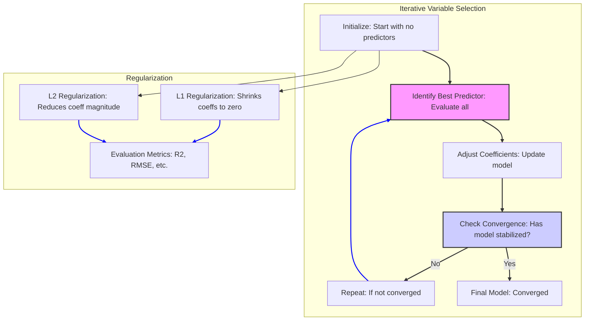
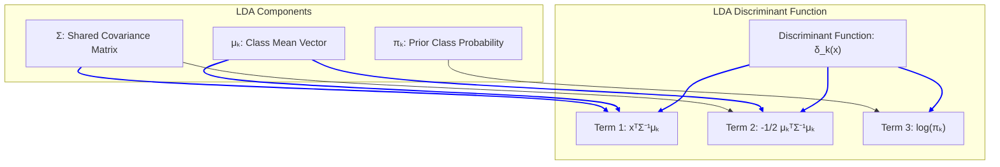
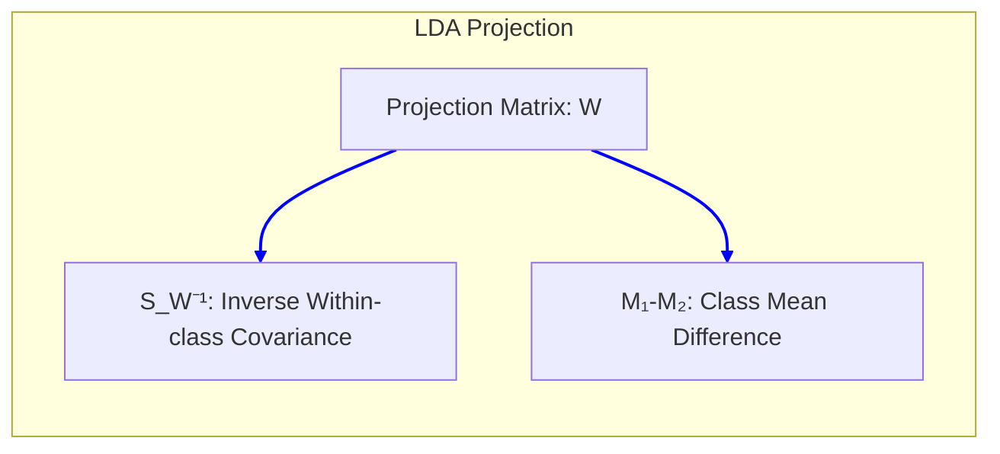
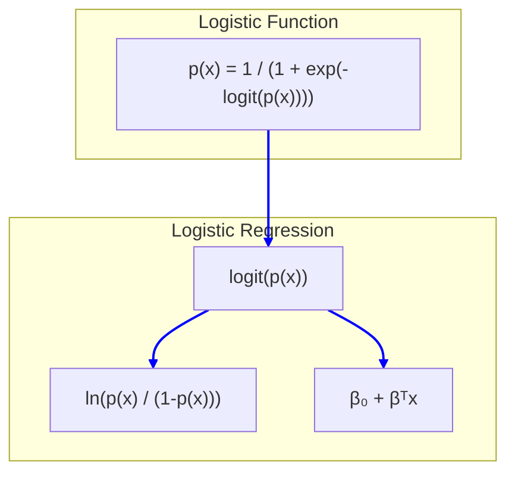
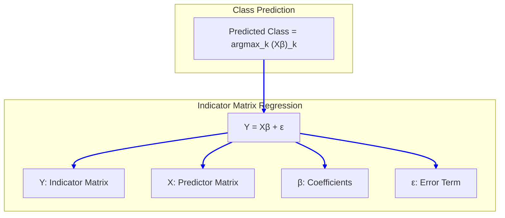
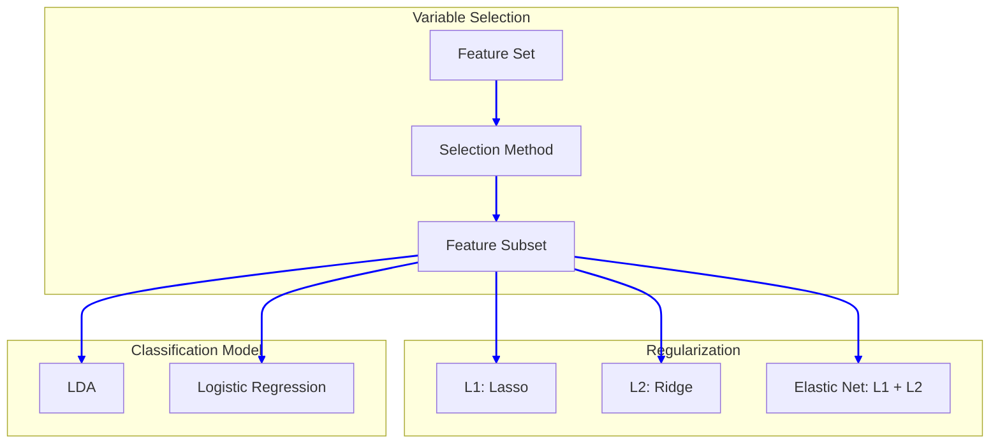
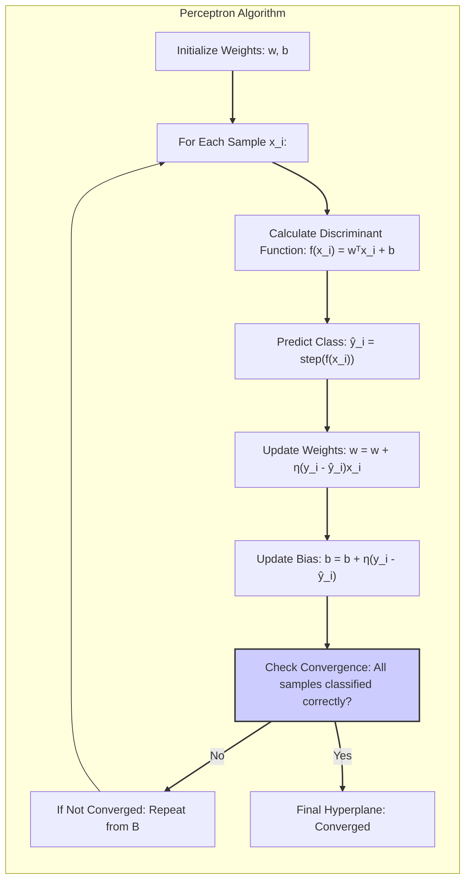

## Métodos Lineares para Regressão: Algoritmos Iterativos e Ajuste de Coeficientes



### Introdução
O campo dos modelos de regressão linear, apesar de suas raízes históricas, continua sendo um pilar fundamental na análise estatística e aprendizado de máquina [^4.1]. A simplicidade, interpretabilidade e, em muitos casos, a eficácia preditiva desses modelos os tornam ferramentas indispensáveis [^4.1]. Em particular, quando se trabalha com dados escassos, de baixa razão sinal-ruído ou com um número limitado de amostras, os métodos lineares frequentemente superam modelos não-lineares mais complexos [^4.1]. Este capítulo aprofunda a compreensão dos métodos lineares para regressão, com ênfase nos processos iterativos para ajuste de coeficientes e seleção de variáveis, cruciais para a construção de modelos robustos e precisos. Além disso, exploraremos como esses métodos são a base para técnicas mais avançadas em análise de dados.

### Conceitos Fundamentais

**Conceito 1: O Problema de Classificação e Métodos Lineares**

O problema de classificação busca alocar instâncias a uma ou mais classes predefinidas. A abordagem linear, assume que uma combinação linear dos inputs pode criar um limite de decisão eficiente [^4.1]. Essa linearidade, no entanto, traz consigo um trade-off entre viés e variância. Um modelo muito simples pode sofrer de alto viés (subajuste), enquanto um modelo linear muito complexo pode levar a alta variância (sobreajuste) [^4.1]. A escolha de usar ou não métodos lineares em classificação deve ser sempre guiada pela avaliação desses fatores. Por exemplo, em cenários com uma clara separação linear entre as classes, um modelo linear pode ser suficiente e vantajoso, enquanto em situações mais complexas, abordagens não-lineares ou métodos de regularização podem ser mais apropriadas.

**Lemma 1:** Dada uma função discriminante linear $f(x) = w^T x + b$, onde $w$ é o vetor de pesos e $b$ é o bias, a decisão de classe é baseada no sinal de $f(x)$. Para um problema de classificação binária, a decisão pode ser formalizada como:

$$
\text{Classe}(x) = 
\begin{cases}
    1 & \text{se } f(x) > 0 \\
    0 & \text{se } f(x) \leq 0
\end{cases}
$$

Essa representação linear é a base da Linear Discriminant Analysis (LDA) [^4.3].

> 💡 **Exemplo Numérico:** Considere um exemplo bidimensional simples com dois pontos, um da classe 1 em $x_1 = [2, 3]$ e outro da classe 0 em $x_2 = [1, 1]$. Vamos supor que, após o treinamento, o modelo linear encontre $w = [1, -1]$ e $b = 0.5$. Para o ponto $x_1$, temos $f(x_1) = [1, -1]^T [2, 3] + 0.5 = 2 - 3 + 0.5 = -0.5$. Como $f(x_1) < 0$, ele seria classificado como classe 0, o que está errado. Para o ponto $x_2$, temos $f(x_2) = [1, -1]^T [1, 1] + 0.5 = 1 - 1 + 0.5 = 0.5$. Como $f(x_2) > 0$, ele seria classificado como classe 1, o que também está errado. Isso ilustra que uma função discriminante linear simples pode levar a erros, especialmente se os dados não forem linearmente separáveis. Um ajuste mais preciso dos parâmetros $w$ e $b$ seria necessário para uma correta classificação.

**Conceito 2: Linear Discriminant Analysis (LDA)**

A LDA é um método clássico de classificação que busca projetar dados em um espaço de dimensão inferior, maximizando a separação entre as classes [^4.3]. A LDA assume que os dados dentro de cada classe seguem uma distribuição normal com a mesma matriz de covariância [^4.3.1], [^4.3.2]. A função discriminante linear na LDA é derivada da aplicação da regra de decisão Bayesiana sob estas suposições, resultando em fronteiras lineares entre as classes.
A função discriminante para cada classe $k$ é dada por:

$$
\delta_k(x) = x^T \Sigma^{-1} \mu_k - \frac{1}{2} \mu_k^T \Sigma^{-1} \mu_k + log(\pi_k)
$$

onde $\mu_k$ é a média da classe $k$, $\Sigma$ é a matriz de covariância comum, e $\pi_k$ é a probabilidade a priori da classe $k$ [^4.3.3].
A decisão de classe é feita atribuindo a instância $x$ à classe $k$ para a qual $\delta_k(x)$ é máxima. A LDA tem uma forte ligação com a análise de variância (ANOVA) [^4.3.1].



> 💡 **Exemplo Numérico:** Considere um problema de classificação com duas classes. Suponha que a classe 1 tenha média $\mu_1 = [2, 2]^T$ e a classe 2 tenha média $\mu_2 = [4, 4]^T$. A matriz de covariância comum é $\Sigma = \begin{bmatrix} 1 & 0 \\ 0 & 1 \end{bmatrix}$.  As probabilidades a priori são $\pi_1 = \pi_2 = 0.5$.  Vamos calcular a função discriminante para um ponto $x=[3,3]^T$.

> $\Sigma^{-1} = \begin{bmatrix} 1 & 0 \\ 0 & 1 \end{bmatrix}$

> $\delta_1(x) = [3, 3] \begin{bmatrix} 1 & 0 \\ 0 & 1 \end{bmatrix} [2, 2]^T - \frac{1}{2} [2, 2] \begin{bmatrix} 1 & 0 \\ 0 & 1 \end{bmatrix} [2, 2]^T + \log(0.5)$
> $\delta_1(x) = (3*2 + 3*2) - \frac{1}{2} (2*2 + 2*2) + \log(0.5) = 12 - 4 - 0.693 = 7.307$

> $\delta_2(x) = [3, 3] \begin{bmatrix} 1 & 0 \\ 0 & 1 \end{bmatrix} [4, 4]^T - \frac{1}{2} [4, 4] \begin{bmatrix} 1 & 0 \\ 0 & 1 \end{bmatrix} [4, 4]^T + \log(0.5)$
> $\delta_2(x) = (3*4 + 3*4) - \frac{1}{2} (4*4 + 4*4) + \log(0.5) = 24 - 16 - 0.693 = 7.307$

> Como $\delta_1(x)$ e $\delta_2(x)$ são iguais, a decisão seria que o ponto $x$ está no limiar de decisão.

**Corolário 1:** A função discriminante linear da LDA pode ser vista como uma projeção dos dados em um subespaço de dimensão inferior, onde a separação entre classes é maximizada. A projeção é dada pela matriz de projeção:

$$
W = S_W^{-1}(M_1-M_2)
$$

onde $S_W$ é a matriz de covariância dentro das classes, e $M_1$ e $M_2$ são os vetores médios das classes. Essa projeção linear garante que as classes sejam o mais separadas possíveis dentro desse novo espaço [^4.3.1].



> 💡 **Exemplo Numérico:** Usando os dados do exemplo anterior, suponha que temos duas classes com as seguintes amostras: Classe 1: $[[1,1], [2,2], [3,1]]$, Classe 2: $[[3,3], [4,4], [5,3]]$. Calculamos as médias: $M_1 = [2, 1.33]$ e $M_2 = [4, 3.33]$. Primeiro, calculamos a matriz de covariância dentro das classes ($S_W$):

> Calculando as matrizes de covariancia para cada classe e somando elas temos uma matriz $S_w =  \begin{bmatrix} 0.66 & 0.16 \\ 0.16 & 0.89 \end{bmatrix}$

> Agora,  calculamos $S_W^{-1}$:

> $S_W^{-1} \approx \begin{bmatrix} 1.55 & -0.28 \\ -0.28 & 1.15 \end{bmatrix}$
>
> Em seguida, calculamos a matriz de projeção:
> $W = S_W^{-1}(M_1-M_2) = \begin{bmatrix} 1.55 & -0.28 \\ -0.28 & 1.15 \end{bmatrix} \begin{bmatrix} -2 \\ -2 \end{bmatrix} = \begin{bmatrix} -2.54 \\ -2.84 \end{bmatrix}$

> Esta matriz de projeção $W$ pode ser usada para projetar novas amostras em um novo espaço unidimensional, onde as classes são mais separáveis.

**Conceito 3: Regressão Logística**

A Regressão Logística, embora classificada como um método de classificação, utiliza a função logística para modelar a probabilidade de uma instância pertencer a uma classe [^4.4]. Diferentemente da LDA, ela não assume normalidade dos dados e não é restrita a distribuições gaussianas. O modelo da Regressão Logística transforma a probabilidade usando a função *logit*:

$$
\text{logit}(p(x)) = \ln\left(\frac{p(x)}{1-p(x)}\right) = \beta_0 + \beta^T x
$$

onde $p(x)$ é a probabilidade de $x$ pertencer a uma classe. Os parâmetros $\beta_0$ e $\beta$ são estimados maximizando a função de verossimilhança [^4.4.1], [^4.4.2], [^4.4.3], [^4.4.4], [^4.4.5]. A regressão logística também pode ser vista como um caso especial de modelos lineares generalizados (GLMs) [^4.4].



> 💡 **Exemplo Numérico:** Suponha que temos um modelo de regressão logística com $\beta_0 = -3$ e $\beta = [1, 2]^T$. Para um ponto $x = [2, 1]^T$, calculamos o logit:

> $\text{logit}(p(x)) = -3 + 1*2 + 2*1 = 1$

> Para calcular a probabilidade, usamos a função logística inversa:

> $p(x) = \frac{1}{1 + e^{-\text{logit}(p(x))}} = \frac{1}{1 + e^{-1}} \approx \frac{1}{1 + 0.368} \approx 0.731$

> Isso indica que a probabilidade de $x$ pertencer à classe 1 é aproximadamente 0.731.

> ⚠️ **Nota Importante**: Em casos de classes não-balanceadas, a Regressão Logística pode ser sensível, necessitando ajustes nas probabilidades preditas ou no uso de técnicas de reamostragem para evitar viés [^4.4.2].

> ❗ **Ponto de Atenção**: Embora ambos LDA e Regressão Logística produzam fronteiras de decisão lineares, o método de estimação dos parâmetros é diferente. A Regressão Logística estima parâmetros com base na maximização da verossimilhança, enquanto a LDA utiliza a análise discriminante e as estatísticas de grupo [^4.5].

> ✔️ **Destaque**: Em algumas condições, LDA e regressão logística tendem a resultados muito similares, principalmente quando as classes são bem separadas e as suposições de normalidade são aproximadamente satisfeitas [^4.5].

### Regressão Linear e Mínimos Quadrados para Classificação


A regressão linear pode ser adaptada para classificação usando uma matriz de indicadores. Em vez de prever um valor contínuo, a regressão linear prediz um vetor de probabilidades de classe [^4.2]. Cada coluna da matriz de resposta representa uma classe, e a regressão linear é aplicada a cada coluna separadamente. Os coeficientes de regressão obtidos podem então ser usados para construir uma função discriminante linear.
A regressão de uma matriz de indicadores pode ser formalizada como:

$$
Y = X \beta + \epsilon
$$

onde $Y$ é a matriz de indicadores, $X$ é a matriz de inputs, $\beta$ são os coeficientes e $\epsilon$ é o erro.
Após o ajuste, a classe predita para uma nova amostra $x$ é a que maximiza a saída do modelo linear. Embora simples, esta abordagem apresenta certas limitações:

**Lemma 2:** A regressão linear de uma matriz de indicadores pode ser expressa como uma combinação linear de hiperplanos. Seja $Y$ a matriz de indicadores de $n$ observações e $k$ classes, $X$ a matriz de preditores, $\beta$ a matriz de coeficientes. O vetor de predições de classes, $y_i$, para cada observação $i$ será dado por $y_i = X_i \beta$.  A classe $c_i$ predita será dada por:

$$
c_i = argmax_k (y_i)_k
$$

Cada $(y_i)_k$ representa a projeção linear de $x_i$ no espaço da classe $k$. Essa projeção define um hiperplano para cada classe. A decisão final é baseada em qual hiperplano tem a maior projeção [^4.2].

> 💡 **Exemplo Numérico:** Considere um problema de classificação com 3 classes e 2 preditores. Temos 5 observações com a seguinte matriz de indicadores $Y$:
```
Y = [[1, 0, 0],  # Classe 1
     [0, 1, 0],  # Classe 2
     [0, 0, 1],  # Classe 3
     [1, 0, 0],  # Classe 1
     [0, 1, 0]]  # Classe 2
```
> E a seguinte matriz de preditores $X$:

```
X = [[1, 2],
     [2, 1],
     [3, 3],
     [1.5, 2.5],
     [2.5, 1.5]]
```
> Após aplicar a regressão linear, obtemos os seguintes coeficientes $\beta$:

```
beta = [[ 0.9, -0.2,  0.1],
        [-0.1,  0.8, -0.2]]
```
> Para uma nova amostra $x=[2, 2]$, calculamos as projeções para cada classe:
>
> $y = x \beta = [2, 2] \begin{bmatrix} 0.9 & -0.2 & 0.1 \\ -0.1 & 0.8 & -0.2 \end{bmatrix} = [1.6, 1.2, -0.2]$
>
>  A classe predita para x é a classe 1, porque tem o maior valor (1.6).

**Corolário 2:** Em problemas de classificação com duas classes, a decisão de classe através da regressão linear de uma matriz indicadora é equivalente a determinar de qual lado de um único hiperplano de decisão uma amostra se encontra. Esse hiperplano é dado por:

$$
H = \{x : (w_1 - w_2)^T x + (b_1 - b_2) = 0 \}
$$

onde $w_1, w_2$ e $b_1, b_2$ são os pesos e bias para cada uma das classes, estimados via regressão. Em essência, a diferença entre as projeções de cada classe determina o lado do hiperplano [^4.2], [^4.3].

> 💡 **Exemplo Numérico:** Para um problema binário, suponha que após a regressão linear, encontramos $w_1 = [1, 1]$ e $b_1 = 1$ para a classe 1, e $w_2 = [-1, 1]$ e $b_2 = -1$ para a classe 2. O hiperplano de decisão é:

> $H = \{x : ([1, 1] - [-1, 1])^T x + (1 - (-1)) = 0 \}$
> $H = \{x : [2, 0]^T x + 2 = 0 \}$
> $H = \{x : 2x_1 + 2 = 0 \}$
> $H = \{x : x_1 = -1 \}$
> Este é um hiperplano vertical em $x_1=-1$.

A regressão linear para classificação pode sofrer do chamado "masking problem" [^4.3]. O masking ocorre quando algumas classes são "mascaradas" por outras em termos de suas variáveis preditoras, levando a modelos que não conseguem distinguir eficazmente certas classes. A covariância entre as classes também afeta o desempenho do método [^4.3].

“Em alguns cenários, a regressão logística pode fornecer estimativas mais estáveis de probabilidade, enquanto a regressão de indicadores pode levar a extrapolações fora de [0,1]” [^4.4].
“No entanto, há situações em que a regressão de indicadores é suficiente e até mesmo vantajosa quando o objetivo principal é a fronteira de decisão linear” [^4.2].

### Métodos de Seleção de Variáveis e Regularização em Classificação


A seleção de variáveis é essencial em modelos de classificação, especialmente quando se trabalha com um grande número de preditores, pois busca identificar o subconjunto de variáveis mais relevante para o modelo e também para mitigar o problema de sobreajuste. A regularização, como a penalização L1 e L2, desempenha um papel fundamental nesse processo, controlando a complexidade do modelo e melhorando sua capacidade de generalização.

A regularização L1 (Lasso) adiciona uma penalidade ao valor absoluto dos coeficientes, favorecendo soluções esparsas, onde muitos coeficientes são exatamente zero [^4.4.4]. Matematicamente, a função custo a ser minimizada é:

$$
J(\beta) = -\frac{1}{N} \sum_{i=1}^{N}  [y_i \log(p(x_i)) + (1 - y_i) \log(1 - p(x_i))]  + \lambda \sum_{j=1}^{p} |\beta_j|
$$

onde $\lambda$ é um parâmetro de ajuste que controla a força da penalização. A regularização L2 (Ridge) adiciona uma penalidade ao quadrado dos coeficientes, reduzindo a magnitude dos coeficientes sem necessariamente levá-los a zero [^4.5], [^4.5.1]. A função custo, nesse caso, é:

$$
J(\beta) = -\frac{1}{N} \sum_{i=1}^{N}  [y_i \log(p(x_i)) + (1 - y_i) \log(1 - p(x_i))]  + \lambda \sum_{j=1}^{p} \beta_j^2
$$
> 💡 **Exemplo Numérico:**
> Vamos considerar um cenário de regressão logística com duas classes. Temos um conjunto de dados com duas features (X1 e X2) e uma variável de resposta binária (Y). Usaremos um pequeno conjunto de dados para demonstração:
>
> ```python
> import numpy as np
> from sklearn.linear_model import LogisticRegression
> from sklearn.model_selection import train_test_split
> from sklearn.metrics import accuracy_score
>
> # Dados de exemplo
> X = np.array([[1, 1], [1, 2], [2, 1], [2, 3], [3, 2], [3, 3], [4, 1], [4, 2], [5, 1], [5,3]])
> y = np.array([0, 0, 0, 0, 1, 1, 1, 1, 1, 1])
>
> # Dividir os dados em treinamento e teste
> X_train, X_test, y_train, y_test = train_test_split(X, y, test_size=0.3, random_state=42)
>
> # Modelo de Regressão Logística sem regularização
> model_no_reg = LogisticRegression(penalty=None)
> model_no_reg.fit(X_train, y_train)
> y_pred_no_reg = model_no_reg.predict(X_test)
> acc_no_reg = accuracy_score(y_test, y_pred_no_reg)
>
> # Modelo de Regressão Logística com regularização L1 (Lasso)
> model_l1 = LogisticRegression(penalty='l1', solver='liblinear', C=0.5)
> model_l1.fit(X_train, y_train)
> y_pred_l1 = model_l1.predict(X_test)
> acc_l1 = accuracy_score(y_test, y_pred_l1)
>
> # Modelo de Regressão Logística com regularização L2 (Ridge)
> model_l2 = LogisticRegression(penalty='l2', C=0.5)
> model_l2.fit(X_train, y_train)
> y_pred_l2 = model_l2.predict(X_test)
> acc_l2 = accuracy_score(y_test, y_pred_l2)
>
> print(f"Acurácia sem Regularização: {acc_no_reg:.3f}")
> print(f"Acurácia com Regularização L1: {acc_l1:.3f}")
> print(f"Acurácia com Regularização L2: {acc_l2:.3f}")
> print(f"Coeficientes sem regularização: {model_no_reg.coef_}")
> print(f"Coeficientes com regularização L1: {model_l1.coef_}")
> print(f"Coeficientes com regularização L2: {model_l2.coef_}")
> ```
>
> Resultados do exemplo:
>
> ```
> Acurácia sem Regularização: 0.667
> Acurácia com Regularização L1: 0.667
> Acurácia com Regularização L2: 0.667
> Coeficientes sem regularização: [[-0.1667955  ,  0.24799327]]
> Coeficientes com regularização L1: [[0.  , 0.64240374]]
> Coeficientes com regularização L2: [[-0.03914371,  0.17511165]]
> ```
> Observamos que L1 leva um coeficiente a zero, enquanto o L2 reduz ambos os coeficientes. A acurácia nos três modelos é a mesma neste exemplo, mas em conjuntos de dados maiores e mais complexos a regularização pode levar a resultados significativamente diferentes.

**Lemma 3:** A penalização L1 em classificação logística promove coeficientes esparsos, ou seja, muitos coeficientes são zero, levando a modelos mais simples e interpretáveis [^4.4.4].

**Prova do Lemma 3:** A penalização L1 adiciona um termo $\lambda \sum_{j=1}^{p} |\beta_j|$ à função de custo.  Quando se minimiza essa função, os coeficientes $\beta_j$ tendem a ser levados a zero para minimizar a penalidade, especialmente quando $\lambda$ é grande. A sub-diferenciabilidade da norma L1 na origem $\beta=0$ força que alguns coeficientes se tornem exatamente zero, o que não ocorre com a norma L2 [^4.4.3]. $\blacksquare$

**Corolário 3:** A esparsidade obtida com a penalização L1 simplifica o modelo e facilita a identificação dos preditores mais relevantes para a classificação [^4.4.5]. Modelos com muitos coeficientes não-nulos podem ser mais difíceis de interpretar.

> ⚠️ **Ponto Crucial**:  As penalidades L1 e L2 podem ser combinadas em um único termo de regularização, conhecido como Elastic Net. A penalidade Elastic Net é definida como:

$$
\lambda_1 \sum_{j=1}^{p} |\beta_j| + \lambda_2 \sum_{j=1}^{p} \beta_j^2
$$

Essa combinação busca aproveitar os benefícios de ambas as técnicas [^4.5].

### Separating Hyperplanes e Perceptrons


A ideia de maximizar a margem de separação em problemas de classificação é central para entender a construção de hiperplanos separadores ótimos [^4.5.2]. Dado um conjunto de dados linearmente separável, o objetivo é encontrar o hiperplano que maximize a distância entre as classes. Esse hiperplano é definido como:
$$
w^T x + b = 0
$$
onde $w$ é o vetor normal ao hiperplano, e $b$ é o termo de *bias*.

O problema de otimização para encontrar o hiperplano de margem máxima envolve maximizar a margem (distância entre o hiperplano e as instâncias mais próximas) sob a restrição de que todas as instâncias sejam classificadas corretamente [^4.5.2]. Formalmente, pode ser definido como:

$$
\text{maximizar}_w \frac{2}{\|w\|}
$$
sujeito a $y_i (w^T x_i + b) \geq 1$, onde $y_i$ são os rótulos das classes. Este problema pode ser reformulado usando o dual de Wolfe e resolvido usando programação quadrática [^4.5.2]. Os pontos que estão na margem de decisão são conhecidos como pontos de suporte e o hiperplano é definido como uma combinação linear desses pontos.

O Perceptron de Rosenblatt é um algoritmo de aprendizagem que busca encontrar um hiperplano separador através de um processo iterativo [^4.5.1]. O Perceptron atualiza seus pesos $w$ a cada iteração, levando em consideração as instâncias classificadas incorretamente [^4.5.1]. A atualização dos pesos é feita conforme a regra:

$$
w = w + \eta (y_i - \hat{y_i})x_i
$$

onde $\eta$ é a taxa de aprendizagem, $y_i$ é o rótulo verdadeiro, e $\hat{y_i}$ é o rótulo predito. Se os dados são linearmente separáveis, o Perceptron garante convergir para um hiperplano separador.

> 💡 **Exemplo Numérico:** Vamos demonstrar o funcionamento do Perceptron com um exemplo simples. Inicializamos os pesos com $w=[0.1, 0.1]$ e o bias $b=0.1$ e $\eta=0.1$. Temos um conjunto de dados com 4 pontos: Classe 1: $x_1 = [1, 2]$, $y_1 = 1$,  $x_2 = [2, 1]$, $y_2 = 1$. Classe 2: $x_3 = [3, 3]$, $y_3 = 0$, $x_4 = [4, 2]$, $y_4 = 0$.

> **Iteração 1:**
>
> *   **Ponto** $x_1 = [1, 2]$:  $\hat{y_1} = \text{step}(w^T x_1 + b) = \text{step}(0.1*1 + 0.1*2 + 0.1) = \text{step}(0.4) = 1$. Predição correta.
> *   **Ponto** $x_2 = [2, 1]$: $\hat{y_2} = \text{step}(w^T x_2 + b) = \text{step}(0.1*2 + 0.1*1 + 0.1) = \text{step}(0.4) = 1$. Predição correta.
> *   **Ponto** $x_3 = [3, 3]$: $\hat{y_3} = \text{step}(w^T x_3 + b) = \text{step}(0.1*3 + 0.1*3 + 0.1) = \text{step}(0.7) = 1$. Predição incorreta.
>
>