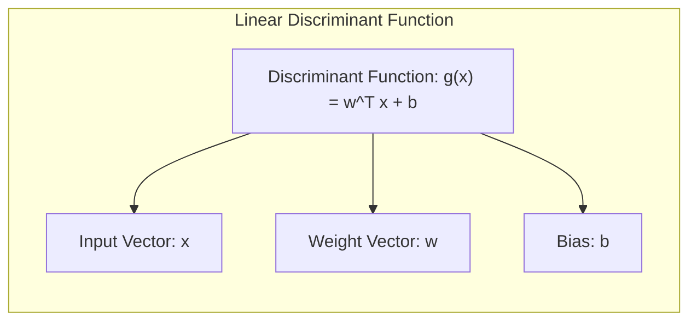
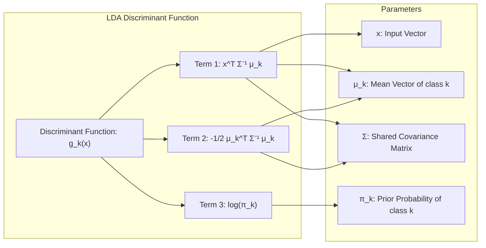
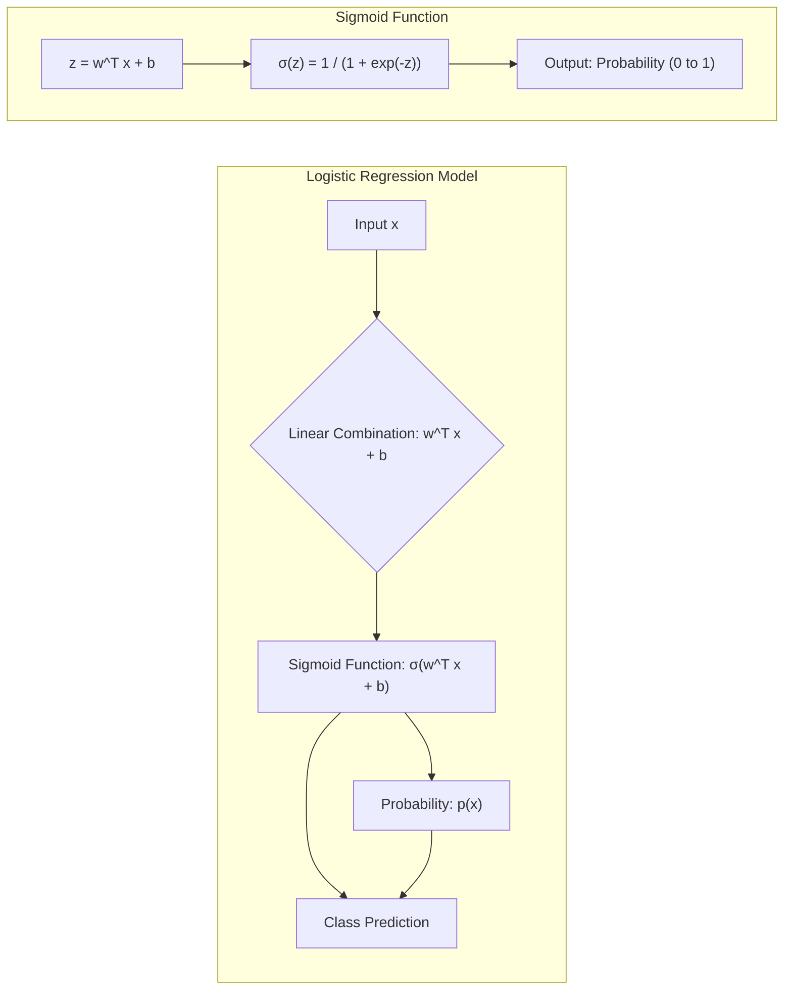
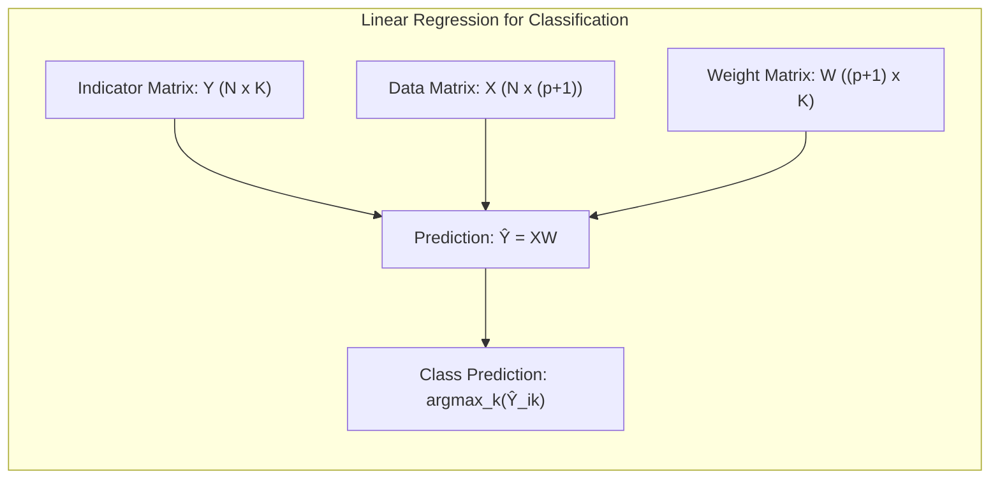
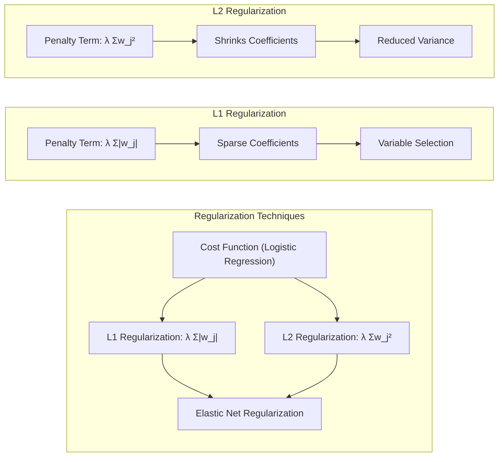
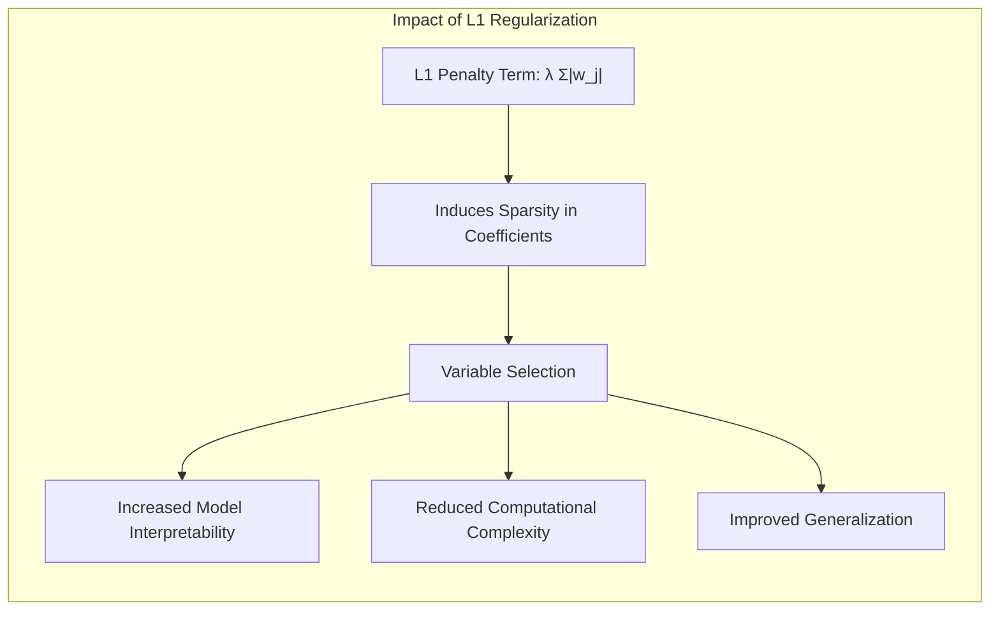
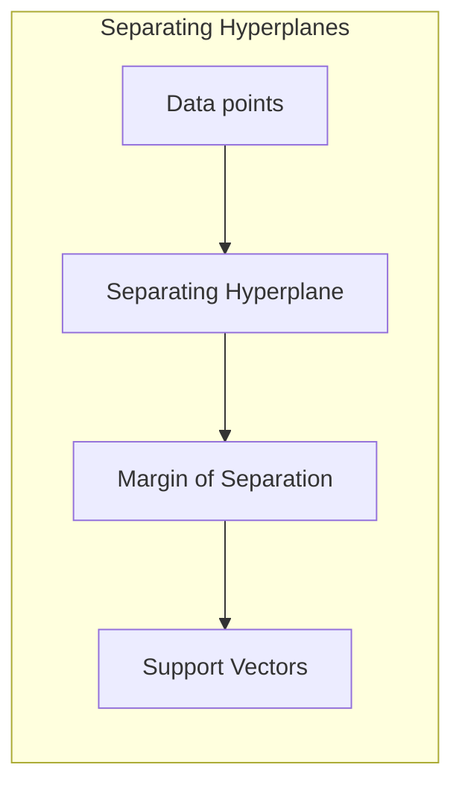

## Linear Methods for Classification: A Deep Dive into Discriminant Analysis, Logistic Regression, and Regularization Techniques
<imagem: Mapa mental abrangente que conecta os subtemas 4.1 a 4.5.2, ilustrando as relações entre LDA, logistic regression e hyperplanes, com destaque para as técnicas de regularização>

### Introdução

A classificação, uma tarefa fundamental no aprendizado de máquina, envolve a atribuição de dados a categorias predefinidas. Modelos lineares, apesar de sua simplicidade, oferecem soluções robustas e interpretáveis para este problema, especialmente quando usados em conjunto com técnicas de regularização e seleção de variáveis. Este capítulo explora as bases teóricas e matemáticas desses modelos, desde a **regressão linear de matrizes de indicadores** até a **análise discriminante linear (LDA)**, passando pela **regressão logística** e métodos de **seleção de variáveis e regularização**, culminando com uma análise dos **hiperplanos separadores** [^4.1].

### Conceitos Fundamentais

**Conceito 1:** O problema de classificação, em sua essência, busca encontrar uma função $f(x)$ que mapeie um vetor de entrada $x$ para uma classe $y$. Em métodos lineares, essa função assume a forma $f(x) = w^T x + b$, onde $w$ são os pesos do modelo e $b$ é o bias. A escolha de modelos lineares pode ser justificada pela sua interpretabilidade e eficiência computacional [^4.1]. No entanto, é importante notar que modelos lineares podem introduzir viés, especialmente se a verdadeira relação entre as entradas e as classes não for linear, embora a variância, em geral, seja baixa, especialmente quando combinado com técnicas de regularização [^4.2]. Por exemplo, em um problema de classificação binária, a saída $f(x)$ pode ser interpretada como a pontuação que determina a qual classe um dado $x$ pertence. Quanto maior o valor de $f(x)$, maior a probabilidade de $x$ pertencer a uma classe específica.

> 💡 **Exemplo Numérico:** Considere um problema de classificação binária com duas features, $x_1$ e $x_2$. Um modelo linear pode ser expresso como $f(x) = w_1x_1 + w_2x_2 + b$. Suponha que, após treinamento, os pesos encontrados sejam $w_1 = 0.5$, $w_2 = -0.3$ e $b = 1$. Para um ponto de dados $x = [2, 3]$, temos $f(x) = 0.5 * 2 + (-0.3) * 3 + 1 = 1 - 0.9 + 1 = 1.1$. Se a regra de decisão for classificar como classe 1 se $f(x) > 0$, então este ponto seria classificado na classe 1.

**Lemma 1:** Em um problema de classificação binária com classes $\mathcal{C}_1$ e $\mathcal{C}_2$, uma função discriminante linear pode ser expressa como $g(x) = w^T x + b$. Se definirmos uma matriz de indicadores $Y$ tal que $Y_{ij} = 1$ se a amostra $i$ pertence à classe $j$ e $0$ caso contrário, e aplicarmos regressão linear sobre esta matriz, podemos encontrar os coeficientes $w$ e $b$ que definem um hiperplano de decisão linear [^4.2]. Esse hiperplano, dado por $g(x)=0$, separa as classes no espaço de entrada, e sua forma é determinada pelos coeficientes da regressão linear. Isso significa que, sob certas condições, uma simples regressão linear em uma matriz de indicadores pode levar a uma solução de classificação linear.

  **Prova:** Seja $X$ a matriz de dados, com cada linha representando uma amostra, e $Y$ a matriz de indicadores. A regressão linear busca minimizar $||Y - XW||^2$, onde $W$ é a matriz de pesos. As colunas de $W$ correspondem aos pesos para cada classe. A fronteira de decisão para classificação binária é dada por $w^T x + b = 0$. Os parâmetros $w$ e $b$ são obtidos minimizando o erro quadrático médio, levando à mesma estrutura de separação linear obtida por uma função discriminante linear. $\blacksquare$

> 💡 **Exemplo Numérico:** Considere um dataset com duas amostras e duas classes.
>
>  $X = \begin{bmatrix} 1 & 2 \\ 2 & 1 \end{bmatrix}$ (cada linha é uma amostra, a primeira coluna é para o bias e a segunda a feature $x_1$)
>
>  $Y = \begin{bmatrix} 1 \\ 0 \end{bmatrix}$ (a primeira amostra pertence à classe 1, a segunda à classe 0).
>
> Aplicamos regressão linear para encontrar $w$:
>
> $\text{Step 1: } W = (X^TX)^{-1}X^TY$
>
> $X^T = \begin{bmatrix} 1 & 2 \\ 2 & 1 \end{bmatrix}$
>
> $X^TX = \begin{bmatrix} 1 & 2 \\ 2 & 1 \end{bmatrix} \begin{bmatrix} 1 & 2 \\ 2 & 1 \end{bmatrix} = \begin{bmatrix} 5 & 4 \\ 4 & 5 \end{bmatrix}$
>
> $(X^TX)^{-1} = \frac{1}{9}\begin{bmatrix} 5 & -4 \\ -4 & 5 \end{bmatrix}$
>
> $X^TY = \begin{bmatrix} 1 & 2 \\ 2 & 1 \end{bmatrix} \begin{bmatrix} 1 \\ 0 \end{bmatrix} = \begin{bmatrix} 1 \\ 2 \end{bmatrix}$
>
> $W = \frac{1}{9}\begin{bmatrix} 5 & -4 \\ -4 & 5 \end{bmatrix} \begin{bmatrix} 1 \\ 2 \end{bmatrix} = \frac{1}{9}\begin{bmatrix} -3 \\ 6 \end{bmatrix} = \begin{bmatrix} -1/3 \\ 2/3 \end{bmatrix}$
>
> Assim, o modelo linear seria: $f(x) = -\frac{1}{3} + \frac{2}{3}x_1$. Se um novo ponto $x_1=1$ é avaliado $f(x) = -\frac{1}{3} + \frac{2}{3} = \frac{1}{3}$. Classificamos este ponto como pertencente à classe 1 se $f(x) > 0.5$.
>
> Este exemplo demonstra como uma regressão linear na matriz de indicadores pode ser utilizada para classificação binária.

**Conceito 2:** A **Linear Discriminant Analysis (LDA)**, uma técnica clássica de classificação, assume que cada classe possui uma distribuição gaussiana com a mesma matriz de covariância [^4.3]. A LDA deriva a fronteira de decisão maximizando a separação entre as classes, projetando os dados em um subespaço de dimensão inferior. A função discriminante linear da LDA é dada por $g_k(x) = x^T \Sigma^{-1} \mu_k - \frac{1}{2} \mu_k^T \Sigma^{-1} \mu_k + log(\pi_k)$, onde $\mu_k$ é o vetor de médias da classe $k$, $\Sigma$ é a matriz de covariância compartilhada, e $\pi_k$ é a probabilidade a priori da classe $k$. A LDA é ótima quando as suposições de normalidade e igualdade de covariância são válidas [^4.3.1], mas pode ter um desempenho sub-ótimo quando estas suposições são violadas [^4.3.2]. A LDA, como outros métodos lineares, se beneficia da sua eficiência computacional e facilidade de interpretação [^4.3.3].


> 💡 **Exemplo Numérico:** Suponha que temos duas classes com as seguintes médias e covariância compartilhada:
>
> $\mu_1 = \begin{bmatrix} 1 \\ 1 \end{bmatrix}$, $\mu_2 = \begin{bmatrix} 3 \\ 2 \end{bmatrix}$, $\Sigma = \begin{bmatrix} 1 & 0.5 \\ 0.5 & 1 \end{bmatrix}$
>
> A probabilidade a priori é $\pi_1 = \pi_2 = 0.5$. Para classificar um novo ponto $x = \begin{bmatrix} 2 \\ 1.5 \end{bmatrix}$, calculamos as funções discriminantes:
>
> $\text{Step 1: } \Sigma^{-1} = \frac{1}{0.75}\begin{bmatrix} 1 & -0.5 \\ -0.5 & 1 \end{bmatrix} = \begin{bmatrix} 1.33 & -0.67 \\ -0.67 & 1.33 \end{bmatrix}$
>
> $\text{Step 2: } g_1(x) = x^T \Sigma^{-1} \mu_1 - \frac{1}{2} \mu_1^T \Sigma^{-1} \mu_1 + log(\pi_1)$
>
> $g_1(x) = \begin{bmatrix} 2 & 1.5 \end{bmatrix} \begin{bmatrix} 1.33 & -0.67 \\ -0.67 & 1.33 \end{bmatrix} \begin{bmatrix} 1 \\ 1 \end{bmatrix} - \frac{1}{2} \begin{bmatrix} 1 & 1 \end{bmatrix} \begin{bmatrix} 1.33 & -0.67 \\ -0.67 & 1.33 \end{bmatrix} \begin{bmatrix} 1 \\ 1 \end{bmatrix} + \log(0.5)$
>
> $g_1(x) = \begin{bmatrix} 2 & 1.5 \end{bmatrix} \begin{bmatrix} 0.66 \\ 0.66 \end{bmatrix} - \frac{1}{2} \begin{bmatrix} 1 & 1 \end{bmatrix} \begin{bmatrix} 0.66 \\ 0.66 \end{bmatrix} + \log(0.5)$
>
> $g_1(x) = 1.32 + 0.99 - \frac{1}{2}(1.32) + \log(0.5) = 2.31 - 0.66 - 0.69 = 0.96$
>
> $\text{Step 3: } g_2(x) = x^T \Sigma^{-1} \mu_2 - \frac{1}{2} \mu_2^T \Sigma^{-1} \mu_2 + log(\pi_2)$
>
> $g_2(x) = \begin{bmatrix} 2 & 1.5 \end{bmatrix} \begin{bmatrix} 1.33 & -0.67 \\ -0.67 & 1.33 \end{bmatrix} \begin{bmatrix} 3 \\ 2 \end{bmatrix} - \frac{1}{2} \begin{bmatrix} 3 & 2 \end{bmatrix} \begin{bmatrix} 1.33 & -0.67 \\ -0.67 & 1.33 \end{bmatrix} \begin{bmatrix} 3 \\ 2 \end{bmatrix} + \log(0.5)$
>
> $g_2(x) = \begin{bmatrix} 2 & 1.5 \end{bmatrix} \begin{bmatrix} 2.66 \\ 0.66 \end{bmatrix} - \frac{1}{2} \begin{bmatrix} 3 & 2 \end{bmatrix} \begin{bmatrix} 2.66 \\ 0.66 \end{bmatrix} + \log(0.5)$
>
> $g_2(x) = 5.32 + 0.99 - \frac{1}{2}(7.98 + 1.32) + \log(0.5) = 6.31 - 4.65 - 0.69 = 0.97$
>
> Como $g_2(x) > g_1(x)$, o ponto é classificado na classe 2.

**Corolário 1:** A função discriminante linear da LDA, $g_k(x)$, pode ser reescrita como $g_k(x) = w_k^T x + b_k$, onde $w_k = \Sigma^{-1} \mu_k$ e $b_k = - \frac{1}{2} \mu_k^T \Sigma^{-1} \mu_k + log(\pi_k)$ [^4.3.1]. Isso demonstra explicitamente a natureza linear da fronteira de decisão gerada pela LDA. Este corolário reforça que a LDA, apesar de usar conceitos probabilísticos para construir a função discriminante, resulta em um classificador linear [^4.3]. Além disso, é possível observar a relação entre a projeção feita pela LDA em um subespaço de menor dimensão e os pesos $w_k$, que direcionam essa projeção para maximizar a separação entre as classes.

**Conceito 3:** A **regressão logística** modela a probabilidade de uma amostra pertencer a uma classe usando uma função sigmoide aplicada a uma combinação linear das entradas [^4.4]. O *logit* ou *log-odds* é definido como $log(\frac{p(x)}{1-p(x)}) = w^T x + b$, onde $p(x)$ é a probabilidade da classe 1. A função sigmoide transforma esta combinação linear para uma probabilidade entre 0 e 1 [^4.4.1]. Os parâmetros $w$ e $b$ são estimados maximizando a verossimilhança dos dados [^4.4.3], e a fronteira de decisão é dada por $w^T x + b = 0$. A regressão logística não assume normalidade nas entradas, e por isso, é mais flexível do que a LDA, embora ambas produzam fronteiras de decisão lineares [^4.4.4]. A regressão logística é particularmente útil para problemas de classificação com classes não-balanceadas [^4.4.2] e oferece uma maneira natural de obter probabilidades de classe [^4.4.5].


> 💡 **Exemplo Numérico:** Considere que, após treinamento de uma regressão logística com uma única feature, $x$, os parâmetros sejam $w=2$ e $b=-1$. A probabilidade de um ponto $x$ pertencer à classe 1 é dada por $p(x) = \frac{1}{1 + e^{-(2x-1)}}$. Se $x=1$, então $p(1) = \frac{1}{1+e^{-1}} \approx 0.73$. Se $x=0$, então $p(0) = \frac{1}{1+e^{1}} \approx 0.27$. A fronteira de decisão, $w^Tx+b=0$ é atingida em $x=0.5$, onde $p(0.5) = 0.5$.
>
> ```mermaid
>   graph LR
>      A[x=0] -->|p(0)=0.27| B(Classe 0)
>      C[x=1] -->|p(1)=0.73| D(Classe 1)
>      E[x=0.5] -->|p(0.5)=0.5| F(Fronteira)
> ```

> ⚠️ **Nota Importante**: A regressão logística usa a função sigmoide para garantir que a saída esteja entre 0 e 1, representando probabilidades de classe. **Referência ao tópico [^4.4.1]**.

> ❗ **Ponto de Atenção**: Em casos de classes não-balanceadas, a regressão logística permite ajustar os pesos para compensar o desequilíbrio, o que não acontece diretamente na LDA. **Conforme indicado em [^4.4.2]**.

> ✔️ **Destaque**: Embora a formulação seja diferente, as estimativas dos parâmetros $w$ nas duas técnicas tendem a ser similares, principalmente quando as classes são bem separadas e as premissas da LDA são respeitadas. **Baseado no tópico [^4.5]**.

### Regressão Linear e Mínimos Quadrados para Classificação
<imagem: Diagrama de fluxo mostrando o processo de regressão de indicadores: Codificação das classes, estimação de coeficientes via mínimos quadrados, aplicação da regra de decisão e comparação com métodos probabilísticos>

A regressão linear, quando aplicada diretamente a uma matriz de indicadores, pode ser utilizada para classificação [^4.2]. A ideia é codificar cada classe com um vetor indicador (por exemplo, 1 para a classe pertencente e 0 para as outras), e usar regressão linear para prever esses indicadores. A classe atribuída a uma amostra é então dada pelo índice do indicador com maior valor previsto. Formalmente, seja $Y$ a matriz de indicadores (N x K), onde N é o número de amostras e K o número de classes. A regressão linear busca minimizar $||Y - XW||^2$, onde $X$ é a matriz de dados (N x (p+1)) e $W$ é a matriz de pesos ((p+1) x K). As predições são dadas por $\hat{Y} = XW$ e a classe predita para a amostra $i$ é dada por $argmax_k \hat{Y}_{ik}$.

A regressão de indicadores é, no entanto, limitada. Em particular, as predições podem não ser bem calibradas em termos de probabilidades, podendo ter valores fora do intervalo [0, 1]. Além disso, pode apresentar problemas quando a relação entre os atributos e as classes não é bem aproximada por funções lineares [^4.1]. Métodos probabilísticos como a regressão logística geralmente fornecem estimativas de probabilidade mais estáveis [^4.4].

**Lemma 2:** Em um problema de classificação binária, a regressão linear em uma matriz de indicadores com apenas duas classes é equivalente a uma função discriminante linear, quando a função de decisão é dada por um limiar em 0.5, mesmo quando a matriz de indicadores não possui posto completo [^4.2].

**Prova:** Seja $Y$ a matriz de indicadores para um problema de classificação binária, onde $y_i \in \{0, 1\}$. Se a previsão da regressão linear para uma dada observação $x_i$ é dada por $\hat{y}_i = w^T x_i + b$, a regra de decisão é que $x_i$ pertence à classe 1 se $\hat{y}_i \ge 0.5$, e à classe 0 caso contrário. Essa regra é equivalente a $\hat{y}_i - 0.5 \ge 0$ que também pode ser escrita como um hiperplano de separação linear: $(w^T x_i + b - 0.5) \ge 0$. Logo, a regressão de indicadores gera uma fronteira de decisão linear, assim como a função discriminante linear. $\blacksquare$

> 💡 **Exemplo Numérico:** Considere o mesmo dataset anterior, com $X = \begin{bmatrix} 1 & 2 \\ 2 & 1 \end{bmatrix}$ e $Y = \begin{bmatrix} 1 \\ 0 \end{bmatrix}$. O resultado da regressão linear é $W = \begin{bmatrix} -1/3 \\ 2/3 \end{bmatrix}$. Para classificar um novo ponto $x = \begin{bmatrix} 1 \\ 1 \end{bmatrix}$,  calculamos $\hat{y} =  -\frac{1}{3} + \frac{2}{3} * 1 = \frac{1}{3}$. Como $\hat{y} < 0.5$, o ponto é classificado como classe 0. Se o ponto fosse $x=\begin{bmatrix} 1 \\ 2 \end{bmatrix}$, então $\hat{y} = -\frac{1}{3} + \frac{2}{3} * 2 = 1$, sendo classificado na classe 1.
>
> Note que este exemplo gera as mesmas conclusões do Exemplo Numérico do Lema 1, confirmando a equivalência entre regressão de indicadores e função discriminante linear em classificação binária, quando aplicada a regra de decisão apropriada.

**Corolário 2:** A equivalência entre as projeções nos hiperplanos de decisão gerados por regressão linear e discriminantes lineares implica que, sob condições ideais (classes bem separadas e sem multicolinearidade), os métodos podem levar a resultados semelhantes, contudo, a regressão de indicadores, por não possuir a natureza probabilística da LDA e da regressão logística, não é a mais adequada para a estimação de probabilidades de classe, podendo gerar resultados fora do intervalo [0,1] [^4.3].

"Em alguns cenários, conforme apontado em [^4.4], a regressão logística pode fornecer estimativas mais estáveis de probabilidade, enquanto a regressão de indicadores pode levar a extrapolações fora de [0,1]."

"No entanto, há situações em que a regressão de indicadores, de acordo com [^4.2], é suficiente e até mesmo vantajosa quando o objetivo principal é a fronteira de decisão linear."

### Métodos de Seleção de Variáveis e Regularização em Classificação
<imagem: Mapa mental conectando métodos de seleção e regularização em classificação, mostrando sua relação com LDA, logistic regression e hyperplanes>

A seleção de variáveis e a regularização são técnicas essenciais para lidar com overfitting e multicolinearidade em modelos de classificação. A regularização, em particular, adiciona uma penalidade à função de custo, forçando o modelo a ter pesos menores e, consequentemente, a evitar soluções complexas que se ajustam ao ruído dos dados.

Em modelos logísticos, por exemplo, a função de custo da regressão logística pode ser regularizada com penalidades L1 (lasso), L2 (ridge) ou uma combinação de ambas (Elastic Net) [^4.5]. A penalidade L1, dada por $\lambda \sum_{j=1}^p |w_j|$, promove a esparsidade, forçando alguns pesos a serem exatamente zero [^4.4.4], e realizando a seleção de variáveis. A penalidade L2, dada por $\lambda \sum_{j=1}^p w_j^2$, encolhe os pesos em direção a zero, reduzindo a variância [^4.5].


> 💡 **Exemplo Numérico:** Suponha que temos um modelo de regressão logística com dois preditores ($x_1$ e $x_2$). Sem regularização, os pesos podem ser $w_1=3$ e $w_2=-2$. Com regularização L1 e $\lambda=0.5$, a função de custo a ser minimizada é modificada: $-\text{loglikelihood} + 0.5(|w_1| + |w_2|)$. Após re-treinamento, os pesos podem ter sido ajustados para $w_1=1.5$ e $w_2=0$ (ou um valor muito próximo de zero), indicando que o preditor $x_2$ foi excluído do modelo. A regularização L2, com $\lambda=0.5$, poderia ter levado a $w_1=2.2$ e $w_2=-1.5$, valores menores do que os iniciais, mas sem zerar nenhum dos pesos.
>
> ```python
> import numpy as np
> from sklearn.linear_model import LogisticRegression
> from sklearn.datasets import make_classification
>
> # Generate synthetic data
> X, y = make_classification(n_samples=100, n_features=2, n_informative=2, n_redundant=0, random_state=42)
>
> # Train logistic regression without regularization
> model_no_reg = LogisticRegression(penalty=None)
> model_no_reg.fit(X, y)
> w_no_reg = model_no_reg.coef_[0]
>
> # Train logistic regression with L1 regularization
> model_l1 = LogisticRegression(penalty='l1', C=0.5, solver='liblinear')
> model_l1.fit(X, y)
> w_l1 = model_l1.coef_[0]
>
> # Train logistic regression with L2 regularization
> model_l2 = LogisticRegression(penalty='l2', C=0.5)
> model_l2.fit(X, y)
> w_l2 = model_l2.coef_[0]
>
> print(f"Weights without regularization: {w_no_reg}")
> print(f"Weights with L1 regularization: {w_l1}")
> print(f"Weights with L2 regularization: {w_l2}")
> ```
>
> Este exemplo demonstra como L1 tende a zerar alguns coeficientes, enquanto L2 reduz sua magnitude. O valor de C (inverso de lambda) afeta a força da regularização.

**Lemma 3:** A penalização L1 em classificação logística leva a coeficientes esparsos.

**Prova:** A função de custo da regressão logística com penalidade L1 é dada por:
$$ J(w) = -\sum_{i=1}^N [y_i \log(p(x_i)) + (1-y_i) \log(1 - p(x_i))] + \lambda \sum_{j=1}^p |w_j| $$
onde $p(x_i)$ é a probabilidade da classe 1 para a amostra $x_i$. O termo de penalização $\lambda \sum_{j=1}^p |w_j|$ é não diferenciável em $w_j = 0$, e induz esparsidade ao forçar alguns coeficientes a serem exatamente zero. A otimização de uma função de custo com esta penalidade geralmente leva a soluções esparsas onde alguns dos parâmetros são zero, indicando que algumas variáveis não têm relevância para a classificação. Este efeito é devido ao fato de que a norma L1 impõe uma penalidade constante sobre cada coeficiente, independentemente de sua magnitude, diferente da penalidade L2 que impõe uma penalidade quadrática. Este comportamento é análogo ao que acontece no modelo linear de regressão com penalidade L1 [^4.4.4]. $\blacksquare$

**Corolário 3:** A esparsidade induzida pela penalização L1 aumenta a interpretabilidade dos modelos classificatórios, pois ela efetivamente realiza a seleção de variáveis, indicando quais atributos são mais importantes para a classificação. Além disso, o número reduzido de variáveis no modelo esparso reduz a complexidade computacional e, em alguns casos, também melhora a sua generalização [^4.4.5].


> ⚠️ **Ponto Crucial**: L1 e L2 podem ser combinadas (Elastic Net) para aproveitar vantagens de ambos os tipos de regularização, proporcionando flexibilidade no ajuste do modelo, controlando tanto a esparsidade quanto a estabilidade dos parâmetros. **Conforme discutido em [^4.5]**.

### Separating Hyperplanes e Perceptrons

A ideia de **hiperplanos separadores** (separating hyperplanes) surge da necessidade de encontrar uma fronteira linear ótima que divide as classes em um problema de classificação. Em um cenário com dados linearmente separáveis, existem infinitos hiperplanos que podem realizar esta tarefa. O objetivo é encontrar um hiperplano que maximize a margem de separação entre as classes [^4.5.2]. A margem é definida como a distância mínima entre o hiperplano e os pontos de dados mais próximos, conhecidos como vetores de suporte.

O **Perceptron** de Rosenblatt é um algoritmo clássico que busca encontrar uma fronteira linear para separar dados linearmente separáveis [^4.5.1]. Ele itera sobre os dados, ajustando os pesos do hiperplano de forma a classificar corretamente as amostras. Em casos de dados linearmente separáveis, o Perceptron garante encontrar um hiperplano separador em um número finito de iterações. A fronteira resultante, no entanto, não é necessariamente a de maior margem.

O problema de encontrar o hiperplano com maior margem pode ser formulado como um problema de otimização convexa, onde o objetivo é maximizar a margem (equivalente a minimizar a norma dos pesos) sujeito a restrições de que todas as amostras estejam corretamente classificadas. A solução deste problema geralmente envolve a resolução do seu dual (de Wolfe), o qual permite encontrar uma solução como uma combinação linear dos pontos de suporte [^4.5.2].

### Pergunta Teórica Avançada (Exemplo): Quais as diferenças fundamentais entre a formulação de LDA e a Regra de Decisão Bayesiana considerando distribuições Gaussianas com covariâncias iguais?

**Resposta:**

A LDA e a Regra de Decisão Bayesiana são abordagens distintas para a classificação, mas sob certas suposições, tornam-se equivalentes, especialmente quando consideramos distribuições Gaussianas com covariâncias iguais.

A **Regra de Decisão Bayesiana** busca classificar uma amostra $x$ na classe $k$ que maximiza a probabilidade a posteriori $P(C_k | x)$, dada por:

$$P(C_k | x) = \frac{P(x | C_k) P(C_k)}{P(x)}$$

onde:
*   $P(C_k)$ é a probabilidade a priori da classe $k$;
*   $P(x|C_k)$ é a densidade de probabilidade de observar $x$ dado que pertence à classe $k$.

Assumindo que $P(x|C_k)$ segue uma distribuição gaussiana com média $\mu_k$ e matriz de covariância $\Sigma$, temos:

$$P(x|C_k) = \frac{1}{(2\pi)^{p/2}|\Sigma|^{1/2}} \exp\left(-\frac{1}{2}(x-\mu_k)^T \Sigma^{-1} (x-\mu_k)\right)$$

Ao calcular o logaritmo da probabilidade a posteriori e remover termos constantes, a regra de decisão se resume a:

$$\delta_k(x) = -\frac{1}{2}(x-\mu_k)^T \Sigma^{-1} (x-\mu_k) + \log(\pi_k)$$

Por outro lado, a **LDA** assume que todas as classes têm a mesma matriz de covariância $\Sigma$ e busca o discriminante linear:

$$g_k(x) = x^T \Sigma^{-1} \mu_k - \frac{1}{2} \mu_k^T \Sigma^{-1} \mu_k + \log(\pi_k)$$

Ao comparar as expressões, notamos que a Regra de Decisão Bayesiana e a LDA tornam-se equivalentes quando a matriz de covariância $\Sigma$ é compartilhada entre as classes. A função discriminante $\delta_k(x)$ na regra Bayesiana, ao se expandir o termo quadrático, tem um termo que se cancela (devido à covariância igual) restando um termo linear em $x$, assim como a função $g_k(x)$ da LDA [^4.3]. Portanto, ambos os métodos, quando aplicados a distribuições Gaussianas com mesma covariância, levam à mesma fronteira de decisão linear.
```mermaid
graph LR
    subgraph "Comparison of LDA and Bayesian Decision Rule"
        direction TB
        A["Bayesian Decision Rule: δ_k(x)"]
        B["LDA Discriminant: g_k(x)"]
        C["Shared Covariance (Σ)"]
        A -->|Gaussian Assumption| D
        B --> |Linear Assumption| E
        D -- "Reduces to Linear Term" -->