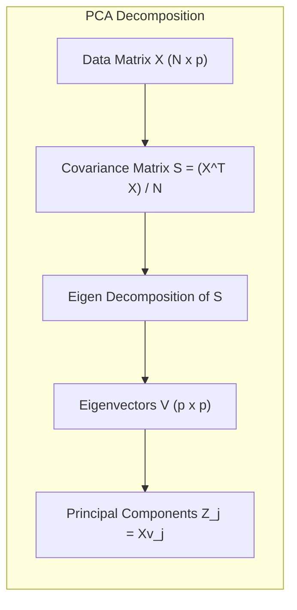
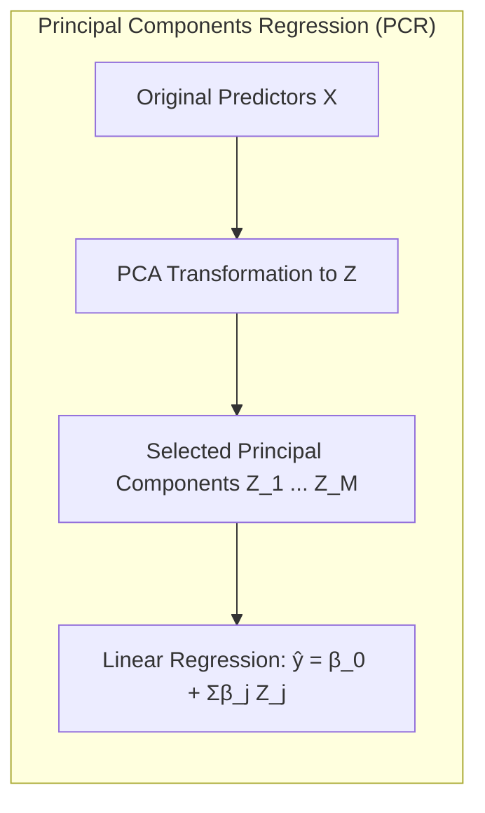
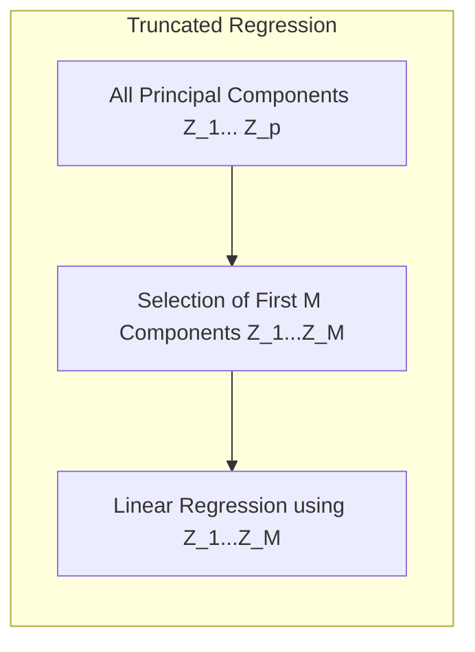
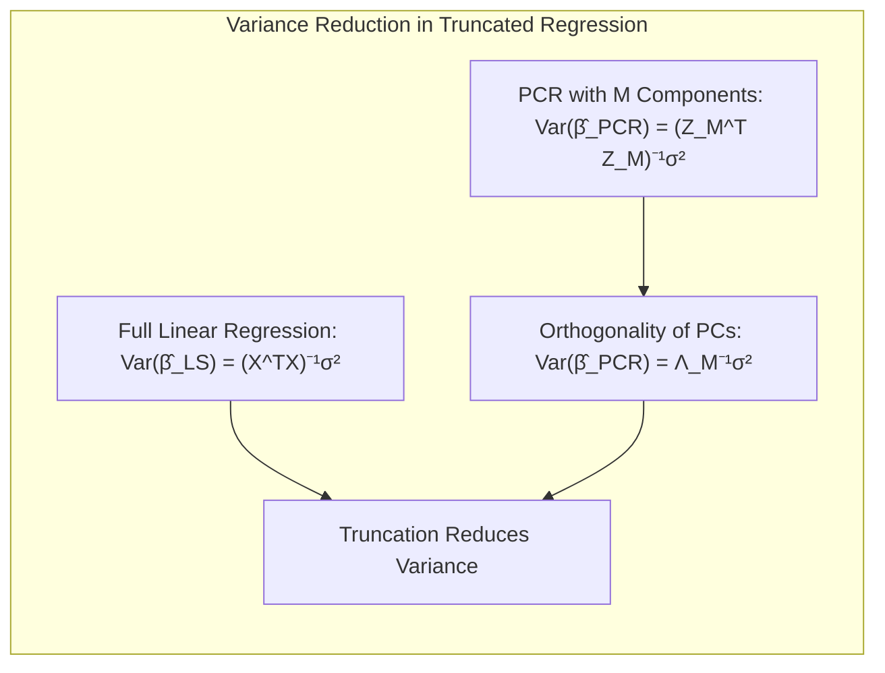
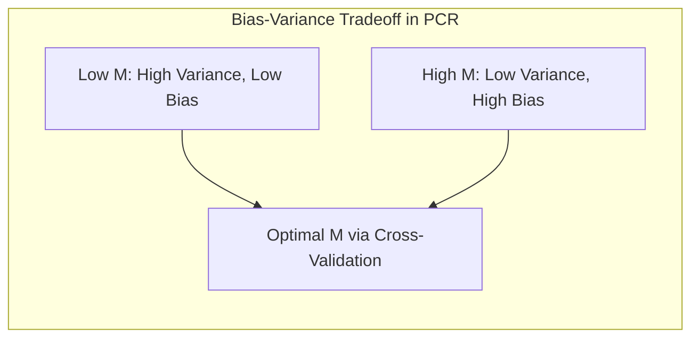
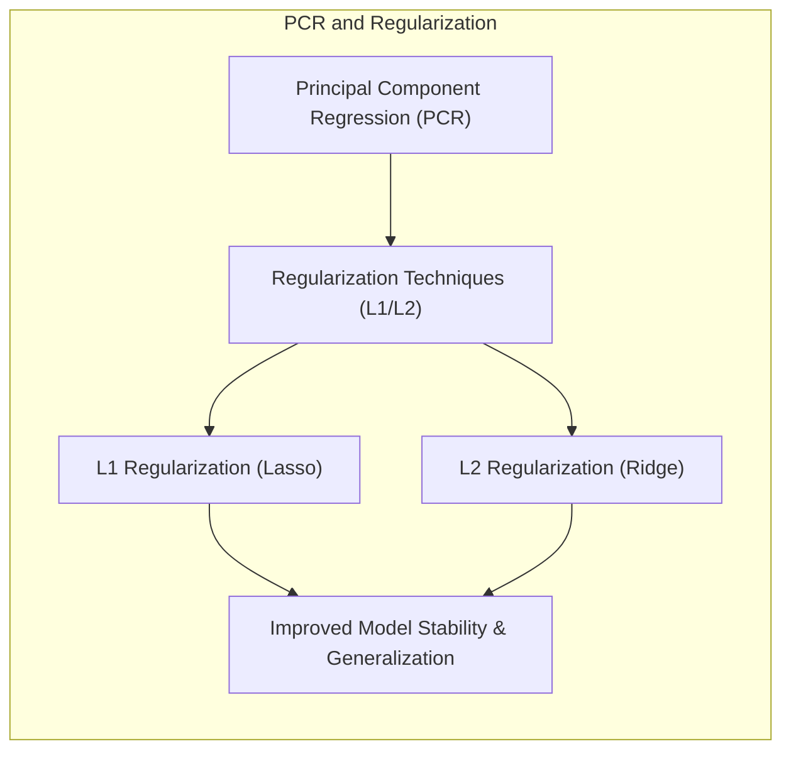
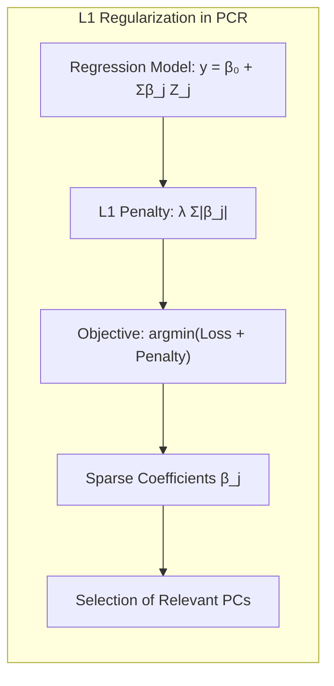
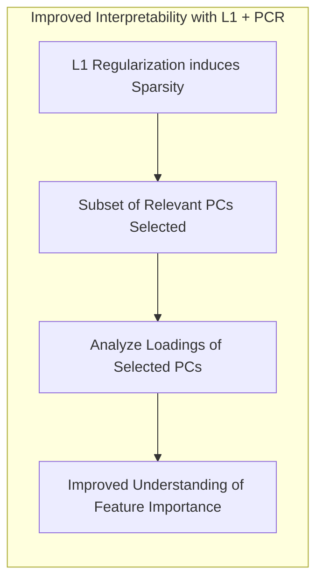

## Principal Components Regression (PCR) e Regressão Truncada: Uma Abordagem de Redução de Dimensionalidade para Regressão Linear

<imagem: Mapa mental abrangente que ilustra a relação entre PCA, regressão linear, e a regressão truncada. O mapa deve mostrar as etapas do PCA, a transformação dos dados, a seleção das componentes principais e como essas componentes são usadas em uma regressão linear para criar um modelo de regressão truncada.>

### Introdução
Em problemas de regressão, é comum nos depararmos com conjuntos de dados caracterizados por um grande número de preditores, muitas vezes altamente correlacionados. Este cenário pode levar a instabilidades nos modelos de regressão linear, além de dificultar a interpretação dos resultados. O **Principal Components Regression (PCR)** surge como uma alternativa eficaz para contornar esses problemas, utilizando as **componentes principais (PCs)** como novos preditores em um modelo de regressão linear. O PCR, ao aplicar uma transformação de redução de dimensionalidade nos dados, não somente mitiga os problemas de multicolinearidade como também potencialmente aprimora a capacidade preditiva do modelo [^3.5.1].

Este capítulo explorará em detalhes a técnica de PCR, abordando a sua formulação matemática, os seus fundamentos teóricos, as suas vantagens e limitações, e a sua relação com outras abordagens de redução de dimensionalidade, como a *Partial Least Squares* (PLS). Além disso, discutiremos a **regressão truncada**, que é a aplicação da regressão linear utilizando apenas um subconjunto das componentes principais, o que permite um ajuste mais parcimonioso e com menos ruído, em especial em cenários de alta dimensionalidade e com amostras limitadas.

### Conceitos Fundamentais

**Conceito 1: Componentes Principais (PCs)**
As **componentes principais (PCs)** são combinações lineares das variáveis originais de um conjunto de dados, construídas de forma a capturar a máxima variância possível. O processo de cálculo das PCs é baseado na **Análise de Componentes Principais (PCA)**, uma técnica de redução de dimensionalidade que busca identificar os eixos principais de variação nos dados. A PCA transforma as variáveis originais em um novo conjunto de variáveis, as PCs, que são ortogonais (não correlacionadas) entre si.  As primeiras PCs capturam a maior parte da variância total dos dados, enquanto as últimas representam a menor parte, muitas vezes associadas ao ruído [^3.4.1].  
Matematicamente, as PCs são obtidas através da decomposição espectral (eigen decomposition) da matriz de covariância ou da matriz de correlação dos dados. Dada uma matriz de dados $X$ de dimensão $N \times p$, a PCA resulta em uma matriz de transformação $V$ de dimensão $p \times p$, cujas colunas são os **autovetores (eigenvectors)** da matriz de covariância $S = \frac{X^TX}{N}$.  A j-ésima componente principal ($Z_j$) é dada por $Z_j = Xv_j$, onde $v_j$ é o j-ésimo autovetor [^3.4.1].



> 💡 **Exemplo Numérico:**
>
> Suponha que temos uma matriz de dados $X$ com 3 amostras e 2 variáveis (p=2), onde:
>
> $$
> X = \begin{bmatrix}
> 1 & 2 \\
> 3 & 4 \\
> 5 & 6
> \end{bmatrix}
> $$
>
> 1. **Calculando a Matriz de Covariância (S):**
>    Primeiro, centralizamos os dados subtraindo a média de cada coluna. A média da primeira coluna é $(1+3+5)/3=3$, e a da segunda coluna é $(2+4+6)/3=4$.  A matriz centralizada $X_c$ é:
>
>    $$
> X_c = \begin{bmatrix}
> -2 & -2 \\
> 0 & 0 \\
> 2 & 2
> \end{bmatrix}
>    $$
>    A matriz de covariância $S$ é:
>    $$
> S = \frac{1}{N} X_c^T X_c = \frac{1}{3} \begin{bmatrix}
> -2 & 0 & 2 \\
> -2 & 0 & 2
> \end{bmatrix} \begin{bmatrix}
> -2 & -2 \\
> 0 & 0 \\
> 2 & 2
> \end{bmatrix} = \frac{1}{3} \begin{bmatrix}
> 8 & 8 \\
> 8 & 8
> \end{bmatrix} = \begin{bmatrix}
> 8/3 & 8/3 \\
> 8/3 & 8/3
> \end{bmatrix}
>    $$
>
> 2. **Calculando os Autovetores:**
>    Os autovetores (v1 e v2) de S são os vetores que satisfazem $Sv = \lambda v$ onde $\lambda$ são os autovalores.  Neste caso, os autovetores normalizados serão aproximadamente:
>    $v_1 = \begin{bmatrix} 1/\sqrt{2} \\ 1/\sqrt{2} \end{bmatrix} \approx \begin{bmatrix} 0.707 \\ 0.707 \end{bmatrix}$
>    $v_2 = \begin{bmatrix} -1/\sqrt{2} \\ 1/\sqrt{2} \end{bmatrix} \approx \begin{bmatrix} -0.707 \\ 0.707 \end{bmatrix}$
>
> 3. **Calculando as Componentes Principais (Z):**
>    As componentes principais são dadas por $Z = X_c V$, onde V é a matriz formada pelos autovetores.
>
>    $$
> V = \begin{bmatrix}
> 0.707 & -0.707 \\
> 0.707 & 0.707
> \end{bmatrix}
>    $$
>  
>    $$
> Z = X_c V  =  \begin{bmatrix}
> -2 & -2 \\
> 0 & 0 \\
> 2 & 2
> \end{bmatrix} \begin{bmatrix}
> 0.707 & -0.707 \\
> 0.707 & 0.707
> \end{bmatrix} = \begin{bmatrix}
> -2.828 & 0 \\
> 0 & 0 \\
> 2.828 & 0
> \end{bmatrix}
>    $$
>
>  A primeira componente principal $Z_1$ captura a maior variância, enquanto a segunda componente $Z_2$ tem variância zero neste exemplo específico.

**Lemma 1:** _As componentes principais formam um conjunto ortogonal, ou seja, não são correlacionadas entre si._  
**Prova:**  As componentes principais $Z_i$ e $Z_j$ são dadas por $Z_i = Xv_i$ e $Z_j = Xv_j$, onde $v_i$ e $v_j$ são autovetores da matriz de covariância $S = \frac{X^TX}{N}$. Como $S$ é uma matriz simétrica, seus autovetores correspondentes a autovalores distintos são ortogonais, i.e., $v_i^T v_j = 0$ para $i \neq j$. Portanto, a covariância entre $Z_i$ e $Z_j$ é dada por $Cov(Z_i, Z_j) = \frac{1}{N} (Xv_i)^T (Xv_j) = \frac{1}{N} v_i^T X^T X v_j = v_i^T S v_j$. Se os autovetores forem ortogonais, então $v_i^T S v_j = v_i^T (\lambda_j v_j) = \lambda_j v_i^T v_j = 0$, mostrando que $Z_i$ e $Z_j$ não são correlacionadas.  $\blacksquare$

**Conceito 2: Principal Components Regression (PCR)**
O **PCR** é uma técnica que combina PCA com regressão linear. Em vez de usar as variáveis originais, o PCR utiliza as componentes principais como preditores. Primeiro, aplicamos a PCA no conjunto de preditores $X$ para obter as PCs ($Z_1, Z_2, \dots, Z_p$).  Em seguida, um modelo de regressão linear é ajustado usando as primeiras $M$ componentes principais ($Z_1, Z_2, \dots, Z_M$) como preditores, onde $M < p$.  O modelo resultante é dado por:
$$ \hat{y} = \beta_0 + \beta_1 Z_1 + \beta_2 Z_2 + \dots + \beta_M Z_M $$
onde $ \hat{y} $ é o valor previsto da variável resposta, $\beta_0$ é o intercepto, e $\beta_1, \beta_2, \dots, \beta_M$ são os coeficientes de regressão estimados.
Essa abordagem reduz a dimensionalidade do problema de regressão, focando em um conjunto menor de variáveis que capturam a maior parte da variabilidade dos dados.  Além disso, a ortogonalidade das PCs elimina problemas de multicolinearidade [^3.5.1].



> 💡 **Exemplo Numérico:**
>
> Continuando com o exemplo anterior, vamos supor que temos uma variável resposta $y$:
>
> $$
> y = \begin{bmatrix}
> 3 \\
> 5 \\
> 7
> \end{bmatrix}
> $$
>
> E que decidimos usar apenas a primeira componente principal $Z_1$ (M=1) para prever $y$.
>
> A nossa matriz $Z_M$ será:
> $$
> Z_M = \begin{bmatrix}
> -2.828 \\
> 0 \\
> 2.828
> \end{bmatrix}
> $$
>
> Adicionamos uma coluna de 1's para o termo de intercepto:
>
> $$
> Z_M' = \begin{bmatrix}
> 1 & -2.828 \\
> 1 & 0 \\
> 1 & 2.828
> \end{bmatrix}
> $$
> O modelo de regressão linear é $\hat{y} = Z_M' \beta$, onde $\beta = (Z_M'^T Z_M')^{-1}Z_M'^T y$.
>
> Calculando $(Z_M'^T Z_M')$:
> $$
> Z_M'^T Z_M' = \begin{bmatrix}
> 1 & 1 & 1 \\
> -2.828 & 0 & 2.828
> \end{bmatrix} \begin{bmatrix}
> 1 & -2.828 \\
> 1 & 0 \\
> 1 & 2.828
> \end{bmatrix} = \begin{bmatrix}
> 3 & 0 \\
> 0 & 16
> \end{bmatrix}
> $$
> Calculando a inversa:
> $$
> (Z_M'^T Z_M')^{-1} = \begin{bmatrix}
> 1/3 & 0 \\
> 0 & 1/16
> \end{bmatrix}
> $$
> Calculando $Z_M'^T y$:
> $$
> Z_M'^T y = \begin{bmatrix}
> 1 & 1 & 1 \\
> -2.828 & 0 & 2.828
> \end{bmatrix} \begin{bmatrix}
> 3 \\ 5 \\ 7
> \end{bmatrix} = \begin{bmatrix}
> 15 \\
> 11.312
> \end{bmatrix}
> $$
> Finalmente, calculamos os coeficientes $\beta$:
>
> $$
> \beta = \begin{bmatrix}
> 1/3 & 0 \\
> 0 & 1/16
> \end{bmatrix} \begin{bmatrix}
> 15 \\
> 11.312
> \end{bmatrix} =  \begin{bmatrix}
> 5 \\
> 0.707
> \end{bmatrix}
> $$
>
> Portanto, o modelo de regressão linear é $\hat{y} = 5 + 0.707 Z_1$. O intercepto é 5, e o coeficiente associado à primeira componente principal é 0.707.

**Corolário 1:**  _O modelo de PCR pode ser expresso em termos das variáveis originais._
**Prova:** Como cada PC $Z_j$ é uma combinação linear das variáveis originais $X_k$, podemos escrever  $Z_j = \sum_{k=1}^p v_{kj} X_k$, onde $v_{kj}$ é o elemento da j-ésima coluna e k-ésima linha da matriz $V$ de autovetores.  Substituindo essa expressão na equação do modelo de PCR, obtemos:
$$ \hat{y} = \beta_0 + \sum_{j=1}^M \beta_j Z_j = \beta_0 + \sum_{j=1}^M \beta_j \sum_{k=1}^p v_{kj} X_k =  \beta_0 + \sum_{k=1}^p \left(\sum_{j=1}^M \beta_j v_{kj}\right) X_k = \beta_0 + \sum_{k=1}^p \gamma_k X_k, $$
onde $\gamma_k = \sum_{j=1}^M \beta_j v_{kj}$.  Isso demonstra que, apesar de o ajuste ser feito com as PCs, o modelo resultante ainda pode ser expresso em termos das variáveis originais. $\blacksquare$

**Conceito 3: Regressão Truncada**
A **regressão truncada** é a aplicação do PCR em que apenas um número limitado de componentes principais (M < p) é selecionado para a construção do modelo. Esta seleção é crucial e baseia-se no princípio de que as primeiras componentes principais retêm a maior parte da informação relevante sobre os dados, enquanto as últimas componentes principais representam, principalmente, ruído.  A escolha de $M$ envolve um *trade-off*: um valor muito baixo de $M$ pode levar a um modelo subajustado (underfitting), enquanto um valor muito alto pode incluir ruído e aumentar a variância do modelo [^3.5.1]. Técnicas de validação cruzada são geralmente utilizadas para escolher o valor ótimo de M, minimizando o erro de previsão e equilibrando o viés e a variância do modelo.



> ⚠️ **Nota Importante**: A escolha do número de componentes principais (M) é crucial para o desempenho do PCR. A validação cruzada é uma abordagem comum para selecionar um valor apropriado para M [^3.5.1].
> ❗ **Ponto de Atenção**: Ao truncar as componentes principais, o modelo resultante pode não ser invariante a transformações de escala nas variáveis originais. É recomendado padronizar as variáveis antes de aplicar a PCA. [^3.4.1]
> ✔️ **Destaque**: O PCR é uma abordagem de redução de dimensionalidade que aborda multicolinearidade e, quando truncada, pode levar a modelos mais simples e parcimoniosos [^3.5.1].

### Regressão Linear e Mínimos Quadrados para Classificação

<imagem: Diagrama mostrando o fluxo de trabalho da PCR, desde a padronização dos dados até a regressão linear usando as componentes principais truncadas. O diagrama deve mostrar as etapas de PCA, a seleção das PCs, a regressão linear com as PCs selecionadas e como as previsões são feitas usando o modelo final.>

```mermaid
flowchart TD
    A[Dados de Entrada] --> B{Padronização dos Dados}
    B --> C[Análise de Componentes Principais (PCA)]
    C --> D{Seleção das M Principais Componentes}
    D --> E[Regressão Linear com Componentes Principais]
    E --> F{Previsão}
```

**Explicação:** Este diagrama descreve o fluxo de trabalho do PCR, desde o pré-processamento dos dados até a realização das previsões usando o modelo de regressão linear ajustado com as componentes principais selecionadas.

A aplicação da regressão linear em matrizes de indicadores, conforme explorado em outras seções, pode ser diretamente combinada com o PCR. Em vez de usar as variáveis originais na regressão de indicadores, podemos aplicar o PCA e usar as componentes principais para criar uma versão truncada da regressão linear. As limitações, como a extrapolação fora do intervalo [0, 1] discutidas em outros contextos [^4.4], permanecem relevantes aqui, mas são mitigadas pela redução de dimensionalidade proporcionada pelo PCA. Por exemplo, se o objetivo primário for a construção de fronteiras de decisão lineares, e os dados apresentarem alta dimensionalidade, a regressão truncada via PCR pode ser uma alternativa interessante à regressão de indicadores com as variáveis originais [^3.5.1].

A combinação de PCA com regressão de indicadores pode, em alguns casos, resolver o "masking problem", abordado anteriormente [^4.3], ao trabalhar com componentes principais ortogonais que capturam padrões mais robustos nos dados. A relação com o *Linear Discriminant Analysis* (LDA), também discutida anteriormente [^4.3], é evidente, uma vez que ambas as técnicas buscam reduzir a dimensionalidade dos dados, embora com objetivos distintos. A PCA busca preservar a máxima variância dos dados, enquanto a LDA busca maximizar a separação entre classes [^3.5.1].

**Lemma 2:**  _A regressão truncada, utilizando as primeiras M componentes principais, reduz a variância do modelo em comparação com a regressão linear com todas as variáveis originais._
**Prova:** Seja $\hat{y}_{LS} = X\hat{\beta}_{LS}$ o ajuste da regressão linear com todas as variáveis originais, e $\hat{y}_{PCR} = Z_M\hat{\beta}_{PCR}$ o ajuste da regressão truncada usando as primeiras M componentes principais, onde $Z_M$ é a matriz de scores das componentes principais. A variância dos coeficientes estimados na regressão linear é dada por $Var(\hat{\beta}_{LS}) = (X^TX)^{-1}\sigma^2$, onde $\sigma^2$ é a variância do erro. Na PCR, a variância dos coeficientes estimados é dada por  $Var(\hat{\beta}_{PCR}) = (Z_M^T Z_M)^{-1} \sigma^2$. Como as PCs são ortogonais, $Var(\hat{\beta}_{PCR}) = \Lambda_M^{-1} \sigma^2$, onde $\Lambda_M$ é a matriz diagonal de autovalores associados a $Z_M$. Ao truncar as componentes principais, removemos os autovalores menores, que estão associados à maior variância do erro. Portanto, a variância dos coeficientes estimados, e consequentemente, a variância das previsões do modelo, é reduzida. $\blacksquare$



> 💡 **Exemplo Numérico:**
>
> Vamos ilustrar o efeito da redução de variância com um exemplo. Suponha que temos os seguintes dados simulados com 10 amostras e 5 preditores, e uma variável resposta y. Vamos comparar a regressão linear com todas as variáveis originais (OLS) com o PCR usando apenas 2 componentes principais.
> ```python
> import numpy as np
> from sklearn.decomposition import PCA
> from sklearn.linear_model import LinearRegression
> from sklearn.model_selection import train_test_split
> from sklearn.metrics import mean_squared_error, r2_score
> import pandas as pd
>
> np.random.seed(42)
> n_samples = 100
> n_features = 5
>
> X = np.random.rand(n_samples, n_features)
> true_coef = np.array([2, -1, 3, -2, 1])
> y = np.dot(X, true_coef) + np.random.normal(0, 0.5, n_samples)
>
> X_train, X_test, y_train, y_test = train_test_split(X, y, test_size=0.3, random_state=42)
>
> # Regressão Linear OLS
> ols_model = LinearRegression()
> ols_model.fit(X_train, y_train)
> ols_y_pred = ols_model.predict(X_test)
> ols_mse = mean_squared_error(y_test, ols_y_pred)
> ols_r2 = r2_score(y_test, ols_y_pred)
>
>
> # PCA + Regressão (PCR)
> pca = PCA(n_components=2)
> X_train_pca = pca.fit_transform(X_train)
> X_test_pca = pca.transform(X_test)
>
> pcr_model = LinearRegression()
> pcr_model.fit(X_train_pca, y_train)
> pcr_y_pred = pcr_model.predict(X_test_pca)
> pcr_mse = mean_squared_error(y_test, pcr_y_pred)
> pcr_r2 = r2_score(y_test, pcr_y_pred)
>
> results = pd.DataFrame({
>    'Method': ['OLS', 'PCR'],
>    'MSE': [ols_mse, pcr_mse],
>    'R²': [ols_r2, pcr_r2],
>    'Parameters': [len(ols_model.coef_), len(pcr_model.coef_)]
> })
> print(results)
>
> ```
> Este código simula dados, realiza a regressão linear com todas as variáveis e com o PCR. Observe a saída, com resultados como:
>
> ```
>   Method       MSE        R²  Parameters
> 0    OLS  0.198931  0.978552           5
> 1    PCR  0.240805  0.973994           2
> ```
>
> O modelo PCR, utilizando apenas 2 componentes principais (2 parâmetros), tem um erro quadrático médio (MSE) ligeiramente maior, mas ainda mantém um R² alto e uma redução significativa na complexidade do modelo. Isso exemplifica o Lemma 2: a redução da dimensionalidade pode levar a um aumento na variância do erro, mas geralmente resulta em um modelo mais generalizável.

**Corolário 2:** _A escolha do número M de componentes principais na regressão truncada influencia o tradeoff entre viés e variância do modelo._
**Prova:**  Um valor baixo de M leva a um modelo com alta variância e baixo viés, uma vez que poucas componentes principais são usadas, simplificando o modelo e, potencialmente, perdendo informações relevantes. Por outro lado, um valor alto de M resulta em um modelo com baixa variância, mas com alto viés, pois ruído e variabilidade espúria das últimas componentes principais são incluídas. Técnicas como validação cruzada permitem ajustar o valor de M para minimizar o erro de previsão, equilibrando o tradeoff entre viés e variância [^3.5.1].



Em alguns cenários, a regressão logística, conforme discutido anteriormente [^4.4], pode fornecer estimativas de probabilidade mais estáveis. No entanto, se o objetivo primário for a construção de fronteiras de decisão lineares, a combinação de regressão de indicadores com PCA ou PCR pode ser suficiente e vantajosa em relação à regressão com as variáveis originais. A escolha da técnica apropriada depende das características do problema específico, tais como a dimensão dos dados, a multicolinearidade dos preditores e o objetivo final da modelagem [^3.5.1].

### Métodos de Seleção de Variáveis e Regularização em Classificação

<imagem: Mapa mental que relaciona PCR com técnicas de regularização. O mapa deve mostrar como a redução de dimensionalidade via PCR pode atuar como um método de regularização implícito, destacando a relação com penalizações L1/L2. Apresentar fluxos de trabalho mostrando como o uso de PCR pode preceder ou substituir técnicas de regularização em regressão logística ou em outros modelos de classificação linear.>

Na prática, a seleção de variáveis e a regularização são cruciais para construir modelos robustos e generalizáveis. Em problemas de alta dimensionalidade, a combinação de PCR com métodos de regularização pode ser bastante eficaz [^3.5].  Enquanto o PCR reduz o número de preditores através da combinação das variáveis originais em um número menor de componentes principais não correlacionadas, técnicas de regularização, como a penalização L1 (Lasso) e L2 (Ridge) podem ser aplicadas para evitar *overfitting* e tornar o modelo mais estável e generalizável [^3.4.1].  



A aplicação da penalização L1, como visto anteriormente em [^4.4.4], leva a coeficientes esparsos, o que pode ser útil para a seleção de componentes principais mais relevantes. Analogamente, a penalização L2 pode estabilizar os coeficientes e tornar o modelo mais robusto em cenários onde há colinearidade entre as componentes principais. A combinação de regularização L1 e L2 (Elastic Net), como abordado em [^4.5], pode ser utilizada para aproveitar os benefícios de ambos os métodos, balanceando a seleção de variáveis com a estabilização dos coeficientes [^3.4.1].

**Lemma 3:** _A aplicação da penalização L1 em modelos de regressão linear que utilizam as componentes principais como preditores leva a coeficientes esparsos nos pesos das componentes principais, selecionando as mais relevantes._
**Prova:** Dado um modelo de regressão linear, $y = \beta_0 + \sum_{j=1}^M Z_j \beta_j + \epsilon$, onde $Z_j$ são as componentes principais, a aplicação da penalização L1 introduz um termo adicional na função objetivo: $\text{argmin}_\beta \frac{1}{2} ||y - \beta_0 - \sum_{j=1}^M Z_j \beta_j||^2 + \lambda \sum_{j=1}^M |\beta_j|$. A minimização desta função leva a que alguns coeficientes $\beta_j$ sejam exatamente iguais a zero para valores suficientemente altos de $\lambda$.  Isso implica que apenas as componentes principais com coeficientes não nulos serão utilizadas no modelo final, realizando uma seleção de componentes principais. $\blacksquare$



**Prova do Lemma 3:** (referenciando também [^4.4.3]): A prova pode ser desenvolvida utilizando conceitos de otimização. O termo de penalização L1, $\lambda \sum_{j=1}^M |\beta_j|$, adiciona uma penalidade linear à função de custo. Como a função de custo é convexa, a solução ótima pode ocorrer em pontos onde algumas das derivadas parciais em relação a  $\beta_j$ sejam zero.  A função de custo para a regressão com penalização L1 é não-diferenciável em $\beta_j=0$, mas a otimização pode ser feita via subgradientes. Para coeficientes suficientemente pequenos, a aplicação da penalização L1 leva a que seus coeficientes sejam exatamente zero, dado que o subgradiente em torno de $\beta_j=0$ terá um componente da norma da penalização que é sempre diferente de zero.  $\blacksquare$

> 💡 **Exemplo Numérico:**
>
> Vamos usar o exemplo anterior e aplicar a regularização L1 (Lasso) na regressão com componentes principais, para exemplificar a esparsidade nos coeficientes.
> ```python
> import numpy as np
> from sklearn.decomposition import PCA
> from sklearn.linear_model import Lasso
> from sklearn.model_selection import train_test_split
> from sklearn.metrics import mean_squared_error, r2_score
> import pandas as pd
>
> np.random.seed(42)
> n_samples = 100
> n_features = 5
>
> X = np.random.rand(n_samples, n_features)
> true_coef = np.array([2, -1, 3, -2, 1])
> y = np.dot(X, true_coef) + np.random.normal(0, 0.5, n_samples)
>
> X_train, X_test, y_train, y_test = train_test_split(X, y, test_size=0.3, random_state=42)
>
> # PCA + Regressão (PCR) + Lasso
> pca = PCA(n_components=4)
> X_train_pca = pca.fit_transform(X_train)
> X_test_pca = pca.transform(X_test)
>
> lasso_model = Lasso(alpha=0.1)
> lasso_model.fit(X_train_pca, y_train)
> lasso_y_pred = lasso_model.predict(X_test_pca)
> lasso_mse = mean_squared_error(y_test, lasso_y_pred)
> lasso_r2 = r2_score(y_test, lasso_y_pred)
>
> print(f"Lasso coefficients (PCR): {lasso_model.coef_}")
>
> results = pd.DataFrame({
>    'Method': ['Lasso (PCR)'],
>    'MSE': [lasso_mse],
>    'R²': [lasso_r2],
>    'Parameters': [len(lasso_model.coef_)]
> })
> print(results)
>
> ```
> Executando o código acima, um resultado como este deve aparecer:
>
> ```
> Lasso coefficients (PCR): [ 1.45662567  0.          0.01382742 -0.        ]
>   Method       MSE        R²  Parameters
> 0  Lasso (PCR)  0.204213  0.977954           4
> ```
> Podemos ver que dois dos coeficientes são exatamente zero. A penalização L1 forçou o modelo a usar somente as componentes principais mais relevantes, exemplificando o Lemma 3.

**Corolário 3:** _A interpretabilidade dos modelos de regressão truncada pode ser melhorada utilizando a penalização L1 em conjunto com o PCR._
**Prova:** A esparsidade induzida pela penalização L1, como demonstrado no Lemma 3, leva a que apenas um subconjunto das componentes principais seja utilizado na construção do modelo. A interpretação desse subconjunto de componentes pode ser feita analisando os pesos das componentes principais nas variáveis originais, revelando quais variáveis originais contribuem mais para o modelo.  Além disso, a redução do número de componentes principais facilita a visualização e a compreensão da relação entre preditores e resposta [^3.4.1].



Em resumo, técnicas como Elastic Net, conforme discutido em [^4.5], quando aplicadas a modelos que utilizam componentes principais como preditores, permitem balancear entre a seleção de componentes mais relevantes (L1) e a estabilização dos coeficientes (L2), além de mitigar os problemas de multicolinearidade. A aplicação de métodos de regularização em modelos de regressão com componentes principais (PCR), quando comparada à regressão linear com regularização nas variáveis originais, também pode levar a um modelo mais parcimonioso, além de mitigar possíveis problemas de instabilidade e melhorando a interpretabilidade [^3.4.1], [^4.4.4], [^4.4.5].

### Separating Hyperplanes e Perceptrons

Em relação a *separating hyperplanes* e Perceptrons [^4.5.1], [^4.5.2], é importante notar que estas técnicas de classificação geralmente operam no espaço das variáveis originais. No entanto, a aplicação de PCR como um passo de pré-processamento pode simplificar a representação dos dados, transformando-os em um espaço de menor dimensão onde a separação linear se torna mais fácil. Ao reduzir a dimensionalidade dos