## Regressão em Componentes Ortogonais Derivados e Conexão com Ridge Regression
<imagem: Um mapa mental que conecte os conceitos de regressão linear, componentes principais, ridge regression e partial least squares, destacando as relações entre eles e como eles lidam com multicolinearidade.>

### Introdução

O problema de classificação e regressão muitas vezes envolve conjuntos de dados com um grande número de preditores, que podem ser altamente correlacionados. Esta condição, conhecida como multicolinearidade, pode levar a modelos instáveis e difíceis de interpretar [^4.1], [^4.2].  Em resposta, métodos de aprendizado estatístico que derivam componentes ortogonais dos preditores originais foram desenvolvidos, tais como **Principal Component Regression (PCR)** e **Partial Least Squares (PLS)**. Esses métodos visam reduzir a dimensionalidade dos dados e simplificar o modelo, projetando os preditores originais em um novo espaço, onde os componentes são linearmente independentes [^4.1], [^4.2], [^4.3], [^4.5]. Além disso, esses métodos possuem uma forte conexão com **Ridge Regression**, um método de regularização que também visa mitigar os efeitos da multicolinearidade. Este capítulo explora profundamente estas técnicas e suas inter-relações.

### Conceitos Fundamentais

#### Conceito 1: Problema de Classificação e Regressão com Multicolinearidade
Em problemas de classificação e regressão, frequentemente nos deparamos com conjuntos de dados onde as variáveis preditoras, $X_1, X_2, ..., X_p$, são correlacionadas entre si. Essa multicolinearidade pode levar a diversos problemas [^4.1], [^4.2]:
*   **Instabilidade dos coeficientes:** Pequenas mudanças nos dados podem causar grandes variações nos coeficientes do modelo de regressão linear, dificultando a interpretação dos resultados.
*   **Alta variância:** Estimativas dos coeficientes podem apresentar alta variância, levando a previsões menos precisas e generalizáveis para novos dados.
*   **Dificuldade de interpretação:** Modelos com multicolinearidade podem ser difíceis de interpretar, pois os coeficientes individuais podem não refletir o verdadeiro impacto de cada preditor na variável resposta.
Métodos lineares, como a regressão linear, podem ser inadequados para lidar com esse tipo de problema [^4.1].  A ideia principal por trás da regressão em componentes derivados é criar novas variáveis que sejam linearmente independentes (ortogonais), combinando as variáveis originais, e assim contornar a multicolinearidade e simplificar o modelo [^4.2], [^4.3]. Métodos de regularização como a Ridge Regression também são usados para tratar a multicolinearidade, penalizando o tamanho dos coeficientes.

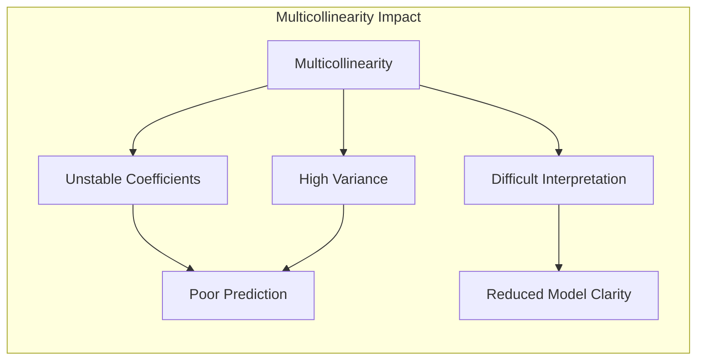

> 💡 **Exemplo Numérico:** Imagine que temos um conjunto de dados com duas variáveis preditoras, $X_1$ (tamanho do motor em litros) e $X_2$ (potência do motor em cavalos), que são altamente correlacionadas, e uma variável resposta $Y$ (consumo de combustível em km/l). Se ajustarmos um modelo de regressão linear, os coeficientes podem ser instáveis. Pequenas variações na amostra podem gerar grandes mudanças nos coeficientes estimados para $X_1$ e $X_2$. Por exemplo, poderíamos obter $\hat{\beta}_1 = 0.5$ e $\hat{\beta}_2 = -0.2$, onde a interpretação seria confusa, visto que ambas as variáveis estão relacionadas à performance do motor. A multicolinearidade dificulta a interpretação dos coeficientes individuais.

##### Lemma 1
Em um modelo de regressão linear, a variância dos coeficientes $\hat{\beta}$ é dada por $Var(\hat{\beta}) = \sigma^2(X^T X)^{-1}$, onde $X$ é a matriz de desenho e $\sigma^2$ é a variância do erro. A presença de multicolinearidade implica que a matriz $X^T X$ é mal condicionada (próxima de singular), o que leva a grandes elementos diagonais em $(X^T X)^{-1}$, e, consequentemente, a alta variância em $\hat{\beta}$. [^4.3]
$$ \blacksquare $$

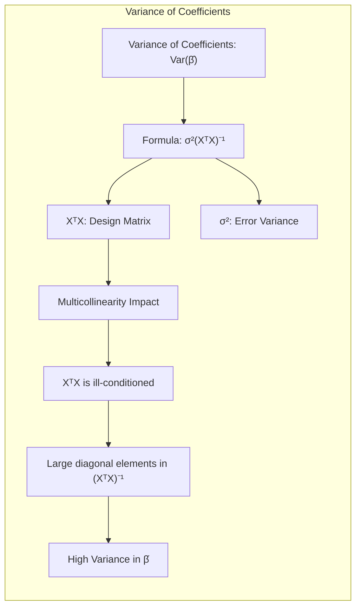

> 💡 **Exemplo Numérico:** Suponha que temos uma matriz de desenho $X$ com duas colunas (além da coluna de 1's para o intercepto):
> ```python
> import numpy as np
> X = np.array([[1, 2, 3], [1, 2.1, 3.1], [1, 2.2, 3.2], [1, 5, 6], [1, 5.1, 6.1], [1, 5.2, 6.2]])
> ```
> Observe que as colunas 2 e 3 são altamente correlacionadas. Vamos calcular $(X^T X)^{-1}$:
> ```python
> XtX_inv = np.linalg.inv(X.T @ X)
> print(XtX_inv)
> ```
> O resultado será:
> ```
> [[ 2.75000000e+01 -1.50000000e+01 -4.85000000e+00]
> [-1.50000000e+01  8.16666667e+00  2.60000000e+00]
> [-4.85000000e+00  2.60000000e+00  8.50000000e-01]]
> ```
> Note que os elementos diagonais (relacionados à variância dos coeficientes) são relativamente grandes, indicando alta variância devido à multicolinearidade. Se as colunas fossem ortogonais, a matriz $(X^T X)$ seria diagonal, e a inversa também, com elementos menores na diagonal.

#### Conceito 2: Principal Component Regression (PCR)

A **Principal Component Regression (PCR)** é uma técnica que combina **análise de componentes principais (PCA)** com regressão linear [^4.5]. O processo envolve duas etapas principais:
1.  **PCA:** Primeiro, a PCA é aplicada para derivar um conjunto de componentes principais (PCs) a partir da matriz de preditores $X$. Os PCs são combinações lineares ortogonais das variáveis originais, ordenadas por sua variância, ou seja, a primeira PC captura a maior variabilidade nos dados, a segunda PC captura a segunda maior variabilidade, e assim por diante.  Os PCs são calculados usando a decomposição em valores singulares (SVD) de $X$, de acordo com $X = UDV^T$, onde $U$ é uma matriz ortogonal com as coordenadas das projeções de $X$ no espaço dos PCs, $V$ são os autovetores da matriz de covariância $X^T X$ (também conhecidos como as direções dos componentes principais), e $D$ é uma matriz diagonal com os valores singulares [^4.5]. As colunas de $U$ são denotadas por $u_m$, para $m=1,\ldots,p$. As componentes principais são definidas como $z_m = X u_m$
2.  **Regressão Linear:** Em seguida, as primeiras $M$ componentes principais (onde $M < p$) são usadas como preditores em um modelo de regressão linear para prever a variável resposta $y$. O modelo de regressão PCR é dado por:
    $$ \hat{y}_{PCR} = \hat{\beta_0} + \sum_{m=1}^{M} \hat{\theta}_m z_m  $$
     onde $\hat{\theta}_m = (z_m,y) / (z_m,z_m)$ e $(z_m,y)$ são os produtos internos.
A PCR reduz o problema da multicolinearidade, pois os componentes principais são ortogonais entre si e, portanto, não correlacionados [^4.5], o que leva a uma solução de mínimos quadrados com boa estabilidade e menos variância do que a regressão linear com os preditores originais.

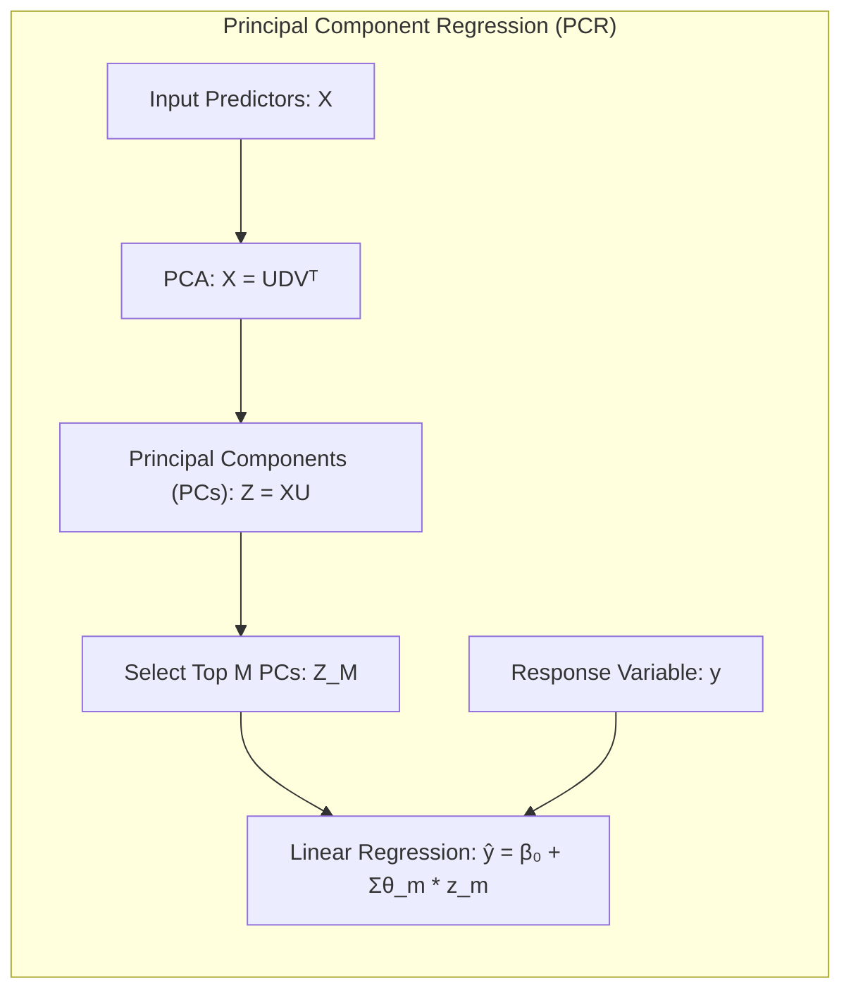

> 💡 **Exemplo Numérico:** Vamos usar a mesma matriz $X$ anterior, mas agora com valores centrados na média:
> ```python
> from sklearn.decomposition import PCA
> from sklearn.preprocessing import StandardScaler
>
> X = np.array([[2, 3], [2.1, 3.1], [2.2, 3.2], [5, 6], [5.1, 6.1], [5.2, 6.2]])
> scaler = StandardScaler()
> X_scaled = scaler.fit_transform(X)
> pca = PCA(n_components=2)
> pca.fit(X_scaled)
> Z = pca.transform(X_scaled)
> print("Componentes principais Z:\n", Z)
> print("Autovetores:\n", pca.components_)
> ```
> As componentes principais $Z$ são combinações lineares das variáveis originais, e são ortogonais entre si. Por exemplo, a primeira componente principal (primeira coluna de Z) captura a maior parte da variação em X, enquanto a segunda captura a variação residual. O autovetores mostram as direções que definem os componentes principais no espaço original de $X$.
> Se a variável resposta for $y = [4, 4.2, 4.4, 7, 7.2, 7.4]$, podemos agora usar $Z$ como preditores no modelo:
> ```python
> y = np.array([4, 4.2, 4.4, 7, 7.2, 7.4])
> theta_1 = np.dot(Z[:,0], y) / np.dot(Z[:,0], Z[:,0])
> theta_2 = np.dot(Z[:,1], y) / np.dot(Z[:,1], Z[:,1])
> print(f"theta_1: {theta_1:.3f}")
> print(f"theta_2: {theta_2:.3f}")
> beta0 = np.mean(y) - theta_1*np.mean(Z[:,0]) - theta_2*np.mean(Z[:,1])
> y_hat = beta0 + theta_1*Z[:,0] + theta_2*Z[:,1]
> print("y_hat:", y_hat)
> ```
> Note que o modelo agora usa como preditores as variáveis $Z_1$ e $Z_2$, que são ortogonais (não correlacionadas), removendo o problema da multicolinearidade. Além disso, se usarmos apenas a primeira componente $Z_1$ ($M=1$), podemos simplificar o modelo.

##### Corolário 1

A variância dos coeficientes da regressão PCR é menor que a variância dos coeficientes da regressão linear padrão, pois a matriz $Z^T Z$, onde $Z$ é a matriz dos componentes principais, é diagonal e, portanto, bem condicionada. Além disso, ao selecionar um subconjunto das componentes principais com maior variância ($M < p$), a PCR também reduz a complexidade do modelo, mitigando o problema de overfitting. [^4.5]

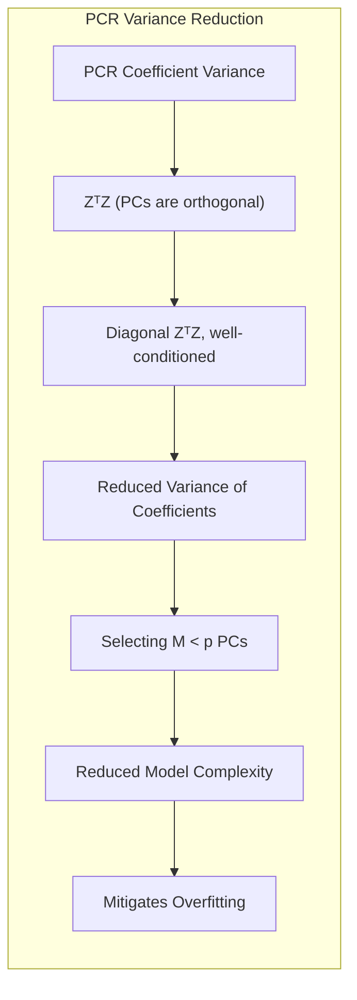

#### Conceito 3: Partial Least Squares (PLS)

A **Partial Least Squares (PLS)** é outra técnica que deriva componentes ortogonais dos preditores originais, mas, ao contrário da PCR, ela usa informações sobre a variável resposta $y$ para construir essas componentes [^4.5.2]. O algoritmo PLS opera de forma iterativa, construindo novos componentes que maximizem a covariância entre os preditores e a resposta. O procedimento PLS pode ser resumido nos seguintes passos [^4.5.2]:
1.  **Inicialização:** Calcula-se a covariância entre cada preditor original $x_j$ e a variável resposta $y$.
2.  **Construção da primeira componente:** Combina-se as variáveis originais $x_j$ usando as covariâncias calculadas na etapa anterior como pesos, criando uma nova variável ou componente $z_1$.
     $$ z_1 = \sum_{j=1}^p \phi_{1j} x_j $$ onde $\phi_{1j} = (x_j,y)$
3.  **Regressão e Ortogonalização:** A variável resposta $y$ é regredida em $z_1$ para obter um coeficiente $\theta_1$, e em seguida os preditores originais $x_j$ são ortogonalizados com relação a $z_1$.
     $$ x_j^{(1)} = x_j - \frac{(z_1, x_j)}{(z_1, z_1)} z_1$$
4.  **Iteração:** O processo é repetido com os preditores ortogonalizados para obter uma nova componente $z_2$, e assim por diante, até que $M$ componentes tenham sido construídas.
5.  **Regressão:** Finalmente, a regressão é feita em $y$ com as componentes $z_m$.
      $$ \hat{y}_{PLS} =  \hat{\beta_0} + \sum_{m=1}^{M} \hat{\theta}_m z_m $$

A PLS tem como objetivo encontrar um conjunto de componentes que sejam relevantes tanto para a descrição dos preditores quanto para a previsão da variável resposta.  PLS pode ser vantajoso em relação a PCR em situações em que nem todas as variáveis preditoras são altamente relevantes para a resposta [^4.5.2].

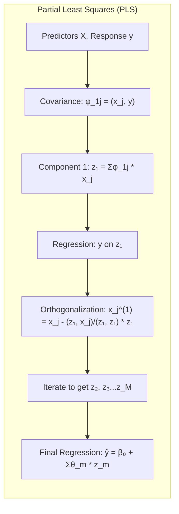

> 💡 **Exemplo Numérico:** Usando os mesmos dados $X$ e $y$ anteriores, vamos ilustrar a primeira iteração da PLS. Primeiro, calcula-se a covariância entre cada coluna de $X$ e $y$:
> ```python
> X = np.array([[2, 3], [2.1, 3.1], [2.2, 3.2], [5, 6], [5.1, 6.1], [5.2, 6.2]])
> y = np.array([4, 4.2, 4.4, 7, 7.2, 7.4])
> phi_11 = np.dot(X[:,0], y)
> phi_12 = np.dot(X[:,1], y)
> print(f"phi_11 (cov entre X1 e y): {phi_11:.2f}")
> print(f"phi_12 (cov entre X2 e y): {phi_12:.2f}")
> ```
> A primeira componente $z_1$ será:
> ```python
> z1 = phi_11 * X[:,0] + phi_12 * X[:,1]
> print("z1:", z1)
> ```
> Em seguida, a variável resposta $y$ é regredida em $z_1$:
> ```python
> theta_1 = np.dot(z1, y) / np.dot(z1, z1)
> print(f"theta_1: {theta_1:.3f}")
> ```
> E os preditores originais são ortogonalizados em relação a $z_1$:
> ```python
> z1 = z1.reshape(-1,1)
> x1_ort = X[:,0] - np.dot(z1.flatten(), X[:,0]) / np.dot(z1.flatten(), z1.flatten()) * z1.flatten()
> x2_ort = X[:,1] - np.dot(z1.flatten(), X[:,1]) / np.dot(z1.flatten(), z1.flatten()) * z1.flatten()
> print("x1_ort:", x1_ort)
> print("x2_ort:", x2_ort)
> ```
> O algoritmo PLS continuaria iterando para obter mais componentes, mas o exemplo mostra que, ao contrário do PCR, PLS usa informações de $y$ para guiar a construção das componentes.

> ⚠️ **Nota Importante**: A escolha de $M$ (número de componentes a serem retidas) é crucial tanto na PCR quanto na PLS e é geralmente feita através de técnicas de validação cruzada, como discutido em [^3.3.4] e [^7.10].

### Regressão Linear e Mínimos Quadrados para Classificação

A regressão linear em matriz de indicadores pode ser usada como uma abordagem para problemas de classificação, mas com algumas limitações. Nesta abordagem, cada classe é codificada como uma variável indicadora (dummy variable), que é igual a 1 quando uma observação pertence a essa classe e 0 caso contrário. O modelo de regressão linear é então ajustado para prever a probabilidade de pertencer a cada classe. O modelo tem a seguinte forma:
$$ f(x) = \beta_0 + X\beta $$
onde $f(x)$ é um vetor de probabilidades de pertencer a cada classe para uma determinada observação $x$. A matriz de design $X$ inclui uma coluna de 1’s para intercepto e as colunas com as variáveis preditoras.

Embora essa abordagem possa parecer simples e direta, ela pode ter problemas [^4.2]:
*   **Interpretação das previsões:** As previsões do modelo linear podem não se restringir ao intervalo [0,1], o que pode dificultar a interpretação das probabilidades.
*   **Masking problem**: Quando uma variável pode discriminar as classes de forma igual e oposta (por exemplo, para três classes, uma variável sendo alta para a primeira classe e baixa para as outras duas, e outra variável sendo baixa para a primeira e alta para as outras duas), isso pode levar a erros de regressão linear (masking problem).
*   **Sensibilidade a outliers:** A regressão de mínimos quadrados é sensível a outliers, o que pode afetar a precisão da classificação.
*   **Suposição de linearidade**: Supõe que as fronteiras de decisão entre as classes são lineares, o que nem sempre é verdadeiro [^4.1].

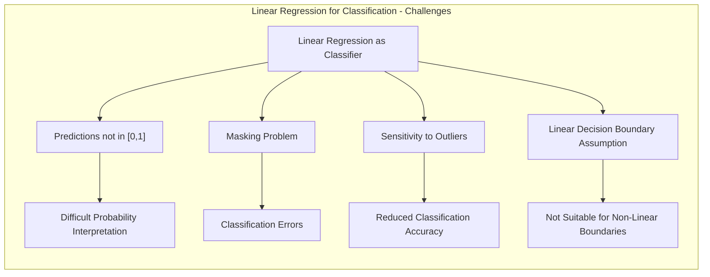

> 💡 **Exemplo Numérico:** Imagine que temos um problema de classificação com três classes (A, B, C) e duas variáveis preditoras $X_1$ e $X_2$. Codificamos as classes usando variáveis indicadoras (dummies). Por exemplo:
> - Classe A: $Y_A = [1, 0, 0]$
> - Classe B: $Y_B = [0, 1, 0]$
> - Classe C: $Y_C = [0, 0, 1]$
>
>  Para cada observação, teremos um vetor de probabilidades preditas para cada classe. Se uma observação tem o vetor predito $\hat{f}(x) = [0.2, 0.7, 0.1]$, a classe mais provável seria B, embora a regressão linear possa predizer valores negativos ou maiores que 1, o que não são probabilidades válidas. Além disso, se as classes não forem linearmente separáveis, a regressão linear terá dificuldade em construir um bom modelo.

> ❗ **Ponto de Atenção**: Métodos como a regressão logística são projetados especificamente para problemas de classificação e podem oferecer estimativas de probabilidade mais estáveis e melhor performance em relação à regressão linear em matriz de indicadores, conforme abordado em [^4.4].

##### Lemma 2

Em um problema de classificação com duas classes, a projeção dos dados no hiperplano de decisão gerado por regressão linear sobre matriz de indicadores é equivalente (em termos de ordem relativa de distância) à projeção obtida pela Análise Discriminante Linear (LDA), quando a matriz de covariância é assumida igual entre as classes. A diferença fundamental reside na interpretação da saída: enquanto a regressão linear tenta estimar probabilidades (com possíveis resultados fora do intervalo $[0,1]$), a LDA projeta as amostras em um eixo de decisão.  [^4.3] e [^4.2].
$$ \blacksquare $$

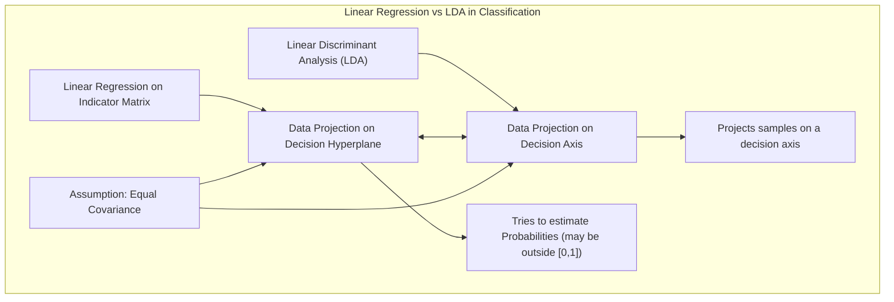

> 💡 **Exemplo Numérico**: Considere duas classes, com alguns pontos em 2 dimensões: Classe 1: $X_1 = [[1, 2], [1.5, 1.8], [1.2, 2.5]]$ e Classe 2: $X_2 = [[3, 4], [3.5, 3.8], [3.2, 4.5]]$. Se realizarmos uma regressão linear sobre uma matriz de indicadores $y=[0,0,0,1,1,1]$ e, depois, aplicarmos LDA, a projeção dos dados sobre o hiperplano de decisão resultante será a mesma em ambos os métodos. A diferença é que a regressão linear tentará produzir um vetor de probabilidades para a classe (que pode estar fora do intervalo [0,1]), enquanto LDA projeta os dados em um eixo de decisão para maximizar a separação entre as classes.

##### Corolário 2
Quando se busca a fronteira de decisão linear ótima e não as estimativas de probabilidades, a regressão em matriz de indicadores e a análise discriminante linear produzem resultados similares em termos de classificação e em muitos casos, a regressão linear pode ser suficiente. [^4.3].

### Métodos de Seleção de Variáveis e Regularização em Classificação

A seleção de variáveis e regularização são técnicas importantes em modelos de classificação, especialmente quando se trabalha com dados de alta dimensionalidade [^4.5]. A seleção de variáveis visa identificar e reter apenas as variáveis mais relevantes para a previsão, enquanto a regularização adiciona um termo de penalidade à função de custo do modelo para evitar overfitting e melhorar a generalização.

**Regularização L1 (Lasso):**
A regularização L1 adiciona uma penalidade proporcional à soma dos valores absolutos dos coeficientes.  Isso tende a forçar alguns coeficientes a exatamente zero, realizando implicitamente a seleção de variáveis e levando a modelos esparsos. No contexto da regressão logística, a função de custo com regularização L1 se torna:
$$ L(\beta) + \lambda \sum_{j=1}^p |\beta_j|$$
onde $L(\beta)$ é a função de log-verossimilhança da regressão logística e  $\lambda$ é o parâmetro de regularização, que controla a intensidade da penalidade.

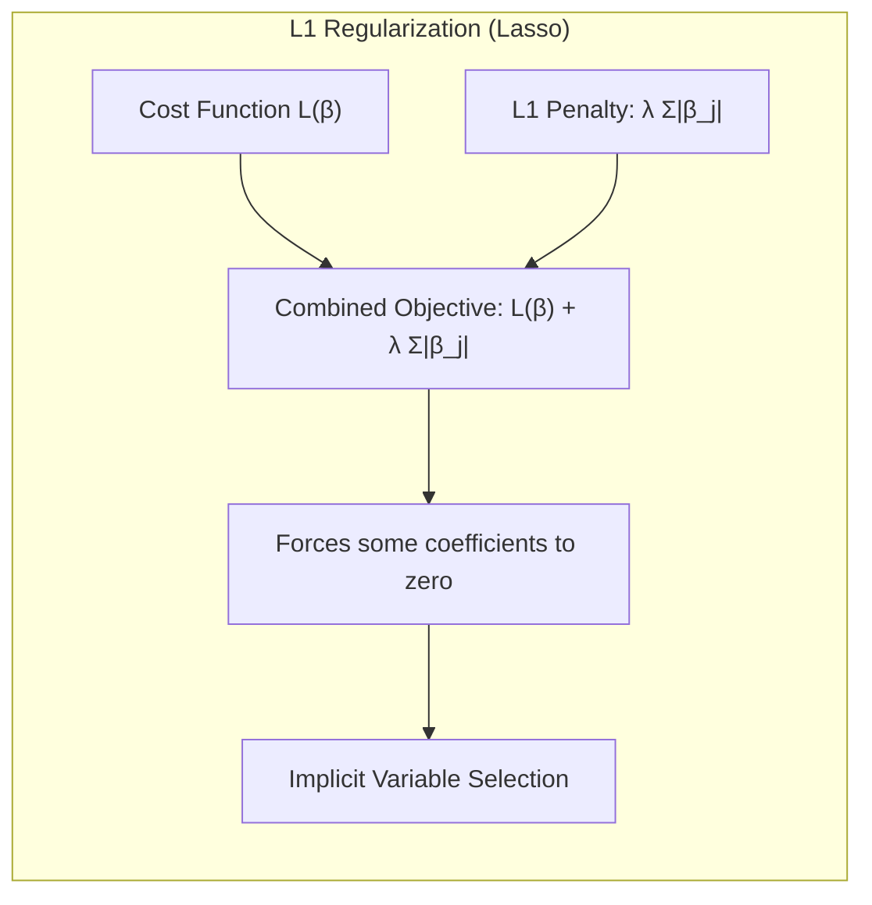

> 💡 **Exemplo Numérico:** Digamos que temos um modelo de regressão logística com 5 preditores e $\lambda = 0.5$. Após a otimização, com regularização L1 (Lasso), os coeficientes estimados poderiam ser: $\hat{\beta} = [0.8, 0, -0.3, 0, 1.2]$. Observe que os coeficientes $\beta_2$ e $\beta_4$ foram forçados a zero. Assim, apenas os preditores $X_1$, $X_3$, e $X_5$ seriam usados no modelo final, efetuando a seleção de variáveis.

**Regularização L2 (Ridge):**
A regularização L2 adiciona uma penalidade proporcional à soma dos quadrados dos coeficientes. Isso tende a encolher os coeficientes em direção a zero, mas geralmente não os força a ser exatamente zero, o que significa que a regularização L2 não realiza explicitamente a seleção de variáveis. No contexto da regressão logística, a função de custo com regularização L2 é:
$$ L(\beta) + \lambda \sum_{j=1}^p \beta_j^2$$

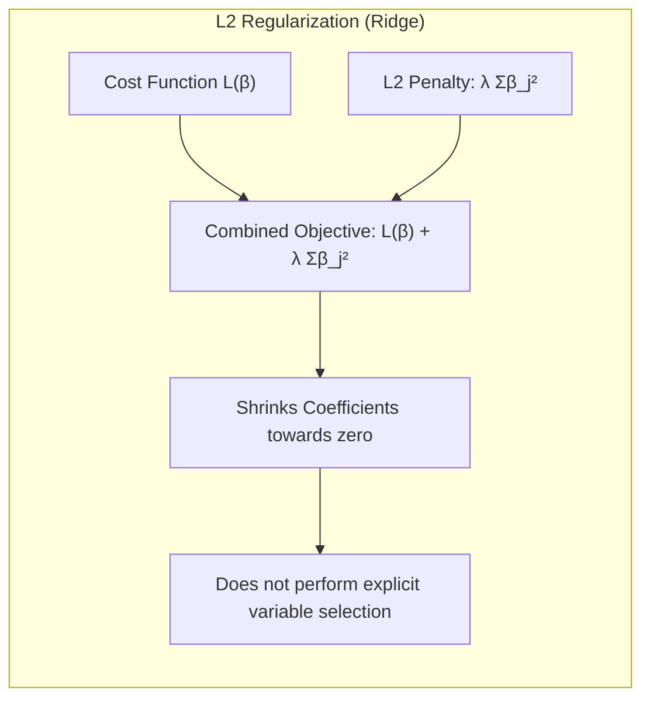

> 💡 **Exemplo Numérico:** Usando o mesmo exemplo anterior, com $\lambda = 0.5$, após a otimização com regularização L2 (Ridge), os coeficientes estimados poderiam ser: $\hat{\beta} = [0.5, 0.1, -0.2, 0.05, 0.9]$. Observe que os coeficientes foram reduzidos, mas nenhum deles foi forçado a zero. Isso significa que todos os preditores ainda estão no modelo, mas com menor peso.

**Regularização Elástica:**
Combina as penalidades L1 e L2 para aproveitar as vantagens de ambos os tipos de regularização:
$$ L(\beta) + \lambda \left( \alpha \sum_{j=1}^p |\beta_j| + (1-\alpha) \sum_{j=1}^p \beta_j^2\right) $$
onde $\alpha$ é um parâmetro que controla o equilíbrio entre as penalidades L1 e L2 [^4.5].

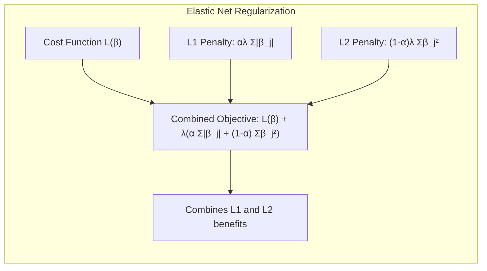

> 💡 **Exemplo Numérico:** Com $\lambda = 0.5$ e $\alpha = 0.5$, a regularização elástica com os mesmos dados pode gerar $\hat{\beta} = [0.6, 0, -0.1, 0.02, 1.0]$. A penalização elástica combina L1 e L2, tentando gerar esparsidade como o Lasso e ao mesmo tempo encolhendo os coeficientes como Ridge.

##### Lemma 3
A regularização L1 em classificação logística leva a coeficientes esparsos, porque a penalidade da norma L1 tem como característica uma "não-diferenciabilidade" na origem, o que provoca que otimizadores como o gradiente descendente encontrem soluções nas quais os coeficientes são exatamente 0, ao invés de simplesmente próximos de zero. [^4.4.4]
$$ \blacksquare $$

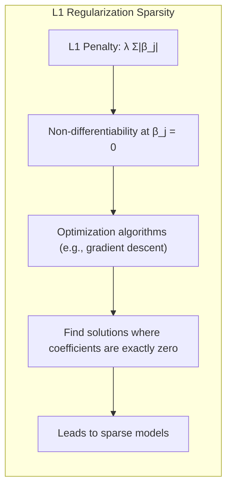

##### Prova do Lemma 3

A função de custo da regressão logística com penalização L1 é:
$$ - \sum_{i=1}^{n} \left( y_i \log(p_i) + (1-y_i) \log(1-p_i) \right) + \lambda \sum_{j=1}^p |\beta_j| $$
onde $p_i$ é a probabilidade estimada para a amostra $i$. A parte que corresponde à penalidade da norma L1, $\lambda \sum_{j=1}^p |\beta_j|$, é diferenciável em todos os pontos exceto em $\beta_j = 0$. No ponto onde $\beta_j = 0$, essa função tem uma quina. A importância dessa quina se dá na derivação do gradiente da função de custo, onde os coeficientes não-nulos são penalizados linearmente com o fator $\lambda$ ao passo que coeficientes já nulos não mudam o valor da função quando se movem da origem. Portanto, o algoritmo de otimização tenderá a atingir pontos onde parte das componentes do vetor de coeficientes é exatamente 0, o que gera esparsidade. [^4.4.4].
$$ \blacksquare $$
##### Corolário 3
A esparsidade induzida pela regularização L1 leva a modelos mais interpretáveis, pois apenas os preditores mais relevantes são retidos.  No contexto da regressão logística, a regularização L1 pode simplificar o modelo, reduzindo o número de parâmetros a serem estimados e, consequentemente, diminuindo o risco de overfitting, e ao mesmo tempo melhorando a interpretabilidade. [^4.4.5]

> ⚠️ **Ponto Crucial**: A regularização não apenas reduz a variância dos coeficientes, mas também pode melhorar a precisão de modelos de classificação, especialmente em conjuntos de dados de alta dimensionalidade, ao controlar a complexidade do modelo. [^4.5]

### Separating Hyperplanes e Perceptrons

O conceito de **Separating Hyperplanes** é fundamental em problemas de classificação linear [^4.5.2]. Em um problema com duas classes, um hiperplano separador é uma superfície linear que divide o espaço de entrada em duas regiões, correspondendo às duas classes. O objetivo é encontrar o hiperplano que melhor separe as classes, ou seja, que maximize a margem de separação (a distância entre o hiperplano e os pontos mais próximos de cada classe).

A formulação do problema de otimização para encontrar o hiperplano separador envolve a maximização da margem sujeita a restrições de que todos os pontos de treinamento estejam corretamente classificados [^4.5.2]. Este problema pode ser resolvido usando técnicas de programação quadrática. No dual de Wolfe, a solução é expressa em termos de uma combinação linear dos pontos de suporte (pontos de treinamento mais próximos do hiperplano) [^4.5.2].
A formulação matemática do problema pode ser descrita da seguinte maneira:
Minimizar:
$$ \frac{1}{2} ||w||^2 $$
sujeito a:
$$ y_i (w^T x_i + b) \geq 1 $$, para todo $i = 1, \ldots, N$
onde:
* $w$ é o vetor normal ao hiperplano,
* $b$ é o bias, que define o deslocamento do hiperplano em relação à origem,
* $x_i$ são as observações,
* $y_i$ é a etiqueta da classe (1 ou -1).

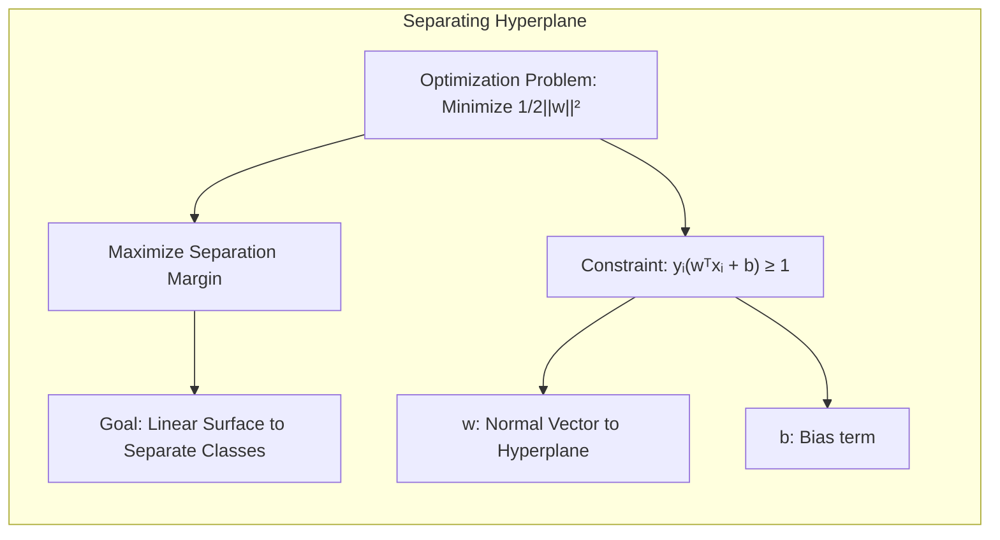

O **Perceptron** é um algoritmo de aprendizado que busca encontrar um hiperplano separador [^4.5.1]. Ele opera de forma iterativa, ajustando o hiperplano com base nos erros de classificação observados nos pontos de treinamento. O Perceptron atualiza os coeficientes sempre que encontra uma observação classificada incorretamente, movendo o hiperplano de forma a corrigir o erro.

> 💡 **Exemplo Numérico:** Imagine duas classes em 2D, Classe 1 = [(1,1), (2,1), (1,2)] e Classe 2 = [(3,3), (4,3), (3,4)]. As etiquetas seriam $y = [-1,-1,-1, 1,1,1]$. Inicializamos $w = [0.1, 0.2