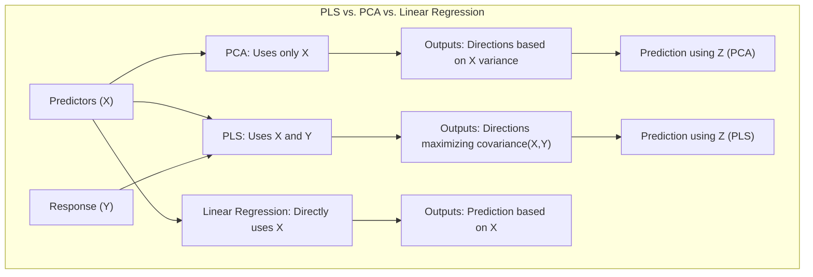
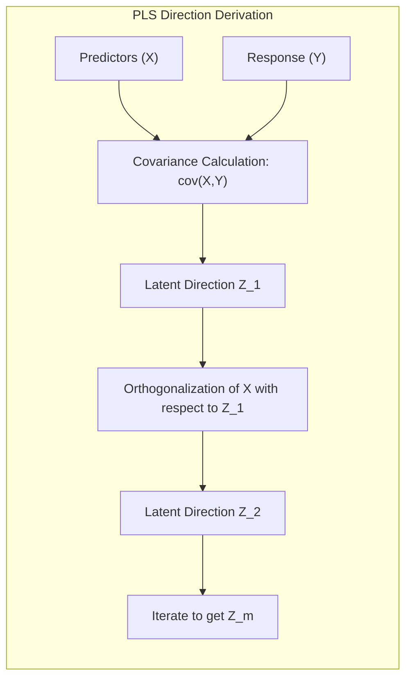
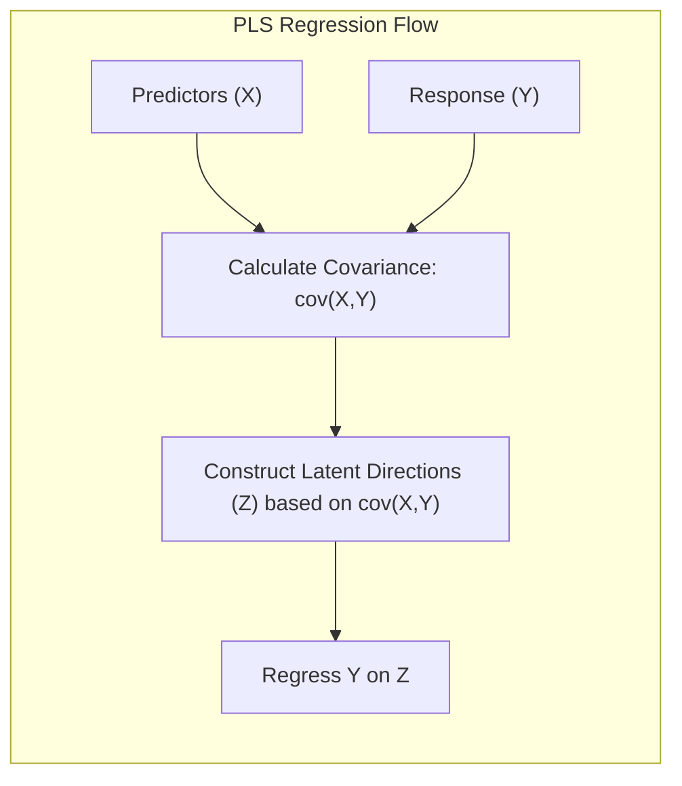
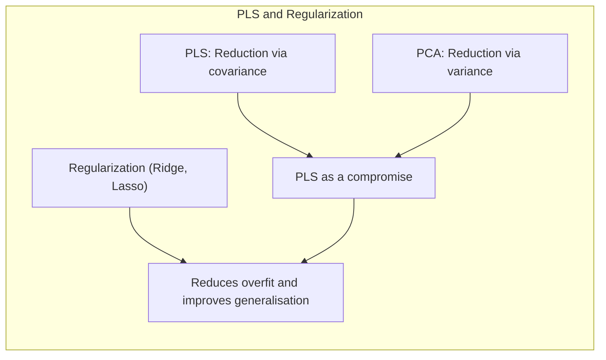
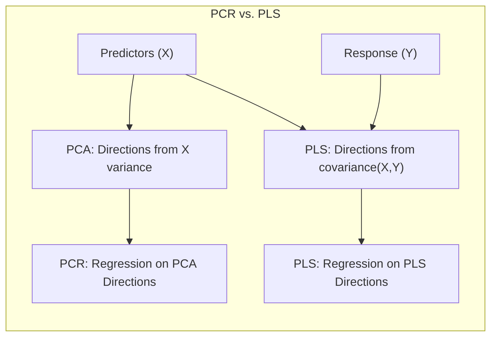

## Partial Least Squares (PLS): Constructing Inputs Based on Response and Predictors



### Introdução

Neste capítulo, abordamos uma variedade de métodos para lidar com problemas de regressão envolvendo um grande número de preditores, frequentemente correlacionados. O Partial Least Squares (PLS) destaca-se como uma técnica que, diferentemente do PCA, utiliza informações tanto dos preditores ($X$) quanto da resposta ($Y$) para construir direções que maximizem a variância e a correlação, visando otimizar a predição [^3.5]. O PLS é particularmente útil em cenários onde a resposta está fortemente relacionada aos preditores, oferecendo uma alternativa eficaz à regressão linear tradicional e ao PCA.

### Conceitos Fundamentais

**Conceito 1: A Necessidade de Derivar Inputs em Problemas de Alta Dimensionalidade**

Em problemas de regressão com um número elevado de preditores (alta dimensionalidade), os métodos tradicionais de regressão linear podem apresentar desafios devido à multicolinearidade e à alta variância das estimativas dos parâmetros. Nesses cenários, torna-se vantajoso derivar um conjunto reduzido de novas variáveis (inputs) que capturem a maior parte da informação relevante para prever a resposta [^3.5].

**Lemma 1:** *A multicolinearidade nos preditores ($X$) leva à instabilidade e alta variância nas estimativas dos parâmetros de modelos de regressão linear*. Este lemma destaca a motivação para a necessidade de técnicas como o PLS, que visam reduzir a dimensionalidade e mitigar tais problemas, utilizando uma combinação de informações dos preditores e da resposta [^3.5.2].

> 💡 **Exemplo Numérico:**
>
> Imagine um cenário de regressão com 10 preditores ($x_1, x_2, ..., x_{10}$), onde $x_1$ e $x_2$ são altamente correlacionados (por exemplo, correlação de 0.95). A matriz de correlação dos preditores ($X^TX$) terá elementos fora da diagonal significativamente grandes, indicando multicolinearidade. Em uma regressão linear, a matriz $(X^TX)^{-1}$ terá valores muito grandes, amplificando o ruído e levando a coeficientes $\beta$ instáveis e com alta variância. O PLS tenta resolver isso construindo combinações lineares dos preditores que minimizam essa instabilidade.
>
> ```python
> import numpy as np
> import pandas as pd
> from sklearn.linear_model import LinearRegression
>
> # Simulação de dados com multicolinearidade
> np.random.seed(42)
> n_samples = 100
> X = np.random.rand(n_samples, 10)
> X[:, 1] = 0.95 * X[:, 0] + 0.05 * np.random.rand(n_samples)  # x1 e x2 correlacionados
> y = 2 * X[:, 0] + 3 * X[:, 3] + np.random.randn(n_samples)
>
> # Regressão linear padrão
> model = LinearRegression()
> model.fit(X, y)
> print(f"Coeficientes da regressão linear: {model.coef_}")
> # Coeficientes podem ser instáveis e grandes devido à multicolinearidade
>
> # O PLS tenta gerar novas features que minimizem essa instabilidade
> # (o código para PLS será mostrado em exemplos posteriores)
> ```
>
> Este exemplo mostra como a multicolinearidade pode afetar os coeficientes de um modelo de regressão linear, justificando a necessidade de métodos como o PLS.

**Conceito 2: Derivação de Direções em PLS**

O PLS constrói um conjunto de direções latentes ($Z_m$), que são combinações lineares dos preditores originais ($X$), com o objetivo de maximizar a covariância entre as direções e a resposta ($Y$). O processo é iterativo, onde as direções subsequentes ($Z_2, Z_3,...$) são construídas de forma ortogonal às anteriores [^3.5.2]. Essa abordagem contrasta com o PCA, que se concentra apenas na variabilidade dos preditores, sem considerar a relação com a resposta [^3.5.1].



**Corolário 1:** *A maximização da covariância entre as direções latentes ($Z_m$) e a resposta ($Y$) garante que o PLS capture as direções mais relevantes para a predição, levando a um modelo mais parcimonioso e com maior poder preditivo*. Esse resultado é essencial para justificar o uso do PLS em comparação com métodos que ignoram a relação entre preditores e resposta.

> 💡 **Exemplo Numérico:**
>
> Suponha que temos dois preditores, $x_1$ e $x_2$, e uma resposta $y$. No PLS, a primeira direção latente $z_1$ será construída de forma que a covariância entre $z_1$ e $y$ seja maximizada. Se $x_1$ tem uma forte relação com $y$, enquanto $x_2$ não, o PLS dará um peso maior a $x_1$ na formação de $z_1$. Em contraste, o PCA criaria direções baseadas apenas na variância de $x_1$ e $x_2$, sem considerar a relação com $y$.
>
> ```python
> import numpy as np
> import matplotlib.pyplot as plt
> from sklearn.decomposition import PCA
> from sklearn.cross_decomposition import PLSRegression
>
> # Dados simulados
> np.random.seed(42)
> n_samples = 100
> x1 = np.random.rand(n_samples)
> x2 = 0.2 * x1 + 0.8 * np.random.rand(n_samples) # x2 correlacionado fracamente com x1
> y = 3 * x1 + 0.1 * np.random.randn(n_samples)
> X = np.column_stack((x1, x2))
>
> # PLS
> pls = PLSRegression(n_components=1)
> pls.fit(X, y)
> z_pls = pls.transform(X)
>
> # PCA
> pca = PCA(n_components=1)
> pca.fit(X)
> z_pca = pca.transform(X)
>
> # Plot
> plt.figure(figsize=(10, 5))
> plt.subplot(1, 2, 1)
> plt.scatter(z_pls, y, label='PLS')
> plt.xlabel('z_pls')
> plt.ylabel('y')
> plt.title('PLS: z1 vs y')
>
> plt.subplot(1, 2, 2)
> plt.scatter(z_pca, y, label='PCA')
> plt.xlabel('z_pca')
> plt.ylabel('y')
> plt.title('PCA: z1 vs y')
> plt.legend()
> plt.tight_layout()
> plt.show()
>
> # PLS maximiza a relação entre z1 e y, PCA maximiza a variância em x
> # Ao analisar os gráficos, nota-se que a relação entre z_pls e y é mais evidente que entre z_pca e y
> ```
>
> O código acima ilustra como a direção latente gerada pelo PLS ($z_{pls}$) está mais correlacionada com a resposta $y$ do que a direção gerada pelo PCA ($z_{pca}$).

**Conceito 3: Processo Iterativo do PLS**

O PLS realiza uma série de etapas para construir as direções latentes, conforme descrito em [^3.5.2] e detalhado no Algoritmo 3.3. Primeiro, computa-se a covariância entre cada preditor ($x_j$) e a resposta ($y$). Em seguida, a primeira direção latente ($z_1$) é criada como uma combinação linear dos preditores, ponderada pelas covariâncias. Subsequentemente, a resposta é regredida em $z_1$, e os preditores são ortogonalizados em relação a $z_1$, preparando o caminho para a próxima iteração.

### Regressão com Partial Least Squares (PLS)



O PLS aborda o desafio da alta dimensionalidade e da multicolinearidade derivando novas variáveis (direções) que são construídas utilizando informações tanto dos preditores quanto da resposta. Cada direção $z_m$ é uma combinação linear dos preditores originais $x_j$, e o processo de derivação é projetado para maximizar a covariância entre as direções e a resposta [^3.5.2].

**Lemma 2:** *A escolha dos pesos na combinação linear dos preditores, para formar as direções latentes, é guiada pela relação com a resposta ($Y$)*. Diferentemente do PCA, que constrói direções apenas com base na variação dos preditores, o PLS pondera os preditores de forma a maximizar a covariância com a resposta, resultando em direções que são mais relevantes para a predição [^3.5.2].

**Prova do Lemma 2:** O PLS inicia calculando a covariância entre cada preditor $x_j$ e a resposta $y$, denotada por $\phi_{mj} = (x_j,y)$ (onde $(.,.)$ representa o produto interno). Esses valores são então usados para formar a primeira direção latente $z_1$, como $z_1 = \sum_j \phi_{1j}x_j$. Esta ponderação garante que os preditores mais correlacionados com a resposta tenham maior peso na formação da direção latente. A cada iteração $m$, as covariâncias são calculadas novamente e um processo similar é executado para cada direção, assegurando que as direções são construídas tendo como objetivo maximizar a covariância com a resposta. $\blacksquare$

> 💡 **Exemplo Numérico:**
>
> Vamos considerar um exemplo simplificado com 3 preditores ($x_1, x_2, x_3$) e uma resposta $y$. Suponha que após centralizar as variáveis temos as seguintes covariâncias com a resposta:
>
> $\phi_{11} = \text{cov}(x_1, y) = 0.8$
> $\phi_{12} = \text{cov}(x_2, y) = 0.2$
> $\phi_{13} = \text{cov}(x_3, y) = 0.5$
>
> A primeira direção latente $z_1$ seria calculada como:
>
> $z_1 = 0.8x_1 + 0.2x_2 + 0.5x_3$
>
> Note que o preditor $x_1$, que tem a maior covariância com $y$, tem o maior peso na formação de $z_1$.
>
> ```python
> import numpy as np
> from sklearn.cross_decomposition import PLSRegression
>
> # Simulação de dados
> np.random.seed(42)
> n_samples = 100
> X = np.random.rand(n_samples, 3)
> y = 0.8 * X[:, 0] + 0.2 * X[:, 1] + 0.5 * X[:, 2] + 0.1* np.random.randn(n_samples)
>
> # PLS com 1 componente
> pls = PLSRegression(n_components=1)
> pls.fit(X, y)
>
> # Coeficientes dos preditores na 1ª direção latente
> weights = pls.x_weights_
> print(f"Pesos dos preditores em z1: {weights}")
> # Os pesos refletem as covariâncias com a resposta (apesar de estarem normalizados)
>
> # As direções latentes são construídas com base nos pesos e nos preditores
> z1 = pls.transform(X)
> # O modelo PLS, nesse caso, usa apenas z1 para prever y
> y_pred_pls = pls.predict(X)
>
> # O resultado demonstra como os preditores são combinados para construir as direções latentes.
> ```

**Corolário 2:** *No caso especial em que os preditores ($X$) são ortogonais, o PLS reduz-se à regressão linear padrão*. Este corolário ressalta a natureza geral do PLS e sua capacidade de lidar com casos especiais em que os preditores não são correlacionados. Quando os preditores são ortogonais, as direções latentes geradas pelo PLS se tornam equivalentes aos preditores originais, e o processo de regressão é idêntico ao da regressão linear.

**Implicações e Limitações:** Embora o PLS utilize informações da resposta para derivar as direções, este processo pode levar a um modelo de regressão mais complexo, uma vez que cada nova direção $z_m$ é uma combinação de todos os preditores originais. Em situações onde os preditores são mais importantes na predição, outros métodos de seleção e regularização (como discutidos em [^3.3] e [^3.4]) podem ser mais apropriados.

### Métodos de Seleção de Variáveis e Regularização em PLS



Assim como em outros métodos de regressão, o PLS pode se beneficiar de técnicas de seleção de variáveis e regularização para evitar overfitting e melhorar a generalização do modelo. Embora o próprio PLS realize uma redução de dimensionalidade, a aplicação conjunta com regularização pode aumentar a estabilidade e a interpretabilidade dos resultados.

**Lemma 3:** *A inclusão de termos de penalização (como em Ridge ou Lasso) no PLS pode levar a um modelo mais estável e com melhor desempenho em dados de teste*. Por exemplo, a combinação do PLS com regularização L1 (Lasso) pode realizar a seleção de variáveis em conjunto com a derivação das direções latentes, resultando em um modelo mais parcimonioso e robusto. Isso combina os benefícios da redução de dimensionalidade com a seleção de variáveis relevantes para a predição [^3.4.1] e [^3.4.2].

**Prova do Lemma 3:** A regularização em PLS pode ser implementada diretamente na função de custo do modelo, introduzindo termos de penalização que controlam a magnitude dos coeficientes da regressão ou a complexidade do modelo. Por exemplo, a penalização Ridge pode ser implementada adicionando ao custo do modelo um termo proporcional à soma dos quadrados dos coeficientes das direções latentes ($z_m$), similar ao descrito em (3.41). Este termo de penalização restringe a complexidade do modelo, prevenindo overfitting, e pode levar a melhorias de desempenho em dados de teste [^3.4.1]. A penalização L1 (Lasso) pode ser introduzida de forma análoga, resultando em um modelo com maior esparsidade. $\blacksquare$

> 💡 **Exemplo Numérico:**
>
> Considere um cenário onde, após aplicar o PLS, obtemos as direções latentes ($z_1, z_2$) e os correspondentes coeficientes de regressão ($\beta_1, \beta_2$). Em um PLS padrão, o modelo de regressão seria:
>
> $\hat{y} = \beta_0 + \beta_1z_1 + \beta_2z_2$
>
> Para regularização Ridge, adicionamos um termo de penalização aos coeficientes:
>
> $\text{Custo} = \sum_{i=1}^n(y_i - \hat{y}_i)^2 + \lambda(\beta_1^2 + \beta_2^2)$
>
> Onde $\lambda$ é o parâmetro de regularização. Um valor maior de $\lambda$ irá encolher os coeficientes ($\beta_1$ e $\beta_2$), prevenindo overfitting.
>
> ```python
> import numpy as np
> from sklearn.linear_model import Ridge
> from sklearn.cross_decomposition import PLSRegression
> from sklearn.model_selection import train_test_split
> from sklearn.metrics import mean_squared_error
>
> # Simulação de dados com ruído e alta dimensão
> np.random.seed(42)
> n_samples = 100
> n_features = 20
> X = np.random.rand(n_samples, n_features)
> y = 2 * X[:, 0] - 3 * X[:, 5] + np.random.randn(n_samples)
>
> # Divide em treino e teste
> X_train, X_test, y_train, y_test = train_test_split(X, y, test_size=0.2, random_state=42)
>
> # PLS com 2 componentes
> pls = PLSRegression(n_components=2)
> pls.fit(X_train, y_train)
> y_pred_pls = pls.predict(X_test)
> mse_pls = mean_squared_error(y_test, y_pred_pls)
> print(f"MSE do PLS: {mse_pls}")
>
> # PLS com Ridge regularization
> Z_train = pls.transform(X_train)
> Z_test = pls.transform(X_test)
>
> ridge = Ridge(alpha=0.5)  # Regularização Ridge com lambda=0.5
> ridge.fit(Z_train, y_train)
> y_pred_ridge = ridge.predict(Z_test)
> mse_ridge = mean_squared_error(y_test, y_pred_ridge)
> print(f"MSE do PLS com Ridge: {mse_ridge}")
> # Em muitos casos, o MSE com regularização é menor.
>
> # A regularização é particularmente útil para evitar overfitting
> ```

**Corolário 3:** *A combinação do PLS com métodos de seleção de variáveis, como o forward stepwise, pode ser utilizada para selecionar um subconjunto de direções latentes que capture a maior parte da informação preditiva*. A inclusão de métodos de seleção de variáveis ao PLS permite a escolha de um número menor de direções latentes, melhorando a interpretabilidade e reduzindo o risco de overfitting.

> ⚠️ **Ponto Crucial:** A seleção de um número apropriado de direções latentes é crucial para o desempenho do PLS, e é tipicamente determinada por técnicas de validação cruzada ou outros critérios de seleção de modelos [^3.3.1].

> ❗ **Ponto de Atenção:** Embora o PLS possa ser implementado iterativamente (Algoritmo 3.3), uma implementação matricial é possível, o que torna mais eficiente a combinação com métodos de regularização e seleção de variáveis [^3.5.2].

### Comparação com Principal Component Regression (PCR)

O Principal Component Regression (PCR) é uma técnica similar ao PLS, que também utiliza direções latentes derivadas a partir dos preditores originais. No entanto, o PCR constrói as direções utilizando apenas a variância dos preditores, ignorando a resposta, diferentemente do PLS. Como resultado, as direções do PCR podem não ser as mais relevantes para a predição [^3.5.1].

**Pergunta Teórica Avançada:** Quais são as condições em que PCR e PLS levam às mesmas direções?

**Resposta:** As direções do PCR e do PLS serão similares quando a resposta ($Y$) estiver fortemente correlacionada com as direções de maior variância dos preditores ($X$). Nesses casos, as direções que maximizam a variância também serão as que maximizam a covariância com a resposta.

**Lemma 4:** *O PCR é equivalente ao PLS quando a resposta ($Y$) é uma combinação linear das direções principais com maior variância nos preditores ($X$)*. Essa equivalência surge quando as direções que melhor descrevem a variância dos preditores também são as mais relevantes para explicar a resposta.

**Prova do Lemma 4:** O PCR cria as direções latentes usando a decomposição espectral da matriz de covariância dos preditores ($X^TX$). As direções são definidas pelos autovetores da matriz de covariância, que correspondem aos componentes principais dos preditores. Quando a resposta ($Y$) é uma combinação linear destes componentes principais, o PLS, que considera as relações entre preditores e resposta, chega às mesmas direções que o PCR. $\blacksquare$

> 💡 **Exemplo Numérico:**
>
> Imagine que os preditores ($X$) são construídos de forma que a primeira componente principal (PC1) seja fortemente correlacionada com a resposta ($Y$). Tanto o PCR quanto o PLS darão maior importância a essa primeira componente na regressão. No entanto, se $Y$ também tiver alguma relação com a segunda componente principal (PC2), mas de maneira diferente da variância dos preditores, o PLS ajustará os pesos de forma a capturar melhor essa relação, enquanto o PCR ainda dará maior importância à PC1, mesmo que PC2 tenha uma relação mais forte com Y.
>
> ```python
> import numpy as np
> import matplotlib.pyplot as plt
> from sklearn.decomposition import PCA
> from sklearn.cross_decomposition import PLSRegression
> from sklearn.linear_model import LinearRegression
> from sklearn.metrics import mean_squared_error
> from sklearn.model_selection import train_test_split
>
> # Simulação de dados
> np.random.seed(42)
> n_samples = 100
> X = np.random.rand(n_samples, 3)
>
> # Componentes principais (PC1 e PC2)
> pc1 = 2 * X[:, 0] + 1 * X[:, 1] + 0.5 * X[:,2]
> pc2 = -1 * X[:, 0] + 2 * X[:, 1] + 1 * X[:,2]
> y = 0.8 * pc1 + 0.2 * pc2 + 0.1* np.random.randn(n_samples)
> X = np.column_stack((X[:,0], X[:,1], X[:,2])) # Retorna X para formato original
>
> X_train, X_test, y_train, y_test = train_test_split(X,y, test_size=0.2, random_state=42)
>
> # PCR
> pca = PCA(n_components=2)
> pca.fit(X_train)
> Z_pca_train = pca.transform(X_train)
> Z_pca_test = pca.transform(X_test)
>
> pcr_model = LinearRegression()
> pcr_model.fit(Z_pca_train, y_train)
> y_pred_pcr = pcr_model.predict(Z_pca_test)
> mse_pcr = mean_squared_error(y_test, y_pred_pcr)
>
> # PLS
> pls = PLSRegression(n_components=2)
> pls.fit(X_train, y_train)
> y_pred_pls = pls.predict(X_test)
> mse_pls = mean_squared_error(y_test, y_pred_pls)
>
> print(f"MSE do PCR: {mse_pcr}")
> print(f"MSE do PLS: {mse_pls}")
>
> # Os resultados mostram que PLS pode ter um erro menor nesse caso específico,
> # pois considera a relação de y com as componentes, e não apenas a variância
>
> plt.figure(figsize=(12,5))
> plt.subplot(1,2,1)
> plt.scatter(y_test, y_pred_pcr, label=f'PCR - MSE: {mse_pcr:.2f}')
> plt.xlabel('Valor real')
> plt.ylabel('Valor predito')
> plt.title('PCR - Predições')
> plt.legend()
>
> plt.subplot(1,2,2)
> plt.scatter(y_test, y_pred_pls, label=f'PLS - MSE: {mse_pls:.2f}')
> plt.xlabel('Valor real')
> plt.ylabel('Valor predito')
> plt.title('PLS - Predições')
> plt.legend()
> plt.tight_layout()
> plt.show()
> ```
>
> Este exemplo simula dados onde a resposta ($y$) depende tanto da primeira quanto da segunda componentes principais dos preditores ($X$). O PLS demonstra um erro quadrático médio menor do que o PCR, evidenciando a vantagem de usar a informação da resposta na construção das direções latentes.



**Corolário 4:** *O PLS geralmente supera o PCR quando a resposta ($Y$) não está perfeitamente alinhada com as direções de maior variância dos preditores ($X$)*. Nesses casos, o PLS, ao maximizar a covariância entre direções e resposta, captura as relações mais relevantes para a predição, enquanto o PCR se concentra na variância dos preditores, independentemente de sua relação com a resposta.

> ✔️ **Destaque:** A escolha entre PLS e PCR depende da natureza dos dados e da relação entre preditores e resposta. O PLS tende a ser mais robusto quando a resposta está linearmente relacionada com os preditores, enquanto o PCR pode ser mais adequado quando a resposta é influenciada por direções que não são as mais relevantes em termos de variação dos preditores.

### Conclusão

O PLS apresenta uma abordagem eficaz para problemas de regressão com muitos preditores, especialmente quando esses são altamente correlacionados. Sua capacidade de utilizar informações tanto dos preditores quanto da resposta na construção das direções latentes permite que o modelo capture as relações mais relevantes para a predição. No entanto, a aplicação de métodos de seleção de variáveis e regularização pode ser necessária para otimizar a performance e a interpretabilidade do modelo. O PLS se destaca como uma alternativa ao PCA, especialmente quando a resposta está fortemente relacionada aos preditores, mostrando-se um importante método no arsenal de modelos de aprendizado estatístico para regressão.
<!-- END DOCUMENT -->
[^3.5]: "In many situations we have a large number of inputs, often very correlated. The methods in this section produce a small number of linear combinations $Z_m$, $m = 1, \ldots, M$ of the original inputs $X_j$, and the $Z_m$ are then used in place of the $X_j$ as inputs in the regression. The methods differ in how the linear combinations are constructed." *(Trecho de <Nome do Documento>)*
[^3.5.1]: "In this approach the linear combinations $Z_m$ used are the principal components as defined in Section 3.4.1 above. Principal component regression forms the derived input columns $z_m = X u_m$, and then regresses $y$ on $Z_1, Z_2, \ldots, Z_M$ for some $M < p$. Since the $z_m$ are orthogonal, this regression is just a sum of univariate regressions: ..." *(Trecho de <Nome do Documento>)*
[^3.5.2]: "This technique also constructs a set of linear combinations of the inputs for regression, but unlike principal components regression it uses $y$ (in addition to $X$) for this construction. Like principal component regression, partial least squares (PLS) is not scale invariant, so we assume that each $x_j$ is standardized to have mean 0 and variance 1. PLS begins by computing $\phi_{1j} = (x_j,y)$ for each $j$. From this we construct the derived input $z_1 = \sum_j \phi_{1j}x_j$, which is the first partial least squares direction. Hence in the construction of each $z_m$, the inputs are weighted by the strength of their univariate effect on $y$. The outcome $y$ is regressed on $z_1$ giving coefficient $\theta_1$, and then we orthogonalize $x_1,\ldots,x_p$ with respect to $z_1$. We continue this process, until $M < p$ directions have been obtained. In this manner, partial least squares produces a sequence of derived, orthogonal inputs or directions $z_1,z_2,\ldots,z_M$. As with principal-component regression, if we were to construct all $M = p$ directions, we would get back a solution equivalent to the usual least squares estimates; using $M < p$ directions produces a reduced regression. The procedure is described fully in Algorithm 3.3." *(Trecho de <Nome do Documento>)*
[^3.3]: "In this section we describe a number of approaches to variable subset selection with linear regression. In later sections we discuss shrinkage and hybrid approaches for controlling variance, as well as other dimension-reduction strategies. These all fall under the general heading model selection. Model selection is not restricted to linear models; Chapter 7 covers this topic in some detail." *(Trecho de <Nome do Documento>)*
[^3.4]: "By retaining a subset of the predictors and discarding the rest, subset selection produces a model that is interpretable and has possibly lower prediction error than the full model. However, because it is a discrete process— variables are either retained or discarded—it often exhibits high variance, and so doesn't reduce the prediction error of the full model. Shrinkage methods are more continuous, and don't suffer as much from high variability." *(Trecho de <Nome do Documento>)*
[^3.4.1]: "Ridge regression shrinks the regression coefficients by imposing a penalty on their size. The ridge coefficients minimize a penalized residual sum of squares,..." *(Trecho de <Nome do Documento>)*
[^3.4.2]: "The lasso is a shrinkage method like ridge, with subtle but important differences. The lasso estimate is defined by ..." *(Trecho de <Nome do Documento>)*
[^3.3.1]: "Best subset regression finds for each $k \in \{0,1, 2, \ldots, p\}$ the subset of size $k$ that gives smallest residual sum of squares (3.2). An efficient algorithm— the leaps and bounds procedure (Furnival and Wilson, 1974)—makes this feasible for $p$ as large as 30 or 40. Figure 3.5 shows all the subset models for the prostate cancer example. The lower boundary represents the models that are eligible for selection by the best-subsets approach. Note that the best subset of size 2, for example, need not include the variable that was in the best subset of size 1 (for this example all the subsets are nested). The best-subset curve (red lower boundary in Figure 3.5) is necessarily decreasing, so cannot be used to select the subset size $k$. The question of how to choose $k$ involves the tradeoff between bias and variance, along with the more subjective desire for parsimony. There are a number of criteria that one may use; typically we choose the smallest model that minimizes an estimate of the expected prediction error." *(Trecho de <Nome do Documento>)*
