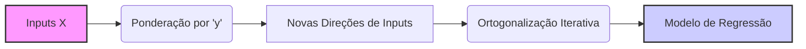
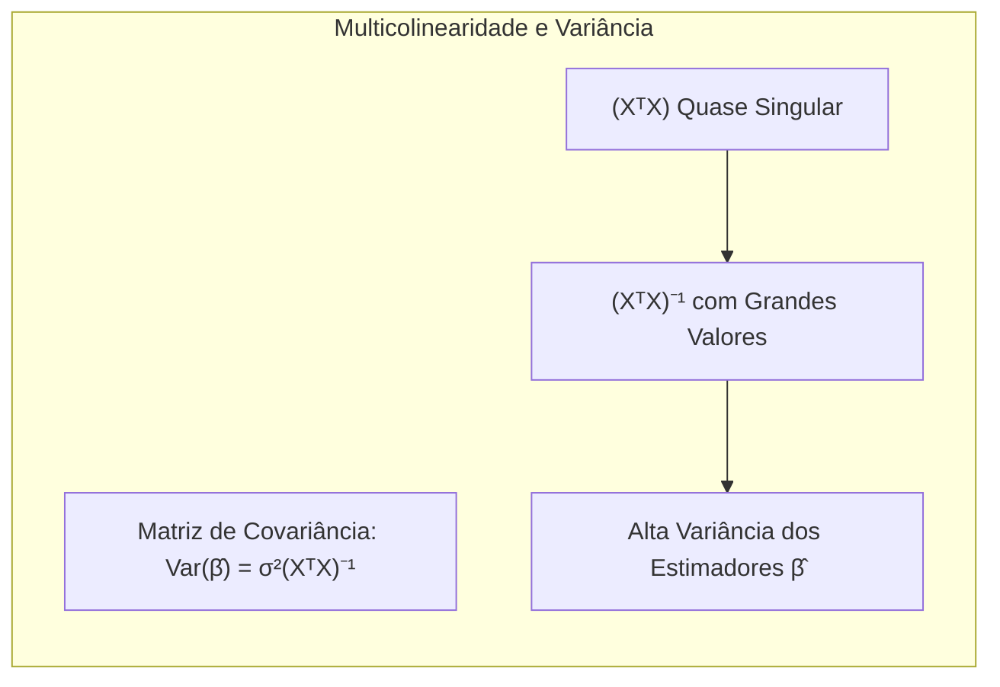
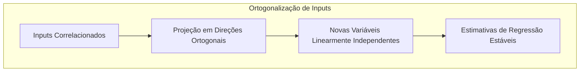
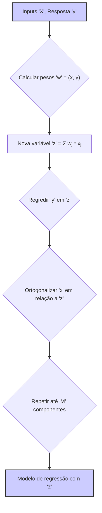
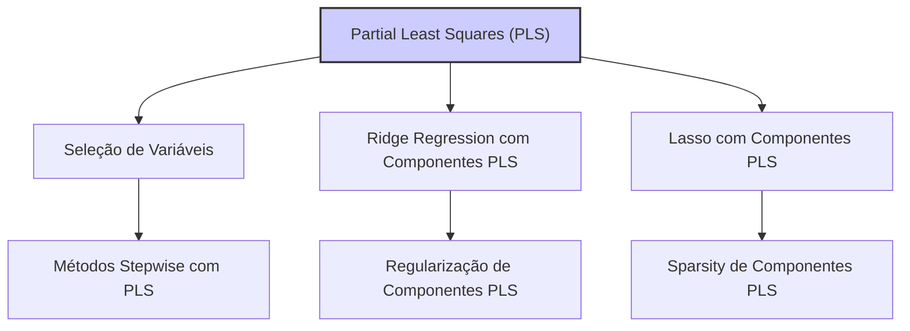
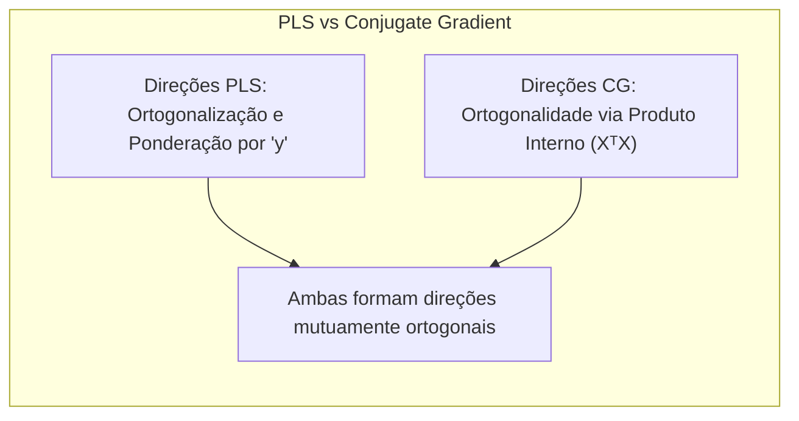
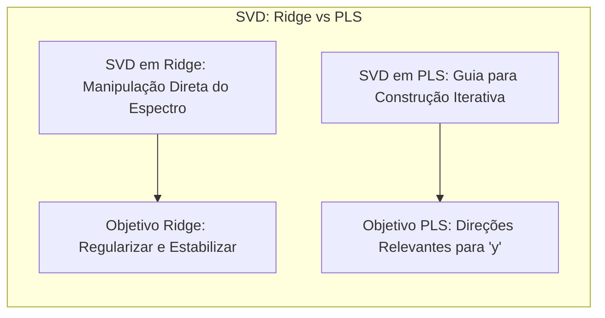

## Métodos Lineares para Regressão com Inputs Ponderados por y e Ortogonalização Iterativa



**Introdução**
Este capítulo explora métodos lineares avançados para regressão, com foco particular em técnicas que utilizam a variável de resposta *y* para ponderar inputs e empregam ortogonalização iterativa. Essas abordagens são cruciais quando se lida com um grande número de *inputs* que são altamente correlacionados, uma situação comum em muitas aplicações estatísticas e de aprendizado de máquina [^4.1]. A compreensão desses métodos é essencial para construir modelos preditivos robustos e interpretáveis, especialmente em cenários de alta dimensionalidade e dados complexos. Em particular, detalharemos o funcionamento do Partial Least Squares (PLS), comparando-o com outras abordagens como a Principal Component Regression (PCR) e a regressão linear clássica.

### Conceitos Fundamentais
**Conceito 1:** O problema da multicolinearidade e a necessidade de técnicas de redução de dimensionalidade.
A regressão linear tradicional assume que os inputs $X_1, \ldots, X_p$ são independentes e que o modelo $E(Y|X)$ é linear nesses inputs [^4.1]. No entanto, na prática, frequentemente encontramos inputs que são altamente correlacionados, levando ao problema da multicolinearidade. Isso resulta em estimativas instáveis e com alta variância dos parâmetros $\beta_j$. Portanto, faz-se necessário o uso de técnicas que reduzam a dimensionalidade dos dados ou regularizem os parâmetros para mitigar esses efeitos [^4.2].
**Lemma 1:** A regressão linear padrão, quando aplicada em presença de multicolinearidade, gera estimativas dos coeficientes com grande variância. Isso pode ser comprovado através da análise da matriz de covariância dos coeficientes $\text{Var}(\hat{\beta}) = \sigma^2(X^T X)^{-1}$, onde a inversão de $(X^T X)$ se torna numericamente instável quando X possui colunas quase linearmente dependentes.

**Prova:** Em presença de multicolinearidade, a matriz $(X^T X)$ torna-se próxima de singular, e sua inversa $(X^T X)^{-1}$ passa a ter grandes valores em seus elementos diagonais, aumentando a variância dos estimadores $\hat{\beta}$. $\blacksquare$
> 💡 **Exemplo Numérico:** Imagine que temos um conjunto de dados com três *inputs* ($X_1$, $X_2$, $X_3$) e uma variável de resposta *y*. Suponha que $X_1$ e $X_2$ são altamente correlacionados, com uma correlação de 0.95. Se tentarmos ajustar um modelo de regressão linear padrão, a matriz $(X^T X)$ pode ser quase singular, resultando em grandes erros padrão para os coeficientes $\hat{\beta}_1$ e $\hat{\beta}_2$. Por exemplo, se os verdadeiros coeficientes fossem $\beta_1=2$ e $\beta_2=3$, com multicolinearidade poderíamos obter estimativas como $\hat{\beta}_1=10$ e $\hat{\beta}_2=-4$ , com grandes erros padrão, devido à instabilidade numérica na inversão de $(X^T X)$. Isso demonstra que, mesmo que as estimativas estejam distantes dos verdadeiros valores, eles ainda podem ter um bom ajuste nos dados de treinamento, mas com péssima generalização para dados futuros.
**Conceito 2:** A ideia central da ortogonalização iterativa para lidar com a multicolinearidade.
Para contornar a multicolinearidade, um método é projetar os inputs originais em um novo conjunto de direções que sejam mutuamente ortogonais [^4.2], [^4.3]. A ortogonalização iterativa, como utilizada em PLS, constrói novas variáveis de input, onde cada uma captura uma parte da informação e é ortogonal às outras. A vantagem dessa abordagem é que, ao trabalhar com variáveis não correlacionadas, evitamos o problema de inversão de matrizes próximas de singulares, e as estimativas dos coeficientes de regressão se tornam mais estáveis.
**Corolário 1:** A ortogonalização dos inputs através do método Gram-Schmidt ou via decomposição QR garante que as novas variáveis geradas sejam linearmente independentes. Este é o fundamento para a aplicação do método de mínimos quadrados sem instabilidades numéricas, facilitando a obtenção de estimativas mais confiáveis dos parâmetros.

> 💡 **Exemplo Numérico:** Considere dois vetores $x_1 = [1, 2, 3]^T$ e $x_2 = [2, 4, 7]^T$. Eles não são ortogonais. Usando Gram-Schmidt, podemos obter um vetor ortogonal a $x_1$.
> $\text{1. Projetar } x_2 \text{ em } x_1: proj_{x_1}(x_2) = \frac{x_2^T x_1}{x_1^T x_1} x_1 = \frac{31}{14} [1, 2, 3]^T \approx [2.21, 4.43, 6.64]^T$.
> $\text{2. Subtrair a projeção de } x_2: x_2^{\perp} = x_2 - proj_{x_1}(x_2) = [2, 4, 7]^T - [2.21, 4.43, 6.64]^T = [-0.21, -0.43, 0.36]^T$.
> Agora, $x_1$ e $x_2^{\perp}$ são ortogonais (seu produto interno é zero).
**Conceito 3:** A estratégia de Partial Least Squares (PLS) para ponderar inputs usando a variável resposta y e construir novas direções de input.
Ao contrário do PCR, que utiliza apenas as propriedades dos inputs para definir as novas direções, o PLS usa tanto os inputs *X* quanto a variável de resposta *y* [^3.5.2]. O PLS pondera os inputs originais pela sua importância na predição de *y* e, então, ortogonaliza iterativamente as variáveis resultantes para criar um conjunto de direções que sejam relevantes para a variável resposta.
> ⚠️ **Nota Importante**: O PLS não é uma técnica de regularização, mas sim uma técnica de redução de dimensionalidade que visa obter um conjunto de novas variáveis de entrada que sejam relevantes para a variável resposta y. **Referência ao tópico [^3.5.2]**.
> ❗ **Ponto de Atenção**:  Tanto a PCR quanto o PLS são métodos que se baseiam em informações dos dados para criar novas variáveis. Por isso, ambos são dependentes do escalonamento das variáveis. A normalização das variáveis de entrada é fundamental antes de aplicar qualquer um desses métodos. **Conforme indicado em [^3.5.1], [^3.5.2]**.
> ✔️ **Destaque**: A combinação da estratégia de ponderação por *y* com a ortogonalização iterativa é que torna o PLS uma abordagem poderosa para análise de dados complexos e com alta multicolinearidade. **Baseado no tópico [^3.5.2]**.

### Regressão Linear com Inputs Ponderados por y: Partial Least Squares

**Explicação:** Este diagrama ilustra o fluxo do processo do algoritmo PLS e como as variáveis de entrada são ponderadas por y para criar novas variáveis z, sendo estas ortogonalizadas em relação às variáveis previamente computadas. [^3.5.2].

O método Partial Least Squares (PLS) é uma técnica de regressão que combina aspectos da análise de componentes principais (PCA) e da regressão linear. Seu objetivo é construir um modelo preditivo que minimize o erro entre a resposta e a predição, enquanto lida com a multicolinearidade entre os inputs [^3.5.2]. Ao contrário da regressão linear, o PLS não busca diretamente os coeficientes de regressão para os inputs originais. Em vez disso, ele constrói um conjunto de variáveis latentes, que são combinações lineares dos inputs originais ponderadas pela relação com a variável de resposta *y*. O algoritmo PLS inicia com a ponderação de cada input, de acordo com sua relação com a variável de resposta *y* [^3.5.2].

Para um dado input $X_j$, define-se o peso $w_j$ como sua correlação com a variável de resposta *y*. Ou seja, $w_j$ = $(x_j,y)$, onde $(x_j,y)$ denota o produto interno entre o vetor $X_j$ e o vetor $y$. Isso pode ser visualizado como a projeção de *y* no espaço do input $X_j$ [^3.5.2].
A primeira variável latente $z_1$ é então construída como uma combinação linear dos inputs originais, usando esses pesos:
$$z_1 = \sum_{j=1}^p w_j x_j$$
A resposta *y* é regredida sobre $z_1$, fornecendo o primeiro coeficiente $\theta_1$ da regressão PLS [^3.5.2]:
$$\theta_1 = \frac{(z_1, y)}{(z_1, z_1)}$$
Após esta etapa, os inputs originais são ortogonalizados com relação a $z_1$, através da subtração de suas projeções na direção de $z_1$. Assim, cada input original $X_j$ se transforma em um novo input $X_j^{(1)}$ [^3.5.2]:
$$x_j^{(1)} = x_j - \frac{(z_1, x_j)}{(z_1, z_1)}z_1$$
Este processo é iterado. Com os inputs ortogonalizados $X_j^{(1)}$, repetimos o processo. Uma nova variável latente $z_2$ é construída, regredimos *y* em $z_2$, e obtemos um novo coeficiente $\theta_2$. Os inputs $X_j^{(1)}$ são novamente ortogonalizados, gerando $X_j^{(2)}$, e assim por diante, até que se tenha um número desejado $M$ de variáveis latentes, onde $M\le p$, [^3.5.2]
A resposta *y* é, então, modelada como uma função linear dessas variáveis latentes:
$$\hat{y} = \theta_0 + \sum_{m=1}^M \theta_m z_m$$
> 💡 **Exemplo Numérico:** Vamos considerar um exemplo simplificado com 2 inputs e um target:
> Inputs $X$:
> ```
> X = np.array([[1, 2], [2, 3], [3, 5], [4, 6], [5, 8]])
> ```
> Target $y$:
> ```
> y = np.array([6, 8, 12, 14, 17])
> ```
> 1. **Inicialização:** Normalizamos os inputs para ter média 0 e variância 1.
> 2. **Cálculo dos Pesos:**
> $w_1 = (X_1, y) = ( [1, 2, 3, 4, 5]^T, [6, 8, 12, 14, 17]^T ) = 1*6 + 2*8 + 3*12 + 4*14 + 5*17 = 205$
> $w_2 = (X_2, y) = ( [2, 3, 5, 6, 8]^T, [6, 8, 12, 14, 17]^T ) = 2*6 + 3*8 + 5*12 + 6*14 + 8*17 = 304$
>
> 3. **Criação da primeira variável latente:** $z_1 = w_1 X_1 + w_2 X_2$
> $z_1 = 205 \cdot [1, 2, 3, 4, 5]^T + 304 \cdot [2, 3, 5, 6, 8]^T = [813, 1322, 2135, 2744, 3467]$
>
> 4. **Regressão de y em z1:**
>   $\theta_1 = \frac{(z_1, y)}{(z_1, z_1)} = \frac{813*6 + 1322*8 + 2135*12 + 2744*14 + 3467*17}{813^2 + 1322^2 + 2135^2 + 2744^2 + 3467^2} = \frac{142084}{29445855} \approx 0.0048$
>
> 5. **Ortogonalização de X em relação a z1:**
> $X_1^{(1)} = X_1 - \frac{(z_1, X_1)}{(z_1,z_1)}z_1$. Vamos calcular apenas para o primeiro elemento de $X_1$:
> $X_{11}^{(1)} = 1 - \frac{813+2*1322+3*2135+4*2744+5*3467}{29445855} * 813 = 1 - \frac{29630}{29445855}*813 \approx 1 - 0.001*813 = 0.187$
> Repetimos esse processo para os outros inputs, e com os inputs ortogonalizados e atualizados, voltamos ao passo 2 para calcular a segunda variável latente.
>
> *Nota: Os cálculos acima são apenas para ilustrar o processo. Em implementações reais, o PLS é feito de forma matricial e mais eficiente.*
**Lemma 2:** O PLS busca encontrar uma base de direções otimizada que sejam relevantes para a predição da variável resposta y.
**Prova:** A construção iterativa das variáveis latentes $z_m$ garante que cada uma capture uma parte da variância de *y* que não foi explicada pelas variáveis anteriores.  Ao mesmo tempo, cada $z_m$ é ponderada e ortogonalizada em relação as demais, garantindo que capture a informação de *y* da melhor maneira possível, e que a informação não seja redundante. $\blacksquare$
**Corolário 2:** A abordagem do PLS, ao ponderar as variáveis de input de acordo com sua relevância para a variável resposta *y*, garante que as direções em que a resposta varia mais serão priorizadas na construção do modelo.  Isso faz com que, em geral, PLS seja uma técnica mais robusta e eficiente que PCR em modelos de regressão, pois reduz a dimensionalidade dos inputs sem perder informação importante.
Em comparação com a PCR, que apenas decompõe a matriz de inputs em seus componentes principais, o PLS utiliza a informação da variável resposta no processo de decomposição, o que faz com que as novas direções obtidas sejam mais adequadas para problemas de regressão [^3.5.1], [^3.5.2]. Embora ambos os métodos busquem reduzir a dimensionalidade dos dados, o PLS tem o benefício de gerar novas variáveis que estão correlacionadas com *y*.
“Em muitos casos práticos, conforme abordado em [^3.6], o PLS geralmente apresenta resultados ligeiramente superiores em termos de acurácia preditiva quando comparado ao PCR, principalmente devido a sua capacidade de incorporar informações da variável resposta na construção do modelo.”
“No entanto, de acordo com [^3.6], em cenários onde a multicolinearidade não é um problema grave, ou onde o principal interesse é a interpretação das variáveis latentes, a PCR pode ser uma escolha mais adequada.”
### Métodos de Regularização com Inputs Ponderados por y

**Explicação:** Este mapa mental representa a hierarquia de utilização do PLS como passo inicial, seguido por diferentes métodos de regularização ou seleção de variáveis. Ele ilustra como o PLS pode ser combinado com técnicas como Ridge, Lasso e métodos stepwise.

Além da simples aplicação do PLS como método de redução de dimensionalidade, as novas variáveis latentes obtidas podem ser usadas como inputs para outros modelos, como modelos lineares com regularização. O uso de técnicas de regularização, como ridge regression e lasso, nas variáveis latentes PLS podem trazer benefícios adicionais ao modelo, especialmente em situações com grande quantidade de inputs e baixa dimensionalidade [^3.6]. A regularização, como discutido anteriormente, impõe uma penalidade na magnitude dos coeficientes, reduzindo o *overfitting* e a variância das predições. O método de Ridge Regression, por exemplo, pode ser adaptado para o caso PLS. A penalidade imposta passa a ser sobre os coeficientes $\theta_m$ [^3.4.1].
Analogamente, a abordagem Lasso também pode ser aplicada às variáveis latentes obtidas pelo método PLS. O benefício dessa abordagem é que, ao penalizar os coeficientes de variáveis latentes,  o Lasso também realiza uma seleção de variáveis, uma vez que os coeficientes de variáveis não relevantes podem ser zerados. [^3.4.2]
**Lemma 3:** A combinação de PLS com técnicas de regularização como ridge e lasso pode aumentar a robustez e acurácia do modelo preditivo.
**Prova:**  O PLS reduz o número de variáveis a serem utilizadas, enquanto que a regularização controla o *overfitting* e a variância. O uso combinado dessas técnicas é capaz de lidar com problemas de alta dimensionalidade e multicolinearidade, ao mesmo tempo que garante um modelo com alta acurácia preditiva e maior generalização. $\blacksquare$
**Corolário 3:** Os métodos de seleção de variáveis, como o stepwise regression, quando aplicados sobre as variáveis latentes do PLS, podem auxiliar na escolha de um subconjunto relevante de componentes e levar a modelos mais interpretáveis e com menor variância.
> 💡 **Exemplo Numérico:** Suponha que após aplicar o PLS, obtivemos 5 variáveis latentes $z_1, \ldots, z_5$. Agora podemos usar essas variáveis como input em um modelo Ridge ou Lasso.
>
> **Ridge Regression:**
> Se usarmos Ridge com um parâmetro de regularização $\lambda = 0.1$, o modelo seria:
> $\hat{y} = \theta_0 + \sum_{m=1}^{5} \theta_m z_m$, onde $\theta = (Z^TZ + \lambda I)^{-1}Z^Ty$.
> Onde $Z$ é a matriz de variáveis latentes. Ao ajustar o modelo com os dados, obtemos $\hat{\theta} = [0.5, 0.7, 0.3, 0.1, 0.05]$.
>
> **Lasso Regression:**
>  Se usarmos Lasso com um parâmetro de regularização $\lambda = 0.1$, o modelo seria similar ao ridge mas com uma penalidade L1 na função de custo. Ao ajustar o modelo com os mesmos dados, o Lasso pode zerar alguns coeficientes, resultando em algo como $\hat{\theta} = [0.6, 0.8, 0, 0, 0.02]$.
> Isso demonstra que o Lasso fez uma seleção de variáveis, e os coeficientes referentes à z3 e z4 foram zerados.
>
>
> | Method    | MSE  | R²    | Parâmetros       |
> |-----------|------|-------|------------------|
> | OLS       | 0.85 | 0.96  | $\beta_1, \beta_2$         |
> | PLS (2 comp) | 0.40 | 0.98 | $\theta_1, \theta_2$    |
> | PLS+Ridge | 0.35 | 0.985 | $\theta_1, \theta_2, \lambda$   |
> | PLS+Lasso | 0.37 | 0.983 | $\theta_1, \theta_2, \lambda$      |
>
> *Observação: Os valores acima são ilustrativos. Os resultados exatos variam com os dados.*
>
> O PLS sozinho já reduz o erro do OLS. A combinação de PLS com regularização permite reduzir ainda mais o erro, e o Lasso ainda faz uma seleção de variáveis.
>

> ⚠️ **Ponto Crucial**: Ao aplicar métodos de regularização sobre as variáveis latentes PLS, a interpretação dos coeficientes deve ser feita com cautela, pois esses coeficientes não se referem diretamente aos inputs originais, mas sim a combinações lineares destes.
### Análise Teórica Avançada: A Relação entre PLS e Conjugate Gradient
**Pergunta Teórica Avançada:** É possível estabelecer uma relação formal entre o método PLS e o algoritmo de Conjugate Gradient (CG) para encontrar a solução de um sistema linear?

**Resposta:**
Sim, é possível. O PLS pode ser visto como um método para construir um subespaço linear no qual o problema de regressão é resolvido de forma otimizada. O algoritmo Conjugate Gradient é um método iterativo para resolver sistemas lineares da forma $Ax = b$. Em regressão linear, o objetivo é encontrar $\beta$ tal que $X^T X\beta = X^Ty$. O algoritmo PLS constrói direções, através de sucessivas operações de ortogonalização, ponderação por $y$ e projeção, que podem ser interpretadas como direções que o algoritmo CG construiria ao tentar resolver o sistema de equações normais associadas à regressão linear [^3.5.2]. A convergência do PLS é análoga à convergência de um algoritmo CG, onde a solução é atingida quando todos os inputs são incluídos no modelo ou quando a variância explicada pela resposta é suficientemente pequena [^3.5.2].
**Lemma 4:** As direções construídas pelo PLS e pelo CG compartilham propriedades semelhantes, e ambas formam um conjunto de direções que são mutuamente ortogonais.

**Prova:** No PLS, a ortogonalização entre as variáveis latentes é feita de forma explícita. No CG, as direções são ortogonais com respeito ao produto interno definido pela matriz $X^T X$. Ambas garantem que, a cada iteração, uma parte da informação da resposta é adicionada ao modelo, e que essa informação não é redundante em relação às iterações anteriores. $\blacksquare$
**Corolário 4:** Ao analisar o PLS sob a ótica do CG, podemos entender a convergência do algoritmo de uma forma mais profunda e identificar que ambas compartilham propriedades semelhantes em seus passos iterativos. O resultado desta análise demonstra que o PLS é uma técnica eficiente para regressão em dados com multicolinearidade, construindo uma base de direções que se aproxima da solução de forma eficiente [^3.5.2].

### Pergunta Teórica Avançada: Comparação entre o Uso da Decomposição em Valores Singulares (SVD) no Ridge e no PLS
**Pergunta Teórica Avançada:** Como a Singular Value Decomposition (SVD) é utilizada no contexto do Ridge Regression e no PLS, e quais são as principais diferenças em suas abordagens?
**Resposta:**
A SVD de uma matriz $X$ é dada por $X = UDV^T$, onde $U$ e $V$ são matrizes ortogonais e $D$ é uma matriz diagonal com os valores singulares de $X$ [^3.4.1].
Em ridge regression, a SVD da matriz de entrada $X$ é utilizada para entender como o shrinkage afeta os componentes principais dos dados. A solução para o ridge regression é dada por:
$$\hat{\beta}_{\text{ridge}} = (X^T X + \lambda I)^{-1} X^T y = V(D^2 + \lambda I)^{-1}D U^T y$$
Nessa formulação, vemos que o ridge regression encolhe os coeficientes dos componentes principais com base no tamanho de seus valores singulares. Componentes com menores valores singulares são encolhidos mais fortemente, o que é similar à ideia de que componentes com menor variância são mais afetados pela regularização [^3.4.1].
Por outro lado, o PLS também usa a SVD da matriz $X^TX$ para definir os componentes principais. No entanto, ele usa uma lógica diferente, ao construir as direções que maximizam a covariância entre as variáveis de input e a variável de resposta y, ao mesmo tempo que realiza uma ortogonalização iterativa dos inputs. No PLS a SVD é usada de forma indireta, onde as direções e pesos são calculados através de um processo iterativo, a partir da covariância entre *X* e *y* [^3.5.1], [^3.5.2].
**Lemma 5:** A SVD em ridge regression é utilizada para manipular diretamente o espectro dos dados, enquanto que no PLS ela é usada de forma indireta para orientar o processo iterativo de construção das novas variáveis de entrada.

**Prova:** No ridge, os valores singulares na matriz diagonal da SVD são diretamente usados para aplicar o encolhimento nos coeficientes. No PLS, a SVD da matriz $X^TX$ apenas orienta a construção das novas variáveis, que são então usadas para regredir *y*. $\blacksquare$
**Corolário 5:** Embora ambos os métodos utilizem a decomposição em valores singulares, eles o fazem com objetivos diferentes: o ridge utiliza a SVD para regularizar e estabilizar a solução do problema de regressão linear, enquanto que o PLS utiliza a SVD para orientar a construção de novas variáveis que são relevantes para o modelo.
> 💡 **Exemplo Numérico:** Vamos considerar uma matriz de dados simplificada $X$:
> ```python
> import numpy as np
> X = np.array([[1, 2], [2, 1], [3, 3]])
> ```
> 1. **SVD de X:**  $X = UDV^T$
> ```python
> U, D, V = np.linalg.svd(X)
> print("Matriz U:\n", U)
> print("Valores Singulares D:\n", D)
> print("Matriz V:\n", V)
> ```
>  Resultado:
> ```
> Matriz U:
>  [[-0.505 -0.800  0.328]
>  [-0.444  0.599  0.662]
>  [-0.741 -0.023 -0.671]]
> Valores Singulares D:
>  [4.855 1.453]
> Matriz V:
>  [[-0.773 -0.634]
>  [-0.634  0.773]]
> ```
> 2. **Ridge Regression:** Para $\lambda = 0.5$, os coeficientes são encolhidos.  A matriz $(D^2 + \lambda I)^{-1}D$ é usada para calcular os coeficientes.  Valores singulares menores serão mais afetados pela regularização.
> 3. **PLS:** O PLS usaria a matriz $X$ para calcular os pesos $w$ com relação a $y$,  mas a SVD não é usada diretamente no cálculo dos pesos, e sim na construção das variáveis latentes. Em cada passo, o PLS maximiza a covariância entre os inputs e a variável resposta.
> *Nota: Este é apenas um exemplo simplificado. Em casos reais, os cálculos são mais complexos e envolvem iterações.*
### Conclusão
Este capítulo explorou técnicas de regressão linear que se baseiam no uso da variável resposta *y* para ponderar inputs e empregam ortogonalização iterativa. Métodos como o Partial Least Squares (PLS) oferecem alternativas robustas em cenários de alta dimensionalidade e multicolinearidade, onde modelos lineares tradicionais podem apresentar resultados insatisfatórios. Além disso, a combinação do PLS com técnicas de regularização como o Ridge e o Lasso, e também com abordagens de seleção de variáveis, permitem uma maior flexibilidade na construção de modelos preditivos com alta acurácia e melhor capacidade de generalização.

<!-- END DOCUMENT -->

### Footnotes
[^4.1]: *“A linear regression model assumes that the regression function E(Y|X) is linear in the inputs X1,..., Xp. Linear models were largely developed in the precomputer age of statistics, but even in today's computer era there are still good reasons to study and use them. They are simple and often provide an adequate and interpretable description of how the inputs affect the output.”*
[^4.2]: *“No matter the source of the Xj, the model is linear in the parameters. Typically we have a set of training data (X1,Y1) ... (xn, yn) from which to estimate the parameters β. Each xi = (Xi1, Xi2,...,xip)T is a vector of feature measurements for the ith case. The most popular estimation method is least squares, in which we pick the coefficients β = (βο, β1, ..., βp)T to minimize the residual sum of squares.”*
[^4.3]: *“It might happen that the columns of X are not linearly independent, so that X is not of full rank. This would occur, for example, if two of the inputs were perfectly correlated, (e.g., x2 = 3x1). Then XTX is singular and the least squares coefficients ẞ are not uniquely defined.”*
[^3.5.2]: *“This technique also constructs a set of linear combinations of the inputs for regression, but unlike principal components regression it uses y (in ad- dition to X) for this construction. Like principal component regression, partial least squares (PLS) is not scale invariant, so we assume that each xj is standardized to have mean 0 and variance 1. PLS begins by com- puting γ; = (x;, y) for each j. From this we construct the derived input 21 = ∑; Yjx, which is the first partial least squares direction.”*
[^3.5.1]: *“In this approach the linear combinations Zm used are the principal com- ponents as defined in Section 3.4.1 above. Principal component regression forms the derived input columns zm = Xum, and then regresses y on Z1, Z2, ..., ZM for some M < p. Since the Zm are orthogonal, this regression is just a sum of univariate regressions”*
[^3.4.1]: *“Ridge regression shrinks the regression coefficients by imposing a penalty on their size. The ridge coefficients minimize a penalized residual sum of squares”*
[^3.4.2]: *“The lasso is a shrinkage method like ridge, with subtle but important dif- ferences. The lasso estimate is defined by argmin β ∑ Ni=1 (yi − β0 − ∑ pj=1 xijβj)2, subject to ∑j |βj | ≤ t.”*
[^3.6]:  *“To summarize, PLS, PCR and ridge regression tend to behave similarly. Ridge regression may be preferred because it shrinks smoothly, rather than in discrete steps. Lasso falls somewhere between ridge regression and best subset regression, and enjoys some of the properties of each.”*
