## Métodos Lineares para Regressão Não Linear: Explorando Comportamentos Similares em PCA, Ridge e Abordagens Não Lineares

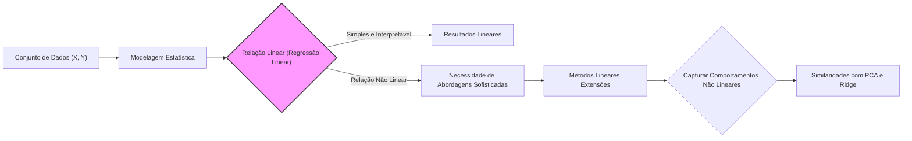

### Introdução

A modelagem estatística frequentemente envolve a busca por relações entre variáveis de entrada ($X$) e uma variável de saída ($Y$). Métodos lineares, como a regressão linear, são populares devido à sua simplicidade e interpretabilidade, assumindo uma relação linear entre $X$ e $Y$. No entanto, muitos fenômenos do mundo real exibem comportamentos não lineares, exigindo abordagens mais sofisticadas. Este capítulo explora os fundamentos dos métodos lineares e, crucialmente, discute como esses métodos, em suas extensões, podem capturar comportamentos não lineares, com foco em similaridades com técnicas como análise de componentes principais (PCA) e regressão Ridge. [^3.1]

### Conceitos Fundamentais

**Conceito 1: O Problema de Classificação e Métodos Lineares**

O problema de classificação envolve atribuir observações a categorias predefinidas. Métodos lineares procuram funções discriminantes lineares para separar essas categorias [^4.1]. Em sua forma mais básica, a classificação linear assume que as fronteiras de decisão podem ser representadas por hiperplanos lineares. Essa abordagem é eficaz quando as classes são bem separáveis e o viés (bias) introduzido por uma fronteira linear não é excessivo. No entanto, em cenários com classes sobrepostas ou relações não lineares entre as variáveis de entrada e a classe, métodos lineares podem ser limitados, exibindo alta variância e, portanto, um desempenho de generalização ruim [^4.1, ^4.2]. A capacidade dos métodos lineares de lidar com transformações não lineares das entradas, como expansões polinomiais ou funções de base, amplia consideravelmente seu alcance, permitindo que eles modelem relações mais complexas. Em termos práticos, isso envolve criar novas variáveis de entrada a partir das originais, como $X_2 = X_1^2$ ou $X_3 = X_1X_2$, transformando um problema não linear original em um problema linear em um espaço de maior dimensão [^3.1, ^3.2].

> 💡 **Exemplo Numérico:** Considere um conjunto de dados com uma única variável de entrada $X_1$ e uma variável de saída binária $Y$. Suponha que a relação entre $X_1$ e $Y$ seja não linear, como um padrão em forma de U. Um modelo linear simples, $Y = \beta_0 + \beta_1 X_1$, terá dificuldade em ajustar esses dados. No entanto, ao adicionar uma variável polinomial $X_2 = X_1^2$, o modelo se torna $Y = \beta_0 + \beta_1 X_1 + \beta_2 X_1^2$. Agora, o modelo é capaz de capturar a relação não linear através da combinação linear de $X_1$ e $X_1^2$. Por exemplo, se os dados fossem:
> ```python
> import numpy as np
> import matplotlib.pyplot as plt
> from sklearn.linear_model import LinearRegression
>
> # Dados de exemplo
> X1 = np.array([-2, -1, 0, 1, 2]).reshape(-1, 1)
> Y = np.array([4, 1, 0, 1, 4])
>
> # Regressão linear simples
> model_linear = LinearRegression()
> model_linear.fit(X1, Y)
> Y_pred_linear = model_linear.predict(X1)
>
> # Adicionando variável polinomial
> X2 = np.concatenate((X1, X1**2), axis=1)
> model_poly = LinearRegression()
> model_poly.fit(X2, Y)
> Y_pred_poly = model_poly.predict(X2)
>
> # Plotando os resultados
> plt.scatter(X1, Y, color='blue', label='Dados reais')
> plt.plot(X1, Y_pred_linear, color='red', label='Regressão linear')
> plt.plot(X1, Y_pred_poly, color='green', label='Regressão polinomial')
> plt.xlabel('X1')
> plt.ylabel('Y')
> plt.legend()
> plt.show()
>
> print(f"Coeficientes Lineares: {model_linear.coef_}")
> print(f"Coeficientes Polinomiais: {model_poly.coef_}")
> ```
>
> Os coeficientes resultantes da regressão linear simples serão aproximadamente $\beta_1 \approx 0$, indicando que o modelo não consegue capturar a relação. Já a regressão polinomial resultará em coeficientes como $\beta_1 \approx 0 $ e $\beta_2 \approx 1$, evidenciando que o modelo polinomial consegue capturar a forma em U.

**Lemma 1:** *Uma função discriminante linear pode ser decomposta em uma projeção linear nas direções definidas pelos autovetores da matriz de covariância das classes, seguida por uma decisão baseada no valor projetado.* Esta decomposição demonstra que, em essência, a classificação linear busca as direções que melhor separam as classes, alinhando-se com o objetivo de PCA e outras técnicas de redução de dimensionalidade [^4.3].
$$ \text{Dado } w^T x + b = 0, \text{ sendo } w \text{ o vetor normal ao hiperplano e } x \text{ o vetor de entrada, a decomposição envolve projetar } x \text{ em } w. $$
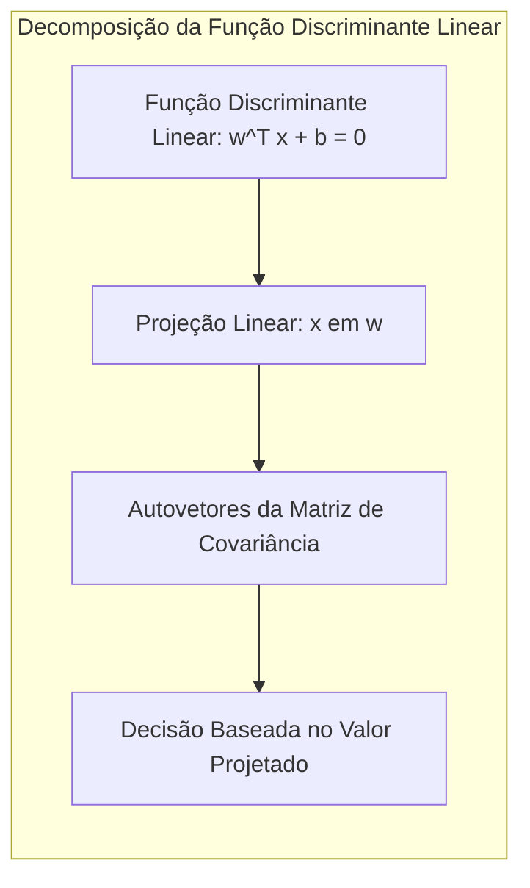

**Conceito 2: Linear Discriminant Analysis (LDA)**

A Análise Discriminante Linear (LDA) é um método de classificação linear que assume que as classes seguem distribuições gaussianas com a mesma matriz de covariância [^4.3]. LDA busca um espaço de projeção que maximize a separação entre as classes, ao mesmo tempo que minimiza a variabilidade dentro das classes [^4.3.1]. Tecnicamente, LDA estima a média e a variância de cada classe, e então usa estas informações para construir uma função discriminante linear. A fronteira de decisão entre duas classes é o conjunto de pontos onde a diferença entre as funções discriminantes é zero [^4.3.2, ^4.3.3]. As suposições do LDA são importantes: a igualdade das matrizes de covariância das classes e a distribuição gaussiana dos dados. Violações destas suposições podem levar a resultados subótimos, enquanto que em situações onde as suposições são válidas, LDA oferece uma solução eficiente e interpretabilidade.

> 💡 **Exemplo Numérico:** Considere duas classes de dados com as seguintes médias e matriz de covariância compartilhada:
>
> Classe 1: $\mu_1 = [1, 1]$,
> Classe 2: $\mu_2 = [3, 3]$,
> Matriz de covariância: $\Sigma = \begin{bmatrix} 1 & 0.5 \\ 0.5 & 1 \end{bmatrix}$
>
> LDA irá procurar um vetor $w$ (e um escalar $b$) de modo que a projeção dos dados em $w$, ou seja, $w^Tx$, seja capaz de separar as duas classes. A direção $w$ obtida por LDA será aproximadamente paralela à linha que conecta $\mu_1$ e $\mu_2$. O limite de decisão será um hiperplano (neste caso, uma linha) perpendicular a $w$ e que passa pelo ponto médio entre as projeções de $\mu_1$ e $\mu_2$ em $w$. A fórmula para o classificador LDA é:
> $$w = \Sigma^{-1}(\mu_2 - \mu_1)$$
>
> $$b = -\frac{1}{2}(\mu_1^T \Sigma^{-1} \mu_1 - \mu_2^T \Sigma^{-1} \mu_2)$$
>
> A função discriminante será dada por:
> $$g(x) = w^Tx + b$$
> Um ponto $x$ é classificado como pertencente à classe 2 se $g(x) > 0$ e à classe 1 se $g(x) < 0$.
> Calculando:
> $$ \Sigma^{-1} = \frac{1}{1 - 0.5^2} \begin{bmatrix} 1 & -0.5 \\ -0.5 & 1 \end{bmatrix} = \frac{4}{3} \begin{bmatrix} 1 & -0.5 \\ -0.5 & 1 \end{bmatrix} = \begin{bmatrix} 4/3 & -2/3 \\ -2/3 & 4/3 \end{bmatrix} $$
> $$ w = \begin{bmatrix} 4/3 & -2/3 \\ -2/3 & 4/3 \end{bmatrix}  \begin{bmatrix} 2 \\ 2 \end{bmatrix} = \begin{bmatrix} 4/3 \\ 4/3 \end{bmatrix}  $$
> $$ b = -\frac{1}{2}\left( \begin{bmatrix} 1 & 1 \end{bmatrix}  \begin{bmatrix} 4/3 & -2/3 \\ -2/3 & 4/3 \end{bmatrix} \begin{bmatrix} 1 \\ 1 \end{bmatrix} - \begin{bmatrix} 3 & 3 \end{bmatrix}  \begin{bmatrix} 4/3 & -2/3 \\ -2/3 & 4/3 \end{bmatrix} \begin{bmatrix} 3 \\ 3 \end{bmatrix}\right)  $$
> $$ b = -\frac{1}{2}\left( \frac{4}{3} - 9\frac{4}{3} \right) = \frac{16}{3} $$
> Portanto, a função discriminante é $g(x) = \frac{4}{3}x_1 + \frac{4}{3}x_2 + \frac{16}{3}$,  e a decisão é baseada no sinal de $g(x)$. Note que o vetor $w$ define a direção ótima, maximizando a separação das classes.

**Corolário 1:** *Sob as suposições de normalidade e covariância igual entre as classes, a função discriminante linear do LDA é equivalente à projeção nos eixos definidos pelos autovetores da matriz de covariância combinada, seguindo a mesma lógica do Lemma 1.* Isso mostra como a projeção linear, a otimização da separação e a redução da dimensionalidade são conceitos intrinsecamente ligados [^4.3.1].
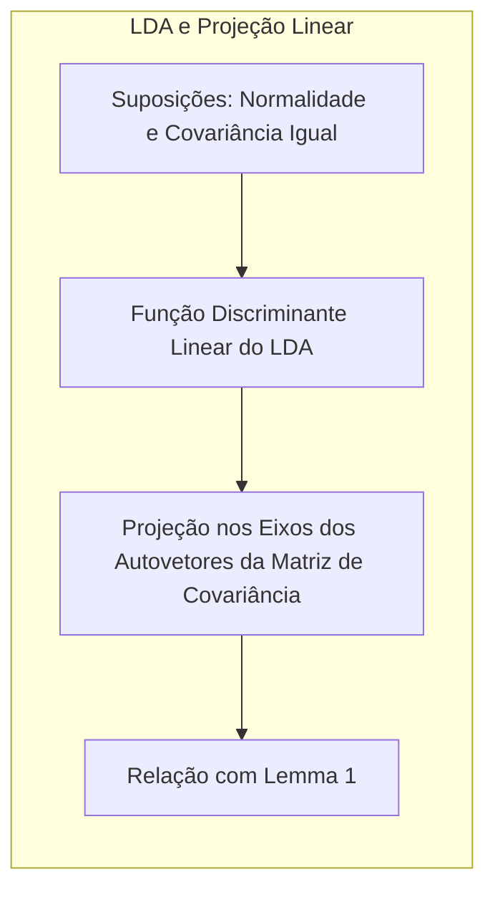

**Conceito 3: Regressão Logística**

A Regressão Logística, embora tecnicamente um modelo de regressão, é frequentemente utilizada para classificação binária [^4.4]. Ela modela a probabilidade de uma observação pertencer a uma classe usando a função logística (sigmoide) [^4.4.1]. Em essência, a regressão logística ajusta uma função sigmoide aos dados, com parâmetros estimados por máxima verossimilhança [^4.4.2]. Diferente do LDA, a regressão logística não assume distribuição gaussiana para os preditores, o que a torna mais flexível. A função logística mapeia um modelo linear em probabilidades entre 0 e 1 [^4.4.3]. A regressão logística é um modelo linear no espaço do logit (log-odds) [^4.4.4], e seu objetivo é estimar os parâmetros que melhor ajustem a probabilidade das classes observadas [^4.4.5].

> 💡 **Exemplo Numérico:** Suponha que temos dados de pacientes, onde $X$ é o número de horas de exercício por semana e $Y$ é uma variável binária indicando se o paciente desenvolveu uma doença cardíaca (1 para sim, 0 para não). Usando regressão logística, modelamos a probabilidade de desenvolver doença cardíaca como:
>
> $P(Y=1|X) = \frac{1}{1 + e^{-(\beta_0 + \beta_1 X)}}$
>
> Suponha que os parâmetros estimados sejam $\beta_0 = -3$ e $\beta_1 = 0.5$. Isso significa que a cada hora adicional de exercício por semana, o log-odds de desenvolver a doença diminui em 0.5, reduzindo a probabilidade de ocorrência da doença.
>
> Para um paciente que se exercita 2 horas por semana, a probabilidade estimada de ter a doença seria:
>
> $P(Y=1|X=2) = \frac{1}{1 + e^{-(-3 + 0.5 \times 2)}} = \frac{1}{1 + e^{-(-2)}} = \frac{1}{1 + e^{2}} \approx 0.119$
>
> Já para um paciente que não se exercita, a probabilidade estimada seria:
>
> $P(Y=1|X=0) = \frac{1}{1 + e^{-(-3 + 0.5 \times 0)}} = \frac{1}{1 + e^{3}} \approx 0.047$
>
> A função logística transforma a saída linear ($\beta_0 + \beta_1 X$) em uma probabilidade entre 0 e 1, permitindo uma interpretação probabilística do modelo.

> ⚠️ **Nota Importante**: A regressão logística, embora seja um modelo linear em termos de log-odds, pode modelar relações não-lineares entre as variáveis de entrada e a probabilidade da classe. [^4.4.1].
> ❗ **Ponto de Atenção**: Classes desbalanceadas podem afetar negativamente o desempenho da regressão logística, exigindo ajustes nas estimativas de parâmetros ou no uso de métricas de avaliação apropriadas [^4.4.2].
> ✔️ **Destaque**: Em certos cenários, as estimativas de parâmetros da LDA e da regressão logística podem ter uma forte correlação, especialmente quando as suposições da LDA são aproximadamente válidas [^4.5].
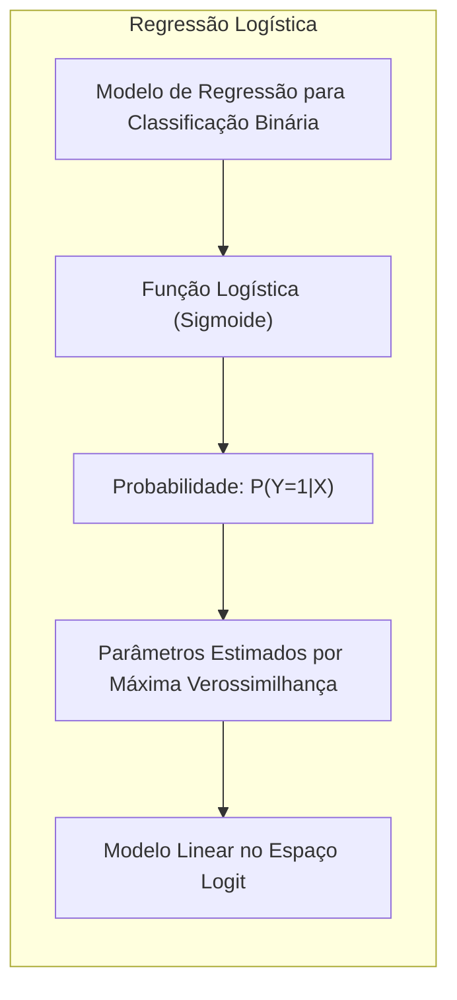

### Regressão Linear e Mínimos Quadrados para Classificação


**Explicação:** O diagrama acima ilustra o processo de regressão de indicadores e como se relaciona com a classificação, conforme descrito em [^4.2].

A regressão linear pode ser aplicada a problemas de classificação usando uma abordagem de "matriz de indicadores". Nesta técnica, cada classe é codificada como uma variável binária (0 ou 1), e a regressão linear é então utilizada para prever estas variáveis binárias [^4.2]. No entanto, esta abordagem pode apresentar limitações devido à natureza contínua da regressão linear e à natureza discreta do problema de classificação. A regressão linear pode produzir valores fora do intervalo [0, 1], que, em teoria, são os intervalos de probabilidades válidos [^4.2]. Além disso, a regressão linear não considera a variabilidade entre as classes e pode ser sensível a outliers [^4.1, ^4.2].

> 💡 **Exemplo Numérico:** Considere um problema de classificação com três classes, onde as classes são codificadas como [1, 0, 0], [0, 1, 0] e [0, 0, 1] respectivamente. Temos um conjunto de dados com duas características (X1 e X2) e suas respectivas classes. Aplicamos a regressão linear para cada variável indicadora:
> ```python
> import numpy as np
> from sklearn.linear_model import LinearRegression
>
> # Dados de exemplo
> X = np.array([[1, 2], [1.5, 1.8], [5, 8], [8, 8], [1, 0.6], [9, 1], [1, 1.1], [10, 2], [8, 9]])
> Y = np.array([[1, 0, 0], [1, 0, 0], [0, 1, 0], [0, 1, 0], [1, 0, 0], [0, 0, 1], [1, 0, 0], [0, 0, 1], [0,1,0]])
>
> # Regressão linear para cada classe
> models = [LinearRegression() for _ in range(3)]
> predictions = []
> for i, model in enumerate(models):
>     model.fit(X, Y[:, i])
>     predictions.append(model.predict(X))
>
> predictions = np.array(predictions).T
>
> predicted_classes = np.argmax(predictions, axis=1)
>
> print("Predicted values:", predictions)
> print("Predicted classes:", predicted_classes)
>
> ```
>
> Este código mostra como a regressão linear pode ser usada para classificar dados. A função *argmax* escolhe a classe com maior valor previsto. A saída da regressão linear para cada classe pode ser maior do que um ou menor do que zero, o que não tem interpretação direta em termos de probabilidade.

**Lemma 2:** *Em certas condições, as projeções dos dados nos hiperplanos de decisão gerados pela regressão linear de indicadores podem ser equivalentes às projeções geradas por funções discriminantes lineares, como a do LDA. Essa equivalência surge quando a matriz de covariância dos resíduos na regressão de indicadores é diagonal, indicando a independência das classes no espaço projetado.* Isso fornece uma ponte entre métodos de regressão e classificação [^4.2].
$$ \text{Se } \hat{Y} = X(X^T X)^{-1}X^T Y \text{ e } \hat{y} = X \beta \text{ e as projeções de dados para diferentes classes são similares sob restrição.} $$
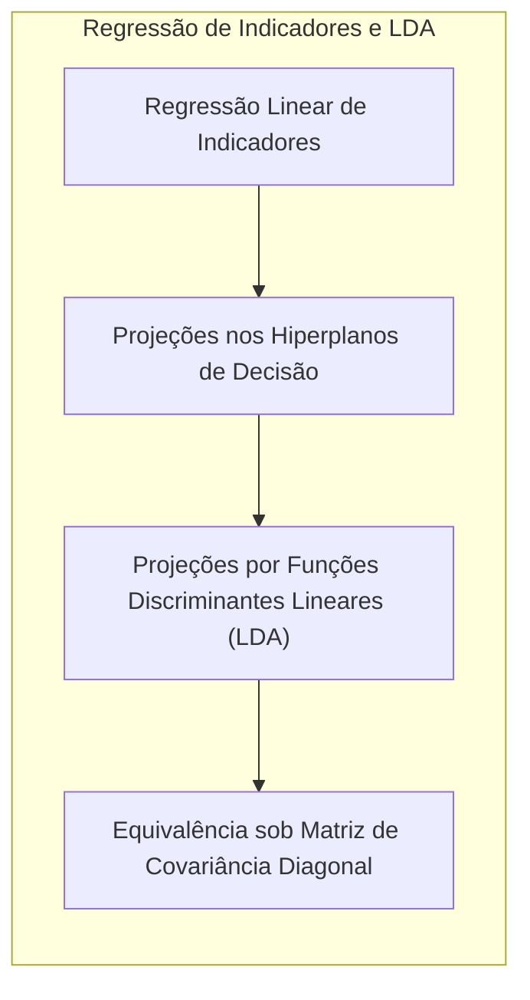

**Corolário 2:** *A equivalência apresentada no Lemma 2 sugere que a regressão linear de indicadores pode simplificar a análise do modelo em certas condições, fornecendo uma alternativa computacionalmente mais eficiente para encontrar hiperplanos de separação, especialmente quando há muitas classes.* [^4.3].

> "Em alguns cenários, conforme apontado em [^4.4], a regressão logística pode fornecer estimativas mais estáveis de probabilidade, enquanto a regressão de indicadores pode levar a extrapolações fora de [0,1]."
> "No entanto, há situações em que a regressão de indicadores, de acordo com [^4.2], é suficiente e até mesmo vantajosa quando o objetivo principal é a fronteira de decisão linear."

### Métodos de Seleção de Variáveis e Regularização em Classificação

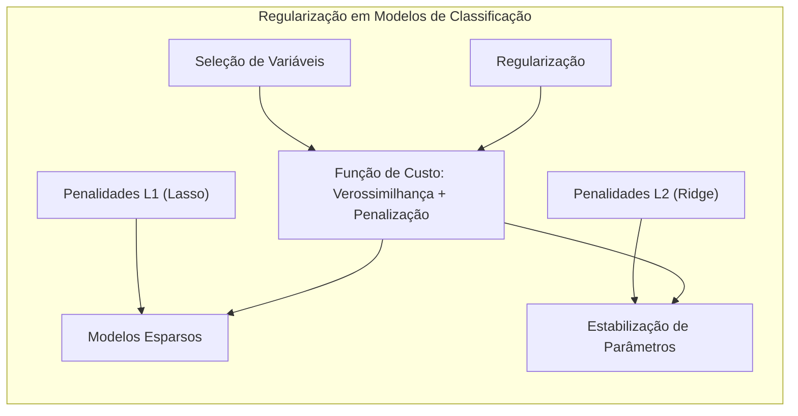

Métodos de seleção de variáveis visam identificar um subconjunto de preditores que melhor explica a variabilidade na variável de resposta, melhorando a interpretabilidade e a performance do modelo [^4.5]. A regularização, por outro lado, introduz penalidades na função de custo para evitar overfitting e estabilizar as estimativas de parâmetros [^4.4.4]. As penalidades L1 e L2 são frequentemente usadas em modelos logísticos, com a penalidade L1 (Lasso) tendendo a gerar modelos esparsos (com coeficientes iguais a zero), enquanto a penalidade L2 (Ridge) tende a encolher todos os coeficientes em direção a zero [^4.5].
Matematicamente, isso pode ser visto na formulação de uma função de custo que combina a verossimilhança (likelihood) e os termos de penalização, como em [^4.4.4]:
$$ C(\beta) = - \sum_{i=1}^{N} [y_i \log(p(x_i)) + (1-y_i)\log(1-p(x_i))] + \lambda \sum_{j=1}^{p} |\beta_j| \text{ (Lasso)}, $$
$$ C(\beta) = - \sum_{i=1}^{N} [y_i \log(p(x_i)) + (1-y_i)\log(1-p(x_i))] + \lambda \sum_{j=1}^{p} \beta_j^2 \text{ (Ridge)}, $$

> 💡 **Exemplo Numérico:** Suponha que temos um problema de classificação com 10 variáveis de entrada ($X_1$ a $X_{10}$) e uma variável de saída binária $Y$. Aplicamos a regressão logística com regularização L1 (Lasso) e L2 (Ridge), usando diferentes valores de $\lambda$.
>
> ```python
> import numpy as np
> from sklearn.linear_model import LogisticRegression
> from sklearn.preprocessing import StandardScaler
> from sklearn.model_selection import train_test_split
> from sklearn.metrics import accuracy_score
>
> # Gerar dados de exemplo
> np.random.seed(42)
> X = np.random.rand(100, 10)
> Y = np.random.randint(0, 2, 100)
>
> # Dividir os dados em treinamento e teste
> X_train, X_test, Y_train, Y_test = train_test_split(X, Y, test_size=0.3, random_state=42)
>
> # Normalizar os dados
> scaler = StandardScaler()
> X_train = scaler.fit_transform(X_train)
> X_test = scaler.transform(X_test)
>
> # Treinar modelos Lasso com diferentes lambdas
> lambdas = [0.01, 0.1, 1, 10]
> lasso_models = []
> for l in lambdas:
>     model = LogisticRegression(penalty='l1', solver='liblinear', C=1/l, random_state=42)
>     model.fit(X_train, Y_train)
>     lasso_models.append(model)
>
> # Treinar modelos Ridge com diferentes lambdas
> ridge_models = []
> for l in lambdas:
>    model = LogisticRegression(penalty='l2', solver='liblinear', C=1/l, random_state=42)
>    model.fit(X_train, Y_train)
>    ridge_models.append(model)
>
> # Avaliar modelos
> results = []
> for i, l in enumerate(lambdas):
>   lasso_predictions = lasso_models[i].predict(X_test)
>   ridge_predictions = ridge_models[i].predict(X_test)
>   results.append({
>        'lambda': l,
>        'lasso_accuracy': accuracy_score(Y_test, lasso_predictions),
>        'ridge_accuracy': accuracy_score(Y_test, ridge_predictions),
>        'lasso_coef': lasso_models[i].coef_[0],
>        'ridge_coef': ridge_models[i].coef_[0]
>    })
>
> # Mostrar resultados
> print("| Lambda | Lasso Accuracy | Ridge Accuracy | Lasso Coeficientes | Ridge Coeficientes |")
> print("|--------|----------------|----------------|-------------------|--------------------|")
> for row in results:
>    print(f"| {row['lambda']:<6} | {row['lasso_accuracy']:<14.4f} | {row['ridge_accuracy']:<14.4f} | {np.array2string(row['lasso_coef'], precision=2, separator=', ') :<17} | {np.array2string(row['ridge_coef'], precision=2, separator=', ') :<18} |")
> ```
>
> O exemplo demonstra como valores diferentes de $\lambda$ (aqui, representados como o inverso do parâmetro C) afetam a acurácia e os coeficientes dos modelos. O modelo Lasso com $\lambda$ maior tende a zerar coeficientes, realizando seleção de variáveis, enquanto o modelo Ridge encolhe os coeficientes para perto de zero.

**Lemma 3:** *A penalização L1 em classificação logística leva a coeficientes esparsos devido ao formato de seu contorno, com cantos não diferenciáveis que induzem a coeficientes iguais a zero.* [^4.4.4]
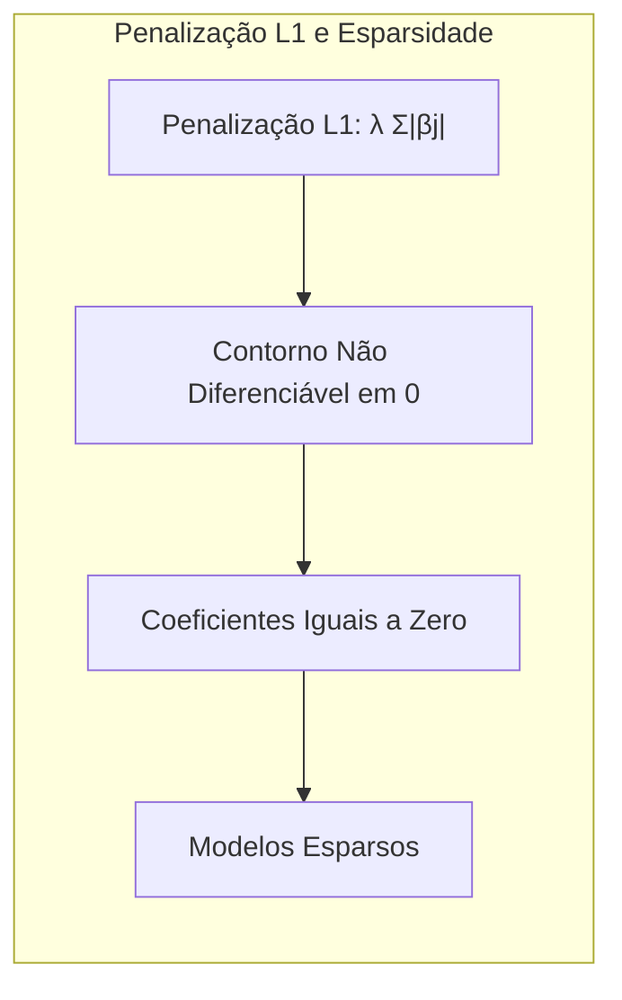

**Prova do Lemma 3:** A penalidade L1, $ \lambda \sum |\beta_j|$, é não diferenciável em 0, o que faz com que o vetor solução fique, geralmente, nos cantos da região delimitada pela penalização. Essa característica induz à seleção de variáveis, zerando alguns coeficientes e gerando modelos esparsos. A otimização por subgradientes ou algoritmos de ponto proximal pode levar a soluções onde algumas estimativas $\hat{\beta}_j$ são exatamente zero. Essa abordagem contrasta com a penalidade L2, que é diferenciável em todos os pontos e induz a estimativas $\hat{\beta}_j$ que são encolhidas em direção a zero, mas raramente iguais a zero [^4.4.3].  $\blacksquare$

**Corolário 3:** *A esparsidade induzida pela penalização L1 promove a interpretabilidade do modelo, selecionando um subconjunto de preditores mais relevantes.* A combinação de penalidades L1 e L2 (Elastic Net) pode aproveitar vantagens de ambos os tipos de regularização [^4.4.5, ^4.5].
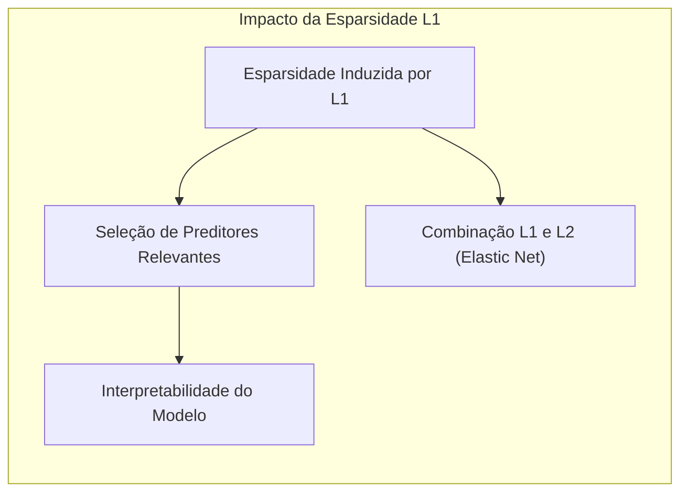

> ⚠️ **Ponto Crucial**: L1 e L2 podem ser combinadas (Elastic Net) para aproveitar vantagens de ambos os tipos de regularização, conforme discutido em [^4.5].

### Separating Hyperplanes e Perceptrons

O conceito de maximizar a margem de separação entre classes leva naturalmente ao conceito de hiperplanos ótimos [^4.5.2]. Um hiperplano ótimo é aquele que maximiza a distância entre as classes, fornecendo uma melhor capacidade de generalização e robustez. O problema de otimização para encontrar este hiperplano pode ser formulado de forma dual, utilizando o dual de Wolfe [^4.5.2]. A solução do problema dual envolve encontrar uma combinação linear dos pontos de suporte que determinam a orientação do hiperplano. O Perceptron de Rosenblatt [^4.5.1] é um algoritmo que ajusta um hiperplano de decisão iterativamente, e que converge sob a condição de linear separabilidade dos dados. Sua convergência é garantida sob a condição de linear separability, mas sua incapacidade de lidar com classes não separáveis levou ao desenvolvimento de métodos mais sofisticados, como Support Vector Machines (SVMs).

### Pergunta Teórica Avançada: Quais as diferenças fundamentais entre a formulação de LDA e a Regra de Decisão Bayesiana considerando distribuições Gaussianas com covariâncias iguais?

**Resposta:** Sob certas suposições, o LDA se torna equivalente à regra de decisão Bayesiana. A regra de decisão Bayesiana minimiza a probabilidade de erro de classificação, atribuindo cada observação à classe com maior probabilidade a posteriori [^4.3]. Se assumirmos que as classes seguem distribuições gaussianas com a mesma matriz de covariância, então o limite de decisão Bayesiano será linear, e corresponderá à decisão feita pelo LDA [^4.3]. A formulação do LDA é uma simplificação, assumindo essa equivalência e buscando otimizar a projeção linear que maximiza a separação entre as classes. A regra de decisão Bayesiana, por outro lado, parte de princípios mais gerais e é aplicável a uma gama mais ampla de distribuições.
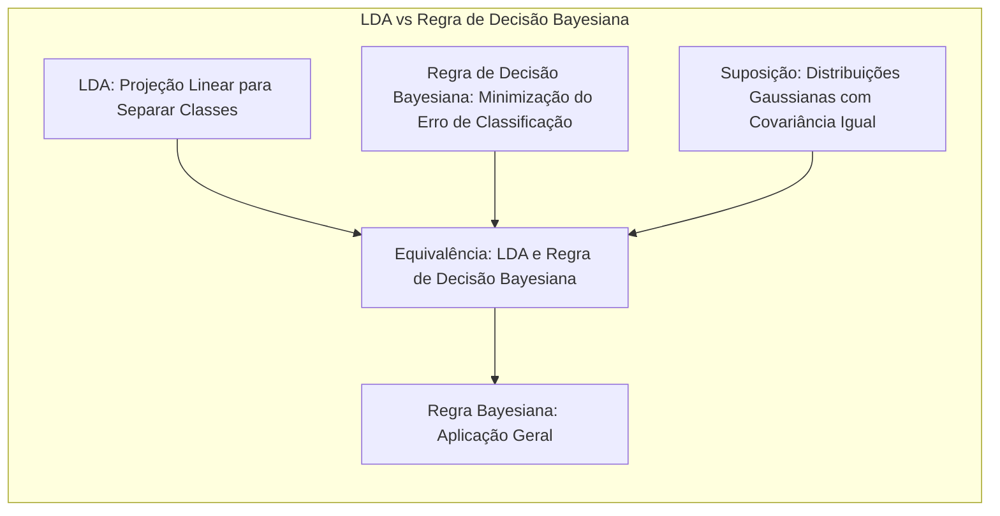
**Lemma 4:** *Sob as suposições de distribuições gaussianas com médias $\mu_k$ e mesma matriz de covariância $\Sigma$ para $K$ classes, a regra de decisão Bayesiana que minimiza o erro de classificação é dada por*
$$ \arg\max_k \left[ -\frac{1}{2}(x-\mu_k)^T \Sigma^{-1} (x-\mu_k) + \log(\pi_k) \right],$$ *onde* $\pi_k$ *é a probabilidade a priori da classe* $k$. *Essa regra é equivalente à decisão de LDA, que busca projetar os dados em um espaço linear onde a separação entre as classes é maximizada.* [^4.3, ^4.3.3]
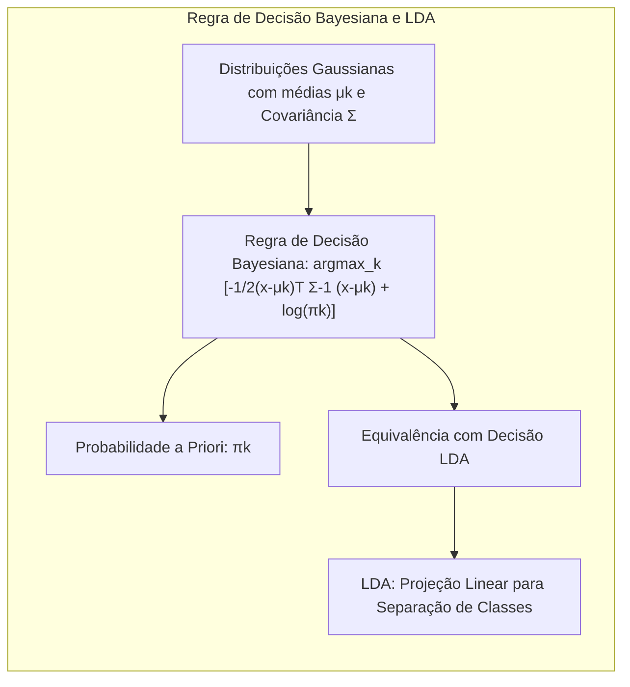

**Corolário 4:** *Ao relaxar a hipótese de covariâncias iguais, a fronteira de decisão da regra Bayesiana se torna quadrática, dando origem a métodos como o Quadratic Discriminant Analysis (QDA). Isso mostra como a escolha da média e da covariância influencia o tipo de fronteira de decisão (linear ou quadrática).* [^4.3]
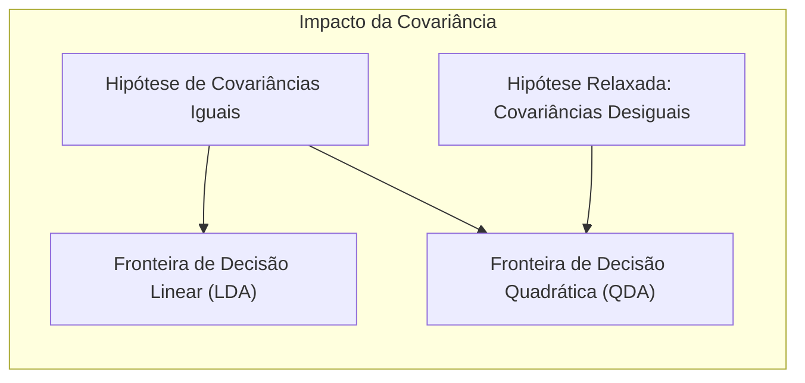

> ⚠️ **Ponto Crucial**: A adoção ou não de covariâncias iguais impacta fortemente o tipo de fronteira de decisão (linear vs. quadrática), conforme discutido em [^4.3.1].

### Conclusão

Este capítulo explorou diversos métodos lineares para classificação e suas extensões para lidar com comportamentos não lineares. As semelhanças entre técnicas como LDA, regressão logística, regressão linear de indicadores, PCA, ridge, métodos de seleção de variáveis e regularização foram analisadas em detalhes.  É crucial notar que, em modelos lineares com expansão de variáveis, a combinação de termos (polinomiais ou de outras funções de base) resulta em um comportamento não linear, mesmo que o modelo continue linear no espaço das novas variáveis. A comparação entre as formulações, suposições e resultados de métodos lineares com expansões e com métodos de regularização e redução de dimensionalidade proporciona uma compreensão mais rica e profunda das ferramentas à disposição para modelagem estatística. A capacidade de lidar com a não linearidade em um modelo linear, seja através de expansões, regularização ou projeções em componentes principais, expande o arsenal de ferramentas para lidar com dados complexos em diversos domínios.
```mermaid
graph LR
    subgraph "Conclusão"
    direction TB
    A["Métodos Lineares para Classificação e Regressão"]
    B["Extensões para Comportamentos Não Lineares"]
    C["Similaridades: LDA, Regressão Logística, Regressão de Indicadores, PCA, Ridge"]
    D["Expans