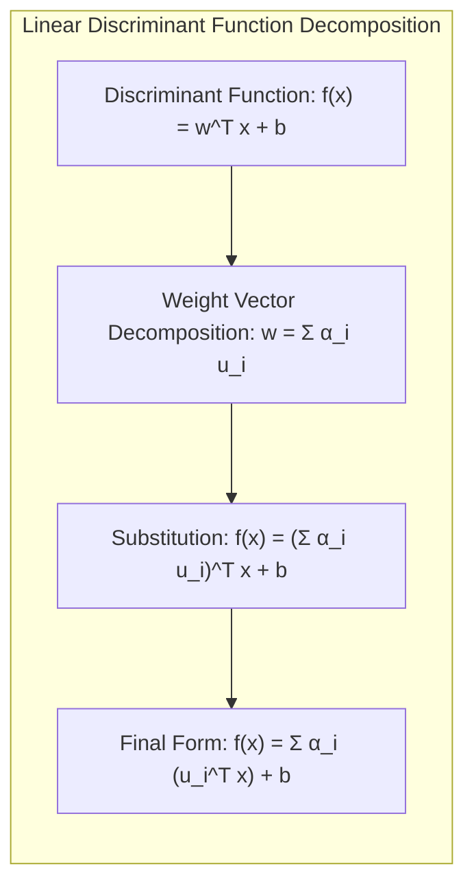
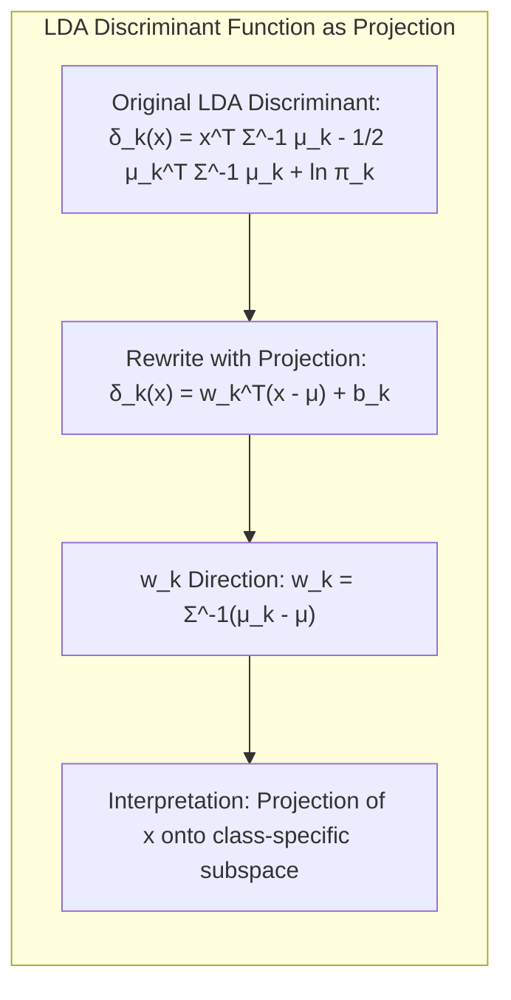
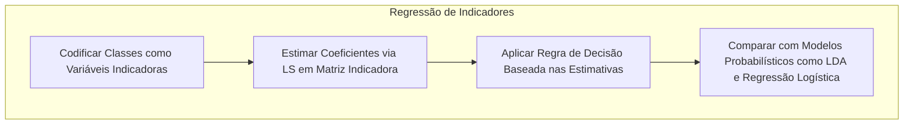
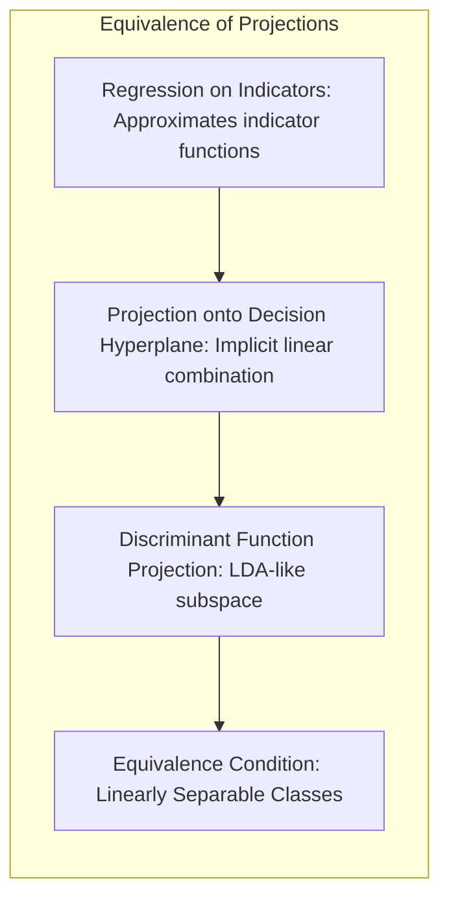
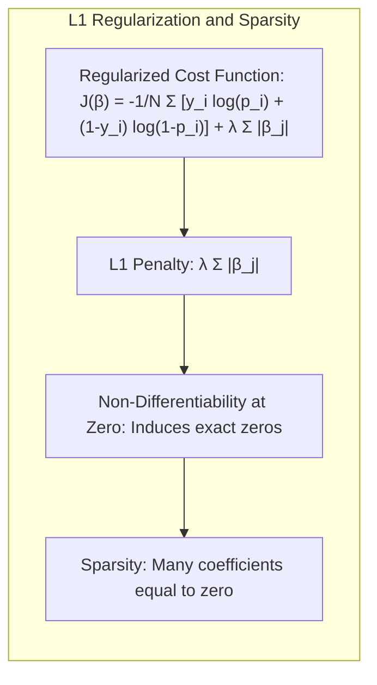

## Métodos Lineares para Regressão: Uma Visão Geral da Redução da Dimensionalidade de Inputs

<imagem: Diagrama mostrando o fluxo de dados para modelos de regressão com redução de dimensionalidade, destacando as etapas de combinação linear, seleção de variáveis e regularização>

### Introdução
Este capítulo explora métodos lineares de regressão, com um foco especial na redução da dimensionalidade dos inputs. Os modelos lineares, apesar de sua simplicidade, são ferramentas poderosas e interpretáveis para analisar como os inputs afetam os outputs [^3.1]. A complexidade de modelos com muitos inputs pode levar à overfitting e dificultar a interpretação. Assim, estratégias para reduzir o número de inputs ou combiná-los de maneira mais eficiente tornam-se essenciais. Modelos lineares são frequentemente utilizados como base para o desenvolvimento de métodos mais complexos [^3.1]. Em cenários de alta dimensão, onde o número de inputs ($p$) se aproxima ou excede o número de observações ($N$), métodos que reduzem a dimensionalidade dos inputs são indispensáveis para construir modelos mais robustos e com boa generalização. A redução de dimensionalidade, conforme descrito neste capítulo, também pode ser vista como uma forma de regularização para controlar o trade-off entre bias e variância [^3.1].

### Conceitos Fundamentais

**Conceito 1: O Problema de Classificação e Métodos Lineares**

O problema da classificação, em sua essência, envolve a alocação de observações a classes predefinidas, o que se relaciona intrinsecamente com o problema da regressão através da formulação de funções discriminantes [^4.1]. Métodos lineares abordam este problema assumindo que a fronteira de decisão entre classes pode ser representada por uma combinação linear dos inputs. Em termos matemáticos, um modelo linear para classificação pode ser expresso como:

$$f(x) = \beta_0 + \sum_{j=1}^p x_j\beta_j$$

onde $x$ representa o vetor de inputs e $\beta$ os parâmetros do modelo. O uso de métodos lineares na classificação tem como vantagem a simplicidade e a interpretabilidade, mas pode introduzir viés se a relação entre inputs e classes for não linear [^4.1]. A variância de um modelo linear, no entanto, é geralmente menor, o que pode ser benéfico em casos onde temos poucos dados de treinamento, e é um trade-off a ser considerado. Por exemplo, a regressão linear pode ser usada para criar uma função discriminante, atribuindo uma classe baseada no sinal da função linear [^4.2].

> 💡 **Exemplo Numérico:** Vamos considerar um problema de classificação com duas classes (0 e 1) e dois inputs, $x_1$ e $x_2$.  Um modelo linear poderia ser $f(x) = -0.5 + 2x_1 + 1.5x_2$. Para um novo ponto, $x = (0.6, 0.8)$, calcularíamos $f(x) = -0.5 + 2(0.6) + 1.5(0.8) = -0.5 + 1.2 + 1.2 = 1.9$.  Como $f(x)$ é positivo, o ponto seria classificado como classe 1. Se tivéssemos um ponto $x = (0.1, 0.1)$, então $f(x) = -0.5 + 2(0.1) + 1.5(0.1) = -0.5 + 0.2 + 0.15 = -0.15$, e o ponto seria classificado como classe 0. Este exemplo ilustra a tomada de decisão baseada no sinal da função linear.

**Lemma 1: Decomposição de Funções Discriminantes Lineares**

*Em um espaço de características, qualquer função discriminante linear pode ser decomposta em uma soma ponderada de projeções sobre os eixos das características, refletindo a importância relativa de cada input na decisão de classe.*

Formalmente, uma função discriminante linear $f(x)$ pode ser escrita como:

$$f(x) = w^T x + b$$

onde $w$ é o vetor de pesos e $b$ é o bias. Podemos decompor $w$ como uma combinação linear de vetores ortonormais $u_i$:

$$w = \sum_{i=1}^{p} \alpha_i u_i$$

onde $p$ é a dimensão dos inputs. Substituindo na função discriminante:

$$f(x) = \left(\sum_{i=1}^{p} \alpha_i u_i\right)^T x + b = \sum_{i=1}^{p} \alpha_i (u_i^T x) + b$$

Aqui, $u_i^T x$ representa a projeção de $x$ sobre o vetor $u_i$, e o parâmetro $\alpha_i$ quantifica a importância dessa projeção na decisão de classe. Esta decomposição explicita que a decisão é uma soma ponderada das projeções de $x$ sobre várias direções no espaço de inputs, mostrando a influência de cada input na classificação. $\blacksquare$

> 💡 **Exemplo Numérico:** Imagine um cenário com dois inputs e dois vetores ortonormais, $u_1 = [1, 0]$ e $u_2 = [0, 1]$. Seja o vetor de pesos $w = [3, 2]$, que pode ser reescrito como $w = 3u_1 + 2u_2$, onde $\alpha_1 = 3$ e $\alpha_2 = 2$. A função discriminante então é $f(x) = w^Tx + b =  3(u_1^Tx) + 2(u_2^Tx) + b$. Se tivermos um input $x = [2, 4]$ e $b = -1$, então $f(x) = 3(1\cdot2+0\cdot4) + 2(0\cdot2+1\cdot4) - 1 = 3(2) + 2(4) - 1 = 6 + 8 - 1 = 13$. A decomposição mostra que o input $x$ é projetado em $u_1$ e $u_2$, com pesos 3 e 2 respectivamente, e o resultado final é a soma ponderada dessas projeções mais o bias.

**Conceito 2: Linear Discriminant Analysis (LDA)**

A **Linear Discriminant Analysis (LDA)** é um método de classificação linear que busca encontrar a combinação linear de inputs que melhor separa as classes, assumindo que os dados em cada classe são normalmente distribuídos com a mesma matriz de covariância [^4.3]. A **LDA** opera encontrando um subespaço linear no qual a razão entre a variância entre as classes e a variância dentro das classes é maximizada. Matematicamente, a **LDA** busca um vetor de projeção $w$ que maximize o critério:

$$J(w) = \frac{w^T S_B w}{w^T S_W w}$$

onde $S_B$ é a matriz de covariância entre as classes e $S_W$ é a matriz de covariância dentro das classes [^4.3]. A **LDA** faz uso dessas matrizes e das médias de cada classe para definir as fronteiras de decisão lineares [^4.3.1], que podem ser formalizadas como:

$$\delta_k(x) = x^T \Sigma^{-1} \mu_k - \frac{1}{2}\mu_k^T \Sigma^{-1} \mu_k + \ln \pi_k$$

onde $\mu_k$ é a média da classe $k$, $\Sigma$ é a matriz de covariância comum e $\pi_k$ é a probabilidade a priori da classe $k$. A decisão é tomada atribuindo a classe $k$ que maximiza $\delta_k(x)$. A premissa de covariâncias iguais é crucial para garantir fronteiras lineares; caso contrário, as fronteiras seriam quadráticas [^4.3.2], [^4.3.3].

> 💡 **Exemplo Numérico:** Suponha um problema de classificação com duas classes e duas features. Temos as médias das classes $\mu_1 = [1, 2]$ e $\mu_2 = [3, 1]$ e uma matriz de covariância comum $\Sigma = \begin{bmatrix} 1 & 0.5 \\ 0.5 & 1 \end{bmatrix}$.  Para um novo ponto $x = [2, 2]$, e assumindo $\pi_1 = \pi_2 = 0.5$ ($\ln(0.5) \approx -0.693$), podemos calcular os discriminantes para cada classe. Primeiro calculamos $\Sigma^{-1} = \begin{bmatrix} 1.33 & -0.67 \\ -0.67 & 1.33 \end{bmatrix}$. Temos, $\delta_1(x) = [2, 2]^T \begin{bmatrix} 1.33 & -0.67 \\ -0.67 & 1.33 \end{bmatrix} [1, 2] - \frac{1}{2}[1, 2]^T\begin{bmatrix} 1.33 & -0.67 \\ -0.67 & 1.33 \end{bmatrix} [1, 2] -0.693 = -0.107 $ e  $\delta_2(x) = [2, 2]^T \begin{bmatrix} 1.33 & -0.67 \\ -0.67 & 1.33 \end{bmatrix} [3, 1] - \frac{1}{2}[3, 1]^T\begin{bmatrix} 1.33 & -0.67 \\ -0.67 & 1.33 \end{bmatrix} [3, 1] -0.693 = 1.043 $. Como $\delta_2(x) > \delta_1(x)$, o ponto $x$ é classificado como pertencente à classe 2.

**Corolário 1: Relação entre a Função Discriminante e Projeção em Subespaços**

*A função discriminante linear da LDA pode ser interpretada como uma projeção dos inputs em um subespaço de menor dimensão, seguida por uma decisão baseada na posição da projeção nesse subespaço.*

A função discriminante LDA pode ser reescrita em termos da projeção de $x$ no subespaço determinado por $S_W^{-1} (\mu_k - \mu)$, onde $\mu$ é a média geral, obtendo:

$$\delta_k(x) = w_k^T (x - \mu) + b_k$$

com $w_k$ sendo a direção de projeção da classe $k$ e $b_k$ o bias. Essa formulação mostra como a LDA reduz a dimensionalidade ao projetar os dados em subespaços determinados pela estrutura das classes, permitindo a tomada de decisão em um espaço de menor dimensão com base nas projeções. Essa interpretação demonstra como a LDA reduz a dimensionalidade mantendo a informação discriminativa, que é essencial para a classificação. [^4.3.1] $\blacksquare$

> 💡 **Exemplo Numérico:**  Continuando com o exemplo anterior, suponha que a média global seja $\mu = [2, 1.5]$.  Então $w_1 = \Sigma^{-1}(\mu_1 - \mu) = \begin{bmatrix} 1.33 & -0.67 \\ -0.67 & 1.33 \end{bmatrix} \begin{bmatrix} -1 \\ 0.5 \end{bmatrix} = \begin{bmatrix} -1.665 \\ 1.335 \end{bmatrix}$ e  $w_2 = \Sigma^{-1}(\mu_2 - \mu) = \begin{bmatrix} 1.33 & -0.67 \\ -0.67 & 1.33 \end{bmatrix} \begin{bmatrix} 1 \\ -0.5 \end{bmatrix} = \begin{bmatrix} 1.665 \\ -1.335 \end{bmatrix}$.  Podemos calcular $b_k =  -\frac{1}{2}\mu_k^T \Sigma^{-1} \mu_k + \ln \pi_k$.  A projeção de $x=[2,2]$ na direção $w_1$ é $w_1^T(x-\mu) = \begin{bmatrix} -1.665 & 1.335 \end{bmatrix}\begin{bmatrix} 0 \\ 0.5 \end{bmatrix} = 0.6675$. Assim, a classificação é feita com base nas projeções em $w_1$ e $w_2$.  Este exemplo ilustra a ideia de que o discriminante pode ser expresso como uma projeção nos subespaços relevantes.

**Conceito 3: Regressão Logística**

A **Logistic Regression** é outro método de classificação linear, mas em vez de assumir normalidade, modela a probabilidade de uma observação pertencer a uma classe através de uma função sigmoidal (logit) [^4.4]. A função logit transforma uma função linear dos inputs em uma probabilidade, permitindo a classificação através de um limiar. Formalmente, a probabilidade de pertencer à classe 1 é modelada como:

$$p(x) = \frac{1}{1 + e^{-(\beta_0 + \sum_{j=1}^p x_j\beta_j)}}$$

A regressão logística busca encontrar os parâmetros $\beta$ que melhor se ajustam aos dados de treinamento através da maximização da verossimilhança (likelihood), conforme descrito em [^4.4.1], [^4.4.2], [^4.4.3]. A função de verossimilhança $L(\beta)$ para um conjunto de dados com $n$ observações é dada por:
$$L(\beta) = \prod_{i=1}^n p(x_i)^{y_i} (1-p(x_i))^{1-y_i}$$

onde $y_i$ é 1 se a observação $i$ pertence à classe 1 e 0 caso contrário. A maximização da log-verossimilhança é utilizada para obter as estimativas dos parâmetros $\beta$, utilizando métodos iterativos [^4.4.4], [^4.4.5].

> ⚠️ **Nota Importante**: A regressão logística, ao contrário da regressão linear, modela a probabilidade de um evento e não o valor do output diretamente [^4.4.1].

> ❗ **Ponto de Atenção**:  Em datasets desbalanceados, técnicas de rebalanceamento de classes ou ajuste de thresholds podem ser necessárias [^4.4.2].

> ✔️ **Destaque**: Tanto a LDA como a Regressão Logística podem gerar fronteiras de decisão lineares e, em certas situações, seus resultados são similares, mas seus fundamentos probabilísticos são diferentes [^4.5].

> 💡 **Exemplo Numérico:** Suponha que temos um modelo de regressão logística com dois inputs:  $p(x) = \frac{1}{1 + e^{-(-1 + 2x_1 - 1.5x_2)}}$.  Para $x = [0.5, 0.5]$, temos o argumento da exponencial: $-1 + 2(0.5) - 1.5(0.5) = -1 + 1 - 0.75 = -0.75$. Então, $p(x) = \frac{1}{1 + e^{0.75}} \approx \frac{1}{1 + 2.117} \approx \frac{1}{3.117} \approx 0.32$.  Isso significa que a probabilidade de $x$ pertencer à classe 1 é de aproximadamente 32%. Para classificar, normalmente usamos um limiar (threshold) de 0.5, então esse ponto seria classificado como classe 0.

### Regressão Linear e Mínimos Quadrados para Classificação

A regressão linear aplicada a uma matriz de indicadores (dummy coding) é uma forma direta de estender modelos de regressão linear para problemas de classificação [^4.2]. Nessa abordagem, cada classe é representada por uma coluna na matriz de indicadores, e o modelo de regressão linear é ajustado para cada coluna [^4.2]. O modelo então prediz um valor contínuo para cada classe, e a classe com o maior valor predito é selecionada. Matematicamente, o modelo é expresso como:

$$Y = X \beta + \epsilon$$

onde $Y$ é a matriz de indicadores, $X$ é a matriz de inputs, $\beta$ é a matriz de coeficientes, e $\epsilon$ são os erros. Os parâmetros $\beta$ são estimados via mínimos quadrados. A regra de decisão é dada pela classe $k$ que maximiza a saída $f_k(x) = x^T \beta_k$, ou seja:

$$\text{Classe} = \arg \max_k f_k(x)$$

Apesar de sua simplicidade, essa abordagem tem limitações, como a possibilidade de predições fora do intervalo [0,1] e problemas com classes não balanceadas [^4.2]. Uma dessas limitações está relacionada à interpretação dos coeficientes, que não correspondem diretamente a probabilidades, mas sim a valores que direcionam a alocação para uma determinada classe. Outro ponto é o "masking problem" descrito em [^4.3], onde uma variável altamente correlacionada com outras, pode ter sua importância mascarada no modelo, o que é abordado pela análise discriminante linear.

> 💡 **Exemplo Numérico:**  Considere um problema com três classes. A matriz de indicadores $Y$ terá três colunas, onde a coluna $k$ tem 1 se a amostra pertence à classe $k$ e 0 caso contrário.  Se tivermos três amostras e duas features, a matriz de inputs pode ser $X = \begin{bmatrix} 1 & 2 \\ 2 & 1 \\ 3 & 3 \end{bmatrix}$, e a matriz de indicadores pode ser $Y = \begin{bmatrix} 1 & 0 & 0 \\ 0 & 1 & 0 \\ 0 & 0 & 1 \end{bmatrix}$.  A regressão linear tentará ajustar três modelos: $Y_{:,1} = X \beta_1 + \epsilon_1$, $Y_{:,2} = X \beta_2 + \epsilon_2$ e $Y_{:,3} = X \beta_3 + \epsilon_3$. Suponha que após o ajuste, tenhamos $\beta_1 = [-0.5, 0.6]$, $\beta_2 = [0.2, -0.3]$ e $\beta_3 = [0.8, 0.1]$. Para um novo input $x = [2, 2]$,  as saídas para cada classe são: $f_1(x) = -0.5(2) + 0.6(2) = 0.2$, $f_2(x) = 0.2(2) - 0.3(2) = -0.2$ e $f_3(x) = 0.8(2) + 0.1(2) = 1.8$.  A classe predita seria a classe 3, pois ela tem o maior valor de $f_k(x)$.

**Lemma 2: Equivalência de Projeções em Cenários Lineares**

*Em um cenário onde as classes são bem separadas por hiperplanos, a projeção dos inputs nos hiperplanos de decisão derivados da regressão de indicadores é equivalente (em termos de alocação de classes) à projeção obtida por discriminantes lineares.*

Em um contexto de classificação binária com classes bem separadas, a regressão linear em indicadores tenta aproximar uma função indicadora para cada classe. Ao projetarmos um novo input $x$ no hiperplano de decisão obtido pela regressão de indicadores, estamos implicitamente calculando uma combinação linear de $x$ que reflete o quanto $x$ está associado a cada classe. Esta combinação linear, sob condições de separabilidade, é equivalente, em termos da decisão final de classe, à projeção obtida através de discriminantes lineares como na LDA. Formalmente, podemos mostrar que a projeção sobre o hiperplano determinado pela regressão de indicadores:

$$proj(x) = \sum_{k=1}^{K} f_k(x) u_k$$

onde $f_k(x)$ são as saídas da regressão linear e $u_k$ são os vetores de base, é uma aproximação da projeção em um subespaço de menor dimensão que separa as classes. Esta equivalência, no entanto, só é válida quando as classes podem ser bem separadas linearmente, e se as classes não forem bem separadas, a equivalência pode não ser válida. $\blacksquare$

**Corolário 2: Simplificação da Análise de Modelo**

*A equivalência entre projeções em certas condições permite simplificar a análise do modelo, utilizando as ferramentas de interpretação da análise discriminante linear em conjunto com a regressão de indicadores.*

Se demonstrarmos a equivalência entre os dois métodos, podemos utilizar o conhecimento sobre a estrutura das projeções da análise discriminante linear para interpretar os resultados da regressão em indicadores. Este resultado é muito útil, pois permite utilizar técnicas de redução de dimensionalidade em conjunto com a regressão em indicadores de uma forma mais coerente. Conforme mencionado em [^4.3], a análise discriminante linear fornece uma estrutura teórica para entender como os dados são projetados em subespaços que maximizam a separabilidade das classes. $\blacksquare$

"Em alguns cenários, conforme apontado em [^4.4], a regressão logística pode fornecer estimativas mais estáveis de probabilidade, enquanto a regressão de indicadores pode levar a extrapolações fora de [0,1]."

"No entanto, há situações em que a regressão de indicadores, de acordo com [^4.2], é suficiente e até mesmo vantajosa quando o objetivo principal é a fronteira de decisão linear."

### Métodos de Seleção de Variáveis e Regularização em Classificação

Em cenários com muitos inputs, a seleção de variáveis e a regularização são técnicas cruciais para evitar overfitting e melhorar a interpretabilidade do modelo [^4.5]. A seleção de variáveis identifica o subconjunto de inputs mais relevante para a classificação. Já a regularização penaliza modelos complexos, levando a soluções mais estáveis.
Uma abordagem é utilizar a regularização L1 e L2 [^4.4.4] na formulação da regressão logística. A regularização L1, adiciona um termo de penalidade proporcional ao valor absoluto dos coeficientes, induzindo sparsity, ou seja, coeficientes iguais a zero e seleção automática de variáveis. A regularização L2 adiciona um termo proporcional ao quadrado dos coeficientes, reduzindo a magnitude dos coeficientes e oferecendo maior estabilidade ao modelo. A combinação de ambas as abordagens, Elastic Net, é útil para obter resultados balanceados [^4.5]. Matematicamente, a função de custo regularizada para a regressão logística pode ser definida como:

$$J(\beta) = - \frac{1}{n} \sum_{i=1}^n \left[y_i \log(p_i) + (1-y_i) \log(1-p_i)\right] + \lambda \left( \alpha \sum_{j=1}^p |\beta_j| + (1-\alpha) \sum_{j=1}^p \beta_j^2 \right)$$

onde $p_i$ é a probabilidade predita para a observação $i$, $\lambda$ é o parâmetro de regularização, e $\alpha$ controla o trade-off entre L1 e L2 [^4.5.1].

> 💡 **Exemplo Numérico:** Considere a regressão logística com regularização L1 e L2.  Suponha que a função de custo seja: $J(\beta) =  -\frac{1}{n}\sum_{i=1}^{n} \left[y_i \log(p_i) + (1-y_i) \log(1-p_i)\right] + \lambda \left(\alpha \sum_{j=1}^{p} |\beta_j| + (1-\alpha) \sum_{j=1}^{p} \beta_j^2\right)$. Com $\lambda = 0.1$ e $\alpha = 0.5$ (Elastic Net), se após a otimização tivermos $\beta = [1.2, 0, -0.8, 0.1]$,  a penalidade para L1 seria $\lambda\alpha(1.2 + 0 + 0.8 + 0.1) = 0.1 * 0.5 * 2.1 = 0.105$, e a penalidade para L2 seria $\lambda(1-\alpha)(1.2^2 + 0 + (-0.8)^2 + 0.1^2) = 0.1 * 0.5 * (1.44 + 0.64 + 0.01) = 0.1 * 0.5 * 2.09 = 0.1045$.  O termo de penalidade total é a soma das duas.  Observe que a regularização L1 induziu um dos coeficientes a ser zero (seleção de variáveis), e os demais foram reduzidos em magnitude pela regularização L2.

**Lemma 3: Sparsity Induzida pela Penalização L1**

*A penalização L1 na regressão logística leva a coeficientes esparsos (isto é, muitos coeficientes iguais a zero), o que efetivamente realiza a seleção de variáveis.*

A penalização L1 adiciona um termo proporcional à soma dos valores absolutos dos coeficientes na função de custo. Este termo, devido à sua não diferenciabilidade na origem, induz os coeficientes a se tornarem exatamente zero em vez de simplesmente se aproximarem de zero. Para a regressão logística, a função de custo com penalização L1 pode ser expressa como:

$$J(\beta) = -\frac{1}{N}\sum_{i=1}^{N} \left[ y_i \log(p_i) + (1-y_i) \log(1-p_i) \right] + \lambda \sum_{j=1}^p |\beta_j|$$

A presença do termo $\lambda \sum_{j=1}^p |\beta_j|$ na função de custo faz com que o processo de otimização empurre certos coeficientes para zero. Isso ocorre porque a não-diferenciabilidade da função no ponto zero leva à formação de "cantos" no espaço de parâmetros, onde a otimização tende a concentrar as soluções, resultando em muitos coeficientes exatamente iguais a zero [^4.4.4]. A solução ótima encontra um balanço entre a função de verossimilhança (fitting) e a penalidade L1 (sparsity). $\blacksquare$

**Prova do Lemma 3:**
A função de custo com penalização L1 na regressão logística é:

$$ J(\beta) = L(\beta) + \lambda ||\beta||_1$$

onde $L(\beta)$ é a função log-verossimilhança e $||\beta||_1$ é a norma L1 de $\beta$. A otimização desta função envolve encontrar o $\beta$ que minimiza $J(\beta)$. A derivada da norma L1 não é diferenciável em zero, o que leva à seguinte condição de otimalidade no ponto de mínimo:

$$ \frac{\partial L(\beta)}{\partial \beta_j} + \lambda \text{sign}(\beta_j) = 0$$

Se o valor da derivada da função log-verossimilhança no ponto zero for menor que $\lambda$ em módulo, isto é, $\vert \frac{\partial L(\beta)}{\partial \beta_j} \vert < \lambda$, então o coeficiente $\beta_j$ será exatamente zero [^4.4.3]. Isto acontece porque, para minimizar a função de custo, o termo de penalidade L1 "empurra" o coeficiente para zero, criando sparsity. $\blacksquare$

**Corolário 3: Interpretabilidade dos Modelos Classificatórios**

*A esparsidade induzida pela penalização L1 simplifica a interpretação do modelo, pois apenas os inputs com coeficientes não nulos são considerados relevantes para a classificação.*

A seleção de variáveis através da penalização L1 leva a modelos mais interpretáveis, pois apenas um subconjunto de inputs tem coeficientes diferentes de zero. Isso significa que apenas esses inputs têm influência na decisão final da classe, simplificando a análise e identificando os fatores mais relevantes para o problema da classificação [^4.4.5]. A interpretabilidade é crucial em muitos contextos, onde o entendimento dos mecanismos de decisão é tão importante quanto a precisão da classificação. $\blacksquare$

> ⚠️ **Ponto Crucial**: L1 e L2 podem ser combinadas (Elastic Net) para aproveitar vantagens de ambos os tipos de regularização, conforme discutido em [^4.5].

### Separating Hyperplanes e Perceptrons

A ideia de maximizar a margem de separação entre classes leva à formulação do problema de encontrar um hiperplano ótimo [^4.5.2]. Um hiperplano é definido pela equação:

$$w^T x + b = 0$$

onde $w$ é o vetor normal ao hiperplano, e $b$ é o offset. O hiperplano ótimo é aquele que maximiza a distância (margem) entre ele e as observações mais próximas de cada classe. Este problema pode ser resolvido através de programação quadrática, e uma solução dual é obtida usando o dual de Wolfe [^4.5.2]. Esta solução dual permite expressar a solução do hiperplano em termos de uma combinação linear dos pontos de suporte:

$$w = \sum_i \alpha_i y_i x_i$$

onde $y_i$ são os rótulos de classe e $x_i$ são os pontos de suporte [^4.5.2].
O Perceptron de Rosenblatt é um algoritmo de aprendizagem de hiperplanos que busca iterativamente encontrar um hiperplano que separa as classes [^4.5.1]. O algoritmo ajusta os parâmetros do hiperplano ($w$ e $b$) com base em observações classificadas incorretamente. Sob condições de separabilidade linear, o Perceptron converge para um hiperplano separador, embora não necessariamente o ótimo. [^4.5.1].

> 💡 **Exemplo Numérico:** Suponha que, após várias iterações do algoritmo Perceptron, encontramos um hiperplano dado por $w = [2, -1]$ e $b = -1$.  Para um input $x = [1, 3]$, calcularíamos $w^Tx + b = 2(1) - 1(3) - 1 = 2 - 3 - 1 = -2$. Como o resultado é negativo, o Perceptron classificaria $x$ como pertencente à classe -1. Se a classificação correta fosse classe 1, o Perceptron ajustaria os parâmetros $w$ e $b$ para corrigir esse erro, buscando um hiperplano que separe melhor as classes.

### Pergunta Teórica Avançada: Quais as diferenças fundamentais entre a formulação de LDA e a Regra de Decisão Bayesiana considerando distribuições Gaussianas com covariâncias iguais?

**Resposta:**
A análise discriminante linear (LDA) e a regra de decisão Bayesiana são abordagens para classificação que, sob certas condições, podem levar a resultados semelhantes, mas com formulações e motivações diferentes. Vamos analisar as diferenças sob a premissa de distribuições Gaussianas com covariâncias iguais.

*   **Regra de Decisão Bayesiana:** Assume que as observações em cada classe são geradas por uma distribuição Gaussiana e busca a classe que maximiza a probabilidade posterior [^4.3]. Formalmente, dado um input $x$, a regra de decisão Bayesiana aloca $x$ para a classe $k$ que maximiza:
    $$P(C_k | x) = \frac{P(x | C_k)P(C_k)}{P(x)}$$

    onde $P(C_k | x)$ é a probabilidade posterior da classe $k$ dado $x$, $P(x | C_k)$ é a probabilidade de $x$ dado a classe $k$, e $P(C_k)$ é a probabilidade a priori da classe $k$. Assumindo que $P(x | C_k)$ segue uma distribuição Gaussiana com média $\mu_k$ e covariância $\Sigma_k$, e assumindo que $P(x) $ é constante, maximizar $P(C_k | x)$ se torna equivalente a maximizar o discriminante:

    $$\delta_k(x) = \ln(P(C_k)) - \frac{1}{2}(x - \mu_k)^T \Sigma_k^{-1}(x-\mu_k)$$

    Quando as matrizes de covariância são iguais, i.e., $\Sigma_k = \Sigma$ para todas as classes $k$, o discriminante se reduz a:
   $$\delta_k(x) = \ln(P(C_k)) + x^T \Sigma^{-1} \mu_k - \frac{1}{2}\mu_k^T \Sigma^{-1} \mu_k$$

*   **Linear