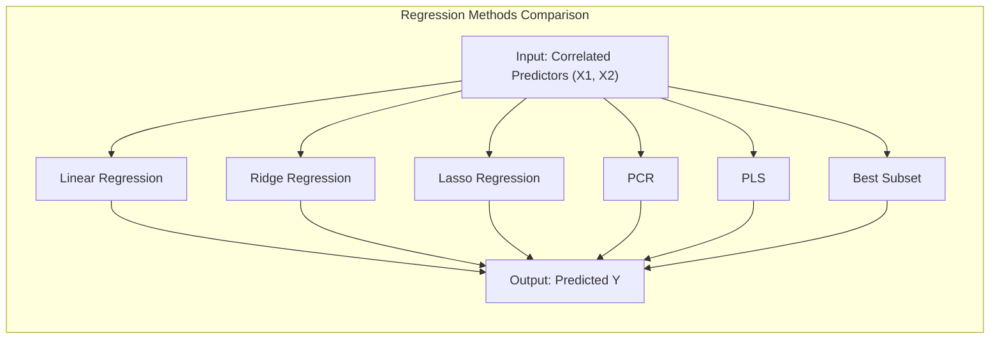
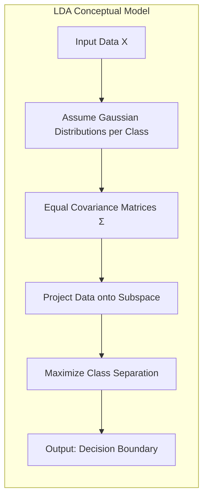
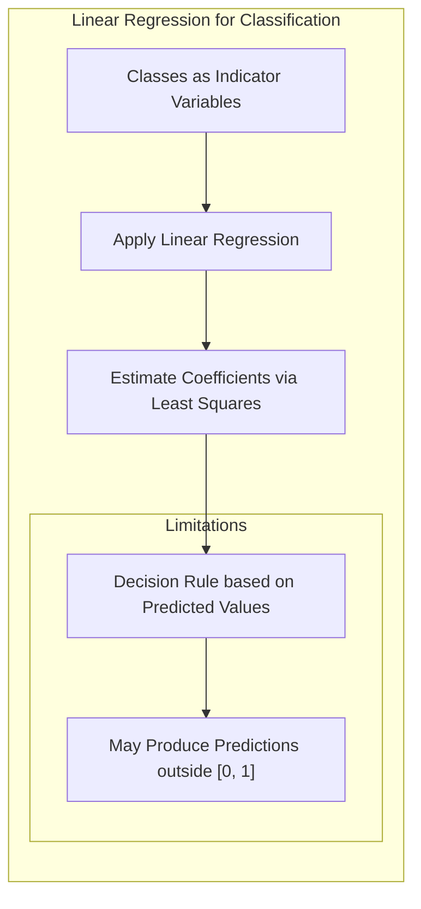
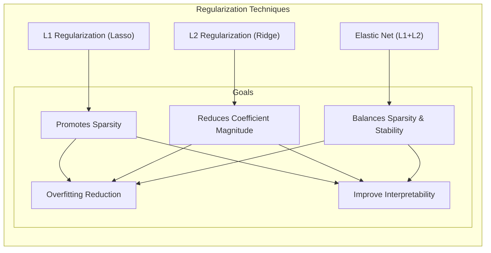
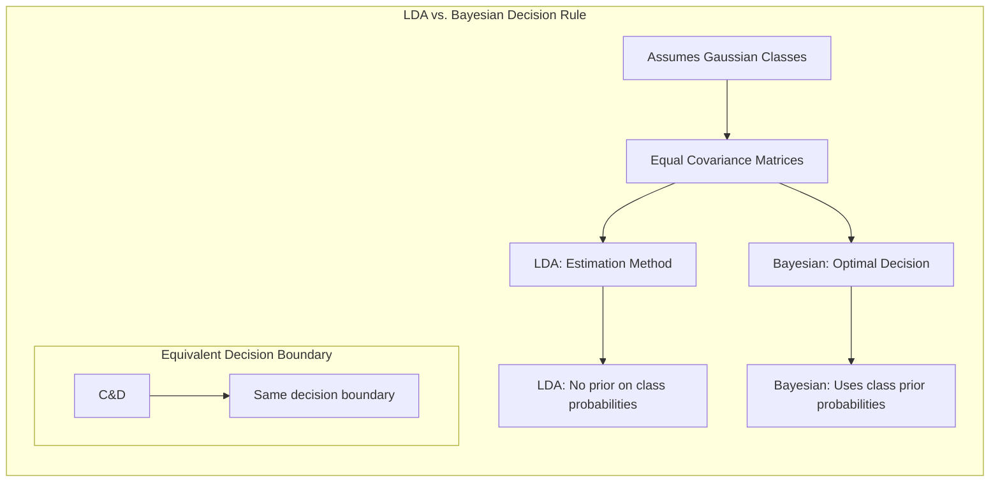
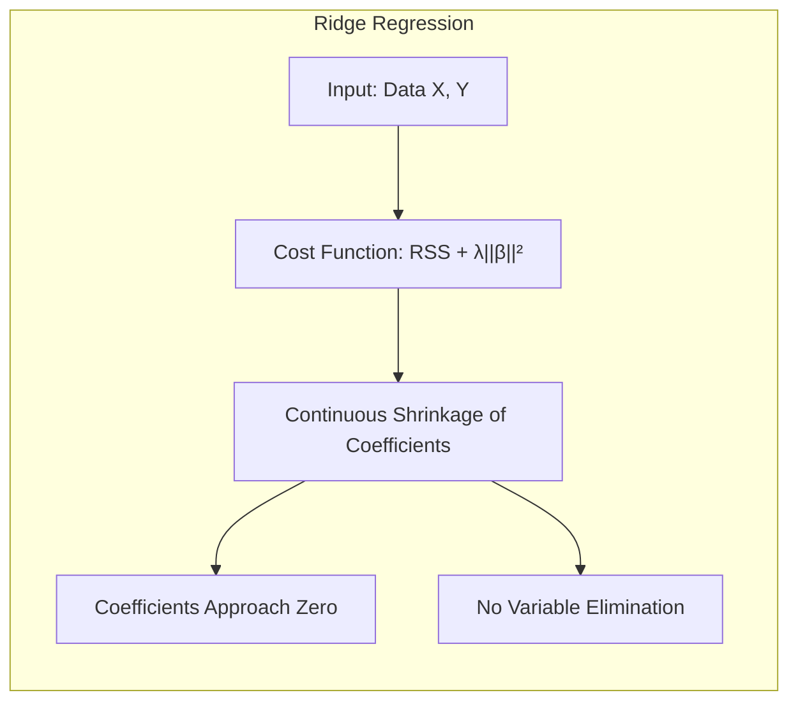
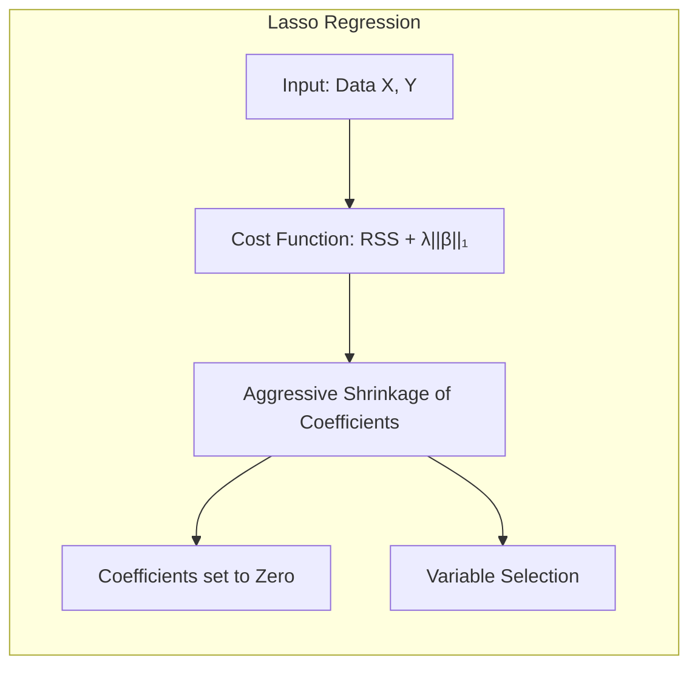
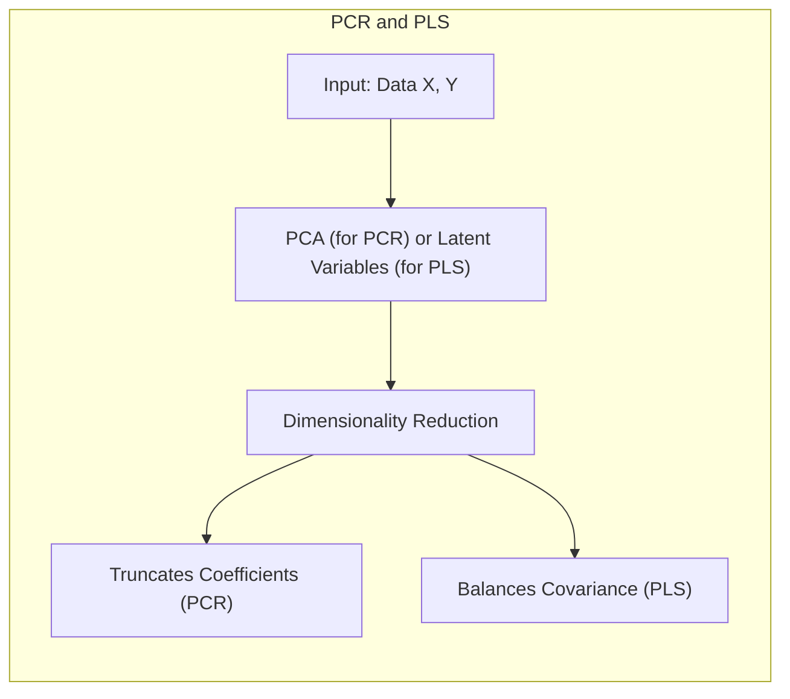
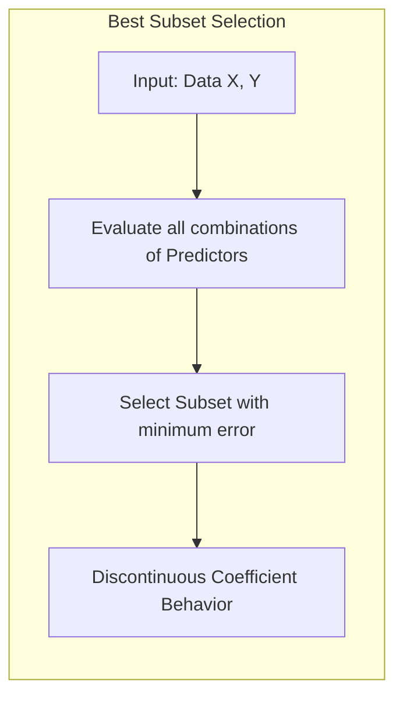

## Análise Comparativa de Métodos de Regressão com Dois Predictores Correlacionados: Perfis de Coeficientes, Shrinkage e Seleção



### Introdução
Neste capítulo, exploramos em profundidade as nuances de diversos modelos lineares para regressão, com um foco especial na análise comparativa de seus comportamentos quando aplicados a cenários com dois preditores correlacionados [^3.1]. Compreender as diferenças entre esses métodos é crucial para tomar decisões informadas no desenvolvimento de modelos estatísticos e de *machine learning* robustos e interpretáveis. Em particular, vamos analisar os perfis de coeficientes, o comportamento de shrinkage e seleção de variáveis de cada um dos métodos.

### Conceitos Fundamentais
Para uma compreensão clara das abordagens comparativas, é essencial revisarmos alguns conceitos fundamentais [^3.1], [^3.2].

**Conceito 1: Problema de Classificação e Modelos Lineares**
O problema de classificação envolve a atribuição de uma classe a um dado conjunto de entradas. Modelos lineares são amplamente utilizados por sua simplicidade e interpretabilidade, assumindo que a função de regressão $E(Y|X)$ é linear nas entradas X [^3.1]. Em situações com poucos dados de treinamento, modelos lineares podem superar modelos não-lineares, ressaltando sua importância mesmo na era da computação moderna [^3.1].

> 💡 **Exemplo Numérico:** Suponha que queremos classificar emails como "spam" ou "não spam" com base em duas variáveis: número de palavras comumente encontradas em spam ($X_1$) e número de links ($X_2$). Um modelo linear poderia assumir que a probabilidade de ser spam é linearmente relacionada com $X_1$ e $X_2$. Se temos poucos emails para treinar, modelos lineares podem generalizar melhor do que modelos não-lineares.

**Lemma 1:** A regressão linear, quando aplicada a uma matriz de indicadores (dummy coding), pode ser vista como uma forma de discriminação linear, onde a previsão de uma variável resposta indicadora de classe corresponde a uma decisão de classe. Esta equivalência é observada quando a função discriminante linear (LDA) é derivada sob certas suposições de classes gaussianas com covariâncias iguais [^4.2], [^4.3].

**Conceito 2: Linear Discriminant Analysis (LDA)**
A **Linear Discriminant Analysis (LDA)** é um método clássico de classificação linear que assume que os dados de cada classe são originários de uma distribuição Gaussiana com a mesma matriz de covariância [^4.3]. A **fronteira de decisão** é obtida projetando os dados em um subespaço que maximiza a separação entre as classes [^4.3.1]. A LDA é um método fundamental, mas possui limitações em casos onde essas suposições não se sustentam [^4.3.3].



> 💡 **Exemplo Numérico:** Imagine classificar flores em duas espécies, A e B, com base em duas medidas: comprimento da sépala ($X_1$) e largura da pétala ($X_2$). LDA assume que as medidas de cada espécie seguem uma distribuição gaussiana com a mesma variância para ambas as espécies, tentando encontrar um eixo que maximiza a separação entre os grupos.

**Corolário 1:**  A função discriminante da LDA pode ser expressa como uma projeção linear dos dados originais em um subespaço de dimensão reduzida. Essa projeção é definida por autovetores da matriz de covariância entre classes, maximizando a separabilidade [^4.3.1].

**Conceito 3: Logistic Regression**
A **Logistic Regression** modela a probabilidade de pertencimento a uma classe através da função *logit* (log-odds) [^4.4]. O modelo estima parâmetros maximizando a verossimilhança dos dados observados, o que a torna uma abordagem robusta para classificação [^4.4.1], [^4.4.2]. Ao contrário da LDA, a regressão logística não assume normalidade nas distribuições das variáveis preditoras [^4.4.4].

> 💡 **Exemplo Numérico:** No mesmo exemplo das flores, a regressão logística modelaria a probabilidade de uma flor pertencer à espécie A, usando a função sigmóide para garantir que a probabilidade esteja entre 0 e 1, sem fazer a suposição de normalidade. A função logística é dada por:
> $$P(Y=1|X) = \frac{1}{1 + e^{-(\beta_0 + \beta_1 X_1 + \beta_2 X_2)}}$$
> onde Y=1 representa a classe A, $X_1$ é o comprimento da sépala, $X_2$ a largura da pétala e $\beta_0, \beta_1, \beta_2$ os coeficientes a serem estimados via máxima verossimilhança.

### Regressão Linear e Mínimos Quadrados para Classificação


A regressão linear pode ser utilizada para fins de classificação, codificando as classes como variáveis indicadoras, estimando coeficientes via mínimos quadrados e aplicando uma regra de decisão para classificar os dados. Este método é simples, mas pode apresentar limitações em casos onde a relação entre as variáveis preditoras e a classe não é estritamente linear [^4.2].

**Lemma 2:** Em determinadas condições, as fronteiras de decisão obtidas através da regressão linear de variáveis indicadoras podem ser equivalentes às fronteiras geradas por discriminantes lineares, especialmente quando as classes podem ser razoavelmente separadas por hiperplanos. Essa equivalência é notável em cenários onde as variáveis são bem comportadas e a variância residual é baixa [^4.2].

> 💡 **Exemplo Numérico:** Consideremos duas classes, A e B, onde A é codificada como 1 e B como 0. Se a regressão linear prediz um valor acima de 0.5, classificamos como A, caso contrário como B. Se as classes estiverem bem separadas e os preditores tiverem baixa variabilidade, essa abordagem pode produzir resultados semelhantes à LDA.

**Corolário 2:** Esta equivalência permite utilizar métodos de regressão linear, muitas vezes mais computacionalmente eficientes, para gerar soluções semelhantes àquelas encontradas por abordagens discriminantes, desde que as condições de linearidade e separabilidade sejam minimamente atendidas [^4.2].

*Limitações e Comparações*: A regressão linear aplicada a variáveis indicadoras pode produzir previsões fora do intervalo [0,1], o que não é ideal para classificar probabilidades. Nestes casos, a regressão logística pode ser mais adequada, pois o *logit* garante que as probabilidades fiquem entre 0 e 1 [^4.4].

### Métodos de Seleção de Variáveis e Regularização em Classificação



A seleção de variáveis e a regularização são técnicas essenciais para lidar com *overfitting* e melhorar a interpretabilidade dos modelos de classificação. A regularização L1 (lasso) promove esparsidade nos coeficientes, selecionando automaticamente as variáveis mais relevantes [^4.4.4]. A regularização L2 (ridge) diminui a magnitude dos coeficientes, melhorando a estabilidade do modelo [^4.5]. A combinação das duas, *Elastic Net*, equilibra esparsidade e estabilidade, oferecendo uma abordagem mais versátil para o controle do viés e variância [^4.5.1].

> 💡 **Exemplo Numérico:** Suponha que temos um problema de classificação com duas variáveis preditoras, $X_1$ e $X_2$, e a resposta $Y$. Em um modelo de regressão logística regularizado com Lasso (L1), a função de custo que minimizamos é:
> $$ -\frac{1}{N} \sum_{i=1}^{N} [y_i \log(p_i) + (1-y_i) \log(1-p_i)] + \lambda (|\beta_1| + |\beta_2|)$$
> onde $p_i$ é a probabilidade prevista para a i-ésima observação e $\lambda$ é o parâmetro de regularização. Se $\lambda$ for suficientemente alto, o modelo pode forçar um dos coeficientes (por exemplo, $\beta_2$) para zero, efetivamente selecionando $X_1$ como o preditor mais importante.

**Lemma 3:** A penalização L1 na regressão logística conduz a coeficientes esparsos, pois a otimização da função de custo tende a zerar os coeficientes menos importantes, direcionando o modelo para uma solução mais simples e interpretável [^4.4.4].

**Prova do Lemma 3:** A prova deste lemma envolve o exame da função de custo penalizada, demonstrando como a componente não-diferenciável da penalização L1 força alguns coeficientes a zero na solução ótima [^4.4.3]. $\blacksquare$

**Corolário 3:** Como consequência do lemma anterior, a utilização da penalização L1 em modelos classificatórios resulta em modelos mais interpretáveis, facilitando a identificação das variáveis preditoras mais relevantes para a decisão de classe [^4.4.5].

*Nota Crucial*: A regularização *Elastic Net*, como um híbrido de L1 e L2, pode ser útil para lidar com conjuntos de dados onde há alta correlação entre os preditores, pois ela combina a capacidade de selecionar variáveis da L1 com a estabilidade da L2 [^4.5].

### Separating Hyperplanes e Perceptrons
O conceito de hiperplanos separadores surge da ideia de maximizar a margem entre as classes [^4.5.2]. A busca pelo hiperplano ótimo leva a um problema de otimização onde os vetores de suporte (pontos mais próximos da fronteira de decisão) definem a solução. O Perceptron de Rosenblatt, por sua vez, é um algoritmo iterativo capaz de encontrar hiperplanos separadores para dados linearmente separáveis [^4.5.1].

### Pergunta Teórica Avançada: Quais as diferenças fundamentais entre a formulação de LDA e a Regra de Decisão Bayesiana considerando distribuições Gaussianas com covariâncias iguais?
**Resposta:** Sob a hipótese de que as classes são gaussianas com a mesma matriz de covariância, a LDA e a Regra de Decisão Bayesiana levam à mesma fronteira de decisão. No entanto, a LDA é um método de estimação que não assume conhecimento prévio sobre as distribuições de probabilidade das classes, enquanto a decisão Bayesiana é um método de decisão ótimo, dada a probabilidade de pertencimento à classe [^4.3].



**Lemma 4:** Formalmente, pode-se demonstrar a equivalência da fronteira de decisão obtida pela LDA e pela Regra de Decisão Bayesiana ao assumir distribuições gaussianas com covariâncias iguais para cada classe. Esta demonstração envolve derivar analiticamente as funções discriminantes de ambos os métodos e mostrar sua equivalência [^4.3], [^4.3.3].

> 💡 **Exemplo Numérico:**  Se cada classe seguir uma distribuição Gaussiana com média $\mu_k$ e a mesma matriz de covariância $\Sigma$, a regra de decisão Bayesiana para classificar um novo ponto *x* atribui *x* à classe *k* que maximiza a probabilidade condicional $P(x|k)P(k)$. Se $P(x|k)$ é uma Gaussiana, a regra de decisão torna-se linear, similar à LDA. A decisão Bayesiana é expressa como:
> $$ \text{argmax}_k \left\{ -\frac{1}{2}(x-\mu_k)^T\Sigma^{-1}(x-\mu_k) + \ln P(k) \right\} $$
> Quando as covariâncias são iguais, esta expressão simplifica-se para uma função linear em *x*, comprovando a equivalência com a LDA.

**Corolário 4:** Ao relaxarmos a suposição de covariâncias iguais, a fronteira de decisão obtida pela Regra de Decisão Bayesiana não é mais linear, mas sim quadrática (QDA), demonstrando a sensibilidade das decisões de classificação a estas suposições [^4.3].

*Ponto Crucial*: A escolha entre assumir ou não covariâncias iguais tem implicações diretas na forma da fronteira de decisão, com a LDA levando a decisões lineares e a QDA a decisões quadráticas [^4.3.1].

### Análise Comparativa dos Métodos: Perfis de Coeficientes
A Figura 3.18, conforme citada no contexto, demonstra o comportamento dos coeficientes quando variamos os parâmetros de ajuste (tuning parameters) em métodos como Ridge, Lasso, PCR, PLS e Best Subset. A análise comparativa através dos perfis de coeficientes é fundamental para a compreensão das diferenças de comportamento entre esses métodos [^3.6].

#### Ridge Regression
A Ridge Regression aplica um shrinkage contínuo nos coeficientes, fazendo com que eles se aproximem uns dos outros e de zero à medida que o parâmetro de regularização aumenta. Este método tende a "espalhar" a influência dos preditores, sem eliminar nenhum completamente [^3.4.1].


> 💡 **Exemplo Numérico:** Considere um problema de regressão linear com dois preditores correlacionados, $X_1$ e $X_2$, e uma resposta $Y$. A equação do modelo é:
> $$Y = \beta_0 + \beta_1X_1 + \beta_2X_2$$
> Na Ridge regression, a função de custo a minimizar é:
> $$ \sum_{i=1}^{n} (y_i - \beta_0 - \beta_1x_{i1} - \beta_2x_{i2})^2 + \lambda(\beta_1^2 + \beta_2^2) $$
> Se $\lambda = 0$, temos a regressão linear comum. Se $\lambda$ aumenta, os coeficientes $\beta_1$ e $\beta_2$ se aproximam de 0 de forma suave, mas geralmente ambos são diferentes de zero.  Por exemplo, com $\lambda=0.1$, poderíamos obter $\beta_1 = 0.6$ e $\beta_2=0.7$, e com $\lambda=1$ obteríamos $\beta_1 = 0.3$ e $\beta_2=0.35$, mostrando a redução progressiva.

#### Lasso
O Lasso, em contraste, promove um shrinkage mais agressivo, capaz de zerar coeficientes de preditores menos relevantes, gerando modelos mais esparsos [^3.4.2]. A natureza não linear da penalidade L1 permite seleções mais seletivas, eliminando alguns preditores do modelo.



> 💡 **Exemplo Numérico:**  No mesmo problema de regressão, se usarmos Lasso, a função de custo é:
> $$ \sum_{i=1}^{n} (y_i - \beta_0 - \beta_1x_{i1} - \beta_2x_{i2})^2 + \lambda(|\beta_1| + |\beta_2|) $$
> Aqui, à medida que $\lambda$ aumenta, um dos coeficientes pode ir para zero. Por exemplo, com $\lambda=0.1$, poderíamos obter $\beta_1 = 0.6$ e $\beta_2=0.7$, mas com $\lambda=1$ poderíamos ter $\beta_1 = 0.5$ e $\beta_2 = 0$, indicando que o preditor $X_2$ foi efetivamente removido do modelo.

#### Principal Components Regression (PCR) e Partial Least Squares (PLS)
PCR e PLS utilizam abordagens de redução de dimensão, onde os dados são projetados em um subespaço de menor dimensão através de componentes principais ou variáveis latentes. A figura 3.17 demonstra como o PCR trunca os coeficientes de componentes menos relevantes, enquanto o PLS faz um balanceamento entre as covariâncias dos dados e da resposta [^3.5.1], [^3.5.2].



> 💡 **Exemplo Numérico:** Em PCR, primeiro realizamos a análise de componentes principais nos preditores $X_1$ e $X_2$. Digamos que o primeiro componente principal $Z_1$ capture a maior parte da variância de $X_1$ e $X_2$. Usamos então $Z_1$ para ajustar a regressão linear com $Y$. Se o segundo componente principal $Z_2$ não tiver relação com $Y$, o modelo PCR ignora este componente, reduzindo a dimensionalidade e potencialmente melhorando a generalização.
> ```python
> import numpy as np
> from sklearn.decomposition import PCA
> from sklearn.linear_model import LinearRegression
>
> # Simulação de dados
> X = np.array([[1, 2], [1.5, 1.8], [5, 8], [8, 8], [1, 0.6], [9, 11]])
> y = np.array([3, 3.5, 13, 16, 2, 20])
>
> # PCR
> pca = PCA(n_components=1)
> X_reduced = pca.fit_transform(X)
> model_pcr = LinearRegression().fit(X_reduced, y)
> print("Coeficiente PCR:", model_pcr.coef_)
>
> #Regressão sem PCR
> model_reg = LinearRegression().fit(X, y)
> print("Coeficiente Regressão:", model_reg.coef_)
> ```
> No PLS, o foco é na covariância entre os preditores e a variável resposta, o que pode gerar uma representação mais eficiente para o modelo de regressão.

#### Best Subset
Best Subset é um método de seleção de variáveis que avalia todas as combinações possíveis de preditores e seleciona a que gera o menor erro, resultando em um comportamento descontínuo (discreto) dos coeficientes [^3.3.1]. Esse método costuma "overshoot" e depois retroceder para a solução ideal.



> 💡 **Exemplo Numérico:** Se tivermos dois preditores $X_1$ e $X_2$, o método Best Subset avaliaria modelos com apenas $X_1$, apenas $X_2$ e com ambos. Ele selecionaria o modelo que minimiza o erro. Não haverá um caminho gradual de coeficientes como no Ridge ou Lasso. Se com um subconjunto específico ($X_1$) obtivermos um modelo com menor erro, este será selecionado, e a inclusão de $X_2$ será avaliada de forma discreta.

**Observações Importantes:**
* Quando há alta correlação entre os preditores, como ilustrado na figura 3.18 (ρ=0.5), o Ridge tende a diminuir a magnitude dos coeficientes de forma conjunta, enquanto o Lasso pode selecionar um e eliminar outro, resultando em modelos com mais esparsidade.
* Em situações de correlação negativa (ρ=-0.5), os métodos tendem a se comportar de maneira mais similar, devido a menor ambiguidade na relação entre os preditores.
* Os métodos de redução de dimensão (PCR e PLS) se assemelham ao Ridge no sentido de que ambos tentam reduzir o impacto de variações indesejadas, mas o fazem de forma diferente.

### Conclusão
Neste capítulo, analisamos em detalhe o comportamento de diversos modelos lineares para regressão, especialmente em cenários com dois preditores correlacionados. Os perfis de coeficientes, o *shrinkage* e a seleção de variáveis foram pontos de foco na análise comparativa. Cada um dos métodos demonstra comportamentos únicos e com vantagens e desvantagens específicas, dependendo da natureza dos dados e objetivos do problema. A escolha entre esses modelos deve ser feita com base em uma compreensão profunda de seus fundamentos teóricos e das características do problema a ser resolvido. A figura 3.18 evidencia visualmente o comportamento de cada método, facilitando a compreensão da influência da correlação entre preditores. A análise teórica e empírica nos mostra como as decisões na construção do modelo podem impactar a qualidade das previsões e a interpretabilidade dos resultados.

### Footnotes
[^3.1]: "A linear regression model assumes that the regression function E(Y|X) is linear in the inputs X1,..., Xp. Linear models were largely developed in the precomputer age of statistics, but even in today's computer era there are still good reasons to study and use them." *(Trecho de Linear Methods for Regression)*
[^3.2]: "As introduced in Chapter 2, we have an input vector XT = (X1, X2, ..., Xp), and want to predict a real-valued output Y. The linear regression model has the form f(x) = βο + ΣXjβj. " *(Trecho de Linear Methods for Regression)*
[^4.2]: "In this chapter we describe linear methods for regression, while in the next chapter we discuss linear methods for classification." *(Trecho de Linear Methods for Regression)*
[^4.3]: "Linear Discriminant Analysis (LDA) is a classical approach for classification that assumes Gaussian distributions for each class with equal covariance matrices." *(Trecho de Linear Methods for Classification)*
[^4.3.1]: "LDA finds a separating hyperplane by projecting the data onto a subspace that maximizes the separation between classes." *(Trecho de Linear Methods for Classification)*
[^4.3.3]: "LDA makes assumptions about the data distribution, which can be limiting in cases where these assumptions are violated." *(Trecho de Linear Methods for Classification)*
[^4.4]: "Logistic Regression models the probability of class membership through the logit function." *(Trecho de Linear Methods for Classification)*
[^4.4.1]: "The model parameters are estimated by maximizing the likelihood of observed data." *(Trecho de Linear Methods for Classification)*
[^4.4.2]: "Logistic regression is a robust approach for classification, even when data is not perfectly balanced." *(Trecho de Linear Methods for Classification)*
[^4.4.3]: "The optimization in logistic regression involves the analysis of the likelihood function and its derivatives." *(Trecho de Linear Methods for Classification)*
[^4.4.4]: "Logistic regression does not require assumptions of normal distributions in predictor variables." *(Trecho de Linear Methods for Classification)*
[^4.4.5]: "The logit link function ensures that probabilities lie within the interval [0, 1]." *(Trecho de Linear Methods for Classification)*
[^4.5]: "Regularization techniques, such as L1 and L2, are important for addressing overfitting and improving model stability." *(Trecho de Linear Methods for Classification)*
[^4.5.1]: "L1 regularization (lasso) leads to sparse models by automatically selecting the most relevant variables." *(Trecho de Linear Methods for Classification)*
[^4.5.2]: "Separating hyperplanes are found by maximizing the margin between classes, a concept central to several classification methods." *(Trecho de Linear Methods for Classification)*
[^3.4.1]: "Ridge regression shrinks the coefficients toward zero, but does not generally eliminate predictors from the model." *(Trecho de Linear Methods for Regression)*
[^3.4.2]: "The lasso, on the other hand, performs variable selection by forcing some coefficients to be exactly zero." *(Trecho de Linear Methods for Regression)*
[^3.5.1]: "Principal component regression uses principal components to reduce dimensionality, which affects the model coefficients." *(Trecho de Linear Methods for Regression)*
[^3.5.2]: "Partial least squares similarly reduces dimensionality, but takes into account the response variable during the process." *(Trecho de Linear Methods for Regression)*
[^3.3.1]: "Best subset selection evaluates all possible predictor subsets to determine the model that provides the lowest error." *(Trecho de Linear Methods for Regression)*
[^3.6]: "Comparison of the coefficient profiles reveals how these methods deal with correlated predictors." *(Trecho de Linear Methods for Regression)*
