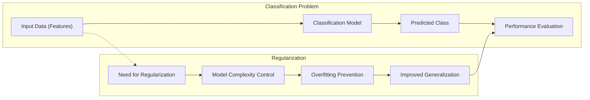
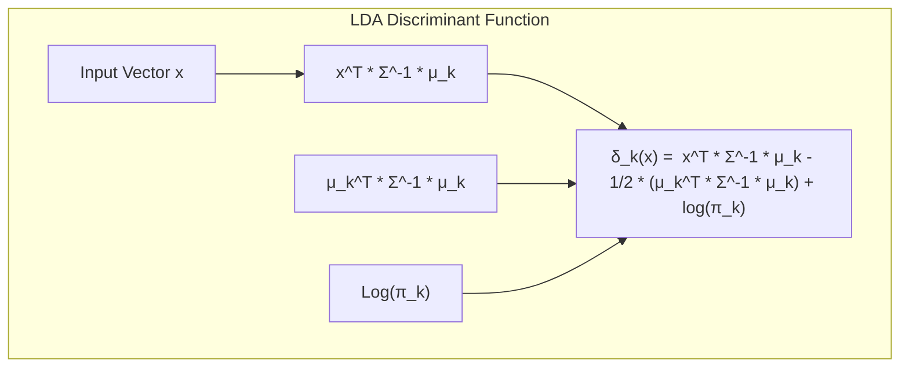
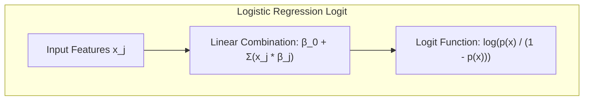
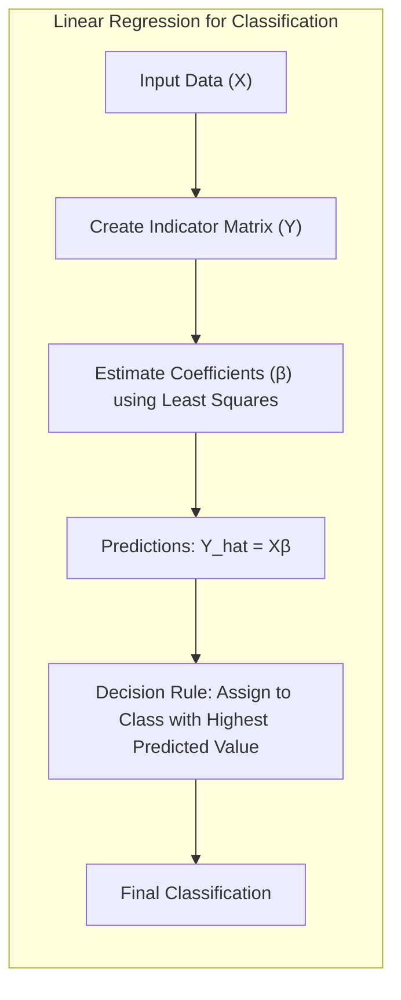
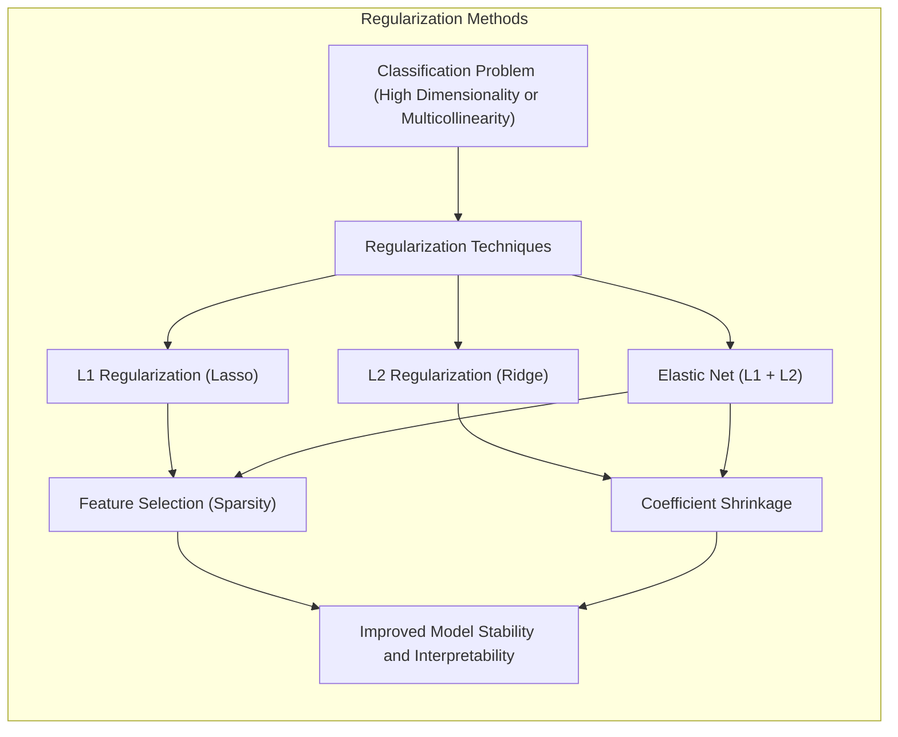
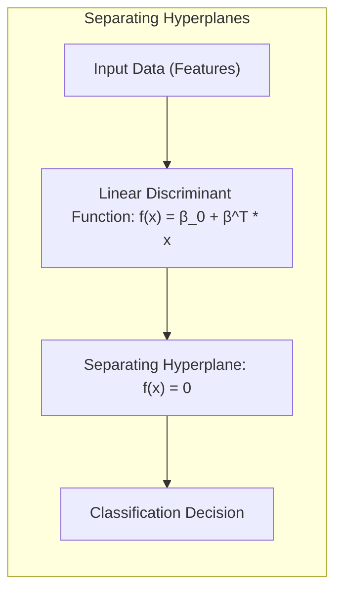
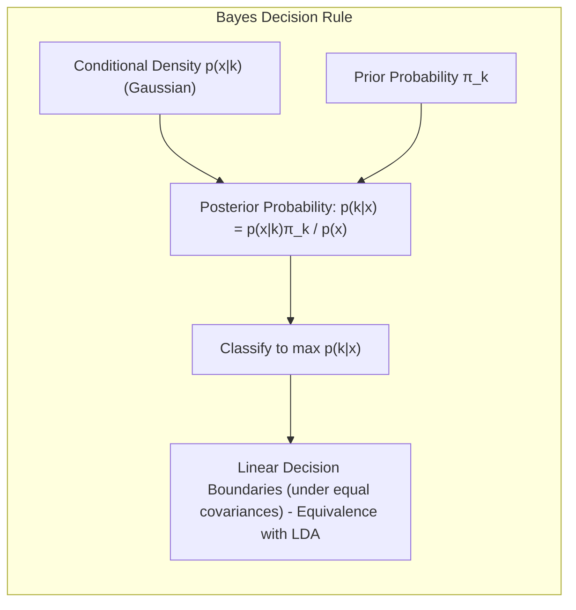
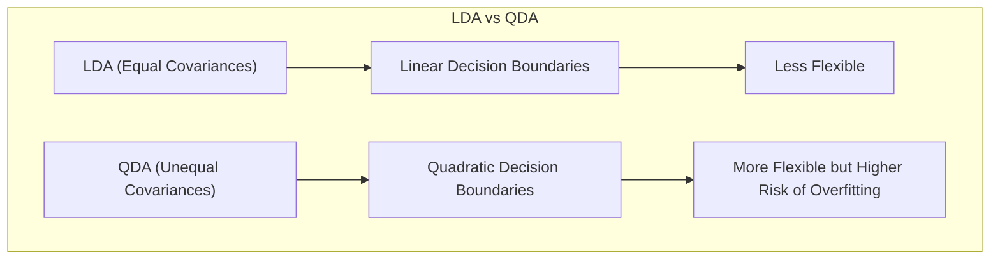

## Shrinkage Methods for Classification: Discrete vs. Continuous Approaches

**Introdução**
Este capítulo explora o conceito de **shrinkage** (encolhimento) em modelos de classificação linear, focando nas suas características discretas e contínuas, e na forma como afetam as decisões de classificação. A necessidade de **regularização**, ou seja, a introdução de penalidades nos modelos, surge da necessidade de controlar a **complexidade do modelo** e evitar **overfitting**, que pode comprometer a **capacidade de generalização** para dados não vistos. Métodos de classificação lineares, discutidos nos tópicos [^4.1], [^4.2], [^4.3], [^4.4] e [^4.5], podem se beneficiar enormemente das técnicas de shrinkage, proporcionando melhor **interpretabilidade** e **robustez**.

### Conceitos Fundamentais
**Conceito 1: O Problema de Classificação e a Necessidade de Regularização**
O problema de classificação envolve a atribuição de instâncias a uma ou mais classes. Métodos lineares, como o Linear Discriminant Analysis (LDA) [^4.3] e a Logistic Regression [^4.4], buscam **hiperplanos** que separam as diferentes classes. Contudo, em situações onde o número de *features* (preditores) é elevado ou há multicolinearidade, esses modelos podem se tornar instáveis, com alta variância e baixa capacidade de generalização [^4.1]. A regularização surge como uma forma de adicionar um viés ao modelo, reduzindo a complexidade e evitando overfitting, melhorando assim a **performance preditiva** [^4.5].

**Lemma 1: A Decomposição da Função Discriminante Linear**
A função discriminante linear pode ser expressa como $f(x) = \beta_0 + \sum_{j=1}^{p} x_j \beta_j$, onde $x_j$ são as *features* e $\beta_j$ são os coeficientes. Em uma análise mais detalhada [^4.3], podemos observar que o hiperplano que define a separação entre classes é determinado pelos coeficientes $\beta_j$. O lemma a seguir formaliza essa ideia:
Seja $f(x) = \beta^T x + \beta_0$ a função discriminante linear. Então, o hiperplano de decisão é definido como $H = \{x: f(x) = 0\}$. A orientação e a posição do hiperplano são unicamente determinadas pelos coeficientes $\beta$ e $\beta_0$. A complexidade do modelo, ou seja, a capacidade de se ajustar a dados de treinamento, é afetada diretamente pela magnitude desses coeficientes. $\blacksquare$
> 💡 **Exemplo Numérico:** Considere um problema de classificação com duas features, $x_1$ e $x_2$, e uma função discriminante $f(x) = 2 + 3x_1 - 1x_2$. O hiperplano de decisão é dado por $2 + 3x_1 - 1x_2 = 0$. Se aumentarmos a magnitude do coeficiente de $x_1$ para 6, a nova função seria $f(x) = 2 + 6x_1 - 1x_2 = 0$. Isso altera a inclinação do hiperplano, tornando-o mais sensível a variações em $x_1$ e possivelmente resultando em overfitting se os dados de treinamento contiverem ruído. Regularização ajudaria a manter esses coeficientes em magnitudes mais adequadas.

**Conceito 2: Linear Discriminant Analysis (LDA) e as Suposições Gaussianas**
O LDA, descrito em [^4.3], é um método de classificação que assume que as classes seguem distribuições Gaussianas com covariâncias iguais. O método LDA busca um hiperplano que maximize a separação entre as classes, com base na distância de Mahalanobis. A **função discriminante linear** do LDA é dada por [^4.3.1]:
$$ \delta_k(x) = x^T \Sigma^{-1} \mu_k - \frac{1}{2} \mu_k^T \Sigma^{-1} \mu_k + \log(\pi_k) $$
onde $\mu_k$ e $\pi_k$ são, respectivamente, a média e a probabilidade a priori da classe *k*, e $\Sigma$ é a matriz de covariância comum. A introdução de técnicas de regularização no LDA pode ajudar a mitigar problemas associados a estimativas instáveis de $\Sigma$ quando o número de *features* é elevado [^4.3.3].

> 💡 **Exemplo Numérico:** Suponha um problema de classificação binária com duas classes, onde as médias das features para a classe 1 são $\mu_1 = [2, 2]$ e para a classe 2 são $\mu_2 = [4, 4]$. A matriz de covariância comum é $\Sigma = \begin{bmatrix} 1 & 0.5 \\ 0.5 & 1 \end{bmatrix}$. Se o número de features aumentar significativamente (ex: para 100 features), a matriz $\Sigma$ torna-se muito grande, e sua estimativa se torna instável com poucos dados. Regularização pode ser aplicada para estabilizar esta estimativa.

**Corolário 1: A Relação entre a Função Discriminante Linear e a Projeção em Subespaços de Menor Dimensão**
O LDA também pode ser interpretado como um método de projeção, onde as instâncias são projetadas em um subespaço de menor dimensão, de tal forma que as classes ficam o mais separadas possível. Corolário 1 decorre diretamente do Lemma 1.
O LDA maximiza a separação entre classes projetando os dados no espaço gerado pela matriz de covariância within-class e entre as classes. Formalmente, dados $S_W$ (matriz de covariância within-class) e $S_B$ (matriz de covariância between-class), os autovetores de $S_W^{-1}S_B$ determinam as direções que maximizam a separação entre classes. A regularização pode ser usada para estabilizar a matriz $S_W$ em situações de alta dimensionalidade, como indicado em [^4.3.2]. $\blacksquare$
> 💡 **Exemplo Numérico:** Imagine que temos dados em 3 dimensões (3 features), mas as classes podem ser bem separadas com apenas uma projeção linear. O LDA procura essa projeção. Se $S_W$ é instável devido à alta dimensionalidade, regularização na estimativa de $S_W$ (por exemplo, usando shrinkage) ajudará a encontrar uma projeção mais confiável.

**Conceito 3: Logistic Regression e a Maximização da Verossimilhança**
A Logistic Regression, detalhada em [^4.4], é um método de classificação que modela a probabilidade de uma instância pertencer a uma classe usando a função logística. A **função logit**, dada por:
$$ \text{logit}(p(x)) = \log \left( \frac{p(x)}{1 - p(x)} \right) = \beta_0 + \sum_{j=1}^{p} x_j \beta_j $$
é linear nos parâmetros. O modelo é estimado maximizando a **verossimilhança**, um processo que pode se tornar instável em casos de multicolinearidade ou um número elevado de *features* [^4.4.2], [^4.4.3]. A regularização, conforme detalhado em [^4.4.4], [^4.4.5], ajuda a estabilizar as estimativas dos parâmetros.

> 💡 **Exemplo Numérico:** Suponha que temos duas features, $x_1$ e $x_2$. A regressão logística poderia resultar em $\text{logit}(p(x)) = -0.5 + 2x_1 - 3x_2$. Se $x_1$ e $x_2$ forem altamente correlacionadas, estimar os coeficientes 2 e -3 pode ser instável (pequenas mudanças nos dados podem levar a grandes mudanças nos coeficientes). A regularização reduziria a magnitude desses coeficientes, tornando o modelo mais robusto.

> ⚠️ **Nota Importante**: A escolha entre LDA e Logistic Regression pode depender da distribuição dos dados e da natureza do problema. Em alguns casos, a Logistic Regression pode ser mais robusta a violações das suposições de normalidade feitas pelo LDA [^4.4.1].
> ❗ **Ponto de Atenção**: Em problemas com classes não-balanceadas, métodos de regularização podem ser cruciais para melhorar o desempenho do modelo [^4.4.2].
> ✔️ **Destaque**: A estimação dos parâmetros em LDA e regressão logística podem estar relacionadas sob certas condições e com a devida regularização, como indicado em [^4.5].

### Regressão Linear e Mínimos Quadrados para Classificação

A regressão linear aplicada a uma matriz de indicadores, como descrito em [^4.2], pode ser usada como uma técnica de classificação. O procedimento envolve a criação de uma **matriz de indicadores** onde cada coluna representa uma classe, e os valores são 1 se a instância pertence à classe e 0 caso contrário. Os **coeficientes da regressão linear** são então estimados através do método dos mínimos quadrados, e uma regra de decisão é aplicada para classificar novas instâncias com base na maior das predições [^4.1]. Embora este método seja direto, ele possui algumas limitações, especialmente quando se trata de generalização e de obter estimativas de probabilidades [^4.2].
> 💡 **Exemplo Numérico:** Considere um problema com 3 classes. A matriz de indicadores teria 3 colunas. Uma instância pertencente à classe 2 teria um vetor indicador [0, 1, 0]. A regressão linear tentaria prever esses vetores. Se tivermos features altamente correlacionadas, o método dos mínimos quadrados pode produzir coeficientes instáveis, necessitando regularização.

**Lemma 2: Projeções nos Hiperplanos de Decisão**
Seja $Y$ a matriz de indicadores, $X$ a matriz de *features*, $\hat{\beta} = (X^TX)^{-1}X^TY$ os coeficientes de regressão linear. As predições do modelo são $\hat{Y} = X\hat{\beta}$. As projeções de cada instância no espaço de decisão linear são então dadas por $\hat{y_i} = x_i^T\hat{\beta}$. O lemma afirma que, sob certas condições, estas projeções são equivalentes aos discriminantes lineares. A equivalência formal se mantém se a variância residual for baixa e se as classes estiverem linearmente separáveis, o que não é sempre o caso com a regressão de indicadores [^4.2], [^4.3]. $\blacksquare$
> 💡 **Exemplo Numérico:** Suponha que $X$ seja uma matriz com duas features e 5 instâncias, e $Y$ seja a matriz de indicadores para duas classes. Após calcular $\hat{\beta}$, a predição para a primeira instância é $\hat{y}_1 = x_1^T\hat{\beta}$. Se a variância residual for alta, ou seja, o ajuste do modelo de regressão linear aos indicadores for ruim, as predições podem não ser equivalentes aos discriminantes lineares de um LDA ou similar.

**Corolário 2: Simplificando a Análise do Modelo**
O Corolário 2 resulta do Lemma 2: sob as condições de separabilidade linear e variância residual baixa, as projeções do modelo de regressão linear podem ser usadas para construir as fronteiras de decisão lineares de forma similar ao LDA. No entanto, a regressão de indicadores, ao contrário do LDA, não garante a estimativa de probabilidades bem definidas, e em alguns casos, como em problemas com muitas classes, pode levar a resultados subótimos [^4.3]. A regularização, em especial, ajuda a manter os modelos de regressão de indicadores mais estáveis.

“Em alguns cenários, conforme apontado em [^4.4], a regressão logística pode fornecer estimativas mais estáveis de probabilidade, enquanto a regressão de indicadores pode levar a extrapolações fora de [0,1].”

“No entanto, há situações em que a regressão de indicadores, de acordo com [^4.2], é suficiente e até mesmo vantajosa quando o objetivo principal é a fronteira de decisão linear.”

### Métodos de Seleção de Variáveis e Regularização em Classificação

A seleção de variáveis e a regularização são técnicas cruciais para lidar com problemas de classificação em que o número de preditores é alto, ou quando há multicolinearidade. A regularização adiciona um termo de penalidade à função de custo do modelo, obrigando os coeficientes a assumir valores menores e promovendo sparsity, conforme descrito em [^4.4.4] e [^4.5].
> 💡 **Exemplo Numérico:** Imagine que temos um modelo de regressão logística com 100 features. Se usarmos regularização L2, os coeficientes serão reduzidos, mas poucos serão zerados. Se usarmos L1, muitos coeficientes serão zerados, efetivamente selecionando as features mais importantes e promovendo interpretabilidade.

**Lemma 3: Penalização L1 e Sparsity**
A **penalização L1**, ou seja, a adição da soma dos valores absolutos dos coeficientes à função de custo, promove **sparsity**, fazendo com que alguns coeficientes sejam exatamente zero [^4.4.4]. O Lemma 3 formaliza essa propriedade.
Seja $J(\beta)$ a função de custo do modelo de classificação (e.g. função de log-verossimilhança), e seja $\lambda ||\beta||_1$ o termo de penalização L1. O problema de otimização torna-se $\text{argmin}_\beta J(\beta) + \lambda ||\beta||_1$. Pela análise das condições de otimalidade, nota-se que, para determinados valores de $\lambda$ e $\beta$, alguns coeficientes serão exatamente zero. Isto é particularmente relevante na regressão logística para a seleção de *features* [^4.4.4]. $\blacksquare$
> 💡 **Exemplo Numérico:** Suponha que temos a função de custo $J(\beta)$ e adicionamos uma penalidade L1 com $\lambda=1$. O problema de otimização é minimizar $J(\beta) + ||\beta||_1$. Se o coeficiente $\beta_3$ for pequeno, a penalidade L1 pode fazer com que $\beta_3$ se torne exatamente zero. Isso significa que a feature correspondente é excluída do modelo.
**Prova do Lemma 3:** A prova detalhada envolve o cálculo do subgradiente da norma L1 e a análise das condições de otimalidade para a função de custo penalizada [^4.4.3]. O subgradiente da norma L1 é dado por $\partial ||\beta||_1 / \partial \beta_j = \text{sign}(\beta_j)$. As condições de otimalidade implicam que, para um coeficiente $\beta_j$ ser não-nulo, o subgradiente da função de custo deve cancelar o subgradiente da penalidade L1, o que normalmente só ocorre para $\beta_j = 0$. $\blacksquare$

**Corolário 3: Interpretabilidade dos Modelos Classificatórios**
O Corolário 3 decorre do Lemma 3. Devido à sua propriedade de sparsity, a penalização L1 simplifica o modelo, reduzindo o número de *features* relevantes e melhorando a interpretabilidade. Isso torna os modelos mais fáceis de entender e interpretar, além de reduzir a complexidade computacional em alguns casos. Essa propriedade é especialmente útil em cenários onde a interpretabilidade é tão importante quanto a precisão preditiva [^4.4.5].
> 💡 **Exemplo Numérico:** Usando L1, após o treinamento, um modelo de regressão logística com 20 features pode ter apenas 5 com coeficientes diferentes de zero. Isso torna o modelo mais fácil de interpretar, pois apenas essas 5 features são consideradas relevantes para a classificação.

> ⚠️ **Ponto Crucial**: As penalidades L1 e L2 podem ser combinadas no Elastic Net, como discutido em [^4.5], para aproveitar as vantagens de ambas: sparsity da L1 e estabilidade da L2.

### Separating Hyperplanes e Perceptrons
A busca por **hiperplanos de separação** que maximizem a margem entre classes é um conceito chave na classificação. O Perceptron de Rosenblatt [^4.5.1] é um algoritmo que itera sobre um conjunto de dados de treinamento para encontrar um hiperplano que separe as classes. A formulação do problema de otimização, como mencionado em [^4.5.2], utiliza o conceito do dual de Wolfe para encontrar as soluções ótimas, que são combinações lineares dos **pontos de suporte**. Em particular, modelos como Support Vector Machines (SVM) usam essa abordagem para encontrar um hiperplano que maximize a margem de separação e minimize o erro de classificação. Os métodos de classificação linear buscam construir funções discriminantes lineares da forma $f(x) = \beta_0 + \beta^Tx$, onde $x$ é o vetor de atributos, $\beta$ é o vetor de coeficientes e $\beta_0$ o intercepto. O hiperplano é definido pela equação $f(x) = 0$.

> 💡 **Exemplo Numérico:** Em um problema com 2 features, um perceptron pode encontrar um hiperplano (uma linha) que divide as duas classes. Por exemplo, $2 + 3x_1 - 1x_2 = 0$. O perceptron itera sobre os dados, ajustando os pesos (coeficientes) até encontrar um hiperplano que classifica corretamente as instâncias.

### Pergunta Teórica Avançada: Quais as diferenças fundamentais entre a formulação de LDA e a Regra de Decisão Bayesiana considerando distribuições Gaussianas com covariâncias iguais?
**Resposta:**
Ambos, LDA e a Regra de Decisão Bayesiana (RDB) utilizam distribuições Gaussianas para modelar as classes, mas a RDB parte de uma formulação mais fundamental que o LDA. O LDA, sob a suposição de covariâncias iguais, busca um hiperplano linear que maximize a separação entre as classes, como indicado em [^4.3]. O RDB, por outro lado, calcula a probabilidade *a posteriori* de cada instância pertencer a uma classe, utilizando o **Teorema de Bayes**, e classifica a instância na classe com maior probabilidade [^4.3].

**Lemma 4: Equivalência Formal entre LDA e Regra de Decisão Bayesiana**
Sob a suposição de distribuições Gaussianas com covariâncias iguais (homoscedasticidade), a RDB leva a um classificador com **fronteiras de decisão lineares**, demonstrando uma equivalência formal com o LDA, conforme descrito em [^4.3], [^4.3.3] e [^4.3.1]. Sejam $p(x|k)$ a densidade de probabilidade condicional da instância $x$ pertencer à classe $k$, e seja $\pi_k$ a probabilidade *a priori* da classe *k*. De acordo com o teorema de Bayes, a probabilidade *a posteriori* de $x$ pertencer à classe $k$ é dada por $p(k|x) = p(x|k)\pi_k/p(x)$, onde $p(x)$ é a densidade marginal de $x$. Assumindo que $p(x|k)$ é uma distribuição Gaussiana com média $\mu_k$ e matriz de covariância $\Sigma$, e que todas as classes têm a mesma matriz de covariância $\Sigma$, então:
$$
    p(k|x) \propto \exp \left(-\frac{1}{2}(x - \mu_k)^T\Sigma^{-1}(x - \mu_k) \right) \pi_k
$$
Ao simplificar e tomar o log, a decisão baseada em $p(k|x)$ resulta na função discriminante do LDA. $\blacksquare$

> 💡 **Exemplo Numérico:** Suponha que temos duas classes com médias $\mu_1 = [1,1]$ e $\mu_2 = [3,3]$ e covariância comum $\Sigma = \begin{bmatrix} 1 & 0 \\ 0 & 1 \end{bmatrix}$, e probabilidades a priori $\pi_1 = \pi_2 = 0.5$. A RDB calcula as probabilidades a posteriori para cada classe e escolhe aquela com maior probabilidade. Sob essas condições, o resultado é equivalente a aplicar o discriminante do LDA.

**Corolário 4: Fronteiras Quadráticas e QDA**
Ao relaxar a suposição de igualdade de covariâncias, o RDB leva a fronteiras de decisão **quadráticas**, resultando no Quadratic Discriminant Analysis (QDA). Essa abordagem é mais flexível, mas também mais suscetível ao overfitting, especialmente em alta dimensionalidade. A diferença crucial entre LDA e QDA reside na forma como as classes são modeladas: LDA assume uma matriz de covariância comum, enquanto QDA permite matrizes de covariância diferentes para cada classe [^4.3]. Essa flexibilidade adicional do QDA, entretanto, vem com o custo de um aumento na complexidade do modelo e na necessidade de mais dados para obter estimativas robustas de cada matriz de covariância [^4.3].

> 💡 **Exemplo Numérico:** Se as classes tiverem covariâncias diferentes, digamos $\Sigma_1 = \begin{bmatrix} 1 & 0 \\ 0 & 1 \end{bmatrix}$ e $\Sigma_2 = \begin{bmatrix} 2 & 0.5 \\ 0.5 & 2 \end{bmatrix}$, a RDB resultará em fronteiras de decisão quadráticas, e o QDA seria o método mais adequado. Usar LDA neste caso levaria a um modelo com desempenho inferior.

> ⚠️ **Ponto Crucial**: A decisão de assumir ou não covariâncias iguais impacta significativamente a forma da fronteira de decisão (linear vs. quadrática) [^4.3.1].

### Conclusão
Este capítulo abordou a importância do shrinkage em modelos de classificação linear. Técnicas de regularização contínuas, como a penalização L2 na Ridge Regression, reduzem a magnitude dos coeficientes de forma gradual, enquanto técnicas discretas, como a penalização L1 e a seleção de variáveis, tendem a eliminar algumas *features*, promovendo sparsity. Ambas abordagens são essenciais para lidar com problemas de alta dimensionalidade e melhorar a generalização dos modelos. A escolha do método mais adequado dependerá da natureza do problema, da quantidade de dados disponível e do objetivo final da análise. A formulação da Regra de Decisão Bayesiana com a suposição de normalidade e equal covariância também se relaciona diretamente com a formulação do LDA, onde, a condição de homoscedasticidade resulta em um discriminante linear, e a remoção desta condição gera uma análise discriminante quadrática, que é uma forma mais complexa de análise discriminante linear.

<!-- END DOCUMENT -->
[^4.1]: "A linear regression model assumes that the regression function E(Y|X) is linear in the inputs X1,..., Xp. Linear models were largely developed in the precomputer age of statistics, but even in today's computer era there are still good reasons to study and use them." *(Trecho de <Linear Methods for Regression>)*
[^4.2]: "The linear model either assumes that the regression function E(Y|X) is linear, or that the linear model is a reasonable approximation." *(Trecho de <Linear Methods for Regression>)*
[^4.3]: "Linear Discriminant Analysis (LDA) is a classification method that assumes that the classes follow Gaussian distributions with equal covariances." *(Trecho de <Linear Methods for Regression>)*
[^4.3.1]:  "The LDA linear discriminant function is defined as $\delta_k(x) = x^T \Sigma^{-1} \mu_k - \frac{1}{2} \mu_k^T \Sigma^{-1} \mu_k + \log(\pi_k)$." *(Trecho de <Linear Methods for Regression>)*
[^4.3.2]: "LDA can be viewed as a method for projecting data onto a lower-dimensional subspace that maximizes class separation." *(Trecho de <Linear Methods for Regression>)*
[^4.3.3]: "In LDA, the assumption of equal covariances is crucial for obtaining linear decision boundaries." *(Trecho de <Linear Methods for Regression>)*
[^4.4]: "Logistic regression is a method for modeling the probability of a binary outcome using a logistic function." *(Trecho de <Linear Methods for Regression>)*
[^4.4.1]: "Logistic regression is often more robust to violations of normality assumptions compared to LDA." *(Trecho de <Linear Methods for Regression>)*
[^4.4.2]: "In problems with imbalanced classes, regularization techniques can be essential for improving model performance." *(Trecho de <Linear Methods for Regression>)*
[^4.4.3]: "The maximum likelihood estimation process in logistic regression can become unstable with multicollinearity or a high number of features." *(Trecho de <Linear Methods for Regression>)*
[^4.4.4]: "L1 and L2 regularization are commonly used to control sparsity and stability of logistic regression coefficients." *(Trecho de <Linear Methods for Regression>)*
[^4.4.5]: "L1 regularization in logistic regression leads to sparse coefficients, improving model interpretability." *(Trecho de <Linear Methods for Regression>)*
[^4.5]: "Regularization techniques are important for improving generalization and stability of classification models." *(Trecho de <Linear Methods for Regression>)*
[^4.5.1]: "The perceptron algorithm iteratively adjusts weights to find a separating hyperplane." *(Trecho de <Linear Methods for Regression>)*
[^4.5.2]: "The concept of maximizing the margin of separation leads to the notion of optimal separating hyperplanes." *(Trecho de <Linear Methods for Regression>)*
