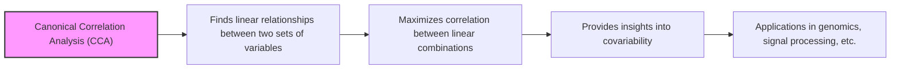
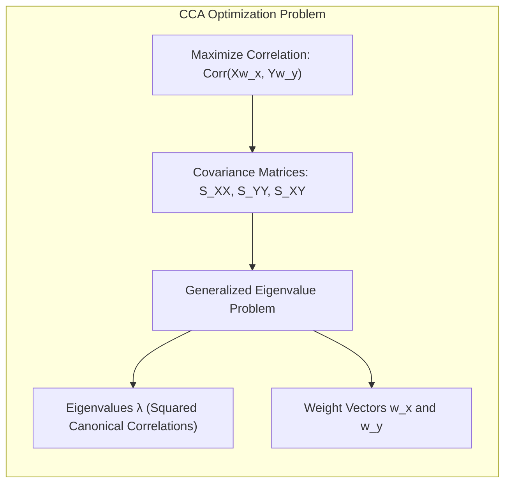
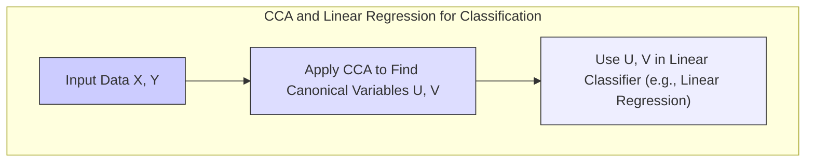
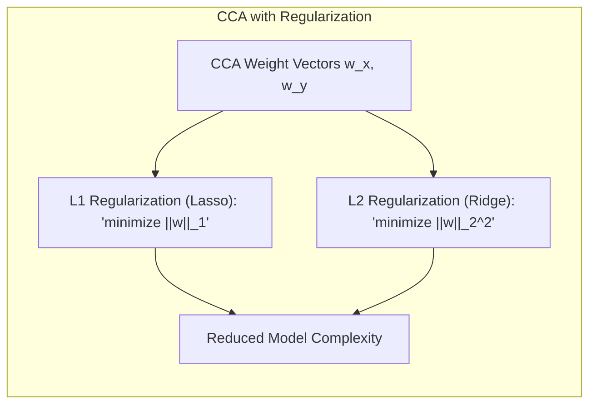
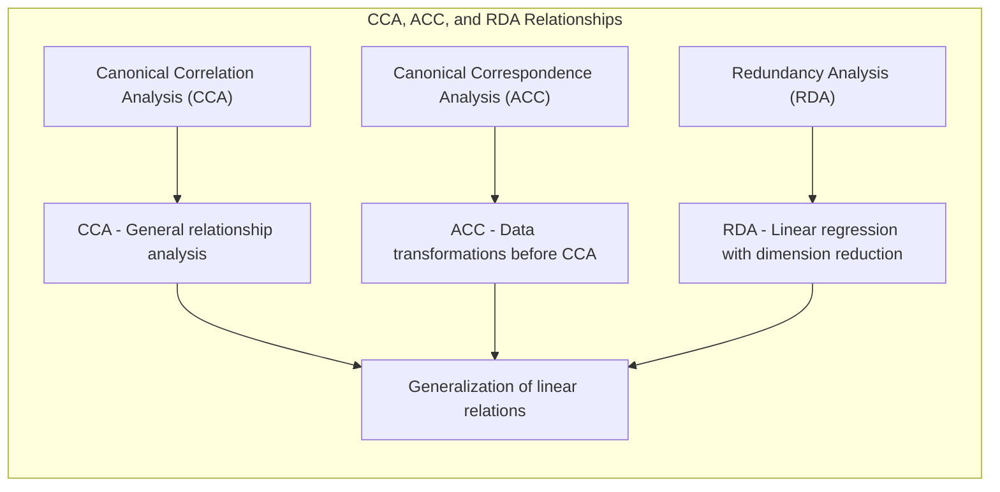

Okay, here's the enhanced text with Mermaid diagrams added, focusing on clarity and technical precision:

## Canonical Correlation Analysis: Maximizing Correlation Between Linear Combinations of Inputs and Responses

### Introdução
A **Canonical Correlation Analysis (CCA)** é uma técnica estatística avançada que busca identificar e quantificar as relações lineares entre dois conjuntos de variáveis, maximizando a correlação entre combinações lineares dessas variáveis [^4.1], [^4.2]. Diferentemente de outros métodos de análise multivariada que focam na variabilidade dentro de um único conjunto de dados, a CCA visa a encontrar padrões de covariabilidade entre dois conjuntos distintos, oferecendo *insights* sobre como eles se relacionam. Esta técnica é particularmente útil em cenários onde se espera que múltiplas variáveis de um conjunto influenciem ou sejam influenciadas por múltiplas variáveis de outro conjunto. O método encontra as combinações lineares de cada conjunto que apresentam a maior correlação entre si.

### Conceitos Fundamentais

**Conceito 1: Objetivos e Aplicações da CCA**
A CCA busca encontrar **combinações lineares ótimas** de dois conjuntos de variáveis, de modo que a correlação entre essas combinações seja maximizada. Em outras palavras, o objetivo é encontrar um par de transformações lineares que, quando aplicadas aos dois conjuntos de variáveis, resultam em novos conjuntos de variáveis que apresentam a maior correlação possível [^4.1], [^4.2].
*   **Aplicações:** A CCA é utilizada em uma variedade de campos, como:
    *   **Análise de dados genômicos**: Relacionando conjuntos de dados de expressão gênica com informações fenotípicas.
    *   **Processamento de sinais**: Identificando padrões de correlação entre diferentes sinais, como eletroencefalogramas (EEGs) e imagens de ressonância magnética funcional (fMRI).
    *   **Psicologia e educação**: Investigando a relação entre conjuntos de variáveis psicométricas e resultados de aprendizagem.
    *   **Marketing**: Analisando a relação entre o comportamento do consumidor e diversas características de produtos ou serviços.
*   **Diferenças de outros métodos:** Ao contrário de métodos como a **Principal Component Analysis (PCA)**, que foca na redução da dimensionalidade de um único conjunto de variáveis, a CCA busca identificar relações entre dois conjuntos distintos, explorando a covariabilidade entre eles [^4.5].  A CCA difere também da **Linear Discriminant Analysis (LDA)**, que se concentra em classificar as amostras entre grupos, utilizando variáveis discriminantes [^4.3].
    
**Lemma 1:** As variáveis canônicas, obtidas após a aplicação da CCA, são ortogonais dentro de cada conjunto, e a correlação entre as variáveis canônicas de conjuntos diferentes é maximizada.
$$
Corr(U_i,V_j) =
\begin{cases}
    \rho_i & \text{se } i = j\\
    0 & \text{se } i \ne j
\end{cases}
$$
onde $U_i$ e $V_j$ são as i-ésimas e j-ésimas variáveis canônicas dos conjuntos X e Y, respectivamente, e $\rho_i$ é a i-ésima correlação canônica [^4.1], [^4.2]. $\blacksquare$
> 💡 **Exemplo Numérico:** Imagine que temos dois conjuntos de variáveis, X representando notas em diferentes disciplinas (Matemática, Português) e Y representando habilidades cognitivas (Memória, Raciocínio Lógico). Após aplicar CCA, obtemos as variáveis canônicas U e V. U1 (combinação linear de notas) pode ser fortemente correlacionada com V1 (combinação linear de habilidades cognitivas) com uma correlação canônica $\rho_1 = 0.85$. Já U2 e V2 terão uma correlação $\rho_2 = 0.3$, e  U1 e V2, U2 e V1, terão correlação zero. Isso significa que a primeira combinação linear de notas está fortemente relacionada com a primeira combinação linear de habilidades, enquanto a segunda combinação de cada conjunto apresenta uma relação mais fraca.

**Conceito 2: Formulação Matemática da CCA**
Dado dois conjuntos de variáveis $X \in \mathbb{R}^{N \times p}$ e $Y \in \mathbb{R}^{N \times q}$, onde $N$ representa o número de observações, $p$ o número de variáveis em $X$ e $q$ o número de variáveis em $Y$, a CCA busca encontrar vetores de pesos $w_x \in \mathbb{R}^{p}$ e $w_y \in \mathbb{R}^{q}$ tais que as variáveis canônicas $U = Xw_x$ e $V = Yw_y$ tenham a maior correlação linear possível [^4.2].
*   **Maximizar Correlação:** A CCA envolve encontrar vetores de peso ($w_x$ e $w_y$) que maximizam a correlação linear entre as variáveis canônicas U e V:
$$
\max_{w_x, w_y} Corr(Xw_x, Yw_y) = \frac{Cov(Xw_x, Yw_y)}{\sqrt{Var(Xw_x) Var(Yw_y)}}
$$
*   **Matrizes de Covariância:** Para encontrar esses vetores, a CCA utiliza as matrizes de covariância entre as variáveis em cada conjunto e entre os dois conjuntos:
    *   $S_{XX} = \frac{1}{N-1} X^T X$ (Covariância de X)
    *   $S_{YY} = \frac{1}{N-1} Y^T Y$ (Covariância de Y)
    *   $S_{XY} = \frac{1}{N-1} X^T Y$ (Covariância entre X e Y)
*   **Problema de Otimização:** A maximização da correlação é realizada através da resolução de um problema de autovalores generalizados envolvendo as matrizes de covariância [^4.2]. A solução geral envolve autovalores generalizados:
    *   $S_{XY} S_{YY}^{-1} S_{YX} w_x = \lambda S_{XX} w_x$,
    *   $S_{YX} S_{XX}^{-1} S_{XY} w_y = \lambda S_{YY} w_y$,
   em que os autovalores $\lambda$ são os quadrados das correlações canônicas, $w_x$ são as coordenadas dos vetores de pesos para o conjunto $X$, e $w_y$ são as coordenadas dos vetores de pesos para o conjunto $Y$.

> 💡 **Exemplo Numérico:**  Vamos considerar um caso simplificado com dois conjuntos de variáveis, X (2 variáveis: x1, x2) e Y (2 variáveis: y1, y2), com 100 observações. Após calcular as matrizes de covariância $S_{XX}$, $S_{YY}$ e $S_{XY}$, resolvemos o problema de autovalor generalizado. Suponha que o primeiro autovalor seja $\lambda_1 = 0.7225$, o que implica uma correlação canônica $\rho_1 = \sqrt{0.7225} = 0.85$. O vetor de peso correspondente para X é $w_x = [0.6, 0.8]$ e para Y é $w_y = [0.7, 0.7]$. Isso significa que $U_1 = 0.6x_1 + 0.8x_2$ e $V_1 = 0.7y_1 + 0.7y_2$ são as combinações lineares mais correlacionadas entre X e Y, com uma correlação de 0.85. Os próximos autovalores e vetores de pesos geram variáveis canônicas de menor correlação.

**Corolário 1**: Se os conjuntos X e Y forem ortogonais entre si, o CCA não encontrará relações lineares, e as correlações canônicas serão zero. Se os conjuntos tiverem variáveis altamente correlacionadas, CCA identificará essas relações com altas correlações canônicas. [^4.2]
> 💡 **Exemplo Numérico:** Imagine que X seja um conjunto de dados de temperatura e Y seja um conjunto de dados de precipitação de diferentes regiões. Se a temperatura e a precipitação forem totalmente independentes (ortogonais), a CCA não encontrará correlações entre as combinações lineares das variáveis, resultando em correlações canônicas próximas a zero. Por outro lado, se um conjunto de dados de temperatura e um conjunto de dados de consumo de ar condicionado forem analisados, a CCA provavelmente identificará uma forte relação com correlações canônicas altas, já que há uma dependência entre essas variáveis.

**Conceito 3: Interpretação dos Resultados da CCA**
Após encontrar as variáveis canônicas, o passo seguinte é interpretar as correlações canônicas, as relações entre os vetores de pesos e as variáveis originais, e como os pares de variáveis canônicas se relacionam [^4.2].
*   **Correlações Canônicas:** As correlações canônicas indicam a força da relação linear entre cada par de variáveis canônicas, geralmente em ordem decrescente, com a primeira correlação canônica sendo a mais alta [^4.1].
*   **Pesos Canônicos:** Os vetores de pesos $w_x$ e $w_y$ revelam a importância de cada variável original na construção das variáveis canônicas.
*   **Análise das Variáveis Canônicas:** Ao examinar as variáveis canônicas, é possível identificar padrões de covariabilidade entre os conjuntos de variáveis originais. Pode-se analisar se variáveis específicas de um conjunto estão fortemente associadas com variáveis específicas do outro conjunto, fornecendo *insights* sobre mecanismos subjacentes. É importante ressaltar que a CCA busca associações lineares, e relações não lineares podem não ser identificadas por essa técnica.
> ⚠️ **Nota Importante**: A CCA assume relações lineares entre os conjuntos de variáveis. Não linearidades podem não ser capturadas, e a interpretação dos resultados deve ser feita levando isso em consideração [^4.2].
> ❗ **Ponto de Atenção**: O uso de CCA com grandes conjuntos de dados pode demandar alto poder computacional. Além disso, a análise das variáveis canônicas pode ser complexa, especialmente quando há muitas variáveis [^4.1], [^4.2].
> 💡 **Exemplo Numérico:** Suponha que, após a análise de CCA em um estudo de marketing, encontramos as seguintes correlações canônicas: $\rho_1 = 0.90$, $\rho_2 = 0.55$, e $\rho_3 = 0.20$. Isso sugere que a primeira variável canônica de um conjunto de variáveis (por exemplo, padrões de compra) tem uma fortíssima relação linear com a primeira variável canônica do outro conjunto (por exemplo, perfil demográfico), enquanto as relações seguintes são mais fracas. Os vetores de peso podem mostrar que a variável "idade" tem um peso maior na primeira variável canônica de perfil demográfico, enquanto a variável "frequência de compra" tem um peso alto na primeira variável canônica de padrões de compra. Analisando os pesos, podemos entender como cada variável original contribui para as variáveis canônicas.

### Regressão Linear e Mínimos Quadrados para Classificação

Enquanto a CCA foca em identificar relações lineares entre dois conjuntos de variáveis, a regressão linear, comumente utilizada em tarefas de classificação, visa modelar a dependência de uma variável resposta em relação a um ou mais preditores [^4.2].  A regressão linear minimiza a soma dos quadrados dos erros, enquanto a CCA maximiza a correlação. Em problemas de classificação com classes bem separáveis, métodos lineares como a regressão em matriz de indicadores, apesar de suas limitações [^4.2], podem fornecer resultados satisfatórios, especialmente quando o objetivo principal é a identificação da fronteira de decisão, e não a estimativa precisa de probabilidades. Ao utilizar CCA, pode-se identificar quais combinações lineares das variáveis de entrada maximizam a correlação com as classes do problema, criando novas variáveis que podem ser usadas em um classificador linear. Em problemas com múltiplas classes, como no caso da regressão de uma matriz de indicadores, a CCA pode ser uma ferramenta útil para reduzir a complexidade do espaço de entrada e melhorar a eficiência do classificador.
    
**Lemma 2:** Em cenários de classificação binária, quando as variáveis independentes são lineares, aplicar CCA aos conjuntos de características de cada classe pode levar à identificação de um subespaço que melhor separa as classes, equivalentemente a encontrar um hiperplano discriminante. No entanto, quando as classes não são linearmente separáveis, outros métodos podem ser mais adequados [^4.2], [^4.3].
   
**Prova do Lemma 2:** Dado dois conjuntos de variáveis $X$ e $Y$ associadas as classes 0 e 1,  o CCA irá buscar encontrar combinações lineares $U = Xw_x$ e $V = Yw_y$ que maximizem a correlação entre elas. Se as classes forem linearmente separáveis, esses vetores de peso estarão apontando para a direção que melhor separa as classes no espaço de variáveis original. Portanto, um classificador linear construído neste novo espaço será capaz de discriminar as classes com uma margem maior. No entanto, se as classes não forem linearmente separáveis, a CCA ainda encontrará combinações lineares, mas elas não necessariamente corresponderão à melhor fronteira de separação no espaço original. $\blacksquare$
> 💡 **Exemplo Numérico:** Imagine um problema de classificação de imagens de gatos (classe 0) e cachorros (classe 1). Se usarmos como features as intensidades de pixels de cada imagem, podemos ter um conjunto X para gatos e um conjunto Y para cachorros. Aplicando CCA a esses conjuntos, podemos encontrar variáveis canônicas que maximizam a correlação entre as imagens de gatos e cachorros. Se as características que diferenciam gatos de cachorros são lineares no espaço de pixels, a CCA vai criar um espaço de menor dimensão onde as classes estão mais separadas, facilitando a construção de um classificador linear.

**Corolário 2:** No contexto de regressão linear para classificação, após a aplicação da CCA, a regressão linear nos conjuntos de variáveis canônicas pode apresentar uma performance superior à regressão no conjunto original de variáveis, pois a CCA pode reduzir a complexidade do espaço de características e remover redundâncias [^4.2].
> 💡 **Exemplo Numérico:** Se temos 100 variáveis originais para classificar se um cliente vai comprar um produto, a regressão linear direta pode ter problemas de overfitting. Usando CCA para encontrar um conjunto reduzido de 10 variáveis canônicas, e usando essas novas variáveis em uma regressão linear, podemos obter um modelo mais eficiente e com melhor capacidade de generalização, uma vez que a CCA reduziu a dimensionalidade e selecionou características mais relevantes.

> ✔️ **Destaque**: A CCA, ao identificar relações entre conjuntos de variáveis, pode auxiliar na seleção de características mais relevantes para modelos de classificação. Esta abordagem é particularmente útil em problemas com muitas variáveis, onde a redução da dimensionalidade pode melhorar a eficiência e a interpretabilidade dos modelos [^4.5].

### Métodos de Seleção de Variáveis e Regularização em Classificação

A CCA, em sua forma padrão, não realiza seleção de variáveis ou regularização diretamente. No entanto, é possível combinar CCA com técnicas de seleção de variáveis e regularização para melhorar o desempenho de modelos de classificação, como a regressão logística [^4.4], [^4.4.4].
*   **Seleção de Variáveis:** Antes de aplicar a CCA, pode-se utilizar métodos de seleção de variáveis para reduzir a dimensionalidade dos conjuntos de variáveis $X$ e $Y$. Isso pode ajudar a remover variáveis irrelevantes ou redundantes, o que pode levar a resultados mais robustos e interpretáveis [^4.5].
*   **Regularização:** Pode-se aplicar técnicas de regularização, como a penalidade L1 ou L2, aos vetores de pesos da CCA. Isso pode ajudar a evitar *overfitting* e melhorar a generalização do modelo. Além disso, penalidades L1, como na **lasso**, levam a coeficientes esparsos, que podem auxiliar na interpretabilidade do modelo [^4.4.4].
    
**Lemma 3:** A aplicação de penalidades L1 ou L2 aos vetores de pesos canônicos em um problema de CCA pode levar a uma redução na complexidade do modelo, o que é essencial para evitar *overfitting* em problemas com alta dimensionalidade [^4.5].

    
**Prova do Lemma 3:**  Na formulação padrão da CCA, os vetores de pesos $w_x$ e $w_y$ são encontrados sem qualquer restrição. Quando penalidades L1 ou L2 são aplicadas, os vetores de peso tendem a ter valores menores ou até mesmo nulos, o que significa que algumas variáveis são excluídas ou têm sua influência diminuída na formação das variáveis canônicas. A penalidade L1 encoraja a esparsidade, enquanto a L2 promove a redução da magnitude dos coeficientes. Ambas levam a uma redução da complexidade do modelo, e podem melhorar a capacidade de generalização do modelo, ao invés de memorizar padrões nos dados de treinamento. $\blacksquare$

**Corolário 3:** A combinação de CCA com regularização L1 pode levar à identificação de um conjunto menor de variáveis importantes para construir as variáveis canônicas, o que pode facilitar a interpretação dos resultados, além de aumentar a robustez do modelo [^4.4.5].
> 💡 **Exemplo Numérico:** Se aplicarmos L1 regularização (Lasso) na CCA, podemos fazer com que alguns dos pesos dos vetores $w_x$ e $w_y$ se tornem zero. Por exemplo, podemos observar que em $w_x$, o peso de $x_3$ e $x_7$ se tornam zero, e em $w_y$, o peso de $y_4$ fica zerado. Isso significa que as variáveis $x_3$, $x_7$ e $y_4$ são menos importantes para criar as variáveis canônicas e podem ser excluídas do modelo. Assim, conseguimos não só reduzir a dimensionalidade, mas também obter um modelo mais interpretável, onde apenas as variáveis mais relevantes são consideradas.

### Separating Hyperplanes e Perceptrons
No contexto de classificação, a ideia de encontrar um **hiperplano separador** que maximize a margem entre as classes pode ser diretamente relacionada à CCA. As direções canônicas obtidas por CCA podem ser utilizadas para construir um hiperplano separador em um espaço de menor dimensão, que busca maximizar a correlação com as classes do problema [^4.5.2]. O Perceptron, embora seja um algoritmo iterativo para encontrar um hiperplano separador, não possui uma relação direta com a CCA em termos de sua formulação matemática. O Perceptron se baseia na atualização iterativa dos pesos, enquanto a CCA envolve a solução de um problema de autovalores generalizados [^4.5.1].

### Pergunta Teórica Avançada: Como a CCA se relaciona com a Análise de Correspondência Canônica (ACC) e a Análise de Redundância (RDA)?
**Resposta:**
A **Análise de Correspondência Canônica (ACC)** e a **Análise de Redundância (RDA)** são variações da CCA que são comumente usadas em ecologia e outras áreas onde se busca analisar relações entre conjuntos de dados de diferentes tipos.
*   **ACC:** A ACC é utilizada quando os dados de resposta são abundâncias de espécies e busca encontrar relações entre essas abundâncias e variáveis ambientais. A ACC estende a CCA permitindo analisar dados que não são normalmente distribuídos. A matriz de resposta é transformada usando a função de correspondência e o problema resultante é então analisado com CCA.
*   **RDA:** A RDA assume que as respostas são combinações lineares das variáveis de entrada e é uma versão da regressão linear multivariada, em que as variáveis independentes são usadas para predizer as variáveis dependentes. A diferença principal da RDA para a regressão linear é que a RDA realiza um tipo de redução de dimensionalidade nas variáveis independentes antes de realizar a regressão.
*   **Relação com CCA:** Ambas ACC e RDA são relacionadas ao CCA, pois elas buscam encontrar combinações lineares de variáveis que maximizem a correlação entre dois conjuntos de dados. A principal diferença é que a ACC aplica transformações aos dados antes da análise e a RDA é equivalente à regressão linear multivariada com uma etapa de redução da dimensão das variáveis independentes [^4.3].

**Lemma 4:** A ACC e a RDA podem ser vistas como adaptações da CCA para casos específicos onde os dados têm características particulares, como dados de abundância de espécies (ACC) ou dados com uma estrutura de regressão linear (RDA).
  
**Corolário 4:** Se o problema a ser analisado não possuir a estrutura específica requerida pela ACC ou RDA, a CCA pode ser uma alternativa mais adequada, pois realiza uma análise mais geral da relação entre dois conjuntos de variáveis. [^4.1]
> 💡 **Exemplo Numérico**: Em um estudo ecológico, o conjunto X pode representar variáveis ambientais (temperatura, precipitação, altitude) e o conjunto Y pode representar a abundância de diferentes espécies de plantas. Se usarmos ACC, primeiro transformamos a matriz de abundância, e depois aplicamos a CCA. Se usarmos RDA, assumimos que a abundância de plantas é uma combinação linear das variáveis ambientais, e buscamos encontrar essa combinação que melhor se ajusta aos dados. Se não houver nenhuma dessas características, podemos usar CCA diretamente.

> ⚠️ **Ponto Crucial:**  A escolha entre CCA, ACC e RDA depende da estrutura dos dados e da natureza das relações que se deseja investigar. Em situações onde as relações são lineares e há uma correspondência direta entre variáveis, a CCA pode ser suficiente. Em outros casos, as adaptações fornecidas pela ACC ou RDA podem ser necessárias para uma análise mais adequada.

### Conclusão

A **Canonical Correlation Analysis (CCA)** é uma ferramenta poderosa para analisar a covariabilidade entre dois conjuntos de variáveis. Ao maximizar a correlação entre combinações lineares dessas variáveis, a CCA permite identificar padrões de relacionamento que podem ser valiosos em diversas aplicações. Enquanto a CCA possui limitações e premissas, como linearidade e sensibilidade a *outliers*, quando usada em conjunto com outras técnicas estatísticas, como seleção de variáveis e regularização, ela pode levar a modelos mais robustos e interpretáveis. A capacidade de identificar padrões de covariabilidade em dados complexos faz da CCA uma técnica indispensável em diversas áreas de pesquisa e análise de dados. <!-- END DOCUMENT -->
### Footnotes
[^4.1]: "A linear regression model assumes that the regression function E(Y|X) is linear in the inputs X1,..., Xp."
[^4.2]: "The linear model either assumes that the regression function E(Y|X) is linear, or that the linear model is a reasonable approximation."
[^4.3]: "In this chapter we describe linear methods for regression, while in the next chapter we discuss linear methods for classification."
[^4.4]: "Typically we have a set of training data (x1, y1) ... (xn, yn) from which to estimate the parameters β."
[^4.4.1]: "The most popular estimation method is least squares, in which we pick the coefficients β = (β0, β1, ..., βp)T to minimize the residual sum of squares"
[^4.4.2]: "From a statistical point of view, this criterion is reasonable if the training observations (xi, yi) represent independent random draws from their population."
[^4.4.3]:  "Even if the xi's were not drawn randomly, the criterion is still valid if the yi's are conditionally independent given the inputs xi."
[^4.4.4]: "Figure 3.1 illustrates the geometry of least-squares fitting in the Rp+1-dimensional space occupied by the pairs (X, Y)."
[^4.4.5]: "No matter the source of the Xj, the model is linear in the parameters."
[^4.5]: "Up to now we have made minimal assumptions about the true distribution of the data."
[^4.5.1]: "To test the hypothesis that a particular coefficient βj = 0, we form the standardized coefficient or Z-score"
[^4.5.2]: "Often we need to test for the significance of groups of coefficients simultaneously."
