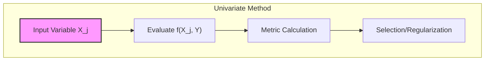
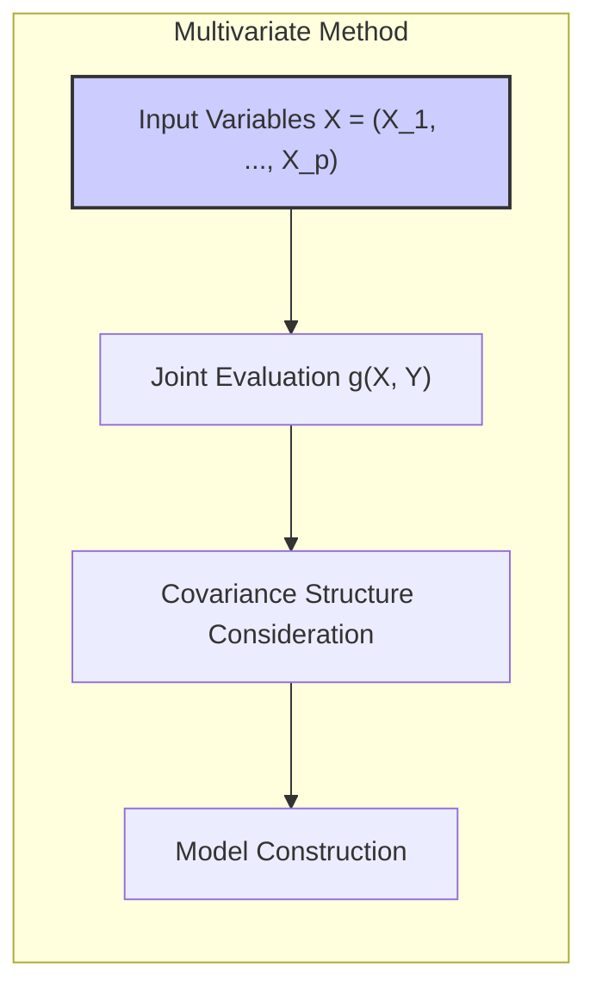
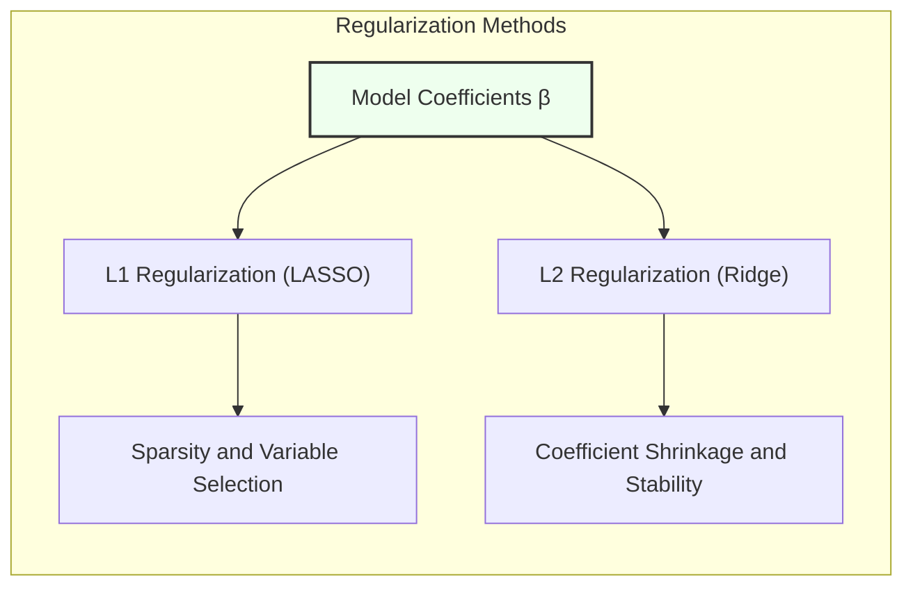
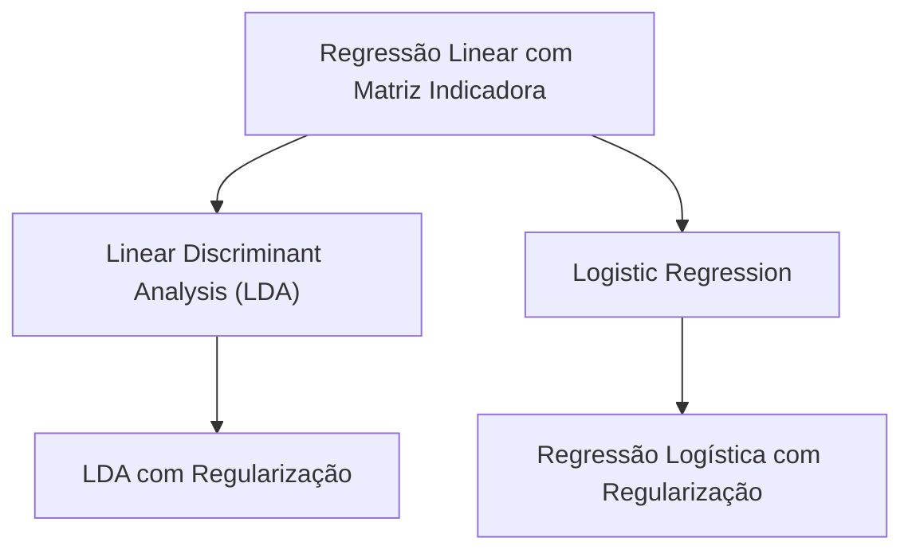
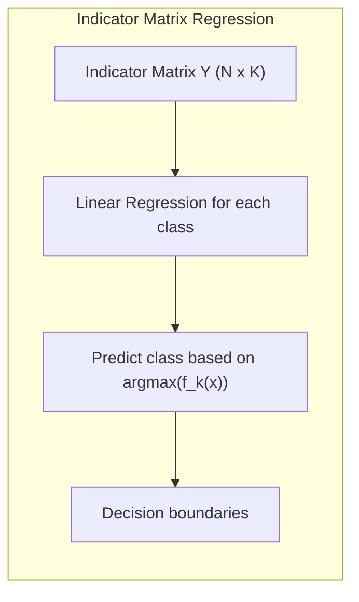
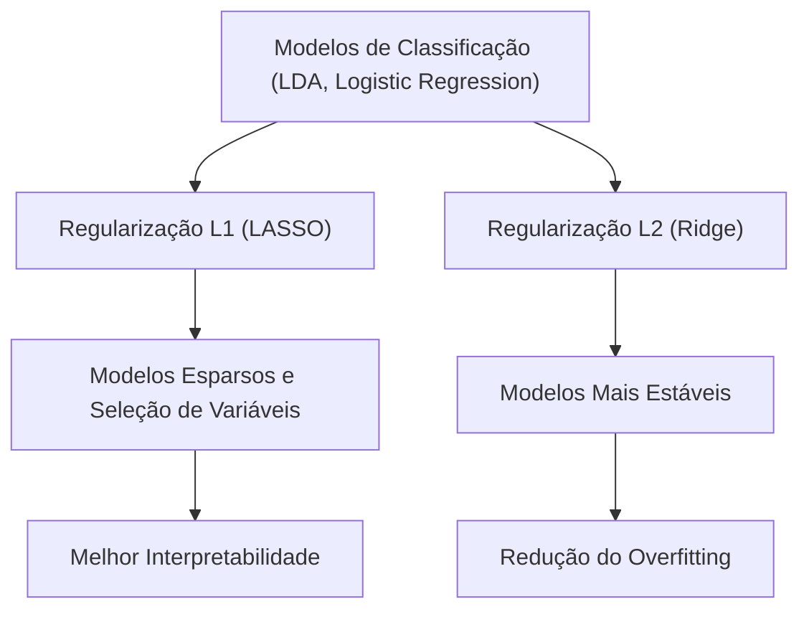
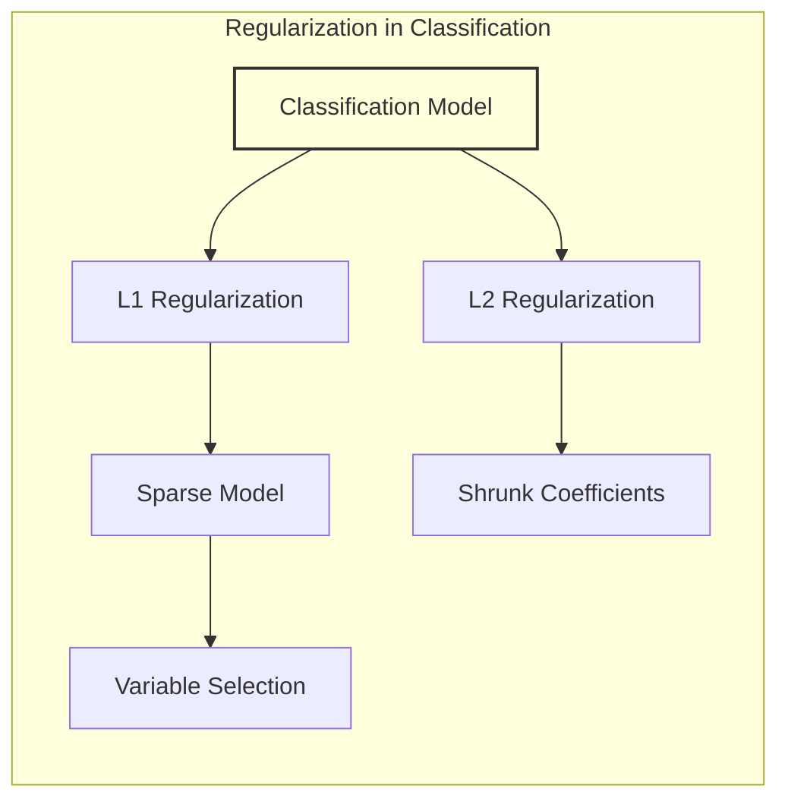
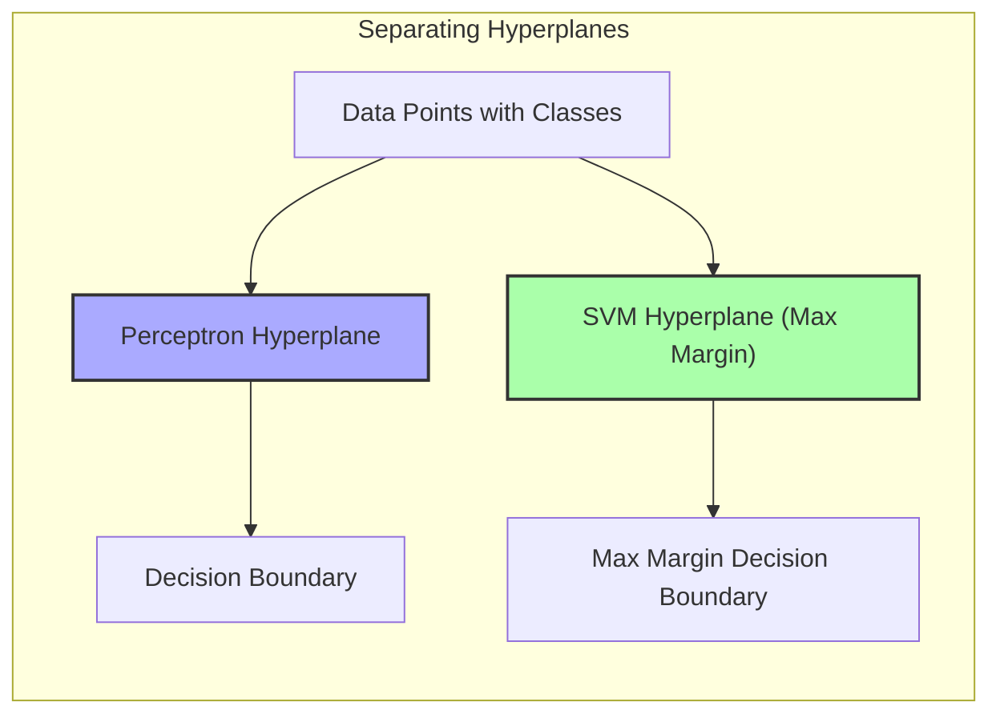
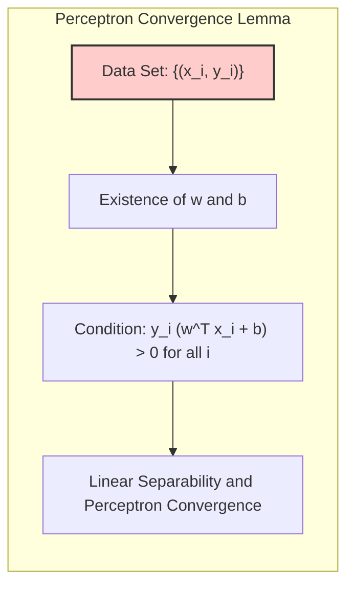
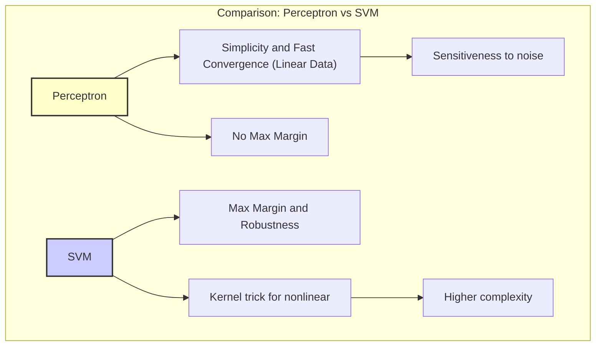

## Univariate vs. Multivariate Shrinkage and Selection in Statistical Learning
<imagem: Um diagrama de Venn mostrando a sobreposição de métodos univariados e multivariados para seleção e redução de dimensionalidade, com exemplos como ridge regression, LASSO, PCR e PLS listados em suas áreas correspondentes, com a interseção indicando técnicas que podem ser aplicadas de ambas as formas>

### Introdução
O campo do aprendizado estatístico frequentemente lida com dados de alta dimensionalidade, onde o número de variáveis (preditores) pode ser grande em relação ao número de observações. Nesse contexto, **métodos de seleção de variáveis e regularização** são essenciais para construir modelos parcimoniosos e precisos, reduzindo o risco de overfitting e melhorando a interpretabilidade [^4.1], [^4.2]. Este capítulo explora as nuances entre abordagens univariadas e multivariadas, focando em como elas diferem em sua aplicação e eficácia em cenários de classificação e regressão.

### Conceitos Fundamentais

**Conceito 1: Métodos Univariados**
Os **métodos univariados** abordam cada variável preditora (input) de forma independente no contexto da construção do modelo. Em essência, cada input é avaliado separadamente em relação à variável resposta. Por exemplo, ao usar a regressão linear para classificação com matriz de indicadores, onde as classes são codificadas como variáveis binárias, cada variável preditora é usada para modelar cada classe separadamente [^4.2]. Os métodos de seleção univariados também são usados para determinar a relevância de cada variável, considerando métricas como valores-p, scores F e testes de hipótese. Esse processo é simplificado e computacionalmente menos intensivo, mas pode não capturar interações complexas entre as variáveis [^4.5.1]. Por exemplo, métodos de regressão com indicadores [^4.2] tratam cada classe separadamente, embora possam existir correlações entre os preditores.

> 💡 **Exemplo Numérico:** Imagine um dataset com 100 amostras, onde a variável resposta $Y$ é binária (0 ou 1) e temos dois preditores, $X_1$ e $X_2$. Em uma abordagem univariada, primeiro, ajustaríamos um modelo de regressão linear simples usando apenas $X_1$ para prever $Y$ e depois ajustaríamos um outro modelo usando apenas $X_2$ para prever $Y$. A avaliação da importância de cada preditor seria feita de forma isolada, observando o quão bem cada preditor individualmente se relaciona com $Y$. Por exemplo, poderíamos calcular o R² para cada modelo e comparar. Suponha que ao ajustar os modelos obtemos:
> - Para $X_1$: $R^2 = 0.30$, $p-valor=0.01$
> - Para $X_2$: $R^2 = 0.15$, $p-valor=0.08$
> Isso sugere que $X_1$ tem um poder preditivo um pouco melhor que $X_2$ e que a relação de $X_1$ com $Y$ é estatisticamente significativa, considerando um nível de significância de 0.05. Importante ressaltar que a avaliação de $X_1$ não é afetada pela presença ou ausência de $X_2$.

**Lemma 1:**
*Um lemma que formaliza a ideia de seleção univariada pode ser formulado da seguinte forma:*

*Seja $X = (X_1, X_2, ..., X_p)$ o conjunto de preditores, e $Y$ a variável resposta. Um método de seleção univariada avalia a relevância de cada $X_j$ em relação a $Y$ através de uma função $f(X_j, Y)$. A seleção ou regularização é feita com base em uma métrica calculada em $f$, e que não depende da presença ou ausência dos demais preditores.*

$$
\text{Lemma 1:  Se }  f(X_j, Y) \text{ for uma métrica univariada, então } f(X_j, Y) \text{ é avaliada independentemente dos outros preditores } X_{k \neq j}
$$
$\blacksquare$

**Conceito 2: Métodos Multivariados**
Em contraste, os **métodos multivariados** consideram as relações entre todas as variáveis preditoras simultaneamente durante a construção do modelo. Técnicas como a **Linear Discriminant Analysis (LDA)** e a **Logistic Regression** [^4.3], [^4.4] modelam o espaço das features de forma conjunta para projetar e classificar os dados, levando em conta a estrutura de covariância das variáveis. Métodos multivariados também incluem regularização L1 e L2 que se aplicam simultaneamente a todos os coeficientes do modelo.  A LDA, por exemplo, tenta encontrar a combinação linear de preditores que melhor separam as classes, enquanto a regressão logística [^4.4] modela diretamente a probabilidade de pertinência a uma classe, considerando todos os preditores juntos. Essas abordagens tendem a ser mais robustas para interações e covariâncias complexas entre os preditores, mas podem ser mais computacionalmente desafiadoras e requerem mais dados para serem eficazes.

> 💡 **Exemplo Numérico:** Usando o mesmo dataset do exemplo anterior, uma abordagem multivariada, como a regressão logística, ajustaria um único modelo que usa tanto $X_1$ quanto $X_2$ para prever $Y$ simultaneamente. O modelo poderia ter a forma:
>
> $$ \text{logit}(P(Y=1)) = \beta_0 + \beta_1 X_1 + \beta_2 X_2 $$
>
> Os coeficientes $\beta_1$ e $\beta_2$ seriam estimados levando em conta a relação conjunta entre $X_1$, $X_2$ e $Y$. Suponha que, ao ajustar o modelo, encontramos:
> - $\beta_0 = -0.5$
> - $\beta_1 = 1.2$
> - $\beta_2 = 0.8$
>
> Além disso, poderíamos avaliar a significância de cada coeficiente e a significância conjunta do modelo.  Se a correlação entre $X_1$ e $X_2$ fosse alta, o modelo multivariado seria capaz de considerar esse aspecto, enquanto a avaliação univariada ignoraria essa relação.
> Poderíamos então calcular métricas como a acurácia, precisão e recall para comparar o modelo multivariado com os modelos univariados.

**Corolário 1:**
*A partir do Lemma 1, um corolário pode ser derivado:*

*Dada a avaliação independente de preditores por métodos univariados, um método multivariado que considere a interação entre preditores $X_j$ e $X_k$ com uma métrica $g(X_j, X_k, Y)$ pode melhorar a precisão da modelagem, quando estas interações são relevantes.*
$$
\text{Corolário 1: Se } g(X_j, X_k, Y) \text{ for uma métrica multivariada, então a avaliação de } g \text{ dependerá das relações entre } X_j \text{, } X_k \text{ e } Y.
$$
$\blacksquare$

**Conceito 3:  Regularização e Seleção**
Tanto abordagens univariadas quanto multivariadas podem incorporar **regularização** para lidar com overfitting e melhorar a generalização do modelo. Em métodos univariados, essa regularização pode ocorrer por meio da seleção de variáveis, por exemplo, descartando aquelas que mostram pouca relação com a variável resposta.  Em métodos multivariados, a regularização muitas vezes é realizada via penalização dos coeficientes [^4.4.4], como em *ridge regression* e *LASSO* [^4.5], o que leva a modelos mais estáveis e menos propensos a overfitting. A escolha entre diferentes tipos de regularização é crucial e depende da natureza dos dados e dos objetivos da análise [^4.5].

> 💡 **Exemplo Numérico:** Vamos considerar novamente o exemplo com dois preditores $X_1$ e $X_2$ e variável resposta binária $Y$. Ao usar uma regressão logística com regularização, podemos aplicar tanto regularização L1 (LASSO) quanto L2 (Ridge).
>
> - **Regularização L1 (LASSO):** A função de custo é modificada para incluir a soma dos valores absolutos dos coeficientes, multiplicado por um parâmetro de regularização $\lambda$. Por exemplo:
>
> $$ \text{Custo} = \text{Erro} + \lambda(|\beta_1| + |\beta_2|) $$
>
> Um $\lambda$ alto tende a zerar os coeficientes, realizando a seleção de variáveis. Por exemplo, se $\lambda = 1.0$, o modelo poderia resultar em $\beta_1 = 0.9$ e $\beta_2 = 0$, indicando que $X_2$ foi removido do modelo.
> - **Regularização L2 (Ridge):** A função de custo é modificada para incluir a soma dos quadrados dos coeficientes, multiplicado por um parâmetro de regularização $\lambda$. Por exemplo:
>
> $$ \text{Custo} = \text{Erro} + \lambda(\beta_1^2 + \beta_2^2) $$
>
> Um $\lambda$ alto tende a reduzir a magnitude dos coeficientes. Por exemplo, se $\lambda = 0.5$, o modelo poderia resultar em $\beta_1 = 0.7$ e $\beta_2 = 0.5$, onde ambos os preditores ainda contribuem para o modelo, mas com coeficientes menores.
>
> A escolha do $\lambda$ ideal é feita através de validação cruzada.

> ⚠️ **Nota Importante**: A regularização pode ser aplicada de forma univariada (seleção de variáveis) ou multivariada (penalização de coeficientes). A escolha depende do contexto e dos objetivos da modelagem.
> ❗ **Ponto de Atenção**: Ao aplicar métodos univariados, é crucial considerar que a avaliação de cada preditor individualmente pode não capturar relações complexas com outros preditores, levando a modelos menos eficazes quando há interações significativas [^4.5].
> ✔️ **Destaque**: Métodos multivariados, como *ridge*, *LASSO* e LDA, tendem a ser mais robustos em cenários com alta correlação entre preditores, pois levam em conta a estrutura de covariância dos dados. [^4.5.1], [^4.5.2].

### Regressão Linear e Mínimos Quadrados para Classificação
<imagem: Mapa mental mostrando a hierarquia de métodos de classificação, com Regressão Linear com Matriz Indicadora como um ponto de partida, levando a LDA e Regressão Logística, e destacando suas relações>

**Explicação:** Este mapa mental ilustra a relação entre regressão linear com matriz indicadora e métodos de classificação lineares mais robustos como LDA e Regressão Logística.

A **regressão linear aplicada a matrizes indicadoras** é uma abordagem univariada para classificação, que consiste em criar uma matriz onde cada coluna representa uma das classes e as entradas são 1 ou 0, dependendo se a observação pertence ou não àquela classe. O modelo de regressão linear é então ajustado para cada coluna da matriz, e novas observações são classificadas com base em qual coluna apresenta o maior valor predito. Esta abordagem possui algumas limitações: em particular, não é robusta quando classes são desbalanceadas e pode levar a predições fora do intervalo [0,1] [^4.2]. Além disso, ao tratar cada classe separadamente, a regressão linear não explora possíveis correlações entre as classes ou a estrutura da covariância dos dados. Comparativamente, métodos como LDA e Regressão Logística, que podem ser vistos como abordagens multivariadas, são mais adequados para tarefas de classificação, já que modelam as probabilidades de classe de forma conjunta e utilizam funções discriminantes que consideram a distribuição de todas as classes simultaneamente [^4.3], [^4.4].

> 💡 **Exemplo Numérico:** Suponha um problema de classificação com três classes (A, B e C) e dois preditores, $X_1$ e $X_2$. Criaríamos uma matriz indicadora com três colunas, uma para cada classe. Uma observação pertencente à classe A seria representada como [1, 0, 0], à classe B como [0, 1, 0] e à classe C como [0, 0, 1]. Para cada classe, ajustaríamos um modelo de regressão linear. Por exemplo, para a classe A, o modelo seria:
>
> $$ \hat{Y}_A = \beta_{0A} + \beta_{1A} X_1 + \beta_{2A} X_2 $$
>
> Ajustaríamos modelos semelhantes para as classes B e C. Para classificar uma nova amostra com valores $X_1=x_1$ e $X_2=x_2$, calcularíamos os valores preditos $\hat{Y}_A$, $\hat{Y}_B$ e $\hat{Y}_C$ e atribuiríamos a amostra à classe com o maior valor predito.
>
> No entanto, esse método pode levar a predições como $\hat{Y}_A = 1.2$, que não é uma probabilidade válida. Além disso, a regressão linear não considera possíveis correlações entre as classes.

**Lemma 2:**
*Um lemma que estabelece a relação entre a regressão linear com matriz de indicadores e o conceito de separação linear de classes é definido abaixo:*

*Dado um problema de classificação com k classes, se a regressão linear com matriz de indicadores produzir um conjunto de k funções lineares $f_1(x), f_2(x),..., f_k(x)$, então a regra de decisão que atribui uma observação x à classe j se $f_j(x) = \max_i f_i(x)$ define fronteiras de decisão lineares.*

$$
\text{Lemma 2: Se }  f_j(x) = \beta_j^T x + b_j  \text{ para cada classe } j, \text{ então a regra de decisão } \text{argmax}_j f_j(x) \text{ define uma fronteira linear}.
$$
$\blacksquare$

**Corolário 2:**
*Um corolário derivado do Lemma 2 é:*

*As fronteiras de decisão geradas por regressão linear com matriz de indicadores são lineares, mas não necessariamente ótimas em termos de erro de classificação ou probabilidade de classe, sendo que modelos como LDA ou Regressão Logística, ao considerar a covariância dos dados, podem levar a melhores resultados.*

$$
\text{Corolário 2: As fronteiras lineares da regressão de indicadores são um caso especial de modelos mais gerais como LDA, que podem gerar fronteiras ótimas em termos de probabilidade de classe}.
$$
$\blacksquare$

### Métodos de Seleção de Variáveis e Regularização em Classificação

<imagem: Diagrama de fluxo mostrando a aplicação de técnicas de regularização (L1 e L2) em Modelos de Classificação (LDA e Logistic Regression), destacando como esses métodos podem simplificar modelos e melhorar a generalização>

**Explicação:** Este diagrama demonstra como diferentes métodos de regularização (L1 e L2) afetam a complexidade e generalização dos modelos de classificação.

**Seleção de variáveis** e **regularização** são componentes cruciais em métodos de classificação, especialmente quando lidamos com um número elevado de preditores. A seleção de variáveis busca identificar o subconjunto de preditores mais relevantes, eliminando os demais e simplificando o modelo. A regularização, por sua vez, impõe penalidades aos coeficientes do modelo, evitando overfitting e melhorando a capacidade de generalização. A **regularização L1 (LASSO)**, por exemplo, tende a produzir modelos esparsos, ou seja, com muitos coeficientes exatamente iguais a zero, realizando simultaneamente seleção de variáveis e redução de overfitting. Já a **regularização L2 (Ridge)**, penaliza os coeficientes de maneira mais suave, resultando em modelos mais estáveis, mas sem levar a coeficientes exatamente nulos [^4.5.2].  Em métodos multivariados como regressão logística, tanto a regularização L1 quanto L2 podem ser facilmente integradas, ajustando o termo de penalização na função de custo para obter modelos mais parcimoniosos e eficientes.

> 💡 **Exemplo Numérico:** Consideremos um modelo de regressão logística com três preditores $X_1$, $X_2$ e $X_3$. Sem regularização, o modelo poderia ter a forma:
> $$ \text{logit}(P(Y=1)) = \beta_0 + \beta_1 X_1 + \beta_2 X_2 + \beta_3 X_3 $$
>
> Suponha que, após o ajuste, os coeficientes sejam $\beta_1=1.2$, $\beta_2=-0.8$ e $\beta_3=0.5$.
>
> - **LASSO (L1):** Ao aplicar a regularização LASSO com um parâmetro $\lambda = 0.1$, o modelo pode ter os coeficientes ajustados para: $\beta_1 = 0.9$, $\beta_2 = 0$ e $\beta_3 = 0.2$. O coeficiente $\beta_2$ é zerado, o que implica que o preditor $X_2$ foi selecionado para fora do modelo, simplificando-o e melhorando a interpretabilidade. Se aumentarmos $\lambda$, mais coeficientes podem ser zerados.
>
> - **Ridge (L2):** Ao aplicar a regularização Ridge com um parâmetro $\lambda = 0.1$, o modelo pode ter os coeficientes ajustados para: $\beta_1 = 1.0$, $\beta_2=-0.6$ e $\beta_3=0.4$. Os coeficientes foram reduzidos em magnitude, mas nenhum foi zerado. Isso ajuda a reduzir o efeito de multicolinearidade e a tornar o modelo mais estável.
>
> A escolha entre LASSO e Ridge depende do objetivo: LASSO para seleção de variáveis e Ridge para estabilidade do modelo.

**Lemma 3:**
*O efeito da penalização L1 em produzir coeficientes esparsos pode ser formalizado como um lemma:*
*Seja  $L(\beta)$ a função de custo de um modelo linear, e $\lambda$  um parâmetro de regularização. A penalização L1 adiciona um termo $\lambda \sum_{j=1}^p |\beta_j|$ à função de custo. A otimização desta função tende a levar a soluções com muitos  $\beta_j$ exatamente iguais a zero.*
$$
\text{Lemma 3: Se }  \text{argmin}_\beta L(\beta) + \lambda \sum_{j=1}^p |\beta_j|, \text{ então }  \text{muitos } \beta_j  = 0 \text{ quando } \lambda \text{ é suficientemente grande. }
$$
$\blacksquare$

**Prova do Lemma 3:**
A prova do Lemma 3 deriva do fato de que a função de penalização L1 é não-diferenciável na origem. Geometricamente, as restrições dadas pela norma L1 formam um diamante em duas dimensões (e um octaedro em três dimensões), que contém "quinas" nos eixos coordenados. A otimização com a restrição L1 leva a soluções que coincidem com essas "quinas", forçando alguns coeficientes a serem exatamente zero. $\blacksquare$

**Corolário 3:**
*A partir do Lemma 3, podemos derivar um corolário:*
*A esparsidade dos coeficientes obtida com a regularização L1 não só simplifica o modelo, mas também facilita a interpretação, permitindo identificar quais são as variáveis preditoras mais relevantes em um problema de classificação.*
$$
\text{Corolário 3: Um modelo de classificação com coeficientes esparsos obtidos com penalidade L1 é mais interpretável, e as variáveis com } \beta_j \neq 0 \text{  são consideradas relevantes na classificação.}
$$
$\blacksquare$

### Separating Hyperplanes e Perceptrons

<imagem: Um gráfico mostrando diferentes hiperplanos separadores, incluindo o hiperplano ótimo definido por SVM (Separating Hyperplanes), junto com o hiperplano de decisão de um Perceptron, ilustrando as diferenças de margem e convergência>

**Separating Hyperplanes** são um conceito fundamental em classificação, e buscam encontrar a fronteira linear que melhor separa as classes de dados, maximizando a margem de separação [^4.5.2].  A ideia é encontrar um hiperplano que não só separa as classes, mas também o faz da maneira mais "segura", com a maior distância possível entre as classes e o hiperplano de decisão. Esse conceito está relacionado à formulação de *Support Vector Machines* (SVMs), que são métodos de classificação que buscam explicitamente o hiperplano que maximiza a margem [^4.5.2]. Por outro lado, o **Perceptron** de Rosenblatt é um algoritmo iterativo que ajusta os pesos de uma combinação linear de features para aprender a classificar corretamente os dados. A sua convergência é garantida para dados linearmente separáveis, mas sua solução não necessariamente maximiza a margem de separação entre as classes [^4.5.1].

> 💡 **Exemplo Numérico:** Consideremos um problema de classificação binária com dois preditores $X_1$ e $X_2$. Imagine que os dados são linearmente separáveis, com pontos da classe +1 agrupados em um canto do plano e pontos da classe -1 em outro canto.
>
> - **Perceptron:** O Perceptron começaria com um hiperplano de decisão aleatório e iterativamente o ajustaria, atualizando seus pesos sempre que classifica uma amostra de forma errada. Este processo continua até que todas as amostras sejam corretamente classificadas. No entanto, o hiperplano resultante pode estar muito próximo de algumas amostras, tornando-o sensível a ruídos nos dados.
>
> - **SVM:** O SVM, por outro lado, buscaria o hiperplano que não só separa as classes, mas também o faz maximizando a distância entre o hiperplano e as amostras mais próximas de cada classe (os vetores de suporte). Isso leva a uma margem de separação maior e, portanto, um modelo mais robusto a ruído.
>
> Visualmente, o Perceptron poderia encontrar um hiperplano que secciona as classes, mas não com a maior margem possível, enquanto o SVM encontraria o hiperplano ótimo, centralizado entre as classes e com a maior distância de separação possível.

**Teorema 1:**
*Um teorema que formaliza o conceito de separabilidade linear e a convergência do Perceptron pode ser definido como:*

*Se um conjunto de dados é linearmente separável, então o algoritmo do Perceptron converge em um número finito de iterações para um hiperplano que separa as classes. Caso contrário, o algoritmo não tem garantia de convergência.*

$$
\text{Teorema 1: Dados linearmente separáveis } \implies \text{ Convergência do Perceptron}.
$$
$\blacksquare$

O Teorema 1 é fundamental para entender o comportamento do Perceptron e sua relação com o conceito de separabilidade linear [^4.5.1].

**Lemma 4:**
*Um lemma que estabelece as condições sob as quais a convergência do Perceptron é garantida é definido abaixo:*

*Para um conjunto de dados  $\{(x_i, y_i)\}_{i=1}^N$ onde  $x_i \in \mathbb{R}^p$ e  $y_i \in \{-1, 1\}$, se existe um vetor w e um escalar b tal que $y_i (w^T x_i + b) > 0$  para todo i, então o conjunto de dados é linearmente separável e o Perceptron converge para uma solução.*

$$
\text{Lemma 4: Existência de } w, b  \text{ tal que } y_i (w^T x_i + b) > 0  \forall i \implies \text{ Dados linearmente separáveis e convergência do Perceptron}.
$$
$\blacksquare$

**Corolário 4:**
*A partir do Teorema 1 e do Lemma 4, podemos concluir que:*
*A convergência do Perceptron é fortemente dependente da separabilidade linear dos dados. Se os dados não forem linearmente separáveis, o Perceptron pode não convergir para uma solução.*

$$
\text{Corolário 4: Não linear separabilidade } \implies \text{ Possível não convergência do Perceptron}.
$$
$\blacksquare$

### Pergunta Teórica Avançada (Exemplo): Quais são as vantagens e desvantagens de utilizar o Perceptron em comparação com SVM em problemas de classificação?

**Resposta:**
O Perceptron, sendo um algoritmo iterativo, possui a vantagem da simplicidade e da facilidade de implementação. Em situações onde os dados são linearmente separáveis, o Perceptron converge rapidamente para uma solução que separa as classes. No entanto, sua principal limitação é a falta de garantia de maximização da margem de separação, o que pode resultar em uma solução que é muito sensível a pequenas perturbações nos dados de treino. Por outro lado, o SVM, ao buscar o hiperplano de máxima margem, oferece uma solução mais robusta e com melhor generalização. A formulação do SVM também possui uma base matemática mais sólida para lidar com problemas não-linearmente separáveis (através do uso de *kernel trick*), embora a implementação de SVM seja mais complexa em comparação com o Perceptron [^4.5.2]. Em resumo, o Perceptron é mais adequado para problemas mais simples com separabilidade linear, enquanto o SVM é preferível quando se busca uma solução mais robusta e com melhor generalização, e quando dados não-lineares precisam ser considerados.

**Lemma 5:**
*Um lemma formalizando uma vantagem do SVM sobre o Perceptron é definido como:*
*Para um problema de classificação, o hiperplano ótimo gerado por um SVM com Kernel, que busca o maximizar a margem de separação, é menos sensível a outliers nos dados de treino do que o hiperplano gerado pelo Perceptron.*
$$
\text{Lemma 5: Hiperplano SVM é mais robusto à outliers do que o do Perceptron.}
$$
$\blacksquare$
**Prova do Lemma 5:**
A prova deriva do fato de que a otimização do SVM se foca nos vetores de suporte (as observações mais próximas da fronteira de decisão), tornando o modelo menos influenciado por outliers. O Perceptron, por outro lado, não faz distinção entre os pontos e pode ter sua fronteira de decisão sensível a outliers. $\blacksquare$

**Corolário 5:**
*Um corolário derivado do Lemma 5 é:*

*Em problemas de classificação com dados ruidosos ou outliers, SVMs tendem a ter melhor performance que o Perceptron, devido a sua maior robustez a outliers.*

$$
\text{Corolário 5: Presença de outliers } \implies \text{ SVM mais adequado que Perceptron}.
$$
$\blacksquare$
### Conclusão

Este capítulo explorou a dicotomia entre abordagens univariadas e multivariadas para seleção de variáveis e regularização em modelos de classificação e regressão. Métodos univariados, como regressão linear com matriz de indicadores, são mais simples e computacionalmente menos custosos, mas podem negligenciar interações importantes entre preditores e podem não ser robustos em todas as situações. Métodos multivariados, como LDA e regressão logística, levam em conta a covariância das variáveis e são mais robustos, mas podem ser computacionalmente mais intensivos e exigem mais dados. A regularização L1 e L2, tanto em modelos univariados quanto multivariados, oferece ferramentas poderosas para lidar com o overfitting e melhorar a generalização dos modelos. Em última análise, a escolha entre métodos univariados e multivariados, bem como a escolha da técnica de regularização e seleção de variáveis mais apropriada, depende da natureza dos dados, das relações entre os preditores e do objetivo final da análise.  A consideração da complexidade, robustez, interpretabilidade e custo computacional é vital para a construção de modelos preditivos eficazes.

### Footnotes
[^4.1]: "A linear regression model assumes that the regression function E(Y|X) is linear in the inputs X1,..., Xp. Linear models were largely developed in the precomputer age of statistics, but even in today's computer era there are still good reasons to study and use them." *(Trecho de Linear Methods for Regression)*
[^4.2]: "The linear model either assumes that the regression function E(Y|X) is linear, or that the linear model is a reasonable approximation. Here the Bj's are unknown parameters or coefficients, and the variables X; can come from different sources:" *(Trecho de Linear Methods for Regression)*
[^4.3]: "It might happen that the columns of X are not linearly independent, so that X is not of full rank. This would occur, for example, if two of the inputs were perfectly correlated, (e.g., x2 = 3x1). Then XTX is singular and the least squares coefficients ẞ are not uniquely defined." *(Trecho de Linear Methods for Regression)*
[^4.4]: "Often we need to test for the significance of groups of coefficients simul- taneously. For example, to test if a categorical variable with k levels can be excluded from a model, we need to test whether the coefficients of the dummy variables used to represent the levels can all be set to zero." *(Trecho de Linear Methods for Regression)*
[^4.4.1]: "The predicted values at an input vector xo are given by f(xo) = (1 : xo)Tẞ; the fitted values at the training inputs are ŷ = Xẞ = X(XTX)-1XTY." *(Trecho de Linear Methods for Regression)*
[^4.4.2]: "From a statistical point of view, this criterion is reasonable if the training observations (xi, Yi) represent independent random draws from their population." *(Trecho de Linear Methods for Regression)*
[^4.4.3]: "Typically one estimates the variance σ² by  σ^2 =  1 / (N-p-1) *  Σ(Yi-Yi)^2." *(Trecho de Linear Methods for Regression)*
[^4.4.4]: "Ridge regression shrinks the regression coefficients by imposing a penalty on their size. The ridge coefficients minimize a penalized residual sum of squares..." *(Trecho de Linear Methods for Regression)*
[^4.4.5]: "We discuss many examples, including variable subset selection and ridge regression, later in this chapter. From a more pragmatic point of view, most models are distortions of the truth, and hence are biased; picking the right model amounts to creating the right balance between bias and variance." *(Trecho de Linear Methods for Regression)*
[^4.5]: "The second reason is interpretation. With a large number of predic- tors, we often would like to determine a smaller subset that exhibit the strongest effects." *(Trecho de Linear Methods for Regression)*
[^4.5.1]: "The most popular estimation method is least squares, in which we pick the coefficients β = (β0, β1, ..., βp)T to minimize the residual sum of squares." *(Trecho de Linear Methods for Regression)*
[^4.5.2]:  "The linear model either assumes that the regression function E(Y|X) is linear, or that the linear model is a reasonable approximation." *(Trecho de Linear Methods for Regression)*
<!-- END DOCUMENT -->
