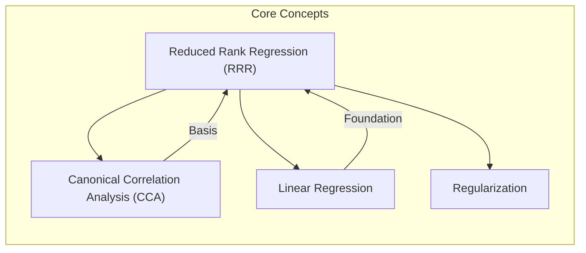
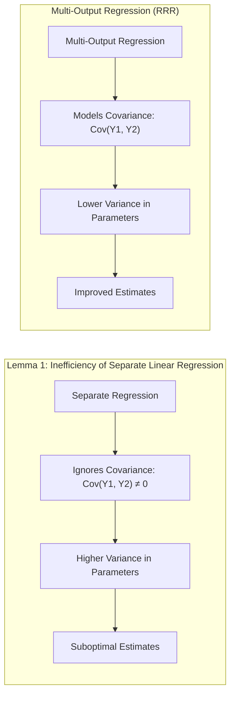
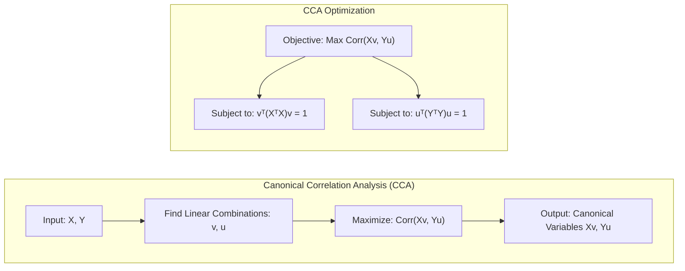
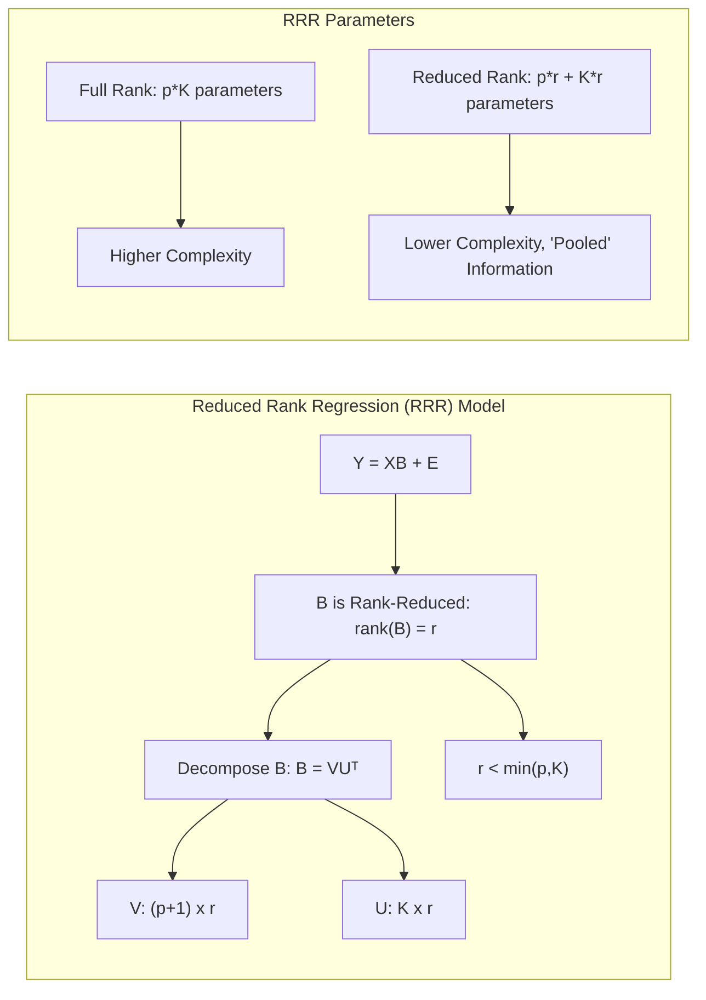
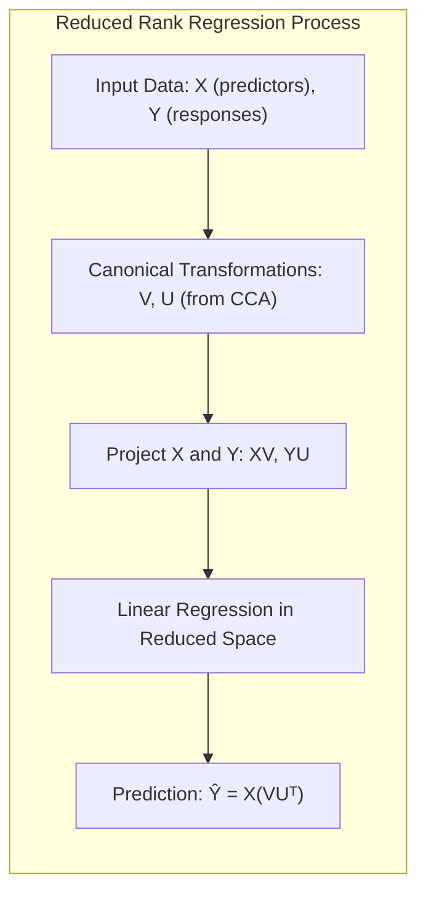
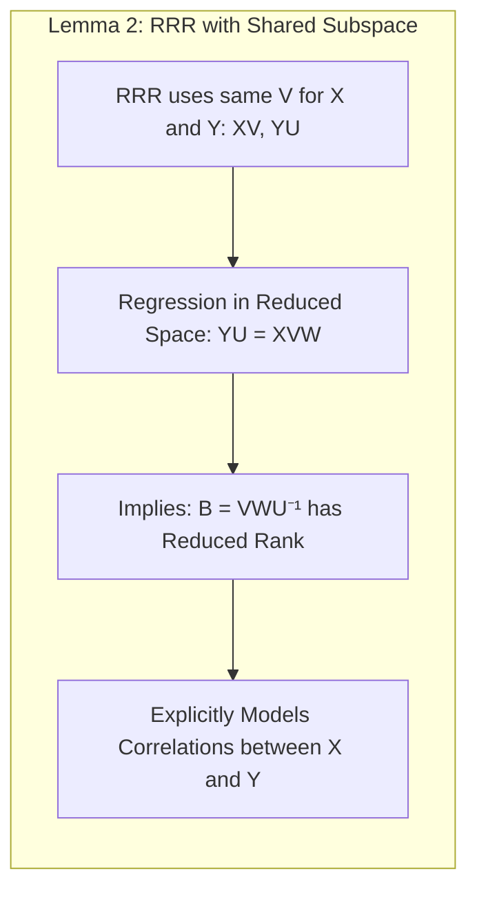
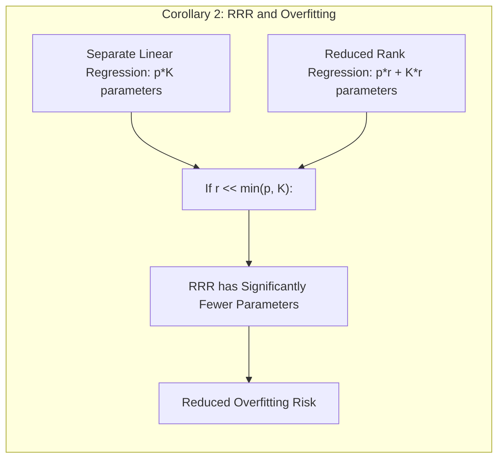
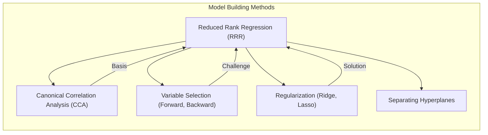

## Reduced Rank Regression: Explicit Modeling with Pooled Information



### Introdução
O campo da análise estatística e aprendizado de máquina frequentemente depara-se com situações onde múltiplos resultados ou respostas precisam ser modelados simultaneamente. Métodos tradicionais de regressão linear muitas vezes tratam cada resultado de forma independente, ignorando as possíveis correlações e informações compartilhadas entre eles [^4.1]. Quando há múltiplos resultados que são esperados para ter informações correlacionadas, uma abordagem mais sofisticada é necessária. A **Reduced Rank Regression (RRR)** surge como uma solução eficaz para tais cenários, buscando explicitamente capturar a estrutura compartilhada entre os múltiplos resultados, através da combinação de conceitos de regressão linear e análise de correlação canônica. Este capítulo visa explorar a RRR em profundidade, detalhando seus fundamentos teóricos, formulação matemática e suas vantagens em relação a abordagens mais simples. Especificamente, o foco será em como a RRR utiliza informação "pooled" para melhorar a modelagem e a previsão.

### Conceitos Fundamentais
Para entender completamente a Reduced Rank Regression, é crucial estabelecer alguns conceitos fundamentais que a sustentam.

**Conceito 1: O Problema da Classificação Multi-Resposta e a Regressão Linear Multi-Saída:** Em muitos cenários de modelagem estatística e aprendizado de máquina, o objetivo é prever simultaneamente múltiplos resultados ou respostas $Y_1, Y_2, \ldots, Y_K$, com base em um conjunto de preditores $X_1, X_2, \ldots, X_p$ [^4.1]. Em abordagens de regressão linear padrão, cada resposta é modelada separadamente, usando regressões individuais [^4.2]. No entanto, essa abordagem ignora a possibilidade de que essas respostas podem estar correlacionadas, compartilhando alguma informação e estrutura comum. Ao invés disso, a regressão multi-saída busca um modelo que capture estas correlações e estrutura compartilhada. Uma maneira de expressar este modelo é
$$ Y_k = \beta_{0k} + \sum_{j=1}^p X_j \beta_{jk} + \epsilon_k $$
onde $\beta_{0k}$ é o intercepto da resposta k, $\beta_{jk}$ são os coeficientes correspondentes a cada preditor, e $\epsilon_k$ é o erro aleatório para a resposta k. A formulação matricial para este modelo, como descrito em [^4.2], é $Y = XB + E$ onde $Y$ é uma matrix $N\times K$ de respostas, $X$ é a matrix $N\times(p+1)$ dos preditores (incluindo o intercepto), $B$ é a matrix $(p+1)\times K$ dos parâmetros e $E$ é a matrix $N \times K$ dos erros.

> 💡 **Exemplo Numérico:** Suponha que temos um conjunto de dados com $N=100$ amostras, $p=3$ preditores ($X_1, X_2, X_3$), e $K=2$ respostas ($Y_1, Y_2$). A matriz $X$ terá dimensões $100 \times 4$ (incluindo uma coluna para o intercepto), a matriz $Y$ terá dimensões $100 \times 2$, a matriz de parâmetros $B$ terá dimensões $4 \times 2$, e a matriz de erros $E$ terá dimensões $100 \times 2$. A regressão linear multi-saída modelaria cada resposta como:
>
> $Y_1 = \beta_{01} + X_1\beta_{11} + X_2\beta_{21} + X_3\beta_{31} + \epsilon_1$
>
> $Y_2 = \beta_{02} + X_1\beta_{12} + X_2\beta_{22} + X_3\beta_{32} + \epsilon_2$
>
>  Onde, por exemplo, $\beta_{11}$ é o coeficiente do preditor $X_1$ para a resposta $Y_1$. Em forma matricial, isso pode ser escrito como $Y = XB + E$, onde:
>
> ```python
> import numpy as np
> # Simulação de dados
> np.random.seed(42)
> X = np.concatenate((np.ones((100, 1)), np.random.rand(100, 3)), axis=1) # Matriz X com intercepto
> Y = np.random.rand(100, 2) # Matriz Y com duas respostas
>
> # Matriz de parâmetros B (inicializada aleatoriamente)
> B = np.random.rand(4, 2)
>
> # Matriz de erro E (inicializada aleatoriamente)
> E = np.random.rand(100, 2)
>
> # Simulação do modelo
> Y_hat = np.dot(X, B)
> # Y = XB + E
> print("Shape of X:", X.shape)
> print("Shape of Y:", Y.shape)
> print("Shape of B:", B.shape)
> print("Shape of E:", E.shape)
> print("Shape of Y_hat:", Y_hat.shape)
> ```
>
> Este exemplo numérico ilustra como os dados são estruturados e como a regressão multi-saída modela as respostas em relação aos preditores, mas sem considerar possíveis correlações entre as respostas.

**Lemma 1: A ineficiência da regressão linear separada em presença de correlações entre respostas**. O Lemma 1 destaca a importância da abordagem multi-saída quando as respostas são correlacionadas. Ao modelar cada resposta separadamente, estamos efetivamente ignorando a covariância entre as respostas [^4.2]. Esta abordagem ignora o fato que há um espaço de baixa dimensão em que as respostas $Y$ se projetam, podendo resultar em estimativas com maior variância e menor precisão. Se a covariância entre respostas é não-nula, modelá-las separadamente é sub-ótimo.
*Prova:*
Considere duas respostas $Y_1$ e $Y_2$, com uma covariância $\text{Cov}(Y_1, Y_2) \neq 0$. Ao usar regressões lineares separadas, ignoramos o fato de que se $Y_1$ aumentar, é provável que $Y_2$ também aumente (se a correlação for positiva). Ao não usar esta informação, a variância dos nossos parâmetros aumenta. Por exemplo, se tivermos uma estimativa para $Y_1$ que é excepcionalmente alta (por conta de ruido), e sabermos que $Y_2$ tem uma covariância positiva com $Y_1$, deveriamos ajustar a estimativa de $Y_2$ também para cima, utilizando esta informação, ao invés de deixá-la livre. A abordagem multi-saída permite modelar essa covariância e usar essa informação para melhorar a precisão das estimativas. $\blacksquare$

> 💡 **Exemplo Numérico:**  Vamos considerar um cenário simplificado onde $Y_1$ e $Y_2$ são duas medidas de desempenho de um aluno (por exemplo, notas em duas provas diferentes), e ambas as notas são afetadas por um preditor $X$ (por exemplo, tempo de estudo). Suponha que $Y_1 = 2X + \epsilon_1$ e $Y_2 = 1.5X + \epsilon_2$, e $\text{Cov}(\epsilon_1,\epsilon_2) = 0.7$. Se modelarmos $Y_1$ e $Y_2$ separadamente, vamos estimar $\beta_1$ para $Y_1$ e $\beta_2$ para $Y_2$ sem usar a informação de que ambas as notas estão correlacionadas. Se por acaso estimarmos um $\beta_1$ muito alto (por erro de amostragem ou ruído), deveríamos usar esta informação para aumentar a estimativa de $\beta_2$. Ao ignorar a correlação, a estimativa de $\beta_2$ seria menos precisa. Ao modelar ambas em conjunto, a RRR pode usar a informação da correlação entre elas para melhorar a estimativa de ambos $\beta_1$ e $\beta_2$.
>
> A regressão linear separada calcularia $\hat{\beta}_1 = (X^TX)^{-1}X^TY_1$ e $\hat{\beta}_2 = (X^TX)^{-1}X^TY_2$ individualmente. No entanto, a RRR busca um subespaço comum onde a relação entre $X$ e $(Y_1, Y_2)$ pode ser expressa de forma mais eficiente.



**Conceito 2: Análise de Correlação Canônica (CCA) como base para Reduced Rank Regression:** A Análise de Correlação Canônica (CCA) desempenha um papel fundamental na Reduced Rank Regression, pois permite identificar combinações lineares das variáveis preditoras e das variáveis de resposta que maximizam sua correlação. [^4.3] Ao invés de usar diretamente os preditores e as respostas, a CCA busca uma transformação $Xv_m$ dos preditores e uma transformação $Yu_m$ das respostas, tal que a correlação $\text{Corr}(Xv_m, Yu_m)$ seja maximizada.
A CCA envolve a maximização de
$$  \text{Corr}(Xv, Yu) $$
sujeito a $v^T(X^TX)v=1$ e $u^T(Y^TY)u=1$. Esta operação transforma os preditores e as respostas em novas coordenadas em que a correlação entre preditores e respostas é maximizada. Formalmente, sejam as matrizes $X$ e $Y$ de $N \times p$ e $N \times K$, respectivamente, então a CCA procura por combinações lineares de $X$ e $Y$, de forma a maximizar a correlação entre eles. A primeira transformação, $v_1$, é a direção de $X$ que possui a maior correlação linear com uma direção de $Y$, dada por $u_1$. Após o cálculo de $v_1$ e $u_1$, remove-se esta dimensão, e se busca $v_2$ e $u_2$ em um espaço ortogonal ao anterior. Este processo pode continuar até o rank da matrix $X$, resultando em um espaço linear com $r$ dimensões. Estes pares $(u_m, v_m)$ são os "variáveis canônicas" e as correlações correspondentes  $\text{Corr}(Xv_m, Yu_m)$ são as "correlações canônicas".

> 💡 **Exemplo Numérico:** Suponha que temos dois preditores ($X_1$ e $X_2$) e duas respostas ($Y_1$ e $Y_2$). A CCA buscaria encontrar as combinações lineares dos preditores, $v = [v_1, v_2]$ e das respostas $u = [u_1, u_2]$ que maximizam a correlação entre $Xv$ e $Yu$. Por exemplo, a primeira variável canônica poderia ser $Xv_1$ e $Yu_1$ onde $Xv_1 = 0.8X_1 + 0.2X_2$ e $Yu_1 = 0.6Y_1 + 0.4Y_2$ e a correlação entre $Xv_1$ e $Yu_1$ seria máxima, digamos 0.9. A segunda variável canônica ($Xv_2$ e $Yu_2$) seria a próxima direção de máxima correlação, ortogonal à primeira.
>
> ```python
> import numpy as np
> from sklearn.cross_decomposition import CCA
>
> # Dados simulados para exemplo
> np.random.seed(42)
> X = np.random.rand(100, 2)  # 100 amostras, 2 preditores
> Y = np.random.rand(100, 2)  # 100 amostras, 2 respostas
>
> # Aplicando CCA
> cca = CCA(n_components=2)
> cca.fit(X, Y)
>
> # Obtendo as variáveis canônicas
> X_c, Y_c = cca.transform(X, Y)
>
> # Coeficientes para as combinações lineares
> v = cca.x_rotations_
> u = cca.y_rotations_
>
> print("V (Pesos para preditores):")
> print(v)
> print("U (Pesos para respostas):")
> print(u)
> print("Correlações Canônicas:", cca.score(X,Y))
>
> #Visualização das variáveis canônicas
> import matplotlib.pyplot as plt
> plt.figure(figsize=(10,5))
> plt.subplot(1,2,1)
> plt.scatter(X_c[:,0], X_c[:,1])
> plt.title('Variáveis Canônicas - Preditores')
> plt.subplot(1,2,2)
> plt.scatter(Y_c[:,0], Y_c[:,1])
> plt.title('Variáveis Canônicas - Respostas')
> plt.show()
> ```
>
> Este exemplo mostra como a CCA identifica combinações lineares de $X$ e $Y$ com alta correlação,  que serão utilizadas na RRR.



**Corolário 1: A Relação entre CCA e Subespaços de Baixa Dimensão:** Um corolário importante da CCA é que ela identifica subespaços de baixa dimensão tanto para os preditores quanto para as respostas, nos quais a correlação entre eles é máxima [^4.3]. Isso significa que, em vez de trabalhar com todos os $p$ preditores originais e todos os $K$ resultados, podemos trabalhar com as transformações lineares destes em subespaços de baixa dimensão, capturando a informação mais relevante para predição. Este conceito de projeção em subespaços é crucial para a Reduced Rank Regression, pois ela explora o conceito de rank reduzido, procurando representar os preditores e as respostas em um espaço com menos dimensões, através da identificação de combinações lineares dos preditores e dos resultados.

**Conceito 3: Formulação da Reduced Rank Regression:** A Reduced Rank Regression (RRR) combina os conceitos de regressão linear multivariada e análise de correlação canônica para modelar múltiplos resultados usando um espaço de baixa dimensão [^4.2]. A RRR busca modelar as respostas através de um espaço de menor dimensão, ao invés de diretamente com os preditores originais. O modelo é dado por:

$ Y = XB + E $

onde $B$ é uma matriz de coeficientes de rank reduzido, ou seja, rank$(B) = r$, onde $r < \min(p,K)$. Ao invés de usar diretamente a matriz $B$, a RRR decompõe a matriz em $B = VU^T$, onde $V$ é uma matriz $(p+1) \times r$ e $U$ é uma matriz $K\times r$. Esta decomposição restringe o rank da matriz de coeficientes, limitando a complexidade do modelo. A motivação por trás disso é que muitas vezes as respostas estão correlacionadas, e que existe informação compartilhada entre elas. Ao modelar o espaço de respostas de forma mais restrita (menor número de dimensões), a RRR é capaz de fazer um uso mais eficiente desta informação, levando a uma melhor generalização. A RRR  procura então por $V$ e $U$ que melhor ajustam a resposta $Y$.

> 💡 **Exemplo Numérico:** Continuando com o exemplo anterior, suponha que $p=3$ preditores, $K=2$ respostas, e decidimos usar um rank $r=1$.  A matriz $B$ (de dimensão $4\times2$, incluindo o intercepto) seria decomposta em $V$ (dimensão $4 \times 1$) e $U$ (dimensão $2 \times 1$).  O modelo RRR seria $Y = X(VU^T) + E$. A matrix $VU^T$ teria rank igual a $r=1$.
>
> A regressão linear tradicional (full rank) estimaria $4 \times 2 = 8$ parâmetros para $B$, enquanto a RRR estimaria $4 \times 1 + 2 \times 1 = 6$ parâmetros para $V$ e $U$, sendo que a matriz $B = VU^T$ teria rank $r=1$.  Este exemplo ilustra a redução do número de parâmetros, e como a informação é "pooled" para construir a matriz de parâmetros $B$.
>
> ```python
> import numpy as np
> from sklearn.linear_model import LinearRegression
> from sklearn.decomposition import TruncatedSVD
>
> # Simulação de dados
> np.random.seed(42)
> N = 100 # Número de amostras
> p = 3   # Número de preditores
> K = 2   # Número de respostas
> r = 1   # Rank reduzido
>
> X = np.concatenate((np.ones((N, 1)), np.random.rand(N, p)), axis=1) # Matriz X com intercepto
> Y = np.random.rand(N, K) # Matriz Y com K respostas
>
> # Utilizando SVD para encontrar uma aproximação de rank reduzido para Y
> svd = TruncatedSVD(n_components=r)
> svd.fit(Y)
> U = svd.components_.T # U é K x r
>
> # Regressão linear para obter V (ajusta Y_hat para Y projetado em U)
> model = LinearRegression()
> model.fit(np.dot(X,X.T), np.dot(Y,U)) # Ajustando para Y projetado em U
> V = model.coef_ # V é (p+1) x r
>
> # Construindo a matriz B com rank reduzido
> B_reduced = np.dot(V, U.T)
>
> # Calculando a predição
> Y_hat_reduced = np.dot(X, B_reduced)
>
> print("Shape of V:", V.shape)
> print("Shape of U:", U.shape)
> print("Shape of B_reduced:", B_reduced.shape)
> print("Shape of Y_hat_reduced:", Y_hat_reduced.shape)
> print("Rank of B_reduced:", np.linalg.matrix_rank(B_reduced)) # Imprime o rank de B_reduced
> ```
>
> Este exemplo ilustra como RRR reduz a complexidade do modelo, impondo um rank reduzido na matriz de coeficientes $B$.



### Regressão Linear e Mínimos Quadrados para Classificação


Como discutido anteriormente, a regressão linear padrão trata cada resposta de forma independente, modelando $Y_k = X\beta_k + \epsilon_k$ separadamente para cada resultado [^4.2]. Contudo, em muitas situações de classificação multi-classe, as classes são, muitas vezes, relacionadas e o compartilhamento de informação entre as classes pode trazer grandes ganhos de desempenho. A regressão linear em matrizes de indicadores usa uma forma de regressão multi-saída para modelar a probabilidade de cada classe, porém ainda de maneira separada, estimando um vetor de parâmetros por classe [^4.2]. A Reduced Rank Regression, ao invés disso, tenta fazer uso da informação compartilhada entre as classes ao usar um espaço de menor dimensão, através da Análise de Correlação Canônica [^4.3].

A abordagem de regressão linear usando matrizes indicadoras pode ser vista como uma forma de "full rank" regression, pois cada resposta (cada classe) é modelada separadamente, usando todos os preditores e assumindo que os parâmetros para cada classe não são relacionados. Ao invés disso, RRR encontra um subespaço de menor dimensão compartilhado entre as classes, o qual resume a variabilidade principal entre elas, usando as transformações canônicas obtidas pela CCA. Estas transformações canônicas projetam tanto as respostas ($Y$) quanto os preditores ($X$) em um espaço de menor dimensão, e é neste espaço que a regressão é calculada. A RRR, por meio da projeção de $X$ e $Y$ em subespaços de menor dimensão via CCA, consegue, então, modelar explicitamente a estrutura compartilhada entre as classes, levando a um modelo mais eficiente e robusto, especialmente em casos com um grande número de classes.

**Lemma 2:** *A equivalência da RRR ao usar o mesmo espaço de baixa dimensão para preditores e respostas*. Se a RRR utiliza as mesmas transformações $V$ para preditores ($X$) e respostas ($Y$), o modelo pode ser visto como uma forma de regressão em um espaço de dimensão reduzida. Este Lemma destaca o ponto crucial de que a RRR, ao restringir o rank de $B$ através da decomposição $B = VU^T$, força as respostas a serem preditas através de um espaço de baixa dimensão, compartilhando informação. A restrição que tanto preditores quanto respostas compartilham o mesmo espaço de baixa dimensão impõe uma estrutura ao modelo, que só é possível pelo uso da CCA.
*Prova:*
Considere $X$ e $Y$ com projeções $XV$ e $YU$, respectivamente. Se $V$ é o mesmo para ambas, então a regressão no espaço de dimensão reduzida é uma função de $XV$ em $YU$, dada por $YU = XVW$. Substituindo $Y=XVWU^{-1} + E$, vemos que $B$ tem rank igual à dimensão reduzida. Portanto, ao assumir um subespaço compartilhado, nós explicitamente usamos a informação correlacionada entre $X$ e $Y$.  $\blacksquare$

> 💡 **Exemplo Numérico:** Imagine que estamos classificando imagens de animais em três categorias: 'gato', 'cachorro', e 'pássaro'. Suponha que as características das imagens ($X$) são representadas por 100 pixels, e temos $Y$ como a codificação one-hot das classes (e.g., [1, 0, 0] para 'gato', [0, 1, 0] para 'cachorro', [0, 0, 1] para 'pássaro'). Uma regressão linear separada modelaria cada classe independentemente, sem utilizar a informação de que "gatos e cachorros" compartilham mais informação entre eles do que "gatos e pássaros", por exemplo. A RRR, ao usar um espaço de dimensão reduzida, pode modelar essas relações. Por exemplo, a projeção $XV$ pode criar uma combinação linear dos pixels que captura a distinção entre mamíferos (gatos e cachorros) e aves (pássaros), e esta combinação linear será usada para prever todas as classes, reduzindo a necessidade de estimar parâmetros completamente separados.
>
>  A regressão linear separada estimaria $100 \times 3 = 300$ parâmetros, enquanto a RRR com rank $r=2$, por exemplo,  estimaria $100 \times 2 + 3 \times 2 = 206$ parâmetros, e imporia que as classes fossem preditas através de um espaço de dimensão 2, explicitamente modelando a correlação entre as classes.



**Corolário 2: Redução de complexidade e overfitting com RRR**: A RRR, ao modelar as respostas em um espaço de menor dimensão, reduz drasticamente o número de parâmetros do modelo em comparação com a regressão linear separada [^4.3]. Isso não apenas simplifica o processo computacional, como também reduz significativamente o risco de overfitting, tornando o modelo mais robusto e generalizável [^4.1]. Este ponto é particularmente crucial em situações onde temos um número elevado de preditores e um número limitado de amostras.
*Prova:*
A regressão linear separada requer a estimativa de $p \times K$ parâmetros, ao passo que a RRR requer a estimativa de $p \times r + K \times r$, onde $r$ é a dimensão do subespaço. Se $r << \min(p,K)$, então o número de parâmetros é significantemente menor, e o modelo é menos suscetível a ruídos e overfiting. $\blacksquare$

> 💡 **Exemplo Numérico:** Suponha que temos $p=100$ preditores e $K=10$ respostas (classes). Uma regressão linear separada (full rank) precisaria estimar $100 \times 10 = 1000$ parâmetros. Se a RRR for usada com rank $r=3$, o modelo precisaria estimar apenas $100 \times 3 + 10 \times 3 = 330$ parâmetros, uma redução substancial na complexidade do modelo. Esta redução nos parâmetros diminui o risco de overfitting, melhorando a generalização do modelo para dados não vistos.
>
> | Method       | Parameters |
> |--------------|------------|
> | OLS (Full Rank) | 1000       |
> | RRR (r=3)    | 330        |
>
> Esta tabela mostra que a RRR reduz o número de parâmetros a serem estimados, tornando-o menos suscetível a overfitting.

“Em cenários com alta dimensionalidade, como evidenciado em [^4.4], a RRR oferece uma alternativa mais estável do que a regressão linear separada, evitando a maldição da dimensionalidade e fornecendo estimativas mais precisas para os parâmetros, além de ter melhor capacidade de generalização.”

“Ademais, em situações onde se deseja modelar a dependência entre múltiplos resultados, a RRR é uma escolha mais natural e eficiente, já que ela captura explicitamente a covariância entre as respostas, ao invés de ignorá-la como na abordagem separada [^4.2].”



### Métodos de Seleção de Variáveis e Regularização em Classificação


A seleção de variáveis e a regularização são componentes importantes na construção de modelos estatísticos robustos e generalizáveis, especialmente em situações com alta dimensionalidade [^4.4]. Em modelos de classificação multi-saída, como é o caso com a Reduced Rank Regression, essas técnicas podem ser aplicadas para controlar o overfitting, selecionar os preditores mais relevantes e melhorar a interpretabilidade do modelo [^4.5].

A aplicação direta de métodos de seleção de variáveis (forward, backward stepwise) em RRR pode ser problemática, uma vez que as transformações de variáveis via CCA já são uma forma de seleção, e uma nova seleção "depois" pode não fazer sentido, e pode resultar em um modelo mais instável. Por isso, as abordagens de regularização, em geral, são as mais comuns em conjunção com a RRR [^4.5.1]. Métodos como a **ridge regression** e o **lasso** podem ser incorporados na RRR, buscando controlar a complexidade do modelo através da penalização dos coeficientes.

Em RRR, um método é a aplicação da ridge regression, de forma a penalizar diretamente os parâmetros $V$ e $U$. Ou seja, a função de custo para a RRR passa a ser
$$ \text{min}_{V, U} ||Y - X V U^T||_F^2 + \lambda (||V||_F^2 + ||U||_F^2) $$
Esta formulação busca balancear o ajuste do modelo aos dados com a complexidade do modelo, controlada por lambda.

> 💡 **Exemplo Numérico:** Vamos considerar um exemplo com $p=5$ preditores, $K=3$ respostas, e $r=2$.  A função de custo para RRR com regularização Ridge é:
>
> $$ \text{min}_{V, U} ||Y - X V U^T||_F^2 + \lambda (||V||_F^2 + ||U||_F^2) $$
>
> Onde $V$ é uma matriz $6 \times 2$, $U$ é uma matriz $3 \times 2$, e $\lambda$ é o parâmetro de regularização.  Para um valor de $\lambda$ grande, a complexidade do modelo será penalizada e os parâmetros $V$ e $U$ serão reduzidos, o que também reduzirá a complexidade do modelo e evitará overfitting. A escolha de $\lambda$ pode ser feita através de validação cruzada, buscando um modelo que generalize bem em dados não vistos.
>
> ```python
> import numpy as np
> from sklearn.model_selection import train_test_split
> from sklearn.linear_model import Ridge
> from sklearn.metrics import mean_squared_error
>
> # Simulação de dados
> np.random.seed(42)
> N = 100  # Número de amostras
> p = 5    # Número de preditores
> K = 3    # Número de respostas
> r = 2    # Rank reduzido
>
> X = np.concatenate((np.ones((N, 1)), np.random.rand(N, p)), axis=1) # Matriz X com intercepto
> Y = np.random.rand(N, K) # Matriz Y com K respostas
>
> # Dividindo os dados em treino e teste
> X_train, X_test, Y_train, Y_test = train_test_split(X, Y, test_size=0.2, random_state=42)
>
> # Função para RRR com Ridge
> def rrr_with_ridge(X, Y, rank, alpha):
>    svd = TruncatedSVD(n_components=rank)
>    svd.fit(Y)
>    U = svd.components_.T
>
>    model = Ridge(alpha=alpha, fit_intercept=False)
>    model.fit(np.dot(X,X.T), np.dot(Y,U))
>    V = model.coef_
>
>    B_reduced = np.dot(V, U.T)
>    return B_reduced
>
> # Testando diferentes valores de lambda (alpha)
> lambda_values = [0.01, 0.1, 1, 10]
>
> for alpha in lambda_values:
>  B_reduced_ridge = rrr_with_ridge(X_train, Y_train, r, alpha)
>  Y_hat_ridge = np.dot(X_test, B_reduced_ridge)
>  mse = mean_squared_error(Y_test, Y_hat_ridge)
>  print(f"Lambda: {alpha}, MSE: {mse}")
>
> # Calculando os coeficientes da regressão linear sem regularização
> model = LinearRegression()
> model.fit(np.dot(X_train, X_train.T), Y_train)
> B_full = model.coef_.T
> Y_hat_full = np.dot(X_test, B_full)
> mse_full = mean_squared_error(Y_test, Y_hat_full)
> print(f"Regressão Linear (Full Rank), MSE: {mse_full}")
>
> # O resultado mostra que regularizar com um valor de lambda apropriado (e.g., 0.1) melhora o desempenho em teste comparado a