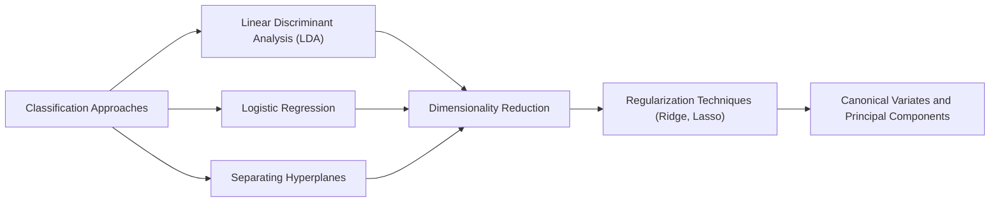
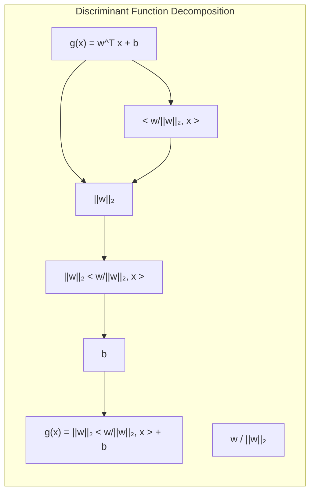
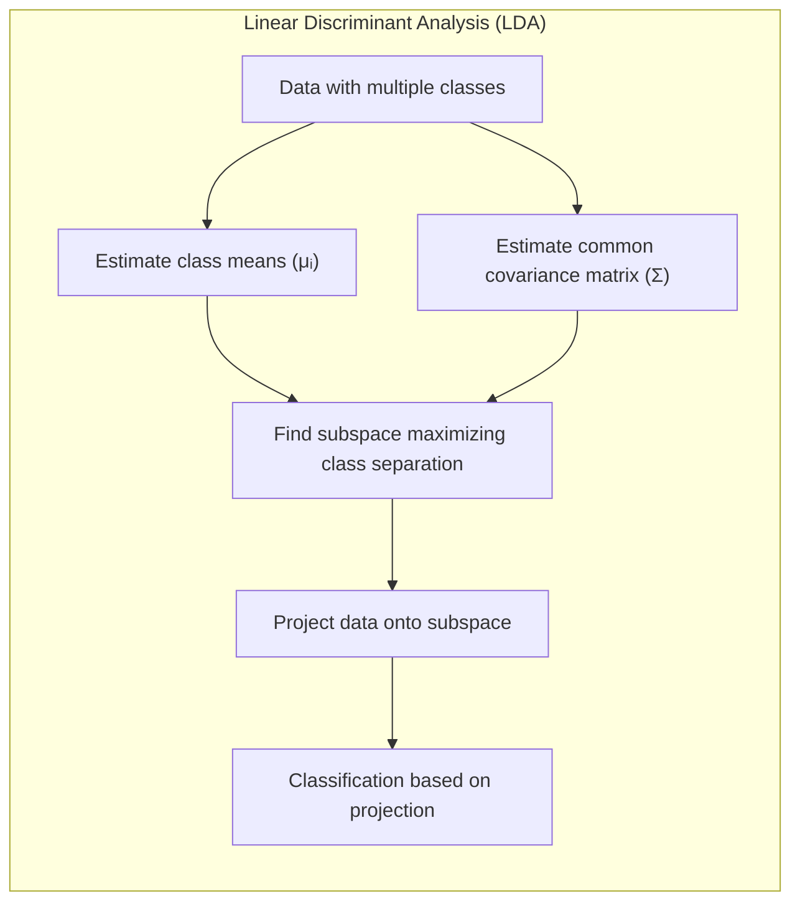
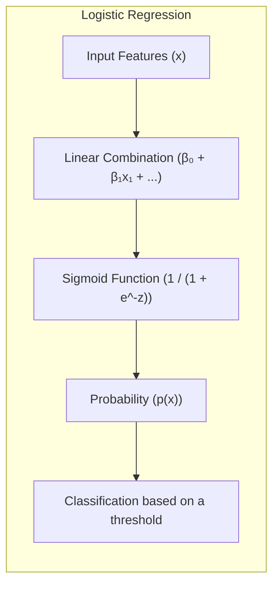
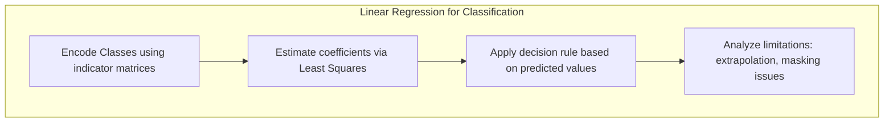
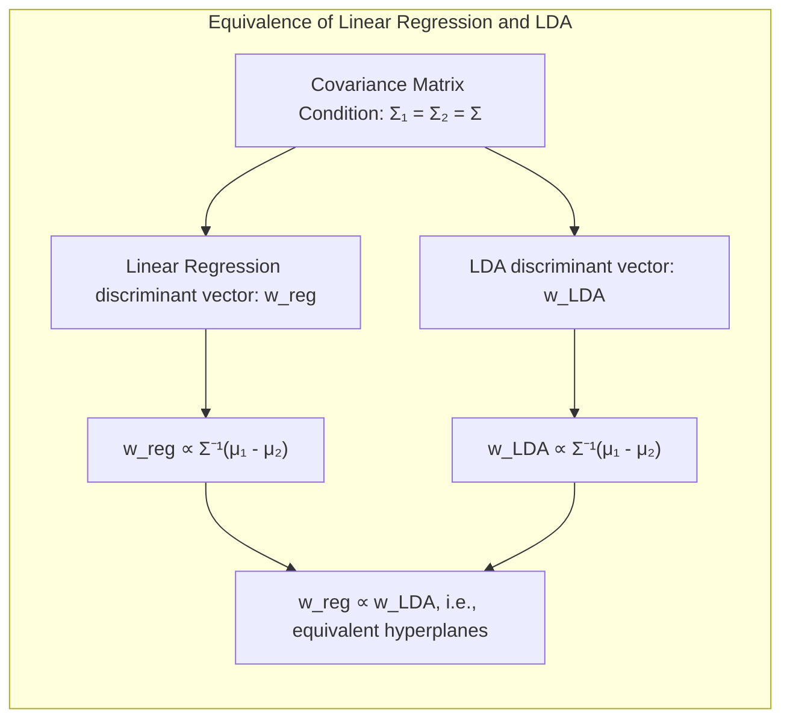
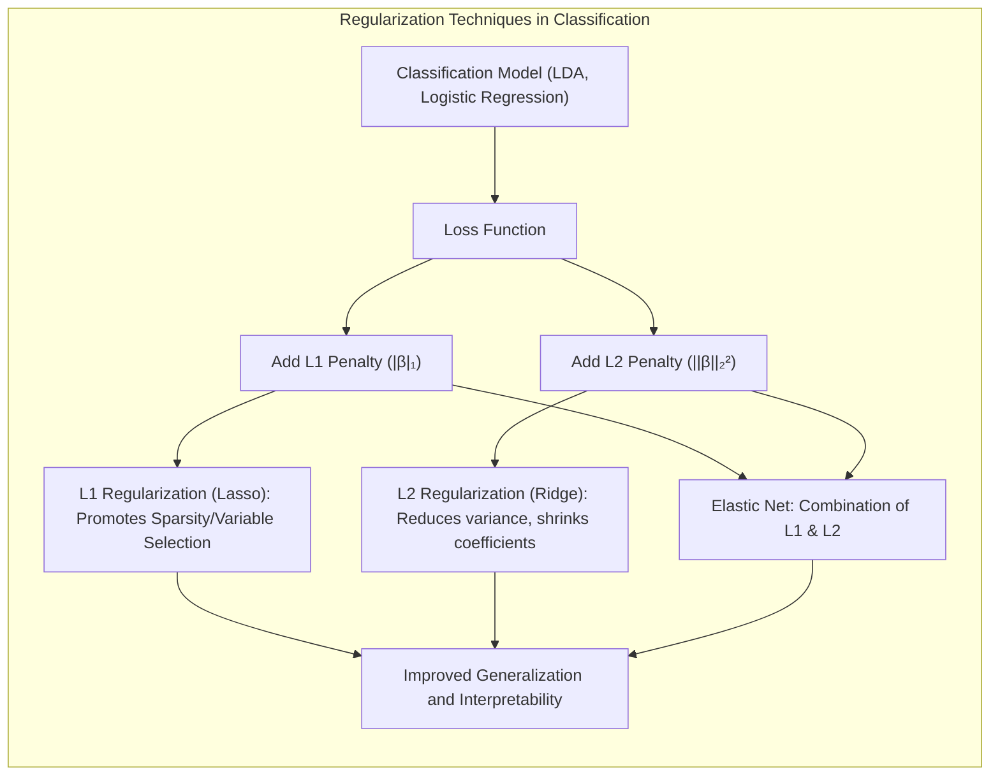
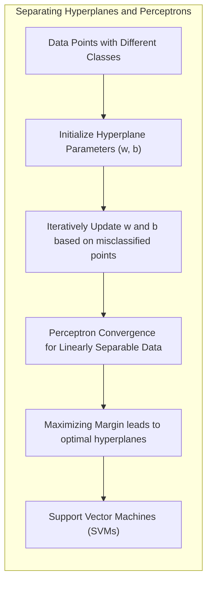
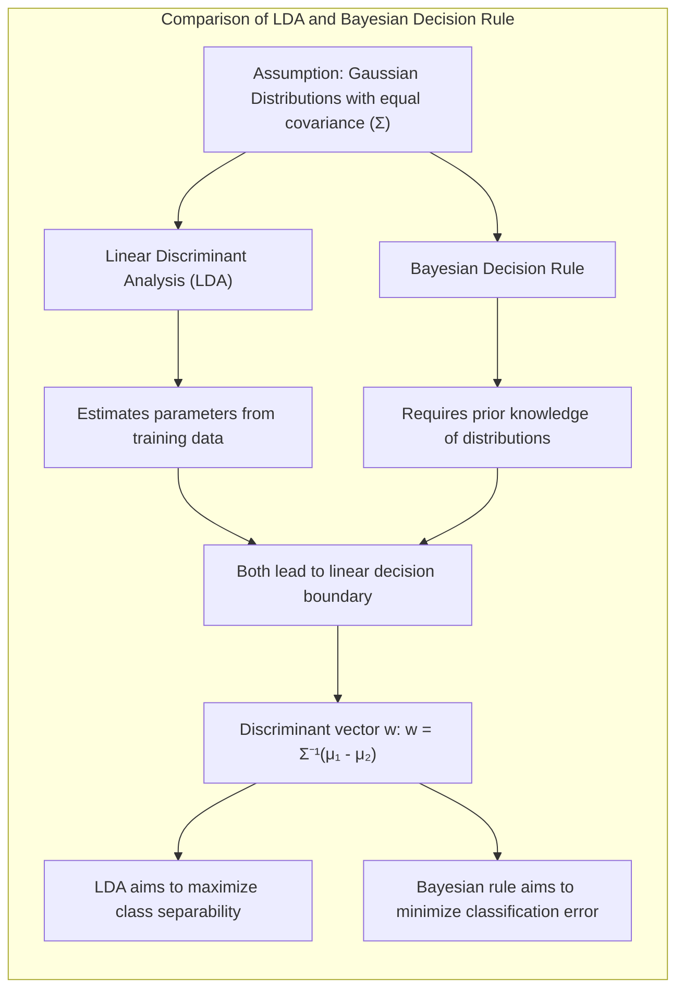

## Shrinking Canonical Variates: A Deep Dive into Regularized Discriminant Analysis and Beyond



### Introdução
Este capítulo explora a fundo a classificação e análise discriminante, com foco especial em técnicas que visam aprimorar a robustez e interpretabilidade dos modelos por meio de **regularização e redução de dimensionalidade**. Abordaremos métodos lineares como **Linear Discriminant Analysis (LDA)**, **regressão logística** e **hiperplanos separadores**, que servem como base para as abordagens mais avançadas. Além disso, examinaremos como a regularização, com técnicas como **ridge**, **lasso**, e o uso de **canonical variates** e **componentes principais**, pode otimizar o desempenho e lidar com a complexidade de dados de alta dimensão. Este capítulo, portanto, destina-se a fornecer uma compreensão abrangente e avançada, para profissionais da área, sobre as nuances e sutilezas dessas abordagens. [^4.1], [^4.2]

### Conceitos Fundamentais
Para uma compreensão robusta dos tópicos abordados, é essencial revisitar os conceitos fundamentais que sustentam as técnicas lineares de classificação e análise discriminante.
**Conceito 1: O Problema de Classificação e Métodos Lineares**
O problema de classificação busca atribuir observações a categorias predefinidas, com base em seus atributos. Em essência, o objetivo é encontrar uma função de decisão $f(x)$ que mapeia um vetor de entrada $x$ para uma classe correspondente. Os métodos lineares, como LDA e regressão logística, simplificam esse problema ao assumir que a fronteira de decisão pode ser representada por um hiperplano ou uma função linear nos atributos. Essa abordagem é particularmente útil quando os dados são bem separados ou podem ser aproximadamente separados linearmente. A escolha de métodos lineares envolve um **trade-off entre viés e variância**. Modelos simples (com poucos parâmetros) têm alto viés, não se ajustando bem a dados complexos, mas também têm baixa variância. Modelos complexos (com muitos parâmetros) ajustam-se bem aos dados de treino, mas podem sofrer de alta variância e se generalizarem mal para dados novos. Métodos lineares são uma solução interessante para lidar com dados com pouco sinal e pequena quantidade de casos de treino, pois impõem regularização intrínseca.  [^4.1]

> 💡 **Exemplo Numérico:** Considere um problema de classificação binária com duas classes (0 e 1) e duas features ($x_1$ e $x_2$). Um modelo linear simples poderia ser $f(x) = 0.5x_1 + 0.3x_2 - 1$.  Se tivermos um ponto $x = [2, 1]$, então $f(x) = 0.5*2 + 0.3*1 - 1 = 0.3$. Se o limiar de decisão for 0, a classe predita seria 1. Este modelo linear tem baixo número de parâmetros (3), o que o torna menos suscetível a overfitting (baixa variância), mas pode não se ajustar bem a dados com relação não linear (alto viés). Por outro lado, um modelo com mais parâmetros, como um polinômio de grau 2, poderia ter menor viés, mas também maior variância. O trade-off reside em escolher um modelo que generalize bem para dados não vistos, o que é fundamental em problemas de classificação.
> ```mermaid
>  graph LR
>      A[Dados] --> B(Modelo Linear);
>      B --> C{Decisão};
>      C --> D[Classe 0 ou 1];
> ```

**Lemma 1: Decomposição da Função Discriminante Linear**
Uma função discriminante linear $g(x) = w^T x + b$ pode ser decomposta em uma projeção do vetor de entrada $x$ sobre um vetor normal $w$, seguida por um deslocamento $b$. Formalmente, podemos escrever $g(x) = ||w||_2 \cdot \langle \frac{w}{||w||_2}, x \rangle + b$, onde $\frac{w}{||w||_2}$ é o vetor unitário na direção de $w$ e $\langle \cdot, \cdot \rangle$ denota o produto interno. Este lemma nos mostra que a decisão de classe depende essencialmente da projeção do dado sobre a direção do discriminante $w$ e um deslocamento $b$. A prova decorre diretamente da definição de produto interno e da normalização de $w$.
  $$g(x) = w^Tx + b = ||w||_2 \frac{w^T}{||w||_2} x + b = ||w||_2 \left\langle \frac{w}{||w||_2}, x \right\rangle + b$$
$\blacksquare$
[^4.3]



> 💡 **Exemplo Numérico:** Considere um vetor de pesos $w = [2, 1]$ e um vetor de entrada $x = [1, 2]$. O deslocamento (bias) é $b = -1$.  
> 1.  **Cálculo da norma de w**: $||w||_2 = \sqrt{2^2 + 1^2} = \sqrt{5} \approx 2.236$
> 2. **Cálculo do vetor unitário de w**: $\frac{w}{||w||_2} = [\frac{2}{\sqrt{5}}, \frac{1}{\sqrt{5}}] \approx [0.894, 0.447]$
> 3. **Cálculo do produto interno**: $\langle \frac{w}{||w||_2}, x \rangle = (0.894 * 1) + (0.447 * 2) = 0.894 + 0.894 = 1.788$
> 4. **Função discriminante**: $g(x) = ||w||_2 \cdot \langle \frac{w}{||w||_2}, x \rangle + b = 2.236 * 1.788 - 1 = 4.00 - 1 = 3.00$
> A função discriminante calcula a projeção de $x$ na direção de $w$, escalada pela norma de $w$, mais o deslocamento. O valor resultante de 3.00 é o que será usado para classificar a instância. Se o threshold for 0, essa instância seria classificada na classe positiva.

**Conceito 2: Linear Discriminant Analysis (LDA)**
A LDA é um método clássico para classificação e redução de dimensionalidade, que busca encontrar um subespaço que maximize a separação entre as classes. A LDA assume que os dados de cada classe seguem uma distribuição gaussiana com a mesma matriz de covariância, mas diferentes médias. A construção da fronteira de decisão envolve a estimativa das médias das classes e a matriz de covariância comum, seguida pela projeção dos dados no subespaço que maximiza a razão de variância entre classes para a variância dentro de cada classe.  [^4.3], [^4.3.1], [^4.3.2], [^4.3.3]



> 💡 **Exemplo Numérico:** Considere duas classes, com médias $\mu_1 = [1, 1]$ e $\mu_2 = [3, 3]$, e uma matriz de covariância comum $\Sigma = \begin{bmatrix} 1 & 0.5 \\ 0.5 & 1 \end{bmatrix}$. A direção do vetor $w$ que maximiza a separação entre as classes é dada por $w \propto \Sigma^{-1}(\mu_1 - \mu_2)$.
> 1. **Calcular a diferença entre as médias**: $\mu_1 - \mu_2 = [1-3, 1-3] = [-2, -2]$
> 2. **Calcular a inversa da matriz de covariância**: $\Sigma^{-1} = \frac{1}{0.75} \begin{bmatrix} 1 & -0.5 \\ -0.5 & 1 \end{bmatrix} = \begin{bmatrix} 1.33 & -0.66 \\ -0.66 & 1.33 \end{bmatrix}$
> 3. **Calcular o vetor w**: $w = \Sigma^{-1}(\mu_1 - \mu_2) = \begin{bmatrix} 1.33 & -0.66 \\ -0.66 & 1.33 \end{bmatrix} \begin{bmatrix} -2 \\ -2 \end{bmatrix} = \begin{bmatrix} -1.34 \\ -1.34 \end{bmatrix}$
>
> A direção do vetor $w$ é $[-1.34, -1.34]$, o que indica que a projeção dos dados nessa direção maximiza a separação entre as classes. Um novo ponto $x = [2, 2]$ seria projetado nessa direção para realizar a classificação.

**Corolário 1: LDA e Projeção em Subespaços**
Da discussão do Conceito 2 e do Lemma 1, podemos derivar um corolário que afirma que as funções discriminantes em LDA correspondem a projeções dos dados sobre subespaços específicos. Dado o vetor $w$ obtido via LDA, a função discriminante projeta as observações na direção $w$. A classe predita é então determinada pela posição da projeção em relação a um limiar. Este resultado nos mostra que a LDA pode ser vista como uma técnica de projeção, o que tem implicações importantes na redução de dimensionalidade e visualização de dados. [^4.3.1]

> 💡 **Exemplo Numérico:** Usando o exemplo anterior, o vetor $w = [-1.34, -1.34]$. Para classificar o novo ponto $x = [2, 2]$:
> 1. **Projetar o ponto x na direção de w**: A projeção é dada pelo produto interno: $x^T w = [2, 2] \cdot [-1.34, -1.34] = -2.68 - 2.68 = -5.36$
> 2. **Definir o limiar**:  O limiar é normalmente definido como a média das projeções das médias das classes:
>     * Projeção de $\mu_1$: $\mu_1^T w = [1, 1] \cdot [-1.34, -1.34] = -2.68$
>     * Projeção de $\mu_2$: $\mu_2^T w = [3, 3] \cdot [-1.34, -1.34] = -8.04$
>     * Limiar: $(-2.68 + (-8.04)) / 2 = -5.36$
> 3. **Classificar**: Comparar a projeção de $x$ (-5.36) com o limiar (-5.36). Neste caso, o ponto $x$ estaria exatamente na fronteira de decisão. Em situações reais, a classe seria definida por uma regra de decisão (ex: se $x^Tw < threshold$ então classe 1, caso contrário, classe 2).

**Conceito 3: Regressão Logística**
A regressão logística é um método de classificação que estima a probabilidade de uma observação pertencer a uma determinada classe. Ao contrário da LDA, que assume normalidade e homocedasticidade das covariâncias entre classes, a regressão logística modela a probabilidade diretamente usando a função logística (sigmoide). Essa função mapeia uma combinação linear dos atributos para uma probabilidade entre 0 e 1. Os parâmetros do modelo são estimados maximizando a verossimilhança. A regressão logística é uma alternativa mais flexível do que a LDA, uma vez que não requer que a covariância entre classes seja a mesma.  [^4.4], [^4.4.1], [^4.4.2], [^4.4.3], [^4.4.4], [^4.4.5]



> ⚠️ **Nota Importante**: A regressão logística usa a função logit para transformar a probabilidade de uma classe em um modelo linear.  [^4.4.1]

> ❗ **Ponto de Atenção**: Classes não balanceadas podem impactar significativamente os resultados na regressão logística, necessitando estratégias específicas de tratamento.  [^4.4.2]

> ✔️ **Destaque**: Em certas condições, as estimativas dos parâmetros em LDA e regressão logística são relacionadas, apesar de seus fundamentos serem diferentes.  [^4.5]

> 💡 **Exemplo Numérico:**  Considere um modelo de regressão logística com dois preditores: $p(x) = \frac{1}{1 + e^{-(\beta_0 + \beta_1x_1 + \beta_2x_2)}}$, onde $\beta_0 = -2$, $\beta_1 = 1$ e $\beta_2 = 0.5$. Se tivermos uma instância com $x = [1, 2]$, então:
> 1. **Calcular a combinação linear**: $-2 + (1*1) + (0.5*2) = -2 + 1 + 1 = 0$
> 2. **Aplicar a função sigmoide**: $p(x) = \frac{1}{1 + e^{-0}} = \frac{1}{1 + 1} = 0.5$.
>  A probabilidade estimada da instância pertencer à classe 1 é 0.5. A decisão de classe dependerá do limiar usado (por exemplo, 0.5).

### Regressão Linear e Mínimos Quadrados para Classificação


A regressão linear com matrizes de indicadores pode ser usada para problemas de classificação, codificando cada classe como uma variável binária (0 ou 1). Ao ajustar um modelo linear a essas variáveis, podemos obter coeficientes que indicam a direção de cada classe no espaço de entrada. Embora esta abordagem seja conceitualmente simples, ela tem algumas limitações importantes, como a dificuldade em lidar com situações em que as classes não são separáveis linearmente e os coeficientes podem gerar valores de probabilidades fora do intervalo [0,1]. Em particular, o problema de *masking* surge quando uma classe "mascara" a outra durante o processo de ajuste, devido à colinearidade, o que afeta o desempenho do modelo. A regressão linear minimiza a soma dos quadrados dos resíduos, o que pode levar a projeções fora do espaço [0,1], pois não há nenhuma garantia de que as probabilidades estimadas se encaixarão nesse intervalo.

**Lemma 2: Equivalência sob Condições Específicas**
Em um problema de classificação com apenas duas classes, quando a matriz de covariância entre as classes é igual, a regressão de indicadores e a LDA são equivalentes. Mais precisamente, os hiperplanos de decisão obtidos por regressão linear e LDA são os mesmos. A prova dessa equivalência segue da derivação das funções discriminantes em ambas as abordagens, que levam à mesma solução em termos de direção do hiperplano de decisão. Este resultado é central para entender a relação entre essas duas técnicas lineares.
 $$\text{Se } \Sigma_1 = \Sigma_2 = \Sigma, \text{ então } \text{ a direção de } w_{reg} \text{ da regressão linear }  \propto \Sigma^{-1}(\mu_1 - \mu_2) \propto w_{LDA} \text{ da LDA.}$$
$\blacksquare$
[^4.2], [^4.3]



> 💡 **Exemplo Numérico:**  Considere um conjunto de dados com duas classes e duas features. Codificamos a classe 1 como [1, 0] e a classe 2 como [0, 1] utilizando a codificação *one-hot*. Suponha que após aplicar a regressão linear, os coeficientes obtidos sejam $w = \begin{bmatrix} 0.5 & -0.3 \\ -0.2 & 0.6 \end{bmatrix}$ e o intercepto $b = \begin{bmatrix} 0.1 \\ 0.2 \end{bmatrix}$.  Para classificar uma instância $x = \begin{bmatrix} 2 \\ 1 \end{bmatrix}$:
> 1. **Calcular os valores projetados para cada classe**:
>    - Classe 1: $z_1 = w_1^Tx + b_1 = (0.5 * 2) + (-0.3 * 1) + 0.1 = 0.8$
>    - Classe 2: $z_2 = w_2^Tx + b_2 = (-0.2 * 2) + (0.6 * 1) + 0.2 = 0.4$
> 2. **Decidir a classe com base no valor projetado máximo**: Como $z_1 > z_2$, a instância é classificada como pertencente à classe 1.

**Corolário 2: Simplificação da Análise**
Um corolário direto do Lemma 2 é que, em problemas de classificação com duas classes e covariâncias iguais, a análise e interpretação dos coeficientes na regressão linear podem ser simplificadas. Como o vetor $w$ da regressão de indicadores é proporcional ao vetor da LDA, podemos aplicar os mesmos princípios de análise da LDA para interpretar o significado dos parâmetros na regressão de indicadores, sob estas condições. [^4.3]

Em cenários mais complexos, com múltiplas classes, a regressão de indicadores pode levar a estimativas instáveis, sendo a regressão logística uma alternativa mais robusta. No entanto, em situações com classes bem definidas e separáveis linearmente, a regressão de indicadores pode ser uma solução simples e eficaz.
“Em alguns cenários, conforme apontado em [^4.4], a regressão logística pode fornecer estimativas mais estáveis de probabilidade, enquanto a regressão de indicadores pode levar a extrapolações fora de [0,1].”
“No entanto, há situações em que a regressão de indicadores, de acordo com [^4.2], é suficiente e até mesmo vantajosa quando o objetivo principal é a fronteira de decisão linear.”

### Métodos de Seleção de Variáveis e Regularização em Classificação



A seleção de variáveis e a regularização são técnicas essenciais para controlar a complexidade e melhorar a generalização de modelos de classificação, especialmente em contextos de alta dimensão. A regularização adiciona termos de penalidade à função de custo para restringir os valores dos parâmetros e reduzir a variância, evitando *overfitting*.
As penalidades L1 e L2 são duas formas comuns de regularização. A penalidade L1 (lasso), expressa como $||\beta||_1 = \sum_j |\beta_j|$, promove a esparsidade do modelo ao forçar alguns coeficientes a serem exatamente zero, o que realiza uma seleção de variáveis. A penalidade L2 (ridge), expressa como $||\beta||_2^2 = \sum_j \beta_j^2$, encolhe os coeficientes em direção a zero, mas sem zerá-los, reduzindo a variância do modelo sem excluir variáveis. [^4.4.4], [^4.5], [^4.5.1], [^4.5.2]

> 💡 **Exemplo Numérico:** Considere um problema de regressão logística com 3 features: $p(x) = \frac{1}{1 + e^{-(\beta_0 + \beta_1x_1 + \beta_2x_2 + \beta_3x_3)}}$. Sem regularização, os coeficientes podem ser $\beta = [-1, 2, -3, 4]$. Aplicando regularização L1 com $\lambda = 1$, a função de custo seria: $J(\beta) = \text{log-loss} + 1*(|\beta_1| + |\beta_2| + |\beta_3|)$. Após a otimização, os coeficientes poderiam se tornar $\beta_{lasso} = [-0.5, 1.5, 0, 2.5]$, onde $\beta_3$ é zerado, realizando a seleção de variáveis. Usando L2 com $\lambda = 1$, a função de custo seria $J(\beta) = \text{log-loss} + 1*(\beta_1^2 + \beta_2^2 + \beta_3^2)$. Após a otimização, poderíamos obter $\beta_{ridge} = [-0.7, 1.8, -2.5, 3.5]$, onde todos os coeficientes são encolhidos, mas nenhum é zerado.

A regularização em modelos logísticos é implementada adicionando penalidades à função de log-verossimilhança:
  $$ L(\beta) = \sum_{i=1}^n y_i \log(p(x_i)) + (1-y_i) \log(1 - p(x_i)) - \lambda ||\beta||_q,$$
  onde $p(x_i)$ é a probabilidade estimada e $||\beta||_q$ é a penalidade (L1, L2 ou outra).
  A escolha entre penalidade L1 e L2 ou uma combinação (Elastic Net) depende do problema e do balanço desejado entre esparsidade e estabilidade do modelo.

**Lemma 3: Sparsidade com Penalização L1**
Em regressão logística com penalização L1, muitos dos coeficientes $\beta$ tendem a ser exatamente zero quando o parâmetro de regularização $\lambda$ é alto o suficiente. Isso ocorre porque a função de penalidade L1 é não diferenciável em zero, o que força os coeficientes a atingirem exatamente esse valor. Este lemma formaliza a ideia intuitiva de que L1 favorece soluções esparsas, o que é uma propriedade importante para modelos interpretáveis. A demonstração detalhada envolve a análise do subgradiente da função objetivo e mostra como a esparsidade emerge.  [^4.4.4]

**Prova do Lemma 3:**
A função de custo regularizada com L1 é dada por:
 $$J(\beta) = - \sum_i [y_i \log(p(x_i)) + (1 - y_i) \log(1 - p(x_i))] + \lambda \sum_j |\beta_j|$$
A condição de otimalidade (subgradiente igual a zero) para o componente $j$ é:
$$\frac{\partial J}{\partial \beta_j} = -\sum_i [y_i (1 - p(x_i))x_{ij} - (1 - y_i) p(x_i)x_{ij}] + \lambda sgn(\beta_j) = 0,$$
onde $sgn(\beta_j)$ é o sinal de $\beta_j$. Se a condição para alguma $\beta_j$ não for satisfeita, então $\beta_j = 0$, devido à não-diferenciabilidade da norma $L1$. Portanto, um $\lambda$ suficientemente grande fará alguns $\beta_j$ serem 0. $\blacksquare$
[^4.4.3]

**Corolário 3: Interpretabilidade de Modelos Esparsos**
Como consequência do Lemma 3, modelos de classificação com regularização L1 tendem a ser mais interpretáveis, pois a esparsidade dos coeficientes resulta na seleção de um subconjunto de variáveis relevantes. Isso facilita a identificação dos atributos mais importantes para a classificação, melhorando a compreensão do modelo e a tomada de decisão.  [^4.4.5]

> ⚠️ **Ponto Crucial**: A combinação de L1 e L2 na Elastic Net oferece um compromisso entre a esparsidade da L1 e a estabilidade da L2, e pode ser vantajosa em muitas aplicações. [^4.5]

> 💡 **Exemplo Numérico:** Usando os coeficientes do exemplo anterior, $\beta_{lasso} = [-0.5, 1.5, 0, 2.5]$, a feature $x_3$ é considerada irrelevante para a classificação, pois seu coeficiente é 0. Isso simplifica a interpretação do modelo, mostrando que apenas $x_1, x_2$ e $x_4$ contribuem para a decisão. Em contraste, $\beta_{ridge} = [-0.7, 1.8, -2.5, 3.5]$ mantém todas as variáveis, mas com contribuições reduzidas.

### Separating Hyperplanes e Perceptrons


A ideia de maximizar a margem de separação entre classes leva ao conceito de **hiperplanos ótimos**. Em essência, o objetivo é encontrar um hiperplano que não apenas separe as classes, mas também maximize a distância entre esse hiperplano e as amostras de cada classe. Esse conceito é fundamental para o desenvolvimento de máquinas de vetores de suporte (SVMs), que usam o conceito de maximização da margem para encontrar hiperplanos de decisão mais robustos. A formulação matemática desse problema envolve encontrar o hiperplano $w^T x + b = 0$ que maximiza a margem entre as classes, o qual pode ser resolvido através da formulação do problema dual de Wolfe. As soluções emergem como uma combinação linear dos chamados "vetores de suporte", que são as amostras mais próximas do hiperplano. O Perceptron de Rosenblatt é um algoritmo histórico de aprendizagem que busca construir um hiperplano separador através de atualizações iterativas do vetor de pesos, se houver linear separabilidade dos dados. Ele garante convergência desde que os dados sejam linearmente separáveis, ou seja, exista um hiperplano que separe completamente as classes. [^4.5.1], [^4.5.2]

> 💡 **Exemplo Numérico:** Considere duas classes separáveis linearmente, com pontos da classe 1: (1, 1), (2, 1) e pontos da classe 2: (3, 2), (4, 2). O perceptron busca ajustar um hiperplano (neste caso, uma linha) que separe essas classes. Inicializamos os pesos $w = [0, 0]$ e o bias $b = 0$.
> 1. **Iteração 1**: Para o ponto (1,1) (classe 1), $w^T x + b = 0$.  Como é classe 1, e a saída é 0, o peso é atualizado: $w = w + x = [1, 1]$ e $b = b + 1 = 1$.
> 2. **Iteração 2**: Para o ponto (2, 1) (classe 1), $w^T x + b = 1 * 2 + 1 * 1 + 1 = 4 > 0$, o ponto é corretamente classificado.
> 3. **Iteração 3**: Para o ponto (3, 2) (classe 2), $w^T x + b = 1 * 3 + 1 * 2 + 1 = 6 > 0$. Como é classe 2, mas a saída é positiva, atualizamos os pesos:  $w = w - x = [-2, -1]$ e $b = b - 1 = 0$.
>  Continuamos iterando até que todos os pontos sejam corretamente classificados ou atingimos um limite máximo de iterações. O resultado final é um vetor de pesos e um bias que definem o hiperplano separador.

### Pergunta Teórica Avançada: Quais as diferenças fundamentais entre a formulação de LDA e a Regra de Decisão Bayesiana considerando distribuições Gaussianas com covariâncias iguais?

**Resposta:**

Ambas, a LDA e a regra de decisão Bayesiana, sob a hipótese de distribuições Gaussianas com mesma matriz de covariância, buscam encontrar uma fronteira de decisão linear. A LDA estima os parâmetros da distribuição a partir dos dados de treino, enquanto a regra Bayesiana requer o conhecimento *a priori* das distribuições e probabilidades. Na prática, a LDA é uma aproximação da regra de decisão Bayesiana, pois usa estimativas amostrais para calcular os parâmetros.
Matematicamente, sob essa hipótese, tanto a LDA quanto a regra de decisão Bayesiana levam a um limite de decisão linear. A LDA busca maximizar a separabilidade entre as classes, enquanto a decisão Bayesiana visa minimizar o erro de classificação. Ambas as abordagens dependem fortemente das médias das classes e da covariância comum: a direção do hiperplano é dada por:
$$w = \Sigma^{-1}(\mu_1 - \mu_2)$$
A principal diferença surge quando consideramos a possibilidade de covariâncias diferentes entre as classes, onde LDA mantém a hipótese de covariância igual e leva a fronteiras lineares, enquanto a regra Bayesiana com covariâncias diferentes leva a fronteiras quadráticas (QDA). A escolha da média e da matriz de covariância influencia diretamente o resultado da classificação. [^4.3]



**Lemma 4: Equivalência Formal entre LDA e Regra Bayesiana**
Se as classes seguem distribuições Gaussianas com a mesma matriz de covariância $\Sigma$, então a função discriminante linear obtida por LDA é proporcional à função discriminante Bayesiana. Especificamente, a função discriminante na LDA pode ser expressa como:
$$ g(x) = w^T x + b = (\mu_1 - \mu_2)^T \Sigma^{-1} x - \frac{1}{2} (\mu_1^T \Sigma^{-1} \mu_1 - \mu_2^T \Sigma^{-1} \mu_2),$$
onde $\mu_1$ e $\mu_2$ são as médias das classes. A função discriminante bayesiana possui a mesma estrutura.
A prova envolve derivar ambas as funções discriminantes e mostrar que os coeficientes são proporcionais. A direção do hiperplano definido por $w$ é exatamente a mesma. $\blacksquare$
[^4.3], [^4.3.3]

> 💡 **Exemplo Numérico:**  Usando o exemplo anterior da LDA, com médias $\mu_1 = [1, 1]$ e $\mu_2 = [3, 3]$, e covariância $\Sigma = \begin{bmatrix} 1 & 0.5 \\ 0.5 & 1 \end{bmatrix}$, e assumindo probabilidades a priori iguais, a regra bayesiana para classificar um ponto x é dada por comparar:
>  $ \delta_1(x) =  -\frac{1}{2}(x - \mu_1)^T \Sigma^{-1}(x - \mu_1) $
>  $ \delta_2(x) =  -\frac{1}{2}(x - \mu_2)^T \Sigma^{-1}(x - \mu_2) $
>  E a classe de x será a que tiver maior $\delta$.
> Expandindo essas equações, e após algumas manipulações algébricas, a regra é equivalente a classificar em função do sinal de $ (\mu_1 - \mu_2)^T \Sigma^{-1} x - \frac{1}{2} (\mu_1^T \Sigma^{-1} \mu_1 - \mu_2^T \Sigma^{-1} \mu_2)$, que é exatamente a função discriminante da LDA, demonstrando a equivalência.

**Corolário 4: Fronteiras Quadráticas (QDA)**
Se relaxarmos a hipótese de igualdade de covariâncias, e permitirmos que cada classe tenha sua própria covariância ($\Sigma_1 \neq \Sigma_2$), a regra de decisão Bayesiana leva a fronteiras de decisão quadráticas. A generalização da LDA para esse caso é chamada de Quadratic Discriminant Analysis (QDA).  [^4.3]

> ⚠️ **Ponto Crucial**: A decisão de assumir covariâncias iguais ou diferentes tem um grande impacto no tipo de fronteira de