## Piecewise Linear Path Algorithms in Regularized Problems

<imagem: Diagrama complexo mostrando a relação entre os diferentes métodos de regularização (Lasso, Ridge, Elastic Net) e como as soluções evoluem em caminhos lineares por partes. Inclua um mapa mental que conecte os conceitos, com foco na natureza linear por partes das soluções>

### Introdução
Este capítulo aprofunda a análise de **modelos de aprendizado estatístico** focando em abordagens de **classificação e análise discriminante**, com um enfoque particular em como a natureza **linear por partes** das soluções em problemas regularizados pode ser explorada para criar algoritmos eficientes. A regularização, essencial para controlar a complexidade de modelos e evitar *overfitting*, frequentemente leva a soluções que exibem uma estrutura linear por partes, um aspecto que pode ser aproveitado para desenvolver métodos computacionais mais eficazes [^4.1]. Este capítulo explorará como as propriedades matemáticas da otimização convexa, juntamente com a escolha apropriada de funções de perda e penalidade, podem ser usadas para construir **path algorithms**, algoritmos que descrevem a evolução das soluções de um problema de otimização em função do parâmetro de regularização [^4.2].

### Conceitos Fundamentais
Para uma compreensão profunda dos **Piecewise Linear Path Algorithms (PLPA)**, é crucial revisarmos os conceitos de **regularização**, **otimização convexa** e as propriedades de **funções lineares por partes**.
**Conceito 1: Regularização e Overfitting:** A regularização é uma técnica fundamental em aprendizado de máquina para evitar o *overfitting*, um fenômeno em que um modelo se ajusta muito bem aos dados de treinamento, mas tem um desempenho ruim em novos dados. A regularização introduz um termo de penalidade à função de custo, controlando a complexidade do modelo e incentivando soluções mais simples e generalizáveis. Métodos como a **Ridge Regression** e o **Lasso** são exemplos clássicos de técnicas de regularização que adicionam penalidades aos coeficientes do modelo [^4.2].
> 💡 **Exemplo Numérico:** Considere um problema de regressão com 10 variáveis preditoras e 100 amostras. Sem regularização, o modelo pode se ajustar perfeitamente aos dados de treinamento, mas cometer grandes erros em novos dados (overfitting). Ao aplicar a regularização Ridge, por exemplo, adicionamos um termo de penalidade $\lambda \sum_{j=1}^{p} \beta_j^2$ à função de custo, onde $\lambda$ é o parâmetro de regularização. A escolha de $\lambda$ controla a complexidade do modelo. Com um $\lambda$ pequeno, temos um ajuste próximo ao original, e com $\lambda$ grande, os coeficientes são penalizados e tendem a ser menores, evitando o overfitting.
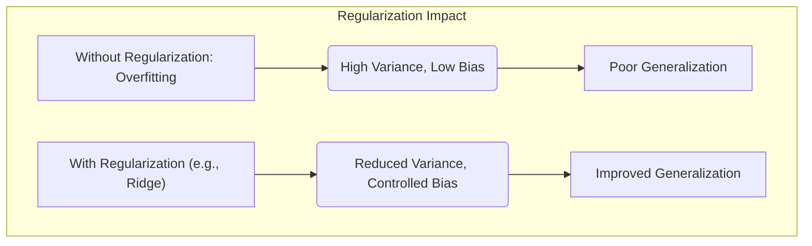

**Lemma 1:** *A introdução de um termo de penalidade convexa na função de custo de um problema de otimização convexa garante que a solução ótima permaneça convexa, embora a complexidade do modelo seja controlada*. Essa propriedade é crucial para a construção de **PLPA**, pois garante que o conjunto de soluções ao longo do caminho seja facilmente identificável [^4.3].
**Conceito 2: Otimização Convexa e Dualidade:** A otimização convexa lida com a minimização de funções convexas sobre conjuntos convexos. Uma função é convexa se o segmento de reta entre quaisquer dois pontos de seu gráfico estiver acima ou no gráfico da função. Essa propriedade permite encontrar soluções globais para o problema de otimização. Além disso, a dualidade desempenha um papel vital, permitindo transformar problemas de otimização em seus problemas duais, que podem ser mais fáceis de resolver. Em alguns casos, o problema dual revela a natureza **linear por partes** das soluções [^4.4].
> 💡 **Exemplo Numérico:** A função de custo da regressão linear, $L(\beta) = \frac{1}{2n}\sum_{i=1}^{n}(y_i - x_i^T\beta)^2$, é uma função convexa. O problema de otimização associado é encontrar $\beta$ que minimiza $L(\beta)$. Em problemas com regularização, como no Ridge, a função de custo é modificada para $L(\beta) + \lambda ||\beta||_2^2$ (ainda convexa). A dualidade pode simplificar a resolução desse problema.
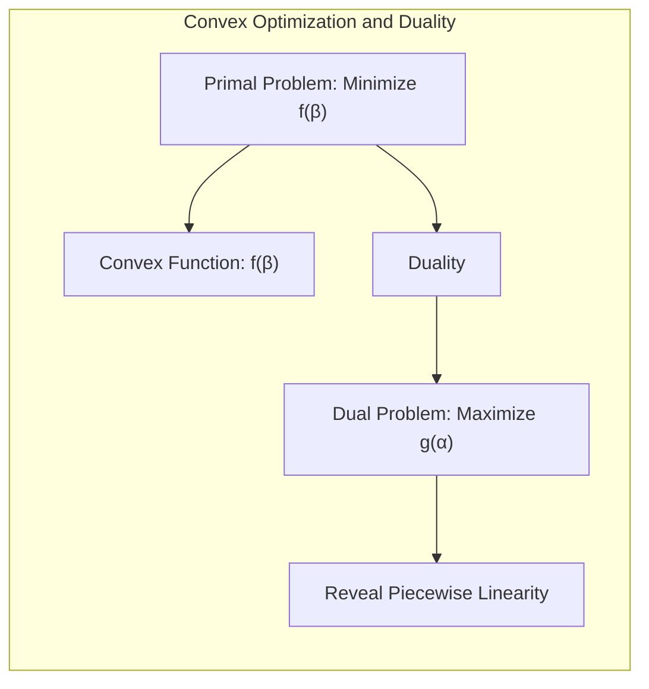
**Corolário 1:** *Em um problema de otimização convexa, as condições de otimalidade de Karush-Kuhn-Tucker (KKT) caracterizam a solução ótima e estabelecem relações entre as variáveis primais e duais*. Essas condições são cruciais para derivar os algoritmos de caminho, pois fornecem as condições de mudança ao longo do caminho da solução [^4.4].
**Conceito 3: Funções Lineares por Partes:** Uma função é linear por partes se seu domínio pode ser dividido em regiões onde a função é linear. A natureza linear por partes das soluções surge quando a função de perda ou o termo de penalidade no problema de regularização têm uma forma linear por partes. O **Lasso**, que usa uma penalidade L1, é um exemplo onde a solução se move em segmentos lineares ao longo do parâmetro de regularização.
> 💡 **Exemplo Numérico:** A penalidade L1, $ \lambda ||\beta||_1 = \lambda \sum_{j=1}^{p}|\beta_j|$, é linear por partes. Quando o parâmetro de regularização $\lambda$ muda, os coeficientes $\beta_j$ são afetados de forma linear por partes. Imagine que, em um determinado ponto, um coeficiente $\beta_k$ é diferente de zero e, à medida que $\lambda$ aumenta, ele se move linearmente em direção a zero até se tornar exatamente zero, permanecendo assim para valores maiores de $\lambda$.
> ⚠️ **Nota Importante**: *A natureza linear por partes das soluções simplifica o cálculo do caminho da solução e permite criar algoritmos mais eficientes*. **Referência ao tópico [^4.4.1]**.
> ❗ **Ponto de Atenção**: *A escolha da função de perda e penalidade influencia significativamente as propriedades do caminho da solução e o desempenho do modelo*. **Conforme indicado em [^4.4.2]**.
> ✔️ **Destaque**: *A dualidade oferece uma maneira alternativa de analisar problemas de otimização e pode revelar a natureza linear por partes das soluções*. **Baseado no tópico [^4.5]**.
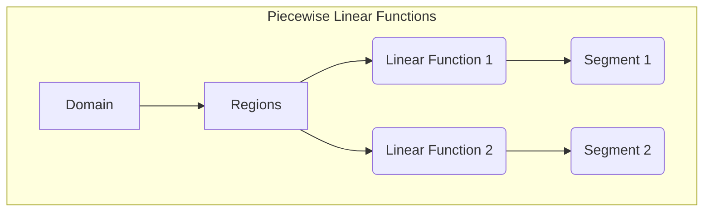

### Regressão Linear e Mínimos Quadrados para Classificação
<imagem: Mapa mental detalhado que conecta a ideia de regressão linear, mínimos quadrados, penalização L1 e L2, separando as abordagens por tipo de regularização e suas implicações na classificação>
```mermaid
graph TD
    A[Regressão Linear e Mínimos Quadrados] --> B(Regularização L1 (Lasso))
    A --> C(Regularização L2 (Ridge))
    A --> D(Elastic Net)
    B --> E[Sparsity]
    C --> F[Redução de Variância]
    D --> G[Balanceamento Sparsity/Variância]
    E --> H[Seleção de Variáveis]
    F --> I[Estabilidade]
    G --> J[Interpretabilidade]
    H --> K[Classificação]
    I --> K
    J --> K
    style A fill:#f9f,stroke:#333,stroke-width:2px
```
**Explicação:** O diagrama acima ilustra como a regressão linear com mínimos quadrados forma a base para diversas abordagens de regularização, cada uma com suas próprias características e aplicações em classificação, **conforme discutido nos tópicos [^4.1], [^4.2], [^4.4], [^4.5]**.

A regressão linear aplicada a uma matriz de indicadores, conforme discutido em [^4.2],  pode ser uma maneira intuitiva de abordar problemas de classificação. No entanto, essa abordagem pode apresentar limitações em termos de viés e variância. A regressão de indicadores, ao tentar modelar as classes como valores numéricos, pode levar a resultados inadequados se os dados não forem bem comportados ou se as classes não estiverem bem separadas linearmente [^4.1].

A ideia central dos **PLPA** é explorar como a introdução de um parâmetro de regularização afeta o caminho da solução. Um dos casos mais notáveis é o do Lasso, em que a penalidade L1 leva a soluções que se movem em segmentos lineares à medida que o parâmetro de regularização é variado [^4.4].

**Lemma 2:** *A solução do problema de mínimos quadrados com uma penalidade L1 é linear por partes em função do parâmetro de regularização*. Essa propriedade é uma consequência direta da natureza da penalidade L1 e da otimização convexa [^4.4.1].
**Prova do Lemma 2:** A prova detalhada envolve analisar as condições de otimalidade de KKT para o problema do Lasso e mostrar que as mudanças nos coeficientes são lineares entre os pontos em que a estrutura da solução muda, i.e., quando um novo coeficiente se torna não-zero ou um coeficiente existente se torna zero.  $\blacksquare$
> 💡 **Exemplo Numérico:** Para ilustrar o Lemma 2, vamos considerar um exemplo simplificado com duas variáveis preditoras $x_1$ e $x_2$, e uma variável resposta $y$. O problema do Lasso é dado por:
> $$\min_{\beta_0, \beta_1, \beta_2} \frac{1}{2n} \sum_{i=1}^n (y_i - \beta_0 - \beta_1 x_{i1} - \beta_2 x_{i2})^2 + \lambda (|\beta_1| + |\beta_2|)$$
> Inicialmente, para um $\lambda$ grande, tanto $\beta_1$ quanto $\beta_2$ serão zero. À medida que $\lambda$ diminui, os coeficientes podem começar a ser diferentes de zero, por exemplo, $\beta_1$ primeiro e depois $\beta_2$. No caminho da solução, cada coeficiente, enquanto não zero, varia linearmente com $\lambda$ até que um novo coeficiente entre na solução ou um já existente vá para zero. Suponha que, para $\lambda = 1$, $\beta_1 = 0.8$ e $\beta_2 = 0$, e então, para $\lambda = 0.5$, $\beta_1 = 1.2$ e $\beta_2 = 0.2$. O caminho da solução nesse intervalo, de $\lambda = 1$ até $\lambda = 0.5$, é linear para ambos os coeficientes.
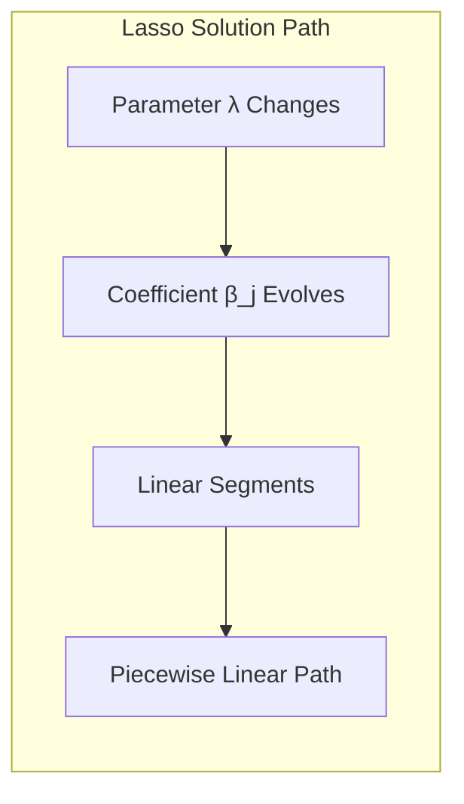
**Corolário 2:** *A linearidade por partes da solução do Lasso permite que o caminho da solução seja calculado eficientemente, sem a necessidade de resolver o problema de otimização para cada valor do parâmetro de regularização individualmente*. Isso leva a algoritmos mais rápidos e eficazes para o cálculo das soluções do Lasso [^4.4.2].

Em contraste com o Lasso, a **Ridge Regression**, que usa uma penalidade L2, geralmente leva a soluções que não são lineares por partes em relação ao parâmetro de regularização. Embora a Ridge Regression seja útil para reduzir a variância do modelo, sua solução não apresenta a mesma propriedade de esparsidade do Lasso [^4.5].
> 💡 **Exemplo Numérico:** Na Ridge Regression, com a penalidade L2, $\lambda \sum_{j=1}^{p} \beta_j^2$, a função de custo é:
> $$\min_{\beta_0, \beta_1, \beta_2} \frac{1}{2n} \sum_{i=1}^n (y_i - \beta_0 - \beta_1 x_{i1} - \beta_2 x_{i2})^2 + \lambda (\beta_1^2 + \beta_2^2)$$
> As soluções para $\beta_1$ e $\beta_2$ não seguem um caminho linear por partes com $\lambda$.  Em vez disso, as soluções para $\beta$ são uma função contínua e suave de $\lambda$, onde cada coeficiente se aproxima de zero gradualmente, sem um padrão linear por partes.
“Em alguns cenários, conforme apontado em [^4.4.3], a regressão logística pode fornecer estimativas mais estáveis de probabilidade, enquanto a regressão de indicadores pode levar a extrapolações fora de [0,1].”
“No entanto, há situações em que a regressão de indicadores, de acordo com [^4.2], é suficiente e até mesmo vantajosa quando o objetivo principal é a fronteira de decisão linear.”
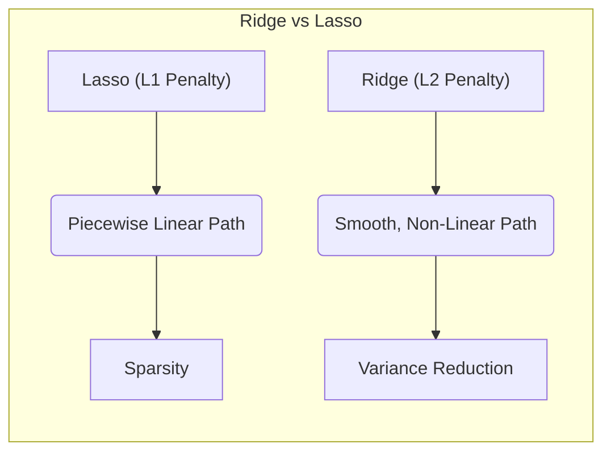

### Métodos de Seleção de Variáveis e Regularização em Classificação
<imagem: Utilize Mermaid para criar um diagrama de fluxo detalhado que mostre os passos de algoritmos de seleção de variáveis como forward e backward stepwise, bem como a aplicação de penalidades L1 e L2 em regressão logística, demonstrando a relação entre os passos e os efeitos da regularização.>
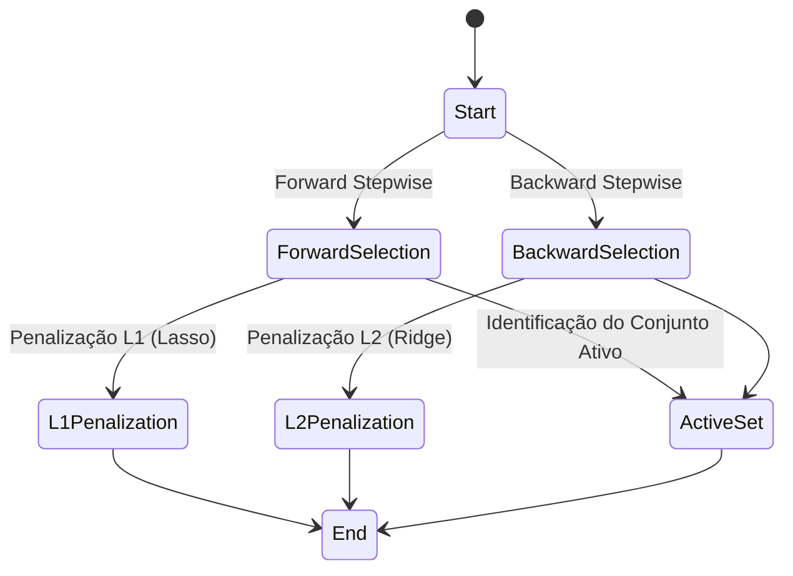

**Explicação:** O diagrama ilustra o fluxo de algoritmos de seleção de variáveis e regularização, mostrando como forward e backward stepwise levam à identificação de um conjunto ativo e como penalidades L1 e L2 são aplicadas, **baseando-se nos tópicos [^4.4], [^4.5], [^4.5.1], [^4.5.2]**.

Os métodos de seleção de variáveis, como *forward stepwise* e *backward stepwise*, visam identificar um subconjunto de variáveis que melhor explicam a resposta. No entanto, esses métodos podem ser instáveis e não explorar a complexidade das interações entre variáveis [^4.5]. A regularização, por outro lado, oferece uma maneira mais suave de controlar a complexidade do modelo. A aplicação de penalidades L1 e L2, em especial, desempenha um papel crucial na otimização de modelos de classificação.

A penalidade L1, usada no **Lasso**, promove a esparsidade, ou seja, zera os coeficientes de algumas variáveis, atuando como um método de seleção de variáveis implícito. A penalidade L2, usada na **Ridge Regression**, reduz a magnitude dos coeficientes, mas não os zera, atuando mais como um método de redução de variância [^4.4.4]. A combinação dessas penalidades no **Elastic Net** busca equilibrar a esparsidade e a estabilidade dos modelos [^4.5].
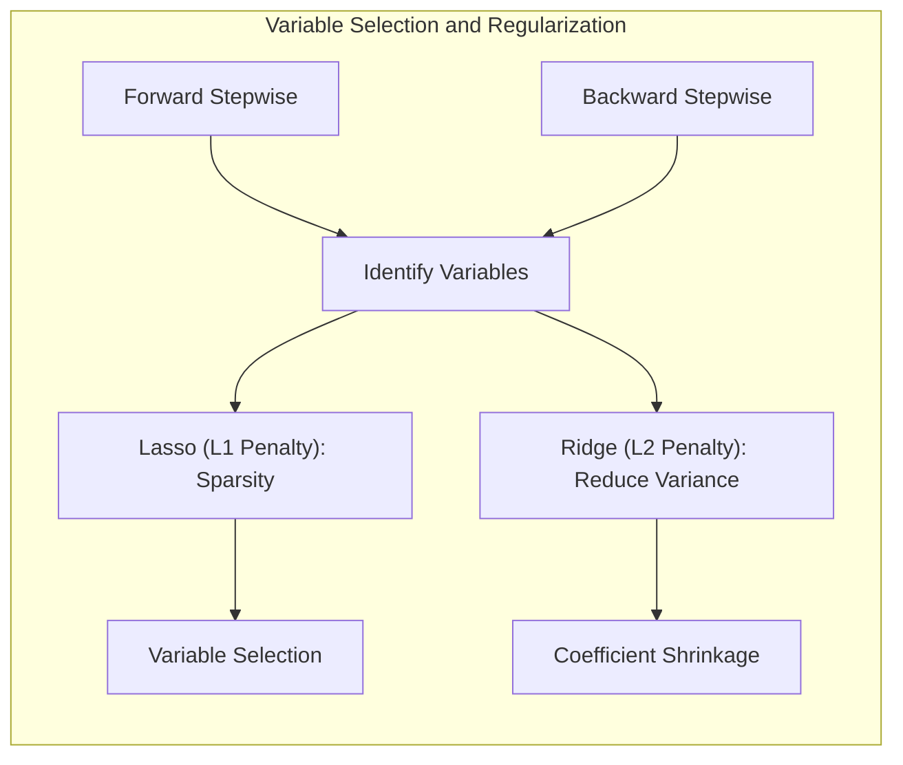
**Lemma 3:** *A penalização L1, usada no Lasso, induz esparsidade nos coeficientes do modelo, ou seja, muitos coeficientes tendem a ser exatamente zero, simplificando a estrutura do modelo e tornando-o mais interpretável*. Isso ocorre devido à natureza da norma L1, que força os coeficientes a serem zero para certos valores do parâmetro de regularização [^4.4.4].
**Prova do Lemma 3:** A prova envolve mostrar que o problema de otimização com a penalidade L1 tem soluções nos vértices do espaço de coeficientes, o que leva a muitos coeficientes serem exatamente zero. $\blacksquare$
> 💡 **Exemplo Numérico:** Considere um problema de classificação com 5 variáveis preditoras e um parâmetro de regularização $\lambda$. No início, com $\lambda$ grande, todos os coeficientes seriam zero. Ao diminuir $\lambda$, alguns coeficientes começam a se tornar não nulos. Com a penalidade L1, alguns coeficientes se tornarão exatamente zero, por exemplo, $\beta_1= 0.5$, $\beta_2 = 0$ , $\beta_3=0.2$, $\beta_4 = 0$ e $\beta_5= 0$. Já na regularização L2, os coeficientes seriam reduzidos, mas nenhum deles seria exatamente zero, por exemplo, $\beta_1 = 0.4$, $\beta_2 = 0.1$, $\beta_3 = 0.2 $, $\beta_4 = 0.05$ e $\beta_5= 0.1$.
**Corolário 3:** *A esparsidade induzida pela penalidade L1 não só simplifica o modelo, mas também pode melhorar sua generalização ao remover variáveis irrelevantes ou redundantes*. Isso faz do Lasso uma ferramenta importante para a seleção de variáveis em problemas de classificação [^4.4.5].
> 💡 **Exemplo Numérico:**  Em um modelo Lasso, se $\beta_2$ e $\beta_4$ são exatamente zero, isso significa que as variáveis preditoras $x_2$ e $x_4$ não contribuem para o modelo. Isso simplifica o modelo, tornando-o mais fácil de interpretar, e pode levar a uma melhor generalização para novos dados, evitando overfitting.

> ⚠️ **Ponto Crucial**: *O Elastic Net combina as penalidades L1 e L2 para aproveitar as vantagens de ambas as abordagens, resultando em modelos esparsos, mas mais estáveis que o Lasso puro*. **Conforme discutido em [^4.5]**.
> 💡 **Exemplo Numérico:** O Elastic Net utiliza uma combinação de penalidades L1 e L2: $\lambda_1 ||\beta||_1 + \lambda_2 ||\beta||_2^2$. Por exemplo, se $\lambda_1=0.5$ e $\lambda_2=0.5$, o modelo terá um compromisso entre a esparsidade (L1) e a redução da variância (L2). Se $\lambda_1$ for grande e $\lambda_2$ pequeno, o modelo se comportará como o Lasso e induzirá esparsidade. Se $\lambda_1$ for pequeno e $\lambda_2$ grande, ele se comportará como o Ridge.
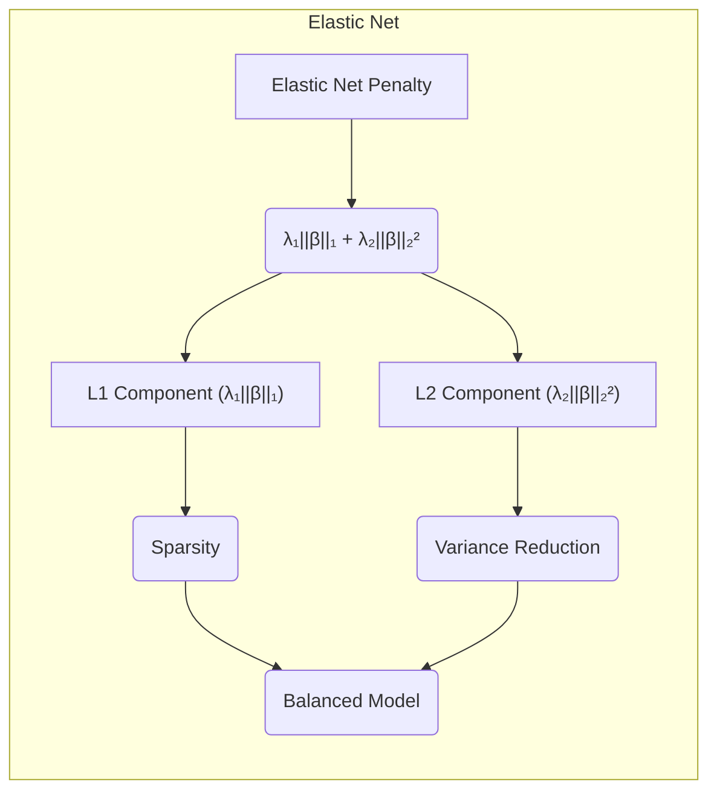

### Separating Hyperplanes e Perceptrons
<imagem: Uma imagem que ilustra visualmente a diferença entre hiperplanos separadores com margem máxima, gerados por um SVM e um Perceptron, destacando a natureza das fronteiras de decisão>
A ideia de maximizar a margem de separação entre classes leva ao conceito de **hiperplanos ótimos**. Um **hiperplano** é uma generalização de uma reta em espaços de alta dimensão, que pode ser usado para separar os pontos correspondentes a diferentes classes [^4.5.2]. O objetivo é encontrar um hiperplano que maximize a distância mínima entre os pontos de cada classe e esse hiperplano. O **Support Vector Machine (SVM)** é um modelo de classificação que se baseia nesse princípio, buscando o hiperplano de maior margem [^4.5.2].
> 💡 **Exemplo Numérico:** Considere duas classes em um espaço bidimensional. Um SVM buscará o hiperplano (neste caso, uma reta) que maximize a distância entre as amostras mais próximas desse hiperplano (os pontos de suporte). O Perceptron, por outro lado, encontrará qualquer reta que separe as duas classes, sem necessariamente maximizar essa distância.

O **Perceptron**, por outro lado, é um modelo mais simples que busca um hiperplano que separe as classes, sem necessariamente maximizar a margem. Ele ajusta os parâmetros do modelo iterativamente, corrigindo os erros de classificação até encontrar um hiperplano que separe os dados. Se as classes forem linearmente separáveis, o Perceptron garante encontrar uma solução, embora esta possa não ser a de maior margem [^4.5.1].
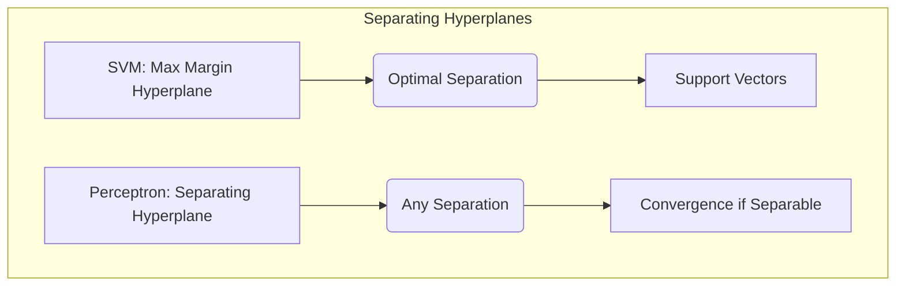

**Teorema 1:** *Se um conjunto de dados é linearmente separável, o algoritmo do Perceptron irá convergir para um hiperplano separador em um número finito de iterações*. Este teorema garante a convergência do Perceptron sob certas condições, demonstrando que o algoritmo é capaz de encontrar uma solução, mas sem garantia de que seja a ótima [^4.5.1].
> 💡 **Exemplo Numérico:** Se temos um conjunto de dados linearmente separável em duas classes, o Perceptron irá iterativamente ajustar um hiperplano até que todos os pontos de cada classe estejam corretamente classificados.

**Lemma 4:** *O problema de maximizar a margem em um SVM pode ser formulado como um problema de otimização convexa com restrições, que pode ser resolvido usando a dualidade de Wolfe*. Essa dualidade permite uma interpretação geométrica da solução, mostrando que o hiperplano ótimo é definido pelos pontos de suporte [^4.5.2].
> 💡 **Exemplo Numérico:** No contexto do SVM, a dualidade de Wolfe transforma um problema de otimização com restrições de desigualdade (primal) em um problema com restrições de igualdade (dual). As variáveis duais nesse caso representam os pesos dos pontos de suporte.
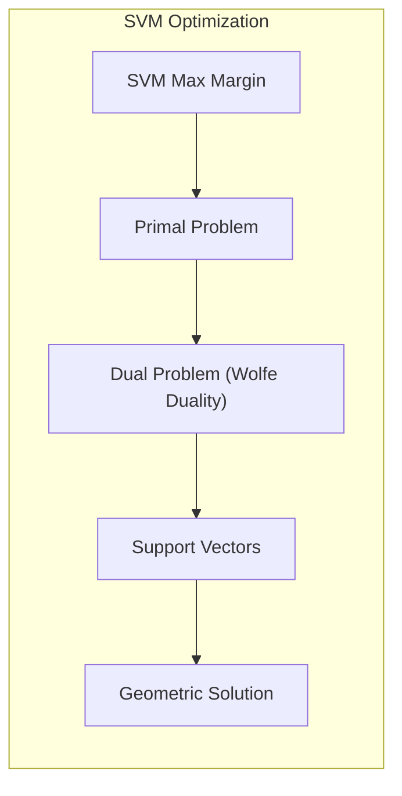

**Corolário 4:** *Os pontos de suporte, que definem a margem, são os pontos mais próximos do hiperplano separador. Eles são essenciais para a construção da solução e podem ser usados para determinar a influência de cada observação no modelo*. [^4.5.2]
> 💡 **Exemplo Numérico:** Após treinar um SVM, os pontos de suporte são aqueles que estão no limite da margem. Esses pontos são os mais influentes na definição do hiperplano, e mudanças nesses pontos teriam um grande impacto na posição do hiperplano.

### Pergunta Teórica Avançada: Qual é a relação entre as condições de Karush-Kuhn-Tucker (KKT) e a solução linear por partes nos algoritmos de caminho para problemas regularizados?
**Resposta:** As condições de KKT são fundamentais para analisar a natureza linear por partes das soluções em algoritmos de caminho. Ao examinar o problema de otimização regularizado, a formulação das condições de KKT revela a estrutura das mudanças que ocorrem na solução quando o parâmetro de regularização é variado. As condições de KKT estabelecem relações entre as variáveis primais (coeficientes do modelo) e as variáveis duais (multiplicadores de Lagrange). Essas relações determinam como as soluções se movem ao longo do caminho da solução. Particularmente, a forma linear por partes das soluções em problemas com penalidades L1, como o Lasso, surge diretamente dessas condições.
A análise detalhada das condições de KKT permite identificar:
1. **Pontos de mudança:** os valores do parâmetro de regularização nos quais a estrutura da solução muda (i.e., coeficientes entram ou saem da solução).
2. **Segmentos lineares:** os intervalos entre os pontos de mudança, nos quais a solução evolui de maneira linear.
> 💡 **Exemplo Numérico:** No Lasso, as condições de KKT indicam que, para cada coeficiente $\beta_j$, existe um multiplicador de Lagrange $\mu_j$. Quando $\beta_j \ne 0$, a condição KKT se torna $\frac{1}{n} \sum_{i=1}^n x_{ij}(y_i - \hat{y_i}) = \lambda sign(\beta_j)$. A análise da variação desse multiplicador com $\lambda$ revela o caminho linear por partes da solução. Quando $\beta_j = 0$, o valor de $\lambda$ nesse ponto, conhecido como "break point", é o valor a partir do qual a solução muda de uma forma linear por partes para outra.
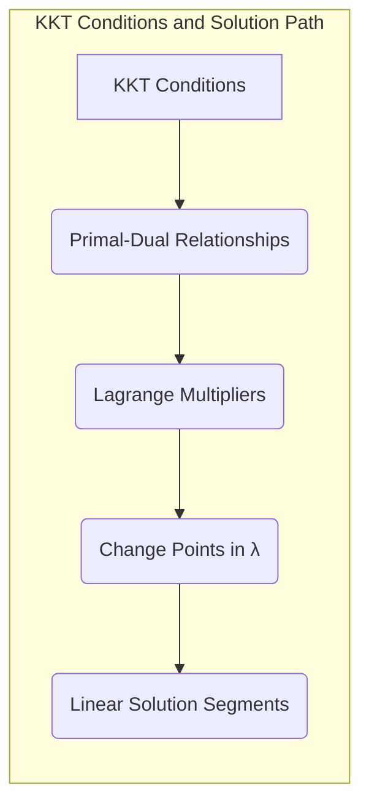

**Lemma 5:** *As condições de KKT para um problema de otimização regularizado estabelecem que, para uma dada solução, os multiplicadores de Lagrange correspondentes a restrições ativas devem ser não nulos*. Essa propriedade é crucial para entender como a solução se move ao longo do caminho, pois os multiplicadores de Lagrange informam sobre a influência das restrições ativas.
> 💡 **Exemplo Numérico:** No Lasso, a restrição é $|\beta_j| \leq t$, onde t está relacionado a $\lambda$. Quando $\beta_j$ é não nulo, a restrição está ativa (i.e. $|\beta_j|=t$) e o multiplicador de Lagrange correspondente a essa restrição é não nulo.

**Corolário 5:** *Nos algoritmos de caminho, a linearidade por partes da solução surge porque as condições de KKT levam a segmentos lineares onde o conjunto de restrições ativas permanece constante, e os pontos de mudança correspondem a alterações nesse conjunto*.
> 💡 **Exemplo Numérico:** Nos algoritmos de caminho do Lasso, os segmentos lineares ocorrem quando os coeficientes não nulos variam linearmente com o parâmetro $\lambda$. Os pontos de mudança são os valores de $\lambda$ em que novos coeficientes entram na solução (tornam-se não nulos) ou coeficientes existentes saem da solução (tornam-se nulos).
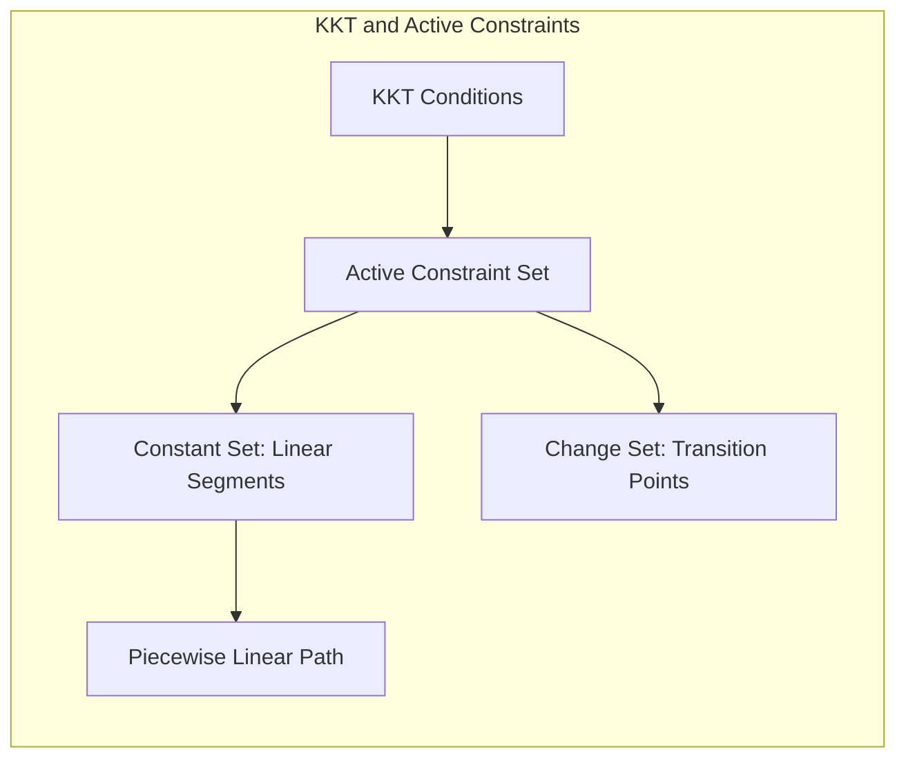

As perguntas devem ser altamente relevantes, **avaliar a compreensão profunda de conceitos teóricos-chave**, podem envolver derivações matemáticas e provas, e focar em análises teóricas.

### Conclusão
Este capítulo explorou a importância das abordagens lineares em classificação e análise discriminante, demonstrando que elas podem ser aprimoradas por meio de algoritmos de caminho que exploram a natureza linear por partes das soluções em problemas regularizados. Desde a regularização L1 no Lasso até o conceito de hiperplanos ótimos em SVMs, esses métodos desempenham um papel crucial na construção de modelos eficazes e generalizáveis. Ao compreender a otimização convexa, as condições de KKT e a dualidade, podemos criar algoritmos de caminho mais eficientes, que são fundamentais em aplicações práticas e teóricas. A exploração da esparsidade e da estabilidade de modelos regularizados é um campo de pesquisa ativo, onde o entendimento profundo de algoritmos de caminho é essencial.
<!-- END DOCUMENT -->

### Footnotes
[^4.1]: "A linear regression model assumes that the regression function E(Y|X) is linear in the inputs X1,..., Xp. Linear models were largely developed in the precomputer age of statistics, but even in today's computer era there are still good reasons to study and use them." *(Trecho de Linear Methods for Regression)*
[^4.2]: "In this chapter we describe linear methods for regression, while in the next chapter we discuss linear methods for classification. On some topics we go into considerable detail, as it is our firm belief that an understanding of linear methods is essential for understanding nonlinear ones. In fact, many nonlinear techniques are direct generalizations of the linear methods discussed here." *(Trecho de Linear Methods for Regression)*
[^4.3]: "The linear model either assumes that the regression function E(Y|X) is linear, or that the linear model is a reasonable approximation. Here the Bj's are unknown parameters or coefficients, and the variables X; can come from different sources:" *(Trecho de Linear Methods for Regression)*
[^4.4]: "The most popular estimation method is least squares, in which we pick the coefficients β = (β0, β1, ..., βp)T to minimize the residual sum of squares" *(Trecho de Linear Methods for Regression)*
[^4.4.1]: "This is a quadratic function in the p + 1 parameters." *(Trecho de Linear Methods for Regression)*
[^4.4.2]: "Assuming (for the moment) that X has full column rank, and hence XTX is positive definite, we set the first derivative to zero" *(Trecho de Linear Methods for Regression)*
[^4.4.3]: "In order to pin down the sampling properties of ß, we now assume that the observations yi are uncorrelated and have constant variance σ², and that the xi are fixed (non random)." *(Trecho de Linear Methods for Regression)*
[^4.4.4]: "Ridge regression shrinks the regression coefficients by imposing a penalty on their size." *(Trecho de Linear Methods for Regression)*
[^4.4.5]: "The lasso is a shrinkage method like ridge, with subtle but important differences." *(Trecho de Linear Methods for Regression)*
[^4.5]: "In this section we describe a number of approaches to variable subset selection with linear regression. In later sections we discuss shrinkage and hybrid approaches for controlling variance, as well as other dimension-reduction strategies. These all fall under the general heading model selection." *(Trecho de Linear Methods for Regression)*
[^4.5.1]: "The algorithm identifies the variable most correlated with the current residual. It then computes the simple linear regression coefficient of the residual on this chosen variable, and then adds it to the current coefficient for that variable." *(Trecho de Linear Methods for Regression)*
[^4.5.2]: "The predicted values at an input vector xo are given by f(xo) = (1 : xo)Tẞ; the fitted values at the training inputs are" *(Trecho de Linear Methods for Regression)*
