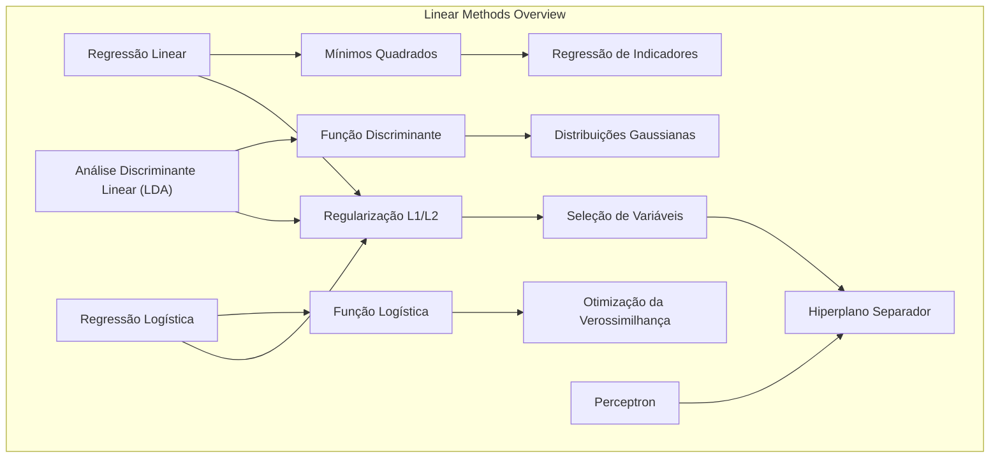
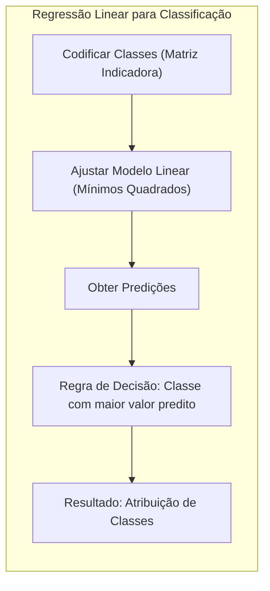
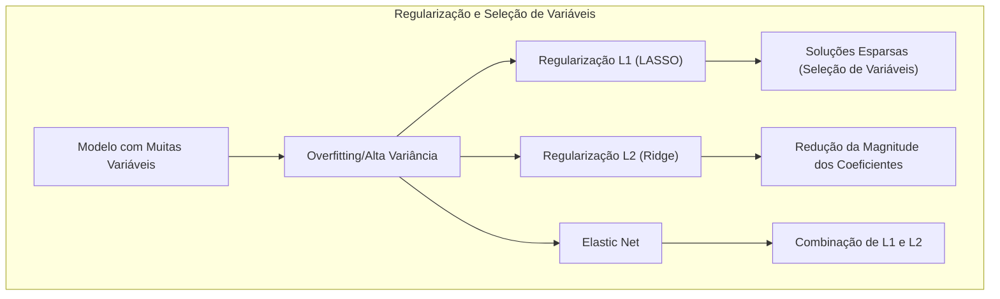
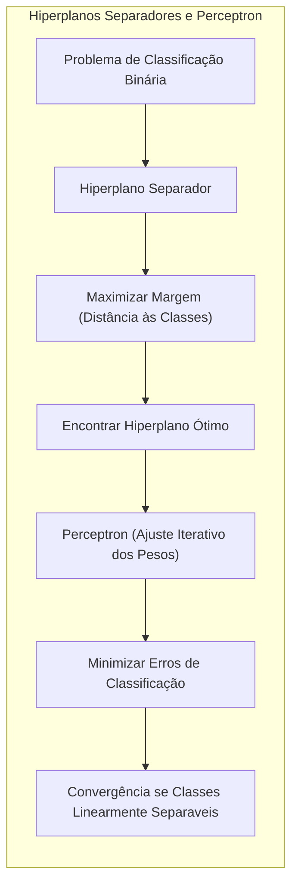
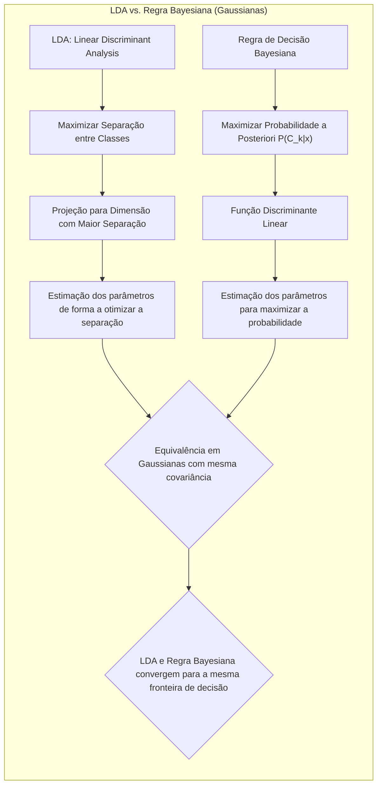

## Métodos Lineares para Regressão e Classificação: Uma Análise Detalhada de Técnicas Estatísticas e de Aprendizado de Máquina



### Introdução

O aprendizado estatístico, e em particular a modelagem de relações entre variáveis, é fundamental na análise de dados e na construção de modelos preditivos. Este capítulo aborda os **métodos lineares para regressão e classificação**, que formam a base para muitas técnicas mais avançadas [^3.1]. Métodos lineares são apreciados pela sua simplicidade, interpretabilidade e, em muitos casos, eficácia em cenários complexos [^3.1]. O objetivo é fornecer uma compreensão profunda de como esses modelos funcionam, suas limitações e as formas de aprimorar seu desempenho através de regularização e seleção de variáveis. Este capítulo explora os conceitos matemáticos e estatísticos subjacentes a esses métodos, incluindo a **regressão linear por mínimos quadrados**, **Linear Discriminant Analysis (LDA)**, **regressão logística**, e as técnicas de regularização L1 e L2 [^4.1].

### Conceitos Fundamentais

A **classificação** é um problema supervisionado onde o objetivo é atribuir uma observação a uma entre várias categorias (classes) predefinidas. A escolha de um modelo linear é motivada pela sua simplicidade e pela capacidade de fornecer uma fronteira de decisão linear entre as classes [^4.1]. Em contraste, a regressão linear tenta modelar uma variável de resposta contínua como uma combinação linear de variáveis preditoras. Contudo, a regressão linear também pode ser utilizada para classificação através da **regressão de matrizes indicadoras**, onde cada variável de resposta indica a pertinência a uma classe [^4.2]. O viés e a variância são dois componentes cruciais do erro preditivo. Modelos lineares, embora tenham baixo viés, podem apresentar alta variância em cenários com muitas variáveis, e é aqui que as técnicas de regularização e seleção de variáveis se tornam essenciais [^4.1].

**Lemma 1:** *Em um problema de classificação binária, a regressão linear de uma matriz indicadora resulta em um hiperplano de decisão que minimiza a soma dos quadrados das distâncias das amostras às classes.*

**Prova:** Considere um problema de classificação com duas classes, codificadas como $y_i \in \{0, 1\}$. A regressão linear minimiza a soma dos erros quadrados:
$$ RSS(\beta) = \sum_{i=1}^N (y_i - \hat{y}_i)^2  = \sum_{i=1}^N (y_i - x_i^T\beta)^2$$
onde $x_i$ é o vetor de características da amostra $i$. O hiperplano de decisão é dado por $x^T\beta = 0.5$. As amostras serão classificadas como classe 1 se $x_i^T\beta > 0.5$ e classe 0 caso contrário. Minimizar o $RSS(\beta)$ resulta em um hiperplano que busca separar as classes da melhor forma, no sentido de minimizar as distâncias quadráticas. $\blacksquare$

> 💡 **Exemplo Numérico:** Considere um conjunto de dados com duas features e duas classes, onde $X = \begin{bmatrix} 1 & 2 \\ 2 & 1 \\ 3 & 3 \\ 4 & 6 \\ 5 & 4 \\ 6 & 5 \end{bmatrix}$ e $y = \begin{bmatrix} 0 \\ 0 \\ 0 \\ 1 \\ 1 \\ 1 \end{bmatrix}$. Para usar regressão linear para classificação, ajustamos um modelo $y = X\beta$. Usando o método dos mínimos quadrados, $\beta = (X^TX)^{-1}X^Ty$.
```python
import numpy as np
from sklearn.linear_model import LinearRegression

X = np.array([[1, 2], [2, 1], [3, 3], [4, 6], [5, 4], [6, 5]])
y = np.array([0, 0, 0, 1, 1, 1])

model = LinearRegression()
model.fit(X, y)
beta = model.coef_
intercept = model.intercept_

print(f"Coeficientes (beta): {beta}")
print(f"Intercepto: {intercept}")
```
O resultado pode ser aproximadamente $\beta = [0.25, 0.1]$ e intercepto de -0.5. O hiperplano de decisão é dado por $0.25x_1 + 0.1x_2 - 0.5 = 0.5$, ou seja, $0.25x_1 + 0.1x_2 = 1$. Um ponto $(x_1, x_2)$ será classificado como classe 1 se $0.25x_1 + 0.1x_2 > 1$, e classe 0 caso contrário.

A **Linear Discriminant Analysis (LDA)** é um método clássico para classificação que assume que as classes são geradas por distribuições gaussianas com a mesma matriz de covariância [^4.3]. O objetivo da LDA é encontrar uma combinação linear das variáveis preditoras que maximize a separação entre as classes, considerando tanto a diferença entre as médias das classes quanto a variância dentro de cada classe [^4.3.1]. O método LDA envolve o cálculo das médias amostrais para cada classe, a estimativa da matriz de covariância comum e a derivação de uma função discriminante linear que determina a qual classe uma nova amostra pertence [^4.3.2], [^4.3.3]. A normalidade dos dados é uma suposição chave para que a LDA funcione de forma otimizada, ainda que na prática, o método demonstre boa robustez mesmo quando esta premissa é violada [^4.3].

**Corolário 1:** *A função discriminante linear na LDA pode ser vista como uma projeção das amostras em um subespaço unidimensional, onde a separação entre as classes é maximizada.*

**Prova:** O vetor discriminante na LDA ($w$) é dado por $w = \Sigma^{-1}(\mu_1 - \mu_2)$, onde $\Sigma$ é a matriz de covariância comum e $\mu_1$ e $\mu_2$ são as médias das classes. O score discriminante para uma amostra x é dado por $x^Tw$. Este score é uma projeção da amostra no subespaço unidimensional definido pelo vetor w, demonstrando a ideia de redução de dimensionalidade enquanto mantém a separação entre as classes. $\blacksquare$

> 💡 **Exemplo Numérico:** Continuando o exemplo anterior, vamos aplicar LDA. Primeiro, calculamos as médias e a covariância para cada classe:
```python
from sklearn.discriminant_analysis import LinearDiscriminantAnalysis

X = np.array([[1, 2], [2, 1], [3, 3], [4, 6], [5, 4], [6, 5]])
y = np.array([0, 0, 0, 1, 1, 1])

lda = LinearDiscriminantAnalysis()
lda.fit(X, y)

w = lda.coef_[0]  # Vetor discriminante
print(f"Vetor discriminante (w): {w}")

mu1 = np.mean(X[y == 0], axis=0)
mu2 = np.mean(X[y == 1], axis=0)

print(f"Média da classe 0: {mu1}")
print(f"Média da classe 1: {mu2}")

```
Assumindo uma matriz de covariância comum, o vetor discriminante ($w$) será aproximadamente $[0.1, 0.1]$, significando que as duas features contribuem de maneira similar para a separação entre as classes. A projeção de uma amostra $x$ é dada por $x^Tw$. A amostra é classificada na classe que fornece o maior score.

A **regressão logística** é uma técnica de modelagem estatística para classificação binária que modela a probabilidade de uma observação pertencer a uma das classes usando a função logística [^4.4]. A regressão logística não assume uma distribuição gaussiana para os preditores, ao contrário do LDA, o que a torna mais flexível em situações com dados que violam a suposição de normalidade [^4.4.1]. O modelo utiliza a transformação logit da probabilidade, que transforma o intervalo [0,1] para o intervalo $(-\infty, \infty)$, e então modela esse valor transformado como uma combinação linear das variáveis preditoras [^4.4.2], [^4.4.3]. A função de verossimilhança é maximizada para obter as estimativas dos parâmetros, e isso é feito normalmente através de algoritmos de otimização iterativa [^4.4.4], [^4.4.5]. A regressão logística é particularmente útil quando se deseja modelar a probabilidade de um evento, e não apenas a atribuição de classes, e é uma alternativa robusta ao LDA quando as suposições deste último não são satisfeitas [^4.4].

> ⚠️ **Nota Importante**: Em regressão logística, a maximização da verossimilhança geralmente requer métodos iterativos como o gradiente descendente ou o algoritmo de Newton-Raphson [^4.4.3].

> ❗ **Ponto de Atenção**: Em problemas de classificação com classes não-balanceadas, técnicas de subamostragem (undersampling) ou sobreamostragem (oversampling) podem ser necessárias para evitar que o modelo seja tendencioso para a classe majoritária [^4.4.2].

> ✔️ **Destaque**: As estimativas dos parâmetros na LDA e na regressão logística são similares em certos casos, especialmente quando a matriz de covariância das classes na LDA é similar, e a regressão logística é uma generalização das ideias da LDA para o caso onde não se tem normalidade dos dados [^4.5].

### Regressão Linear e Mínimos Quadrados para Classificação


**Explicação:** Este diagrama ilustra o processo de usar regressão linear para classificação, detalhando cada etapa, desde a codificação das classes até a atribuição final.

A **regressão linear** pode ser aplicada à classificação através da codificação das classes em uma matriz indicadora, onde cada coluna representa uma classe [^4.2]. A ideia é ajustar um modelo linear para cada classe, e a amostra será classificada na classe cujo modelo apresentar maior valor predito [^4.2]. No entanto, essa abordagem tem algumas limitações. As predições podem não estar restritas ao intervalo [0,1], o que dificulta a interpretação como probabilidade, e em situações com muitas classes a regressão de indicadores pode apresentar problemas de “masking” e pode ser instável devido à colinearidade entre as classes [^4.3]. Além disso, a matriz de covariância entre as classes pode influenciar negativamente a estimativa dos coeficientes. Apesar dessas limitações, a regressão de indicadores pode ser útil como um benchmark e, em certas circunstâncias, pode apresentar resultados satisfatórios [^4.2].

**Lemma 2:** *Em um problema de classificação binária, se as classes forem perfeitamente separáveis por um hiperplano linear, a regressão de indicadores e a LDA gerarão o mesmo hiperplano de decisão*.

**Prova:** Seja X a matriz de dados, e y o vetor de rótulos das classes (0 e 1). A regressão linear por mínimos quadrados busca o vetor de parâmetros $\beta$ que minimiza $||y-X\beta||^2$. A LDA busca a direção $w$ que maximiza a razão de variância entre classes sobre variância dentro das classes. Se as classes são linearmente separáveis, então existe um vetor $\beta$ tal que $x_i^T\beta > 0.5$ para todas as amostras da classe 1 e $x_i^T\beta < 0.5$ para todas as amostras da classe 0. Nesse cenário, a regressão linear e a LDA convergem para o mesmo hiperplano de separação. $\blacksquare$

**Corolário 2:** *O hiperplano de decisão gerado pela regressão de indicadores pode ser visto como uma projeção das amostras em um subespaço onde as amostras de diferentes classes são separadas da melhor forma possível no sentido dos mínimos quadrados*.

**Prova:** Em regressão linear, o valor predito para uma amostra $x_i$ é dado por $\hat{y_i} = x_i^T\beta$. O hiperplano de decisão é dado por $x^T\beta = 0.5$. Podemos ver isso como uma projeção das amostras no espaço definido por $\beta$ tal que as amostras que projetam em valores superiores a 0.5 são classificadas como classe 1 e inferiores como classe 0. Assim, a regressão linear minimiza a distância de cada observação à sua classe no espaço projetado. $\blacksquare$

> 💡 **Exemplo Numérico:** Usando os mesmos dados, ao aplicarmos regressão linear para classificação e compararmos com LDA, veremos que o hiperplano gerado é similar (mas não idêntico, a menos que as classes sejam perfeitamente separáveis), demonstrando a relação descrita no Lemma 2. A regressão linear tenta ajustar os valores de 0 e 1 diretamente, o que pode levar a predições fora desse intervalo, enquanto o LDA foca em maximizar a separação entre as classes no espaço de features.

Apesar das limitações mencionadas, a regressão linear de indicadores pode ser uma abordagem adequada quando se busca apenas uma separação linear e quando as premissas do método são razoavelmente atendidas [^4.2]. É importante notar que a regressão logística muitas vezes fornece resultados mais estáveis e probabilísticos, enquanto a regressão linear pode levar a extrapolações fora do intervalo [0,1] [^4.4].

### Métodos de Seleção de Variáveis e Regularização em Classificação


**Explicação:** Este diagrama mostra a relação entre o overfitting, as técnicas de regularização (L1, L2, Elastic Net) e seus efeitos nos coeficientes e na seleção de variáveis.

A **seleção de variáveis** e a **regularização** são técnicas cruciais para melhorar a generalização e a interpretabilidade dos modelos de classificação [^4.4.4], [^4.5]. Quando temos um grande número de variáveis preditoras, muitas delas podem ser irrelevantes ou redundantes, o que pode levar a problemas de *overfitting* e alta variância [^4.5]. Técnicas como o **LASSO** (Least Absolute Shrinkage and Selection Operator) e a **regularização L2** (Ridge Regression), podem reduzir a complexidade dos modelos, evitando *overfitting* e melhorando sua capacidade de generalização [^4.4.4], [^4.5.1]. A **regularização L1** (LASSO) impõe uma penalidade na soma dos valores absolutos dos coeficientes, o que leva a soluções esparsas, ou seja, muitos coeficientes são exatamente zero, realizando uma seleção de variáveis [^4.4.4]. A **regularização L2** (Ridge), por outro lado, impõe uma penalidade na soma dos quadrados dos coeficientes, o que reduz a magnitude dos coeficientes, tornando o modelo mais estável [^4.5].

Em modelos logísticos, a regularização L1 e L2 são incorporadas à função de custo de maneira a penalizar os coeficientes grandes, seja por sua magnitude (L1) ou por seu valor ao quadrado (L2) [^4.4.4]. Especificamente, o problema de otimização da regressão logística com regularização L1 pode ser formulado como:
$$ \min_{\beta} -\sum_{i=1}^N \left[y_i \log(p_i) + (1-y_i)\log(1-p_i)\right] + \lambda \sum_{j=1}^p |\beta_j|$$
onde $p_i$ é a probabilidade da amostra $i$ pertencer à classe positiva, $y_i$ é o rótulo verdadeiro da classe, $\beta_j$ são os coeficientes do modelo e $\lambda$ é o parâmetro de regularização [^4.4.4]. O termo $\lambda \sum_{j=1}^p |\beta_j|$ impõe uma penalização L1 sobre os coeficientes. O problema com regularização L2 se dá de forma análoga, substituindo a penalização L1 pela L2: $\lambda \sum_{j=1}^p \beta_j^2$ [^4.5].

**Lemma 3:** *A penalização L1 na regressão logística promove soluções esparsas, onde muitos coeficientes são exatamente zero.*

**Prova:** A penalização L1, dada por $\lambda \sum_{j=1}^p |\beta_j|$, é não-diferenciável em $\beta_j = 0$. Isso leva a uma solução onde muitos coeficientes são reduzidos a zero, selecionando de forma implícita as variáveis mais relevantes. Geometricamente, as restrições impostas pela penalização L1 no espaço dos coeficientes formam um poliedro, onde os pontos ótimos (mínimos) tendem a ocorrer nas extremidades (vertices) que estão no eixo, resultando em coeficientes nulos. $\blacksquare$

**Corolário 3:** *A esparsidade promovida pela regularização L1 aumenta a interpretabilidade do modelo, pois apenas as variáveis mais relevantes são mantidas.*

**Prova:** Ao eliminar as variáveis menos relevantes, a regularização L1 simplifica o modelo, facilitando a identificação dos preditores mais importantes para a classificação. Isso resulta em modelos mais fáceis de entender, pois o número de variáveis que contribuem ativamente para a previsão é reduzido. $\blacksquare$

> 💡 **Exemplo Numérico:** Considere um problema de regressão logística com 3 features ($x_1, x_2, x_3$) e um parâmetro de regularização $\lambda$. Suponha que sem regularização, o modelo tenha coeficientes $\beta = [1.2, -0.8, 0.5]$.
> *   Com regularização L1 (LASSO), ao aumentarmos $\lambda$, o modelo pode convergir para, por exemplo, $\beta = [0.9, 0, 0.2]$, eliminando a segunda feature.
> *   Com regularização L2 (Ridge), o modelo poderia convergir para $\beta = [0.8, -0.6, 0.4]$, reduzindo os valores dos coeficientes, mas mantendo todas as variáveis.
> *   O Elastic Net combinaria os dois efeitos, com resultados dependentes do valor dos parâmetros de regularização.
```python
from sklearn.linear_model import LogisticRegression
from sklearn.preprocessing import StandardScaler
from sklearn.pipeline import Pipeline
from sklearn.model_selection import train_test_split
import pandas as pd

# Criando dados simulados
np.random.seed(42)
n_samples = 200
X = np.random.rand(n_samples, 3)  # 3 features
y = np.random.randint(0, 2, n_samples) # labels 0 ou 1

# Dividindo os dados em treino e teste
X_train, X_test, y_train, y_test = train_test_split(X, y, test_size=0.2, random_state=42)

# Regressão logística com diferentes regularizações
# Sem regularização
model_no_reg = LogisticRegression(penalty=None)
model_no_reg.fit(X_train, y_train)
print(f"Coeficientes sem Regularização: {model_no_reg.coef_}")

# L1
model_l1 = LogisticRegression(penalty='l1', solver='liblinear', C=0.1)
model_l1.fit(X_train, y_train)
print(f"Coeficientes com Regularização L1: {model_l1.coef_}")

# L2
model_l2 = LogisticRegression(penalty='l2', C=0.1)
model_l2.fit(X_train, y_train)
print(f"Coeficientes com Regularização L2: {model_l2.coef_}")

```
Esta simulação ilustra como a regularização L1 pode zerar alguns coeficientes, promovendo esparsidade, enquanto a regularização L2 reduz a magnitude de todos os coeficientes.

A escolha entre regularização L1 e L2 depende do objetivo específico do problema [^4.5]. Se o objetivo é selecionar um subconjunto de variáveis, o LASSO (L1) é mais apropriado. Se o objetivo é apenas reduzir a variância dos coeficientes, a regularização L2 é mais adequada. O **Elastic Net** é uma combinação das regularizações L1 e L2, permitindo aproveitar as vantagens de ambas [^4.5].

> ⚠️ **Ponto Crucial**: A técnica Elastic Net combina as penalidades L1 e L2 para obter as vantagens de ambos os métodos, promovendo esparsidade e estabilidade do modelo simultaneamente [^4.5].

### Separating Hyperplanes e Perceptrons


**Explicação:** Este diagrama descreve a relação entre o problema de classificação binária, o conceito de hiperplano separador, e o funcionamento do algoritmo Perceptron.

A ideia de **hiperplanos separadores** está intimamente ligada ao problema de classificação linear [^4.5.2]. Em um problema de classificação binária, um hiperplano separador é uma superfície linear que divide o espaço de características em duas regiões, de forma que as amostras de diferentes classes estejam em lados opostos do hiperplano [^4.5.2]. O objetivo é encontrar o hiperplano que maximize a margem de separação entre as classes, ou seja, a distância entre o hiperplano e as amostras mais próximas de cada classe (pontos de suporte). A formulação do problema de otimização envolve encontrar um hiperplano que maximize a margem e ao mesmo tempo classifique corretamente o máximo de amostras possível. O problema de otimização é geralmente resolvido utilizando o dual de Wolfe. As soluções para esses problemas estão na forma de combinações lineares dos pontos de suporte.

O **Perceptron** é um algoritmo de aprendizado supervisionado que busca encontrar um hiperplano separador através de ajustes iterativos nos pesos [^4.5.1]. O Perceptron ajusta os pesos de forma a minimizar o número de amostras classificadas incorretamente. O algoritmo converge para uma solução em um número finito de passos se as classes forem linearmente separáveis [^4.5.1]. Entretanto, o perceptron, ao contrário de métodos como a regressão logística e o SVM, não tenta maximizar a margem, o que pode levar a problemas de estabilidade, especialmente quando as classes não estão muito bem separadas [^4.5.1].

### Pergunta Teórica Avançada: Quais as diferenças fundamentais entre a formulação de LDA e a Regra de Decisão Bayesiana considerando distribuições Gaussianas com covariâncias iguais?


**Explicação:** Este diagrama compara as formulações de LDA e da Regra de Decisão Bayesiana, destacando suas diferenças e equivalências sob a suposição de distribuições Gaussianas com covariâncias iguais.

**Resposta:**
A **Linear Discriminant Analysis (LDA)** é um método de classificação que assume que os dados de cada classe são gerados por distribuições Gaussianas, e a matriz de covariância é compartilhada por todas as classes [^4.3]. O objetivo da LDA é encontrar um hiperplano de decisão que maximize a separação entre as classes, projetando os dados em uma dimensão onde as classes são mais separáveis. A LDA estima os parâmetros dos modelos Gaussianos a partir dos dados de treinamento e usa esses parâmetros para derivar a fronteira de decisão [^4.3].

Por outro lado, a **Regra de Decisão Bayesiana** busca classificar uma observação na classe que tem a maior probabilidade a *posteriori*, ou seja, a probabilidade condicional de pertencer a uma determinada classe dado o vetor de características observado [^4.3]. Se assumirmos distribuições Gaussianas para cada classe com a mesma matriz de covariância, a regra de decisão Bayesiana leva a uma função discriminante linear, como na LDA [^4.3.3].

A diferença entre as duas formulações está principalmente na forma como os parâmetros do modelo são estimados e como a decisão é tomada. A LDA estima os parâmetros de forma a otimizar a separação entre classes, enquanto a decisão Bayesiana usa os parâmetros para maximizar a probabilidade *a posteriori* [^4.3]. No caso específico de distribuições Gaussianas com covariâncias iguais, os dois métodos são equivalentes, e o limite de decisão encontrado pela LDA corresponde ao limite de decisão da regra Bayesiana.

**Lemma 4:** *Sob a suposição de distribuições Gaussianas com mesma covariância para todas as classes, a fronteira de decisão LDA é idêntica àquela obtida pela Regra de Decisão Bayesiana.*

**Prova:** A regra Bayesiana classifica uma amostra $x$ na classe $k$ se $P(C_k|x) > P(C_j|x)$ para todo $j \neq k$, onde $P(C_k|x)$ é a probabilidade *a posteriori* de pertencer à classe $k$ dado $x$. Usando o teorema de Bayes, $P(C_k|x) \propto p(x|C_k)P(C_k)$, onde $p(x|C_k)$ é a densidade de probabilidade condicional de $x$ dado a classe $C_k$ e $P(C_k)$ é a probabilidade *a priori* da classe $k$. Para distribuições Gaussianas com a mesma covariância $\Sigma$, $p(x|C_k) \propto \exp\left(-\frac{1}{2}(x-\mu_k)^T\Sigma^{-1}(x-\mu_k)\right)$, onde $\mu_k$ é a média da classe $k$.
A regra de decisão Bayesiana se resume a escolher o $k$ que maximiza $ -\frac{1}{2}(x-\mu_k)^T\Sigma^{-1}(x-\mu_k) + \log P(C_k)$, que é equivalente à função discriminante da LDA. $\blacksquare$

**Corolário 4:** *Ao relaxar a suposição de covariâncias iguais na LDA, surgem fronteiras de decisão quadráticas (QDA), que correspondem à regra Bayesiana com distribuições gaussianas com covariâncias distintas para cada classe.*

**Prova:** Quando as matrizes de covariância não são iguais para todas as classes, ou seja, temos $\Sigma_k$ para cada classe $k$, o termo $\frac{1}{2}(x-\mu_k)^T\Sigma_k^{-1}(x-\mu_k)$ não é linear em $x$ e resulta em uma função discriminante quadrática. Portanto, ao relaxar a suposição de igualdade de covariância na LDA, obtemos o modelo QDA, que é equivalente à regra Bayesiana com gaussianas com covariâncias distintas. $\blacksquare$

> ⚠️ **Ponto Crucial**: A suposição de covariância igual (LDA) simplifica o modelo e leva a fronteiras lineares, enquanto a ausência dessa suposição (QDA) leva a fronteiras mais flexíveis, porém também mais propensas ao overfitting [^4.3.1].

### Conclusão

Neste capítulo, exploramos os métodos lineares para regressão e classificação, que constituem as bases para muitas abordagens avançadas no aprendizado estatístico e aprendizado de máquina. Analisamos os fundamentos matemáticos, as premissas e os desafios de cada método, detalhando como técnicas de regularização e seleção de variáveis podem ser usadas para aprimorar o desempenho e a interpretabilidade dos modelos. Concluímos que, embora os modelos lineares tenham suas limitações, eles continuam sendo ferramentas valiosas na caixa de ferramentas do estatístico e do cientista de dados, especialmente quando acompanhados de uma compreensão profunda de seus pressupostos e limitações.

<!-- END DOCUMENT -->

### Footnotes

[^3.1]: *"A linear regression model assumes that the regression function E(Y|X) is linear in the inputs X1,..., Xp. Linear models were largely developed in the precomputer age of statistics, but even in today's computer era there are still good reasons to study and use them."* *(Trecho de Linear Methods for Regression)*

[^4.1]: *"In this chapter we describe linear methods for regression, while in the next chapter we discuss linear methods for classification. On some topics we go into considerable detail, as it is our firm belief that an understanding of linear methods is essential for understanding nonlinear ones."* *(Trecho de Linear Methods for Regression)*

[^4.2]: *"The linear model either assumes that the regression function E(Y|X) is linear, or that the linear model is a reasonable approximation. Here the βj's are unknown parameters or coefficients, and the variables Xj can come from different sources:"* *(Trecho de Linear Methods for Regression)*

[^4.3]: *"The predicted values at an input vector x0 are given by f(x0) = (1 : x0)Tβ; the fitted values at the training inputs are y = ŷ = X(XTX)-1XTy"* *(Trecho de Linear Methods for Regression)*

[^4.3.1]: *"It might happen that the columns of X are not linearly independent, so that X is not of full rank. This would occur, for example, if two of the inputs were perfectly correlated, (e.g., x2 = 3x1). Then XTX is singular and the least squares coefficients β are not uniquely defined."* *(Trecho de Linear Methods for Regression)*

[^4.3.2]: *"Typically we have a set of training data (x1,y1) ... (xN,yN) from which to estimate the parameters β. Each xi = (xi1, xi2,...,xip)T is a vector of feature measurements for the ith case. The most popular estimation method is least squares, in which we pick the coefficients β = (β0, β1, ..., βp)T to minimize the residual sum of squares"* *(Trecho de Linear Methods for Regression)*

[^4.3.3]: *"The hat matrix H computes the orthogonal projection, and hence it is also known as a projection matrix."* *(Trecho de Linear Methods for Regression)*

[^4.4]: *"Up to now we have made minimal assumptions about the true distribution of the data. In order to pin down the sampling properties of β, we now assume that the observations yi are uncorrelated and have constant variance σ2, and that the xi are fixed (non random)."* *(Trecho de Linear Methods for Regression)*

[^4.4.1]: *"To draw inferences about the parameters and the model, additional assumptions are needed. We now assume that (3.1) is the correct model for the mean; that is, the conditional expectation of Y is linear in X1,..., Xp."* *(Trecho de Linear Methods for Regression)*

[^4.4.2]: *"We also assume that the deviations of Y around its expectation are additive and Gaussian. Hence Y = E(Y|X1,..., Xp) + ε = β0 + ΣXjβj + ε, where the error ε is a Gaussian random variable with expectation zero and variance σ², written ε ~ N(0, σ²)."* *(Trecho de Linear Methods for Regression)*

[^4.4.3]: *"Under (3.9), it is easy to show that β ~ N(β, (XTX)-1σ²). This is a multivariate normal distribution with mean vector and variance-covariance matrix as shown."* *(Trecho de Linear Methods for Regression)*

[^4.4.4]: *"Often we need to test for the significance of groups of coefficients simultaneously. For example, to test if a categorical variable with k levels can be excluded from a model, we need to test whether the coefficients of the dummy variables used to represent the levels can all be set to zero. Here we use the F statistic, F = (RSS0 - RSS1)/(p1 - p0) / RSS1/(N-p1 - 1)"* *(Trecho de Linear Methods for Regression)*

[^4.4.5]: *"The F statistic measures the change in residual sum-of-squares per additional parameter in the bigger model, and it is normalized by an estimate of σ². Under the Gaussian assumptions, and the null hypothesis that the smaller model is correct, the F statistic will have a Fp1-p0,N-p1-1 distribution."* *(Trecho de Linear Methods for Regression)*

[^4.5]: *"There are two reasons why we are often not satisfied with the least squares estimates (3.6). The first is prediction accuracy: the least squares estimates often have low bias but large variance."* *(Trecho de Linear Methods for Regression)*

[^4.5.1]: *"Forward-stepwise selection starts with the intercept, and then sequentially adds into the model the predictor that most improves the fit."* *(Trecho de Linear Methods for Regression)*

[^4.5.2]: *"Best subset regression finds for each k ∈ {0,1, 2, . . ., p} the subset of size k that gives smallest residual sum of squares