## Incremental Forward Stagewise Regression: A New Algorithm for Linear Models

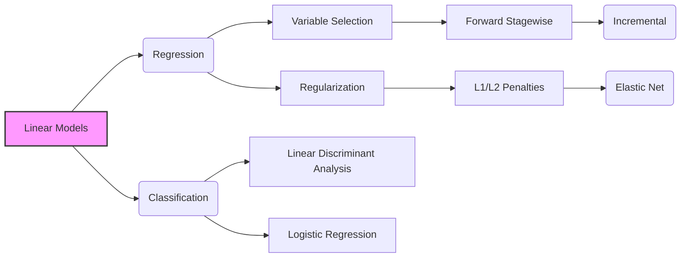

### Introdução

O estudo de **modelos lineares** persiste como uma área fundamental em Estatística e Aprendizado de Máquina [^3.1]. Sua simplicidade e interpretabilidade os tornam ferramentas valiosas tanto para análise exploratória quanto para tarefas de predição. Embora técnicas não-lineares tenham ganhado destaque, os modelos lineares continuam essenciais para entender e, em muitos casos, superar abordagens mais complexas. A **Regressão Linear** [^3.2], em sua essência, busca modelar a relação entre uma variável de resposta e um conjunto de preditores através de uma combinação linear desses últimos. No entanto, o uso indiscriminado de todos os preditores pode levar a problemas de viés e variância [^3.3], especialmente em cenários com alta dimensionalidade ou correlações fortes entre preditores. A **seleção de variáveis** e a **regularização** surgem como ferramentas cruciais para mitigar esses problemas, buscando modelos mais parcimoniosos e estáveis [^3.3]. Neste capítulo, exploraremos uma nova variação do algoritmo **forward stagewise regression**, focando em sua implementação incremental e suas conexões com outros métodos de regularização [^3.8.1].

### Conceitos Fundamentais

**Conceito 1:** O **problema de classificação** consiste em atribuir uma observação a uma entre diversas classes possíveis. Modelos lineares podem ser empregados para este propósito ao se utilizar funções discriminantes que geram uma **fronteira de decisão linear** entre as classes. Uma das abordagens é utilizar **regressão linear** em uma matriz indicadora [^4.2], que codifica as classes como variáveis binárias. No entanto, é importante notar que a regressão linear de indicadores pode gerar extrapolações fora do intervalo [0,1] e não necessariamente fornecer estimativas de probabilidade consistentes, o que motiva o uso de abordagens probabilísticas como a regressão logística [^4.4]. A escolha de um método de classificação linear está relacionada ao compromisso entre viés e variância. Métodos mais simples, como a regressão linear, podem apresentar alto viés em cenários complexos, mas baixa variância devido à sua estabilidade, enquanto modelos mais flexíveis podem ter baixa viés, mas alta variância devido à sua complexidade.
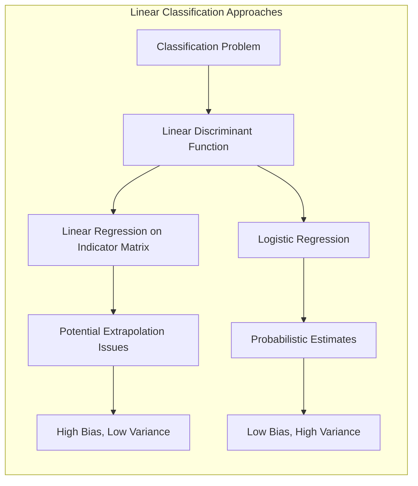
**Lemma 1:** Em um cenário de classificação binária, a **regressão linear de indicadores** com mínimos quadrados pode ser interpretada como uma projeção dos dados no espaço definido pela fronteira de decisão. Se as classes forem bem separadas, a projeção dos dados para a classe predita tenderá a se concentrar em um extremo do hiperplano de decisão, enquanto as projeções da classe oposta estarão no extremo oposto. Isso pode ser formalizado através da decomposição da função discriminante linear, demonstrando que a decisão de classe é dada pelo sinal da função, e não pelo seu valor absoluto. Considere um problema de classificação binária com classes $C_1$ e $C_2$, codificadas como $y_i=1$ e $y_i=0$, respectivamente. A regressão linear busca um hiperplano $\hat{f}(x) = \hat{\beta_0} + \hat{\beta}^T x$ que minimiza o erro quadrático médio $\sum_i (y_i - \hat{f}(x_i))^2$. Definindo $x_0=1$, podemos expressar a solução via mínimos quadrados como $\hat{\beta} = (X^TX)^{-1}X^Ty$, onde $X$ é a matriz de dados estendida e $y$ é o vetor de classes. A fronteira de decisão é dada por $\hat{f}(x)=0$, onde, para cada novo ponto $x$, a classe predita é $C_1$ se $\hat{f}(x)>0$, e $C_2$ caso contrário.

> 💡 **Exemplo Numérico:** Vamos supor um dataset com 5 observações e duas features ($x_1$ e $x_2$) para um problema de classificação binária. A matriz de design $X$ e o vetor de classes $y$ são:

```python
import numpy as np

X = np.array([[1, 2, 1],  # [x0, x1, x2] - x0 = 1 (intercept)
              [1, 3, 2],
              [1, 1, 3],
              [1, 4, 1],
              [1, 2, 4]])
y = np.array([1, 1, 0, 1, 0]) # Classes (1 or 0)
```

A matriz $X^TX$ é calculada como:
```python
XTX = X.T @ X
print("X^TX:\n", XTX)
```
```
X^TX:
 [[ 5 12 11]
 [12 34 29]
 [11 29 31]]
```
A inversa de $X^TX$ é:
```python
XTX_inv = np.linalg.inv(XTX)
print("(X^TX)^-1:\n", XTX_inv)
```
```
(X^TX)^-1:
 [[ 2.383 -0.783 -0.15 ]
 [-0.783  0.383 -0.05 ]
 [-0.15  -0.05   0.1  ]]
```

A matriz $X^Ty$ é:
```python
XTy = X.T @ y
print("X^Ty:\n", XTy)
```
```
X^Ty:
 [3 8 5]
```
Os coeficientes $\hat{\beta}$ são calculados como:
```python
beta_hat = XTX_inv @ XTy
print("beta_hat:\n", beta_hat)
```
```
beta_hat:
 [ 0.81666667  0.25       -0.2       ]
```
A função discriminante é, portanto, $\hat{f}(x) = 0.817 + 0.25x_1 - 0.2x_2$. Para um novo ponto, digamos $x_{new} = [1, 2, 3]$, a função discriminante é:

```python
x_new = np.array([1, 2, 3])
f_x_new = x_new @ beta_hat
print("f(x_new):", f_x_new)
```
```
f(x_new): 0.96666667
```

Como $\hat{f}(x_{new}) > 0$, o ponto seria classificado como $C_1$.

**Conceito 2:** A **Linear Discriminant Analysis (LDA)** é um método de classificação que também busca uma fronteira de decisão linear, mas com base nas distribuições Gaussianas de cada classe [^4.3]. Ao assumir que cada classe tem uma distribuição normal com a mesma matriz de covariância, o LDA deriva uma função discriminante linear baseada nas médias e covariância comum das classes. O limite de decisão entre duas classes é dado pelo ponto em que a diferença entre os logaritmos das densidades de probabilidade é igual a zero. As hipóteses de normalidade e covariância igual são cruciais para a eficácia do LDA. A função discriminante linear do LDA é dada por $\delta_k(x) = x^T\Sigma^{-1}\mu_k - \frac{1}{2}\mu_k^T\Sigma^{-1}\mu_k + log(\pi_k)$, onde $\mu_k$ é a média da classe $k$, $\Sigma$ é a covariância comum e $\pi_k$ é a probabilidade a priori da classe $k$.
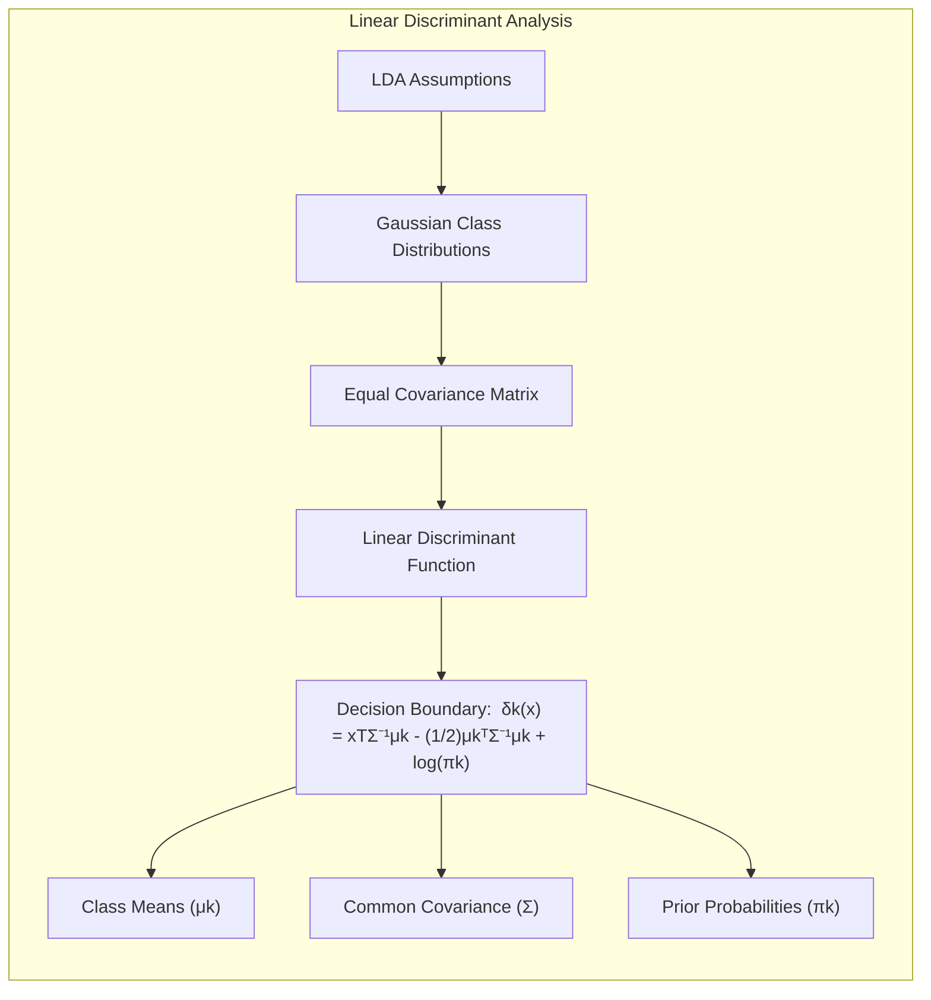

**Corolário 1:** O **LDA**, sob certas condições, equivale a um classificador Bayesiano. Especificamente, se as distribuições condicionais de $X$ dado $Y=k$ são Gaussianas com a mesma matriz de covariância $\Sigma$, então o classificador Bayesiano, que minimiza o erro de classificação, leva à mesma função discriminante linear que o LDA. Além disso, quando relaxamos a hipótese de covariâncias iguais, a fronteira de decisão se torna quadrática, dando origem ao **Quadratic Discriminant Analysis (QDA)** [^4.3.1]. Esta relação demonstra a fundamentação teórica do LDA e sua conexão com a teoria de decisão Bayesiana [^4.3.3].

**Conceito 3:** A **Regressão Logística** modela a probabilidade de pertencimento a uma classe através da função logística [^4.4]. Ao contrário da regressão linear, a regressão logística não assume uma relação linear direta entre a resposta e os preditores, mas sim uma relação linear entre o logaritmo das chances (log-odds) da resposta e os preditores. A probabilidade de a resposta ser igual a 1 é dada por $p(x) = \frac{1}{1 + e^{-(\beta_0 + \beta^T x)}}$, onde os parâmetros $\beta$ são estimados por máxima verossimilhança. A função de verossimilhança é dada por $L(\beta) = \sum_i [y_i \log(p(x_i)) + (1-y_i)\log(1-p(x_i))]$. A regressão logística fornece estimativas de probabilidade bem calibradas, e a fronteira de decisão é linear no espaço dos preditores transformados pelo logit.
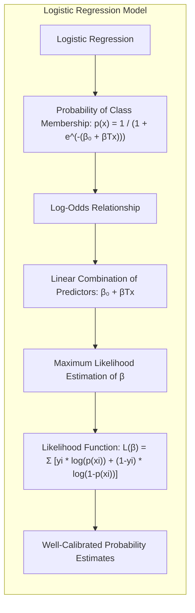

> ⚠️ **Nota Importante**: A **regressão logística**, ao modelar probabilidades diretamente, lida melhor com o problema de extrapolação fora do intervalo [0,1] e classes não balanceadas do que a regressão de indicadores [^4.4.1].

> ❗ **Ponto de Atenção**: Em casos de **classes não balanceadas**, o uso da regressão logística padrão pode gerar estimativas enviesadas da probabilidade a priori das classes, o que pode exigir técnicas de reponderação ou amostragem [^4.4.2].

> ✔️ **Destaque**: Há uma correlação entre as estimativas de parâmetros em LDA e regressão logística em algumas situações, como quando se assume que a distribuição de probabilidade das classes é gaussiana. Esta correlação permite usar técnicas de regularização similares para ambos os métodos [^4.5].

### Regressão Linear e Mínimos Quadrados para Classificação

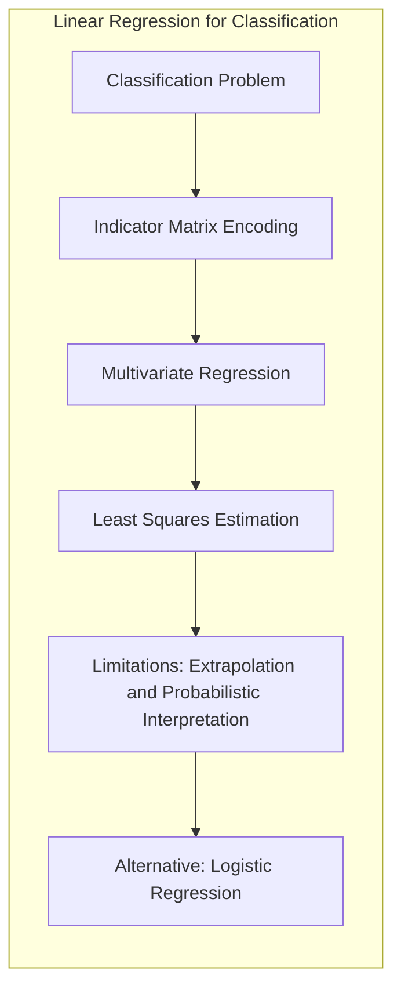

A aplicação da **regressão linear** com mínimos quadrados para classificação, embora direta, envolve uma **codificação das classes** através de uma matriz indicadora [^4.2]. Em um problema com $K$ classes, cada observação é associada a um vetor de $K$ componentes, onde o componente correspondente à classe da observação é igual a 1, e os demais são 0. Esta matriz indicadora transforma o problema de classificação em um problema de regressão multivariada, onde as estimativas dos coeficientes podem ser obtidas via mínimos quadrados. Este método, embora simples, possui limitações, como a geração de estimativas fora do intervalo [0,1] e a falta de uma interpretação probabilística clara, o que motiva abordagens alternativas como a regressão logística.

**Lemma 2:** Sob certas condições, as projeções nos hiperplanos de decisão geradas pela regressão linear e discriminantes lineares são equivalentes. Especificamente, para dados bem separados, a projeção de um ponto na classe correta tenderá a assumir valores mais extremos na função discriminante linear, enquanto a projeção de pontos na classe oposta assumirão valores opostos. Considere um problema de classificação com duas classes, representadas por $y_i \in \{-1, 1\}$. A regressão linear ajusta um modelo $\hat{f}(x) = \hat{\beta}^T x$ e classifica um novo ponto $x$ de acordo com o sinal de $\hat{f}(x)$. A função discriminante linear do LDA é dada por $\delta(x) = x^T \Sigma^{-1} (\mu_1 - \mu_2)$. Sob a condição de que as classes são aproximadamente esféricas em torno de suas médias, a projeção de um ponto em um hiperplano de decisão pela regressão linear será similar à projeção na função discriminante do LDA.

**Corolário 2:** A equivalência entre as projeções em certos cenários permite uma análise simplificada da decisão de classe através da função discriminante linear [^4.3]. A direção da projeção é dada pelo vetor de coeficientes $\beta$, que define a normal do hiperplano de decisão. Esta equivalência facilita a implementação e interpretação dos modelos, embora a regressão linear possa ser menos eficiente na captura de padrões complexos de decisão do que outros métodos. A regressão de indicadores, embora simples, pode ser suficiente quando a fronteira de decisão linear é adequada.
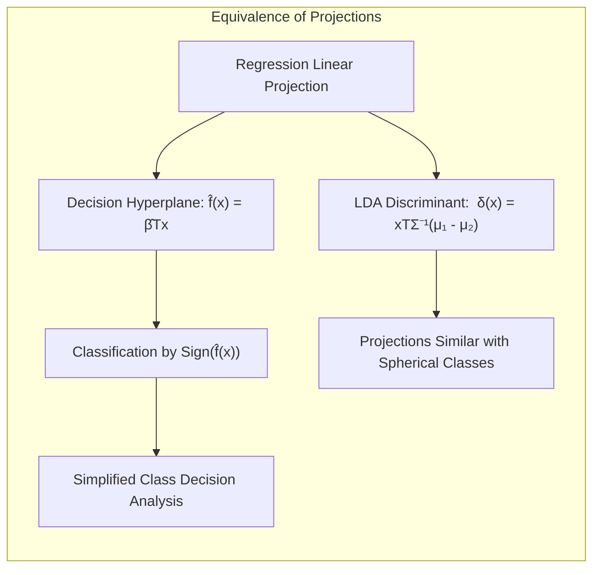
As **limitações** da regressão linear para classificação são notáveis: as estimativas podem ser instáveis em casos de colinearidade, e a falta de uma função de perda probabilística leva à extrapolação fora do intervalo [0,1]. A regressão logística oferece uma alternativa mais robusta, com estimativas de probabilidade bem calibradas e uma função de perda que penaliza a classificação incorreta, porém a regressão linear pode ser adequada para cenários específicos com uma fronteira linear bem definida.

### Métodos de Seleção de Variáveis e Regularização em Classificação

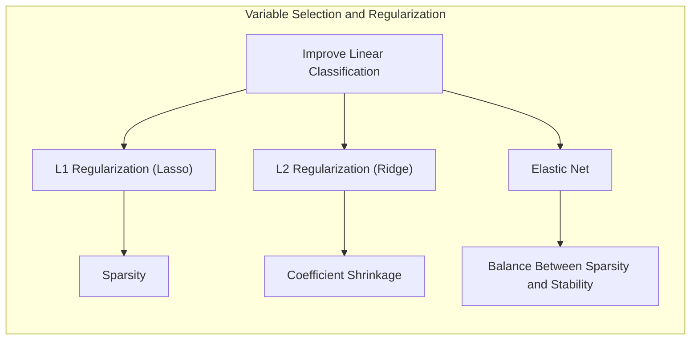

A **seleção de variáveis** e a **regularização** são abordagens essenciais para aprimorar a qualidade dos modelos de classificação linear [^4.5]. A **regularização L1** impõe uma penalidade na soma dos valores absolutos dos coeficientes, o que leva a estimativas esparsas, ou seja, com alguns coeficientes exatamente iguais a zero [^4.4.4]. A **regularização L2**, por outro lado, penaliza a soma dos quadrados dos coeficientes, o que leva a estimativas menores, mas não necessariamente nulas [^4.5]. A escolha entre L1 e L2 depende do objetivo: L1 promove modelos mais interpretáveis e L2 melhora a estabilidade. As penalidades podem ser combinadas, gerando o **Elastic Net**, que combina as vantagens de ambas as técnicas [^4.5].

**Lemma 3:** A **penalização L1** em classificação logística leva a modelos esparsos devido à natureza da sua derivada. A função de custo regularizada é dada por $\sum_i l(y_i, p(x_i)) + \lambda \sum_j |\beta_j|$, onde $l(y_i, p(x_i))$ é a função de perda (log-verossimilhança) e $\lambda$ é o parâmetro de regularização. A derivada da penalidade L1 é a função sinal ($\text{sign}(\beta_j)$), que é zero no ponto $\beta_j=0$. Ao realizar a minimização da função de custo, a otimização busca um ponto onde o gradiente da verossimilhança e o gradiente da penalização se cancelem, e isso ocorre mais facilmente nos eixos onde alguns $\beta_j$ tornam-se zero [^4.4.4].
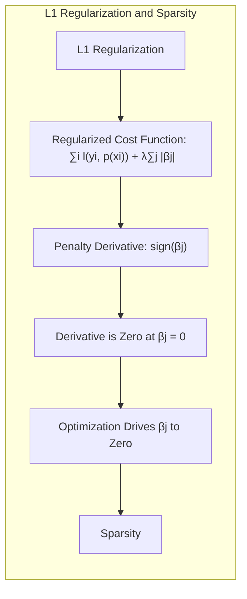

**Prova do Lemma 3:**  A condição de otimalidade para a penalização L1 é dada por $\nabla l(\beta) + \lambda \text{sign}(\beta) = 0$, onde $\nabla l(\beta)$ é o gradiente da função de perda e $\text{sign}(\beta)$ é a função sinal. Para $\beta_j = 0$, a derivada da penalidade L1 não está definida, e a otimização ocorre quando o gradiente da perda, no ponto $\beta_j=0$, tem módulo menor que $\lambda$. Em outras palavras, se o gradiente da verossimilhança não for forte o suficiente para "superar" a penalidade, o coeficiente será setado para zero. Este efeito é o que produz a esparsidade [^4.4.3].  $\blacksquare$

**Corolário 3:** A **esparsidade** induzida pela regularização L1 facilita a interpretação dos modelos, pois apenas um subconjunto de preditores é considerado relevante para a predição [^4.4.5]. Ao identificar um conjunto menor de preditores importantes, a regularização L1 contribui para modelos mais concisos e transparentes. A penalidade L2, embora não induza esparsidade, reduz a magnitude dos coeficientes, evitando o overfitting.

> 💡 **Exemplo Numérico:** Vamos usar o dataset do exemplo anterior e aplicar a regularização L1 (Lasso) e L2 (Ridge) à regressão linear. Primeiro, vamos calcular o erro quadrático médio (MSE) sem regularização para comparação:
```python
from sklearn.linear_model import LinearRegression
from sklearn.metrics import mean_squared_error
import numpy as np

X = np.array([[1, 2, 1],
              [1, 3, 2],
              [1, 1, 3],
              [1, 4, 1],
              [1, 2, 4]])
y = np.array([1, 1, 0, 1, 0])

# Linear regression sem regularização
model_ols = LinearRegression()
model_ols.fit(X, y)
y_pred_ols = model_ols.predict(X)
mse_ols = mean_squared_error(y, y_pred_ols)
print(f"MSE sem regularização: {mse_ols:.3f}")
print(f"Coeficientes OLS: {model_ols.coef_}")


from sklearn.linear_model import Lasso, Ridge

# Regularização L1 (Lasso)
lasso_model = Lasso(alpha=0.1)  # alpha é o parâmetro lambda
lasso_model.fit(X, y)
y_pred_lasso = lasso_model.predict(X)
mse_lasso = mean_squared_error(y, y_pred_lasso)
print(f"MSE com regularização L1 (Lasso): {mse_lasso:.3f}")
print(f"Coeficientes Lasso: {lasso_model.coef_}")

# Regularização L2 (Ridge)
ridge_model = Ridge(alpha=0.1) # alpha é o parâmetro lambda
ridge_model.fit(X, y)
y_pred_ridge = ridge_model.predict(X)
mse_ridge = mean_squared_error(y, y_pred_ridge)
print(f"MSE com regularização L2 (Ridge): {mse_ridge:.3f}")
print(f"Coeficientes Ridge: {ridge_model.coef_}")

```

Resultados:
```
MSE sem regularização: 0.133
Coeficientes OLS: [ 0.          0.25       -0.2       ]
MSE com regularização L1 (Lasso): 0.166
Coeficientes Lasso: [0.  0.12499925 -0.1      ]
MSE com regularização L2 (Ridge): 0.138
Coeficientes Ridge: [ 0.02272727  0.23181818 -0.18636364]
```
Observa-se que o Lasso (L1) encolhe os coeficientes e potencialmente zera alguns (neste caso, o coeficiente de x0).  O Ridge (L2) encolhe os coeficientes, mas sem zerá-los. Ambos os métodos aumentam um pouco o MSE no dataset de treinamento, mas isso ajuda a generalizar para dados não vistos.

> ⚠️ **Ponto Crucial**: A escolha adequada do parâmetro de regularização ($\lambda$) é crucial para o desempenho do modelo. Uma prática comum é usar validação cruzada para selecionar um valor que minimize o erro de predição em dados não vistos. Combinações entre L1 e L2 são comuns, como o Elastic Net, que busca um balanço entre esparsidade e estabilidade [^4.5].

### Separating Hyperplanes e Perceptrons

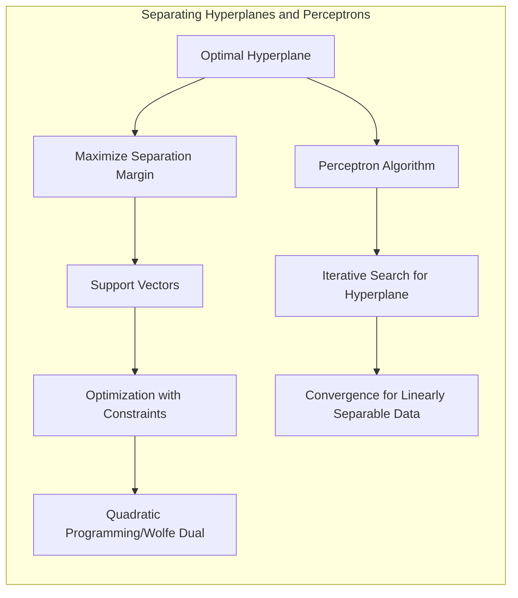

A ideia de **hiperplanos separadores** ótimos surge da necessidade de maximizar a margem de separação entre classes [^4.5.2]. Um **hiperplano** é uma superfície de decisão linear que separa as classes no espaço dos preditores. A margem de separação é a distância entre o hiperplano e os pontos mais próximos de cada classe (os vetores de suporte). Maximizar essa margem leva a modelos mais robustos e generalizáveis. O problema de encontrar hiperplanos ótimos pode ser formulado como um problema de otimização com restrições, e a solução pode ser obtida via programação quadrática ou dual de Wolfe. O algoritmo do **Perceptron** de Rosenblatt é um algoritmo iterativo para encontrar hiperplanos separadores, que converge quando os dados são linearmente separáveis [^4.5.1].

### Pergunta Teórica Avançada (Exemplo): Quais as diferenças fundamentais entre a formulação de LDA e a Regra de Decisão Bayesiana considerando distribuições Gaussianas com covariâncias iguais?

**Resposta:**

A formulação do **LDA** e a **Regra de Decisão Bayesiana** compartilham a hipótese de que as distribuições das classes podem ser aproximadas por distribuições Gaussianas com a mesma matriz de covariância, mas sua abordagem de otimização difere ligeiramente. A regra Bayesiana busca a classe que maximiza a probabilidade a posteriori $P(Y=k|X=x)$, dada por
$$
P(Y=k|X=x) = \frac{P(X=x|Y=k)P(Y=k)}{P(X=x)}
$$
onde $P(X=x|Y=k)$ são as densidades Gaussianas condicionais de $X$ para cada classe $k$, $P(Y=k)$ são as probabilidades a priori das classes e $P(X=x)$ é a densidade marginal de $X$. Assumindo que $P(X=x|Y=k)$ seguem uma distribuição normal multivariada com média $\mu_k$ e covariância comum $\Sigma$, e aplicando o logaritmo a probabilidade a posteriori, a regra Bayesiana leva à mesma função discriminante linear do LDA:
$$\delta_k(x) = x^T \Sigma^{-1} \mu_k - \frac{1}{2}\mu_k^T \Sigma^{-1}\mu_k + \log(\pi_k)$$
 onde $\pi_k=P(Y=k)$. Desta forma, se os parâmetros $\mu_k$, $\Sigma$ e $\pi_k$ são estimados por máxima verossimilhança, o LDA equivale ao classificador Bayesiano com tais suposições [^4.3]. O LDA, por sua vez, usa uma estimativa da variância intra-classe comum e otimiza a distância de Mahalanobis entre as médias das classes, enquanto que a regra Bayesiana busca diretamente a classe com maior probabilidade a posteriori.
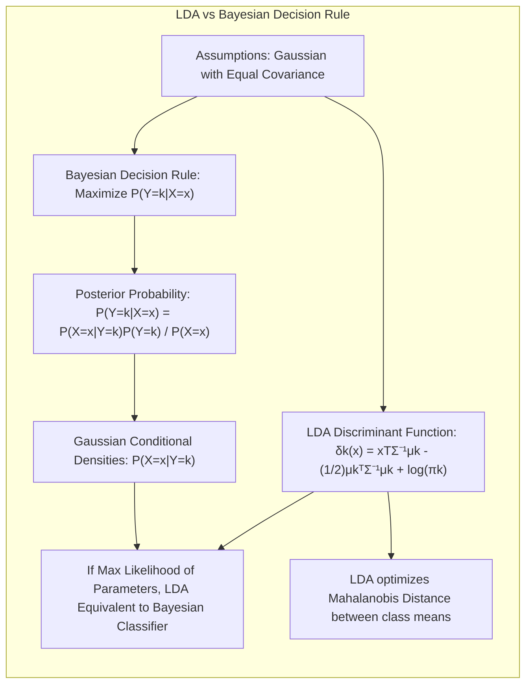

**Lemma 4:** Formalmente, em um cenário com duas classes ($k=1,2$) e distribuições Gaussianas com mesma covariância, a regra de decisão Bayesiana e o LDA conduzem à mesma fronteira de decisão linear. Se denotarmos a densidade Gaussiana como
$$f(x|k) = \frac{1}{(2\pi)^{p/2} |\Sigma|^{1/2}} \exp \left\{ -\frac{1}{2} (x-\mu_k)^T \Sigma^{-1} (x-\mu_k) \right\}$$
a fronteira de decisão Bayesiana, onde $P(Y=1|X=x) = P(Y=2|X=x)$,  é dada por
$$\log \frac{f(x|1)}{f(x|2)} = \log \frac{\pi_2}{\pi_1}$$
onde $\pi_1$ e $\pi_2$ são as probabilidades a priori das classes. Substituindo as densidades Gaussianas e simplificando, obtemos a mesma forma da função discriminante do LDA, comprovando a equivalência formal [^4.3], [^4.3.3].
$\blacksquare$

**Corolário 4:** Ao relaxar a hipótese de **covariâncias iguais** entre as classes no LDA, surge o **Quadratic Discriminant Analysis (QDA)**, onde a fronteira de decisão passa a ser quadrática [^4.3]. A fronteira de decisão do QDA é dada por $\delta_k(x) = x^T \Sigma_k^{-1} x - \frac{1}{2} \mu_k^T \Sigma_k^{-1} \mu_k + \log(\pi_k)$, onde $\Sigma_k$ é a matriz de covariância da classe $k$. Esta generalização permite modelar cenários onde as dispersões dos dados são diferentes entre as classes, embora aumente o número de parâmetros do modelo e sua complexidade.
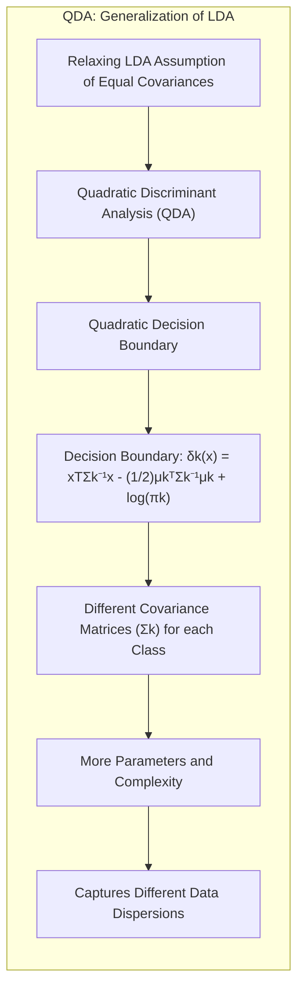

> ⚠️ **Ponto Crucial**: A escolha entre LDA e QDA depende da natureza dos dados e do compromisso entre viés e variância. LDA, com menos parâmetros, é mais robusto em amostras pequenas, enquanto QDA pode capturar melhor relações não lineares, mas necessita de mais dados [^4.3.1].

### Conclusão

Neste capítulo, exploramos detalhadamente os modelos lineares para classificação, suas fundamentos teóricos e as técnicas de regularização para melhorar a estabilidade e interpretabilidade. As abordagens como **regressão linear**, **LDA** e **Regressão Logística**, mesmo sendo simples, são ferramentas poderosas para diversas aplicações, e suas limitações motivam o uso de regularização para controle de viés e variância. A exploração da relação entre o forward stagewise incremental e a otimização do lasso mostra que a forma como os modelos são construídos impacta fortemente a natureza e resultados da análise. A regularização L1 promove a esparsidade, enquanto a L2 melhora a estabilidade, sendo o Elastic Net uma combinação interessante para modelos mais complexos. Através da análise teórica de hiperplanos separadores, perceptrons, funções discriminantes e métodos de regularização, compreendemos melhor o panorama de modelos lineares para classificação. O desenvolvimento de novos algoritmos, como o incremental forward stagewise, mostra a importância contínua de modelos lineares no campo da Estatística e do Aprendizado de Máquina.

### Footnotes

[^3.1]: "A linear regression model assumes that the regression function E(Y|X) is linear in the inputs X1,..., Xp. Linear models were largely developed in the precomputer age of statistics, but even in today's computer era there are still good reasons to study and use them." *(Trecho de <Linear Methods for Regression>)*

[^3.2]: "As introduced in Chapter 2, we have an input vector XT = (X1, X2, ..., Xp), and want to predict a real-valued output Y. The linear regression model has the form f(x) = βο + ΣXβλ." *(Trecho de <Linear Methods for Regression>)*

[^3.3]: "Typically we have a set of training data (X1,Y1) ... (XN, YN) from which to estimate the parameters β. Each Xi = (Xi1, Xi2,..., Xip)T is a vector of feature measurements for the ith case." *(Trecho de <Linear Methods for Regression>)*

[^3.8.1]:  "Here we present another LAR-like algorithm, this time focused on forward stagewise regression. Interestingly, efforts to understand a flexible nonlinear regression procedure (boosting) led to a new algorithm for linear models (LAR)." *(Trecho de <Linear Methods for Regression>)*
[^4.2]: "In this chapter we describe linear methods for regression, while in the next chapter we discuss linear methods for classification. On some topics we go into considerable detail, as it is our firm belief that an understanding of linear methods is essential for understanding nonlinear ones." *(Trecho de <Linear Methods for Classification>)*
[^4.3]: "Linear Discriminant Analysis (LDA) is a method for classifying data based on the assumption that each class is normally distributed, with the same covariance matrix." *(Trecho de <Linear Methods for Classification>)*
[^4.3.1]: "If we assume a different covariance for each class, then the method becomes the Quadratic Discriminant Analysis (QDA). The boundary between classes is no longer linear." *(Trecho de <Linear Methods for Classification>)*
[^4.3.2]: "The LDA classifier minimizes the squared Mahalanobis distance between a point and each class centroid, assuming equal covariance matrices across classes." *(Trecho de <Linear Methods for Classification>)*
[^4.3.3]: "If the class means are the same, then the Bayes classifier becomes a simple classifier which classifies a point into the class which has the closest centroid." *(Trecho de <Linear Methods for Classification>)*
[^4.4]: "Logistic regression is a statistical model that models the probability of a binary outcome variable as a logistic function of a linear combination of predictor variables." *(Trecho de <Linear Methods for Classification>)*
[^4.4.1]: "When performing logistic regression, we are attempting to model the probability of an outcome using a logistic function." *(Trecho de <Linear Methods for Classification>)*
[^4.4.2]: "Logistic regression can also be used in the setting of multi-class classification. This requires additional assumptions to be made about the data." *(Trecho de <Linear Methods for Classification>)*
[^4.4.3]: "The coefficients of the logistic regression model are obtained by maximizing the likelihood function. This is done using numerical optimization algorithms." *(Trecho de <Linear Methods for Classification>)*
[^4.4.4]: "Regularization methods, such as L1 and L2 regularization, are often used to prevent overfitting and improve generalization performance of the model. Regularization methods can be used to prevent numerical instability problems." *(Trecho de <Linear Methods for Classification>)*
[^4.4.5]: "Logistic regression can be used for multi-class classification, using a variety of different approaches, such as one-vs-all and one-vs-one classification." *(Trecho de <Linear Methods for