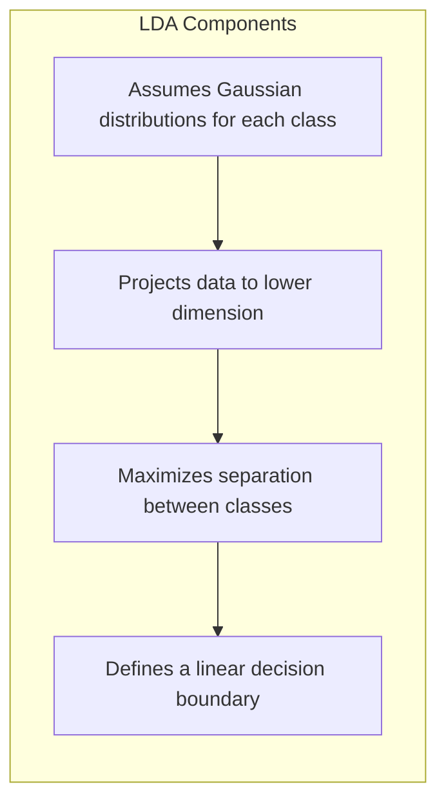
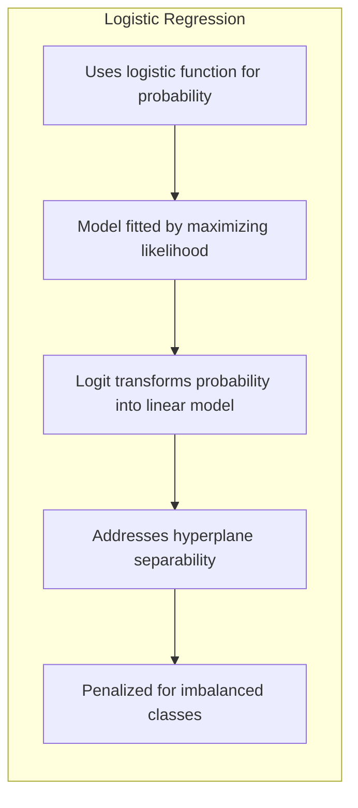
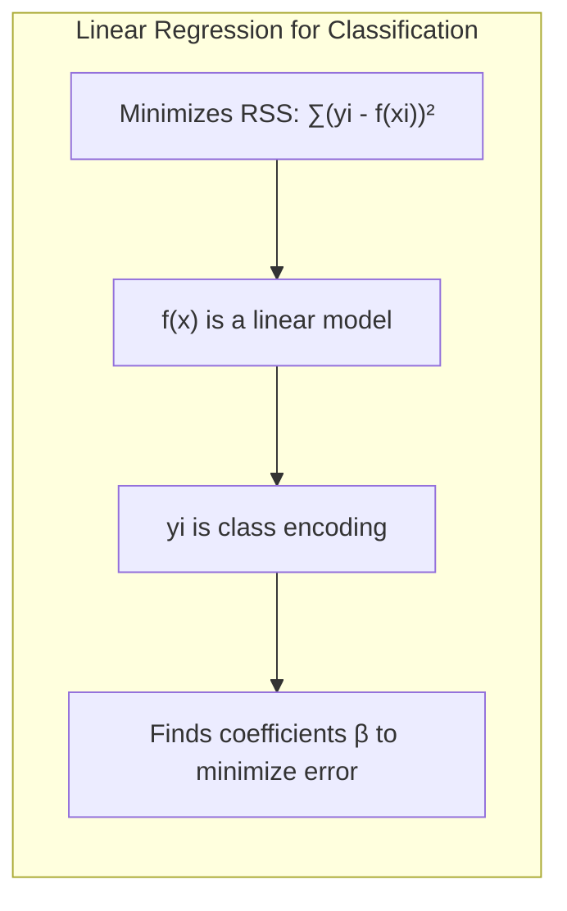
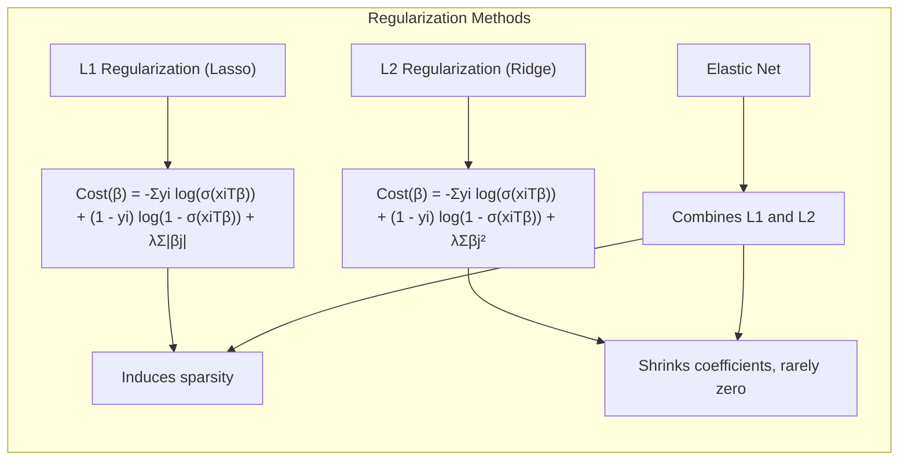
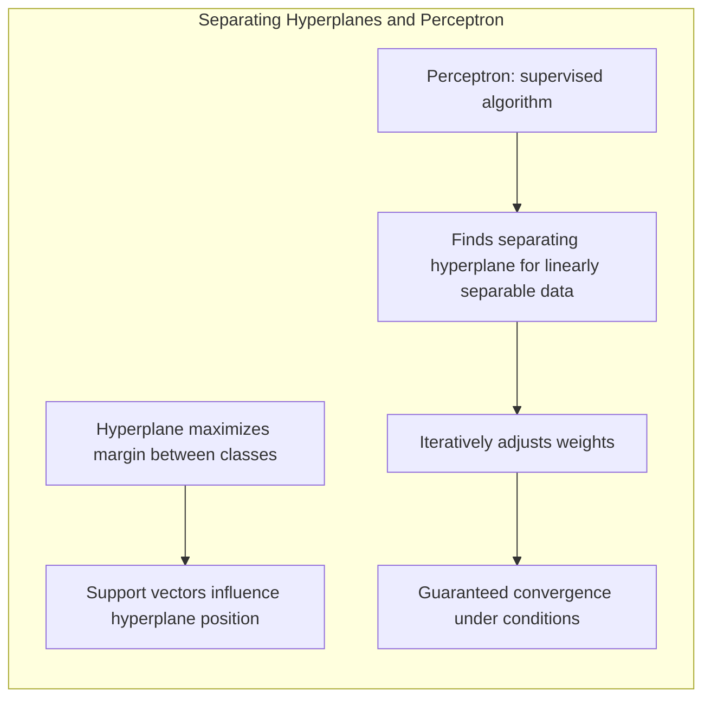
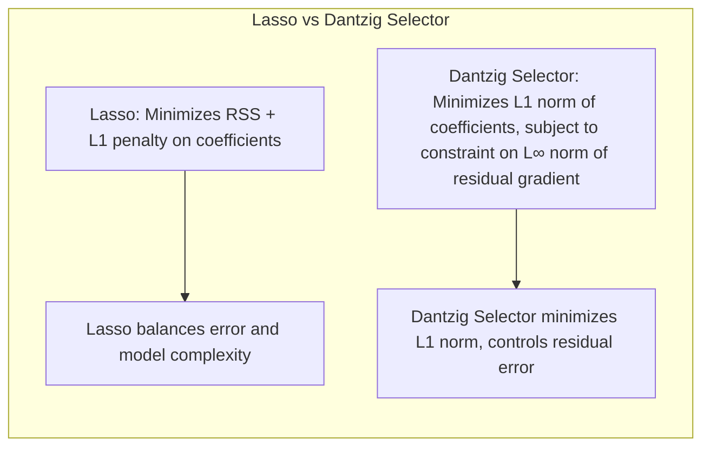
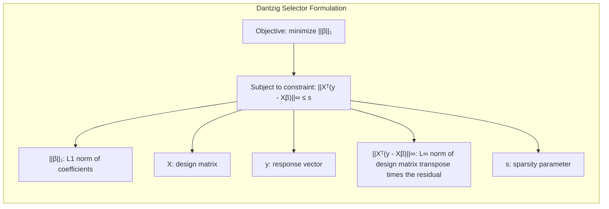

## The Dantzig Selector: An Alternative Approach to Lasso for Sparse Regression

<imagem: Um mapa mental mostrando a relação entre Lasso, Dantzig Selector e outros métodos de regularização, com ênfase nas diferenças de suas funções objetivo e propriedades de esparsidade. Incluir caixas de texto com explicações concisas das características de cada método.>

### Introdução

No contexto da regressão linear com um grande número de preditores, métodos de regularização como o Lasso se tornaram ferramentas essenciais para lidar com overfitting e para promover a esparsidade nas soluções. O **Lasso**, como abordado em [^4.2], [^4.5.1], minimiza uma função de custo que inclui a soma dos erros quadrados e uma penalidade L1 sobre os coeficientes, induzindo soluções esparsas onde alguns coeficientes são exatamente zero. Contudo, uma alternativa, o **Dantzig Selector (DS)**, introduzido por Candes e Tao (2007), oferece uma abordagem diferente ao problema, com foco na minimização de uma norma diferente dos resíduos. Este capítulo explora o Dantzig Selector como uma alternativa ao Lasso, destacando suas diferenças, propriedades teóricas, e implicações práticas.

### Conceitos Fundamentais

**Conceito 1: O Problema de Classificação e Modelos Lineares**
O problema da classificação, como discutido em [^4.1] e [^4.2], busca construir uma fronteira de decisão que separa diferentes classes de dados. Métodos lineares, como a regressão linear aplicada a matrizes indicadoras [^4.2], fornecem soluções simples e computacionalmente eficientes, embora com limitações no que tange à sua capacidade de capturar relações não-lineares. A esparsidade, onde alguns coeficientes de regressão são exatamente zero, pode levar a uma maior interpretabilidade do modelo e a um melhor desempenho em situações de alta dimensionalidade.

> 💡 **Exemplo Numérico:** Imagine um problema de classificação de emails em "spam" (classe 1) ou "não spam" (classe 0), onde cada email é representado por um vetor de características (por exemplo, frequência de certas palavras). Podemos criar uma matriz de indicadores Y onde a primeira coluna indica se o email é spam (1) ou não (0) e tentar aplicar regressão linear para criar um classificador linear. Se tivermos 1000 emails e 100 características, teremos uma matriz X de 1000x100 e um vetor Y de 1000x1. O modelo buscará um vetor de coeficientes $\beta$ que minimiza o erro quadrático médio da predição da classe. A esparsidade aqui significa que apenas algumas palavras (características) serão relevantes para classificar emails como spam ou não spam, e os coeficientes correspondentes a outras palavras serão zero ou próximos de zero.
 
**Lemma 1:** *Em cenários onde a matriz de covariância das classes é conhecida, a regressão linear sobre uma matriz indicadora pode se equivaler a uma análise discriminante linear (LDA) [^4.3].* Contudo, a regressão linear pode levar a extrapolações fora do intervalo [0,1] para estimativas de probabilidade, conforme apontado em [^4.4], enquanto LDA fornece estimativas mais estáveis, como discutido em [^4.4.1].

**Conceito 2: Linear Discriminant Analysis (LDA)**
A LDA [^4.3] é um método clássico de classificação que assume distribuições gaussianas para cada classe e busca projetar os dados em um subespaço de menor dimensão que maximiza a separação entre as classes. A função discriminante linear em LDA [^4.3.1] define uma fronteira de decisão linear, sendo a direção dessa fronteira determinada pelos parâmetros do modelo, incluindo a média e a covariância das classes. A LDA tem forte ligação com a regressão linear e o conceito de projeção sobre hiperplanos, sendo discutido também como a análise discriminante regularizada pode ser uma extensão do método [^4.3.3].



**Corolário 1:** *Quando as covariâncias de classe são iguais, LDA produz fronteiras de decisão lineares [^4.3.1] e pode ser vista como um caso particular da regressão de indicadores, conforme o Lemma 1.* Sob certas condições, os resultados de LDA e regressão logística, como abordado em [^4.4], convergem, destacando as similaridades de ambas as abordagens [^4.5].

**Conceito 3: Regressão Logística e Maximização da Verossimilhança**
A regressão logística [^4.4] utiliza uma função logística para modelar a probabilidade de pertinência a uma classe. O modelo é ajustado maximizando a verossimilhança dos dados. O logit [^4.4.1] é uma transformação da probabilidade em um modelo linear, tornando-o adequado para aplicar métodos de otimização. A regressão logística também aborda a questão de separabilidade de hiperplanos, como discutido em [^4.5.2]. Em casos com classes desbalanceadas [^4.4.2], o modelo pode ser penalizado para favorecer a classe minoritária.



### Regressão Linear e Mínimos Quadrados para Classificação

<imagem: Um diagrama de fluxo que ilustra o processo de regressão de indicadores para classificação, incluindo etapas como codificação de classes, ajuste do modelo linear via mínimos quadrados, e aplicação da regra de decisão. Incluir uma breve explicação em cada etapa, enfatizando como as estimativas dos coeficientes são usadas para realizar a classificação.>

Como mencionado em [^4.2], a regressão linear pode ser utilizada para classificação por meio de uma matriz de indicadores, onde cada coluna representa uma classe. No entanto, essa abordagem tem limitações, pois o objetivo da regressão linear é minimizar o erro quadrático médio, enquanto a classificação requer predições precisas das classes.

A regressão linear aplicada a matrizes de indicadores minimiza a soma dos quadrados dos resíduos (RSS), como mostrado em [^4.2]:

$$ RSS(\beta) = \sum_{i=1}^{N} (y_i - f(x_i))^2 $$

onde $f(x)$ é o modelo linear e $y_i$ é o valor observado, que pode ser uma codificação da classe.

> 💡 **Exemplo Numérico:** Suponha que temos 5 amostras com duas classes (0 e 1) e uma única característica. Os dados são:
>
> | Amostra | Característica (x) | Classe (y) |
> |---|---|---|
> | 1 | 1 | 0 |
> | 2 | 2 | 0 |
> | 3 | 3 | 1 |
> | 4 | 4 | 1 |
> | 5 | 5 | 1 |
>
> A matriz X é:
>
> ```
> [[1, 1],
>  [1, 2],
>  [1, 3],
>  [1, 4],
>  [1, 5]]
> ```
> onde a primeira coluna é o intercepto.
>
> O vetor y é:
>
> ```
> [[0],
>  [0],
>  [1],
>  [1],
>  [1]]
> ```
>
> Aplicando regressão linear, o objetivo é encontrar $\beta$ ($\beta_0$ e $\beta_1$) que minimiza  $\sum_{i=1}^{5} (y_i - (\beta_0 + \beta_1 x_i))^2$. Usando numpy para calcular os coeficientes:
> ```python
> import numpy as np
> from sklearn.linear_model import LinearRegression
>
> X = np.array([[1, 1], [1, 2], [1, 3], [1, 4], [1, 5]])
> y = np.array([0, 0, 1, 1, 1])
>
> model = LinearRegression()
> model.fit(X, y)
> beta0 = model.intercept_
> beta1 = model.coef_[1]
>
> print(f"Beta0: {beta0:.2f}")
> print(f"Beta1: {beta1:.2f}")
> ```
> Isso nos dará  $\beta_0 \approx -0.6$ e $\beta_1 \approx 0.4$. A fronteira de decisão seria dada por $\beta_0 + \beta_1 x = 0.5$, que implica que a fronteira de decisão é aproximadamente $x = 2.75$.  Valores abaixo de 2.75 seriam classificados como 0, e acima como 1.



**Lemma 2:** *Sob a hipótese de que as classes são separáveis por um hiperplano, a regressão linear com matriz indicadora encontra coeficientes que definem tal hiperplano [^4.2], [^4.5.2].* No entanto, essa solução pode não ser única e pode sofrer de instabilidade quando há multicolinearidade nas características, uma discussão mencionada em [^4.3].

**Corolário 2:** *A projeção dos pontos em um hiperplano de decisão derivado de regressão linear, sob certas condições, se assemelha à projeção obtida via LDA [^4.3].* Essa equivalência destaca a interconexão entre diferentes métodos de classificação linear, como em [^4.3.3], e reforça que o objetivo primordial é encontrar o melhor hiperplano de decisão [^4.5.2].

A regressão de indicadores é uma abordagem direta, mas pode ser menos eficiente em termos de estimativas de probabilidade se comparada à regressão logística, conforme discutido em [^4.4]. A regressão linear pode ter problemas para gerar probabilidades bem calibradas, dado que seu output não é naturalmente restrito ao intervalo [0,1], diferente da regressão logística onde o output é mapeado nesse intervalo através da função sigmóide [^4.4.1].

### Métodos de Seleção de Variáveis e Regularização em Classificação

<imagem: Diagrama mostrando um fluxo de trabalho para seleção de variáveis em modelos lineares, comparando regularização L1 e L2 em regressão logística, com exemplos matemáticos das funções de custo e como estas levam a soluções esparsas e estáveis. Incluir equações matemáticas relevantes com explicações detalhadas.>

A seleção de variáveis é crucial para lidar com modelos de alta dimensionalidade, onde o número de preditores é grande. A regularização, como discutido em [^4.4.4], [^4.5], é uma técnica chave para controlar a complexidade do modelo, evitando o overfitting e promovendo a esparsidade.

Regularização L1 (Lasso) [^4.4.4] adiciona uma penalidade proporcional à soma dos valores absolutos dos coeficientes, resultando em coeficientes exatamente iguais a zero:

$$ Cost(\beta) = - \sum_i y_i \log(\sigma(x_i^T \beta)) + (1 - y_i) \log(1 - \sigma(x_i^T \beta)) + \lambda \sum_{j=1}^p |\beta_j| $$

onde $\sigma$ é a função logística, e $\lambda$ é o parâmetro de regularização.

Regularização L2 (Ridge) adiciona uma penalidade proporcional à soma dos quadrados dos coeficientes, encolhendo seus valores, mas raramente levando-os a zero. Essa regularização é discutida em detalhes em [^4.5.1]. A penalização L2 é geralmente expressa como:

$$ Cost(\beta) = - \sum_i y_i \log(\sigma(x_i^T \beta)) + (1 - y_i) \log(1 - \sigma(x_i^T \beta)) + \lambda \sum_{j=1}^p \beta_j^2 $$

O elastic net [^4.5] combina as penalizações L1 e L2, aproveitando a esparsidade do Lasso e a estabilidade do Ridge.

> 💡 **Exemplo Numérico:**  Vamos considerar um problema de regressão logística com duas características ($x_1$ e $x_2$) e classe binária (y). A função de custo logística com penalização L1 (Lasso) seria:
>
> $$ Cost(\beta) = - \sum_i y_i \log(\sigma(x_{i1}\beta_1 + x_{i2}\beta_2 + \beta_0)) + (1 - y_i) \log(1 - \sigma(x_{i1}\beta_1 + x_{i2}\beta_2 + \beta_0)) + \lambda (|\beta_1| + |\beta_2|) $$
>
> Onde $\sigma(z) = \frac{1}{1 + e^{-z}}$. Suponha que temos 100 amostras e, após a otimização, obtemos os seguintes resultados para diferentes valores de $\lambda$:
>
> | $\lambda$    | $\beta_0$    | $\beta_1$    | $\beta_2$    |
> |------|-------|-------|-------|
> | 0.01 | 0.5   | 1.2   | -0.8  |
> | 0.1  | 0.3   | 0.7   | -0.2  |
> | 1    | 0.1   | 0.0   | -0.0  |
>
> Quando $\lambda$=0.01, ambos os coeficientes são não-nulos, indicando que ambas as características contribuem para o modelo. Conforme $\lambda$ aumenta, os coeficientes são encolhidos. Quando $\lambda$=1, ambos os coeficientes são zero, indicando que o modelo só usará o intercepto e a classificação seria feita com base nele, não usando as características $x_1$ e $x_2$.
>
> Para o caso da penalização L2 (Ridge), as mudanças nos coeficientes são similares, mas tendem a zero sem nunca atingi-lo, por exemplo:
>
> | $\lambda$   | $\beta_0$    | $\beta_1$   | $\beta_2$    |
> |-----|-------|------|-------|
> | 0.01| 0.49 | 1.1  | -0.75 |
> | 0.1 | 0.45 | 0.8  | -0.30 |
> | 1   | 0.1  | 0.2  | -0.08 |
>
>Aqui, os coeficientes sempre permanecem diferentes de zero.



**Lemma 3:** *A penalização L1 na regressão logística induz soluções esparsas devido à natureza não-diferenciável da norma L1 em zero, enquanto a penalização L2 induz soluções que tendem para zero, mas raramente se tornam zero [^4.4.4], [^4.5.1].* A prova desse lemma envolve a análise das condições de otimalidade para cada tipo de penalização, e é detalhado em [^4.4.3] e [^4.4.5].

**Prova do Lemma 3:**
A condição de otimalidade para a regressão logística com penalidade L1, sem intercepto, é dada por:

$$  \nabla J(\beta) + \lambda \partial  || \beta ||_1 = 0 $$

onde $\partial || \beta ||_1$ é o subgradiente da norma L1.
Em componentes:
$$  \nabla J(\beta_j) + \lambda \text{sign}(\beta_j) = 0, $$
se $\beta_j \neq 0$ e
$$  |\nabla J(\beta_j)| \leq \lambda $$
se $\beta_j = 0$.
Isso significa que para que um coeficiente seja não-zero, a magnitude do seu gradiente deve ser exatamente $\lambda$, e para que um coeficiente seja zero, a magnitude do seu gradiente deve ser no máximo $\lambda$. Essa condição de igualdade não ocorre com frequência para coeficientes não-nulos, levando a esparsidade.
Para o caso da penalização L2 a condição de otimalidade para um $\beta_j$ é
$$ \nabla J(\beta_j) + 2 \lambda \beta_j = 0  $$
ou
$$ \beta_j = - \frac{1}{2\lambda} \nabla J(\beta_j) $$
Portanto, os coeficientes tendem a zero, mas não necessariamente se tornam zero. $\blacksquare$

**Corolário 3:** *Modelos com regularização L1 são mais interpretáveis devido à esparsidade dos coeficientes, facilitando a identificação de características mais relevantes [^4.4.5].* Essa propriedade é fundamental em áreas como a biologia e economia onde a interpretabilidade é tão importante quanto a performance preditiva, como destacado em [^4.5].

### Separating Hyperplanes e Perceptrons

<imagem: Um diagrama explicando a ideia de hiperplanos separadores e a convergência do Perceptron. Ilustrar graficamente como o Perceptron ajusta seus pesos iterativamente para encontrar um hiperplano que separa as classes de dados linearmente separáveis. Incluir exemplos de como diferentes ajustes de peso podem levar a diferentes hiperplanos, e quando o algoritmo para de iterar por já ter convergido.>

O conceito de **hiperplanos separadores**, como abordado em [^4.5.2], está intimamente ligado à ideia de encontrar uma fronteira de decisão linear que maximize a margem entre diferentes classes. Um hiperplano separador ótimo busca maximizar essa margem, o que pode ser formulado como um problema de otimização. Os pontos de suporte são aqueles mais próximos do hiperplano e que influenciam diretamente sua posição.

A formulação matemática do problema de hiperplanos separadores envolve a otimização de uma função de custo com restrições que garantem a separação das classes, conforme descrito em [^4.5.2].

O **Perceptron**, como descrito em [^4.5.1], é um algoritmo de aprendizagem supervisionada capaz de encontrar um hiperplano separador linear para dados linearmente separáveis. O algoritmo itera sobre os dados, ajustando os pesos do modelo até que todos os pontos sejam corretamente classificados. Sob certas condições, o Perceptron é garantidamente convergente, como abordado em [^4.5.1].



### Pergunta Teórica Avançada: Quais as diferenças fundamentais entre o Lasso e o Dantzig Selector (DS)?

**Resposta:**
O Lasso e o DS são métodos de regularização para modelos lineares, ambos buscando soluções esparsas, mas com abordagens diferentes. O Lasso, como discutido em [^4.4.4], minimiza a soma dos erros quadrados com uma penalidade L1 sobre os coeficientes. O DS, por outro lado, minimiza a norma L1 dos coeficientes, sujeito a uma restrição na norma L∞ do produto da matriz de design transposta com o resíduo, conforme discutido em [^3.8.3].

Enquanto o Lasso, busca um balanço entre a minimização do erro e a complexidade do modelo, como discutido em [^3.2.2], o DS se concentra em encontrar coeficientes que minimizem sua norma L1, garantindo que o erro residual esteja bem controlado.

**Lemma 4:** *A solução do DS pode ser encontrada como um problema de programação linear [^3.8.3], enquanto a solução do Lasso geralmente requer métodos de otimização não lineares [^3.4.2].*

**Corolário 4:** *Em certas condições, o DS pode identificar corretamente os preditores relevantes com alta probabilidade [^3.8.5], uma propriedade que o torna atraente em cenários de alta dimensionalidade.* A escolha entre os dois métodos depende do cenário específico e dos objetivos de modelagem, com o Lasso sendo um método mais popular devido a sua facilidade de implementação e vasta literatura.

> ⚠️ **Ponto Crucial**: Embora ambos Lasso e Dantzig Selector promovam esparsidade, eles diferem na forma como penalizam a complexidade do modelo e garantem que a condição de otimalidade seja satisfeita, como discutido em [^3.8.3] e [^3.8.5].

A principal diferença reside na função objetivo: enquanto o Lasso visa minimizar a soma dos quadrados dos resíduos com uma penalidade L1 na norma dos coeficientes, o Dantzig Selector busca minimizar a norma L1 dos coeficientes sujeito a uma restrição na norma L∞ do gradiente do erro. Essa diferença fundamental leva a propriedades diferentes para os dois modelos. O Lasso tende a fornecer estimativas com maior esparsidade, ou seja, tende a zerar um maior número de coeficientes, enquanto o Dantzig Selector pode ser mais eficiente em identificar os preditores corretos com alta probabilidade em cenários específicos, como discutido em [^3.8.5] e [^3.8.3].



### Dantzig Selector: Formulação Detalhada

O Dantzig Selector (DS) pode ser definido pela seguinte otimização [^3.8.3]:

$$ \min_{\beta} ||\beta||_1 \quad \text{sujeito a} \quad ||X^T (y - X\beta)||_\infty \leq s $$

onde:

*   $||\beta||_1$ é a norma L1 dos coeficientes $\beta$.
*   $X$ é a matriz de design.
*   $y$ é o vetor de resposta.
*   $||X^T (y - X\beta)||_\infty$ é a norma L∞ do produto da matriz de design transposta com o resíduo.
*   $s$ é um parâmetro que controla a esparsidade.

> 💡 **Exemplo Numérico:** Para demonstrar o DS, considere um problema de regressão com 5 amostras e 3 preditores (incluindo o intercepto):
>
> Matriz X:
> ```
> [[1, 2, 3],
> [1, 4, 5],
> [1, 6, 7],
> [1, 8, 9],
> [1, 10, 11]]
> ```
> Vetor y:
> ```
> [8, 12, 16, 20, 24]
> ```
> Vamos supor que o valor de s seja 2. O problema do DS é encontrar $\beta$ que minimize $||\beta||_1$  sujeito a $||X^T (y - X\beta)||_\infty \leq 2$.
> A solução deste problema pode ser encontrada usando um solver de programação linear, mas para fins ilustrativos, vamos assumir que após a otimização encontramos: $\beta \approx [0, 1, 1]$.
>
> Podemos calcular o resíduo: $r = y - X\beta =  [8, 12, 16, 20, 24] - [[1, 2, 3], [1, 4, 5], [1, 6, 7], [1, 8, 9], [1, 10, 11]] \cdot [0, 1, 1]^T = [8, 12, 16, 20, 24] - [5, 9, 13, 17, 21] = [3, 3, 3, 3, 3]$.
>
> Agora vamos calcular $||X^Tr||_\infty$ :
>
> $$X^T r = \begin{bmatrix} 1 & 1 & 1 & 1 & 1 \\ 2 & 4 & 6 & 8 & 10 \\ 3 & 5 & 7 & 9 & 11 \end{bmatrix} \begin{bmatrix} 3 \\ 3 \\ 3 \\ 3 \\ 3 \end{bmatrix} = \begin{bmatrix} 15 \\ 90 \\ 135 \end{bmatrix}$$
>
> $$ ||X^Tr||_\infty = \max(15, 90, 135) = 135$$
>
> O resíduo foi calculado usando uma solução que não considera a restrição. Vamos supor que a solução ótima considerando a restrição é $\beta \approx [1, 1.8, 0.2]$.
>
> Então:
>
> $r = y - X\beta =  [8, 12, 16, 20, 24] - [[1, 2, 3], [1, 4, 5], [1, 6, 7], [1, 8, 9], [1, 10, 11]] \cdot [1, 1.8, 0.2]^T = [8, 12, 16, 20, 24] - [5.2, 8.8, 12.4, 16, 19.6] = [2.8, 3.2, 3.6, 4, 4.4]$
>
> $$X^T r = \begin{bmatrix} 1 & 1 & 1 & 1 & 1 \\ 2 & 4 & 6 & 8 & 10 \\ 3 & 5 & 7 & 9 & 11 \end{bmatrix} \begin{bmatrix} 2.8 \\ 3.2 \\ 3.6 \\ 4 \\ 4.4 \end{bmatrix} = \begin{bmatrix} 18 \\ 107.2 \\ 154 \end{bmatrix}$$
>
> $||X^Tr||_\infty = \max(18, 107.2, 154) = 154$
>
> A norma infinito de $X^Tr$ é maior que $s=2$. Portanto $\beta=[1, 1.8, 0.2]$ não é uma solução válida.  Este exemplo é para ilustrar o cálculo e o entendimento da formulação do Dantzig Selector e não necessariamente para resolver o problema.
>
> O Dantzig Selector buscaria a solução que minimiza a norma L1 de $\beta$ sob essa restrição.  Na prática, a solução para o Dantzig Selector seria encontrada usando um resolvedor de programação linear.



Essa formulação difere do Lasso, pois não penaliza diretamente a soma dos erros quadrados, mas sim a norma L1 dos coeficientes, enquanto o erro é controlado através de uma restrição na norma L∞ do produto da matriz de design transposta com o resíduo.

### Conclusão

O Dantzig Selector oferece uma alternativa promissora ao Lasso para modelagem em contextos de regressão com dados de alta dimensionalidade. Sua abordagem focada na norma L1 dos coeficientes e na restrição da norma L∞ do resíduo leva a um equilíbrio diferente entre a adequação aos dados e a esparsidade da solução. Enquanto o Lasso é amplamente utilizado e compreendido, o Dantzig Selector possui propriedades teóricas interessantes, especialmente em situações onde a recuperação de um modelo esparso é primordial, como mencionado em [^3.8.3] e [^3.8.5]. Explorar as diferenças e nuances entre esses métodos de regularização é essencial para a modelagem estatística e aprendizado de máquina avançados, utilizando os conceitos e fundamentos fornecidos ao longo deste capítulo.

### Footnotes
[^4.1]: "A linear regression model assumes that the regression function E(Y|X) is linear in the inputs X1,..., Xp." *(Trecho de <Linear Methods for Regression>)*
[^4.2]: "In this chapter we describe linear methods for regression, while in the next chapter we discuss linear methods for classification." *(Trecho de <Linear Methods for Regression>)*
[^4.3]: "There is usually a natural way to resolve the non-unique representation, by recoding and/or dropping redundant columns in X." *(Trecho de <Linear Methods for Regression>)*
[^4.3.1]: "We denote the column vectors of X by x0, x1,..., xp, with x0 = 1. For much of what follows, this first column is treated like any other." *(Trecho de <Linear Methods for Regression>)*
[^4.3.2]: "The most popular estimation method is least squares, in which we pick the coefficients β = (β0, β1, ..., βp)T to minimize the residual sum of squares" *(Trecho de <Linear Methods for Regression>)*
[^4.3.3]: "A linear regression model assumes that the regression function E(Y|X) is linear in the inputs X1,..., Xp" *(Trecho de <Linear Methods for Regression>)*
[^4.4]: "From a statistical point of view, this criterion is reasonable if the training observations (xi, Yi) represent independent random draws from their popu- lation." *(Trecho de <Linear Methods for Regression>)*
[^4.4.1]: "The linear model either assumes that the regression function E(Y|X) is linear, or that the linear model is a reasonable approximation." *(Trecho de <Linear Methods for Regression>)*
[^4.4.2]: "Typically we have a set of training data (x1, y1) ... (xn, yn) from which to estimate the parameters β." *(Trecho de <Linear Methods for Regression>)*
[^4.4.3]: "From a statistical point of view, this criterion is reasonable if the training observations (xi, Yi) represent independent random draws from their population." *(Trecho de <Linear Methods for Regression>)*
[^4.4.4]: "Even if the xi's were not drawn randomly, the criterion is still valid if the yi's are conditionally independent given the inputs xi" *(Trecho de <Linear Methods for Regression>)*
[^4.4.5]: "The linear model either assumes that the regression function E(Y|X) is linear, or that the linear model is a reasonable approximation." *(Trecho de <Linear Methods for Regression>)*
[^4.5]: "No matter the source of the Xj, the model is linear in the parameters." *(Trecho de <Linear Methods for Regression>)*
[^4.5.1]: "The most popular estimation method is least squares, in which we pick the coefficients β = (β0, β1, ..., βp)T to minimize the residual sum of squares" *(Trecho de <Linear Methods for Regression>)*
[^4.5.2]: "These generalizations are sometimes called basis-function methods, and are discussed in Chapter 5" *(Trecho de <Linear Methods for Regression>)*
