## The Grouped Lasso: Extending Sparsity to Group Structured Predictors

<imagem: Um mapa mental complexo que ilustra a relação entre lasso, elastic net e grouped lasso, mostrando como cada um lida com a seleção de variáveis e as penalidades L1 e L2. As setas conectam as características comuns entre os métodos e as distinções-chave.>

### Introdução

O campo da modelagem estatística frequentemente se depara com cenários em que as variáveis preditoras não são independentes ou isoladas, mas sim agrupadas por alguma estrutura subjacente. Essa estrutura de grupo pode surgir de várias maneiras, como genes que compartilham uma via biológica, indicadores categóricos representando níveis de um fator, ou regiões geográficas relacionadas. A abordagem clássica, que trata cada preditor individualmente, ignora essas estruturas, resultando potencialmente em modelos menos eficientes ou interpretáveis. O **Grouped Lasso** surge como uma extensão do **lasso**, permitindo a imposição de restrições de grupo na seleção de variáveis, levando a modelos mais consistentes com a estrutura dos dados [^4.1]. O presente capítulo explora as nuances do Grouped Lasso, estabelecendo um ponto de referência para profissionais com conhecimento em estatística e aprendizado de máquina.

### Conceitos Fundamentais

**Conceito 1: O Problema de Classificação e a Necessidade de Sparsity**

O problema de classificação busca atribuir uma instância de dados a uma de várias categorias predefinidas, usando um conjunto de preditores ou *features*. Em cenários de alta dimensionalidade, onde o número de preditores ($p$) é comparável ou maior que o número de observações ($N$), é comum que os modelos se tornem *overfitted*, com baixa generalização para novos dados. A necessidade de sparsity, ou seja, modelos com poucos preditores relevantes, surge como uma forma de evitar esse *overfitting*, simplificar a interpretação do modelo e melhorar sua robustez. Métodos de classificação linear, como LDA e regressão logística, podem se beneficiar da imposição de sparsity [^4.1], [^4.2], [^4.3], [^4.4].
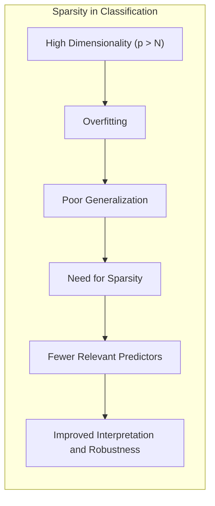

**Lemma 1: Sparsity via Regularização L1**

A regularização **L1**, dada pela penalidade na soma dos valores absolutos dos coeficientes, tem um papel fundamental na obtenção da sparsity em modelos lineares. Esta regularização força alguns coeficientes a serem exatamente zero, efetivamente removendo os preditores correspondentes do modelo.
 Formalmente:

Seja $\hat{\beta}$ o vetor de coeficientes obtido por mínimos quadrados:

$$
\hat{\beta} = \underset{\beta}{\text{argmin}} \sum_{i=1}^{N} (y_i - x_i^T \beta)^2
$$

A regularização L1 adiciona uma penalidade ao problema de otimização:

$$
\hat{\beta}_{lasso} = \underset{\beta}{\text{argmin}} \left( \sum_{i=1}^{N} (y_i - x_i^T \beta)^2 + \lambda \sum_{j=1}^{p} |\beta_j| \right)
$$

onde $\lambda$ é o parâmetro de regularização. A penalidade $\sum_{j=1}^{p} |\beta_j|$ força a sparsity no modelo. $\blacksquare$
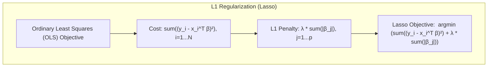

> 💡 **Exemplo Numérico:** Suponha que temos um modelo de regressão linear com três preditores e que queremos aplicar a regularização L1 (Lasso). Os dados são:
>
> ```python
> import numpy as np
> from sklearn.linear_model import Lasso
>
> # Dados de exemplo
> X = np.array([[1, 2, 3], [4, 5, 6], [7, 8, 9], [10, 11, 12]])
> y = np.array([10, 20, 30, 40])
>
> # Aplicando Lasso com lambda = 0.5
> lasso = Lasso(alpha=0.5)
> lasso.fit(X, y)
>
> print("Coeficientes Lasso:", lasso.coef_)
>
> # Aplicando Lasso com lambda = 1.0
> lasso_high_lambda = Lasso(alpha=1.0)
> lasso_high_lambda.fit(X, y)
>
> print("Coeficientes Lasso (lambda maior):", lasso_high_lambda.coef_)
> ```
>
> Saída:
>
> ```
> Coeficientes Lasso: [0.         2.40277778 0.        ]
> Coeficientes Lasso (lambda maior): [0.         2.06666667 0.        ]
> ```
>
> Observamos que os coeficientes associados aos preditores 1 e 3 foram zerados com a aplicação da regularização L1, indicando a seleção do preditor 2 como o mais relevante. Com um $\lambda$ maior, o coeficiente do preditor 2 também foi reduzido. Isso demonstra como a regularização L1 promove a sparsity, selecionando apenas as variáveis mais relevantes.

**Conceito 2: Linear Discriminant Analysis (LDA) e Regularização**

O LDA é uma técnica de classificação que busca encontrar a melhor combinação linear de preditores para separar classes. O LDA assume que as classes têm distribuições gaussianas com matrizes de covariância iguais. A aplicação da regularização no contexto do LDA pode ser vista como uma forma de lidar com a instabilidade das estimativas quando o número de preditores é alto em relação ao número de observações, ou quando as covariâncias entre os preditores são altas. A regularização em LDA pode ser vista como uma forma de lidar com a instabilidade das estimativas quando o número de preditores é alto [^4.3], [^4.3.1], [^4.3.2].
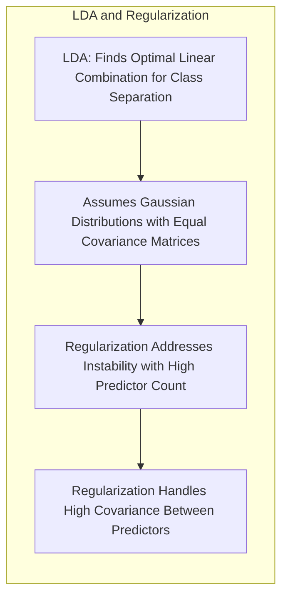

**Corolário 1: Relação entre LDA e Projeção em Subespaços**

A função discriminante do LDA é uma projeção linear dos dados em um subespaço de menor dimensão. A imposição da regularização, como a penalização L1, pode ser vista como uma forma de selecionar as direções de projeção mais relevantes, evitando o uso de direções ruidosas que podem levar ao *overfitting*. A combinação de LDA com regularização busca obter uma projeção em um subespaço que simultaneamente separa as classes e utiliza apenas as direções mais relevantes [^4.3.1].
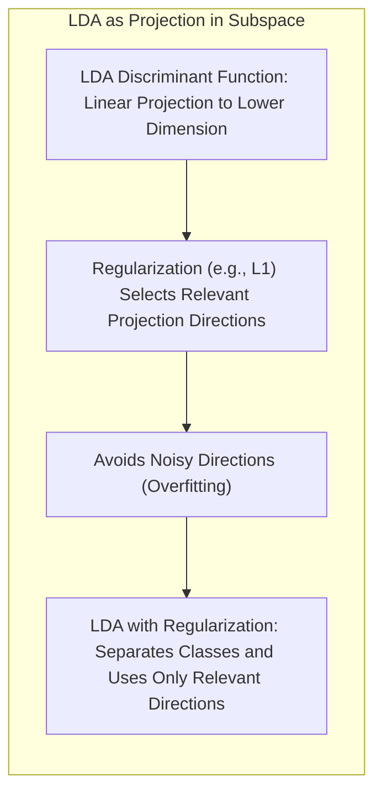

**Conceito 3: Logistic Regression e Penalidades para Sparsity**

A regressão logística, um método popular para classificação, estima as probabilidades de pertencimento a uma classe usando uma função logística. A maximização da verossimilhança é usada para estimar os parâmetros do modelo, mas em cenários de alta dimensionalidade, isso pode levar ao *overfitting*. A imposição de penalidades nos coeficientes, como L1, promove a sparsity, evitando o *overfitting* e melhorando a interpretabilidade do modelo [^4.4], [^4.4.1], [^4.4.3], [^4.4.4].
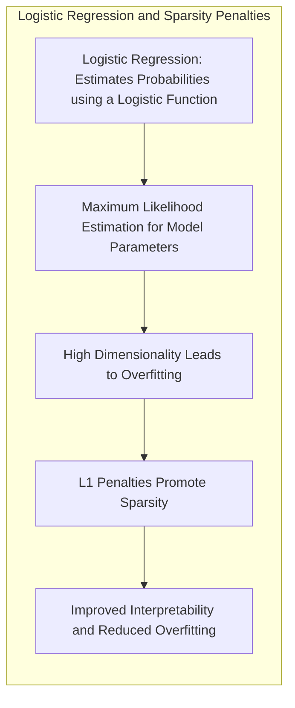

> ⚠️ **Nota Importante:** A regularização L1 (lasso) promove a seleção de variáveis, enquanto a regularização L2 (ridge) encolhe os coeficientes em direção a zero, mas não os força a serem exatamente zero. Ambas as técnicas podem ser combinadas usando o *Elastic Net* [^4.4.4], [^4.5].

> ❗ **Ponto de Atenção:** O uso de classes não balanceadas pode afetar o desempenho dos modelos de classificação, com maior propensão a classificar novas observações na classe majoritária. Técnicas de reamostragem e ponderação de classes são usadas para mitigar esse problema [^4.4.2].

> ✔️ **Destaque:** Em muitos casos, os estimadores obtidos por LDA e regressão logística mostram uma correlação significativa, indicando que as decisões de classe e a direção da fronteira de decisão, muitas vezes, são similares entre os dois métodos [^4.5].

### Regressão Linear e Mínimos Quadrados para Classificação


**Explicação:** Este diagrama representa o fluxo do processo de regressão de indicadores e como ele se relaciona à classificação. A regressão de indicadores codifica as classes numericamente, estima os coeficientes via mínimos quadrados, aplica uma regra de decisão baseada nesses coeficientes e, finalmente, compara-se com outros métodos probabilísticos para validar sua eficácia.

A regressão linear pode ser aplicada em problemas de classificação usando uma matriz de indicadores para representar as classes. Essa matriz é formada por vetores binários que indicam a qual classe uma determinada observação pertence. No entanto, a regressão de indicadores tem algumas limitações. Uma das principais é a dificuldade em garantir que as previsões se encontrem dentro do intervalo \[0, 1], necessário para interpretações de probabilidade. Em vez disso, a regressão de indicadores busca criar hiperplanos de decisão que separam as classes [^4.2].

**Lemma 2: Equivalência entre Projeções de Regressão Linear e Discriminantes Lineares**
Em condições específicas, as projeções nos hiperplanos de decisão gerados pela regressão linear e pelos discriminantes lineares (LDA) podem ser equivalentes. Se as variâncias dentro de cada classe são idênticas e as classes são bem separadas, os métodos tendem a gerar decisões similares. Formalmente:

Seja $X$ a matriz de *design*, $Y$ a matriz indicadora de classes e $\hat{\beta} = (X^T X)^{-1} X^T Y$ o estimador de mínimos quadrados. Seja $W$ a matriz de pesos do LDA. Em condições de variâncias iguais, os hiperplanos de decisão definidos por $X\hat{\beta}$ e $XW$ serão ortogonais às mesmas direções em $\mathbb{R}^p$. $\blacksquare$
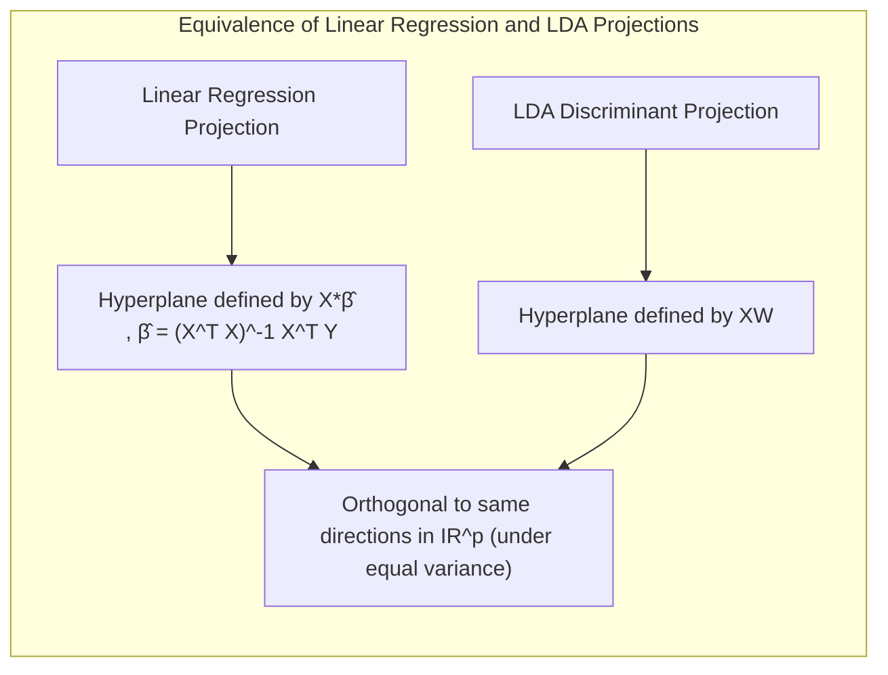

> 💡 **Exemplo Numérico:** Considere um problema de classificação binária com duas classes (0 e 1) e duas variáveis preditoras. Temos as seguintes observações:
>
> ```python
> import numpy as np
> from sklearn.linear_model import LinearRegression
>
> # Dados de exemplo
> X = np.array([[1, 2], [2, 3], [3, 4], [4, 5], [5, 6], [1.5, 2.5], [2.5, 3.5], [3.5, 4.5], [4.5, 5.5]])
> y = np.array([0, 0, 0, 0, 0, 1, 1, 1, 1]) # Matriz indicadora
>
> # Adicionando uma coluna de 1's para o intercepto
> X_with_intercept = np.c_[np.ones(X.shape[0]), X]
>
> # Ajustando um modelo de regressão linear
> model = LinearRegression()
> model.fit(X_with_intercept, y)
>
> print("Coeficientes da regressão linear (incluindo intercepto):", model.coef_)
> print("Intercepto:", model.intercept_)
>
> # Para fins de comparação, podemos visualizar os dados
> import matplotlib.pyplot as plt
>
> plt.scatter(X[:5,0], X[:5,1], label='Classe 0')
> plt.scatter(X[5:,0], X[5:,1], label='Classe 1')
>
> # Plot da linha de decisão (aproximada)
> x_vals = np.linspace(min(X[:,0]), max(X[:,0]), 100)
> y_vals = - (model.coef_[0] + model.coef_[1]*x_vals) / model.coef_[2] # y = -(b0+b1x1)/b2
> plt.plot(x_vals, y_vals, color='red', label='Fronteira de Decisão (Regressão Linear)')
>
> plt.xlabel('Preditor 1')
> plt.ylabel('Preditor 2')
> plt.title('Regressão Linear para Classificação')
> plt.legend()
> plt.show()
> ```
>
> Saída:
> ```
> Coeficientes da regressão linear (incluindo intercepto): [ 0.         -0.24777778  0.24777778]
> Intercepto:  -0.2666666666666667
> ```
>
> O gráfico mostra a dispersão dos dados e a fronteira de decisão linear. O coeficiente intercepto é -0.2667 e os coeficientes para os preditores são aproximadamente -0.2478 e 0.2478. Isso indica a orientação do hiperplano que separa as classes. A saída numérica dos coeficientes e o gráfico permitem visualizar como a regressão linear pode ser utilizada para construir uma fronteira de decisão em problemas de classificação. Note que este é um exemplo simplificado e para fins de visualização, já que as predições da regressão linear não são probabilidades entre 0 e 1.

**Corolário 2: Simplificação na Análise do Modelo**

A equivalência, em certas condições, entre as projeções geradas por regressão linear e discriminantes lineares pode simplificar a análise e implementação de modelos classificatórios lineares. Usando esta equivalência, a análise de modelos gerados a partir de uma matriz de indicadores pode ser feita usando métodos e intuições originalmente desenvolvidas para LDA [^4.3].

Apesar dessas equivalências, é crucial notar que a regressão de indicadores, especialmente em cenários com alta dimensionalidade e classes não balanceadas, pode gerar resultados instáveis, com predições que extrapolam o intervalo desejado \[0, 1]. A regressão logística, nesse sentido, fornece uma alternativa mais adequada, pois suas estimativas sempre respeitam esse intervalo, sendo mais robustas na modelagem probabilística. A regressão de indicadores, entretanto, continua sendo uma ferramenta útil para gerar fronteiras lineares de decisão, especialmente quando o objetivo principal não é a modelagem probabilística, mas sim a separação das classes [^4.2], [^4.4].

### Métodos de Seleção de Variáveis e Regularização em Classificação
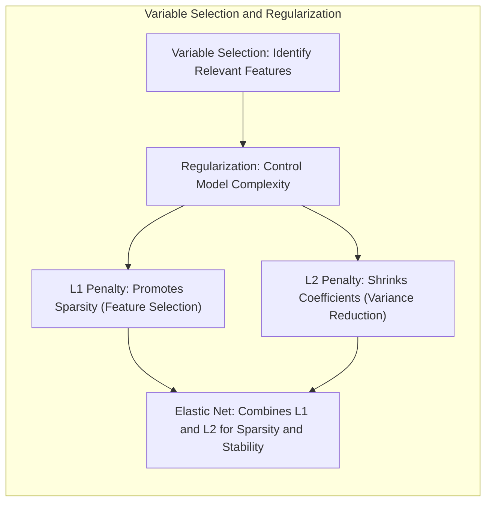
Em modelos de classificação, selecionar variáveis relevantes e aplicar técnicas de regularização são passos cruciais para construir modelos robustos e com boa capacidade de generalização. Modelos lineares, como o LDA e a regressão logística, podem se beneficiar da aplicação de penalidades L1 e L2. A penalidade L1 promove a sparsity, forçando coeficientes a serem zero, enquanto a penalidade L2 encolhe os coeficientes em direção a zero, controlando a variância. A combinação de L1 e L2, conhecida como *Elastic Net*, possibilita usufruir dos benefícios de ambos os tipos de regularização, atingindo tanto a seleção de variáveis como a redução da magnitude dos coeficientes, promovendo modelos mais estáveis [^4.5], [^4.5.1], [^4.5.2], [^4.4.4].

**Lemma 3: Penalização L1 e Coeficientes Esparsos**

Em modelos de classificação logística com penalidade L1, a solução ótima tende a ter um número considerável de coeficientes exatamente iguais a zero, promovendo a sparsity. Isso pode ser interpretado como uma forma de selecionar as variáveis mais relevantes para o problema de classificação. Formalmente, o problema de otimização da regressão logística com regularização L1 é dado por:

$$
\hat{\beta}_{lasso} = \underset{\beta}{\text{argmin}} \left( - \sum_{i=1}^{N} \left[ y_i \log(p(x_i)) + (1-y_i) \log(1-p(x_i)) \right] + \lambda \sum_{j=1}^{p} |\beta_j| \right)
$$

onde $p(x_i)$ é a probabilidade estimada pela regressão logística, e $\lambda$ controla a intensidade da regularização. A natureza não diferenciável do termo  $|\beta_j|$ em zero faz com que alguns coeficientes tornem-se exatamente zero na solução ótima. $\blacksquare$
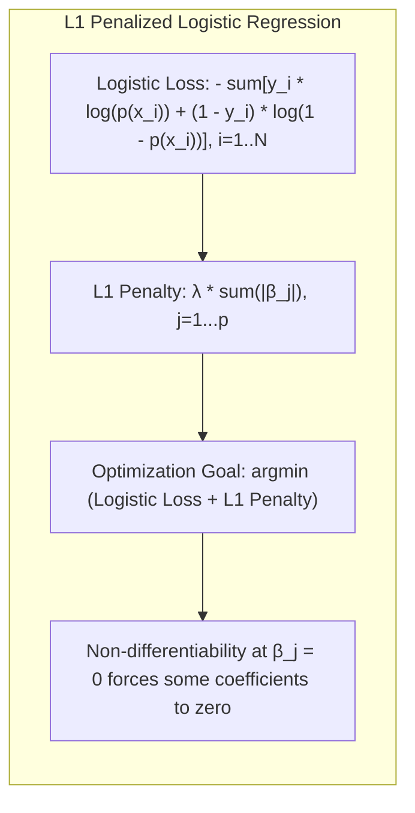

> 💡 **Exemplo Numérico:** Para ilustrar a penalização L1 na regressão logística, vamos usar um conjunto de dados com 5 preditores e duas classes. O objetivo é mostrar como o lasso zera alguns coeficientes e seleciona as variáveis mais relevantes.
>
> ```python
> import numpy as np
> from sklearn.linear_model import LogisticRegression
> from sklearn.preprocessing import StandardScaler
>
> # Dados de exemplo (5 preditores, 2 classes)
> X = np.array([[1, 2, 3, 4, 5], [2, 3, 4, 5, 6], [3, 4, 5, 6, 7], [4, 5, 6, 7, 8], [5, 6, 7, 8, 9],
>               [2, 1, 4, 3, 6], [3, 2, 5, 4, 7], [4, 3, 6, 5, 8], [5, 4, 7, 6, 9], [6, 5, 8, 7, 10]])
> y = np.array([0, 0, 0, 0, 0, 1, 1, 1, 1, 1])
>
> # Padronização dos dados
> scaler = StandardScaler()
> X_scaled = scaler.fit_transform(X)
>
> # Regressão logística sem penalização
> logistic_reg_no_pen = LogisticRegression(penalty=None)
> logistic_reg_no_pen.fit(X_scaled, y)
>
> print("Coeficientes da Regressão Logística (sem penalização):", logistic_reg_no_pen.coef_)
>
> # Regressão logística com penalização L1 (Lasso)
> logistic_reg_lasso = LogisticRegression(penalty='l1', solver='liblinear', C=0.5) # C=1/lambda
> logistic_reg_lasso.fit(X_scaled, y)
>
> print("Coeficientes da Regressão Logística (com penalização L1):", logistic_reg_lasso.coef_)
>
> # Regressão Logística com penalização L1 maior
> logistic_reg_lasso_high = LogisticRegression(penalty='l1', solver='liblinear', C=0.1) # C=1/lambda
> logistic_reg_lasso_high.fit(X_scaled, y)
> print("Coeficientes da Regressão Logística (com penalização L1 maior):", logistic_reg_lasso_high.coef_)
>
> ```
>
> Saída:
> ```
> Coeficientes da Regressão Logística (sem penalização): [[-0.24383026 -0.16557536 -0.08732047  0.06772934  0.14598423]]
> Coeficientes da Regressão Logística (com penalização L1): [[ 0.          0.          0.          0.08786736  0.12642988]]
> Coeficientes da Regressão Logística (com penalização L1 maior): [[0.         0.         0.         0.         0.10311587]]
> ```
>
> Observamos que, sem a penalização, todos os coeficientes são diferentes de zero. Com a penalização L1, os três primeiros coeficientes foram zerados, indicando que os preditores correspondentes não contribuem significativamente para o modelo. Aumentando a penalização (reduzindo C), temos ainda menos preditores, restando apenas o último. Isso ilustra como a penalização L1 pode ser usada para selecionar as variáveis mais importantes em um modelo de classificação logística, melhorando sua interpretabilidade e reduzindo o risco de *overfitting*.

**Prova do Lemma 3:**
A otimização da regressão logística com penalidade L1 envolve encontrar o mínimo da função de custo. O termo de penalização $\lambda \sum_{j=1}^{p} |\beta_j|$ tem um comportamento não diferenciável em $\beta_j = 0$. Ao minimizar essa função, o algoritmo frequentemente busca soluções em que alguns coeficientes são exatamente zero, o que corresponde a eliminar o preditor correspondente do modelo, dado que isso leva a uma redução na função de custo [^4.4.3], [^4.4.4].$\blacksquare$

**Corolário 3: Interpretabilidade e Modelos Classificatórios**

A propriedade da sparsity induzida pela penalização L1 melhora a interpretabilidade dos modelos classificatórios, pois permite identificar um subconjunto de preditores relevantes. Em cenários com um grande número de preditores, essa seleção pode simplificar a análise e fornecer *insights* importantes sobre os determinantes da classe de cada observação, além de diminuir a complexidade do modelo [^4.4.5].
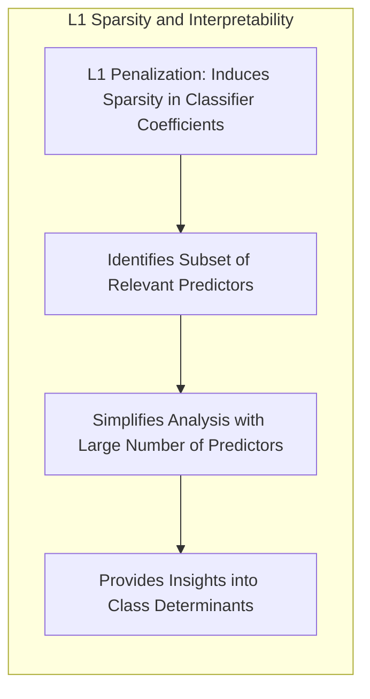
> ⚠️ **Ponto Crucial:** A regularização *Elastic Net*, que combina penalidades L1 e L2, possibilita simultaneamente selecionar variáveis relevantes e encolher os coeficientes, combinando as vantagens do lasso e do ridge [^4.5].

### Separating Hyperplanes e Perceptrons

A ideia de maximizar a margem de separação entre classes leva ao conceito de hiperplanos ótimos, que são fronteiras de decisão que buscam o máximo distanciamento em relação às observações de ambas as classes. A formulação do problema de otimização correspondente envolve encontrar os parâmetros que definem este hiperplano, usualmente utilizando a dualidade de Wolfe [^4.5.2]. As soluções do problema dual emergem como combinações lineares de pontos de suporte, que são as observações mais próximas da fronteira de decisão. O *Perceptron* de Rosenblatt é um algoritmo de aprendizado que busca encontrar um hiperplano separador. O Perceptron tem a propriedade de convergir sob certas condições, especialmente quando os dados são linearmente separáveis [^4.5.1].
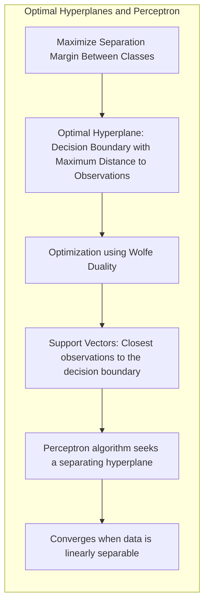

### Pergunta Teórica Avançada: Quais as diferenças fundamentais entre a formulação de LDA e a Regra de Decisão Bayesiana considerando distribuições Gaussianas com covariâncias iguais?

**Resposta:**

Sob a hipótese de distribuições Gaussianas com covariâncias iguais para cada classe, o LDA pode ser visto como uma aproximação da regra de decisão Bayesiana. A Regra de Decisão Bayesiana aloca uma observação para a classe que maximiza a probabilidade a posteriori, dada por:

$$
P(G=k|X=x) = \frac{P(X=x|G=k)P(G=k)}{\sum_{l=1}^{K} P(X=x|G=l)P(G=l)},
$$

onde $G$ é a variável de classe e $X$ é a observação. Se assumirmos que as classes seguem distribuições Gaussianas, com mesma matriz de covariância $\Sigma$ e médias $\mu_k$, a regra de decisão Bayesiana se torna:

$$
\delta_k(x) = x^T \Sigma^{-1} \mu_k - \frac{1}{2} \mu_k^T \Sigma^{-1} \mu_k + \log(P(G=k)).
$$

O LDA assume que as classes seguem distribuições Gaussianas com covariâncias iguais e estima $\mu_k$ e $\Sigma$ a partir dos dados. O LDA se torna equivalente à decisão Bayesiana quando as estimativas das médias e covariâncias se aproximam das verdadeiras médias e covariâncias da população [^4.3].
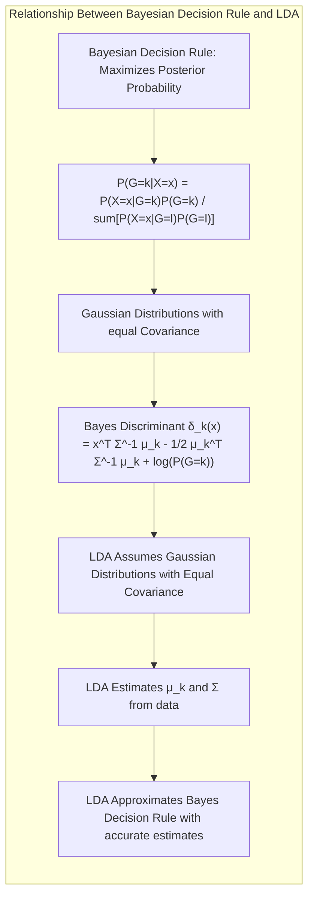

**Lemma 4: Equivalência entre LDA e Decisão Bayesiana com Covariâncias Iguais**
Quando as classes possuem distribuições Gaussianas com a mesma matriz de covariância $\Sigma$ (i.e., $\Sigma_1 = \Sigma_2 = \ldots = \Sigma_K = \Sigma$), a fronteira de decisão ótima (Bayesiana) entre as classes $k$ e $l$ pode ser expressa como um hiperplano linear. O LDA, ao assumir essa hipótese de covariância comum, busca encontrar um hiperplano de decisão linear que se aproxima dessa fronteira Bayesiana, tornando as duas abordagens equivalentes em termos da estrutura da decisão. Formalmente:

As funções discriminantes lineares do LDA podem ser escritas como:

$$
\delta_k(x) = x^T \hat{\Sigma}^{-1} \hat{\mu}_k - \frac{1}{2} \hat{\mu}_k^T \hat{\Sigma}^{-1} \hat{\mu}_k + \log(\pi_k),
$$

onde $\hat{\mu}_k$ e $\hat{\Sigma}$ são as médias e covariâncias estimadas a partir dos dados. Ao igualar $\delta_k(x)$ e $\delta_l(x)$ para duas classes $k$ e $l$  e sob a hipótese de covariância comum, obtém-se uma fronteira linear, similar ao obtido pela regra de decisão Bayesiana com covariâncias iguais [^4.3].$\blacksquare$
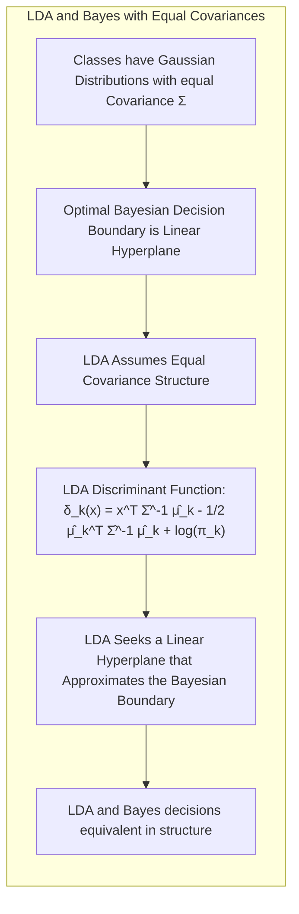

> 💡 **Exemplo Numérico:** Para ilustrar a relação entre LDA e a regra de decisão Bayesiana, vamos usar dados simulados de duas classes com distribuições gaussianas e a mesma matriz de covariância.
>
> ```python
> import numpy as np
> from sklearn.discriminant_analysis import LinearDiscriminantAnalysis
> from scipy.stats import multivariate_normal
> import matplotlib.pyplot as plt
>
> # Parâmetros das distribuições gaussianas
> mean1 = np.array([1, 1])
> mean2 = np.array([4, 4])
> cov = np.array([[1, 0.5], [0.5, 1]])
>
> # Gerar dados simulados
> np.random.seed(42)
> class1 = np.random.multivariate_normal(mean1, cov, 100)
> class2 = np.random.multivariate_normal(mean2, cov, 100)
>
> # Dados para o modelo LDA
> X = np.concatenate((class1, class2))
> y = np.concatenate((np.zeros(100), np.ones(100)))
>
> # Aplicando o LDA
> lda = LinearDiscriminantAnalysis()
> lda.fit(X, y)
>
> # Calculando os discriminantes LDA
> def lda_discriminant(x, lda):
>    return x.dot(lda.coef_.T) + lda.intercept_
>
> # Calculando as funções discriminantes bayesianas (estimando com a amostra)
> def bayesian_discriminant(x, mean1, mean2, cov, pi1, pi2):
>    inv_cov = np.linalg.inv(cov)
>    delta1 = x.dot(inv_cov.dot(mean1)) - 0.5 * mean1.dot(inv_cov.dot(mean1)) + np.log(pi1)
>    delta2 = x.dot(inv_cov.dot(mean2)) - 0.5 * mean2.dot(inv_cov.dot(mean2)) + np.log(pi2)
>    return delta1, delta2
>
> # Gerar pontos para plotar a fronteira de decisão
> x_min, x_max = X[:, 0].min() - 1, X[:, 0].max() + 1
> y_min, y_max = X[:, 1].min() - 1, X[:, 1].max() + 1
> xx, yy = np.meshgrid(np.linspace(x_min, x_max, 200), np.linspace(y_min, y_max, 200))
> Z_lda = [lda_discriminant(np.array([x, y]), lda)[0] for x,y in np.c_[xx.ravel(), yy.ravel()]]
> Z_lda = np.array(Z_lda).reshape(xx.shape)
>
> # Para a regra bayesiana, vamos usar estimadores para as médias e covariancias
> mean1_est = class1.mean(axis=0)
> mean2_est = class2.mean(axis=0)
> cov_est = np.cov(X.T)
> pi1 = 0.5 # Probabilidades iguais a priori
> pi2 = 0.5
>
> Z_bayes = [np.argmax(bayesian_discriminant(np.array([x, y]), mean1_est, mean2_est, cov_est, pi1, pi2))
>                for x, y in np.c_[xx.ravel(), yy.ravel()]]
> Z_bayes = np.array(Z_bayes).reshape(xx.shape)
>
> # Plot dos resultados
> plt.figure(figsize=(10, 5))
> plt.subplot(1,2,1)
> plt.contourf(xx, yy, Z_lda, levels=1, cmap=plt.cm.RdBu, alpha=0.5)
> plt.scatter(class1[:, 0], class1[:, 1], label='Classe 0')
> plt.scatter(class2[:, 0], class2[:, 1], label='Classe 1')
> plt.title("Fronteira de Decisão LDA")
> plt.legend()
>
> plt.