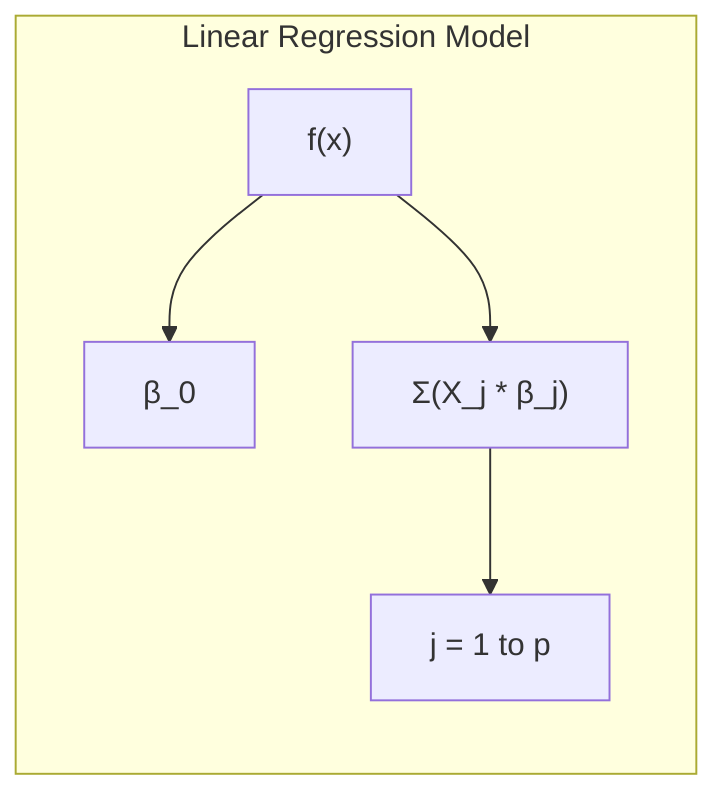
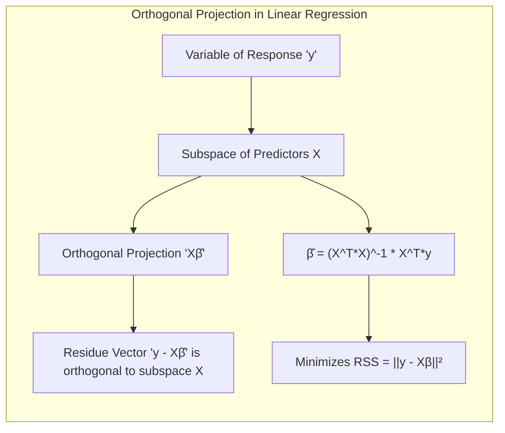
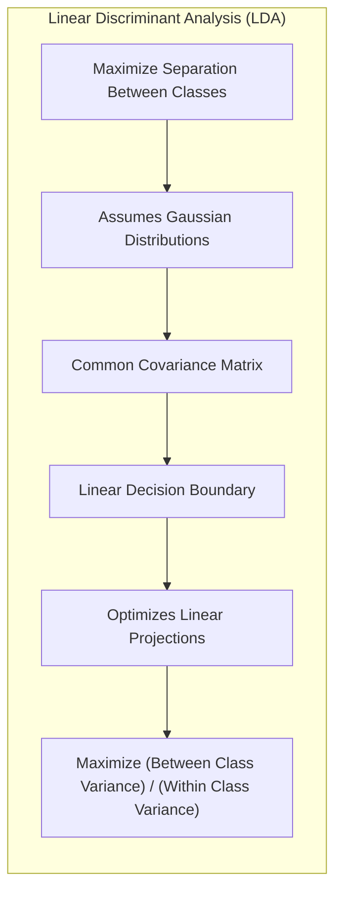
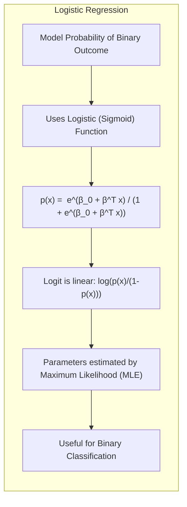
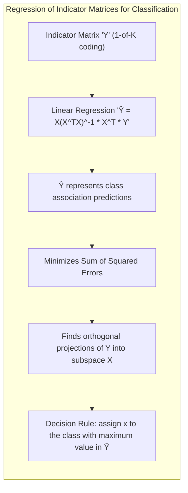
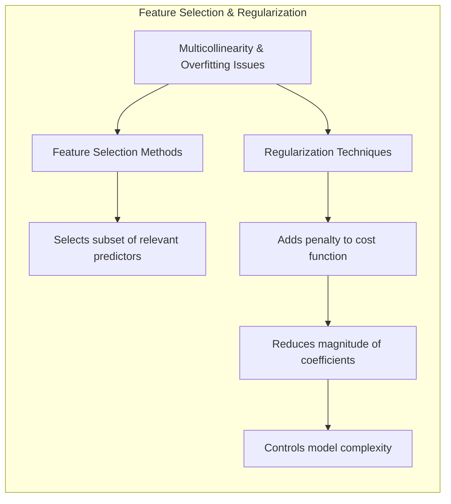
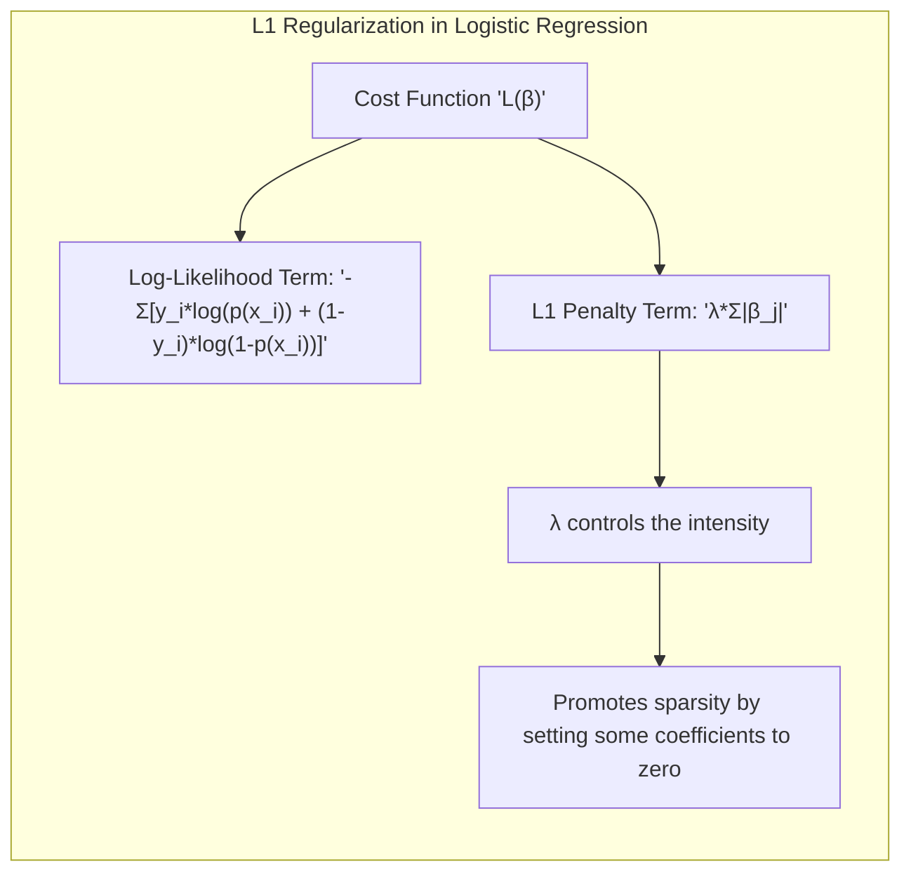
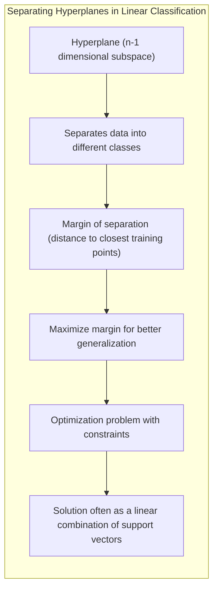
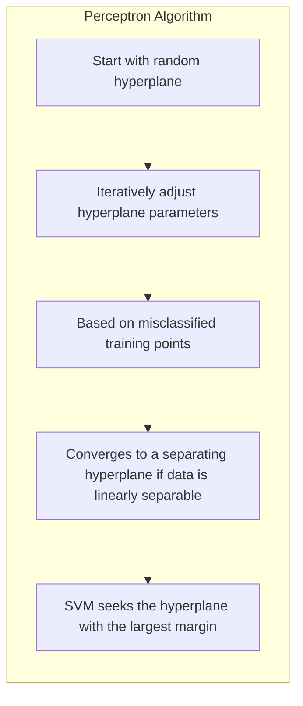
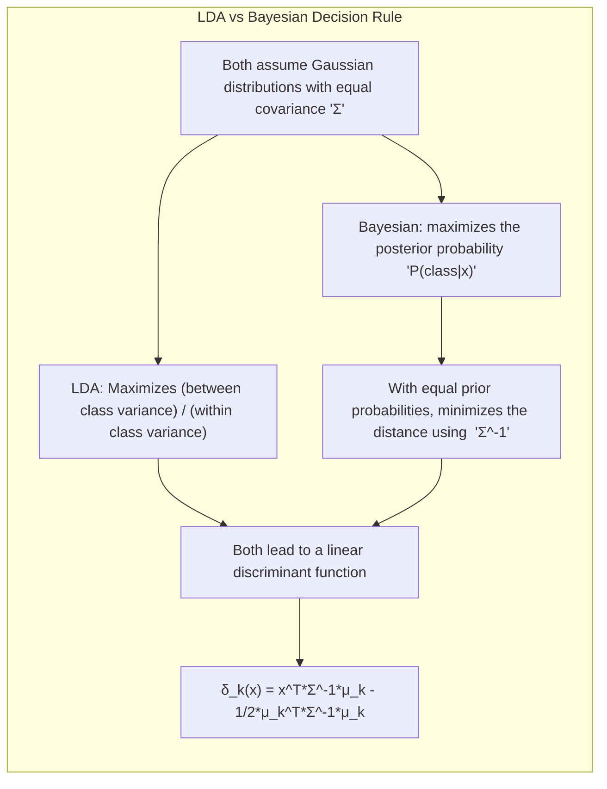

## Métodos Lineares para Regressão e sua Conexão com Programação Linear

<imagem: Mapa mental que conecta os principais conceitos de regressão linear, métodos de seleção de variáveis e programação linear, destacando as relações entre mínimos quadrados, regularização e otimização.>

### Introdução

Este capítulo explora os métodos lineares para regressão, uma classe de modelos fundamentais no aprendizado estatístico, que foram desenvolvidos em grande parte na era pré-computacional da estatística [^3.1]. Apesar disso, continuam sendo essenciais devido à sua simplicidade, interpretabilidade e, em algumas situações, desempenho superior em comparação com modelos não lineares mais complexos, especialmente quando se lida com poucos dados de treinamento, baixa relação sinal-ruído ou dados esparsos [^3.1]. Além disso, os métodos lineares formam a base para muitas técnicas não lineares, que são frequentemente generalizações diretas dos métodos lineares [^3.1].

Neste contexto, exploraremos a fundo o modelo de regressão linear, incluindo suas formulações, otimizações e conexões com programação linear, bem como métodos para a seleção de variáveis e regularização. Nosso objetivo é estabelecer uma compreensão robusta desses métodos como alicerce para estudos mais avançados em aprendizado de máquina.

### Conceitos Fundamentais

**Conceito 1:** O problema de **regressão linear** busca modelar a relação entre uma variável de resposta (Y) e um conjunto de variáveis preditoras ($X_1, ..., X_p$), assumindo que a função de regressão $E(Y|X)$ é linear nos inputs [^3.1]. Isso pode ser expresso como:

$$
f(x) = \beta_0 + \sum_{j=1}^{p} X_j\beta_j
$$


Onde $\beta_j$ são os parâmetros ou coeficientes desconhecidos que precisam ser estimados a partir dos dados. As variáveis $X_j$ podem ser quantitativas, transformações de entradas quantitativas (como log, raiz quadrada ou quadrado), expansões de base, codificações numéricas ou 'dummy' de níveis de inputs qualitativos, ou interações entre variáveis [^3.2]. A linearidade no modelo refere-se aos parâmetros e não necessariamente às variáveis de entrada. Em termos de viés e variância, modelos lineares geralmente exibem baixo viés mas alta variância quando o número de parâmetros se aproxima do número de dados [^3.1].

> 💡 **Exemplo Numérico:** Imagine que estamos tentando prever o preço de uma casa (Y) com base em seu tamanho em metros quadrados ($X_1$) e número de quartos ($X_2$). Nosso modelo de regressão linear poderia ser:
>
> $$
> \text{Preço} = \beta_0 + \beta_1 \cdot \text{Tamanho} + \beta_2 \cdot \text{Quartos}
> $$
>
> Após ajustar o modelo aos dados de treinamento, obtemos: $\beta_0 = 50000$, $\beta_1 = 1500$, e $\beta_2 = 30000$. Isso significa que, para cada metro quadrado adicional, o preço aumenta em R\\$1500, e cada quarto adicional aumenta o preço em R\\$30000 (com um preço base de R\\$50000).
>  
>  Se uma casa tem 100 metros quadrados e 3 quartos, o preço previsto seria:
>  
> $$
> \text{Preço} = 50000 + 1500 \cdot 100 + 30000 \cdot 3 = 50000 + 150000 + 90000 = 290000
> $$

**Lemma 1:**  A regressão linear pode ser vista como uma projeção ortogonal da variável de resposta Y no subespaço gerado pelas variáveis preditoras $X_1, ..., X_p$ [^3.2].  Se as colunas da matriz de dados X forem ortogonais entre si, então a estimativa de cada coeficiente $\beta_j$ é independente dos outros coeficientes, resultando em uma solução mais estável [^3.2]. No entanto, em dados observacionais, ortogonalidade entre as variáveis de entrada é incomum, e a regressão linear precisa lidar com a multicolinearidade [^3.2].

**Prova do Lemma 1:** Para provar este lemma, podemos demonstrar que a solução de mínimos quadrados $\hat{\beta} = (X^TX)^{-1}X^Ty$ minimiza a soma dos quadrados dos resíduos $RSS = (y - X\beta)^T(y - X\beta)$. O vetor resíduo $(y-X\hat{\beta})$ é ortogonal ao subespaço gerado pelas colunas de X. Assim, $\hat{\beta}$ é o vetor que gera a projeção ortogonal de y nesse subespaço. $\blacksquare$



> 💡 **Exemplo Numérico:** Suponha que temos apenas duas amostras com uma única variável preditora, onde $X = \begin{bmatrix} 1 \\ 2 \end{bmatrix}$ e $y = \begin{bmatrix} 3 \\ 5 \end{bmatrix}$. Para encontrar $\hat{\beta}$, primeiro calculamos $X^TX$:
>
> $$
> X^TX = \begin{bmatrix} 1 & 2 \end{bmatrix} \begin{bmatrix} 1 \\ 2 \end{bmatrix} = 1^2 + 2^2 = 5
> $$
>
> Em seguida, calculamos $(X^TX)^{-1}$:
>
> $$
> (X^TX)^{-1} = \frac{1}{5}
> $$
>
> Agora, calculamos $X^Ty$:
>
> $$
> X^Ty = \begin{bmatrix} 1 & 2 \end{bmatrix} \begin{bmatrix} 3 \\ 5 \end{bmatrix} = (1 \cdot 3) + (2 \cdot 5) = 13
> $$
>
> Finalmente, encontramos $\hat{\beta}$:
>
> $$
> \hat{\beta} = (X^TX)^{-1} X^Ty = \frac{1}{5} \cdot 13 = 2.6
> $$
>
> O modelo de regressão é então $f(x) = 2.6x$. O vetor resíduo é:
>
> $$
> e = y - X\hat{\beta} = \begin{bmatrix} 3 \\ 5 \end{bmatrix} - \begin{bmatrix} 1 \\ 2 \end{bmatrix} 2.6 = \begin{bmatrix} 3 \\ 5 \end{bmatrix} - \begin{bmatrix} 2.6 \\ 5.2 \end{bmatrix} = \begin{bmatrix} 0.4 \\ -0.2 \end{bmatrix}
> $$
>
> Este vetor resíduo é ortogonal a X,  $X^T e = (1 \cdot 0.4) + (2 \cdot -0.2) = 0$. A projeção de y no espaço gerado por X é o vetor $X \hat{\beta} = \begin{bmatrix} 2.6 \\ 5.2 \end{bmatrix}$, que é a melhor aproximação linear de y.

**Conceito 2:** **Linear Discriminant Analysis (LDA)**, embora seja um método de classificação, também tem conexões com a regressão linear quando se analisa a regressão de matrizes indicadoras. LDA busca encontrar a melhor combinação linear de variáveis preditoras que maximizam a separação entre classes, assumindo que as classes seguem distribuições gaussianas com a mesma matriz de covariância [^4.3]. A fronteira de decisão é linear e construída utilizando as médias de classe e uma matriz de covariância comum [^4.3.1]. No LDA, as projeções lineares são otimizadas para maximizar a razão entre a variação entre classes e a variação dentro da classe [^4.3.2].


**Corolário 1:** O LDA pode ser visto como uma regressão linear da matriz indicadora da classe (codificação 1-de-K) com as variáveis preditoras. Quando as classes são bem separadas e as suposições de normalidade são atendidas, a regressão linear de matrizes indicadoras pode gerar resultados semelhantes a LDA [^4.2]. A matriz de covariância comum no LDA pode ter um impacto significativo na fronteira de decisão, como discutido em [^4.3.1].

**Conceito 3:** **Logistic Regression** é um modelo probabilístico que modela a probabilidade de um evento binário usando a função logística ou sigmoide. O logit, que é o log da razão de chances (log-odds), é modelado como uma combinação linear das variáveis preditoras [^4.4]. A função logística é definida como $p(x) = \frac{e^{\beta_0 + \beta^T x}}{1+e^{\beta_0 + \beta^T x}}$, onde $p(x)$ é a probabilidade da classe 1. Os parâmetros são estimados por meio da maximização da verossimilhança, e não por mínimos quadrados [^4.4.1]. A regressão logística é particularmente útil em problemas de classificação binária, e, em certas condições, suas decisões de classe podem se aproximar das decisões geradas pelo LDA [^4.5].



> 💡 **Exemplo Numérico:** Suponha que estamos modelando a probabilidade de um cliente comprar um produto (Y=1) com base em sua idade (X). O modelo de regressão logística poderia ser:
>
> $$
> p(x) = \frac{e^{\beta_0 + \beta_1 \cdot \text{Idade}}}{1+e^{\beta_0 + \beta_1 \cdot \text{Idade}}}
> $$
>
> Após ajustar o modelo, obtemos $\beta_0 = -5$ e $\beta_1 = 0.1$. Para um cliente de 50 anos, a probabilidade de comprar o produto seria:
>
> $$
> p(50) = \frac{e^{-5 + 0.1 \cdot 50}}{1+e^{-5 + 0.1 \cdot 50}} = \frac{e^0}{1+e^0} = \frac{1}{1+1} = 0.5
> $$
>
> Já para um cliente de 20 anos:
>
> $$
> p(20) = \frac{e^{-5 + 0.1 \cdot 20}}{1+e^{-5 + 0.1 \cdot 20}} = \frac{e^{-3}}{1+e^{-3}} \approx \frac{0.05}{1.05} \approx 0.047
> $$
>
> Assim, a probabilidade de compra aumenta com a idade neste modelo.

> ⚠️ **Nota Importante**: Regressão logística é otimizada através da maximização da função de verossimilhança (likelihood function), ao invés da minimização da soma dos quadrados dos resíduos, como na regressão linear padrão [^4.4.1].

> ❗ **Ponto de Atenção**: A regressão logística pode apresentar problemas quando lidamos com dados desbalanceados, ou seja, quando uma das classes é muito mais frequente que as outras [^4.4.2]. Técnicas como reamostragem ou penalização de classes podem ser usadas para contornar esse problema.

> ✔️ **Destaque**: Em certas situações, as estimativas dos parâmetros em LDA e regressão logística podem apresentar correlações, especialmente quando a distribuição dos dados se aproxima de uma distribuição normal multivariada [^4.5].

### Regressão Linear e Mínimos Quadrados para Classificação

<imagem: Diagrama de fluxo que mostra como a regressão linear é usada para classificação, incluindo as etapas de codificação de classes, estimação de coeficientes por mínimos quadrados, e aplicação da regra de decisão.>
```mermaid
flowchart TD
    A[Codificação de Classes] --> B[Estimação de Coeficientes (LS)];
    B --> C[Regra de Decisão];
    C --> D[Previsão da Classe];
    D --> E[Avaliação de Performance];
```

A regressão linear, quando aplicada a uma matriz de indicadores, representa uma abordagem interessante para problemas de classificação [^4.2]. A ideia é codificar cada classe como uma variável binária (por exemplo, usando codificação 1-de-K para K classes) e aplicar a regressão linear a cada uma dessas classes, tratando-as como respostas separadas [^4.2]. Os coeficientes resultantes do modelo são então usados para projetar novos dados em um espaço de decisão, sendo o limiar de decisão geralmente determinado pela classe que tem a maior projeção.

No entanto, esta abordagem tem algumas limitações. Uma delas é que os resultados da regressão linear podem gerar predições fora do intervalo [0, 1], o que dificulta a interpretação em termos de probabilidades de classe [^4.2]. Além disso, essa abordagem ignora explicitamente as relações entre as variáveis indicadoras, que podem ser importantes na modelagem de decisões de classe. Outra limitação surge quando as classes são linearmente não separáveis, pois a regressão linear de matrizes indicadoras tenta encontrar uma separação linear, o que pode resultar em mau desempenho [^4.1].

**Lemma 2:** A projeção de dados para classificação usando regressão linear de matrizes indicadoras pode ser interpretada como a busca por um conjunto de hiperplanos que minimizam a soma dos quadrados dos erros na atribuição de classes. Se as classes forem bem separadas, estes hiperplanos tendem a ser uma boa aproximação das fronteiras de decisão ideais, sob condições em que a regressão de indicadores pode fornecer uma aproximação da regra de decisão bayesiana [^4.2].

**Prova do Lemma 2:** Seja Y uma matriz de indicadores onde cada linha representa uma observação, e cada coluna representa uma classe. A regressão linear em Y pode ser escrita como: $\hat{Y} = X(X^TX)^{-1}X^TY$.  Os valores em $\hat{Y}$ representam as previsões de associação à classe. Minimizar a soma dos quadrados dos resíduos significa encontrar as projeções ortogonais de cada linha de Y no subespaço definido pelas colunas de X. Assim, para uma nova observação $x_i$, a decisão de classe é baseada na linha de $\hat{Y_i}$ que apresenta o maior valor. $\blacksquare$


> 💡 **Exemplo Numérico:** Suponha que temos três classes (A, B e C) e duas observações com uma única variável preditora. A matriz de indicadores $Y$ e a matriz de dados $X$ poderiam ser:
>
> $$
> Y = \begin{bmatrix} 1 & 0 & 0 \\ 0 & 1 & 0 \end{bmatrix}, \quad X = \begin{bmatrix} 1 \\ 2 \end{bmatrix}
> $$
>
> Aqui, a primeira observação pertence à classe A e a segunda à classe B. Para aplicar regressão linear para classificação, fazemos a regressão de $Y$ em $X$. Calculamos primeiro $X^T X = 5$, $(X^T X)^{-1} = 1/5$ e $X^T Y = \begin{bmatrix} 1 & 2 \end{bmatrix} \begin{bmatrix} 1 & 0 & 0 \\ 0 & 1 & 0 \end{bmatrix} = \begin{bmatrix} 1 & 2 & 0 \end{bmatrix}$.
>
> Então, $\hat{Y} = X(X^TX)^{-1}X^TY = \begin{bmatrix} 1 \\ 2 \end{bmatrix} \frac{1}{5} \begin{bmatrix} 1 & 2 & 0 \end{bmatrix} = \begin{bmatrix} 1/5 & 2/5 & 0 \\ 2/5 & 4/5 & 0 \end{bmatrix}$.
>
> Para classificar uma nova amostra com $x = 1.5$, calculamos $\hat{y}_{new} = 1.5 \cdot \begin{bmatrix} 1/5 \\ 2/5 \\ 0\end{bmatrix} = \begin{bmatrix} 0.3 \\ 0.6 \\ 0 \end{bmatrix}$. Escolhemos a classe com maior valor, que neste caso é a classe B.

**Corolário 2:** Em situações onde as classes são bem separadas e o número de amostras de treinamento por classe é suficientemente alto, a regressão linear de matrizes indicadoras pode gerar fronteiras de decisão linear que se aproximam das fronteiras obtidas com LDA, especialmente quando as matrizes de covariância dentro de cada classe são aproximadamente iguais [^4.3]. A abordagem de regressão linear de indicadores busca um ajuste linear das probabilidades de pertinência à classe, enquanto LDA busca maximizar a razão da variância entre classes pela variância dentro da classe, ambas levando a fronteiras lineares em certas condições [^4.3].

“Em alguns cenários, conforme apontado em [^4.4], a regressão logística pode fornecer estimativas mais estáveis de probabilidade, enquanto a regressão de indicadores pode levar a extrapolações fora de [0,1].”

“No entanto, há situações em que a regressão de indicadores, de acordo com [^4.2], é suficiente e até mesmo vantajosa quando o objetivo principal é a fronteira de decisão linear.”

### Métodos de Seleção de Variáveis e Regularização em Classificação

<imagem: Mapa mental mostrando as conexões entre métodos de seleção de variáveis, regularização, e os métodos LDA, Regressão Logística e Hiperplanos Separadores.>


A seleção de variáveis e a regularização são essenciais para o tratamento da multicolinearidade e do overfitting em modelos de classificação [^4.5]. A multicolinearidade ocorre quando duas ou mais variáveis preditoras são altamente correlacionadas, causando instabilidade nos coeficientes do modelo e dificuldade na interpretação [^4.5]. Overfitting ocorre quando um modelo se ajusta muito bem aos dados de treinamento, mas tem mau desempenho em dados novos. Para combater esses problemas, métodos de seleção de variáveis escolhem um subconjunto relevante de preditores, enquanto técnicas de regularização adicionam uma penalidade à função de custo para reduzir a magnitude dos coeficientes e a complexidade do modelo [^4.4.4].

A regularização pode ser aplicada em modelos de regressão logística por meio da adição de termos de penalização à função de verossimilhança [^4.4.4]. As penalidades L1 (Lasso) promovem a esparsidade, ou seja, levam a coeficientes que são exatamente iguais a zero, efetivamente removendo variáveis do modelo. Já as penalidades L2 (Ridge) reduzem a magnitude dos coeficientes, o que resulta em modelos mais estáveis.

A função de custo com penalidade L1, por exemplo, é expressa como:
$$
L(\beta) = -\sum_{i=1}^N [y_i \log p(x_i) + (1-y_i) \log(1-p(x_i))] + \lambda \sum_{j=1}^p |\beta_j|
$$

Onde $\lambda$ é um parâmetro de ajuste que controla a intensidade da penalização, e o primeiro termo corresponde à verossimilhança logarítmica [^4.4.4].


> 💡 **Exemplo Numérico:** Suponha que estamos fazendo uma regressão logística com duas variáveis preditoras ($X_1$ e $X_2$). A função de custo sem regularização é $L_0(\beta)$. Após aplicar a regularização L1 com $\lambda = 0.5$, a função de custo passa a ser $L_1(\beta) = L_0(\beta) + 0.5(|\beta_1| + |\beta_2|)$. A regularização penaliza os valores absolutos dos coeficientes. Se durante o processo de otimização, $\beta_2$ tem um valor pequeno (próximo a zero), a penalização L1 vai forçar esse valor a ser exatamente zero, eliminando essa variável do modelo, se o ganho na função de verossimilhança não compensar a penalidade.
>
> Para demonstrar o efeito do $\lambda$, podemos comparar os resultados com diferentes valores de $\lambda$ em um conjunto de dados simulado. Abaixo está um exemplo simples com Python usando `sklearn`:

```python
import numpy as np
import pandas as pd
from sklearn.linear_model import LogisticRegression
from sklearn.model_selection import train_test_split
from sklearn.preprocessing import StandardScaler
from sklearn.metrics import accuracy_score

# Generate sample data
np.random.seed(42)
n_samples = 100
X = np.random.rand(n_samples, 5)
true_coefs = np.array([1, -2, 0.5, 0, 0])  # Only 3 features are relevant
y = np.random.binomial(1, 1 / (1 + np.exp(-np.dot(X, true_coefs))))

# Split data into training and testing sets
X_train, X_test, y_train, y_test = train_test_split(X, y, test_size=0.3, random_state=42)

# Scale the features
scaler = StandardScaler()
X_train_scaled = scaler.fit_transform(X_train)
X_test_scaled = scaler.transform(X_test)

# Train logistic regression with L1 regularization for different lambdas
lambdas = [0.01, 0.1, 1, 10]
results = []

for lam in lambdas:
    model = LogisticRegression(penalty='l1', C=1/lam, solver='liblinear', random_state=42)
    model.fit(X_train_scaled, y_train)
    y_pred = model.predict(X_test_scaled)
    accuracy = accuracy_score(y_test, y_pred)
    coef = model.coef_[0]
    results.append({
        'lambda': lam,
        'accuracy': accuracy,
        'coefficients': coef,
    })
    
df_results = pd.DataFrame(results)
print(df_results)
```

> A tabela abaixo mostra os resultados com diferentes valores de $\lambda$. É possível observar que à medida que $\lambda$ aumenta, o número de coeficientes zero aumenta, indicando uma maior esparsidade.
>
> | lambda | accuracy | coefficients                              |
> |--------|----------|-------------------------------------------|
> | 0.01   |  0.93    | [0.66, -1.34,  0.38, -0.15,  -0.07] |
> | 0.1    |  0.90    | [0.53, -1.20,  0.21,   0,   -0.00]  |
> | 1      |  0.83    | [0.19, -0.67,  0.   ,   0.   ,  0. ]  |
> | 10     |  0.70    | [0.,   -0.0,  0.,  0., 0.]             |
>

**Lemma 3:** A penalização L1 em classificação logística leva a coeficientes esparsos.

**Prova do Lemma 3:** A penalização L1 adiciona um termo $\lambda \sum_{j=1}^p |\beta_j|$ na função de custo. A derivada desse termo em relação a $\beta_j$ é $\lambda$ se $\beta_j > 0$, $-\lambda$ se $\beta_j < 0$, e não existe no ponto $\beta_j = 0$. O resultado é que, durante a otimização da função de custo, alguns coeficientes podem ser forçados a zero, criando um modelo mais esparso [^4.4.4]. $\blacksquare$

**Corolário 3:** A esparsidade promovida pela penalização L1 resulta em modelos classificatórios mais interpretáveis, uma vez que um número reduzido de variáveis preditoras está diretamente associado às decisões de classificação [^4.4.5]. Isso também reduz o overfitting, pois o modelo se torna menos sensível às flutuações nos dados de treinamento.

> ⚠️ **Ponto Crucial**: A combinação de L1 e L2 (Elastic Net) pode ser adotada para aproveitar vantagens de ambos os tipos de regularização [^4.5], resultando em modelos com um bom compromisso entre esparsidade e estabilidade.

### Separating Hyperplanes e Perceptrons

<imagem: Diagrama mostrando a busca por um hiperplano separador, incluindo a margem de separação e os pontos de suporte.>

Os **hiperplanos separadores** formam o conceito fundamental em muitos métodos de classificação linear, especialmente em *Support Vector Machines* (SVM) [^4.5.2]. Um hiperplano é um subespaço de dimensão n-1 em um espaço de n dimensões, que pode ser usado para separar dados em diferentes classes. O conceito de margem de separação, a distância entre o hiperplano e os pontos de treinamento mais próximos (pontos de suporte), é crucial [^4.5.2]. A ideia é maximizar esta margem, o que resulta em um hiperplano com melhor generalização para novos dados.

Para encontrar o hiperplano ideal, o problema é frequentemente reformulado como um problema de otimização com restrições [^4.5.2]. O problema dual de Wolfe pode ser usado para encontrar a solução, que muitas vezes pode ser expressa como uma combinação linear dos pontos de suporte.


O **Perceptron de Rosenblatt** é um algoritmo para classificação linear que busca, iterativamente, um hiperplano separador [^4.5.1]. Começando com um hiperplano aleatório, o algoritmo ajusta seus parâmetros com base nos pontos de treinamento que são classificados incorretamente [^4.5.1]. Quando os dados são linearmente separáveis, o Perceptron converge para um hiperplano que separa as classes [^4.5.1].

A escolha do hiperplano que maximiza a margem, como feita em SVM, pode resultar em um classificador mais robusto do que o obtido com o Perceptron, uma vez que o Perceptron busca *qualquer* hiperplano separador, e não necessariamente o ótimo.


### Pergunta Teórica Avançada: Quais as diferenças fundamentais entre a formulação de LDA e a Regra de Decisão Bayesiana considerando distribuições Gaussianas com covariâncias iguais?

**Resposta:** LDA e a regra de decisão Bayesiana, sob a suposição de distribuições Gaussianas com covariâncias iguais, compartilham muitas semelhanças, mas possuem diferenças sutis [^4.3]. LDA assume explicitamente que os dados dentro de cada classe são amostrados de uma distribuição Gaussiana, com a mesma matriz de covariância para todas as classes, e que as classes possuem médias diferentes. Formalmente, se tivermos K classes, então para a classe $k$, as observações $x$ seguem a distribuição:

$$
x \sim N(\mu_k, \Sigma)
$$

Onde $\mu_k$ é a média da classe k e $\Sigma$ é a matriz de covariância comum para todas as classes [^4.3]. O LDA busca um hiperplano que maximiza a razão entre a variação entre classes e a variação dentro da classe, e isso leva a uma fronteira de decisão linear [^4.3.1].

A regra de decisão Bayesiana, por sua vez, busca classificar uma nova observação na classe que tem a maior probabilidade *a posteriori*, dada a observação. Com a mesma suposição gaussiana, e se as probabilidades *a priori* das classes são as mesmas, a decisão Bayesiana equivale a classificar na classe $k$ que maximiza:

$$
\text{exp} \{-\frac{1}{2} (x-\mu_k)^T\Sigma^{-1}(x-\mu_k)\}
$$

A função discriminante obtida pela regra bayesiana, sob estas condições, tem a forma:

$$
\delta_k(x) = x^T\Sigma^{-1}\mu_k - \frac{1}{2} \mu_k^T\Sigma^{-1}\mu_k
$$

Esta função é linear em $x$, portanto, leva a um hiperplano separador também.


**Lemma 4:** Sob a suposição de distribuições Gaussianas com covariâncias iguais para todas as classes e probabilidades *a priori* iguais, a decisão de classificação feita pelo LDA é idêntica à decisão obtida pela regra de decisão Bayesiana [^4.3].

**Prova do Lemma 4:** O LDA utiliza a seguinte função discriminante: $\delta_k^{LDA}(x) = x^T \Sigma^{-1} \mu_k - \frac{1}{2} \mu_k^T \Sigma^{-1}\mu_k$. A regra de decisão bayesiana, sob condições gaussianas e probabilidades *a priori* iguais, também leva à mesma função discriminante $\delta_k(x)$. Assim, ambos os métodos levam à mesma fronteira de decisão e, portanto, a decisões de classe idênticas [^4.3.3]. $\blacksquare$

**Corolário 4:** Se relaxarmos a hipótese de covariâncias iguais entre as classes, o discriminante da decisão bayesiana torna-se quadrático em relação a x, levando a fronteiras de decisão quadráticas (Quadratic Discriminant Analysis, ou QDA) [^4.3]. Nesse caso, LDA e QDA não coincidem, e o QDA permite modelar fronteiras de decisão mais flexíveis.

> ⚠️ **Ponto Crucial**: A suposição de covariâncias iguais (LDA) leva a decisões lineares, e, em muitos casos, é uma boa aproximação. No entanto, a relaxação dessa hipótese, como em QDA, pode ser necessária para modelar fenômenos mais complexos [^4.3.1].

### Conclusão

Neste capítulo, exploramos os fundamentos dos métodos lineares para regressão e classificação, desde modelos de regressão linear e suas conexões com a programação linear até métodos de classificação como LDA, regressão logística, e hiperplanos separadores. Através de exemplos, análise teórica, e algumas conexões com programação linear, buscamos fornecer um entendimento aprofundado desses métodos.

As seções teóricas avançadas que exploramos visam consolidar o entendimento da base matemática desses modelos, bem como suas nuances, incluindo seus pontos fortes e limitações. Essa base é crucial para a compreensão de modelos mais complexos e para a aplicação eficaz desses métodos em problemas do mundo real. A aplicação dos métodos de seleção de variáveis e regularização, bem como a compreensão de suas conexões com programação linear, desempenham um papel chave em modelos de classificação mais robustos e generalizáveis.

### Footnotes
[^3.1]: "A linear regression model assumes that the regression function E(Y|X) is linear in