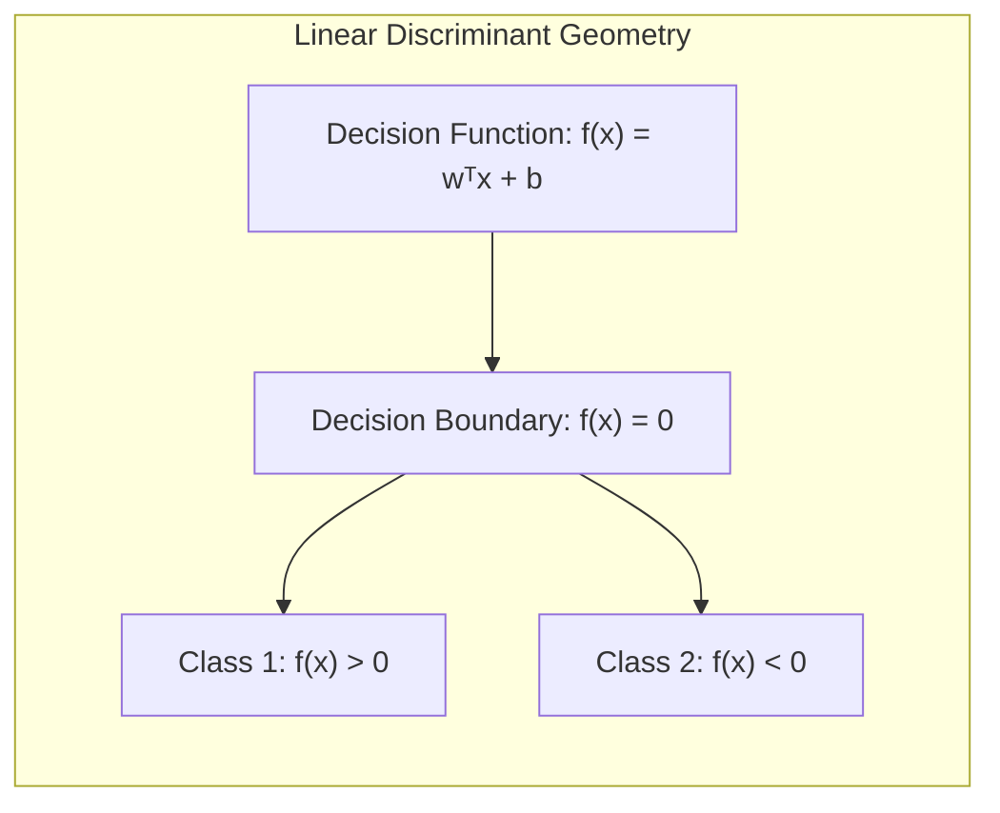
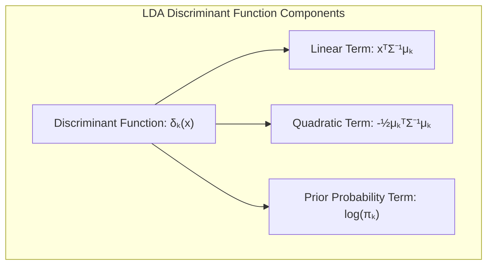
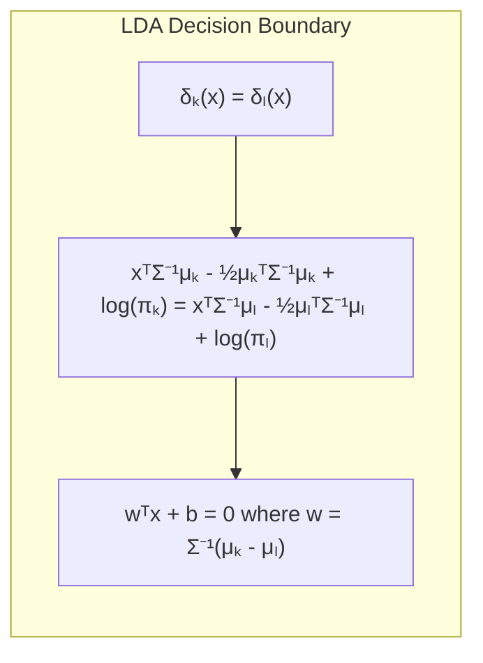
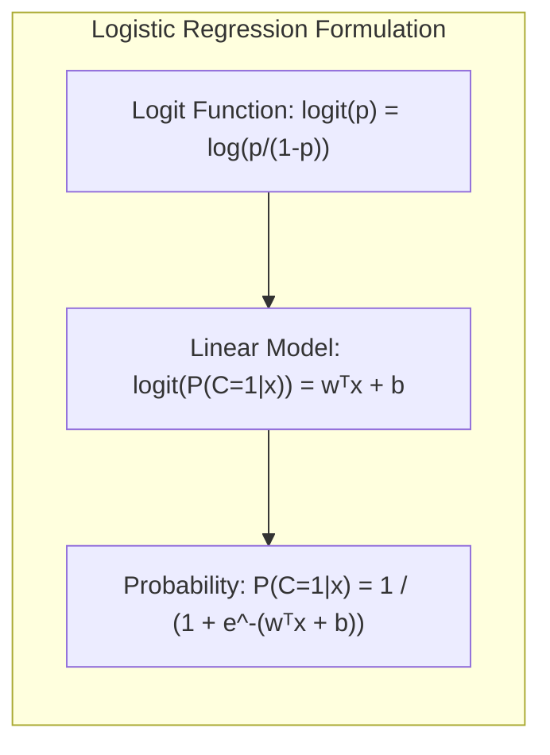
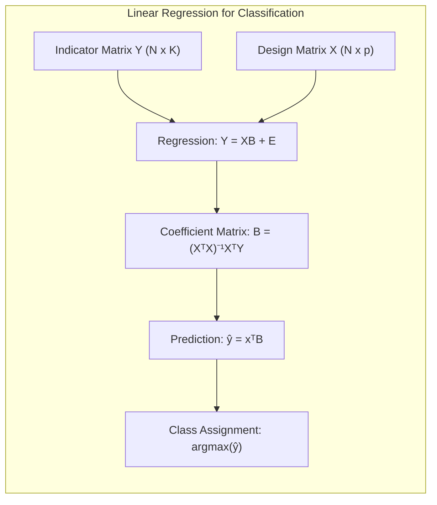
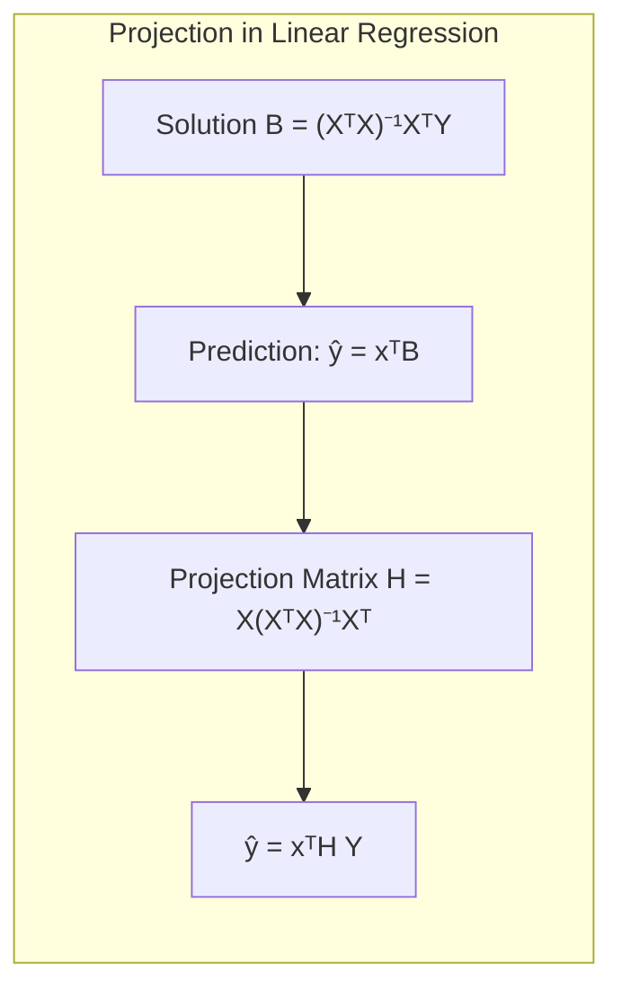
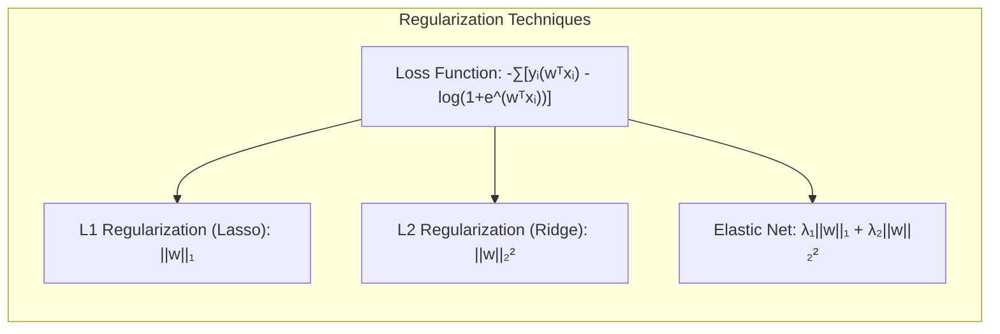

## Classificação e Análise Discriminante: Questões Práticas
<imagem: Um diagrama de fluxo complexo mostrando os diferentes passos para a seleção e avaliação de modelos de classificação, incluindo a preparação dos dados, seleção de variáveis, ajuste do modelo e validação. Este diagrama incluiria todos os tópicos principais discutidos nas seções 4.1 a 4.5.2, criando um guia visual abrangente.>

### Introdução
A classificação, como um dos pilares do aprendizado de máquina, aborda o desafio de atribuir rótulos de classe a instâncias com base em um conjunto de características. Em contraste com a regressão, que se concentra na previsão de valores contínuos, a classificação lida com a previsão de categorias discretas [^4.1]. A análise discriminante, especificamente, é uma família de técnicas que busca projetar dados em um espaço de dimensão inferior, preservando o máximo possível a separação entre as classes [^4.3]. Este capítulo explora a fundo os aspectos práticos desses métodos lineares, abordando desde a modelagem inicial até a seleção de variáveis e otimização de modelos.

### Conceitos Fundamentais
A seguir, aprofundaremos os conceitos essenciais que sustentam as abordagens lineares para classificação, com foco em seus fundamentos estatísticos e matemáticos.

**Conceito 1:** O problema de classificação envolve a alocação de uma observação $\mathbf{x}$ a uma das $K$ classes pré-definidas, $C_1, C_2, ..., C_K$. O objetivo é aprender uma função discriminante $f(\mathbf{x})$ que atribua a $\mathbf{x}$ a classe apropriada com a maior precisão possível. Métodos lineares buscam construir fronteiras de decisão lineares no espaço de características [^4.1]. No entanto, a escolha de um modelo linear implica em um trade-off entre viés e variância. Modelos simples têm um viés maior, devido à sua incapacidade de capturar relações complexas nos dados, mas sua variância é menor, o que significa que eles são menos sensíveis a pequenas alterações nos dados de treinamento. A escolha adequada depende da natureza dos dados e do problema em questão. Por exemplo, dados altamente não-lineares exigirão, potencialmente, abordagens não-lineares ou pré-processamento dos dados.

> 💡 **Exemplo Numérico:** Imagine um cenário onde estamos classificando imagens de frutas em "maçãs" e "laranjas" usando apenas duas características: "cor média" (em uma escala de 0 a 1, com 0 sendo vermelho e 1 sendo amarelo) e "formato" (uma medida de circularidade, com 0 sendo não circular e 1 sendo perfeitamente circular). Um modelo linear simples pode definir uma linha de decisão:
> $f(\mathbf{x}) = w_1 \cdot \text{cor média} + w_2 \cdot \text{formato} + b$
> Se os pesos forem $w_1 = -2$, $w_2 = 1$ e $b=0.5$,  a linha de decisão seria $-2\cdot \text{cor média} + 1 \cdot \text{formato} + 0.5 = 0$.
>
> Uma maçã com "cor média"=0.2 e "formato"=0.7 teria $f(\mathbf{x}) = -2 \cdot 0.2 + 1 \cdot 0.7 + 0.5 = 0.8$, sendo classificada como "laranja" (considerando que $f(x) > 0$). Uma laranja com "cor média"=0.8 e "formato"=0.9 teria $f(\mathbf{x}) = -2 \cdot 0.8 + 1 \cdot 0.9 + 0.5 = -0.2$, sendo classificada como "maçã" (considerando que $f(x) < 0$).
>
>  Um modelo linear pode ter dificuldades se maçãs e laranjas tivessem uma mistura mais complexa de cores e formatos, por exemplo, existissem maçãs amarelas e laranjas mais avermelhadas, o que ilustra o trade-off entre viés (modelo simples) e variância (sensibilidade a variações nos dados).

**Lemma 1:** *Em um problema de classificação binária, um discriminante linear $f(\mathbf{x}) = \mathbf{w}^T\mathbf{x} + b$ define um hiperplano de decisão onde $f(\mathbf{x}) = 0$. Todas as observações com $f(\mathbf{x}) > 0$ são classificadas em uma classe, e as observações com $f(\mathbf{x}) < 0$ são classificadas na outra classe.* Essa representação geométrica facilita a compreensão da separação entre classes e da influência dos parâmetros $\mathbf{w}$ e $b$. Prova: Seja o espaço de entrada de dimensão $p$. Um hiperplano no espaço $p$-dimensional é definido pela equação $ \mathbf{w}^T\mathbf{x} + b = 0$. Qualquer ponto $\mathbf{x}$ que satisfaça essa equação está no hiperplano. Pontos com $f(\mathbf{x}) > 0$ estão em um lado do hiperplano e pontos com $f(\mathbf{x}) < 0$ estão do outro lado. Se $\mathbf{w}$ e $b$ são definidos a partir de um modelo de classificação, os lados do hiperplano correspondem às classes previstas. $\blacksquare$

**Conceito 2:** A **Linear Discriminant Analysis (LDA)** é uma técnica clássica para classificação que faz uso das informações estatísticas dos dados para construir fronteiras de decisão. A LDA assume que as classes possuem uma distribuição normal multivariada com a mesma matriz de covariância, ou seja, $\Sigma_1 = \Sigma_2 = ... = \Sigma_K = \Sigma$ [^4.3]. A função discriminante para a classe $k$ é dada por:

$$
\delta_k(\mathbf{x}) = \mathbf{x}^T \Sigma^{-1}\mathbf{\mu_k} - \frac{1}{2}\mathbf{\mu_k}^T \Sigma^{-1} \mathbf{\mu_k} + \log\pi_k
$$

onde $\mathbf{\mu_k}$ é o vetor médio da classe $k$, $\Sigma$ é a matriz de covariância comum e $\pi_k$ é a probabilidade *a priori* da classe $k$. A LDA busca projetar os dados em um espaço de dimensão inferior maximizando a separação entre as classes. A fronteira de decisão entre duas classes $k$ e $l$ é um hiperplano onde $\delta_k(\mathbf{x}) = \delta_l(\mathbf{x})$. A LDA requer o cálculo das médias de cada classe, a matriz de covariância comum e as probabilidades *a priori*, e os estimadores são obtidos a partir dos dados de treinamento [^4.3.1], [^4.3.2], [^4.3.3].

> 💡 **Exemplo Numérico:** Suponha que temos duas classes, $C_1$ e $C_2$, com as seguintes estatísticas calculadas a partir dos dados de treinamento:
>
> - $\mathbf{\mu_1} = \begin{bmatrix} 1 \\ 2 \end{bmatrix}$ (média da classe 1)
> - $\mathbf{\mu_2} = \begin{bmatrix} 3 \\ 1 \end{bmatrix}$ (média da classe 2)
> - $\Sigma = \begin{bmatrix} 1 & 0.5 \\ 0.5 & 1 \end{bmatrix}$ (matriz de covariância comum)
> - $\pi_1 = 0.6$ (probabilidade *a priori* da classe 1)
> - $\pi_2 = 0.4$ (probabilidade *a priori* da classe 2)
>
> E um novo ponto a ser classificado: $\mathbf{x} = \begin{bmatrix} 2 \\ 2 \end{bmatrix}$
>
> Primeiro, calculamos a inversa da matriz de covariância:
>
> $\Sigma^{-1} = \frac{1}{(1*1 - 0.5*0.5)} \begin{bmatrix} 1 & -0.5 \\ -0.5 & 1 \end{bmatrix} = \begin{bmatrix} 1.33 & -0.66 \\ -0.66 & 1.33 \end{bmatrix}$
>
> Agora, calculamos as funções discriminantes para cada classe:
>
> $\delta_1(\mathbf{x}) = \mathbf{x}^T \Sigma^{-1}\mathbf{\mu_1} - \frac{1}{2}\mathbf{\mu_1}^T \Sigma^{-1} \mathbf{\mu_1} + \log\pi_1$
>
> $\delta_1(\mathbf{x}) = \begin{bmatrix} 2 & 2 \end{bmatrix} \begin{bmatrix} 1.33 & -0.66 \\ -0.66 & 1.33 \end{bmatrix} \begin{bmatrix} 1 \\ 2 \end{bmatrix}  - \frac{1}{2}\begin{bmatrix} 1 & 2 \end{bmatrix} \begin{bmatrix} 1.33 & -0.66 \\ -0.66 & 1.33 \end{bmatrix} \begin{bmatrix} 1 \\ 2 \end{bmatrix} + \log(0.6)$
>
> $\delta_1(\mathbf{x}) =  \begin{bmatrix} 2 & 2 \end{bmatrix} \begin{bmatrix} 0.67 \\ 2 \end{bmatrix} - \frac{1}{2}\begin{bmatrix} 1 & 2 \end{bmatrix} \begin{bmatrix} 0.67 \\ 2 \end{bmatrix} + \log(0.6)$
>
> $\delta_1(\mathbf{x}) = 5.34 - \frac{1}{2}(4.67) + (-0.51) \approx 2.5$
>
> Calculamos $\delta_2(\mathbf{x})$ da mesma forma:
>
> $\delta_2(\mathbf{x}) = \begin{bmatrix} 2 & 2 \end{bmatrix} \begin{bmatrix} 1.33 & -0.66 \\ -0.66 & 1.33 \end{bmatrix} \begin{bmatrix} 3 \\ 1 \end{bmatrix}  - \frac{1}{2}\begin{bmatrix} 3 & 1 \end{bmatrix} \begin{bmatrix} 1.33 & -0.66 \\ -0.66 & 1.33 \end{bmatrix} \begin{bmatrix} 3 \\ 1 \end{bmatrix} + \log(0.4)$
>
> $\delta_2(\mathbf{x}) \approx  \begin{bmatrix} 2 & 2 \end{bmatrix} \begin{bmatrix} 3.33 \\ -1.33 \end{bmatrix}  - \frac{1}{2}\begin{bmatrix} 3 & 1 \end{bmatrix} \begin{bmatrix} 3.33 \\ -1.33 \end{bmatrix} + (-0.92) = 4 - \frac{1}{2}(8.67) -0.92 \approx -1.25$
>
> Como $\delta_1(\mathbf{x}) > \delta_2(\mathbf{x})$, o ponto $\mathbf{x}$ é classificado como pertencente à classe $C_1$.

**Corolário 1:** A fronteira de decisão na LDA é um hiperplano. A prova decorre da igualdade de $\delta_k(\mathbf{x})$ e $\delta_l(\mathbf{x})$ para classes $k$ e $l$:
$$
\mathbf{x}^T \Sigma^{-1}\mathbf{\mu_k} - \frac{1}{2}\mathbf{\mu_k}^T \Sigma^{-1} \mathbf{\mu_k} + \log\pi_k = \mathbf{x}^T \Sigma^{-1}\mathbf{\mu_l} - \frac{1}{2}\mathbf{\mu_l}^T \Sigma^{-1} \mathbf{\mu_l} + \log\pi_l
$$
Reorganizando os termos, obtemos uma equação linear na forma $\mathbf{w}^T\mathbf{x} + b = 0$, onde $\mathbf{w} = \Sigma^{-1}(\mathbf{\mu_k} - \mathbf{\mu_l})$ e $b = -\frac{1}{2}(\mathbf{\mu_k}^T \Sigma^{-1} \mathbf{\mu_k} - \mathbf{\mu_l}^T \Sigma^{-1} \mathbf{\mu_l}) + \log(\pi_k/\pi_l)$, o que demonstra que a fronteira de decisão é um hiperplano [^4.3.1].

**Conceito 3:** A **Regressão Logística** é um método amplamente utilizado para problemas de classificação binária, que modela a probabilidade de uma observação pertencer a uma determinada classe usando uma função logística [^4.4]. Ao contrário da LDA, a regressão logística não faz suposições sobre as distribuições dos dados de entrada, mas sim modela a probabilidade de uma classe. A função *logit* ou *log-odds*, $\text{logit}(p) = \log(\frac{p}{1-p})$, transforma a probabilidade $p$ para um espaço que pode ser modelado linearmente:
$$
\text{logit}[P(C=1|\mathbf{x})] = \mathbf{w}^T\mathbf{x} + b
$$

onde $P(C=1|\mathbf{x})$ é a probabilidade da observação $\mathbf{x}$ pertencer à classe 1, $\mathbf{w}$ são os coeficientes do modelo e $b$ é o intercepto. A probabilidade é então expressa como:

$$
P(C=1|\mathbf{x}) = \frac{1}{1+e^{-(\mathbf{w}^T\mathbf{x}+b)}}
$$

Os parâmetros $\mathbf{w}$ e $b$ são estimados através da maximização da função de verossimilhança (likelihood) [^4.4.1], [^4.4.2], [^4.4.3]. A regressão logística é mais flexível que LDA, mas geralmente menos eficiente com classes bem separadas [^4.5].

> 💡 **Exemplo Numérico:** Suponha que após treinar um modelo de regressão logística, obtivemos os seguintes parâmetros: $\mathbf{w} = \begin{bmatrix} 0.5 \\ -1 \end{bmatrix}$ e $b = 0.2$. Considere um ponto de dados $\mathbf{x} = \begin{bmatrix} 2 \\ 1 \end{bmatrix}$.
>
> 1. Calculamos a pontuação linear:
> $\mathbf{w}^T\mathbf{x} + b =  \begin{bmatrix} 0.5 & -1 \end{bmatrix} \begin{bmatrix} 2 \\ 1 \end{bmatrix} + 0.2 = 0.5 * 2 + (-1) * 1 + 0.2 = 1 - 1 + 0.2 = 0.2$
>
> 2. Calculamos a probabilidade usando a função sigmóide:
>
> $P(C=1|\mathbf{x}) = \frac{1}{1+e^{-0.2}} \approx \frac{1}{1+0.8187} \approx \frac{1}{1.8187} \approx 0.55$
>
>
> Isso significa que a probabilidade de $\mathbf{x}$ pertencer à classe 1 é de aproximadamente 55%. Se o limiar de decisão for 0.5, então o ponto $\mathbf{x}$ seria classificado na classe 1. Se o limiar fosse maior, digamos 0.6, o ponto seria classificado na classe 0.
>
> O log-odds seria:
>
> $\text{logit}(0.55) = \log(\frac{0.55}{1-0.55}) = \log(\frac{0.55}{0.45}) \approx \log(1.22) \approx 0.2$, que é o resultado da pontuação linear $\mathbf{w}^T\mathbf{x} + b$

> ⚠️ **Nota Importante**: Em problemas com classes não-balanceadas, é crucial ajustar a função de perda na regressão logística ou usar técnicas de reamostragem para evitar que o modelo seja tendencioso para a classe majoritária [^4.4.2].

> ❗ **Ponto de Atenção**: Tanto LDA quanto Regressão Logística são métodos lineares, o que significa que as fronteiras de decisão são hiperplanos no espaço de características. Isso limita a capacidade desses modelos de classificar dados que possuem relações não lineares entre as variáveis e a classe de saída.

> ✔️ **Destaque**: Ambos LDA e Regressão Logística estão intimamente relacionadas: LDA deriva as suas fronteiras de decisão das estatísticas descritivas das classes (médias e covariâncias) enquanto a regressão logística modela a probabilidade diretamente usando a função logística.

### Regressão Linear e Mínimos Quadrados para Classificação
<imagem: Diagrama que demonstra o processo de regressão de uma matriz de indicadores para classificação. O diagrama começa com um conjunto de dados de entrada com múltiplas classes, mostra a transformação dessas classes em uma matriz de indicadores, depois aplica a regressão linear para obter coeficientes e, finalmente, usa os coeficientes para decidir a classe com base na pontuação predita. As setas indicam o fluxo do processo, e os rótulos explicam cada passo. Diagrama semelhante ao abaixo, mas com mais detalhes>

A regressão linear, apesar de ser originalmente concebida para problemas de regressão, também pode ser aplicada para tarefas de classificação através da codificação de classes usando uma matriz de indicadores [^4.2]. Em uma matriz de indicadores, cada coluna representa uma classe, com '1' indicando a pertença à classe e '0' caso contrário. Este processo transforma um problema de classificação em um de regressão múltipla, onde cada resposta (coluna da matriz de indicadores) é prevista. Dado um conjunto de dados com $N$ observações e $K$ classes, a matriz de indicadores $Y$ terá dimensão $N \times K$.

Seja $\mathbf{X}$ a matriz de design dos preditores ($N \times p$), e $\mathbf{Y}$ a matriz de indicadores ($N \times K$). O modelo de regressão linear é expresso como:
$$
\mathbf{Y} = \mathbf{X} \mathbf{B} + \mathbf{E}
$$
Onde $\mathbf{B}$ é a matriz de coeficientes ($p \times K$) e $\mathbf{E}$ é a matriz de erros. A solução para $\mathbf{B}$ usando mínimos quadrados é dada por:
$$
\mathbf{B} = (\mathbf{X}^T\mathbf{X})^{-1} \mathbf{X}^T \mathbf{Y}
$$
Após obter a matriz $\mathbf{B}$, a previsão de um novo ponto $\mathbf{x}$ é feita calculando $\hat{\mathbf{y}} = \mathbf{x}^T \mathbf{B}$, e a classe atribuída é a que corresponde à maior componente de $\hat{\mathbf{y}}$.

> 💡 **Exemplo Numérico:**  Vamos criar um exemplo simples com 3 observações e 2 classes, onde cada observação tem duas características. Suponha que a matriz de design $\mathbf{X}$ e a matriz de indicadores $\mathbf{Y}$ são:
>
> $\mathbf{X} = \begin{bmatrix} 1 & 2 \\ 2 & 1 \\ 3 & 3 \end{bmatrix}$ , $\mathbf{Y} = \begin{bmatrix} 1 & 0 \\ 0 & 1 \\ 1 & 0 \end{bmatrix}$
>
> Adicionamos uma coluna de 1s para o termo independente da regressão,
> $\mathbf{X} = \begin{bmatrix} 1 & 1 & 2 \\ 1 & 2 & 1 \\ 1 & 3 & 3 \end{bmatrix}$
>
>
>
> 1.  Calculamos $\mathbf{X}^T\mathbf{X}$:
>
>  $\mathbf{X}^T\mathbf{X} = \begin{bmatrix} 1 & 1 & 1 \\ 1 & 2 & 3 \\ 2 & 1 & 3 \end{bmatrix} \begin{bmatrix} 1 & 1 & 2 \\ 1 & 2 & 1 \\ 1 & 3 & 3 \end{bmatrix} = \begin{bmatrix} 3 & 6 & 6 \\ 6 & 14 & 13 \\ 6 & 13 & 14 \end{bmatrix}$
>
> 2.  Calculamos a inversa de $\mathbf{X}^T\mathbf{X}$:
>
> $(\mathbf{X}^T\mathbf{X})^{-1} \approx \begin{bmatrix} 1.8 & -0.6 & -0.6 \\ -0.6 & 0.8 & 0.1 \\ -0.6 & 0.1 & 0.8 \end{bmatrix}$
>
> 3. Calculamos $\mathbf{X}^T\mathbf{Y}$:
>
> $\mathbf{X}^T\mathbf{Y} = \begin{bmatrix} 1 & 1 & 1 \\ 1 & 2 & 3 \\ 2 & 1 & 3 \end{bmatrix} \begin{bmatrix} 1 & 0 \\ 0 & 1 \\ 1 & 0 \end{bmatrix} = \begin{bmatrix} 2 & 1 \\ 4 & 2 \\ 5 & 1 \end{bmatrix}$
>
> 4.  Calculamos a matriz de coeficientes $\mathbf{B}$:
>
> $\mathbf{B} = (\mathbf{X}^T\mathbf{X})^{-1} \mathbf{X}^T \mathbf{Y} \approx \begin{bmatrix} 1.8 & -0.6 & -0.6 \\ -0.6 & 0.8 & 0.1 \\ -0.6 & 0.1 & 0.8 \end{bmatrix} \begin{bmatrix} 2 & 1 \\ 4 & 2 \\ 5 & 1 \end{bmatrix} = \begin{bmatrix} 0.0 & 0.0 \\ 0.1 & 0.6 \\ 0.8 & -0.2 \end{bmatrix}$
>
> Para classificar um novo ponto, por exemplo $\mathbf{x} = \begin{bmatrix} 2 & 2 \end{bmatrix}$, adicionamos um 1 na primeira posição: $\mathbf{x} = \begin{bmatrix} 1 & 2 & 2 \end{bmatrix}$.
>  Calculamos $\hat{\mathbf{y}} = \mathbf{x}^T \mathbf{B}$:
>
> $\hat{\mathbf{y}} = \begin{bmatrix} 1 & 2 & 2 \end{bmatrix} \begin{bmatrix} 0.0 & 0.0 \\ 0.1 & 0.6 \\ 0.8 & -0.2 \end{bmatrix} = \begin{bmatrix} 1.8 & 0.8 \end{bmatrix}$
>
> A maior componente de $\hat{\mathbf{y}}$ é 1.8, correspondendo à classe 1, o que significa que o ponto $\mathbf{x}$ seria classificado na classe 1.

**Lemma 2:** *A solução para a regressão linear sobre uma matriz de indicadores é equivalente à projeção de cada ponto no espaço de classes.* Prova: Dada a solução $\mathbf{B} = (\mathbf{X}^T\mathbf{X})^{-1} \mathbf{X}^T \mathbf{Y}$, a previsão de um ponto $\mathbf{x}$ é dada por $\hat{\mathbf{y}} = \mathbf{x}^T \mathbf{B} = \mathbf{x}^T (\mathbf{X}^T\mathbf{X})^{-1} \mathbf{X}^T \mathbf{Y}$. Seja $\mathbf{H} = \mathbf{X}(\mathbf{X}^T\mathbf{X})^{-1} \mathbf{X}^T$ a matriz de projeção. Então $\hat{\mathbf{y}} = \mathbf{x}^T \mathbf{H} \mathbf{Y}$, que mostra que a previsão é o resultado de uma projeção de $\mathbf{x}$ em $\mathbf{H}$ seguida pela aplicação da matriz de indicadores $\mathbf{Y}$. $\blacksquare$

**Corolário 2:** Se as classes são perfeitamente separáveis por um hiperplano, a regressão linear com matriz de indicadores também encontra os mesmos hiperplanos de separação que discriminantes lineares, sob certas condições (como quando as classes não são muito sobrepostas), e a solução do problema de regressão se torna uma solução do problema de classificação. Este corolário liga a regressão linear ao problema de classificação quando condições de separabilidade são satisfeitas [^4.3].

Apesar de sua simplicidade, a regressão linear para classificação apresenta algumas limitações. Primeiro, as previsões não são probabilidades no intervalo [0,1], podendo levar a valores fora desse intervalo. Segundo, a regressão linear não leva em conta a estrutura específica dos dados de classificação e pode apresentar um desempenho inferior a outros métodos mais adequados, como a regressão logística ou LDA. Uma das principais limitações é o "masking problem", em que uma classe pode ser encoberta pela outra devido à projeção linear, especialmente em problemas com classes muito sobrepostas [^4.3]. No entanto, em casos onde as classes são aproximadamente lineares e bem separadas, a regressão linear pode ser uma opção rápida e razoável.

"Em alguns cenários, conforme apontado em [^4.4], a regressão logística pode fornecer estimativas mais estáveis de probabilidade, enquanto a regressão de indicadores pode levar a extrapolações fora de [0,1]."

"No entanto, há situações em que a regressão de indicadores, de acordo com [^4.2], é suficiente e até mesmo vantajosa quando o objetivo principal é a fronteira de decisão linear."

### Métodos de Seleção de Variáveis e Regularização em Classificação
<imagem: Um mapa mental que conecta os métodos de seleção de variáveis e regularização em modelos de classificação. No centro, há o tópico central "Seleção de Variáveis e Regularização". A partir dele, surgem ramificações para "Regularização L1 (Lasso)", "Regularização L2 (Ridge)", "Regularização Elastic Net", "Seleção de Variáveis por Penalização" e "Impacto na Interpretabilidade". Cada ramificação inclui explicações concisas sobre cada método e seu impacto na classificação. As setas indicam a relação entre os conceitos.>

Na prática, muitos conjuntos de dados apresentam alta dimensionalidade, e muitas das variáveis podem não contribuir para a classificação ou até mesmo levar a overfitting. A seleção de variáveis e regularização são técnicas essenciais para lidar com esse desafio, melhorando a interpretabilidade e o desempenho dos modelos [^4.5]. A **regularização** adiciona um termo de penalidade à função de perda do modelo, que controla a complexidade do modelo, e a **seleção de variáveis** seleciona as variáveis mais relevantes para um modelo de classificação, simplificando-o e melhorando a sua generalização.

A **regularização L1 (Lasso)** adiciona uma penalidade baseada na soma dos valores absolutos dos coeficientes, ou seja, $||w||_1 = \sum_{j=1}^{p}|w_j|$, na função de custo [^4.4.4]. Essa penalidade tem a propriedade de promover coeficientes esparsos, ou seja, alguns coeficientes se tornam exatamente iguais a zero, levando à seleção automática de variáveis. O problema de otimização é expresso como:

$$
\text{minimize} \quad -\frac{1}{N} \sum_{i=1}^{N} [y_i(\mathbf{w}^T \mathbf{x_i}) - \log(1 + e^{\mathbf{w}^T \mathbf{x_i}})] + \lambda \sum_{j=1}^{p}|w_j|
$$

onde $\lambda$ é um parâmetro de ajuste que controla a intensidade da penalidade. Em contrapartida, a **regularização L2 (Ridge)** adiciona uma penalidade baseada na soma dos quadrados dos coeficientes, ou seja, $||w||_2^2 = \sum_{j=1}^{p}w_j^2$ [^4.5]. Esta penalidade não promove a esparsidade dos coeficientes, mas sim reduz seus valores, levando a modelos mais estáveis. O problema de otimização é similar ao anterior, exceto que a penalidade é dada por:

$$
 \text{minimize} \quad -\frac{1}{N} \sum_{i=1}^{N} [y_i(\mathbf{w}^T \mathbf{x_i}) - \log(1 + e^{\mathbf{w}^T \mathbf{x_i}})] + \lambda \sum_{j=1}^{p}w_j^2
$$
A **Regularização Elastic Net** combina as penalidades L1 e L2 em um único modelo, visando aproveitar as propriedades de ambas [^4.5]:
$$
 \text{minimize} \quad -\frac{1}{N} \sum_{i=1}^{N} [y_i(\mathbf{w}^T \mathbf{x_i}) - \log(1 + e^{\mathbf{w}^T \mathbf{x_i}})] + \lambda_1 \sum_{j=1}^{p}|w_j| + \lambda_2 \sum_{j=1}^{p}w_j^2
$$

onde $\lambda_1$ e $\lambda_2$ são parâmetros que controlam as intensidades das penalidades L1 e L2.

> 💡 **Exemplo Numérico:** Suponha que estamos usando regressão logística para classificar clientes como "churn" (1) ou "não-churn" (0) com base em 5 características: "idade", "tempo de contrato", "número de produtos", "total gasto" e "reclamações". O modelo com regularização L1 pode apresentar os seguintes coeficientes:
>
> - Modelo sem regularização: $\mathbf{w} = [0.01, 0.2, 0.15, 0.005, -0.3]$
> - Modelo com regularização L1 (Lasso) com $\lambda = 0.1$: $\mathbf{w} = [0, 0.15, 0, 0, -0.2]$
> - Modelo com regularização L2 (Ridge) com $\lambda = 0.1$: $\mathbf{w} = [0.009, 0.18, 0.13, 0.004, -0.27]$
>
> A penalização L1 zerou os coeficientes de "idade", "número de produtos", e "total gasto", selecionando apenas "tempo de contrato" e "reclamações" como preditores relevantes. O modelo L2 reduziu os coeficientes de todas as variáveis.
>
> Uma possível interpretação é que o tempo de contrato e as reclamações são os fatores mais preditivos para o churn, enquanto a idade, o número de produtos e o total gasto têm um impacto menor na decisão de churn. Isto demonstra como a regularização L1 pode simplificar o modelo, eliminando as variáveis de menor importância.

**Lemma 3:** *A penalidade L1 em modelos de classificação logística leva a coeficientes esparsos*. Prova: Ao adicionar a penalidade L1 à função de custo, o modelo tende a minimizar a função de custo e a norma L1 dos coeficientes simultaneamente. A penalidade L1 tem "cantos" em zero que levam alguns coeficientes a serem exatamente iguais a zero. Isso