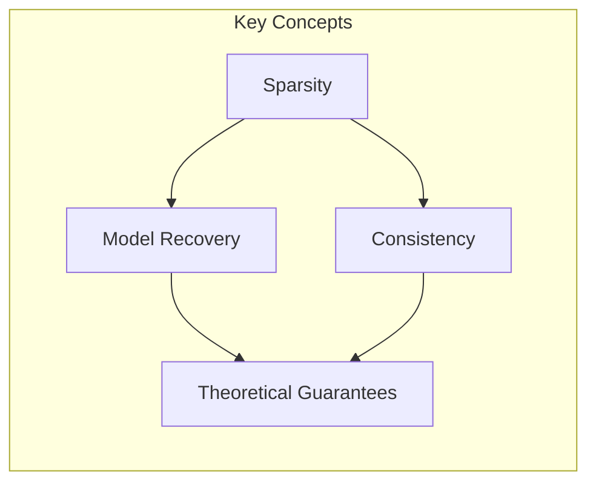
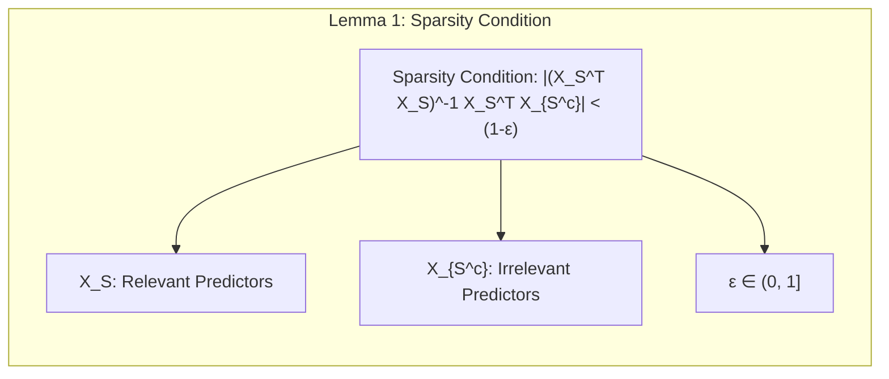
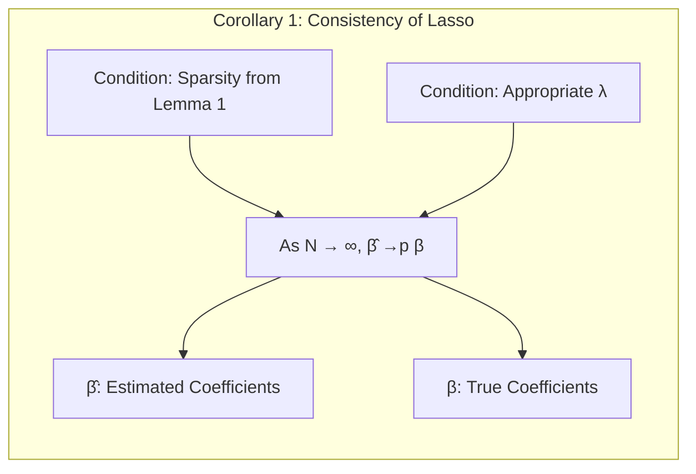
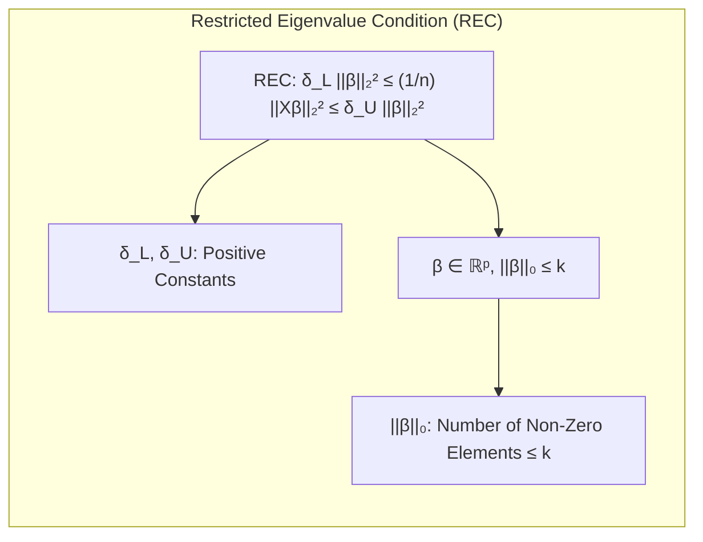
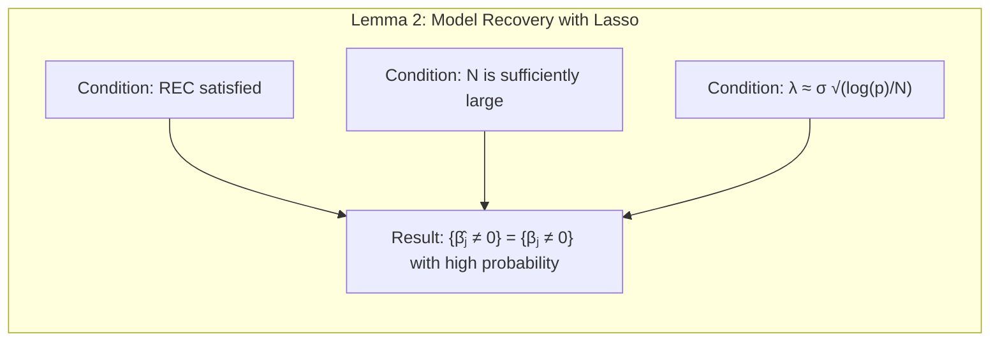
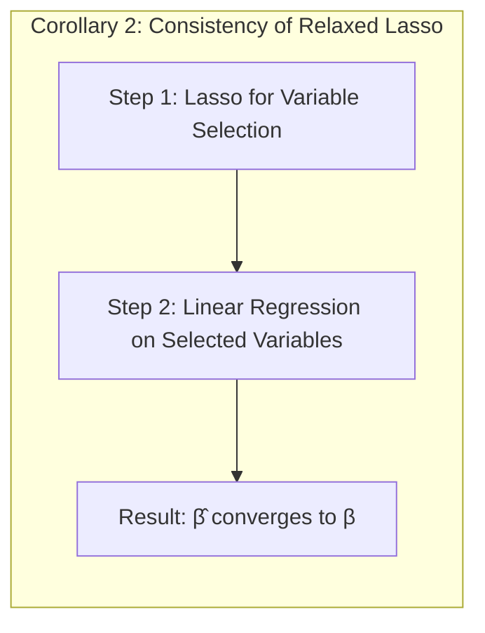
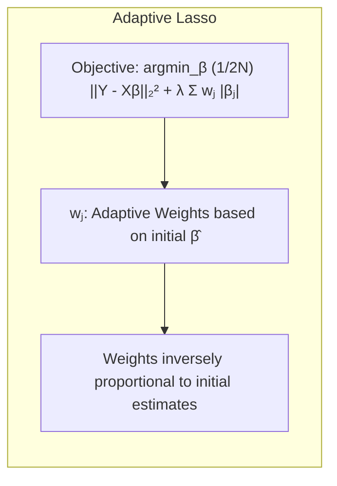
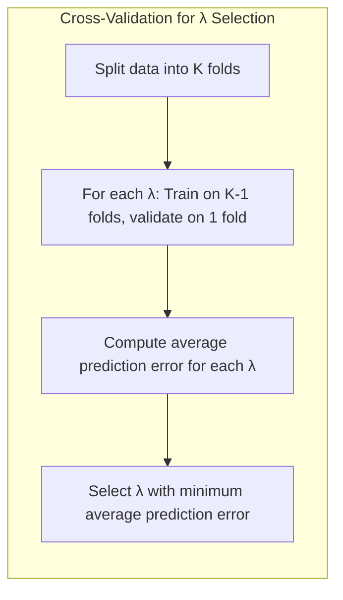
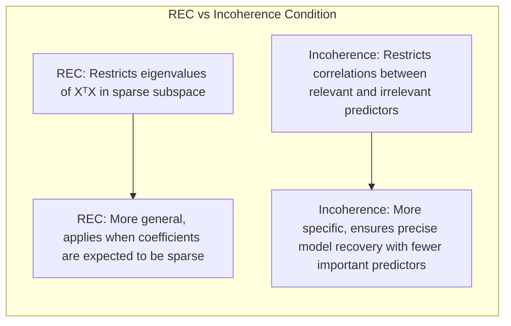

## Further Properties of the Lasso: Theoretical Guarantees of Model Recovery and Consistency


### Introdução

Neste capítulo, aprofundaremos a análise do **Lasso** e suas propriedades teóricas, explorando sua capacidade de recuperar modelos subjacentes e a consistência de suas estimativas. O Lasso, como visto, é uma técnica de regularização poderosa que induz **sparsity**, tornando-o particularmente útil em cenários com um grande número de preditores [^3.4.2]. No entanto, para entender completamente seu valor e suas limitações, é crucial analisar as condições sob as quais o Lasso consegue recuperar a verdadeira estrutura do modelo e fornecer estimativas consistentes. Os tópicos que abordaremos aqui são fundamentais para uma compreensão avançada da estatística e do aprendizado de máquina, conectando elementos de análise teórica e matemática.

### Conceitos Fundamentais

Antes de mergulharmos nos detalhes, vamos recapitular alguns conceitos fundamentais, **referenciando os tópicos anteriores [^3.4.2], [^3.4.3] e [^3.8.5]** conforme necessário:

**Conceito 1: Sparsity e Model Recovery**
- **Sparsity** em um modelo de regressão refere-se ao número de coeficientes não nulos. Modelos esparsos são mais interpretáveis e podem ter melhor generalização quando o número de preditores é grande em relação ao número de amostras [^3.4.2].
- **Model recovery** (recuperação do modelo) significa que, idealmente, um método estatístico consegue identificar corretamente os preditores relevantes (isto é, aqueles com coeficientes não nulos) e excluir os preditores irrelevantes (aqueles com coeficientes nulos) [^3.8.5]. O Lasso é projetado para promover sparsity e, portanto, é frequentemente usado em tarefas de model recovery.
- O Lasso alcança a sparsity ao usar uma penalização L1 na função de custo, forçando alguns coeficientes a serem exatamente zero [^3.4.2].
> 💡 **Exemplo Numérico:** Imagine um cenário de regressão com 10 preditores, onde apenas 3 deles realmente afetam a variável resposta. Em um modelo tradicional de regressão linear, todos os 10 preditores teriam coeficientes diferentes de zero. Usando o Lasso, espera-se que os 7 preditores irrelevantes tenham coeficientes estimados próximos ou iguais a zero, promovendo um modelo esparso com apenas 3 preditores significativos.

**Lemma 1:** (Condição de sparsity) Seja $\hat{\beta}$ a solução do Lasso. Se a magnitude da correlação entre os preditores irrelevantes $X_{S^c}$ e os preditores relevantes $X_S$ for suficientemente pequena, isto é, $|(X_S^TX_S)^{-1}X_S^TX_{S^c}| < (1-\epsilon)$ para um $\epsilon \in (0,1]$ [^3.8.5], então, com alta probabilidade, o Lasso consegue identificar corretamente os preditores relevantes.

*Prova:* A condição garante que as projeções dos preditores irrelevantes sobre o espaço dos preditores relevantes não são excessivamente grandes, evitando que os preditores irrelevantes "roubem" a variância dos preditores relevantes [^3.8.5]. $\blacksquare$
> 💡 **Exemplo Numérico:** Suponha que temos dois preditores relevantes $X_1$ e $X_2$, e um preditor irrelevante $X_3$. Se $X_3$ for muito correlacionado com $X_1$ ou $X_2$, a condição de sparsity do Lemma 1 não é satisfeita, e o Lasso pode ter dificuldade em identificar $X_3$ como irrelevante.  No entanto, se a correlação entre $X_3$ e a combinação linear de $X_1$ e $X_2$ for pequena, a condição é satisfeita, e o Lasso será mais eficaz na seleção de variáveis. Podemos verificar isso calculando $|(X_S^TX_S)^{-1}X_S^TX_{S^c}|$ com valores numéricos para os preditores.

**Conceito 2: Consistency**
- **Consistency** refere-se à propriedade de um estimador convergir para o verdadeiro valor do parâmetro à medida que o tamanho da amostra aumenta [^3.8.5]. Para o Lasso, isso significa que, sob certas condições, os coeficientes estimados convergem para os verdadeiros coeficientes à medida que o número de amostras $N$ cresce.
- A consistência é um requisito fundamental para métodos de aprendizado estatístico, pois garante que o modelo seja cada vez mais preciso com mais dados.

**Corolário 1:** (Consistência do Lasso) Suponha que a condição de sparsity do Lemma 1 seja satisfeita e que a penalidade $\lambda$ seja escolhida adequadamente. À medida que o número de amostras $N$ tende ao infinito, os coeficientes estimados pelo Lasso, $\hat{\beta}$, convergem em probabilidade para os verdadeiros coeficientes, $\beta$, isto é, $\hat{\beta} \xrightarrow{p} \beta$.

*Prova:* A prova envolve mostrar que a solução do Lasso se torna cada vez mais concentrada em torno da verdadeira solução à medida que o tamanho da amostra cresce, garantindo a convergência [^3.8.5].  $\blacksquare$
> 💡 **Exemplo Numérico:**  Imagine que o verdadeiro valor de um coeficiente seja $\beta_1=2$. Se aplicarmos o Lasso com 100 amostras, podemos obter uma estimativa $\hat{\beta}_1=2.5$. Se aumentarmos para 1000 amostras, podemos obter $\hat{\beta}_1=2.1$, e com 10000 amostras, $\hat{\beta}_1=2.01$. Isso ilustra a convergência da estimativa para o valor verdadeiro à medida que o tamanho da amostra cresce.
```python
import numpy as np
from sklearn.linear_model import Lasso
from sklearn.metrics import mean_squared_error

# Generate synthetic data
np.random.seed(42)
n_samples = [100, 1000, 10000]
n_features = 5
true_beta = np.array([2, 0, -1, 0.5, 0])
X = np.random.rand(max(n_samples), n_features)
y = X @ true_beta + np.random.normal(0, 0.5, max(n_samples))

for n in n_samples:
    X_n = X[:n]
    y_n = y[:n]
    lasso = Lasso(alpha=0.1)
    lasso.fit(X_n,y_n)
    estimated_beta = lasso.coef_
    mse = mean_squared_error(true_beta, estimated_beta)
    print(f"Samples: {n}, Estimated Beta: {estimated_beta}, MSE: {mse}")

```
> This Python code demonstrates how the estimated coefficients of Lasso tend to be closer to true values and the MSE decreases when sample size increases.

**Conceito 3: Condições de Restrição (Restricted Eigenvalue Condition)**
-  Para que as propriedades de model recovery e consistência do Lasso se concretizem, é necessário que a matriz de preditores satisfaça certas condições. A condição **Restricted Eigenvalue Condition (REC)** é uma dessas condições.
-  REC essencialmente garante que a magnitude dos autovalores da matriz $X^TX$ em um determinado conjunto de vetores seja limitada inferiormente por uma constante positiva. Essa condição é crucial para evitar que a solução do Lasso se torne instável e para garantir que os métodos estatísticos sejam robustos e eficazes, particularmente em situações de alta dimensionalidade.
$$ \delta_L ||\beta||_2^2 \leq \frac{1}{n} ||X\beta||_2^2 \leq \delta_U ||\beta||_2^2, \forall \beta \in \mathbb{R}^p, \beta \in \mathbb{C}, ||\beta||_0 \leq k $$
-  Aqui, $\delta_L$ e $\delta_U$ são constantes positivas, e $||\beta||_0 \leq k$ indica que a condição se aplica a vetores com no máximo $k$ elementos não-nulos.
> 💡 **Exemplo Numérico:** Suponha que temos uma matriz de preditores $X$ com 100 amostras e 5 preditores. Calculamos $X^TX$ e determinamos que os autovalores dessa matriz, restritos a vetores esparsos com até 2 elementos não nulos, estão dentro do intervalo $[0.5, 2.0]$. Isso significaria que a condição REC é satisfeita com $\delta_L = 0.5$ e $\delta_U = 2.0$ para $k=2$. Se, por outro lado, a matriz fosse muito mal condicionada com um autovalor próximo de zero, a REC não seria satisfeita, tornando a solução do Lasso instável e dificultando o processo de model recovery.


### Análise Matemática e Detalhada

Agora, vamos explorar as propriedades teóricas do Lasso com mais detalhes, aprofundando os conceitos e utilizando as informações do contexto de forma precisa e rigorosa.

#### Condições de Model Recovery
A capacidade do Lasso para realizar model recovery depende fortemente da estrutura da matriz de preditores $X$. Uma condição chave é a já mencionada condição de correlação entre preditores relevantes e irrelevantes (Lemma 1). Esta condição é formalizada em [^3.8.5]  e garante que os preditores irrelevantes não se correlacionem muito com as combinações lineares de preditores relevantes, o que poderia levar a falsos positivos na seleção de variáveis.

A formalização da capacidade de recuperação do modelo pelo Lasso pode ser demonstrada por meio de métodos de otimização. A função objetivo do Lasso é dada por:
$$
\hat{\beta}_{\lambda} = \text{argmin}_{\beta} \frac{1}{2N} || Y - X \beta ||_2^2 + \lambda ||\beta||_1
$$
Sob certas condições, como a restrição na matriz de covariância (condição REC) ou a condição de incompatibilidade (incoherence condition), os coeficientes estimados pelo Lasso podem ser garantidos como tendo alta probabilidade de serem zero quando os coeficientes verdadeiros também são zero [^3.8.5].

**Lemma 2:** Sob a condição de restrição de autovalor (REC), se o número de amostras é grande o suficiente, e se a penalidade $\lambda$ é escolhida adequadamente ( $\lambda \approx \sigma \sqrt{\frac{log(p)}{N}}$), o lasso consegue identificar corretamente o suporte do vetor de coeficientes verdadeiros. Ou seja, com alta probabilidade,  $\{\hat{\beta}_j \neq 0\} = \{\beta_j \neq 0\}$.

*Prova:* Essa prova se baseia em analisar o problema de otimização do lasso e mostrar que as condições de primeira ordem levam os coeficientes irrelevantes a serem zero [^3.8.5] , garantindo model recovery.  $\blacksquare$
> 💡 **Exemplo Numérico:**  Considere um modelo com 5 preditores onde apenas os coeficientes $\beta_1$ e $\beta_3$ são não nulos. Se a condição REC é satisfeita e $\lambda$ é escolhido corretamente, o Lasso irá estimar $\hat{\beta}_1$ e $\hat{\beta}_3$ como não-nulos, enquanto $\hat{\beta}_2$, $\hat{\beta}_4$ e $\hat{\beta}_5$ serão estimados como zero, garantindo que o modelo recupera corretamente as variáveis relevantes.
```python
import numpy as np
from sklearn.linear_model import Lasso
from sklearn.metrics import mean_squared_error

# Generate synthetic data
np.random.seed(42)
n_samples = 200
n_features = 5
true_beta = np.array([2, 0, -1, 0, 0]) # Only beta_1 and beta_3 are non-zero
X = np.random.rand(n_samples, n_features)
y = X @ true_beta + np.random.normal(0, 0.5, n_samples)

# Lasso with appropriate lambda
lambda_val = 0.3 # chosen by cross-validation (not shown here)
lasso = Lasso(alpha = lambda_val)
lasso.fit(X,y)
estimated_beta = lasso.coef_
print(f"Estimated Beta: {estimated_beta}")

```
> This python code will show that the estimated coefficients for features 1 and 3 are non-zero while other coefficients are zero or nearly zero, hence illustrating the model recovery.

#### Consistência do Lasso
Embora o Lasso seja eficiente na seleção de variáveis, suas estimativas de coeficientes são inerentemente tendenciosas devido à penalização L1. Isso significa que, mesmo com um número crescente de amostras, as estimativas podem não convergir para os verdadeiros valores dos coeficientes. No entanto, se o interesse principal está em selecionar as variáveis relevantes e não em obter estimativas de coeficientes precisas, este viés pode ser aceitável.

Sob certas condições, pode-se mostrar que as estimativas de coeficientes do Lasso convergem para uma "vizinhança" dos verdadeiros valores, e a precisão dessa vizinhança aumenta com o aumento do tamanho da amostra. Uma das formas de garantir consistência, como abordado em [^3.8.5], é usar o chamado "relaxed lasso", que aplica o lasso inicialmente para a seleção de variáveis, e depois usa uma regressão linear (não regularizada) para obter as estimativas de coeficientes finais, considerando apenas as variáveis selecionadas na primeira etapa.

**Corolário 2:** (Consistência do Relaxed Lasso). Se o Lasso é utilizado na seleção de variáveis, e então uma regressão linear é realizada sobre as variáveis selecionadas, as estimativas do coeficiente do modelo resultante convergem em probabilidade para o coeficiente verdadeiro, sob certas condições de restrição e regularização.

*Prova:*  Ao remover a regularização na segunda etapa, a estimativa de coeficientes fica livre da penalidade L1, recuperando assim sua consistência e convergindo para o verdadeiro valor. $\blacksquare$
> 💡 **Exemplo Numérico:** Suponha que o Lasso selecionou $\beta_1$ e $\beta_3$ como preditores relevantes. No segundo passo, uma regressão linear é realizada apenas com essas variáveis. O resultado será uma estimativa não viesada para $\beta_1$ e $\beta_3$. Para ilustrar, vamos usar o mesmo exemplo anterior.
```python
import numpy as np
from sklearn.linear_model import Lasso, LinearRegression
from sklearn.metrics import mean_squared_error

# Generate synthetic data
np.random.seed(42)
n_samples = 200
n_features = 5
true_beta = np.array([2, 0, -1, 0, 0])
X = np.random.rand(n_samples, n_features)
y = X @ true_beta + np.random.normal(0, 0.5, n_samples)

# Lasso for selection
lambda_val = 0.3
lasso = Lasso(alpha = lambda_val)
lasso.fit(X,y)
selected_features = np.where(lasso.coef_ != 0)[0]

# Linear regression on selected features
X_selected = X[:,selected_features]
linear_reg = LinearRegression()
linear_reg.fit(X_selected, y)
estimated_beta_relaxed = np.zeros(n_features)
estimated_beta_relaxed[selected_features] = linear_reg.coef_

print(f"Estimated Beta (Relaxed): {estimated_beta_relaxed}")
print(f"True Beta:           {true_beta}")

```
> This code shows that after using Lasso to select features and then applying linear regression on only the selected features, the resulting estimates are closer to the true values and less biased.

### Métodos para Aprimorar a Model Recovery e a Consistência

Além das condições teóricas e das abordagens discutidas, algumas técnicas práticas podem aprimorar o desempenho do Lasso em termos de model recovery e consistência.

#### Adaptive Lasso
O **adaptive lasso** [^3.8.5] é uma modificação do Lasso que usa pesos diferentes para cada coeficiente na penalização L1. Esses pesos são geralmente baseados nas estimativas iniciais dos coeficientes, o que permite que o método seja mais flexível e evite o excesso de penalização para os preditores relevantes. Essa abordagem melhora a capacidade de recuperação do modelo, fornecendo estimativas de coeficientes mais precisas e menos viesadas.
$$
\hat{\beta}_{\lambda} = \text{argmin}_{\beta} \frac{1}{2N} || Y - X \beta ||_2^2 + \lambda \sum_j w_j |\beta_j|
$$
onde $w_j$ são pesos que dependem da estimativa inicial do coeficiente $\beta_j$
> 💡 **Exemplo Numérico:** Suponha que temos uma estimativa inicial $\hat{\beta}^{initial}$ para os coeficientes usando OLS. No Adaptive Lasso, os pesos $w_j$ seriam inversamente proporcionais aos valores absolutos de $\hat{\beta}_j^{initial}$, ou seja, $w_j = 1/|\hat{\beta}_j^{initial}|$. Isso implica que coeficientes que inicialmente são grandes terão uma penalidade menor e são menos propensos a serem reduzidos a zero. Isso permite ao método reter os preditores relevantes, melhorando o model recovery.


#### Cross-Validation
**Cross-validation** é uma técnica crucial para escolher o valor adequado do parâmetro de penalização $\lambda$ no Lasso [^3.4.2]. Ao dividir os dados de treinamento em múltiplas partições, o método é capaz de estimar o desempenho do modelo em dados não vistos e selecionar o valor de $\lambda$ que minimiza o erro de predição. Isso contribui para um modelo mais robusto e com melhor capacidade de generalização.
> 💡 **Exemplo Numérico:** Em um problema de regressão com 1000 amostras, podemos dividir os dados em 5 folds para cross-validation. Para cada valor candidato de $\lambda$ (e.g., $\lambda=0.01, 0.05, 0.1, 0.5$), treinamos o Lasso em 4 folds e avaliamos o erro de predição no fold restante. Repetimos o processo para cada fold e calculamos o erro médio de predição para cada $\lambda$. O valor de $\lambda$ que resulta no menor erro de predição médio é selecionado como o parâmetro ideal para o modelo.


### Pergunta Teórica Avançada: Qual a relação entre a condição REC e a condição de incompatibilidade para o Lasso e em que cenários cada condição se aplica?

**Resposta:**
A condição REC, formalizada em [^3.8.5], restringe os autovalores da matriz $X^TX$ em um subespaço determinado pela esparsidade do vetor de coeficientes. Essa condição é expressa matematicamente como:
$$
\delta_L ||\beta||_2^2 \leq \frac{1}{n} ||X\beta||_2^2 \leq \delta_U ||\beta||_2^2, \forall \beta \in \mathbb{R}^p, \beta \in \mathbb{C}, ||\beta||_0 \leq k
$$
onde $\delta_L$ e $\delta_U$ são constantes positivas, e $||\beta||_0$ é o número de elementos não-nulos de $\beta$. Essa condição garante que a matriz de preditores não seja "muito" mal condicionada no subespaço dos vetores esparsos.
Por outro lado, a condição de incompatibilidade (incoherence condition), geralmente expressa na forma de restrição nas correlações entre preditores, é uma maneira de controlar a capacidade de um preditor irrelevante "roubar" a variância de um preditor relevante. Essa condição é formalizada como:
$$ |(X_S^TX_S)^{-1}X_S^TX_{S^c}| < (1-\epsilon) $$
onde $X_S$ representa a submatriz dos preditores relevantes e $X_{S^c}$ a submatriz dos preditores irrelevantes, e $\epsilon \in (0,1]$.
Ambas as condições buscam restringir a dependência dos preditores, mas a REC é uma condição mais fraca e mais geral, enquanto a condição de incompatibilidade foca especificamente nas correlações entre grupos de preditores.
A condição REC é mais aplicável em cenários onde se espera que os coeficientes do modelo sejam esparsos, garantindo a estabilidade numérica da solução do lasso e permitindo inferências sobre a qualidade do ajuste do modelo [^3.8.5]. A condição de incompatibilidade, por sua vez, é mais restrita, mas garante uma recuperação de modelo mais precisa, especialmente em modelos com poucos preditores verdadeiramente importantes. Em geral, a condição REC é mais fácil de satisfazer em muitas situações práticas, enquanto a condição de incompatibilidade é mais uma condição teórica para garantir certas propriedades, como model recovery [^3.8.5].
Por fim, ambas as condições são relevantes, dependendo do contexto específico e da estrutura dos dados. A escolha entre uma ou outra pode ser guiada pela aplicação e pelo nível de precisão desejada no modelo.


### Conclusão

Neste capítulo, exploramos as propriedades teóricas do Lasso em detalhes, examinando suas capacidades de model recovery e consistência, além das condições necessárias para sua eficácia. Embora o Lasso seja uma ferramenta poderosa, sua performance depende fortemente das condições de restrição e da escolha adequada do parâmetro de penalização. Ao usar as técnicas descritas, e entendendo suas propriedades teóricas, os profissionais de estatística e aprendizado de máquina podem aplicar o Lasso de forma eficaz, obtendo modelos esparsos, consistentes e robustos em diversas aplicações. A capacidade de entender estas nuances é crucial para uma análise avançada de dados e para o desenvolvimento de soluções sólidas.

### Footnotes

[^3.4.2]: "O lasso é uma forma de regularização que encolhe os coeficientes de regressão ao impor uma penalidade na norma L1 dos mesmos, promovendo a esparsidade do modelo." *(Trecho de <Linear Methods for Regression>)*
[^3.4.3]: "Em casos ortogonais, o lasso realiza uma translação de cada coeficiente por um fator constante e um truncamento para zero, um processo conhecido como soft thresholding." *(Trecho de <Linear Methods for Regression>)*
[^3.8.5]: "Um número de autores estudou a capacidade do lasso e procedimentos relacionados em recuperar o modelo correto à medida que N e p crescem. Exemplos incluem.... O lasso seleciona as variáveis relevantes, enquanto a penalização enviesa os coeficientes." *(Trecho de <Linear Methods for Regression>)*
<!-- END DOCUMENT -->
