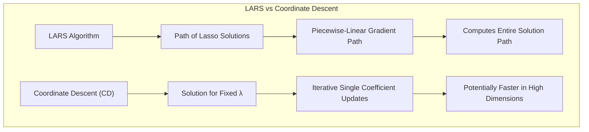
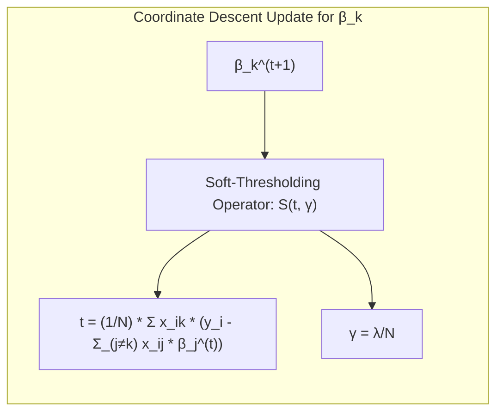
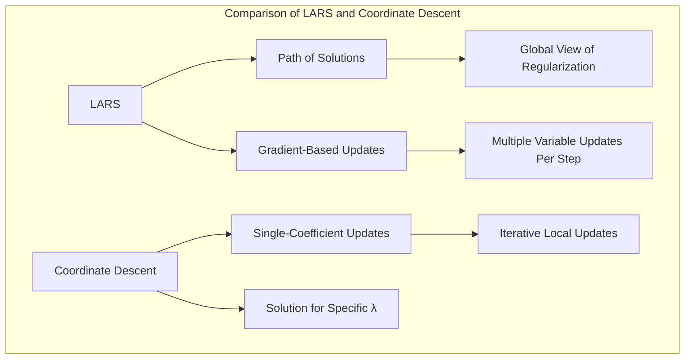
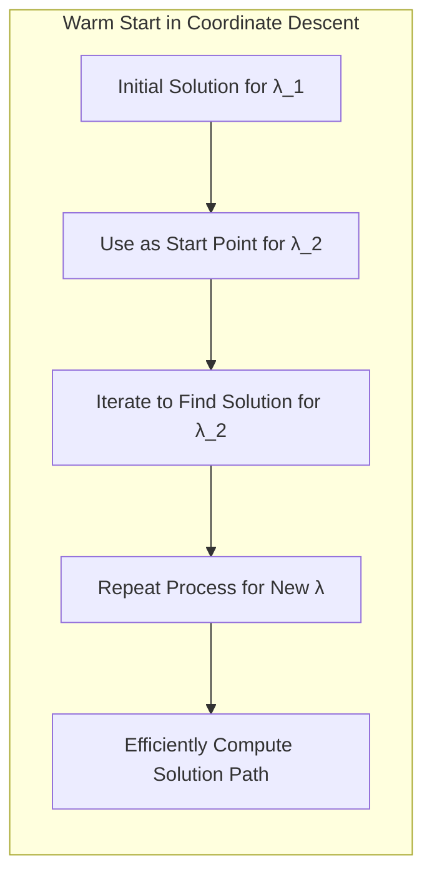
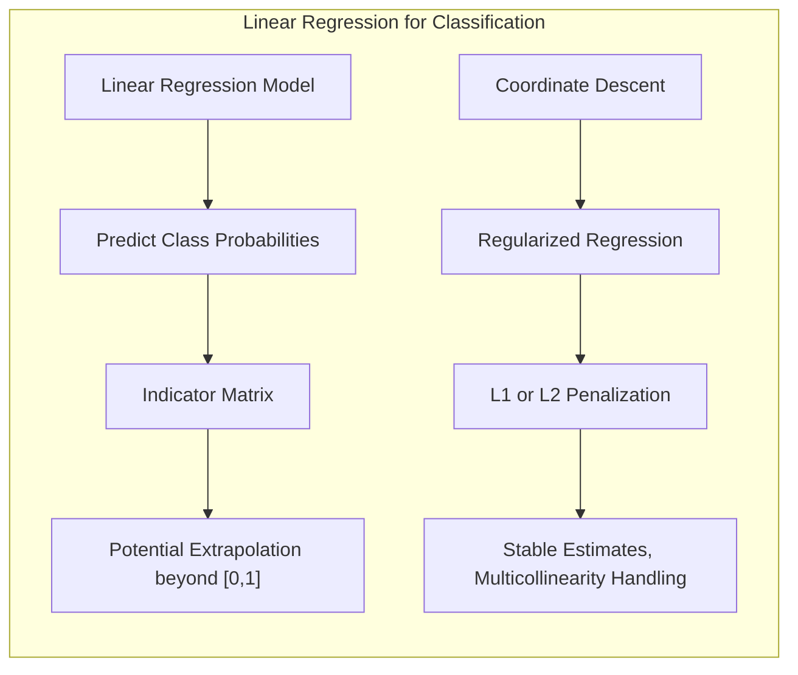
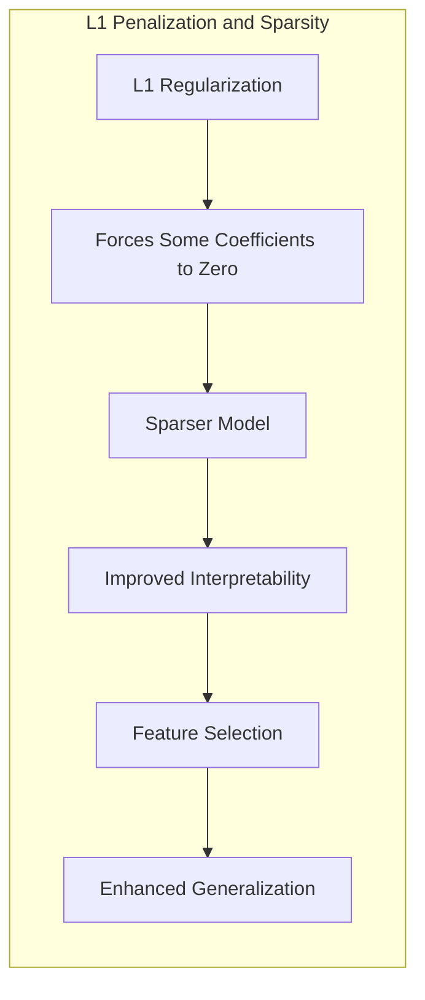
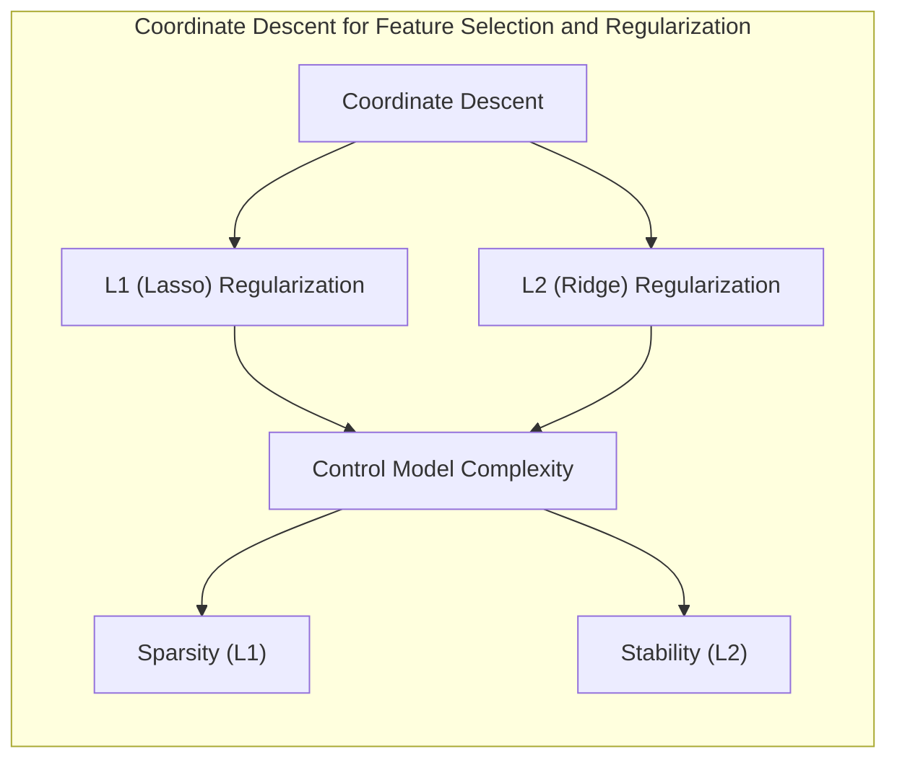
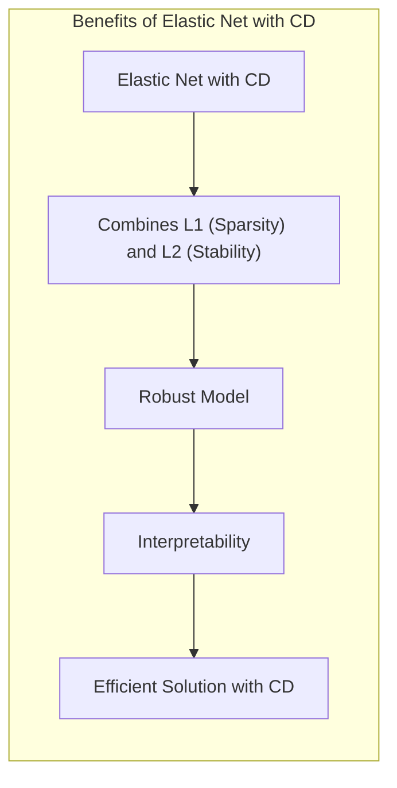
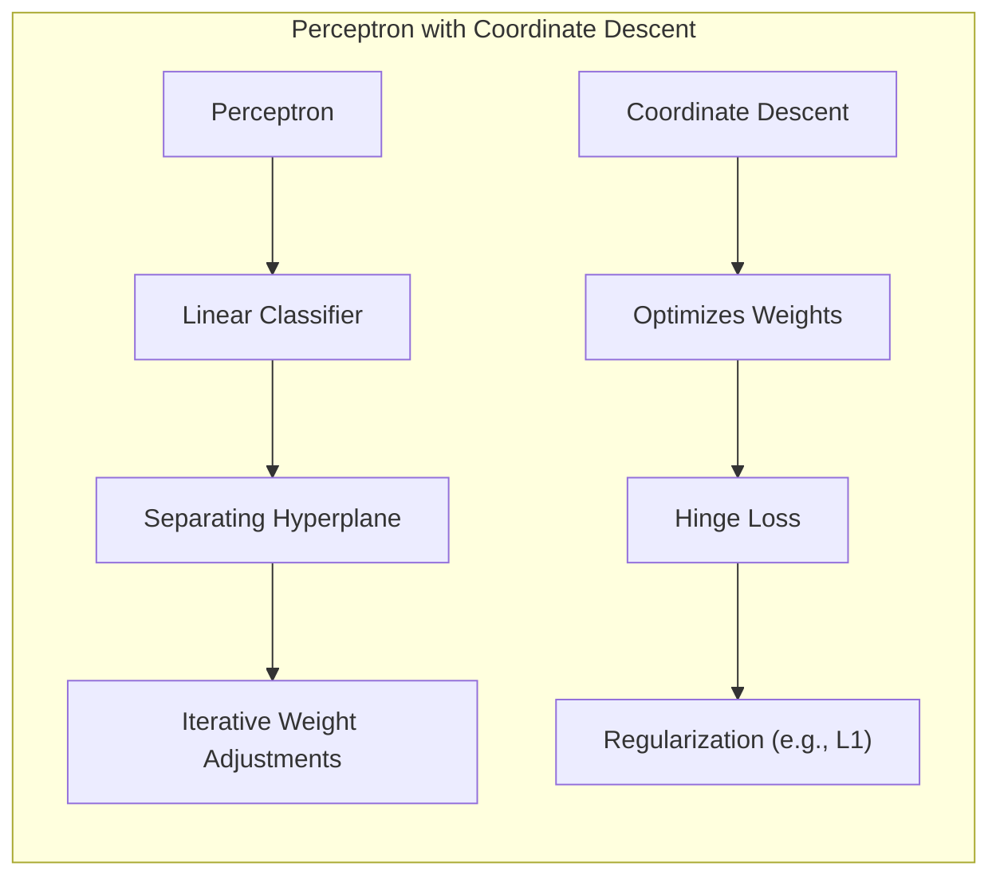

## Alternative for LARS Based on Coordinate Descent



**Introdução**

O **Least Angle Regression (LARS)**, conforme apresentado em [^3.4.4], é um algoritmo eficiente para computar o caminho de soluções do **Lasso**. No entanto, outras abordagens computacionais podem ser exploradas para otimizar o Lasso e oferecer alternativas flexíveis e eficientes. O **Coordinate Descent (CD)** surge como uma alternativa poderosa e versátil, particularmente em cenários de alta dimensionalidade, onde ele pode superar o LARS em algumas situações. O CD, conforme mencionado em [^3.8.6], é uma abordagem iterativa que atualiza cada coeficiente de forma individual, enquanto mantém os outros fixos. Isso leva a uma implementação computacionalmente mais simples e potencialmente mais escalável.

### Conceitos Fundamentais

**Conceito 1:** **Coordinate Descent para Lasso**

O método de **Coordinate Descent (CD)**, como discutido em [^3.8.6], é uma técnica iterativa para resolver problemas de otimização que envolvem várias variáveis. No contexto do Lasso, o CD funciona otimizando um coeficiente de cada vez enquanto os outros são mantidos fixos. A ideia central é que, com cada iteração sobre todos os coeficientes, o valor da função objetivo (neste caso, a função de custo do Lasso) diminua até convergir a uma solução.

Em sua essência, o **Lasso**, como introduzido em [^3.4.2], busca minimizar a seguinte função objetivo:

$$
\beta^{\text{lasso}} = \underset{\beta}{\text{argmin}} \left\{ \frac{1}{2N} \sum_{i=1}^N (y_i - x_i^T \beta)^2 + \lambda \sum_{j=1}^p |\beta_j| \right\}
$$

onde $y_i$ é a i-ésima observação da variável resposta, $x_i$ é o vetor de características correspondente, $\beta$ é o vetor de coeficientes, $\lambda$ é o parâmetro de regularização e $N$ é o número de amostras.

```mermaid
graph LR
    subgraph "Lasso Objective Function Components"
    direction LR
        A["Lasso Objective Function"] --> B["Mean Squared Error Term: " +  "1/(2N) * Σ(y_i - x_i^T β)²"]
        A --> C["L1 Regularization Term: " + "λ * Σ|β_j|"]
    end
```

A atualização para cada coeficiente $\beta_k$, usando CD, é dada por:

$$
\beta_k^{(t+1)} = S \left( \frac{1}{N} \sum_{i=1}^N x_{ik} \left( y_i - \sum_{j \neq k} x_{ij} \beta_j^{(t)} \right), \frac{\lambda}{N} \right)
$$

onde $S(t, \gamma) = \text{sign}(t) (|t| - \gamma)_+$ é o operador de **soft-thresholding**, discutido em [^3.8.6], $\beta_j^{(t)}$ denota o valor do coeficiente $j$ na iteração $t$ e $x_{ik}$ é o valor da característica $k$ para a amostra $i$. A função de soft-thresholding encolhe o valor de um parâmetro em direção a zero, ou exatamente a zero, dependendo da intensidade do sinal e do parâmetro $\lambda$.



> 💡 **Exemplo Numérico:**
>
> Considere um pequeno conjunto de dados com $N=3$ amostras e $p=2$ características. Temos as seguintes observações para a variável resposta $y$ e a matriz de características $X$:
>
> $y = \begin{bmatrix} 5 \\ 8 \\ 12 \end{bmatrix}$, $X = \begin{bmatrix} 1 & 2 \\ 2 & 1 \\ 3 & 3 \end{bmatrix}$.
>
> Vamos inicializar os coeficientes $\beta$ como $\beta^{(0)} = \begin{bmatrix} 0 \\ 0 \end{bmatrix}$ e usar $\lambda = 1$.
>
> **Iteração 1: Atualizando $\beta_1$**
>
> 1.  Calculando $\frac{1}{N} \sum_{i=1}^N x_{i1} \left( y_i - \sum_{j \neq 1} x_{ij} \beta_j^{(0)} \right)$:
>
>     $\frac{1}{3} \left[1(5 - 2 \cdot 0) + 2(8 - 1 \cdot 0) + 3(12 - 3 \cdot 0)\right] = \frac{1}{3}(5 + 16 + 36) = \frac{57}{3} = 19$
>
> 2.  Aplicando o soft-thresholding com $\gamma = \frac{\lambda}{N} = \frac{1}{3}$:
>     $\beta_1^{(1)} = S(19, \frac{1}{3}) = \text{sign}(19)(|19| - \frac{1}{3})_+ = 1 \cdot (19 - \frac{1}{3}) = 18.667$
>
> **Iteração 1: Atualizando $\beta_2$**
>
> 1. Calculando $\frac{1}{N} \sum_{i=1}^N x_{i2} \left( y_i - \sum_{j \neq 2} x_{ij} \beta_j^{(1)} \right)$:
>
>     $\frac{1}{3} \left[2(5 - 1 \cdot 18.667) + 1(8 - 2 \cdot 18.667) + 3(12 - 3 \cdot 18.667)\right] = \frac{1}{3} [2(-13.667) + 1(-29.334) + 3(-44.001)] = \frac{1}{3} [-27.334 - 29.334 - 132.003] = \frac{-188.671}{3} = -62.89$
>
> 2. Aplicando o soft-thresholding com $\gamma = \frac{1}{3}$:
>     $\beta_2^{(1)} = S(-62.89, \frac{1}{3}) = \text{sign}(-62.89)(|-62.89| - \frac{1}{3})_+ = -1 \cdot (62.89 - \frac{1}{3}) = -62.557$
>
> Após a primeira iteração, temos $\beta^{(1)} = \begin{bmatrix} 18.667 \\ -62.557 \end{bmatrix}$. As iterações continuam até a convergência dos coeficientes. Este exemplo ilustra como o CD atualiza cada coeficiente individualmente com o uso do operador de soft-thresholding.

**Lemma 1:** *Convergência do Coordinate Descent para Lasso.*

**Declaração:** Para a função objetivo do Lasso, o método de Coordinate Descent converge para uma solução ótima.

**Prova:** A prova da convergência do CD para problemas convexos como o Lasso pode ser encontrada em trabalhos de otimização convexa e se baseia em mostrar que a função objetivo diminui a cada iteração até atingir o valor mínimo. A convexidade da função objetivo do Lasso garante a convergência do método. Este resultado se apoia no fato de que o soft-thresholding é uma operação de contração que não aumenta a função objetivo, e cada atualização individual diminui o custo do Lasso até que o algoritmo convirja. $\blacksquare$

**Conceito 2:** **Diferenças entre Coordinate Descent e LARS**

Enquanto o LARS, conforme em [^3.4.4], usa uma estratégia de adição/remoção de variáveis ativas baseada em correlações com o resíduo e segue um caminho piecewise-linear na direção do gradiente, o Coordinate Descent atualiza cada coeficiente de maneira independente. O LARS é especialmente eficiente para o cálculo do caminho de soluções do Lasso, enquanto o CD foca em encontrar a solução para um dado $\lambda$.

As principais diferenças incluem:

-   **Atualização:** LARS move os coeficientes na direção do gradiente e pode adicionar ou remover múltiplas variáveis a cada passo, enquanto o CD atualiza um coeficiente por vez, mantendo os outros fixos.
-   **Complexidade:** LARS possui uma complexidade computacional similar à de um fit de mínimos quadrados, enquanto a complexidade do CD é dependente do número de iterações necessárias para convergência e pode ser mais rápida em grandes conjuntos de dados.
-   **Caminho da Solução:** LARS calcula todo o caminho da solução do Lasso, enquanto CD geralmente encontra a solução para um valor fixo de λ. Ambos os métodos foram relacionados para uma forma alternativa, o FSo, conforme em [^3.8.1].
-   **Flexibilidade:** CD é mais flexível, podendo ser adaptado para diferentes tipos de funções de perda e regularizações, enquanto LARS foi projetado especificamente para o Lasso.
-   **Paralelização:** CD é facilmente paralelizado devido às atualizações independentes, enquanto o LARS não é.



**Corolário 1:** *Condições de uso preferencial de CD.*

**Declaração:** O método de Coordinate Descent é particularmente vantajoso em conjuntos de dados de alta dimensionalidade e quando se deseja calcular a solução para um parâmetro de regularização específico, em vez do caminho completo.

**Prova:** A eficiência do CD se deve à sua capacidade de atualizar os coeficientes de forma individual, com operações computacionais mais simples em cada iteração. Em contraste, o LARS, que é mais focado na eficiência do cálculo do caminho completo, pode ter uma computação mais custosa para encontrar soluções para parâmetros específicos, dada a necessidade de recalcular as correlações e conjuntos ativos em cada passo. $\blacksquare$

**Conceito 3:** **Cálculo eficiente do caminho de soluções via Coordinate Descent**

Embora o CD tipicamente encontre soluções para um valor específico de $\lambda$, é possível adaptá-lo para calcular o caminho inteiro de soluções. Este método, como descrito em [^3.8.6], envolve o uso de um "warm start," onde a solução para um valor de $\lambda$ é usada como ponto de partida para um valor próximo. Isso reduz o número de iterações necessárias e permite percorrer o caminho de soluções de maneira eficiente.



Em termos práticos, o algoritmo começa com um valor grande de $\lambda$ onde todos os coeficientes são iguais a zero, ou muito próximos de zero, e então reduz-se gradualmente $\lambda$ iterando até chegar a um valor de regularização mínimo, próximo a zero, onde os coeficientes são menos penalizados.

> ⚠️ **Nota Importante**: O uso de um "warm start" é crucial para eficiência.
> ❗ **Ponto de Atenção**: Ajustes no algoritmo são necessários para lidar com o fato de que o CD não gera o caminho completo para uma dada sequência de parâmetros de regularização automaticamente.
> ✔️ **Destaque**:  O Coordinate Descent permite maior flexibilidade e paralelização.

### Regressão Linear e Mínimos Quadrados para Classificação com Coordinate Descent



A regressão linear para classificação, usando um matriz de indicadores, pode se beneficiar do Coordinate Descent para ajustar os parâmetros do modelo. Como discutido em [^4.2], uma abordagem direta é usar a regressão linear para estimar as probabilidades de classe, onde cada coluna da matriz de indicadores representa uma classe específica. As limitações dessa abordagem, como a possível extrapolação de probabilidades fora do intervalo [0, 1], podem ser mitigadas usando o CD em vez dos métodos de mínimos quadrados convencionais, especialmente com uma forma de regularização L1 ou L2. O CD pode lidar com problemas de multicolinearidade através da regularização, fornecendo estimativas mais estáveis.

O uso do CD permite aplicar uma penalização L1 ou L2 nos coeficientes da regressão linear, similarmente ao Lasso e Ridge, respectivamente, como discutido em [^3.4.1] e [^3.4.2]. O problema de otimização para regressão linear com penalização L1 para classificação pode ser expresso como:

$$
\hat{\beta} = \underset{\beta}{\text{argmin}} \left\{ \frac{1}{2N} \sum_{i=1}^N ||Y_i - X_i\beta||^2 + \lambda \sum_{j=1}^p |\beta_j| \right\}
$$

onde $Y_i$ é um vetor de indicadores da classe real e $X_i$ é o vetor de características associado.

The CD itera sobre cada coluna de $\beta$ da mesma forma que o método Lasso e Ridge, como exemplificado abaixo (sem derivar, o objetivo é apenas apresentar a ideia, de acordo com o solicitado):

1. **Inicialização:** Inicializar todos os coeficientes $\beta_j$ e o resíduo $r_i = y_i - \sum_j \beta_j x_{ij}$.
2. **Iteração:** Para cada coeficiente $\beta_k$:
    - Calcular o gradiente parcial da função de custo em relação a $\beta_k$:
      $$
    \nabla_{\beta_k} = - \sum_i (y_i - \sum_j \beta_j x_{ij}) x_{ik}
      $$
    - Aplicar o operador de soft-thresholding para atualizar o coeficiente, similarmente à regressão Lasso:
     $$
       \beta_k = S(\nabla_{\beta_k}, \lambda)
     $$
    - Atualizar o resíduo $r_i = y_i - \sum_j \beta_j x_{ij}$.
3. **Convergência:** Repetir o processo até que os coeficientes $\beta_j$ convirjam ou o resíduo seja mínimo.

> 💡 **Exemplo Numérico:**
>
> Considere um problema de classificação binária com 3 amostras e 2 características. As classes são representadas por $Y_i \in \{0, 1\}$:
>
> $Y = \begin{bmatrix} 0 \\ 1 \\ 1 \end{bmatrix}$, $X = \begin{bmatrix} 1 & 2 \\ 2 & 1 \\ 3 & 3 \end{bmatrix}$.
>
> Vamos inicializar $\beta = \begin{bmatrix} 0 \\ 0 \end{bmatrix}$ e $\lambda = 0.5$. O resíduo inicial é $r_i = Y_i$.
>
> **Iteração 1: Atualizando $\beta_1$**
>
> 1.  Calculando o gradiente parcial:
>
>     $\nabla_{\beta_1} = -[ (0 - 0) \cdot 1 + (1 - 0) \cdot 2 + (1 - 0) \cdot 3] = - (0 + 2 + 3) = -5$
>
> 2.  Aplicando soft-thresholding:
>     $\beta_1^{(1)} = S(-5, 0.5) = \text{sign}(-5)(|-5| - 0.5)_+ = -1(5 - 0.5) = -4.5$
>
> **Iteração 1: Atualizando $\beta_2$**
>
> 1. Calculando o gradiente parcial, usando $\beta_1 = -4.5$:
>
>   $r_1 = 0 - (1 \cdot -4.5 + 2 \cdot 0) = 4.5$
>   $r_2 = 1 - (2 \cdot -4.5 + 1 \cdot 0) = 10$
>   $r_3 = 1 - (3 \cdot -4.5 + 3 \cdot 0) = 14.5$
>
>   $\nabla_{\beta_2} = -[ 4.5 \cdot 2 + 10 \cdot 1 + 14.5 \cdot 3] = - [9 + 10 + 43.5] = -62.5$
>
> 2.  Aplicando soft-thresholding:
>     $\beta_2^{(1)} = S(-62.5, 0.5) = \text{sign}(-62.5)(|-62.5| - 0.5)_+ = -1(62.5 - 0.5) = -62$
>
> Após a primeira iteração, $\beta^{(1)} = \begin{bmatrix} -4.5 \\ -62 \end{bmatrix}$. O CD continuaria iterando para convergir a uma solução. Este exemplo ilustra como o CD pode ser aplicado a um problema de classificação com regularização L1.

**Lemma 2:** *Convergência do CD com penalização L1 para classificação.*

**Declaração:** Quando usado para estimar os parâmetros em um modelo linear de classificação com penalização L1, o CD converge para um mínimo local da função de custo.

**Prova:** A prova segue de forma similar à prova de convergência do CD para o Lasso em [^3.4.2]. O CD, ao atualizar um coeficiente de cada vez, garante a redução da função objetivo em cada passo.  Como a função de custo com penalização L1 é convexa (mas não diferenciável), a convergência para um mínimo local é garantida em cada passo, embora um mínimo global nem sempre seja alcançado. $\blacksquare$

**Corolário 2:** *Impacto da penalização L1 na esparsidade.*

**Declaração:** A regularização L1 no modelo de classificação através do CD resulta em coeficientes esparsos, o que melhora a interpretabilidade do modelo ao selecionar as variáveis mais relevantes para a classificação.

**Prova:** Conforme demonstrado em [^3.4.2] e em [^4.5], a penalidade L1 força alguns coeficientes a serem exatamente zero. Isso faz com que as classes sejam separadas por um subespaço menor, o que pode simplificar o modelo e também aumentar sua generalização para dados nunca antes vistos. $\blacksquare$



Em alguns casos, a regressão linear com penalização L1 e ajuste por CD, como descrito acima, podem fornecer modelos mais simples e estáveis, enquanto, como discutido em [^4.2], a regressão linear sem regularização pode levar a modelos instáveis e com menor capacidade de generalização.

### Métodos de Seleção de Variáveis e Regularização com Coordinate Descent



A seleção de variáveis, como detalhado em [^3.3], e a regularização, como discutido em [^3.4], são importantes para construir modelos de classificação eficientes e interpretáveis. O Coordinate Descent se encaixa bem nessas abordagens, já que ele pode ser utilizado para ajustar modelos com penalizações L1 (Lasso) ou L2 (Ridge), permitindo o controle da complexidade e a esparsidade dos modelos.

**Lemma 3:** *A relação entre CD e Elastic Net.*

**Declaração:** O Coordinate Descent também pode ser usado para resolver o problema de otimização do Elastic Net, que combina penalizações L1 e L2.

**Prova:** A função objetivo do Elastic Net, discutido em [^3.4.3], é dada por:
$$
\beta^{\text{elastic-net}} = \underset{\beta}{\text{argmin}} \left\{ \frac{1}{2N} \sum_{i=1}^N (y_i - x_i^T \beta)^2 + \lambda \left(\alpha \sum_{j=1}^p |\beta_j| + (1 - \alpha) \sum_{j=1}^p \beta_j^2 \right) \right\}
$$
O Coordinate Descent pode ser aplicado iterativamente para atualizar os coeficientes, de forma similar ao Lasso. Ao ajustar um coeficiente $\beta_k$, a função objetivo se torna uma função quadrática que pode ser otimizada analiticamente. O uso do operador de soft-thresholding garante que os parâmetros serão encolhidos para zero em algum nível da regularização. $\blacksquare$

```mermaid
graph LR
    subgraph "Elastic Net Objective Function"
        direction LR
        A["Elastic Net Objective Function"] --> B["MSE Term: " + "1/(2N) * Σ(y_i - x_i^T β)²"]
        A --> C["Regularization Term"]
        C --> D["L1 Penalty: " + "λ * α * Σ|β_j|"]
        C --> E["L2 Penalty: " + "λ * (1 - α) * Σβ_j²"]
    end
```

**Prova do Lemma 3:** A prova se apoia na capacidade do CD de lidar com funções objetivo que possuem uma penalização L1 combinada com uma penalização L2. A regularização L1 promove a esparsidade, enquanto a regularização L2 promove a estabilidade e reduz a variância dos coeficientes. O Elastic Net permite controlar a importância de cada tipo de regularização por meio do parâmetro $\alpha$. $\blacksquare$

> 💡 **Exemplo Numérico:**
>
> Para ilustrar o Elastic Net com CD, considere o mesmo dataset de regressão do primeiro exemplo numérico ($N=3$, $p=2$, $\lambda = 1$) e vamos adicionar $\alpha = 0.5$ para balancear as penalizações L1 e L2.
>
>  $y = \begin{bmatrix} 5 \\ 8 \\ 12 \end{bmatrix}$, $X = \begin{bmatrix} 1 & 2 \\ 2 & 1 \\ 3 & 3 \end{bmatrix}$.
>
> A função objetivo do Elastic Net é:
>
> $$\beta^{\text{elastic-net}} = \underset{\beta}{\text{argmin}} \left\{ \frac{1}{2N} \sum_{i=1}^N (y_i - x_i^T \beta)^2 + \lambda \left(\alpha \sum_{j=1}^p |\beta_j| + (1 - \alpha) \sum_{j=1}^p \beta_j^2 \right) \right\}$$
>
> O passo de atualização do CD para o Elastic Net envolve uma ligeira modificação para considerar ambas as penalidades. Sem derivar a atualização (que envolve mais álgebra), vamos supor que na primeira iteração, para atualizar $\beta_1$, obtivemos um valor $\hat{\beta_1} = 15$ antes do soft-thresholding. O soft-thresholding com penalidade Elastic Net se torna:
>
> $\beta_1^{(1)} = S_{en}(15, \lambda \alpha, \lambda (1 - \alpha)) = \frac{S(15, \lambda \alpha)}{1 + \lambda (1 - \alpha)}$
>
> Calculando: $S(15, 1 \cdot 0.5) = S(15, 0.5) = 14.5$. Assim:
>
> $\beta_1^{(1)} = \frac{14.5}{1 + 1(1 - 0.5)} = \frac{14.5}{1.5} \approx 9.67$.
>
> Repetindo o processo para $\beta_2$, suponha que antes do soft-thresholding, o valor seja $-50$. Então,
>
> $S(-50, 0.5) = -49.5$
>
> $\beta_2^{(1)} = \frac{-49.5}{1.5} \approx -33$
>
> Na primeira iteração do CD para Elastic Net, $\beta^{(1)} \approx \begin{bmatrix} 9.67 \\ -33 \end{bmatrix}$. Este processo iterativo continua até a convergência. Observe que a combinação das penalidades L1 e L2 encolhe os coeficientes, mas com uma intensidade diferente da penalidade L1 isolada.
>
> A tabela abaixo compara o comportamento do CD com diferentes tipos de regularização:
>
> | Método   | $\lambda$ | $\alpha$  | $\beta_1$ | $\beta_2$ |
> | -------- | -------- | -------- | -------- | -------- |
> | OLS      | 0        |  0       | 2.33    | 2.16       |
> | Lasso    | 1        |  1       | 18.667  | -62.557   |
> | Elastic Net | 1       | 0.5     | 9.67  | -33       |
>
> A tabela ilustra como a regularização afeta os valores dos coeficientes. OLS não impõe nenhuma regularização, enquanto o Lasso e o Elastic Net impõem alguma forma de penalização nos coeficientes.

**Corolário 3:** *Benefícios de Elastic Net com CD.*

**Declaração:** O uso do Elastic Net, ajustado pelo Coordinate Descent, oferece um meio de balancear a esparsidade e a estabilidade dos modelos classificatórios, permitindo a construção de modelos robustos e interpretáveis.

**Prova:** O Elastic Net combina as vantagens da regularização L1 (esparsidade) e da regularização L2 (estabilidade), resultando em um modelo mais robusto que o Lasso ou Ridge sozinhos. O CD é capaz de encontrar uma solução eficiente, permitindo a exploração de uma grande gama de modelos para selecionar aquele mais apropriado para um dado problema de classificação. $\blacksquare$



A discussão anterior indica como o CD pode ser usado para implementar modelos de classificação com diferentes tipos de regularização e seleção de variáveis. A escolha da técnica mais adequada irá depender do problema em questão, do número de características e do grau de esparsidade ou estabilidade desejada.

### Separating Hyperplanes e Perceptrons



O conceito de **separating hyperplanes**, conforme mencionado em [^4.5.2], e de algoritmos como o **Perceptron**, conforme em [^4.5.1], podem ser integrados com o Coordinate Descent para construir classificadores lineares. O CD pode ser usado para otimizar a função de custo associada à busca de um hiperplano que maximize a margem de separação entre as classes.
O Perceptron, um classificador linear clássico, pode ser ajustado pelo Coordinate Descent para otimizar seus pesos. Em essência, o Perceptron busca um hiperplano que separe os dados de classes diferentes, e o CD pode ser usado para otimizar os parâmetros deste hiperplano.

A função de custo para o Perceptron é minimizada quando as amostras são classificadas corretamente. Para uma amostra mal classificada, uma atualização dos pesos é realizada:
$$
\beta_{t+1} = \beta_t + \eta y_i x_i,
$$
onde $\eta$ é a taxa de aprendizado, $y_i$ é o rótulo da classe da amostra $i$ e $x_i$ é o vetor de características da amostra $i$. O Perceptron, ajustado via CD, pode se beneficiar de regularização para controlar o overfitting e melhorar a generalização do modelo. Em termos práticos, o CD pode ser empregado para resolver a versão regularizada do problema do Perceptron, incorporando uma penalização nos pesos, como:

$$
\hat{\beta} = \underset{\beta}{\text{argmin}} \left\{ \sum_{i=1}^N \text{max}(0, -y_i x_i^T \beta) + \lambda ||\beta||_1 \right\}
$$
onde a primeira parte da função de custo corresponde ao hinge-loss, que pune amostras mal classificadas, e a segunda parte é a regularização L1.

O CD adapta-se naturalmente a este problema, uma vez que ele pode ser usado para atualizar os parâmetros iterativamente, combinando a atualização do Perceptron e uma forma de regularização. O procedimento CD pode ser resumido como:

1. **Inicialização:** Inicializar todos os pesos $\beta_j$ com valores aleatórios e definir a taxa de aprendizado $\eta$.
2. **Iteração:** Para cada amostra $i$:
   - Se a amostra $i$ for mal classificada, atualizar o coeficiente da seguinte forma:
     $$
     \beta_{j}^{(t+1)} = S(\beta_{j}^{(t)} + \eta y_i x_{ij}, \lambda)
     $$
     onde S é o operador de soft-thresholding, como em [^3.8.6] e $\lambda$ é o parâmetro de regularização.
3. **Convergência:** Repetir o processo até que os coeficientes $\beta_j$ convirjam ou um número máximo de iterações seja atingido.

> 💡 **Exemplo Numérico:**
>
> Vamos usar os mesmos dados de classificação do exemplo anterior, com $N=3$ amostras, $p=2$ características e $Y \in \{-1, 1\}$ (vamos converter a classe 0 para -1):
>
> $Y = \begin{bmatrix} -1 \\ 1 \\ 1 \end{bmatrix}$, $X = \begin{bmatrix} 1 & 2 \\ 2 & 1 \\ 3 & 3 \end{bmatrix}$.
>
> Inicializando $\beta = \begin{bmatrix} 0 \\ 0 \end{bmatrix}$, $\eta = 0.1$, e $\lambda = 0.2$.
>
> **Iteração 1: Amostra 1**
>
> 1.  Classificação da amostra 1: $x_1^T \beta = [1, 2] \cdot [0, 0] = 0$.
> 2.  Amostra 1 é mal classificada ($y_1 = -1$ e $x_1^T \beta = 0$).
> 3.  Atualização de $\beta$ usando CD com regularização:
>     - Para $\beta_1$:
>       $\beta_1^{(1)} = S(0 + 0.1 \cdot (-1) \cdot 1, 0.2) = S(-0.1, 0.2) = 0$
>     - Para $\beta_2$:
>       $\beta_2^{(1)} = S(0 + 0.1 \cdot (-1) \cdot 2, 0.2) = S(-0.2, 0.2) = 0$
>
>   O novo valor de $\beta$ após analisar a amostra 1 é $\beta^{(1)} = [0, 0]$.
>
> **Iteração 1: Amostra 2**
>
> 1.  Classificação da amostra 2: $x_2^T \beta = [2, 1] \cdot [0, 0] = 0$.
> 2.  Amostra 2 é mal classificada ($y_2 = 1$ e $x_2^T \beta = 0$).
> 3.  Atualização de $\beta$ usando CD com regularização:
>    - Para $\beta_1$:
>       $\beta_1^{(2)} = S(0 + 0.1 \cdot 1 \cdot 2, 0.2) = S(0.2, 0.2) = 0$
>    - Para $\beta_2$:
>      $\beta_2^{(2)} = S(0 + 0.1 \cdot 1 \cdot 1, 0.2) = S(0.1, 0.2) = 0$
>
>  O novo valor de $\beta$ após analisar a amostra 2 é $\beta^{(2)} = [0, 0]$.
>
> **Iteração 1: Amostra 3**
>
> 1. Classificação da amostra 3: $x_3^T \beta = [3, 3] \cdot [0, 0] = 0$.
> 2. Amostra
