## Cyclical Optimization Over Parameters in Statistical Learning Models
<imagem: Um diagrama de fluxo complexo que descreve o processo de otimização cíclica, incluindo os passos de inicialização, cálculo de gradientes parciais, atualização de parâmetros e verificação de convergência, com destaque para a iteração através de parâmetros>

### Introdução
A otimização de parâmetros é um passo crucial no ajuste de modelos estatísticos e de aprendizado de máquina. Em modelos complexos, onde a função de custo ou verossimilhança não pode ser minimizada analiticamente, recorremos a métodos iterativos. A **otimização cíclica** sobre parâmetros, ou coordinate descent, é uma dessas abordagens que se destacam pela sua simplicidade e eficiência, especialmente quando tratamos de modelos com muitos parâmetros, como os encontrados em classificação e regressão. Em particular, este capítulo, baseando-se nos conceitos apresentados em [^4.1], [^4.2], [^4.3], [^4.4], e [^4.5], explora a fundo a técnica de otimização cíclica e suas aplicações em modelos lineares, com foco em detalhes teóricos e exemplos práticos. Discutiremos como este método se relaciona com **Linear Discriminant Analysis (LDA), Logistic Regression**, e as diferentes abordagens de regularização. A motivação principal da otimização cíclica é simplificar um problema de otimização complexo, decompondo-o em uma série de problemas de otimização mais simples em uma dimensão.
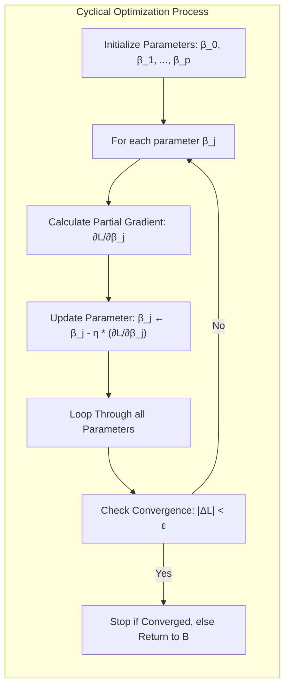

### Conceitos Fundamentais
A seguir, exploramos os conceitos chave para entender a otimização cíclica no contexto de classificação e regressão.

**Conceito 1:** **Problema de Classificação e Modelos Lineares.** O objetivo na classificação é atribuir amostras de dados a diferentes classes ou categorias. Modelos lineares são amplamente usados nesse contexto devido à sua simplicidade e interpretabilidade [^4.1]. No entanto, a complexidade reside na otimização dos parâmetros do modelo para alcançar uma separação ótima das classes. O problema geral de classificação pode ser visto como encontrar uma função discriminante $f(x)$ tal que $f(x) > 0$ para uma classe e $f(x) < 0$ para outra, ou estimar a probabilidade condicional $P(Y=k|X)$, onde $Y$ representa a classe e $X$ as variáveis preditoras. Modelos lineares assumem que esta função discriminante ou transformação é linear nos parâmetros, $f(x) = \beta_0 + \sum_{j=1}^p x_j\beta_j$ [^4.2]. A escolha do método de otimização afeta diretamente a eficiência e a qualidade da separação das classes. A otimização cíclica é particularmente útil nesse contexto quando aplicamos técnicas de regularização.

> 💡 **Exemplo Numérico:** Considere um problema de classificação binária com duas variáveis preditoras $x_1$ e $x_2$. Temos um modelo linear definido como $f(x) = \beta_0 + x_1\beta_1 + x_2\beta_2$. Inicializamos os parâmetros com $\beta_0 = 0.1$, $\beta_1 = 0.2$, e $\beta_2 = -0.3$. A otimização cíclica envolveria atualizar cada parâmetro individualmente, enquanto mantemos os outros fixos. Por exemplo, ao otimizar $\beta_1$, mantemos $\beta_0$ e $\beta_2$ fixos e encontramos o valor de $\beta_1$ que minimiza a função de custo para o problema específico, que neste caso poderia ser a log-verossimilhança ou o erro quadrático. Este processo é repetido ciclicamente para $\beta_0$, $\beta_2$ e, novamente, $\beta_1$ até a convergência.
```python
import numpy as np
from sklearn.linear_model import LogisticRegression
from sklearn.metrics import log_loss

# Dados de exemplo
X = np.array([[1, 2], [1.5, 1.8], [5, 8], [8, 8], [1, 0.6], [9, 11]])
y = np.array([0, 0, 1, 1, 0, 1])

# Inicialização dos parâmetros (pode usar chute inicial ou zeros)
beta0 = 0.1
beta1 = 0.2
beta2 = -0.3

# Função para calcular a probabilidade (sigmoide para Regressão Logística)
def sigmoid(z):
  return 1 / (1 + np.exp(-z))

# Função para prever
def predict_proba(X, beta0, beta1, beta2):
  z = beta0 + X[:, 0] * beta1 + X[:, 1] * beta2
  return sigmoid(z)

# Função de custo (log-loss)
def cost_function(y_true, y_pred):
  return log_loss(y_true, y_pred)

# Simulação de uma iteração de otimização cíclica (simplificado)
def cyclic_optimization(X, y, beta0, beta1, beta2, learning_rate=0.01, iterations=10):
    for _ in range(iterations):
        # Otimizar beta0 (mantendo beta1 e beta2 fixos)
        z = beta0 + X[:, 0] * beta1 + X[:, 1] * beta2
        y_pred = sigmoid(z)
        gradient_beta0 = np.mean(y_pred - y)
        beta0 -= learning_rate * gradient_beta0

        # Otimizar beta1 (mantendo beta0 e beta2 fixos)
        z = beta0 + X[:, 0] * beta1 + X[:, 1] * beta2
        y_pred = sigmoid(z)
        gradient_beta1 = np.mean((y_pred - y) * X[:, 0])
        beta1 -= learning_rate * gradient_beta1

         # Otimizar beta2 (mantendo beta0 e beta1 fixos)
        z = beta0 + X[:, 0] * beta1 + X[:, 1] * beta2
        y_pred = sigmoid(z)
        gradient_beta2 = np.mean((y_pred - y) * X[:, 1])
        beta2 -= learning_rate * gradient_beta2
    return beta0, beta1, beta2

# Executar a otimização
beta0_opt, beta1_opt, beta2_opt = cyclic_optimization(X, y, beta0, beta1, beta2)

# Avaliar a função de custo
y_pred = predict_proba(X, beta0_opt, beta1_opt, beta2_opt)
cost = cost_function(y, y_pred)

print(f"Beta0 otimizado: {beta0_opt:.3f}")
print(f"Beta1 otimizado: {beta1_opt:.3f}")
print(f"Beta2 otimizado: {beta2_opt:.3f}")
print(f"Custo final: {cost:.3f}")
```
Essa simulação simplificada demonstra como os parâmetros são atualizados iterativamente usando a otimização cíclica. Os gradientes são calculados e os parâmetros atualizados usando uma taxa de aprendizado. A função de custo é avaliada para verificar se o modelo está melhorando. É importante lembrar que esta é uma simulação para exemplificar o método.
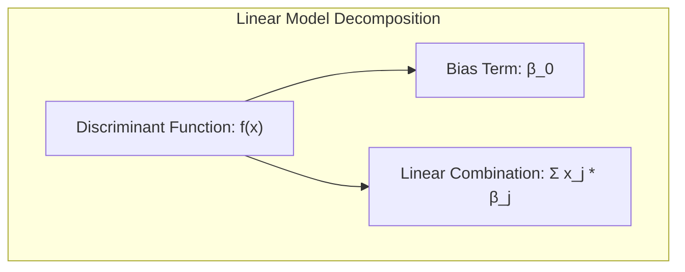

**Lemma 1:** A função discriminante linear pode ser decomposta em uma série de funções de otimização unidimensional com a abordagem de otimização cíclica. Isso é, otimizar os parâmetros $\beta_j$ individualmente enquanto mantemos os outros parâmetros fixos, converge para o mínimo local da função de custo. Essa decomposição simplifica a otimização, pois reduz um problema complexo em $p$ dimensões para uma sequência de $p$ problemas mais simples, cada um em uma dimensão. Este é um resultado central na aplicação de otimização cíclica em modelos lineares e é formalmente justificado em [^4.3], embora não seja apresentado explicitamente em forma de lemma. O algoritmo se baseia na noção de que a convergência individual dos parâmetros implica na convergência conjunta do modelo.
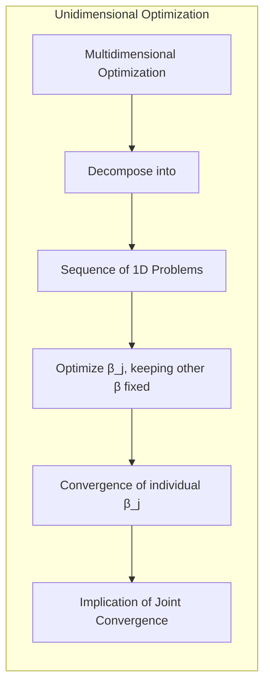

**Conceito 2:** **Linear Discriminant Analysis (LDA)**. LDA é um método de classificação linear que busca projetar os dados em um espaço de dimensão inferior, de forma a maximizar a separação entre as classes [^4.3]. LDA assume que cada classe possui distribuição Gaussiana com a mesma matriz de covariância. A função discriminante linear em LDA surge da minimização da distância de Mahalanobis [^4.3.1] e pode ser escrita na forma $f(x) = x^T\Sigma^{-1}(\mu_k - \frac{1}{2}\mu_k^T\Sigma^{-1}\mu_k)$, onde $\mu_k$ é a média das variáveis preditoras da classe $k$ e $\Sigma$ a covariância comum. A otimização de LDA envolve encontrar a melhor direção de projeção dos dados. O método de otimização cíclica não se aplica diretamente à obtenção dos parâmetros de LDA (as médias e covariâncias), já que eles são derivados analiticamente. No entanto, quando combinamos LDA com regularização, o método pode ser usado para otimizar parâmetros adicionais, como fatores de regularização ou transformações não lineares dos dados [^4.3.2].
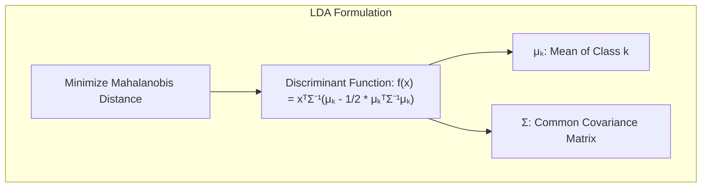

> 💡 **Exemplo Numérico:** Suponha que temos duas classes e as médias de cada classe, $\mu_1 = [1, 2]^T$ e $\mu_2 = [3, 4]^T$, e a matriz de covariância comum $\Sigma = \begin{bmatrix} 1 & 0.5 \\ 0.5 & 1 \end{bmatrix}$. Para calcular a função discriminante LDA, primeiro precisamos calcular a inversa de $\Sigma$: $\Sigma^{-1} = \frac{1}{0.75} \begin{bmatrix} 1 & -0.5 \\ -0.5 & 1 \end{bmatrix} = \begin{bmatrix} 1.33 & -0.67 \\ -0.67 & 1.33 \end{bmatrix}$. Agora podemos calcular $w = \Sigma^{-1}(\mu_1 - \mu_2) = \begin{bmatrix} 1.33 & -0.67 \\ -0.67 & 1.33 \end{bmatrix} \begin{bmatrix} -2 \\ -2 \end{bmatrix} = \begin{bmatrix} -1.32 \\ -1.32 \end{bmatrix}$ e $b = -0.5(\mu_1^T \Sigma^{-1} \mu_1 - \mu_2^T \Sigma^{-1} \mu_2) =  -0.5 ([1, 2]\begin{bmatrix} 1.33 & -0.67 \\ -0.67 & 1.33 \end{bmatrix} [1, 2]^T - [3, 4]\begin{bmatrix} 1.33 & -0.67 \\ -0.67 & 1.33 \end{bmatrix} [3, 4]^T) \approx 5.33$. A função discriminante LDA é dada por $f(x) =  [-1.32, -1.32]x + 5.33$, onde $x$ é um vetor de entrada.

**Corolário 1:** As direções de projeção em LDA podem ser vistas como os autovetores da matriz de covariância "entre classes", que são projeções lineares para o espaço de menor dimensão. Este resultado mostra como o LDA projeta os dados em subespaços relevantes para classificação, com base nos dados de treino, o que pode ser visto como uma forma de otimização da representação dos dados [^4.3.1]. A otimização cíclica não se aplica diretamente ao cálculo desses autovetores, mas, como mencionado, pode ser relevante ao introduzir regularização.
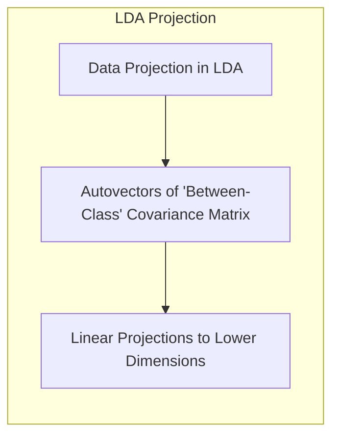

**Conceito 3:** **Logistic Regression**.  Em contraste com LDA, que assume distribuições Gaussianas para as variáveis preditoras, a regressão logística modela diretamente a probabilidade de uma amostra pertencer a uma determinada classe. Ela utiliza a função sigmóide para mapear a combinação linear das variáveis preditoras em uma probabilidade entre 0 e 1 [^4.4]. A função de log-odds, ou *logit*, é definida como $\text{logit}(p) = \log(\frac{p}{1-p})$ [^4.4.1], e a regressão logística assume que essa função é linear nas variáveis preditoras: $\text{logit}(p) = \beta_0 + \sum_{j=1}^p x_j\beta_j$ [^4.4.2]. Os parâmetros $\beta_j$ são otimizados via *maximum likelihood*, ou seja, maximizando a verossimilhança dos dados sob o modelo. A verossimilhança é dada por $$L(\beta) = \prod_{i=1}^N p(x_i)^{y_i}(1-p(x_i))^{1-y_i} $$, que é frequentemente transformada em log-verossimilhança para simplificar o problema [^4.4.3]. A otimização cíclica pode ser usada para encontrar os parâmetros $\beta$ que maximizam essa função, especialmente com regularização.
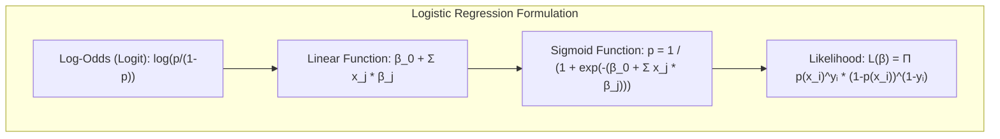

> ⚠️ **Nota Importante**: A função de verossimilhança na regressão logística é geralmente convexa, o que significa que a otimização cíclica pode convergir para um ótimo global, desde que os parâmetros sejam atualizados corretamente [^4.4.2].

> ❗ **Ponto de Atenção**: Em casos de classes desbalanceadas, técnicas como *re-sampling* e pesos de classe são importantes para garantir uma boa estimação das probabilidades.

> ✔️ **Destaque**: A otimização dos parâmetros da regressão logística por otimização cíclica pode ter semelhanças com o método utilizado para otimizar parâmetros do LDA quando usamos regularização, o que justifica o uso deste método nestas situações.

> 💡 **Exemplo Numérico:** Vamos considerar um exemplo simplificado de regressão logística com duas amostras e um único preditor. Suponha que temos $x_1 = 1, y_1 = 1$ e $x_2 = 2, y_2 = 0$. Inicializamos $\beta_0 = 0$ e $\beta_1 = 0$. A função sigmóide é $p(x_i) = \frac{1}{1 + e^{-(\beta_0 + x_i \beta_1)}}$. A log-verossimilhança é $l(\beta) = \sum_{i=1}^{2} y_i \log(p(x_i)) + (1-y_i)\log(1-p(x_i))$. A otimização cíclica envolveria atualizar iterativamente $\beta_0$ e $\beta_1$. Por exemplo, para atualizar $\beta_0$ enquanto mantemos $\beta_1$ fixo, usaríamos o gradiente da função de log-verossimilhança com relação a $\beta_0$. Usaríamos o mesmo processo para $\beta_1$.
```python
import numpy as np
from scipy.optimize import minimize

# Dados de exemplo
X = np.array([[1], [2]])
y = np.array([1, 0])

# Função sigmóide
def sigmoid(z):
    return 1 / (1 + np.exp(-z))

# Função de verossimilhança (negativa para minimizar)
def log_likelihood(params, X, y):
    beta0, beta1 = params
    p = sigmoid(beta0 + X.flatten() * beta1)
    log_likelihood = -np.sum(y * np.log(p) + (1 - y) * np.log(1 - p))
    return log_likelihood


# Otimização cíclica (simulada com scipy.optimize.minimize para um passo)
def cyclic_optimization(X, y, beta0, beta1, learning_rate=0.1):
    # Otimizar beta0 (mantendo beta1 fixo)
    def objective_beta0(b0):
      return log_likelihood([b0, beta1], X, y)
    result_beta0 = minimize(objective_beta0, beta0, method='L-BFGS-B')
    beta0_opt = result_beta0.x[0]
    # Otimizar beta1 (mantendo beta0 fixo)
    def objective_beta1(b1):
      return log_likelihood([beta0_opt, b1], X, y)
    result_beta1 = minimize(objective_beta1, beta1, method='L-BFGS-B')
    beta1_opt = result_beta1.x[0]
    return beta0_opt, beta1_opt

# Inicialização dos parâmetros
beta0 = 0
beta1 = 0

# Simular uma iteração da otimização cíclica
beta0_opt, beta1_opt  = cyclic_optimization(X, y, beta0, beta1)

print(f"Beta0 otimizado: {beta0_opt:.3f}")
print(f"Beta1 otimizado: {beta1_opt:.3f}")

# Função para prever
def predict_proba(X, beta0, beta1):
  z = beta0 + X.flatten() * beta1
  return sigmoid(z)

print("Probabilidades estimadas:", predict_proba(X,beta0_opt, beta1_opt))
```
Este exemplo mostra como os parâmetros $\beta_0$ e $\beta_1$ são atualizados iterativamente usando a função `minimize` do `scipy`, que simula uma iteração do método cíclico. Os gradientes são calculados implicitamente pela função, e os parâmetros são atualizados para um valor que diminui a função de custo.

### Regressão Linear e Mínimos Quadrados para Classificação
<imagem: Um diagrama de fluxo que representa o processo de regressão de indicadores, desde a codificação das classes até a aplicação da regra de decisão e a comparação com outros métodos probabilísticos>
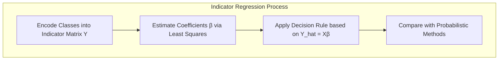
**Explicação:** Este diagrama representa o fluxo do processo de regressão de indicadores e como ele se relaciona à classificação.

A regressão linear em uma matriz de indicadores é uma abordagem direta para a classificação, onde cada classe é codificada como uma coluna na matriz de indicadores [^4.2]. A regressão linear padrão com mínimos quadrados é então usada para estimar os coeficientes que relacionam as variáveis preditoras com a matriz de indicadores. Formalmente, se temos $K$ classes, representamos as classes como vetores de dimensão $K$, em que cada amostra recebe um vetor com 1 na posição correspondente a sua classe e 0 nas demais. O modelo é então definido como $Y = X\beta + \epsilon$, onde $Y$ é a matriz de indicadores, $X$ a matriz de dados e $\beta$ os parâmetros a serem otimizados. A otimização por mínimos quadrados busca os parâmetros que minimizam a soma dos erros quadráticos entre os valores observados de $Y$ e os valores preditos por $X\beta$ [^4.2]. Embora a regressão linear possa ser usada para classificação, ela apresenta limitações. As probabilidades preditas podem não estar dentro do intervalo [0, 1], e o método não considera explicitamente as relações entre as classes, como o LDA faz [^4.3].
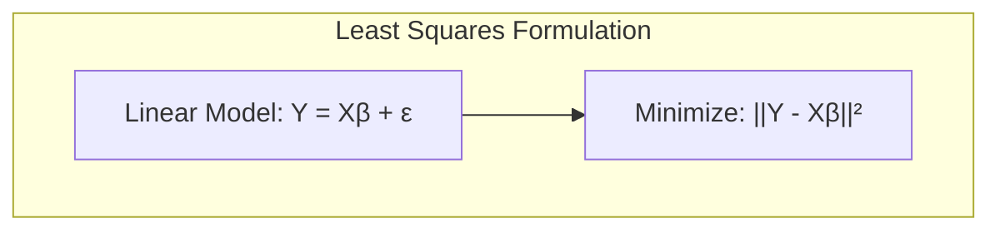
**Lemma 2:** A regressão linear em matriz de indicadores, quando aplicada a problemas de classificação, pode levar a soluções equivalentes às obtidas por modelos discriminantes lineares sob certas condições. No caso de classes com a mesma covariância, a decisão baseada na regressão de indicadores pode ser interpretada como uma forma de projeção para um espaço de menor dimensão, similar ao que ocorre no LDA. Este lemma pode ser demonstrado ao mostrar que as direções de decisão encontradas por regressão linear são similares às direções de projeção ótimas do LDA sob certas condições, uma vez que o método busca ajustar uma função linear a uma matriz de indicadores que representam as classes. Este resultado, embora não seja apresentado de forma explícita, está implícito em [^4.2] e [^4.3], ao comparar os resultados da regressão de indicadores com as soluções de LDA.
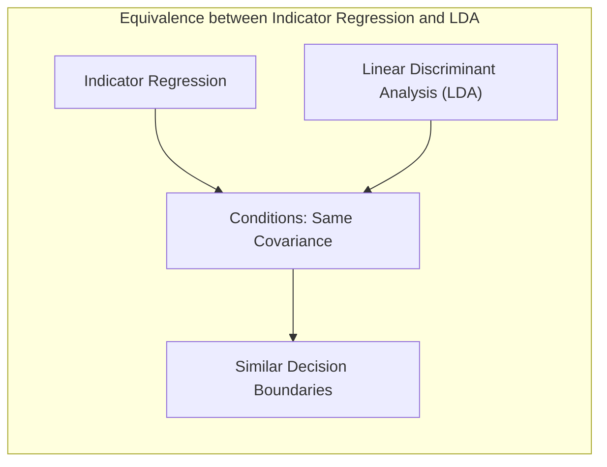

> 💡 **Exemplo Numérico:** Vamos criar um exemplo com duas classes e duas características. Suponha que temos $X = \begin{bmatrix} 1 & 2 \\ 1.5 & 1.8 \\ 5 & 8 \\ 8 & 8 \end{bmatrix}$ e as classes $y=[0, 0, 1, 1]$. A matriz de indicadores $Y$ será $\begin{bmatrix} 1 & 0 \\ 1 & 0 \\ 0 & 1 \\ 0 & 1 \end{bmatrix}$. Podemos então calcular os coeficientes $\beta$ usando mínimos quadrados: $\beta = (X^T X)^{-1} X^T Y$.
```python
import numpy as np
from sklearn.linear_model import LinearRegression

# Dados de exemplo
X = np.array([[1, 2], [1.5, 1.8], [5, 8], [8, 8]])
y = np.array([0, 0, 1, 1])

# Criar matriz de indicadores
def indicator_matrix(y):
    classes = np.unique(y)
    Y = np.zeros((len(y), len(classes)))
    for i, label in enumerate(y):
        Y[i, np.where(classes == label)[0][0]] = 1
    return Y

Y = indicator_matrix(y)
# Calcular os coeficientes via LS
XTX = X.T @ X
XTX_inv = np.linalg.inv(XTX)
beta = XTX_inv @ X.T @ Y

# Usando sklearn
model = LinearRegression()
model.fit(X,Y)
beta_sk = model.coef_

print("Coeficientes (calculados manualmente):\n", beta)
print("Coeficientes (usando sklearn):\n", beta_sk)


# Prever as classes
Y_pred = X @ beta
# Aplicar regra de decisão (pegar a classe com maior valor predito)
y_pred = np.argmax(Y_pred, axis = 1)
print("Classes preditas: ", y_pred)
```
Este código mostra como calcular os coeficientes da regressão linear usando mínimos quadrados com uma matriz de indicadores. Compara também o resultado usando a função do scikit-learn. A matriz de indicadores, $Y$, codifica cada classe em uma coluna. Os coeficientes $\beta$ são estimados usando mínimos quadrados. As classes preditas são obtidas aplicando uma regra de decisão sobre as predições.

**Corolário 2:** Se as classes estiverem bem separadas no espaço de características original, a regressão linear na matriz de indicadores pode encontrar fronteiras de decisão satisfatórias, mesmo não sendo uma abordagem tão sofisticada quanto métodos probabilisticos. Por exemplo, em casos em que as classes estão linearmente separáveis, o erro de treinamento da regressão pode ser nulo, o que corresponde à separação perfeita das classes no conjunto de treinamento. Este resultado está relacionado com a condição de separabilidade dos dados, como discutido em [^4.3] e com a equivalência entre as soluções de modelos lineares sob condições ideais.
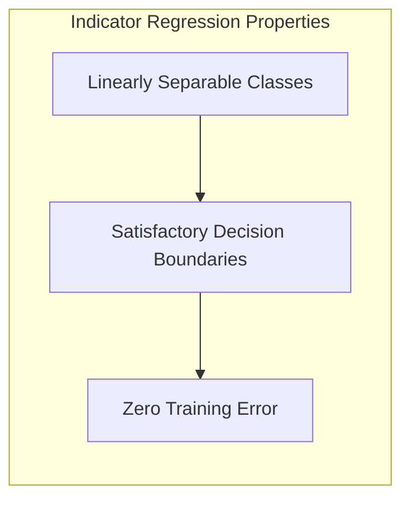

Apesar da simplicidade da regressão linear de indicadores para classificação, existem limitações importantes.  A regressão de indicadores pode produzir estimativas de probabilidade fora do intervalo [0, 1], e não lida de forma nativa com problemas de covariâncias diferentes entre classes ou não linearidades. A interpretação dos parâmetros pode ser dificultada, e o método pode se comportar de maneira instável em casos de multicolinearidade nas variáveis preditoras. A regressão logística, conforme [^4.4], pode ser mais adequada nesses casos, por fornecer uma interpretação probabilística e ser mais robusta a variações nos dados. Em certas situações, conforme apontado em [^4.2], a regressão de indicadores pode ser suficiente e vantajosa quando o foco principal é a obtenção da fronteira de decisão linear e não a estimação das probabilidades.

### Métodos de Seleção de Variáveis e Regularização em Classificação
<imagem: Um mapa mental que conecta os conceitos de seleção de variáveis e regularização, mostrando suas relações com LDA, regressão logística e hiperplanos separadores.>

A seleção de variáveis e a regularização são técnicas essenciais para lidar com problemas de alta dimensionalidade e evitar *overfitting* em modelos de classificação [^4.5]. A seleção de variáveis busca identificar e reter apenas as variáveis mais relevantes para a classificação, eliminando aquelas que são irrelevantes ou redundantes. Já a regularização adiciona um termo de penalidade à função de custo, forçando os parâmetros do modelo a serem menores e mais estáveis, o que reduz a complexidade do modelo e ajuda a evitar *overfitting*. Em modelos logísticos, a regularização é frequentemente implementada através da adição de penalidades L1 ou L2 à função de custo [^4.4.4], o que leva a modelos mais estáveis e esparsos, respectivamente. A regularização L1 (Lasso) impõe uma penalidade proporcional ao valor absoluto dos coeficientes, favorecendo modelos com poucos parâmetros não nulos. A regularização L2 (Ridge) impõe uma penalidade proporcional ao quadrado dos coeficientes, suavizando os valores dos coeficientes e reduzindo a sua magnitude. Combinando ambas as penalidades temos o Elastic Net [^4.5], que une o melhor das duas abordagens. A função de custo para a regressão logística com regularização é dada por $$J(\beta) =  -\frac{1}{N}\sum_{i=1}^N \left[ y_i\log(p(x_i)) + (1-y_i)\log(1-p(x_i)) \right] + \lambda_1 \sum_{j=1}^p |\beta_j| + \lambda_2 \sum_{j=1}^p \beta_j^2$$ [^4.4.5], onde o primeiro termo representa a log-verossimilhança, o segundo a penalização L1 e o terceiro a penalização L2.
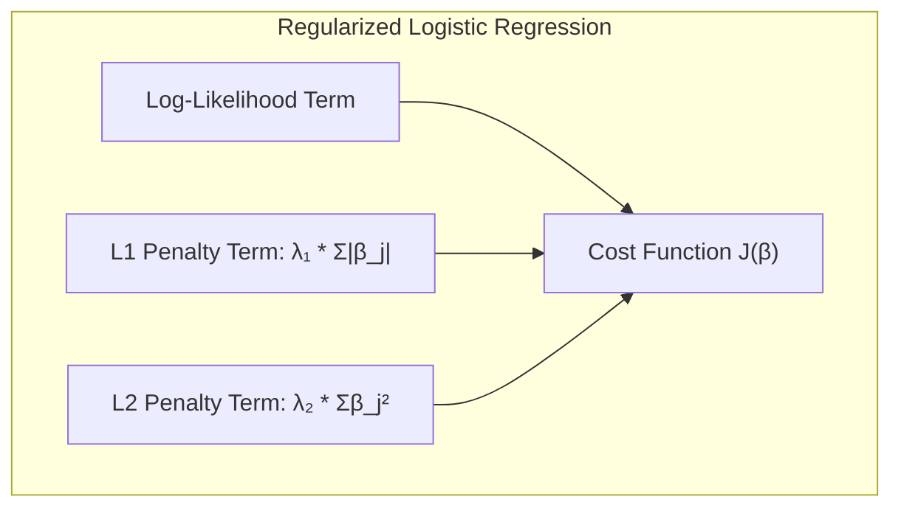
> 💡 **Exemplo Numérico:** Considere um problema de classificação com 10 variáveis preditoras. Vamos utilizar regressão logística com regularização L1 (Lasso). Os dados são simulados:

```python
import numpy as np
from sklearn.linear_model import LogisticRegression
from sklearn.model_selection import train_test_split
from sklearn.metrics import log_loss

# Simulação de dados
np.random.seed(42)
n_samples = 100
n_features = 10
X = np.random.rand(n_samples, n_features)
true_betas = np.array([1, 0, 2, 0, -1, 0, 0.5, 0, 0, 0])
probs = 1 / (1 + np.exp(-np.dot(X, true_betas)))
y = np.random.binomial(1, probs)

# Separar em treino e teste
X_train, X_test, y_train, y_test = train_test_split(X, y, test_size=0.2, random_state=42)

# Modelos de regressão logística
# Sem regularização
model_no_reg = LogisticRegression(penalty=None, solver='lbfgs', max_iter=1000)
model_no_reg.fit(X_train, y_train)
y_pred_no_reg = model_no_reg.predict_proba(X_test)[:, 1]
cost_no_reg = log_loss(y_test, y_pred_no_reg)

# Com regularização L1
lambda_l1 = 0.1
model_l1 = LogisticRegression(penalty='l1', C=1/(lambda_l1 * n_samples), solver='liblinear', max_iter=1000)
model_l1.fit(X_train, y_train)
y_pred_l1 = model_l1.predict_proba(X_test)[:, 1]
cost_l1 = log_loss(y_test, y_pred_l1)


print("Modelo sem regularização:")
print(f"  - Log-Loss: {cost_no_reg:.3f}")
print(f"  - Coeficientes: {model_no_reg.coef_[0]}")

print("Modelo com regularização L1 (Lasso):")
print(f"  - Log-Loss: {cost_l1:.3f}")
print(f"  - Coeficientes: {model_l1.coef_[0]}")
```

Neste exemplo, simulamos dados com alguns coeficientes não nulos e outros iguais a zero. A regressão logística sem regularização usa todos os preditores, enquanto que a regressão com regularização L1 (Lasso) zera os coeficientes das variáveis menos importantes, induzindo esparsidade e simplificando o modelo. A função de custo (log-loss) é avaliada nos dados de teste. Ao comparar os coeficientes, podemos observar que o modelo com regularização L1 tem vários coeficientes zerados.
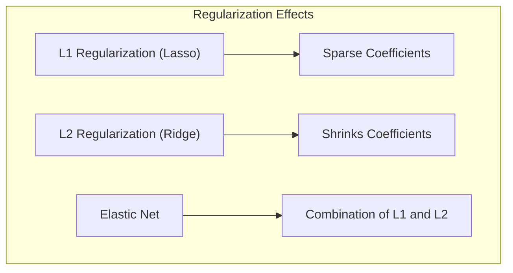
**Lemma 3:** A penalização L1 em regressão logística leva a coeficientes esparsos. A prova deste lemma envolve a análise das condições de otimalidade da função de custo regularizada. A penalidade L1 induz coeficientes a serem exatamente zero sempre que a derivada da função de custo, na direção de tal coeficiente, não excede a penalidade $\lambda_1$ [^4.4.4]. Isso ocorre pois a função de custo é convexa e a penalização é não diferenciável na origem, de forma que a solução ótima tende a ocorrer quando um dos coeficientes se torna zero. Este resultado, embora não seja apresentado de forma explícita, é amplamente conhecido na teoria de otimização e em modelos de classificação com regularização L1.
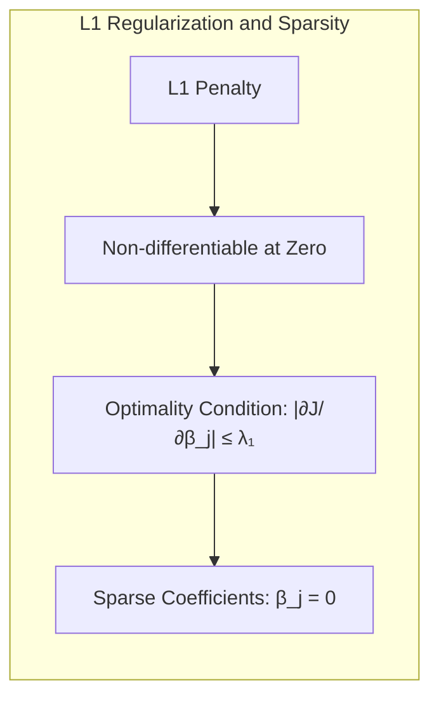

**Prova do Lemma 3:** Considerando a função de custo regularizada para regressão logística com penalização L1, temos que a função de custo é dada por:

$$J(\beta) =  -\frac{1}{N}\sum_{i=1}^N \left[ y_i\log(p(x_i)) + (1-y_i)\log(1-p(x_i)) \right] + \lambda_1 \sum_{j=1}^p |\beta_j|$$

Para encontrar o mínimo da função de custo, precisamos analisar a derivada da função. No caso da penalidade L1, a derivada da penalidade é dada por $\lambda