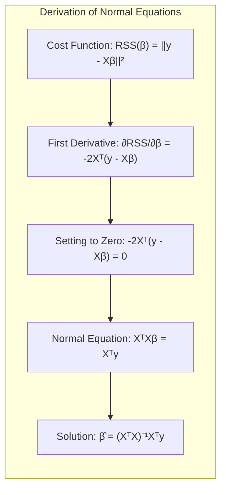
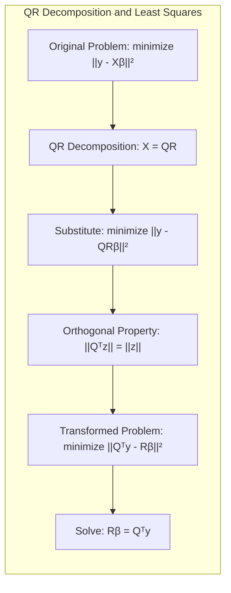
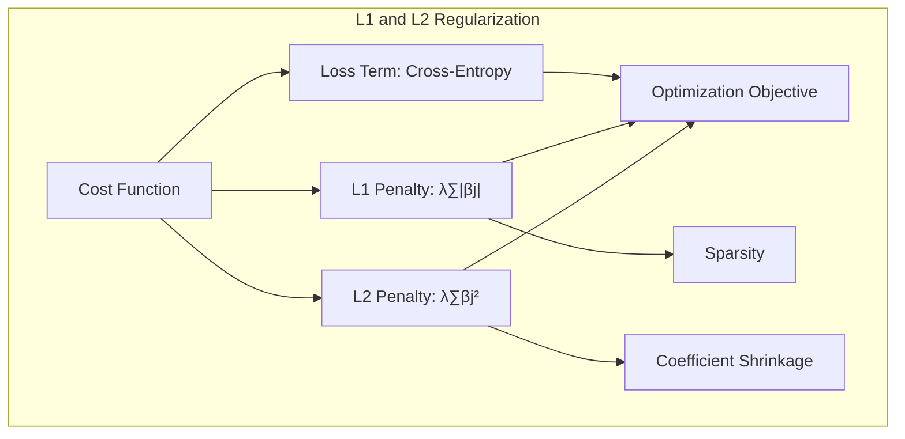
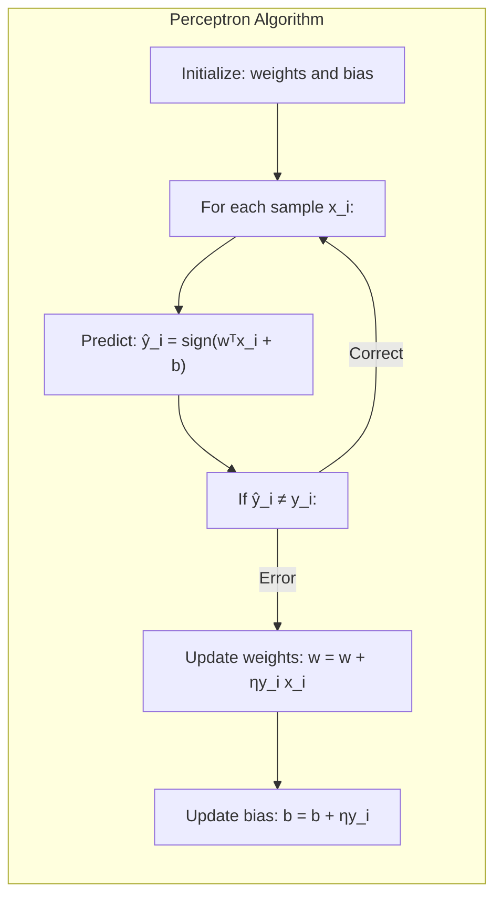
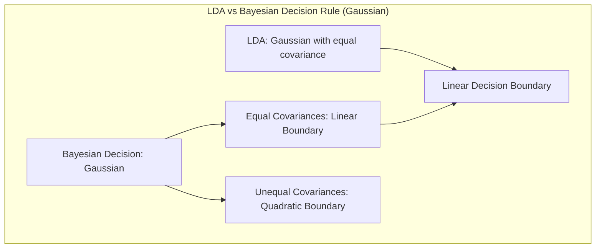

## Eficiência da Decomposição Cholesky QR em Mínimos Quadrados

<imagem: Diagrama de fluxo detalhado mostrando os passos para decomposição Cholesky QR, desde a entrada da matriz X até a obtenção dos parâmetros β, com destaque para as etapas de decomposição e retrosubstituição>

**Introdução**

O método dos **mínimos quadrados** é uma ferramenta fundamental em estatística e aprendizado de máquina para ajustar modelos lineares a dados observados. A solução desse problema geralmente envolve a resolução de equações normais, que podem ser resolvidas de forma eficiente através da **decomposição Cholesky QR** [^3.2].  Esta técnica, embora consolidada, é fundamental para a compreensão e otimização de modelos mais avançados. Este capítulo explorará em profundidade a aplicação e eficiência da Cholesky QR, enfatizando suas propriedades matemáticas e suas implicações práticas no contexto de regressão linear, baseando-se nos conceitos apresentados nos tópicos [^3.1] e [^3.2].

### Conceitos Fundamentais

**Conceito 1:** O **problema de regressão linear** busca encontrar um modelo linear que minimize a soma dos quadrados dos erros entre as previsões do modelo e os valores observados [^3.1]. Matematicamente, este problema pode ser expresso como encontrar um vetor $\beta$ que minimize a função custo:

$$ RSS(\beta) = \sum_{i=1}^{N} (y_i - f(x_i))^2 = ||y - X\beta||^2 $$

onde $y$ é o vetor de respostas, $X$ é a matriz de design (ou matriz de características), e $\beta$ é o vetor de parâmetros a serem estimados [^3.2]. A regressão linear é um método simples e interpretabil, mas que estabelece a base para técnicas mais complexas, como as discutidas em capítulos posteriores.

> 💡 **Exemplo Numérico:** Suponha que temos um conjunto de dados com duas variáveis preditoras ($x_1$ e $x_2$) e uma variável resposta $y$. As observações são:
>
> | Observação | $x_1$ | $x_2$ | $y$ |
> |------------|-------|-------|-----|
> | 1          | 1     | 2     | 5   |
> | 2          | 2     | 3     | 8   |
> | 3          | 3     | 5     | 12  |
> | 4          | 4     | 6     | 15  |
>
> A matriz de design $X$ e o vetor de respostas $y$ serão:
>
> $$ X = \begin{bmatrix} 1 & 1 & 2 \\ 1 & 2 & 3 \\ 1 & 3 & 5 \\ 1 & 4 & 6 \end{bmatrix}, \quad y = \begin{bmatrix} 5 \\ 8 \\ 12 \\ 15 \end{bmatrix} $$
>
> O objetivo é encontrar $\beta = [\beta_0, \beta_1, \beta_2]^T$ que minimize $||y - X\beta||^2$. Aqui, $\beta_0$ é o intercepto, $\beta_1$ é o coeficiente de $x_1$ e $\beta_2$ é o coeficiente de $x_2$.

**Lemma 1:** A solução para o problema de mínimos quadrados, obtida por meio das **equações normais**, é dada por $\hat{\beta} = (X^TX)^{-1}X^Ty$, assumindo que a matriz $X^TX$ é invertível [^3.2]. Essa solução é obtida ao igualar a zero a primeira derivada da função RSS em relação a $\beta$, que é um ponto de mínimo se a segunda derivada for definida positiva.



$$ \frac{\partial RSS}{\partial \beta} = -2X^T(y - X\beta) = 0 $$

$$ X^TX\beta = X^Ty $$

$$ \hat{\beta} = (X^TX)^{-1}X^Ty $$

A condição de invertibilidade de $X^TX$ é fundamental e geralmente satisfeita quando as colunas de $X$ são linearmente independentes [^3.2].

> 💡 **Exemplo Numérico:** Continuando com o exemplo anterior, podemos calcular $X^TX$ e $X^Ty$:
>
> $$ X^TX = \begin{bmatrix} 1 & 1 & 1 & 1 \\ 1 & 2 & 3 & 4 \\ 2 & 3 & 5 & 6 \end{bmatrix} \begin{bmatrix} 1 & 1 & 2 \\ 1 & 2 & 3 \\ 1 & 3 & 5 \\ 1 & 4 & 6 \end{bmatrix} = \begin{bmatrix} 4 & 10 & 16 \\ 10 & 30 & 49 \\ 16 & 49 & 86 \end{bmatrix} $$
>
> $$ X^Ty = \begin{bmatrix} 1 & 1 & 1 & 1 \\ 1 & 2 & 3 & 4 \\ 2 & 3 & 5 & 6 \end{bmatrix} \begin{bmatrix} 5 \\ 8 \\ 12 \\ 15 \end{bmatrix} = \begin{bmatrix} 40 \\ 111 \\ 180 \end{bmatrix} $$
>
>  Para encontrar $\hat{\beta}$, calculamos $(X^TX)^{-1}$ e multiplicamos por $X^Ty$:
> ```python
> import numpy as np
>
> X = np.array([[1, 1, 2], [1, 2, 3], [1, 3, 5], [1, 4, 6]])
> y = np.array([5, 8, 12, 15])
> XtX = X.T @ X
> XtX_inv = np.linalg.inv(XtX)
> XtY = X.T @ y
> beta_hat = XtX_inv @ XtY
> print(f"Beta estimado: {beta_hat}")
> ```
>
> O resultado será aproximadamente $\hat{\beta} = \begin{bmatrix} -0.03 \\ 1.06 \\ 1.96 \end{bmatrix}$. Isso significa que o modelo ajustado é aproximadamente $y \approx -0.03 + 1.06x_1 + 1.96x_2$.

**Conceito 2:** A **decomposição Cholesky QR** é uma técnica para resolver sistemas de equações lineares, especialmente útil quando a matriz de design é mal condicionada ou quando a matriz $X^TX$ é singular. Essa decomposição expressa a matriz $X$ como o produto de uma matriz ortogonal $Q$ e uma matriz triangular superior $R$:  $X = QR$ [^3.2].

**Corolário 1:**  Usando a decomposição QR, o problema de mínimos quadrados se torna:

$$ ||y - X\beta||^2 = ||y - QR\beta||^2 = ||Q^Ty - R\beta||^2 $$

Dado que $Q$ é ortogonal ($Q^TQ = I$), a norma é preservada. Assim, a solução $\beta$ pode ser encontrada ao resolver $R\beta = Q^Ty$ por meio de retrosubstituição, uma vez que $R$ é triangular superior [^3.2].



> 💡 **Exemplo Numérico:** Usando o mesmo $X$ do exemplo anterior, podemos realizar a decomposição QR:
>
> ```python
> import numpy as np
> import scipy.linalg
>
> X = np.array([[1, 1, 2], [1, 2, 3], [1, 3, 5], [1, 4, 6]])
> y = np.array([5, 8, 12, 15])
>
> Q, R = scipy.linalg.qr(X)
>
> print("Matriz Q:\n", Q)
> print("Matriz R:\n", R)
>
> QT_y = Q.T @ y
> beta_hat_qr = scipy.linalg.solve_triangular(R, QT_y)
> print("Beta estimado via QR:\n", beta_hat_qr)
> ```
> O código acima calcula a matriz ortogonal $Q$ e a matriz triangular superior $R$ tal que $X = QR$. Em seguida, encontra a solução para $\beta$ usando a retrosubstituição, resolvendo $R\beta = Q^Ty$. O resultado para $\beta$ é o mesmo (aproximadamente) que o obtido pelas equações normais, mas o processo é numericamente mais estável.

**Conceito 3:** A **regressão linear** pode ser extendida para cenários em que os inputs são transformações dos dados originais, como em expansões de base ou interações entre variáveis [^3.2]. Em tais casos, as matrizes $X$ e $y$ podem ser adaptadas de acordo, e o processo de otimização, seja por equações normais ou QR, pode ser aplicado da mesma maneira.

> 💡 **Exemplo Numérico:** Suponha que queremos modelar a relação entre $x$ e $y$ usando um polinômio de grau 2. Os dados são:
>
> |  $x$  |  $y$  |
> |-------|-------|
> |  1    |  2.8  |
> |  2    |  5.2  |
> |  3    |  8.1  |
> |  4    |  11.3 |
>
> A matriz de design agora incluirá termos para $x^2$:
>
> $$ X = \begin{bmatrix} 1 & 1 & 1 \\ 1 & 2 & 4 \\ 1 & 3 & 9 \\ 1 & 4 & 16 \end{bmatrix}, \quad y = \begin{bmatrix} 2.8 \\ 5.2 \\ 8.1 \\ 11.3 \end{bmatrix} $$
>
> Podemos usar tanto as equações normais quanto a decomposição QR para encontrar $\beta = [\beta_0, \beta_1, \beta_2]^T$, onde o modelo ajustado será $y \approx \beta_0 + \beta_1x + \beta_2x^2$.
>
>  ```python
> import numpy as np
> import scipy.linalg
>
> x = np.array([1, 2, 3, 4])
> y = np.array([2.8, 5.2, 8.1, 11.3])
> X = np.vstack([np.ones(len(x)), x, x**2]).T
>
> # Método das equações normais
> XtX = X.T @ X
> XtX_inv = np.linalg.inv(XtX)
> XtY = X.T @ y
> beta_hat_normal = XtX_inv @ XtY
> print("Beta via equações normais:", beta_hat_normal)
>
> # Método da decomposição QR
> Q, R = scipy.linalg.qr(X)
> QT_y = Q.T @ y
> beta_hat_qr = scipy.linalg.solve_triangular(R, QT_y)
> print("Beta via QR:", beta_hat_qr)
> ```
>
> Os coeficientes encontrados mostram o ajuste do polinômio aos dados.

> ⚠️ **Nota Importante**: A escolha do método de otimização (equações normais vs. decomposição QR) pode afetar a precisão e a estabilidade da solução, especialmente quando a matriz de design é mal condicionada [^3.2].
> ❗ **Ponto de Atenção**: A decomposição QR é geralmente preferível em cenários de instabilidade numérica, pois evita a inversão direta de $X^TX$, que pode ser instável [^3.2].
> ✔️ **Destaque**: A eficiência computacional e estabilidade numérica da decomposição Cholesky QR a tornam uma ferramenta poderosa na regressão linear e para compreender os fundamentos das soluções de mínimos quadrados.

### Regressão Linear e Mínimos Quadrados para Classificação

<imagem: Mapa mental mostrando as etapas da regressão linear aplicada à classificação, incluindo codificação das classes, estimativa de coeficientes, aplicação da regra de decisão e avaliação da performance>

A aplicação da regressão linear à classificação, embora menos comum do que a regressão logística, pode ser obtida por meio da **regressão linear de uma matriz indicadora** [^4.2]. Este processo envolve a codificação das classes de resposta como variáveis dummy (ou indicadores), onde cada variável representa uma classe [^4.1], [^4.2].  A regressão linear é então aplicada a cada uma dessas variáveis, utilizando as mesmas técnicas de mínimos quadrados e decomposição QR abordadas anteriormente.

**Lemma 2:**  A regressão linear de uma matriz indicadora pode ser usada para produzir um classificador linear. Para cada observação, a classe predita será aquela com a maior valor de resposta estimada. No entanto, essa abordagem pode apresentar algumas limitações em relação à regressão logística e LDA, como a extrapolação de previsões fora do intervalo [0,1], e a não-otimização direta da probabilidade da classe [^4.1].

**Corolário 2:** Apesar das limitações, a regressão de uma matriz indicadora pode fornecer resultados comparáveis em certos cenários, especialmente quando o interesse principal é a obtenção da fronteira de decisão linear, e não a estimativa precisa de probabilidades de classe. Em alguns casos, pode ser mais computacionalmente eficiente do que outros métodos probabilísticos, como a regressão logística [^4.2].

> 💡 **Exemplo Numérico:** Considere um problema de classificação com 3 classes. Os dados são:
>
> | $x_1$ | $x_2$ | Classe |
> |-------|-------|--------|
> | 1     | 1     | 0      |
> | 2     | 1     | 0      |
> | 1     | 2     | 1      |
> | 2     | 2     | 1      |
> | 3     | 3     | 2      |
> | 4     | 3     | 2      |
>
> Criamos uma matriz indicadora $Y$, onde cada coluna representa uma classe:
>
> $$ Y = \begin{bmatrix} 1 & 0 & 0 \\ 1 & 0 & 0 \\ 0 & 1 & 0 \\ 0 & 1 & 0 \\ 0 & 0 & 1 \\ 0 & 0 & 1 \end{bmatrix} $$
>
> A matriz de design $X$ será:
>
> $$ X = \begin{bmatrix} 1 & 1 & 1 \\ 1 & 2 & 1 \\ 1 & 1 & 2 \\ 1 & 2 & 2 \\ 1 & 3 & 3 \\ 1 & 4 & 3 \end{bmatrix} $$
>
> Realizamos a regressão linear de $Y$ sobre $X$ para obter uma matriz de coeficientes $\hat{B}$. Para classificar uma nova observação $x_{new}$, calculamos $\hat{y} = x_{new}^T\hat{B}$. A classe predita será a classe correspondente à coluna de $\hat{y}$ com maior valor.
>
>  ```python
> import numpy as np
> from sklearn.linear_model import LinearRegression
>
> X = np.array([[1, 1, 1], [1, 2, 1], [1, 1, 2], [1, 2, 2], [1, 3, 3], [1, 4, 3]])
> y = np.array([0, 0, 1, 1, 2, 2])
>
> # Converter y para one-hot encoding
> Y = np.eye(3)[y]
>
> model = LinearRegression()
> model.fit(X, Y)
>
> x_new = np.array([1, 3, 2]) # Novo ponto
> y_pred = model.predict(x_new.reshape(1, -1)) # A classe será aquela com maior valor
> predicted_class = np.argmax(y_pred) # A classe predita
> print(f"Classe predita para [1, 3, 2]: {predicted_class}")
> ```

Em suma, a regressão linear pode ser aplicada a problemas de classificação por meio da regressão da matriz indicadora, onde cada classe é representada por uma variável dummy. A decisão da classe é feita pela classe que apresentar a maior resposta predita pela regressão. No entanto, a principal vantagem da regressão linear reside na sua simplicidade e interpretabilidade, mas ela apresenta limitações e, em alguns cenários, outros métodos são mais adequados [^4.1], [^4.2].
“A regressão logística fornece estimativas mais estáveis da probabilidade, e deve ser preferível quando o objetivo é a estimativa de probabilidades. A regressão de indicadores é mais adequada quando o principal objetivo é a fronteira de decisão linear.” [^4.4]

### Métodos de Seleção de Variáveis e Regularização em Classificação

<imagem: Diagrama mostrando as penalizações L1 e L2 aplicadas na regressão logística, com ênfase na influência de cada uma na sparsity e na estabilidade dos parâmetros>

No contexto da classificação, a seleção de variáveis e a regularização são cruciais para lidar com a complexidade do modelo, evitar o sobreajuste e melhorar a interpretabilidade [^4.5].  A **regressão logística**, que pode ser ajustada através de otimização por descida do gradiente, é um bom exemplo para demonstrar como podemos usar essas técnicas.

A **penalização L1** (Lasso) adiciona um termo de penalização à função custo, que é a soma dos valores absolutos dos coeficientes. Esse tipo de penalização tende a tornar os coeficientes esparsos, forçando alguns deles a serem exatamente zero [^4.4.4]. Já a **penalização L2** (Ridge) adiciona a soma dos quadrados dos coeficientes, o que tende a encolher os coeficientes em direção a zero, mas sem zerá-los completamente. Ambas as regularizações podem ser aplicadas em conjunto, através do **Elastic Net** [^4.5].

**Lemma 3:** A penalização L1 na regressão logística leva a coeficientes esparsos devido à sua natureza não-diferenciável em zero, o que faz com que o otimizador muitas vezes atinja valores exatamente iguais a zero.  A penalização L2, por outro lado, é diferenciável em zero, apenas encolhendo o valor dos coeficientes.

**Prova do Lemma 3:** A função de custo da regressão logística com penalização L1 é dada por:

$$ J(\beta) = - \sum_{i=1}^N [y_i \log(\sigma(x_i^T\beta)) + (1-y_i)\log(1-\sigma(x_i^T\beta))] + \lambda\sum_{j=1}^p |\beta_j| $$

onde $\sigma(x_i^T\beta)$ é a função logística (sigmoid). A derivada do termo de penalização com respeito a $\beta_j$ é $\lambda sign(\beta_j)$, que é descontínua em $\beta_j = 0$. O otimizador tentará, ao chegar próximo a 0, "saltar" esse ponto, fazendo com que os coeficientes sejam 0.  Para a penalização L2, que é dada por  $\lambda\sum_{j=1}^p \beta_j^2$, a derivada é $2\lambda\beta_j$, que é contínua em zero, apenas reduzindo a magnitude de $\beta_j$.  $\blacksquare$


> 💡 **Exemplo Numérico:** Para ilustrar o efeito das regularizações L1 e L2, consideremos um conjunto de dados de classificação com duas variáveis preditoras e uma variável resposta binária. Usaremos regressão logística com e sem regularização:
> ```python
> import numpy as np
> import pandas as pd
> from sklearn.model_selection import train_test_split
> from sklearn.linear_model import LogisticRegression
> from sklearn.metrics import accuracy_score
>
> # Gerar dados de exemplo
> np.random.seed(0)
> n_samples = 200
> X = np.random.randn(n_samples, 2)
> y = (X[:, 0] + X[:, 1] > 0).astype(int)
>
> # Separar dados em treino e teste
> X_train, X_test, y_train, y_test = train_test_split(X, y, test_size=0.3, random_state=42)
>
> # Regressão Logística sem regularização
> model_no_reg = LogisticRegression(penalty=None)
> model_no_reg.fit(X_train, y_train)
> y_pred_no_reg = model_no_reg.predict(X_test)
> acc_no_reg = accuracy_score(y_test, y_pred_no_reg)
>
> # Regressão Logística com regularização L1 (Lasso)
> model_l1 = LogisticRegression(penalty='l1', solver='liblinear', C=0.5) # C é inverso de lambda
> model_l1.fit(X_train, y_train)
> y_pred_l1 = model_l1.predict(X_test)
> acc_l1 = accuracy_score(y_test, y_pred_l1)
>
> # Regressão Logística com regularização L2 (Ridge)
> model_l2 = LogisticRegression(penalty='l2', C=0.5) # C é inverso de lambda
> model_l2.fit(X_train, y_train)
> y_pred_l2 = model_l2.predict(X_test)
> acc_l2 = accuracy_score(y_test, y_pred_l2)
>
> # Exibir resultados
> results = pd.DataFrame({
>     'Method': ['No Regularization', 'L1 Regularization', 'L2 Regularization'],
>     'Accuracy': [acc_no_reg, acc_l1, acc_l2],
>     'Coefficients': [model_no_reg.coef_, model_l1.coef_, model_l2.coef_]
> })
>
> print(results)
> ```
>
> A tabela de resultados exibirá a acurácia e os coeficientes do modelo. Observe como a regularização L1 pode zerar alguns coeficientes, enquanto a L2 reduz a magnitude dos coeficientes sem zerá-los completamente. A acurácia também pode mudar, dependendo dos dados e da força da regularização.

**Corolário 3:** A esparsidade induzida pela penalização L1 em modelos classificatórios melhora a interpretabilidade, pois resulta em modelos que dependem apenas de um subconjunto das variáveis de entrada. Isso é útil para entender quais features são mais relevantes para a classificação e para simplificar modelos complexos [^4.4.5].

> ⚠️ **Ponto Crucial**: A escolha entre penalização L1, L2 ou Elastic Net depende das características do problema. L1 favorece modelos esparsos, L2 favorece estabilidade e Elastic Net é uma combinação dos dois [^4.5].

### Separating Hyperplanes e Perceptrons

<imagem: Diagrama mostrando a representação geométrica de um hiperplano separador em um espaço de características, com destaque para a margem de separação e os vetores de suporte>

O conceito de **hiperplanos separadores** está fundamentalmente ligado à classificação linear, visando encontrar um hiperplano que separe as classes de forma otimizada [^4.5.2]. Essa ideia leva ao conceito de **margem de separação**, que é a distância mínima entre o hiperplano e os pontos de dados mais próximos de cada classe [^4.5.2]. O objetivo é maximizar essa margem para obter um classificador robusto e generalizável. A otimização da margem pode ser feita através da formulação do problema dual de Wolfe e do uso de combinações lineares dos pontos de suporte, que são os pontos de dados mais próximos do hiperplano.

O **Perceptron de Rosenblatt** [^4.5.1] é um algoritmo simples que busca iterativamente um hiperplano que separa as classes, corrigindo seus parâmetros a cada erro de classificação encontrado. O Perceptron tem como diferencial a sua atualização iterativa da fronteira de decisão com base nos erros de classificação cometidos. Sua convergência é garantida sob a condição de que os dados sejam linearmente separáveis.
Se os dados não são linearmente separáveis, o Perceptron pode não convergir. Nestes casos, técnicas como Regularização e métodos de otimização mais robustos são necessários.


> 💡 **Exemplo Numérico:** Para ilustrar o funcionamento do Perceptron, considere o seguinte conjunto de dados linearmente separáveis:
>
> | $x_1$ | $x_2$ | Classe |
> |-------|-------|--------|
> | 1     | 1     | -1     |
> | 2     | 1     | -1     |
> | 1     | 2     | -1     |
> | 3     | 3     | 1      |
> | 4     | 3     | 1      |
> | 4     | 4     | 1      |
>
> O Perceptron começa com um hiperplano aleatório (representado por um vetor de pesos e um bias) e atualiza esses pesos a cada iteração, até que todos os pontos sejam corretamente classificados. Abaixo, um exemplo de implementação:
>
> ```python
> import numpy as np
>
> def perceptron(X, y, learning_rate=0.1, epochs=100):
>     """Implementação do Perceptron."""
>     n_samples, n_features = X.shape
>     weights = np.zeros(n_features)
>     bias = 0
>     errors_history = []
>
>     for _ in range(epochs):
>         errors = 0
>         for i in range(n_samples):
>             y_predicted = np.sign(np.dot(X[i], weights) + bias)
>             if y_predicted != y[i]:
>                 weights += learning_rate * y[i] * X[i]
>                 bias += learning_rate * y[i]
>                 errors += 1
>         errors_history.append(errors)
>         if errors == 0:
>           break # Convergiu, dados linearmente separáveis
>     return weights, bias, errors_history
>
> X = np.array([[1, 1], [2, 1], [1, 2], [3, 3], [4, 3], [4, 4]])
> y = np.array([-1, -1, -1, 1, 1, 1])
>
> weights, bias, errors_history = perceptron(X, y)
> print("Pesos:", weights)
> print("Bias:", bias)
> print("Histórico de erros:", errors_history)
> ```
> O código mostra a evolução dos pesos e bias do Perceptron a cada iteração. O histórico de erros demonstra como o modelo aprende até convergir, ou seja, encontrar um hiperplano que separa as classes. Caso os dados não sejam linearmente separáveis, o Perceptron pode não convergir (isto é, os erros não se reduziriam a zero), sendo necessário, nesses casos, um número máximo de iterações.

### Pergunta Teórica Avançada: Quais as diferenças fundamentais entre a formulação de LDA e a Regra de Decisão Bayesiana considerando distribuições Gaussianas com covariâncias iguais?

**Resposta:**
A **Linear Discriminant Analysis (LDA)** e a **Regra de Decisão Bayesiana** são ambas abordagens para classificação, mas diferem em seus pressupostos e como modelam a probabilidade de cada classe.  A LDA assume que as classes são Gaussianas e que todas têm a mesma matriz de covariância [^4.3].  Desta forma, as fronteiras de decisão são lineares. A Regra de Decisão Bayesiana também utiliza distribuições Gaussianas para modelar as classes, mas não requer covariâncias iguais [^4.3], [^4.3.3].  Se a covariância entre as classes for considerada igual, o discriminante de Bayes também será linear.

Sob a condição de que as covariâncias sejam iguais (como na LDA), as fronteiras de decisão Bayesiana se tornam lineares, e se tornam equivalentes às da LDA [^4.3]. Isso ocorre porque o discriminante de Bayes se reduz a uma função linear das características, similar ao discriminante de Fisher. No entanto, se as covariâncias forem diferentes, a Regra de Decisão Bayesiana resulta em fronteiras quadráticas, que são modeladas por meio da **Quadratic Discriminant Analysis (QDA)**, que não possui restrição das covariâncias serem iguais [^4.3.1].


**Lemma 4:** Em condições de covariâncias iguais e distribuições gaussianas, o discriminante de Bayes se torna equivalente a uma projeção linear, como feito na LDA.
Formalmente, o discriminante de Bayes é dado por:

$$ \delta_k(x) = - \frac{1}{2} (x-\mu_k)^T \Sigma^{-1} (x-\mu_k) + log(\pi_k) $$

onde $\mu_k$ é a média da classe k, $\Sigma$ é a matriz de covariância e $\pi_k$ é a probabilidade a priori da classe k.  Quando as covariâncias são iguais ($\Sigma_k = \Sigma$ para todas as classes), o discriminante se reduz a:

$$ \delta_k(x) = x^T \Sigma^{-1} \mu_k - \frac{1}{2} \mu_k^T \Sigma^{-1} \mu_k + log(\pi_k) $$

que é uma função linear de $x$.  $\blacksquare$

> 💡 **Exemplo Numérico:** Para ilustrar a diferença entre LDA e QDA, considere um conjunto de dados simulado com duas classes, em que uma classe possui uma variância maior do que a outra:
> ```python
> import numpy as np
> import pandas as pd
> import matplotlib.pyplot as plt
> from sklearn.model_selection import train_test_split
> from sklearn.discriminant_analysis import LinearDiscriminantAnalysis, QuadraticDiscriminantAnalysis
> from sklearn.metrics import accuracy_score
>
> # Simular dados
> np.random.seed(0)
> n_samples = 200
> mean1 = [2, 2]
> cov1 = [[1, 0.5], [0.5, 1]]
> mean2 = [4, 4]
> cov2 = [[2, -0.8], [-0.8, 2]]
> X1 = np.random.multivariate_normal(mean1, cov1, n_samples//2)
> X2 = np.random.multivariate_normal(mean2, cov2, n_samples//2)
> X = np.vstack((X1, X2))
> y = np.array([0] * (n_samples//2) + [1] * (n_samples//2))
>
> # Dividir dados
> X_train, X_test, y_train, y_test = train_test_split(X, y, test_size=0.3, random_state=42)
>
> # LDA
> lda = LinearDiscriminantAnalysis()
> lda.fit(X_train, y_train)
> y_pred_lda = lda.predict(X_test)
> acc_lda = accuracy_score(y_test, y_pred_lda)
>
> # QDA
> qda = QuadraticDiscriminantAnalysis()
> qda.fit(X_train, y_train)
> y_pred_qda = qda.predict(X_test)
> acc_qda = accuracy_score(y_test, y_pred_qda)
>
> # Exibir Resultados
> print(f"Acurácia LDA: {acc_lda}")
> print(f"Acurácia QDA: {acc_qda}")
>
> # Criar gráficos
> plt.figure(figsize=(8, 6))
> plt.scatter(X_test[:, 0], X_test[:, 1], c=y_test, cmap